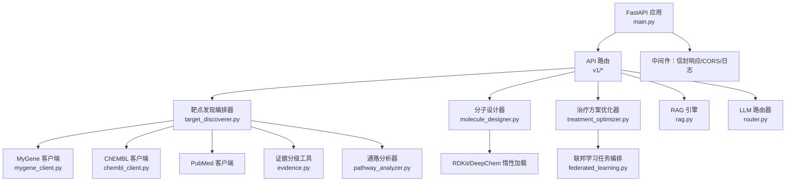
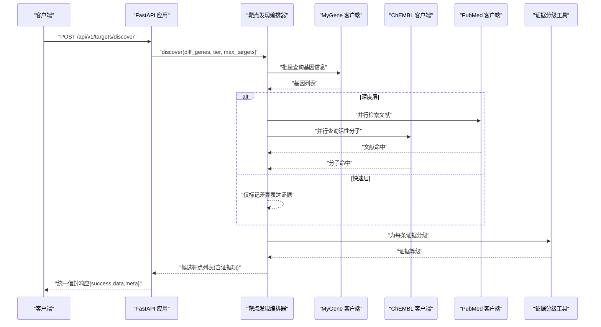
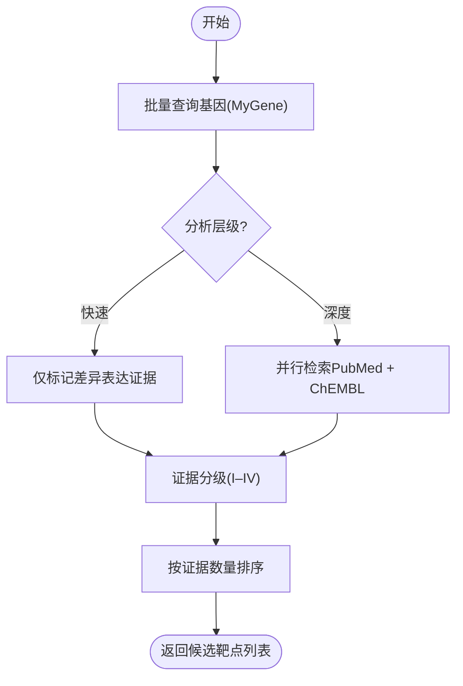
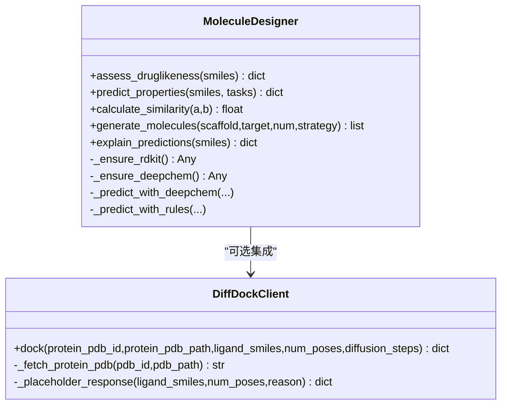
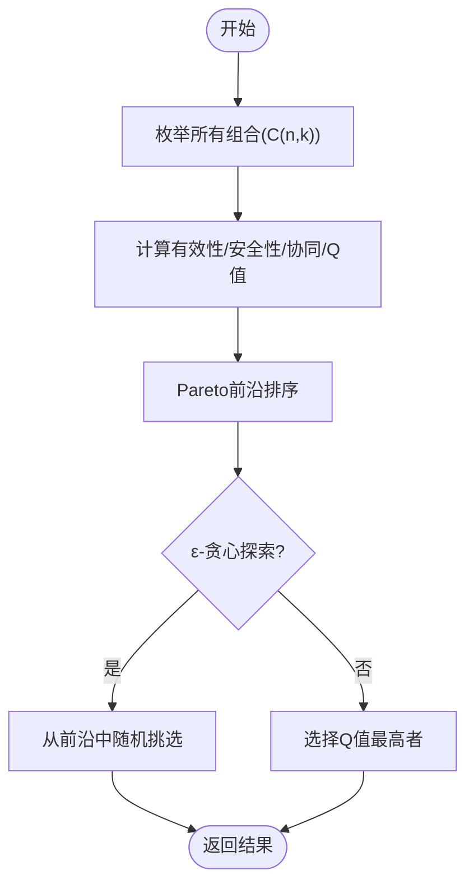
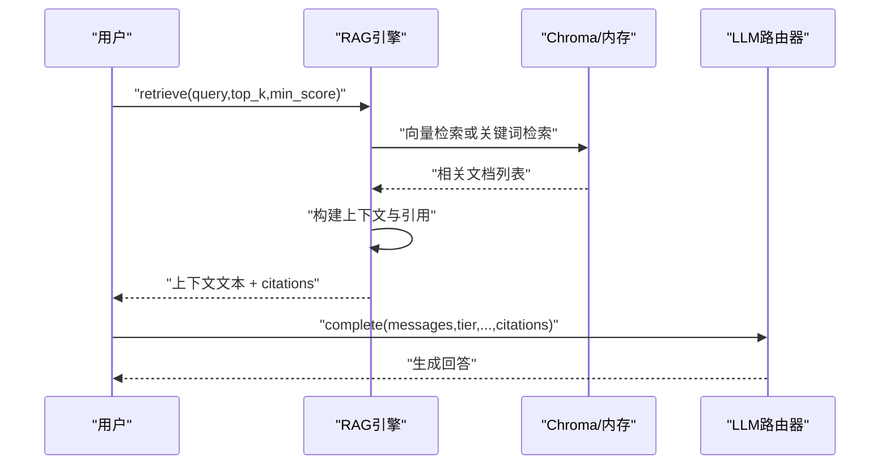
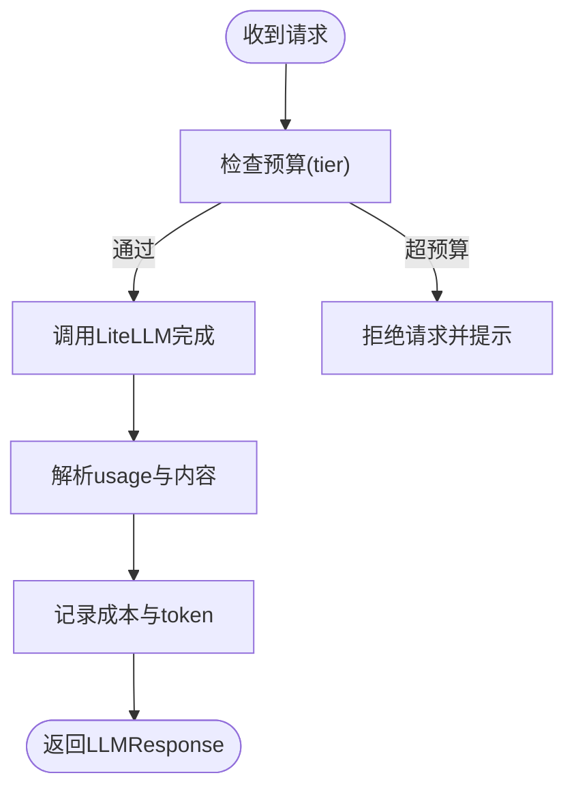
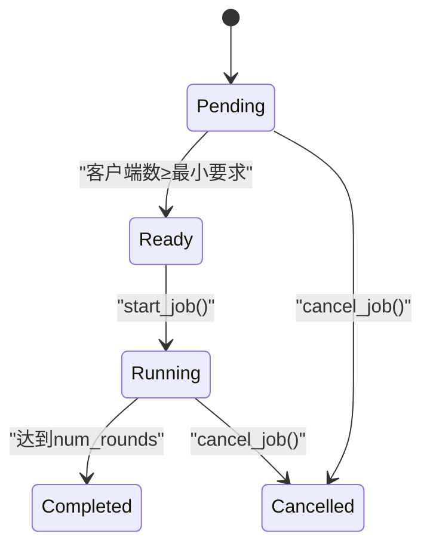
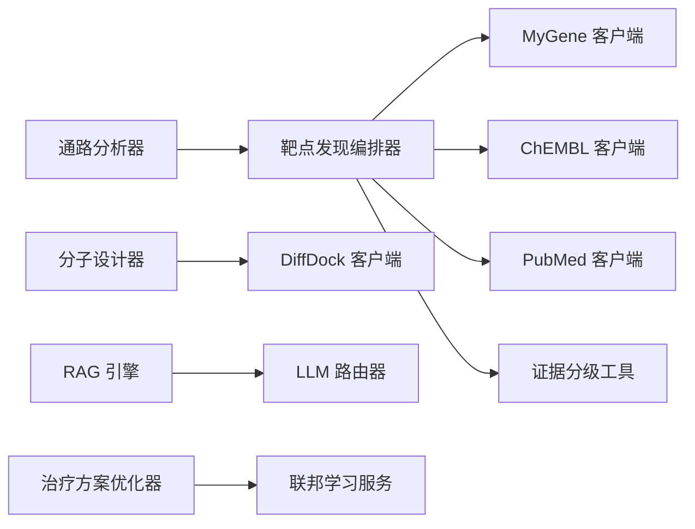

# AI引擎与算法

<cite>
**本文引用的文件**
- [backend/app/main.py](file://backend/app/main.py)
- [backend/app/services/analyzer/target_discoverer.py](file://backend/app/services/analyzer/target_discoverer.py)
- [backend/app/services/analyzer/molecule_designer.py](file://backend/app/services/analyzer/molecule_designer.py)
- [backend/app/services/optimizer/treatment_optimizer.py](file://backend/app/services/optimizer/treatment_optimizer.py)
- [backend/app/services/llm/rag.py](file://backend/app/services/llm/rag.py)
- [backend/app/services/llm/router.py](file://backend/app/services/llm/router.py)
- [backend/app/services/knowledge/mygene_client.py](file://backend/app/services/knowledge/mygene_client.py)
- [backend/app/services/knowledge/chembl_client.py](file://backend/app/services/knowledge/chembl_client.py)
- [backend/app/services/analyzer/pathway_analyzer.py](file://backend/app/services/analyzer/pathway_analyzer.py)
- [backend/app/services/optimizer/federated_learning.py](file://backend/app/services/optimizer/federated_learning.py)
- [backend/app/utils/evidence.py](file://backend/app/utils/evidence.py)
</cite>

## 目录
1. [引言](#引言)
2. [项目结构](#项目结构)
3. [核心组件](#核心组件)
4. [架构总览](#架构总览)
5. [详细组件分析](#详细组件分析)
6. [依赖关系分析](#依赖关系分析)
7. [性能考量](#性能考量)
8. [故障排查指南](#故障排查指南)
9. [结论](#结论)
10. [附录](#附录)

## 引言
本文件面向AI研究人员与算法工程师，系统性梳理精准药物设计系统中的AI引擎与算法实现，覆盖：
- AI靶点发现：多组学差异基因到候选靶点的证据聚合与分级
- 分子设计与评估：类药性、ADMET预测、相似性与生成式策略（简化版）
- 治疗方案优化：组合搜索、Q值近似、Pareto前沿与探索策略
- RAG检索增强生成：向量库检索与上下文注入
- LLM路由与成本管控：快速/深度分层调用与预算控制
- 联邦学习：多中心协同训练任务编排与指标追踪
- 通路富集分析：差异基因的通路富集与显著性过滤

## 项目结构
后端采用FastAPI应用入口统一注册中间件、异常处理器与路由；AI能力以服务层模块组织，按“分析器/优化器/知识库/LLM”等职责划分。

图表来源
- [backend/app/main.py:187-248](file://backend/app/main.py#L187-L248)
- [backend/app/services/analyzer/target_discoverer.py:26-176](file://backend/app/services/analyzer/target_discoverer.py#L26-L176)
- [backend/app/services/analyzer/molecule_designer.py:20-689](file://backend/app/services/analyzer/molecule_designer.py#L20-L689)
- [backend/app/services/optimizer/treatment_optimizer.py:66-363](file://backend/app/services/optimizer/treatment_optimizer.py#L66-L363)
- [backend/app/services/llm/rag.py:35-238](file://backend/app/services/llm/rag.py#L35-L238)
- [backend/app/services/llm/router.py:55-198](file://backend/app/services/llm/router.py#L55-L198)
- [backend/app/services/knowledge/mygene_client.py:19-97](file://backend/app/services/knowledge/mygene_client.py#L19-L97)
- [backend/app/services/knowledge/chembl_client.py:20-127](file://backend/app/services/knowledge/chembl_client.py#L20-L127)
- [backend/app/services/analyzer/pathway_analyzer.py:13-105](file://backend/app/services/analyzer/pathway_analyzer.py#L13-L105)
- [backend/app/services/optimizer/federated_learning.py:53-199](file://backend/app/services/optimizer/federated_learning.py#L53-L199)
- [backend/app/utils/evidence.py:39-103](file://backend/app/utils/evidence.py#L39-L103)

章节来源
- [backend/app/main.py:187-248](file://backend/app/main.py#L187-L248)

## 核心组件
- 靶点发现编排器：整合多源知识库，对差异基因进行证据聚合与分级，输出候选靶点列表。
- 分子设计器：基于RDKit的类药性评估、ADMET规则/模型预测、相似度计算与简化生成策略；可选DiffDock对接。
- 治疗方案优化器：组合枚举+Q值近似+Pareto前沿选择，支持ε-贪心与UCB启发探索。
- RAG引擎：Chroma向量检索或内存关键词降级，构建LLM上下文并附带引用。
- LLM路由器：LiteLLM统一接口，快速/深度分层、预算控制与成本记录。
- 联邦学习服务：任务创建、客户端注册、轮次指标更新与状态管理。
- 通路分析器：gseapy富集分析或降级占位结果。
- 证据分级工具：依据来源类型与载荷推断I–IV级证据等级。

章节来源
- [backend/app/services/analyzer/target_discoverer.py:26-176](file://backend/app/services/analyzer/target_discoverer.py#L26-L176)
- [backend/app/services/analyzer/molecule_designer.py:20-689](file://backend/app/services/analyzer/molecule_designer.py#L20-L689)
- [backend/app/services/optimizer/treatment_optimizer.py:66-363](file://backend/app/services/optimizer/treatment_optimizer.py#L66-L363)
- [backend/app/services/llm/rag.py:35-238](file://backend/app/services/llm/rag.py#L35-L238)
- [backend/app/services/llm/router.py:55-198](file://backend/app/services/llm/router.py#L55-L198)
- [backend/app/services/optimizer/federated_learning.py:53-199](file://backend/app/services/optimizer/federated_learning.py#L53-L199)
- [backend/app/services/analyzer/pathway_analyzer.py:13-105](file://backend/app/services/analyzer/pathway_analyzer.py#L13-L105)
- [backend/app/utils/evidence.py:39-103](file://backend/app/utils/evidence.py#L39-L103)

## 架构总览
系统以FastAPI为入口，通过中间件统一请求ID、耗时与信封响应；业务由服务层编排，外部知识源通过HTTP客户端访问，LLM与向量库按需惰性加载，失败时自动降级。

图表来源
- [backend/app/main.py:187-248](file://backend/app/main.py#L187-L248)
- [backend/app/services/analyzer/target_discoverer.py:52-139](file://backend/app/services/analyzer/target_discoverer.py#L52-L139)
- [backend/app/services/knowledge/mygene_client.py:74-92](file://backend/app/services/knowledge/mygene_client.py#L74-L92)
- [backend/app/services/knowledge/chembl_client.py:48-70](file://backend/app/services/knowledge/chembl_client.py#L48-L70)
- [backend/app/utils/evidence.py:39-75](file://backend/app/utils/evidence.py#L39-L75)

## 详细组件分析

### 靶点发现算法
- 输入：差异基因符号列表（可来自scRNA-seq/RNA-seq/VCF）。
- 流程：
  - 批量查询基因注释（MyGene），分批避免超限。
  - 根据层级选择检索范围：快速层仅标记差异表达；深度层并行检索PubMed与ChEMBL。
  - 使用证据分级工具将每条证据标注为I–IV级，统计证据数量并排序。
- 复杂度：
  - 时间主要取决于外部API并发延迟；本地处理为线性扫描与排序。
- 关键参数：
  - analysis_tier: "quick"/"deep"
  - max_targets: 返回上限
  - 批大小: 50（内部实现）
- 错误处理：
  - 外部调用异常被捕获并记录警告，继续推进其他分支。
- 调试建议：
  - 开启日志查看各阶段耗时与失败原因；优先验证MyGene批量查询是否成功。

图表来源
- [backend/app/services/analyzer/target_discoverer.py:52-139](file://backend/app/services/analyzer/target_discoverer.py#L52-L139)
- [backend/app/services/knowledge/mygene_client.py:74-92](file://backend/app/services/knowledge/mygene_client.py#L74-L92)
- [backend/app/utils/evidence.py:39-75](file://backend/app/utils/evidence.py#L39-L75)

章节来源
- [backend/app/services/analyzer/target_discoverer.py:26-176](file://backend/app/services/analyzer/target_discoverer.py#L26-L176)
- [backend/app/services/knowledge/mygene_client.py:19-97](file://backend/app/services/knowledge/mygene_client.py#L19-L97)
- [backend/app/services/knowledge/chembl_client.py:20-127](file://backend/app/services/knowledge/chembl_client.py#L20-L127)
- [backend/app/utils/evidence.py:39-103](file://backend/app/utils/evidence.py#L39-L103)

### 分子设计与评估算法
- 类药性评估：
  - 使用RDKit计算分子量、LogP、HBD/HBA、旋转键、TPSA，判断Lipinski五规则与Veber规则，计算QED。
- ADMET性质预测：
  - 优先尝试DeepChem预训练模型（如Tox21/Delaney），失败则回退至规则模型（ESOL近似、阈值判定）。
- 相似度与生成：
  - Tanimoto相似度（Morgan指纹）；简化片段组装与随机生成策略用于演示。
- DiffDock对接：
  - 通过NVIDIA NIM API执行对接，不可用时返回降级占位响应。
- 可解释性：
  - 基于规则的SHAP风格特征贡献估算。
- 关键参数：
  - tasks: ["toxicity","solubility","bioavailability","bbb_permeability",...]
  - strategy: "fragment"/"optimization"/"random"
  - num_molecules: 生成数量
- 性能与降级：
  - RDKit/DeepChem惰性加载，缺失时降级为规则模型；网络调用设置超时与重试。

图表来源
- [backend/app/services/analyzer/molecule_designer.py:20-689](file://backend/app/services/analyzer/molecule_designer.py#L20-L689)

章节来源
- [backend/app/services/analyzer/molecule_designer.py:20-689](file://backend/app/services/analyzer/molecule_designer.py#L20-L689)

### 治疗方案优化算法
- 目标：在有效性、安全性与协同效应之间权衡，寻找Pareto最优组合。
- 方法：
  - 组合枚举（C(n,k)），评分函数包含有效性、安全性、协同效应与复杂度惩罚。
  - Q值近似：Q = α·efficacy + β·safety + γ·synergy − δ·complexity。
  - Pareto前沿排序，ε-贪心探索避免局部最优。
  - UCB启发推荐下一个探索组合。
- 关键参数：
  - alpha/beta/gamma/delta: 权重与复杂度惩罚
  - epsilon: ε-贪心概率
  - synergy_matrix: 靶点对协同效应矩阵
- 输出：
  - Pareto前沿、Top组合、Q表规模、评估总数与权重说明。

图表来源
- [backend/app/services/optimizer/treatment_optimizer.py:102-165](file://backend/app/services/optimizer/treatment_optimizer.py#L102-L165)
- [backend/app/services/optimizer/treatment_optimizer.py:167-230](file://backend/app/services/optimizer/treatment_optimizer.py#L167-L230)
- [backend/app/services/optimizer/treatment_optimizer.py:232-266](file://backend/app/services/optimizer/treatment_optimizer.py#L232-L266)
- [backend/app/services/optimizer/treatment_optimizer.py:311-362](file://backend/app/services/optimizer/treatment_optimizer.py#L311-L362)

章节来源
- [backend/app/services/optimizer/treatment_optimizer.py:66-363](file://backend/app/services/optimizer/treatment_optimizer.py#L66-L363)

### RAG检索增强生成
- 文档入库：支持Chroma持久化集合或内存备份；添加文档时同步写入内存。
- 检索：
  - Chroma向量检索（cosine距离转相似度），低于阈值过滤。
  - 降级为Jaccard关键词检索。
- 上下文构建：
  - 将top-k结果拼接为上下文文本，附带引用元数据供LLM使用。
- 关键参数：
  - persist_dir/collection_name/embedding_model
  - top_k/min_score

图表来源
- [backend/app/services/llm/rag.py:126-238](file://backend/app/services/llm/rag.py#L126-L238)
- [backend/app/services/llm/router.py:92-171](file://backend/app/services/llm/router.py#L92-L171)

章节来源
- [backend/app/services/llm/rag.py:35-238](file://backend/app/services/llm/rag.py#L35-L238)
- [backend/app/services/llm/router.py:55-198](file://backend/app/services/llm/router.py#L55-L198)

### LLM路由与成本管控
- 分层模型：
  - 快速层：轻量模型，适合分类/简单问答。
  - 深度层：强推理模型，适合报告生成/综合推理。
- 预算控制：
  - 每次调用前检查预算，超出则拒绝；记录token用量与估算费用。
- 降级与健壮性：
  - 未安装litellm时抛出明确错误；调用失败抛出运行时异常。
- 关键参数：
  - tier: "quick"/"deep"
  - temperature/max_tokens
  - llm_default_model/llm_deep_model/llm_max_budget_usd

图表来源
- [backend/app/services/llm/router.py:92-171](file://backend/app/services/llm/router.py#L92-L171)

章节来源
- [backend/app/services/llm/router.py:55-198](file://backend/app/services/llm/router.py#L55-L198)

### 联邦学习服务
- 功能：
  - 创建任务、注册客户端、启动训练、更新轮次指标、取消任务。
- 状态机：
  - pending → ready → running → completed/cancelled
- 适用场景：
  - 多中心协作训练，服务端负责任务编排与进度跟踪（生产环境需替换为Flower服务端与数据库）。

图表来源
- [backend/app/services/optimizer/federated_learning.py:53-199](file://backend/app/services/optimizer/federated_learning.py#L53-L199)

章节来源
- [backend/app/services/optimizer/federated_learning.py:53-199](file://backend/app/services/optimizer/federated_learning.py#L53-L199)

### 通路富集分析
- 功能：
  - 使用gseapy对差异基因进行KEGG/Reactome富集分析，返回通路名称、p值、调整p值与重叠基因。
- 降级：
  - gseapy未安装时返回占位结果，保证流程不中断。
- 关键参数：
  - gene_list/background/top_n/p_threshold

章节来源
- [backend/app/services/analyzer/pathway_analyzer.py:13-105](file://backend/app/services/analyzer/pathway_analyzer.py#L13-L105)

## 依赖关系分析
- 外部依赖：
  - MyGene.info、ChEMBL、PubMed、NVIDIA NIM（DiffDock）、Chroma、LiteLLM、RDKit、DeepChem、gseapy。
- 内部耦合：
  - 靶点发现编排器依赖多个知识库客户端与证据分级工具。
  - 分子设计器与DiffDock客户端解耦，支持降级。
  - RAG与LLM路由器松耦合，通过citations传递上下文。
- 潜在循环：
  - 当前未发现直接循环依赖；服务间通过接口调用，保持低耦合。

图表来源
- [backend/app/services/analyzer/target_discoverer.py:26-176](file://backend/app/services/analyzer/target_discoverer.py#L26-L176)
- [backend/app/services/analyzer/molecule_designer.py:20-689](file://backend/app/services/analyzer/molecule_designer.py#L20-L689)
- [backend/app/services/optimizer/treatment_optimizer.py:66-363](file://backend/app/services/optimizer/treatment_optimizer.py#L66-L363)
- [backend/app/services/llm/rag.py:35-238](file://backend/app/services/llm/rag.py#L35-L238)
- [backend/app/services/llm/router.py:55-198](file://backend/app/services/llm/router.py#L55-L198)
- [backend/app/services/analyzer/pathway_analyzer.py:13-105](file://backend/app/services/analyzer/pathway_analyzer.py#L13-L105)

章节来源
- [backend/app/services/analyzer/target_discoverer.py:26-176](file://backend/app/services/analyzer/target_discoverer.py#L26-L176)
- [backend/app/services/analyzer/molecule_designer.py:20-689](file://backend/app/services/analyzer/molecule_designer.py#L20-L689)
- [backend/app/services/optimizer/treatment_optimizer.py:66-363](file://backend/app/services/optimizer/treatment_optimizer.py#L66-L363)
- [backend/app/services/llm/rag.py:35-238](file://backend/app/services/llm/rag.py#L35-L238)
- [backend/app/services/llm/router.py:55-198](file://backend/app/services/llm/router.py#L55-L198)
- [backend/app/services/analyzer/pathway_analyzer.py:13-105](file://backend/app/services/analyzer/pathway_analyzer.py#L13-L105)

## 性能考量
- 并发与批处理：
  - 靶点发现中对PubMed与ChEMBL并行调用，减少端到端延迟；MyGene批量查询分批次提交。
- 惰性加载与降级：
  - RDKit/DeepChem/LiteLLM/Chroma/gseapy均惰性加载，缺失时降级为规则或内存方案，保障可用性。
- 资源限制：
  - HTTP客户端配置超时与重试；DiffDock与NIM调用设置较长超时以避免阻塞。
- 缓存与持久化：
  - Chroma持久化集合避免重复嵌入；RAG内存备份确保检索可用。
- 监控与度量：
  - 中间件注入X-Request-ID与X-Response-Time-ms，便于链路追踪与性能分析。

[本节为通用指导，无需特定文件来源]

## 故障排查指南
- 常见错误与定位：
  - RDKit/DeepChem未安装：分子设计器会抛出错误或降级为规则模型；确认依赖安装或启用规则路径。
  - Chroma未安装：RAG降级为内存关键词检索；检查chromadb安装与持久化目录权限。
  - LiteLLM未安装：LLM路由器抛出运行时错误；安装依赖或切换离线模式。
  - 外部API失败：日志记录警告，检查网络、密钥与限流；必要时启用重试与熔断。
- 调试技巧：
  - 使用统一信封响应中的duration_ms与X-Response-Time-ms定位慢请求。
  - 打开详细日志，关注“降级”“失败”“警告”关键字。
  - 针对靶点发现，先验证MyGene批量查询结果再逐步引入深度检索。

章节来源
- [backend/app/main.py:29-185](file://backend/app/main.py#L29-L185)
- [backend/app/services/analyzer/molecule_designer.py:34-70](file://backend/app/services/analyzer/molecule_designer.py#L34-L70)
- [backend/app/services/llm/rag.py:62-88](file://backend/app/services/llm/rag.py#L62-L88)
- [backend/app/services/llm/router.py:80-90](file://backend/app/services/llm/router.py#L80-L90)

## 结论
该AI引擎与算法体系以模块化服务为核心，结合多源知识库、向量检索与大模型路由，形成从靶点发现、分子设计到方案优化的完整闭环。通过惰性加载与多级降级策略，系统在依赖缺失或外部服务不可用时仍能提供稳定能力。未来可在以下方面持续优化：
- 强化学习策略网络训练与在线更新
- 更丰富的生成式分子设计（SMILES LSTM/GAN/图生成）
- 更完善的ADMET深度学习模型与基准评测
- 向量检索质量提升（混合检索、重排、去噪）
- 联邦学习服务端与隐私保护机制完善

[本节为总结性内容，无需特定文件来源]

## 附录
- 参数配置参考：
  - 靶点发现：analysis_tier、max_targets、批大小
  - 分子设计：tasks、strategy、num_molecules、DiffDock参数
  - 方案优化：alpha/beta/gamma/delta、epsilon、synergy_matrix
  - RAG：persist_dir、collection_name、embedding_model、top_k、min_score
  - LLM路由：tier、temperature、max_tokens、预算上限
  - 通路分析：background、top_n、p_threshold
- 代码示例路径（不含具体代码内容）：
  - 靶点发现主流程：[backend/app/services/analyzer/target_discoverer.py:52-139](file://backend/app/services/analyzer/target_discoverer.py#L52-L139)
  - 分子类药性与ADMET：[backend/app/services/analyzer/molecule_designer.py:71-160](file://backend/app/services/analyzer/molecule_designer.py#L71-L160)
  - 组合优化与Pareto排序：[backend/app/services/optimizer/treatment_optimizer.py:102-266](file://backend/app/services/optimizer/treatment_optimizer.py#L102-L266)
  - RAG检索与上下文构建：[backend/app/services/llm/rag.py:126-238](file://backend/app/services/llm/rag.py#L126-L238)
  - LLM路由与成本记录：[backend/app/services/llm/router.py:92-171](file://backend/app/services/llm/router.py#L92-L171)
  - 联邦学习任务编排：[backend/app/services/optimizer/federated_learning.py:60-199](file://backend/app/services/optimizer/federated_learning.py#L60-L199)
  - 通路富集与显著性过滤：[backend/app/services/analyzer/pathway_analyzer.py:34-105](file://backend/app/services/analyzer/pathway_analyzer.py#L34-L105)
  - 证据分级与汇总：[backend/app/utils/evidence.py:39-103](file://backend/app/utils/evidence.py#L39-L103)