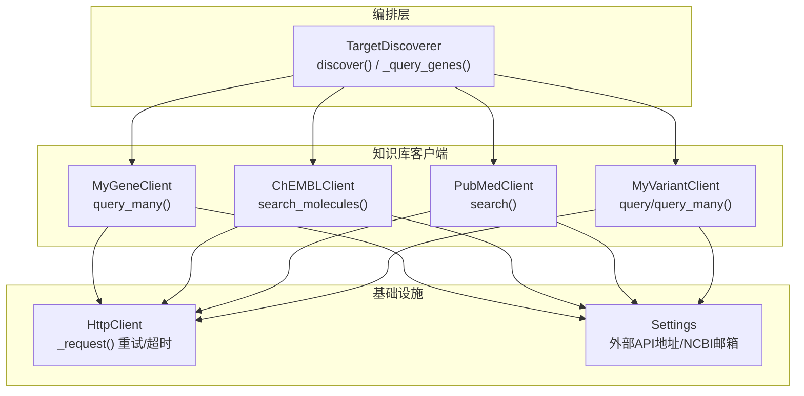
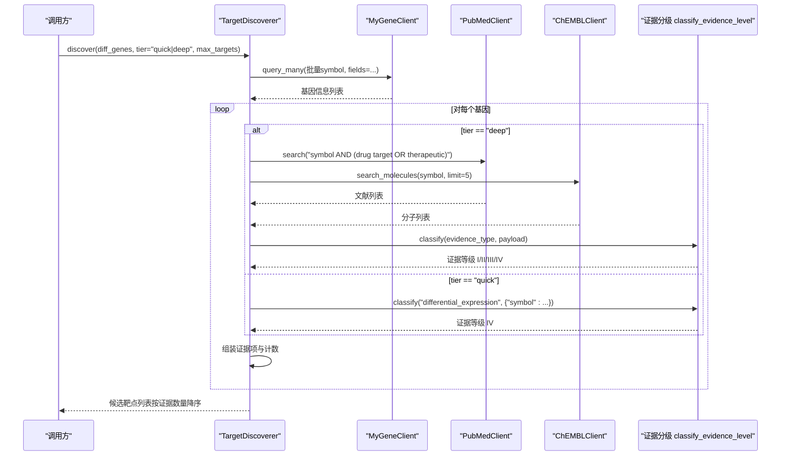
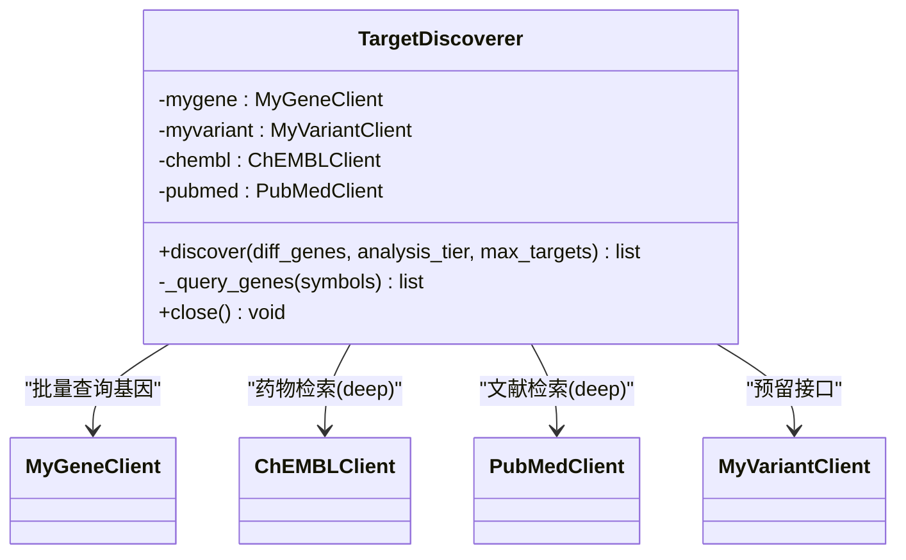
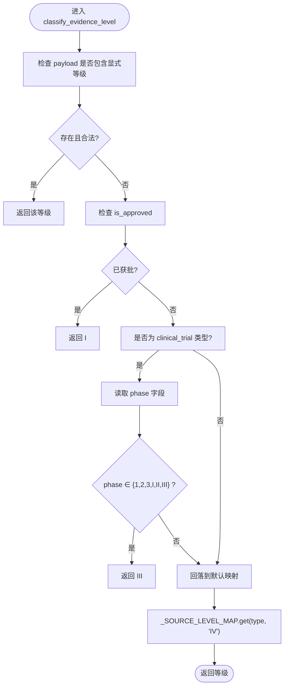
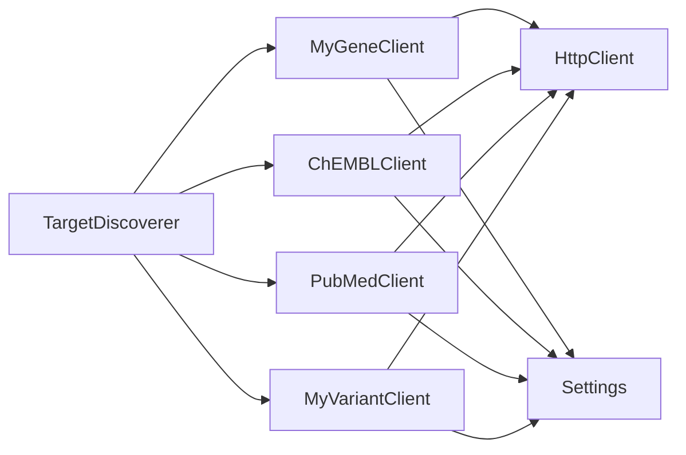

# AI靶点发现引擎

<cite>
**本文引用的文件**   
- [target_discoverer.py](file://precision-drug-design/backend/app/services/analyzer/target_discoverer.py)
- [evidence.py](file://precision-drug-design/backend/app/utils/evidence.py)
- [mygene_client.py](file://precision-drug-design/backend/app/services/knowledge/mygene_client.py)
- [chembl_client.py](file://precision-drug-design/backend/app/services/knowledge/chembl_client.py)
- [pubmed_client.py](file://precision-drug-design/backend/app/services/knowledge/pubmed_client.py)
- [myvariant_client.py](file://precision-drug-design/backend/app/services/knowledge/myvariant_client.py)
- [http_client.py](file://precision-drug-design/backend/app/utils/http_client.py)
- [config.py](file://precision-drug-design/backend/app/core/config.py)
</cite>

## 目录
1. [简介](#简介)
2. [项目结构](#项目结构)
3. [核心组件](#核心组件)
4. [架构总览](#架构总览)
5. [详细组件分析](#详细组件分析)
6. [依赖关系分析](#依赖关系分析)
7. [性能与优化](#性能与优化)
8. [故障排查指南](#故障排查指南)
9. [结论](#结论)
10. [附录：使用示例与最佳实践](#附录使用示例与最佳实践)

## 简介
本技术文档面向“AI靶点发现引擎”，聚焦多组学数据整合、差异表达分析、知识库检索、证据分级排序等核心算法，并深入解析 TargetDiscoverer 类的实现原理，包括异步并行查询机制、批量数据处理策略与错误处理机制。同时文档化 MyGene、ChEMBL、PubMed、MyVariant 等外部知识库的集成方式，解释证据等级分类算法（classify_evidence_level）的实现逻辑和评分标准，并提供快速筛查模式与深度洞察模式的实用使用指南，以及性能优化技巧、API调用限制处理与结果缓存策略。

## 项目结构
围绕靶点发现的核心代码位于后端服务层，关键模块如下：
- 编排器：TargetDiscoverer，负责协调多个知识库客户端，完成从差异基因到候选靶点的端到端流程。
- 知识库客户端：MyGeneClient、ChEMBLClient、PubMedClient、MyVariantClient，封装对外部数据库的HTTP访问。
- 工具与基础设施：HttpClient（统一重试/超时/错误）、配置中心（Settings）。

图表来源
- [target_discoverer.py:52-139](file://precision-drug-design/backend/app/services/analyzer/target_discoverer.py#L52-L139)
- [mygene_client.py:74-92](file://precision-drug-design/backend/app/services/knowledge/mygene_client.py#L74-L92)
- [chembl_client.py:48-70](file://precision-drug-design/backend/app/services/knowledge/chembl_client.py#L48-L70)
- [pubmed_client.py:33-98](file://precision-drug-design/backend/app/services/knowledge/pubmed_client.py#L33-L98)
- [myvariant_client.py:47-80](file://precision-drug-design/backend/app/services/knowledge/myvariant_client.py#L47-L80)
- [http_client.py:60-112](file://precision-drug-design/backend/app/utils/http_client.py#L60-L112)
- [config.py:68-76](file://precision-drug-design/backend/app/core/config.py#L68-L76)

章节来源
- [target_discoverer.py:1-176](file://precision-drug-design/backend/app/services/analyzer/target_discoverer.py#L1-L176)
- [mygene_client.py:1-97](file://precision-drug-design/backend/app/services/knowledge/mygene_client.py#L1-L97)
- [chembl_client.py:1-127](file://precision-drug-design/backend/app/services/knowledge/chembl_client.py#L1-L127)
- [pubmed_client.py:1-125](file://precision-drug-design/backend/app/services/knowledge/pubmed_client.py#L1-L125)
- [myvariant_client.py:1-85](file://precision-drug-design/backend/app/services/knowledge/myvariant_client.py#L1-L85)
- [http_client.py:1-113](file://precision-drug-design/backend/app/utils/http_client.py#L1-L113)
- [config.py:1-144](file://precision-drug-design/backend/app/core/config.py#L1-L144)

## 核心组件
- TargetDiscoverer：编排器，接收差异基因列表，按层级（quick/deep）触发不同深度的知识库检索，聚合证据并输出候选靶点。
- 证据分级工具：classify_evidence_level 根据证据类型与载荷推断证据等级（I/II/III/IV），并提供统计与最高等级计算辅助函数。
- 知识库客户端：分别封装 MyGene、ChEMBL、PubMed、MyVariant 的REST API调用，提供批量查询、搜索、详情获取等方法。
- HttpClient：统一的HTTP客户端，内置指数退避重试、超时控制与上游错误包装。
- Settings：集中管理外部API地址、NCBI邮箱等配置项。

章节来源
- [target_discoverer.py:26-176](file://precision-drug-design/backend/app/services/analyzer/target_discoverer.py#L26-L176)
- [evidence.py:39-103](file://precision-drug-design/backend/app/utils/evidence.py#L39-L103)
- [mygene_client.py:19-97](file://precision-drug-design/backend/app/services/knowledge/mygene_client.py#L19-L97)
- [chembl_client.py:20-127](file://precision-drug-design/backend/app/services/knowledge/chembl_client.py#L20-L127)
- [pubmed_client.py:16-125](file://precision-drug-design/backend/app/services/knowledge/pubmed_client.py#L16-L125)
- [myvariant_client.py:19-85](file://precision-drug-design/backend/app/services/knowledge/myvariant_client.py#L19-L85)
- [http_client.py:18-113](file://precision-drug-design/backend/app/utils/http_client.py#L18-L113)
- [config.py:21-144](file://precision-drug-design/backend/app/core/config.py#L21-L144)

## 架构总览
下图展示了从输入差异基因到输出候选靶点的完整流程，包括批量基因注释、并行文献与药物检索、证据分级与排序。

图表来源
- [target_discoverer.py:52-139](file://precision-drug-design/backend/app/services/analyzer/target_discoverer.py#L52-L139)
- [mygene_client.py:74-92](file://precision-drug-design/backend/app/services/knowledge/mygene_client.py#L74-L92)
- [pubmed_client.py:33-98](file://precision-drug-design/backend/app/services/knowledge/pubmed_client.py#L33-L98)
- [chembl_client.py:48-70](file://precision-drug-design/backend/app/services/knowledge/chembl_client.py#L48-L70)
- [evidence.py:39-75](file://precision-drug-design/backend/app/utils/evidence.py#L39-L75)

## 详细组件分析

### TargetDiscoverer 类
- 职责：编排多源知识库查询，构建证据项，进行证据分级与排序，返回候选靶点。
- 关键方法：
  - discover：主入口，支持 quick/deep 两种分析层级；内部先批量查询基因信息，再按目标数上限循环处理每个基因；在 deep 模式下并行发起 PubMed 与 ChEMBL 查询；为每条证据调用 classify_evidence_level 进行分级；最终按证据数量降序排序。
  - _query_genes：分批调用 MyGeneClient.query_many 进行批量基因注释，捕获异常并记录日志。
  - close：并发关闭所有客户端连接。
- 异步并行：使用 asyncio.gather 并行执行 PubMed 与 ChEMBL 查询，提升吞吐。
- 批量策略：对 diff_genes 切片至前50个，并在 _query_genes 中以每批50个进行分块查询，避免单次请求过大。
- 错误处理：对上游异常进行捕获与警告记录；close 时忽略单个客户端关闭异常，确保整体健壮性。

图表来源
- [target_discoverer.py:26-176](file://precision-drug-design/backend/app/services/analyzer/target_discoverer.py#L26-L176)

章节来源
- [target_discoverer.py:52-139](file://precision-drug-design/backend/app/services/analyzer/target_discoverer.py#L52-L139)
- [target_discoverer.py:141-176](file://precision-drug-design/backend/app/services/analyzer/target_discoverer.py#L141-L176)

### 证据分级算法（classify_evidence_level）
- 设计原则：优先读取显式等级（payload.evidence_level），其次依据 is_approved 判定为 I 级，再针对 clinical_trial 类型按 phase 判定为 III 级，最后回落到默认映射表。
- 默认映射：将常见证据来源映射到 I/II/III/IV 等级，如 fda_approved/nmpa_approved/chembl_approved_drug → I；nccn_guideline/esmo_guideline/cso_guideline → II；clinical_trial_* → III；clinvar/cosmic/pubmed_case/pathway_analysis/network_inference/differential_expression → IV。
- 辅助函数：aggregate_evidence_levels 统计分布；highest_evidence_level 取最高等级。

图表来源
- [evidence.py:39-75](file://precision-drug-design/backend/app/utils/evidence.py#L39-L75)

章节来源
- [evidence.py:1-103](file://precision-drug-design/backend/app/utils/evidence.py#L1-L103)

### 外部知识库集成

#### MyGeneClient（基因注释）
- 能力：单条 get_gene、关键词 query、批量 query_many（POST，最多1000个ID）。
- 集成要点：通过 Settings 读取 base_url；使用 HttpClient 统一超时与重试；批量查询失败会抛出异常，由上层捕获。

章节来源
- [mygene_client.py:19-97](file://precision-drug-design/backend/app/services/knowledge/mygene_client.py#L19-L97)
- [config.py:68-76](file://precision-drug-design/backend/app/core/config.py#L68-L76)

#### ChEMBLClient（药物与活性）
- 能力：get_molecule、search_molecules、get_activities_for_target、get_approved_drugs_for_indication。
- 集成要点：基于 EBI ChEMBL REST API；参数构造遵循其查询语法；返回结构以 molecules/activities 包裹。

章节来源
- [chembl_client.py:20-127](file://precision-drug-design/backend/app/services/knowledge/chembl_client.py#L20-L127)
- [config.py:68-76](file://precision-drug-design/backend/app/core/config.py#L68-L76)

#### PubMedClient（文献检索）
- 能力：search（esearch+esummary两步）、get_abstract（efetch）。
- 集成要点：遵守 NCBI 限速（sleep 0.4s）；携带 email/tool 标识；返回 pmid/title/authors/journal/pubdate 等摘要信息。

章节来源
- [pubmed_client.py:16-125](file://precision-drug-design/backend/app/services/knowledge/pubmed_client.py#L16-L125)
- [config.py:75-76](file://precision-drug-design/backend/app/core/config.py#L75-L76)

#### MyVariantClient（临床变异）
- 能力：get_variant、query、query_many（POST，最多1000个ID）。
- 集成要点：支持 HGVS/rsID/ClinVar ID；批量查询需遵守上限；返回 clinvar/dbnsfp/cadd 等注释。

章节来源
- [myvariant_client.py:19-85](file://precision-drug-design/backend/app/services/knowledge/myvariant_client.py#L19-L85)
- [config.py:68-76](file://precision-drug-design/backend/app/core/config.py#L68-L76)

### HTTP 客户端与错误处理（HttpClient）
- 功能：封装 GET/POST，统一超时、指数退避重试、状态码错误包装为 UpstreamError。
- 行为：
  - 4xx 不重试，直接抛出 UpstreamError。
  - 5xx 或网络异常进行重试，等待时间按 2^(attempt-1) 递增。
  - 全部失败后抛出 UpstreamError，附带 URL 与最后一次错误信息。

章节来源
- [http_client.py:18-113](file://precision-drug-design/backend/app/utils/http_client.py#L18-L113)

## 依赖关系分析
- 编排器依赖四个知识库客户端；各客户端均依赖 HttpClient 与 Settings。
- 证据分级工具无外部依赖，纯函数式实现。
- 潜在耦合点：
  - 若外部API返回结构变化，需在各客户端中适配。
  - 若 NCBI 限速策略调整，需更新 PubMedClient 中的 sleep 间隔。
  - 批量大小限制（MyGene/MyVariant 1000）需在调用侧保证合规。

图表来源
- [target_discoverer.py:19-23](file://precision-drug-design/backend/app/services/analyzer/target_discoverer.py#L19-L23)
- [mygene_client.py:15-16](file://precision-drug-design/backend/app/services/knowledge/mygene_client.py#L15-L16)
- [chembl_client.py:16-17](file://precision-drug-design/backend/app/services/knowledge/chembl_client.py#L16-L17)
- [pubmed_client.py:12-13](file://precision-drug-design/backend/app/services/knowledge/pubmed_client.py#L12-L13)
- [myvariant_client.py:15-16](file://precision-drug-design/backend/app/services/knowledge/myvariant_client.py#L15-L16)
- [http_client.py:18-40](file://precision-drug-design/backend/app/utils/http_client.py#L18-L40)
- [config.py:68-76](file://precision-drug-design/backend/app/core/config.py#L68-L76)

## 性能与优化
- 异步并行：在 deep 模式下使用 asyncio.gather 并行查询 PubMed 与 ChEMBL，显著降低端到端延迟。
- 批量策略：_query_genes 以每批50个进行分块，避免单次请求过大导致超时或被限流。
- 重试与退避：HttpClient 指数退避重试，提高对瞬态失败的鲁棒性。
- 速率限制：PubMedClient 在 esearch 与 esummary 之间插入 sleep，满足 NCBI 3 req/s 的限制。
- 结果缓存建议：
  - 对 gene_infos 与分子搜索结果增加本地内存缓存（例如 LRU），键可基于 symbol 与查询参数。
  - 对高频证据项（如已批准药物）可在 Redis 中持久化缓存，设置合理 TTL。
- 并发度控制：在高并发场景下，可对 gather 的并发任务数进行限制（如信号量），避免下游服务过载。
- 超时调优：根据外部服务稳定性调整 HttpClient 的 timeout 与 max_retries。

[本节为通用指导，无需特定文件引用]

## 故障排查指南
- 上游API返回4xx：HttpClient 直接抛出 UpstreamError，检查请求参数与权限。
- 上游API返回5xx或网络异常：自动重试，关注日志中的重试次数与最后错误信息。
- NCBI 限速：若出现大量空结果或超时，确认 PubMedClient 的 sleep 间隔与并发度。
- 批量查询超限：MyGene/MyVariant 单次最多1000个ID，超出将抛出 ValueError，需在上层拆分批次。
- 配置缺失：Settings 未正确加载 .env 或环境变量，导致 base_url 或 ncbi_email 为空，检查配置加载路径。

章节来源
- [http_client.py:81-112](file://precision-drug-design/backend/app/utils/http_client.py#L81-L112)
- [pubmed_client.py:67-75](file://precision-drug-design/backend/app/services/knowledge/pubmed_client.py#L67-L75)
- [mygene_client.py:88-92](file://precision-drug-design/backend/app/services/knowledge/mygene_client.py#L88-L92)
- [myvariant_client.py:76-80](file://precision-drug-design/backend/app/services/knowledge/myvariant_client.py#L76-L80)
- [config.py:68-76](file://precision-drug-design/backend/app/core/config.py#L68-L76)

## 结论
AI靶点发现引擎通过 TargetDiscoverer 编排多源知识库，结合差异表达分析与证据分级，形成从数据到决策的闭环。其异步并行与批量策略提升了效率，HttpClient 的统一重试与错误处理增强了鲁棒性。证据分级算法提供了透明、可扩展的评分体系，便于后续引入更复杂的加权与机器学习模型。

[本节为总结，无需特定文件引用]

## 附录：使用示例与最佳实践

### 快速筛查模式（quick）
- 适用场景：大规模差异基因初筛，仅标记差异表达证据，快速产出候选靶点。
- 步骤：
  - 准备差异基因 symbol 列表。
  - 调用 TargetDiscoverer.discover(diff_genes, analysis_tier="quick", max_targets=20)。
  - 结果按证据数量排序，通常每个靶点仅含一条 differential_expression 证据（等级 IV）。
- 注意事项：
  - diff_genes 过长会被切分到前50个进行处理。
  - 如需更多上下文，切换到 deep 模式。

章节来源
- [target_discoverer.py:52-139](file://precision-drug-design/backend/app/services/analyzer/target_discoverer.py#L52-L139)

### 深度洞察模式（deep）
- 适用场景：对少量高优先级靶点进行深度证据收集，包括文献与药物活性。
- 步骤：
  - 准备差异基因 symbol 列表。
  - 调用 TargetDiscoverer.discover(diff_genes, analysis_tier="deep", max_targets=20)。
  - 系统并行检索 PubMed 与 ChEMBL，生成 literature 与 drug_activity 证据项，并进行证据分级。
- 注意事项：
  - PubMed 受 NCBI 限速影响，建议在批量调用时控制并发度。
  - ChEMBL 搜索词建议使用规范符号或已知别名，以提高命中率。

章节来源
- [target_discoverer.py:82-113](file://precision-drug-design/backend/app/services/analyzer/target_discoverer.py#L82-L113)
- [pubmed_client.py:33-98](file://precision-drug-design/backend/app/services/knowledge/pubmed_client.py#L33-L98)
- [chembl_client.py:48-70](file://precision-drug-design/backend/app/services/knowledge/chembl_client.py#L48-L70)

### 证据分级与排序
- 分级：每条证据通过 classify_evidence_level 得到等级（I/II/III/IV）。
- 排序：按 evidence_count 降序排列，优先展示证据更丰富的靶点。
- 扩展：可引入 highest_evidence_level 作为筛选阈值，或 aggregate_evidence_levels 用于报告可视化。

章节来源
- [evidence.py:39-103](file://precision-drug-design/backend/app/utils/evidence.py#L39-L103)
- [target_discoverer.py:122-139](file://precision-drug-design/backend/app/services/analyzer/target_discoverer.py#L122-L139)

### 外部知识库集成要点
- MyGene：批量查询时注意 IDs 不超过1000；fields 按需裁剪以减少响应体积。
- ChEMBL：search_molecules 使用 synonym 模糊匹配；活动数据可通过 get_activities_for_target 进一步细化。
- PubMed：遵循限速策略；必要时使用 get_abstract 补充摘要内容。
- MyVariant：批量查询同样受限于1000；fields 选择所需注释以降低带宽。

章节来源
- [mygene_client.py:74-92](file://precision-drug-design/backend/app/services/knowledge/mygene_client.py#L74-L92)
- [chembl_client.py:48-97](file://precision-drug-design/backend/app/services/knowledge/chembl_client.py#L48-L97)
- [pubmed_client.py:33-120](file://precision-drug-design/backend/app/services/knowledge/pubmed_client.py#L33-L120)
- [myvariant_client.py:47-80](file://precision-drug-design/backend/app/services/knowledge/myvariant_client.py#L47-L80)

### 性能优化与缓存策略
- 本地缓存：对 gene_infos 与分子搜索结果建立 LRU 缓存，键包含 symbol 与查询参数。
- 分布式缓存：对高频证据项（如已批准药物）写入 Redis，设置合理 TTL。
- 并发控制：在高并发场景下限制 gather 的任务数，避免下游服务过载。
- 超时与重试：根据外部服务稳定性调整 HttpClient 的 timeout 与 max_retries。

[本节为通用指导，无需特定文件引用]