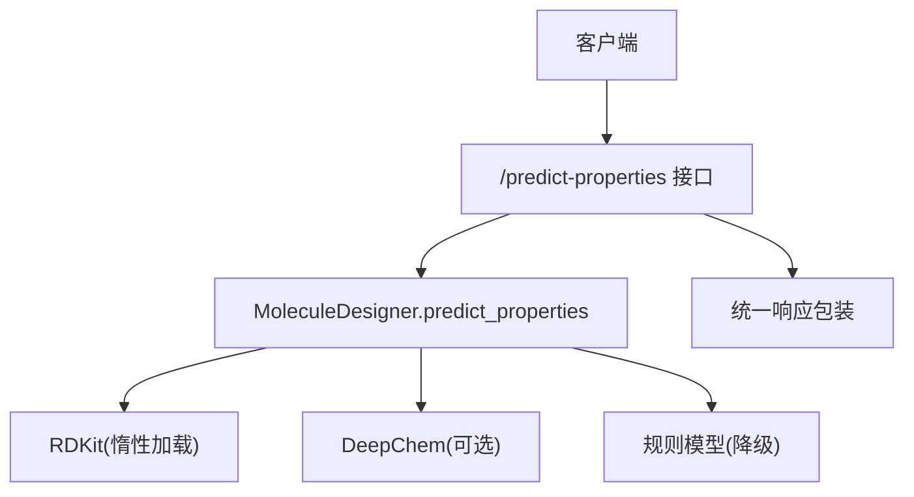
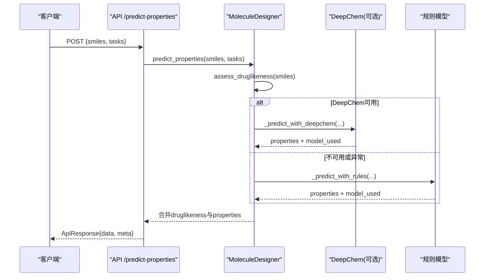
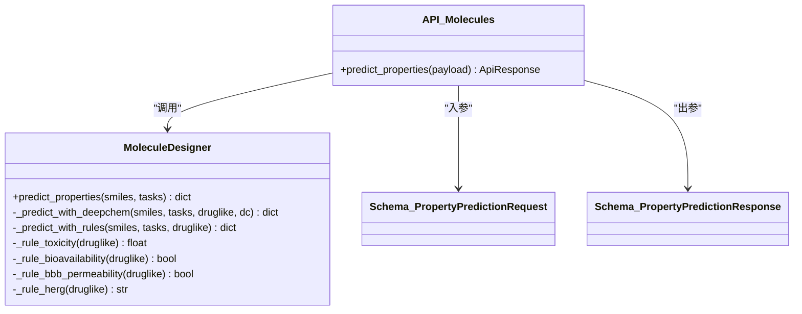
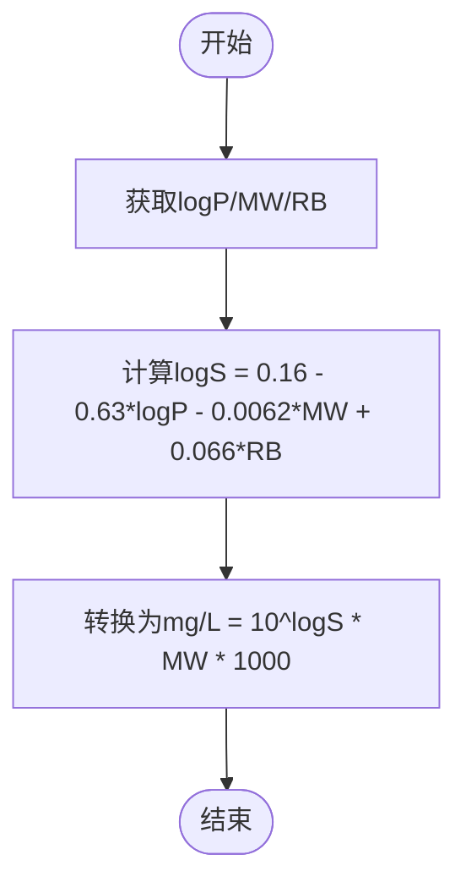

# ADMET性质预测

<cite>
**本文引用的文件**
- [molecule_designer.py](file://backend/app/services/analyzer/molecule_designer.py)
- [molecules.py](file://backend/app/api/v1/molecules.py)
- [molecule.py](file://backend/app/schemas/molecule.py)
- [test_molecule_designer.py](file://tests/test_molecule_designer.py)
</cite>

## 目录
1. [简介](#简介)
2. [项目结构](#项目结构)
3. [核心组件](#核心组件)
4. [架构总览](#架构总览)
5. [详细组件分析](#详细组件分析)
6. [依赖关系分析](#依赖关系分析)
7. [性能与精度评估](#性能与精度评估)
8. [故障排查指南](#故障排查指南)
9. [结论](#结论)
10. [附录](#附录)

## 简介
本文件面向ADMET性质预测功能，聚焦于predict_properties方法的实现细节、模型选择策略与降级机制，并系统说明毒性、溶解度、口服生物利用度、血脑屏障通透性等性质的算法逻辑。文档还涵盖ESOL方程在溶解度预测中的应用、规则模型的决策逻辑、预测结果格式、置信度与不确定性表达建议，以及性能对比与精度评估指标的实际落地方式。

## 项目结构
ADMET预测能力位于后端服务层，通过API暴露对外接口：
- 服务层：MoleculeDesigner封装RDKit与DeepChem，提供类药性评估与ADMET预测。
- API层：/predict-properties端点接收SMILES与任务列表，调用服务层进行预测。
- 数据模型：请求/响应Schema定义字段与约束。
- 测试：针对类药性与预测流程的单元测试。

图表来源
- [molecules.py:220-298](file://backend/app/api/v1/molecules.py#L220-L298)
- [molecule_designer.py:136-256](file://backend/app/services/analyzer/molecule_designer.py#L136-L256)

章节来源
- [molecules.py:220-298](file://backend/app/api/v1/molecules.py#L220-L298)
- [molecule_designer.py:136-256](file://backend/app/services/analyzer/molecule_designer.py#L136-L256)
- [molecule.py:95-112](file://backend/app/schemas/molecule.py#L95-L112)

## 核心组件
- MoleculeDesigner.predict_properties：入口方法，负责任务路由、模型选择与降级。
- _predict_with_deepchem：优先使用DeepChem（Tox21/Delaney等），失败时回退到规则模型。
- _predict_with_rules：纯规则模型，基于分子描述符与经验阈值。
- 规则子函数：_rule_toxicity、_rule_bioavailability、_rule_bbb_permeability、_rule_herg。
- ESOL近似：用于溶解度logS与mg/L换算。

章节来源
- [molecule_designer.py:136-256](file://backend/app/services/analyzer/molecule_designer.py#L136-L256)
- [molecule_designer.py:258-293](file://backend/app/services/analyzer/molecule_designer.py#L258-L293)

## 架构总览
预测流程从API进入，先做类药性评估，再尝试DeepChem；若不可用或异常则降级为规则模型。返回结果包含properties字典与model_used标识实际使用的模型路径。

图表来源
- [molecules.py:220-298](file://backend/app/api/v1/molecules.py#L220-L298)
- [molecule_designer.py:136-256](file://backend/app/services/analyzer/molecule_designer.py#L136-L256)

## 详细组件分析

### predict_properties方法与模型选择策略
- 输入：SMILES字符串与可选tasks列表；默认任务包括toxicity、solubility、bioavailability、bbb_permeability。
- 步骤：
  - 先执行assess_druglikeness获取基础描述符与合规性标志。
  - 尝试加载DeepChem；若成功，进入_predict_with_deepchem。
  - 若DeepChem抛出异常或未安装，进入_predict_with_rules。
- 输出：
  - 顶层包含druglikeness相关字段与error信息。
  - properties包含各任务预测值。
  - model_used标识实际使用的模型路径（如deepchem:tox21_graphconv+esol_delaney或rule-based-v1）。

章节来源
- [molecule_designer.py:136-160](file://backend/app/services/analyzer/molecule_designer.py#L136-L160)
- [molecule_designer.py:162-224](file://backend/app/services/analyzer/molecule_designer.py#L162-L224)
- [molecule_designer.py:226-256](file://backend/app/services/analyzer/molecule_designer.py#L226-L256)

#### DeepChem集成与降级
- 毒性(toxicity)：尝试加载Tox21多任务分类器；当前实现为占位评分，异常时回退至_rule_toxicity。
- 溶解度(solubility)：采用ESOL近似计算logS与mg/L，标记为esol_delaney。
- 生物利用度(bioavailability)与BBB通透性(bbb_permeability)：直接走规则模型。
- 当任一任务失败时，记录调试日志并回退到对应规则实现。

章节来源
- [molecule_designer.py:183-216](file://backend/app/services/analyzer/molecule_designer.py#L183-L216)

#### 规则模型决策逻辑
- 毒性(_rule_toxicity)：基于logp与tpsa线性组合，映射到[0,1]区间，数值越高表示毒性风险越大。
- 口服生物利用度(_rule_bioavailability)：综合passes_lipinski、passes_veber与tpsa阈值判断是否可口服。
- BBB通透性(_rule_bbb_permeability)：依据MW<400、logP<5、TPSA<90的经验阈值判定。
- hERG毒性(_rule_herg)：按logP分段给出low/medium/high风险等级。

章节来源
- [molecule_designer.py:258-293](file://backend/app/services/analyzer/molecule_designer.py#L258-L293)

#### ESOL方程在溶解度预测中的应用
- 公式：logS = 0.16 - 0.63*logP - 0.0062*MW + 0.066*RB
- 输出：
  - log_solubility：以mol/L对数表示的溶解度。
  - solubility_mg_l：将logS转换为mg/L，结合分子量与单位换算。
- 适用场景：快速估算水溶性，作为Delaney回归的简化替代。

章节来源
- [molecule_designer.py:195-210](file://backend/app/services/analyzer/molecule_designer.py#L195-L210)
- [molecule_designer.py:237-244](file://backend/app/services/analyzer/molecule_designer.py#L237-L244)

#### 预测结果格式说明
- 顶层字段：
  - smiles：输入SMILES。
  - valid：分子有效性。
  - molecular_weight/logp/hbd/hba/rotatable_bonds/tpsa：描述符。
  - passes_lipinski/passes_veber/qed/violations：类药性评估。
  - error：错误信息（如有）。
  - model_used：实际使用的模型路径。
- properties字段：
  - toxicity_score：毒性评分（0-1）。
  - log_solubility/solubility_mg_l：溶解度对数与质量浓度。
  - oral_bioavailable：布尔值，是否具备口服生物利用度潜力。
  - bbb_permeable：布尔值，是否可能穿透血脑屏障。
  - herg_toxicity_risk：hERG毒性风险等级（low/medium/high）。

章节来源
- [molecule_designer.py:121-134](file://backend/app/services/analyzer/molecule_designer.py#L121-L134)
- [molecule_designer.py:218-224](file://backend/app/services/analyzer/molecule_designer.py#L218-L224)
- [molecule_designer.py:252-256](file://backend/app/services/analyzer/molecule_designer.py#L252-L256)
- [molecule.py:105-112](file://backend/app/schemas/molecule.py#L105-L112)

#### 置信度评估与不确定性量化
- 当前实现未显式输出置信度或不确定性区间。
- 建议扩展：
  - 对分类任务（如toxicity、bbb_permeable）输出概率值与阈值，便于下游设定风险偏好。
  - 对回归任务（如logS）输出标准差或分位数预测，构建置信区间。
  - 引入模型集成或蒙特卡洛Dropout估计不确定性。
  - 在API响应中增加confidence与uncertainty字段，并在前端可视化展示。

[本节为概念性建议，不直接分析具体文件]

#### 实际应用案例
- 示例：阿司匹林SMILES经predict_properties后，应返回valid=True，并包含toxicity_score、log_solubility、oral_bioavailable、bbb_permeable等字段。
- 参考测试断言：
  - 预测结果包含bbb_permeable、oral_bioavailable、herg_toxicity_risk等键。
  - 无效SMILES返回valid=False。

章节来源
- [test_molecule_designer.py:73-85](file://tests/test_molecule_designer.py#L73-L85)

## 依赖关系分析
- 外部依赖：
  - RDKit：惰性加载，用于分子解析与描述符计算。
  - DeepChem：可选，用于Tox21/Delaney等模型；未安装时自动降级。
- 内部耦合：
  - API层仅依赖服务层接口，屏蔽底层实现差异。
  - 规则模型与DeepChem分支互斥，保证鲁棒性。

图表来源
- [molecule_designer.py:136-256](file://backend/app/services/analyzer/molecule_designer.py#L136-L256)
- [molecules.py:220-298](file://backend/app/api/v1/molecules.py#L220-L298)
- [molecule.py:95-112](file://backend/app/schemas/molecule.py#L95-L112)

章节来源
- [molecule_designer.py:136-256](file://backend/app/services/analyzer/molecule_designer.py#L136-L256)
- [molecules.py:220-298](file://backend/app/api/v1/molecules.py#L220-L298)
- [molecule.py:95-112](file://backend/app/schemas/molecule.py#L95-L112)

## 性能与精度评估
- 当前状态：
  - 毒性预测为占位评分，未连接真实预训练模型。
  - 溶解度采用ESOL近似，非深度学习回归。
  - 生物利用度与BBB通透性基于规则阈值。
- 建议评估指标：
  - 分类任务：准确率、精确率、召回率、F1、ROC-AUC、PR-AUC。
  - 回归任务：MAE、RMSE、R²、平均绝对百分比误差(MAPE)。
  - 不确定性：校准曲线、期望校准误差(ECE)、覆盖率与区间宽度。
- 基准数据集：
  - Tox21（毒性）、Delaney（溶解度）、BBBP（BBB通透性）。
- 实验设计：
  - 划分训练/验证/测试集，固定随机种子。
  - 对比DeepChem模型与规则模型的性能差异。
  - 报告不同阈值下的业务影响（如高毒性筛选的假阳性成本）。

[本节为通用指导，不直接分析具体文件]

## 故障排查指南
- RDKit未安装：
  - 现象：API捕获RuntimeError，返回degraded响应与原因。
  - 处理：安装rdkit并重启服务。
- DeepChem未安装或加载失败：
  - 现象：警告日志提示降级为规则模型。
  - 处理：安装deepchem或修复网络下载问题。
- 无效SMILES：
  - 现象：valid=False并附带error信息。
  - 处理：校验输入SMILES合法性。
- 任务缺失或未知：
  - 现象：仅返回支持的任务结果。
  - 处理：检查payload.tasks字段，确保使用toxicity/solubility/bioavailability/bbb_permeability/herg_toxicity。

章节来源
- [molecules.py:268-298](file://backend/app/api/v1/molecules.py#L268-L298)
- [molecule_designer.py:157-160](file://backend/app/services/analyzer/molecule_designer.py#L157-L160)
- [molecule_designer.py:176-178](file://backend/app/services/analyzer/molecule_designer.py#L176-L178)

## 结论
该ADMET预测模块实现了“深度学习优先、规则模型兜底”的稳健架构。当前毒性预测为占位实现，溶解度采用ESOL近似，生物利用度与BBB通透性基于经验规则。建议在后续迭代中接入真实预训练模型、完善不确定性量化与性能评估体系，以提升预测可靠性与可解释性。

[本节为总结性内容，不直接分析具体文件]

## 附录

### API请求与响应字段规范
- 请求：
  - smiles：分子SMILES。
  - tasks：任务列表，支持toxicity、solubility、bioavailability、bbb_permeability、herg_toxicity。
- 响应：
  - data.smiles：输入SMILES。
  - data.properties：各任务预测结果。
  - data.model_used：实际使用的模型路径。
  - data.druglikeness：类药性评估结果。
  - meta.request_id：请求追踪ID。

章节来源
- [molecule.py:95-112](file://backend/app/schemas/molecule.py#L95-L112)
- [molecules.py:220-298](file://backend/app/api/v1/molecules.py#L220-L298)

### 关键流程图（ESOL溶解度）

图表来源
- [molecule_designer.py:195-210](file://backend/app/services/analyzer/molecule_designer.py#L195-L210)
- [molecule_designer.py:237-244](file://backend/app/services/analyzer/molecule_designer.py#L237-L244)