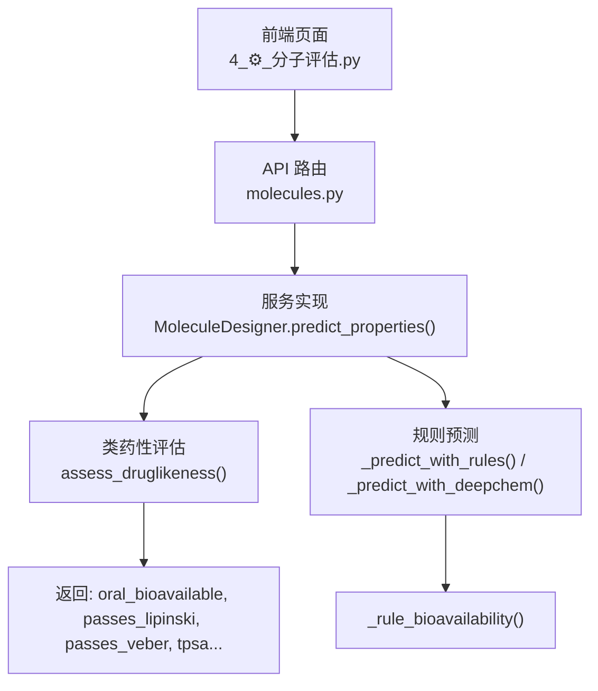
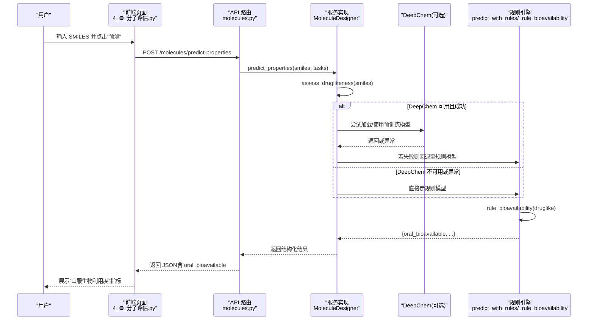
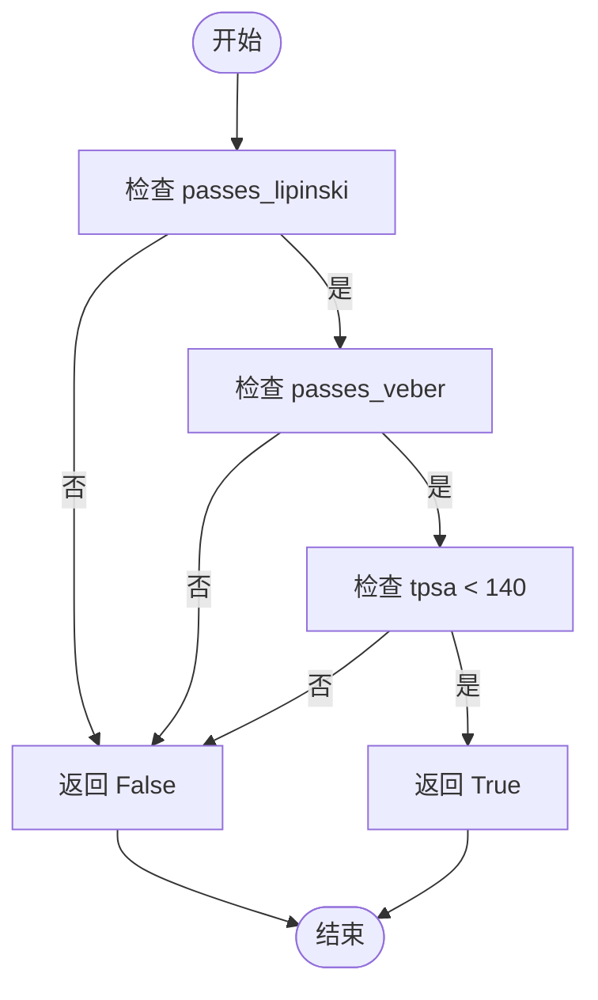
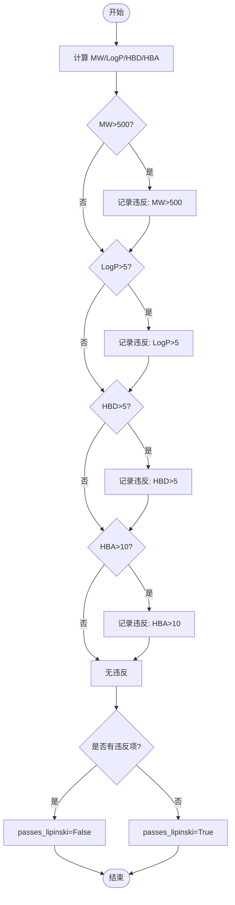
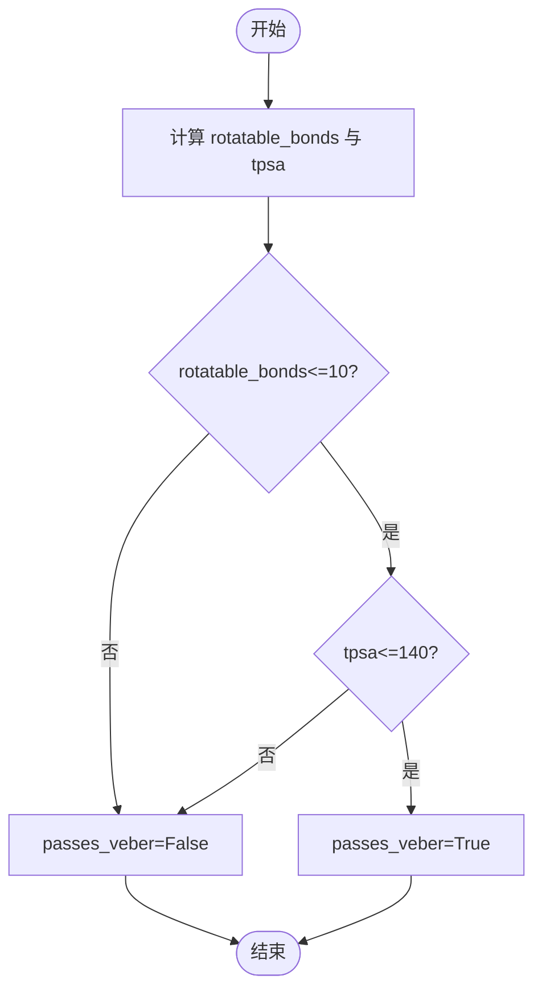
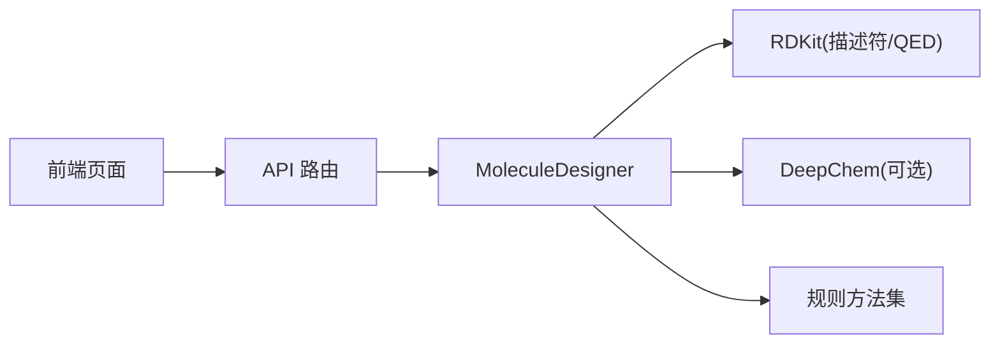

# 口服生物利用度预测

<cite>
**本文引用的文件**   
- [molecule_designer.py](file://backend/app/services/analyzer/molecule_designer.py)
- [test_p2_features.py](file://tests/test_p2_features.py)
- [molecules.py](file://backend/app/api/v1/molecules.py)
- [4_⚙️_分子评估.py](file://frontend/pages/4_⚙️_分子评估.py)
</cite>

## 目录
1. [简介](#简介)
2. [项目结构](#项目结构)
3. [核心组件](#核心组件)
4. [架构总览](#架构总览)
5. [详细组件分析](#详细组件分析)
6. [依赖关系分析](#依赖关系分析)
7. [性能与可扩展性](#性能与可扩展性)
8. [故障排查指南](#故障排查指南)
9. [结论](#结论)
10. [附录](#附录)

## 简介
本文件聚焦于“口服生物利用度预测”功能，系统性地说明基于规则的 _rule_bioavailability 模型判断逻辑，及其对 Lipinski 五规则与 Veber 规则的综合评估机制。文档还解释 passes_lipinski 与 passes_veber 标志位的计算方式、TPSA 阈值（<140 Ų）对肠道吸收的影响机制，并给出分子特性与口服生物利用度的相关性解读、临床意义与优化建议，以及与其它 ADMET 性质的关联分析。

## 项目结构
该功能位于后端服务层与前端展示层的协同中：
- 后端服务层提供类药性与 ADMET 性质预测能力，包含基于规则的口服生物利用度判定。
- API 层将预测结果结构化返回，包括 druglikeness 字段与 properties 字段。
- 前端页面以指标形式直观展示“口服生物利用度”等关键属性。

图表来源
- [molecule_designer.py:136-160](file://backend/app/services/analyzer/molecule_designer.py#L136-L160)
- [molecule_designer.py:226-256](file://backend/app/services/analyzer/molecule_designer.py#L226-L256)
- [molecule_designer.py:267-274](file://backend/app/services/analyzer/molecule_designer.py#L267-L274)
- [molecules.py:240-267](file://backend/app/api/v1/molecules.py#L240-L267)
- [4_⚙️_分子评估.py:128-148](file://frontend/pages/4_⚙️_分子评估.py#L128-L148)

章节来源
- [molecule_designer.py:136-160](file://backend/app/services/analyzer/molecule_designer.py#L136-L160)
- [molecules.py:240-267](file://backend/app/api/v1/molecules.py#L240-L267)
- [4_⚙️_分子评估.py:128-148](file://frontend/pages/4_⚙️_分子评估.py#L128-L148)

## 核心组件
- MoleculeDesigner.assess_druglikeness：计算分子基础描述符（分子量、LogP、HBD、HBA、可旋转键、TPSA），并输出 passes_lipinski、passes_veber、QED 等。
- MoleculeDesigner.predict_properties：优先尝试 DeepChem 模型；不可用时降级为规则模型。
- MoleculeDesigner._predict_with_rules：在规则模式下计算毒性、溶解度、BBB 通透性、hERG 风险以及口服生物利用度。
- MoleculeDesigner._rule_bioavailability：综合 Lipinski、Veber 与 TPSA 阈值判定口服生物利用度。

章节来源
- [molecule_designer.py:71-134](file://backend/app/services/analyzer/molecule_designer.py#L71-L134)
- [molecule_designer.py:136-160](file://backend/app/services/analyzer/molecule_designer.py#L136-L160)
- [molecule_designer.py:226-256](file://backend/app/services/analyzer/molecule_designer.py#L226-L256)
- [molecule_designer.py:267-274](file://backend/app/services/analyzer/molecule_designer.py#L267-L274)

## 架构总览
以下序列图展示了从用户输入 SMILES 到得到“口服生物利用度”结果的调用链。

图表来源
- [molecule_designer.py:136-160](file://backend/app/services/analyzer/molecule_designer.py#L136-L160)
- [molecule_designer.py:226-256](file://backend/app/services/analyzer/molecule_designer.py#L226-L256)
- [molecule_designer.py:267-274](file://backend/app/services/analyzer/molecule_designer.py#L267-L274)
- [molecules.py:240-267](file://backend/app/api/v1/molecules.py#L240-L267)
- [4_⚙️_分子评估.py:128-148](file://frontend/pages/4_⚙️_分子评估.py#L128-L148)

## 详细组件分析

### 规则模型 _rule_bioavailability 的判断逻辑
- 输入：druglike 字典，包含 passes_lipinski、passes_veber、tpsa 等字段。
- 判定条件：
  - 必须通过 Lipinski 五规则（passes_lipinski=True）。
  - 必须通过 Veber 规则（passes_veber=True）。
  - TPSA 必须小于 140 Ų。
- 输出：布尔值 oral_bioavailable。

图表来源
- [molecule_designer.py:267-274](file://backend/app/services/analyzer/molecule_designer.py#L267-L274)

章节来源
- [molecule_designer.py:267-274](file://backend/app/services/analyzer/molecule_designer.py#L267-L274)

### passes_lipinski 的计算方法与判定标准
- 计算过程：
  - 计算分子描述符：分子量（MW）、LogP、氢键供体数（HBD）、氢键受体数（HBA）。
  - 违反项统计：
    - MW > 500
    - LogP > 5
    - HBD > 5
    - HBA > 10
  - 若无任何违反项，则 passes_lipinski = True，否则为 False。
- 输出字段：passes_lipinski、violations（违反项列表）。

图表来源
- [molecule_designer.py:94-134](file://backend/app/services/analyzer/molecule_designer.py#L94-L134)

章节来源
- [molecule_designer.py:94-134](file://backend/app/services/analyzer/molecule_designer.py#L94-L134)

### passes_veber 的计算方法与判定标准
- 计算过程：
  - 计算可旋转键数（rotatable_bonds）与拓扑极性表面积（TPSA）。
  - Veber 规则：rotatable_bonds ≤ 10 且 TPSA ≤ 140。
  - 满足则 passes_veber = True，否则为 False。
- 注意：_rule_bioavailability 额外要求 tpsa < 140（严格小于），而 Veber 本身允许等于 140。

图表来源
- [molecule_designer.py:112-134](file://backend/app/services/analyzer/molecule_designer.py#L112-L134)

章节来源
- [molecule_designer.py:112-134](file://backend/app/services/analyzer/molecule_designer.py#L112-L134)

### TPSA 阈值（<140 Ų）对肠道吸收的影响机制
- 在 _rule_bioavailability 中，TPSA 需严格小于 140 Ų 才能判定为“口服生物利用”。
- 背景机制（概念性说明）：
  - TPSA 反映分子的极性表面积，影响跨膜转运能力。
  - 较高 TPSA 通常降低被动扩散效率，从而降低肠道吸收与口服生物利用度。
  - 经验阈值常用于筛选具有良好肠道渗透性的候选分子。
- 在本实现中，即使 Veber 允许 TPSA=140，但为了更保守地预测口服生物利用度，采用 <140 的严格条件。

[本节为概念性说明，不直接分析具体代码文件]

### 分子特性与口服生物利用度的相关性分析
- 关键特性：
  - 分子量（MW）：过大可能降低渗透性与代谢稳定性。
  - LogP：过高增加非特异性结合与毒性风险，过低可能影响膜渗透。
  - HBD/HBA：过多会增大极性，降低膜渗透。
  - 可旋转键：过多降低构象刚性，影响渗透与代谢。
  - TPSA：高极性不利于跨膜吸收。
- 在本系统中：
  - Lipinski 与 Veber 规则分别约束上述特性范围。
  - _rule_bioavailability 进一步以 TPSA < 140 作为强约束，确保肠道吸收潜力。

章节来源
- [molecule_designer.py:94-134](file://backend/app/services/analyzer/molecule_designer.py#L94-L134)
- [molecule_designer.py:267-274](file://backend/app/services/analyzer/molecule_designer.py#L267-L274)

### 生物利用度预测结果的临床意义解读与优化建议
- 结果解读：
  - oral_bioavailable=True：提示分子具备较好的口服吸收潜力，适合作为后续优化与实验验证的候选。
  - oral_bioavailable=False：提示可能存在吸收障碍，需要调整分子特性（如降低 TPSA、控制 MW/LogP、减少 HBD/HBA、限制可旋转键）。
- 优化建议：
  - 降低 TPSA：引入疏水片段、减少极性基团。
  - 控制 MW：避免过度增大骨架。
  - 调节 LogP：保持在适中范围，兼顾渗透性与溶解性。
  - 减少 HBD/HBA：保留必要的药效团，去除多余极性基团。
  - 限制可旋转键：提高构象刚性，改善渗透性。

[本节为通用指导，不直接分析具体代码文件]

### 与其他 ADMET 性质的关联分析
- BBB 通透性：
  - 规则：MW < 400、LogP < 5、TPSA < 90。
  - 与口服生物利用度共享 MW、LogP、TPSA 等特征，但 BBB 通透性对 TPSA 的要求更严格（<90 vs <140）。
- hERG 毒性风险：
  - 基于 LogP 的风险分级（高/中/低），提示脂溶性过高可能带来心脏毒性风险。
- 溶解度：
  - 使用 ESOL 近似公式估算 logS 与 mg/L 溶解度，与 LogP、MW、可旋转键相关。
- 毒性评分：
  - 基于 LogP 与 TPSA 的线性组合，高 LogP 与低 TPSA 提升毒性风险。

章节来源
- [molecule_designer.py:276-293](file://backend/app/services/analyzer/molecule_designer.py#L276-L293)
- [molecule_designer.py:237-244](file://backend/app/services/analyzer/molecule_designer.py#L237-L244)
- [molecule_designer.py:258-265](file://backend/app/services/analyzer/molecule_designer.py#L258-L265)

## 依赖关系分析
- 模块耦合：
  - API 层依赖服务层接口 predict_properties。
  - 服务层内部依赖 assess_druglikeness 与规则方法。
  - 前端页面消费 API 返回的 oral_bioavailable 字段进行可视化。
- 外部依赖：
  - RDKit：用于计算分子描述符与 QED。
  - DeepChem：可选，用于更复杂的 ADMET 预测；不可用时自动降级为规则模型。

图表来源
- [molecule_designer.py:136-160](file://backend/app/services/analyzer/molecule_designer.py#L136-L160)
- [molecules.py:240-267](file://backend/app/api/v1/molecules.py#L240-L267)
- [4_⚙️_分子评估.py:128-148](file://frontend/pages/4_⚙️_分子评估.py#L128-L148)

章节来源
- [molecule_designer.py:136-160](file://backend/app/services/analyzer/molecule_designer.py#L136-L160)
- [molecules.py:240-267](file://backend/app/api/v1/molecules.py#L240-L267)
- [4_⚙️_分子评估.py:128-148](file://frontend/pages/4_⚙️_分子评估.py#L128-L148)

## 性能与可扩展性
- 性能：
  - 规则模型计算开销极低，适合大规模初筛。
  - DeepChem 模型首次加载可能耗时，已做异常捕获与降级策略。
- 可扩展性：
  - 可在 _rule_bioavailability 中引入更多特征（如 pKa、渗透率预测）以提升准确性。
  - 可将规则阈值参数化，便于针对不同适应症或给药途径进行调整。

[本节为一般性讨论，不直接分析具体代码文件]

## 故障排查指南
- 常见问题：
  - RDKit 未安装：API 返回 degraded 状态与错误信息，需安装核心依赖。
  - DeepChem 不可用：自动降级为规则模型，不影响基本功能。
  - 无效 SMILES：返回 valid=False 与错误信息。
- 定位步骤：
  - 查看 API 返回的 model_used 与 error 字段。
  - 确认前端展示的 oral_bioavailable 与 druglikeness 字段是否完整。
  - 检查测试用例覆盖情况，确保规则逻辑正确。

章节来源
- [molecules.py:268-298](file://backend/app/api/v1/molecules.py#L268-L298)
- [test_p2_features.py:287-307](file://tests/test_p2_features.py#L287-L307)

## 结论
本系统的口服生物利用度预测基于 Lipinski 与 Veber 规则，并结合严格的 TPSA 阈值（<140 Ų）进行综合判定。该规则模型简单、高效、可解释性强，适合作为早期筛选与优化指导。通过与其它 ADMET 性质（BBB 通透性、hERG 风险、溶解度、毒性评分）的联动分析，可为分子设计提供多维度的决策支持。

[本节为总结性内容，不直接分析具体代码文件]

## 附录

### 单元测试要点（示例路径）
- 符合 Lipinski + Veber 且 TPSA < 140 → oral_bioavailable=True
- TPSA ≥ 140 → oral_bioavailable=False

章节来源
- [test_p2_features.py:287-307](file://tests/test_p2_features.py#L287-L307)