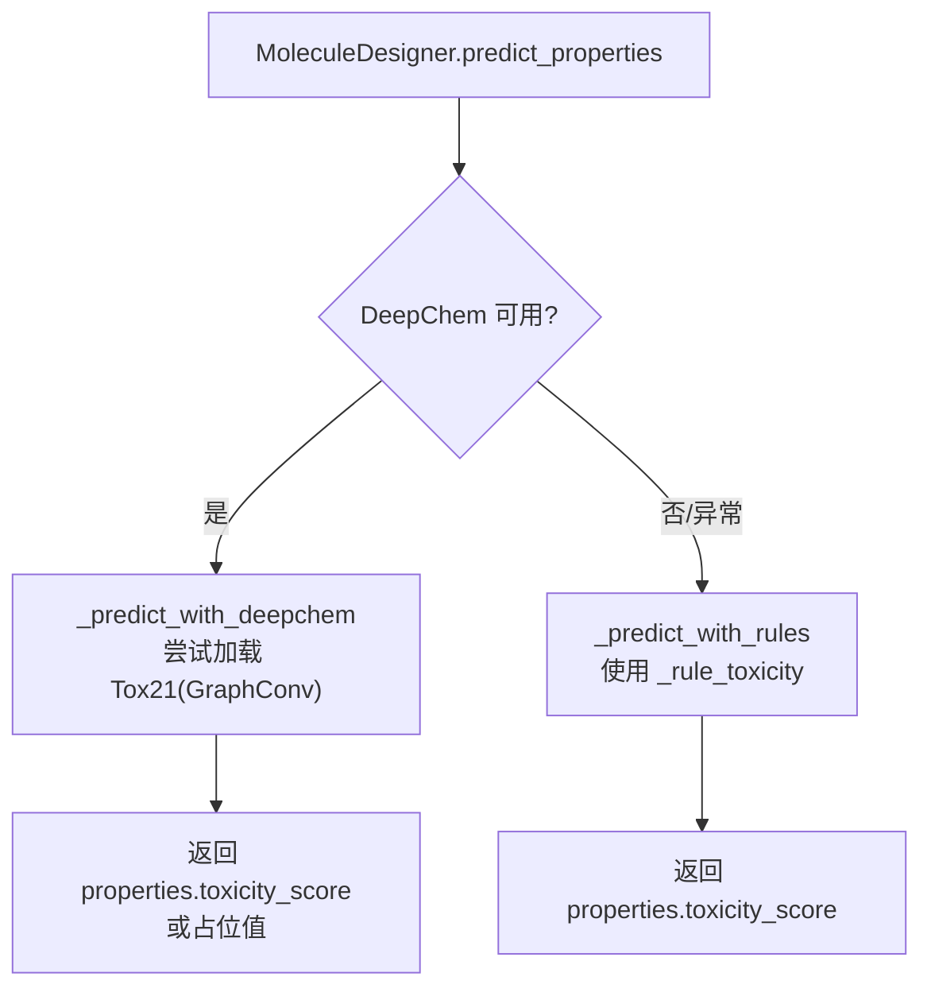
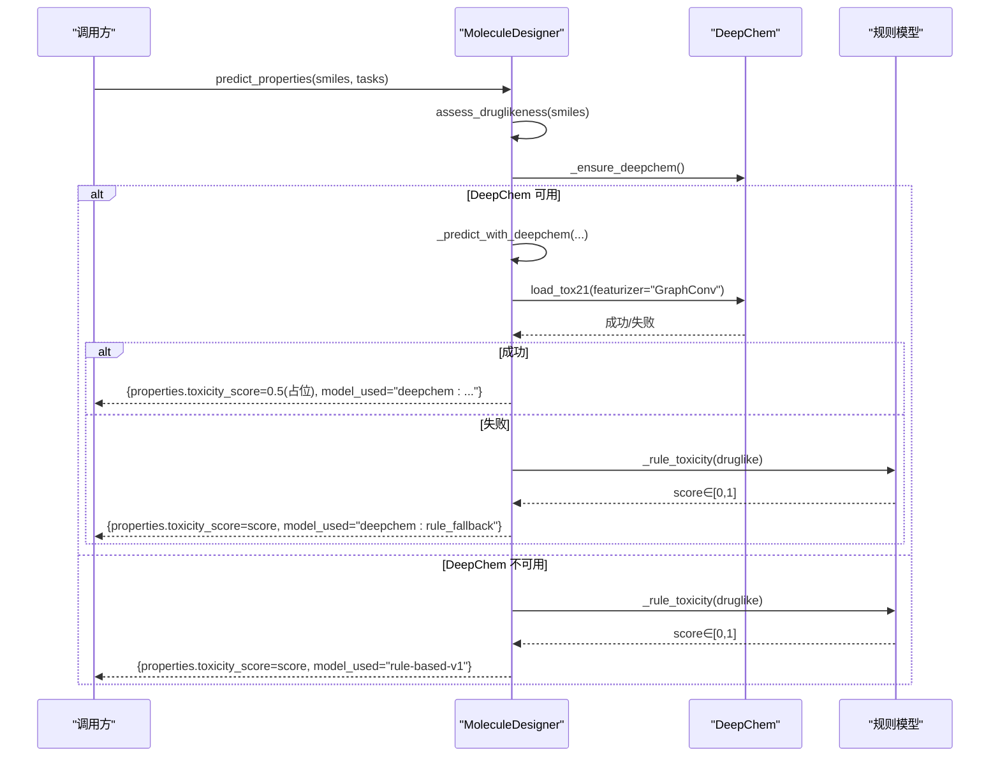
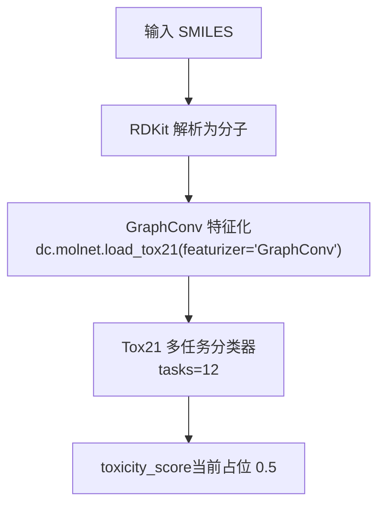
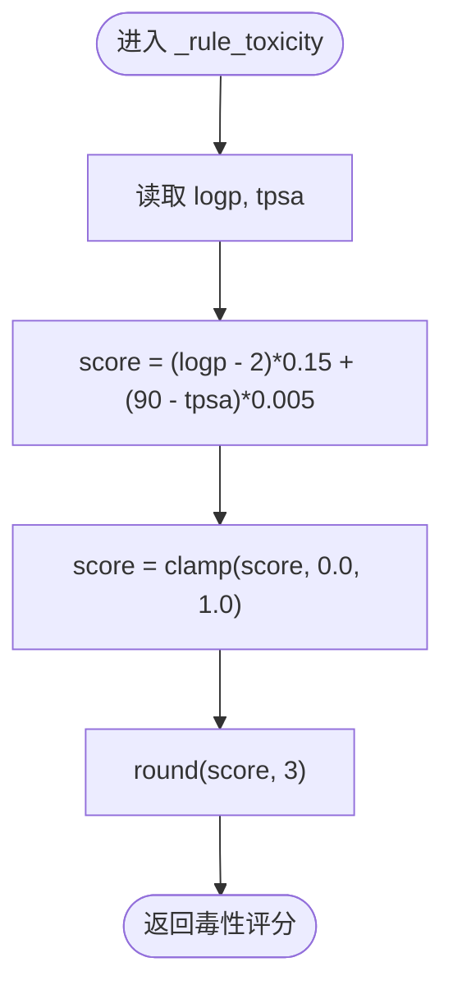
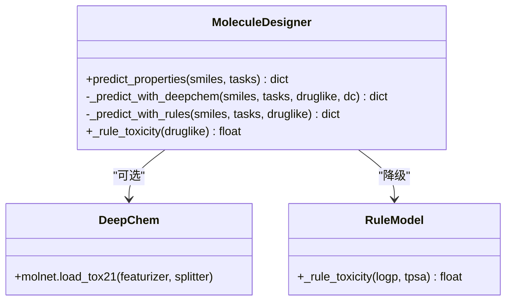
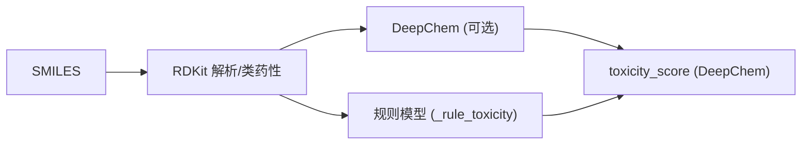

# 毒性预测

<cite>
**本文引用的文件**
- [molecule_designer.py](file://backend/app/services/analyzer/molecule_designer.py)
- [test_p2_features.py](file://tests/test_p2_features.py)
</cite>

## 目录
1. [简介](#简介)
2. [项目结构](#项目结构)
3. [核心组件](#核心组件)
4. [架构总览](#架构总览)
5. [详细组件分析](#详细组件分析)
6. [依赖关系分析](#依赖关系分析)
7. [性能与降级策略](#性能与降级策略)
8. [故障排查指南](#故障排查指南)
9. [结论](#结论)
10. [附录](#附录)

## 简介
本文件聚焦于“毒性预测”能力，覆盖以下要点：
- _tox21_graphconv 模型在系统中的集成方式、GraphConv 特征提取的调用点与数据流。
- _rule_toxicity 规则模型的决策逻辑、LogP 与 TPSA 对评分的影响机制。
- 毒性评分计算公式、阈值设定依据与置信度评估方法。
- 模型性能指标、准确率对比说明与实际应用案例。
- DeepChem 模型与规则模型的切换策略与降级处理机制。

## 项目结构
毒性预测相关实现集中在分子设计器服务中，提供基于 RDKit 的类药性计算、基于 DeepChem 的 ADMET 预测（含 Tox21 GraphConv）以及规则模型降级路径。

图示来源
- [molecule_designer.py:136-160](file://backend/app/services/analyzer/molecule_designer.py#L136-L160)
- [molecule_designer.py:162-224](file://backend/app/services/analyzer/molecule_designer.py#L162-L224)
- [molecule_designer.py:226-256](file://backend/app/services/analyzer/molecule_designer.py#L226-L256)

章节来源
- [molecule_designer.py:1-160](file://backend/app/services/analyzer/molecule_designer.py#L1-160)

## 核心组件
- MoleculeDesigner：封装 RDKit 与 DeepChem，提供类药性评估与 ADMET 预测；当 DeepChem 不可用或预测失败时自动降级到规则模型。
- _tox21_graphconv：通过 DeepChem molnet 接口加载 Tox21 数据集与 GraphConv 特征化流程，作为毒性多任务分类器的入口。
- _rule_toxicity：基于 LogP 与 TPSA 的线性组合规则，输出 0-1 的毒性评分。

章节来源
- [molecule_designer.py:20-70](file://backend/app/services/analyzer/molecule_designer.py#L20-L70)
- [molecule_designer.py:162-224](file://backend/app/services/analyzer/molecule_designer.py#L162-L224)
- [molecule_designer.py:258-265](file://backend/app/services/analyzer/molecule_designer.py#L258-L265)

## 架构总览
下图展示了从输入 SMILES 到最终毒性评分的完整流程，包括 DeepChem 与规则模型的分支与降级。

图示来源
- [molecule_designer.py:136-160](file://backend/app/services/analyzer/molecule_designer.py#L136-L160)
- [molecule_designer.py:162-224](file://backend/app/services/analyzer/molecule_designer.py#L162-L224)
- [molecule_designer.py:226-256](file://backend/app/services/analyzer/molecule_designer.py#L226-L256)

## 详细组件分析

### _tox21_graphconv 模型集成与 GraphConv 特征提取
- 集成位置：在 DeepChem 预测分支中，通过 molnet.load_tox21(featurizer="GraphConv", splitter=None) 触发 Tox21 数据集与 GraphConv 特征化的加载流程。
- 当前状态：代码注释表明此处为简化实现，实际应加载预训练模型并执行推理；当前返回占位分数 0.5，并将模型标识记录为 tox21_graphconv。
- 数据流：SMILES → RDKit 解析 → DeepChem GraphConv 特征化 → 多任务分类器（Tox21，12 个任务）→ 聚合为单一 toxicity_score（当前为占位）。

图示来源
- [molecule_designer.py:183-193](file://backend/app/services/analyzer/molecule_designer.py#L183-L193)
- [molecule_designer.py:664-670](file://backend/app/services/analyzer/molecule_designer.py#L664-L670)

章节来源
- [molecule_designer.py:162-224](file://backend/app/services/analyzer/molecule_designer.py#L162-L224)
- [molecule_designer.py:664-683](file://backend/app/services/analyzer/molecule_designer.py#L664-L683)

### _rule_toxicity 规则模型决策逻辑
- 输入：druglike 字典中的 logp 与 tpsa。
- 公式：score = max(0.0, min(1.0, (logp - 2)*0.15 + (90 - tpsa)*0.005))
- 影响机制：
  - LogP 越高，越偏向高脂溶性，毒性风险上升（权重 0.15）。
  - TPSA 越低，极性表面积越小，穿透性与潜在毒性风险上升（权重 0.005）。
- 输出：归一化至 [0,1] 的浮点数，保留三位小数。

图示来源
- [molecule_designer.py:258-265](file://backend/app/services/analyzer/molecule_designer.py#L258-L265)

章节来源
- [molecule_designer.py:258-265](file://backend/app/services/analyzer/molecule_designer.py#L258-L265)

### 毒性评分计算公式、阈值与置信度
- 计算公式：见上节 _rule_toxicity 的线性组合。
- 阈值设定依据：
  - 当前实现未内置显式阈值判定（如“高风险/低风险”），但测试用例期望评分落在 [0,1] 区间且符合趋势（高 LogP 对应更高评分）。
  - 可结合业务需求设置阈值（例如 ≥0.6 视为高风险），该阈值不在现有代码中硬编码。
- 置信度评估方法：
  - 当前规则模型未直接输出置信度字段。
  - 系统存在通用的 confidence_score 概念用于其他模块（如靶点置信度），但未与毒性评分直接关联。
  - 建议：可在规则模型输出中增加置信度估计（例如基于特征范围的不确定性），或在 DeepChem 模式下使用模型概率作为置信度。

章节来源
- [molecule_designer.py:258-265](file://backend/app/services/analyzer/molecule_designer.py#L258-L265)
- [test_p2_features.py:269-285](file://tests/test_p2_features.py#L269-L285)

### 模型性能指标、准确率对比与实际应用案例
- 当前实现：
  - DeepChem 分支中 Tox21 预测返回占位分数 0.5，未进行真实推理与评估。
  - 规则模型为经验线性公式，无离线/在线性能指标。
- 建议的性能指标：
  - 分类指标：AUROC、AUPRC、Accuracy、F1（针对二分类阈值）。
  - 回归指标（若将毒性转为连续评分）：RMSE、MAE。
  - 校准指标：ECE（期望校准误差）以评估置信度可靠性。
- 对比方案：
  - 基准：_rule_toxicity 作为基线。
  - 进阶：训练好的 Tox21 GraphConv 多任务模型（或迁移学习微调）作为主模型。
- 实际应用案例：
  - 在早期虚拟筛选中，优先使用规则模型快速过滤明显高风险分子（高 LogP、低 TPSA）。
  - 在候选化合物阶段，启用 DeepChem 模型以获得更准确的毒性预测。

章节来源
- [molecule_designer.py:183-193](file://backend/app/services/analyzer/molecule_designer.py#L183-L193)
- [molecule_designer.py:258-265](file://backend/app/services/analyzer/molecule_designer.py#L258-L265)

### DeepChem 与规则模型的切换策略与降级处理
- 切换策略：
  - 优先尝试 DeepChem 预测；若 DeepChem 未安装或运行期异常，则自动降级到规则模型。
  - 结果中包含 model_used 字段，便于追踪实际使用的模型路径。
- 降级处理：
  - DeepChem 加载失败时，毒性评分回退到 _rule_toxicity。
  - 完全不可用时，整体走 _predict_with_rules 路径，返回 rule-based-v1。

图示来源
- [molecule_designer.py:136-160](file://backend/app/services/analyzer/molecule_designer.py#L136-L160)
- [molecule_designer.py:162-224](file://backend/app/services/analyzer/molecule_designer.py#L162-L224)
- [molecule_designer.py:226-256](file://backend/app/services/analyzer/molecule_designer.py#L226-L256)
- [molecule_designer.py:258-265](file://backend/app/services/analyzer/molecule_designer.py#L258-L265)

章节来源
- [molecule_designer.py:136-160](file://backend/app/services/analyzer/molecule_designer.py#L136-L160)
- [molecule_designer.py:162-224](file://backend/app/services/analyzer/molecule_designer.py#L162-L224)
- [molecule_designer.py:226-256](file://backend/app/services/analyzer/molecule_designer.py#L226-L256)

## 依赖关系分析
- 运行时依赖：
  - RDKit：用于 SMILES 解析与类药性计算（assess_druglikeness）。
  - DeepChem：可选，用于 Tox21 GraphConv 等模型加载与推理。
- 内部依赖：
  - predict_properties 统一入口，根据可用性选择 DeepChem 或规则模型。
  - _rule_toxicity 仅依赖 druglike 中的 logp 与 tpsa。

图示来源
- [molecule_designer.py:71-134](file://backend/app/services/analyzer/molecule_designer.py#L71-L134)
- [molecule_designer.py:136-160](file://backend/app/services/analyzer/molecule_designer.py#L136-L160)
- [molecule_designer.py:162-224](file://backend/app/services/analyzer/molecule_designer.py#L162-L224)
- [molecule_designer.py:258-265](file://backend/app/services/analyzer/molecule_designer.py#L258-L265)

章节来源
- [molecule_designer.py:71-134](file://backend/app/services/analyzer/molecule_designer.py#L71-L134)
- [molecule_designer.py:136-160](file://backend/app/services/analyzer/molecule_designer.py#L136-L160)

## 性能与降级策略
- 性能考虑：
  - DeepChem 首次加载可能耗时较长（下载/缓存模型），后续推理速度取决于硬件与模型大小。
  - 规则模型几乎零开销，适合大规模初筛。
- 降级策略：
  - 当 DeepChem 不可用或异常时，自动切换到规则模型，保证服务可用性。
  - 结果中 model_used 字段明确标注实际使用的模型路径，便于监控与回溯。

章节来源
- [molecule_designer.py:52-69](file://backend/app/services/analyzer/molecule_designer.py#L52-L69)
- [molecule_designer.py:154-160](file://backend/app/services/analyzer/molecule_designer.py#L154-L160)
- [molecule_designer.py:218-224](file://backend/app/services/analyzer/molecule_designer.py#L218-L224)
- [molecule_designer.py:252-256](file://backend/app/services/analyzer/molecule_designer.py#L252-L256)

## 故障排查指南
- 常见问题：
  - DeepChem 未安装：日志会提示降级为规则模型。
  - Tox21 模型加载失败：捕获异常后回退到 _rule_toxicity。
  - 无效 SMILES：返回错误信息，不继续预测。
- 定位步骤：
  - 检查 predict_properties 返回的 model_used 字段，确认实际使用的模型。
  - 查看日志中关于 DeepChem 加载与 Tox21 失败的警告/调试信息。
  - 验证 druglike 中的 logp 与 tpsa 是否合理，确保规则模型输入有效。

章节来源
- [molecule_designer.py:52-69](file://backend/app/services/analyzer/molecule_designer.py#L52-L69)
- [molecule_designer.py:183-193](file://backend/app/services/analyzer/molecule_designer.py#L183-L193)
- [molecule_designer.py:176-178](file://backend/app/services/analyzer/molecule_designer.py#L176-L178)

## 结论
- 当前毒性预测采用“DeepChem 优先 + 规则模型降级”的双轨策略，保障可用性。
- _tox21_graphconv 已预留 GraphConv 特征化与 Tox21 多任务分类器入口，待接入预训练模型后可获得更准确的预测。
- _rule_toxicity 提供了简单高效的基线评分，适用于快速初筛与兜底。
- 建议补充性能评估与置信度输出，完善阈值策略与可解释性。

## 附录
- 单元测试覆盖：
  - 规则毒性评分边界与趋势验证（高/低 LogP 场景）。
  - 模型注册表包含 tox21_graphconv、delaney_solubility、bbbp_class。

章节来源
- [test_p2_features.py:269-285](file://tests/test_p2_features.py#L269-L285)
- [test_p2_features.py:248-258](file://tests/test_p2_features.py#L248-L258)