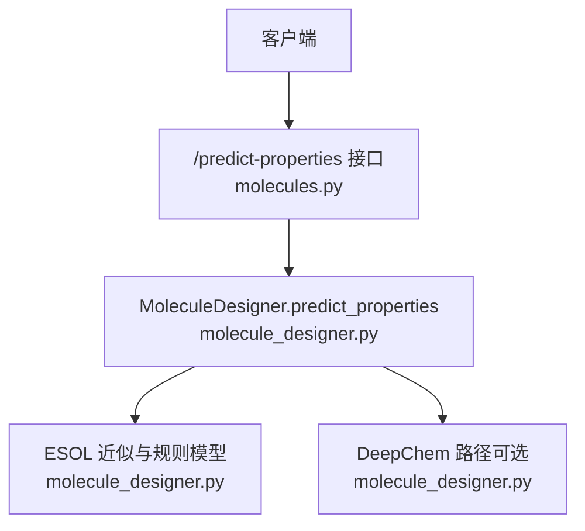
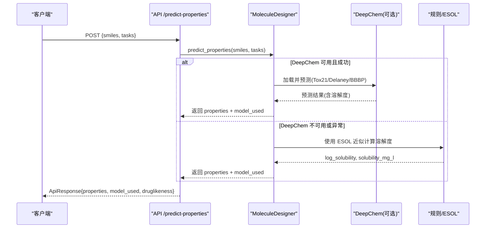
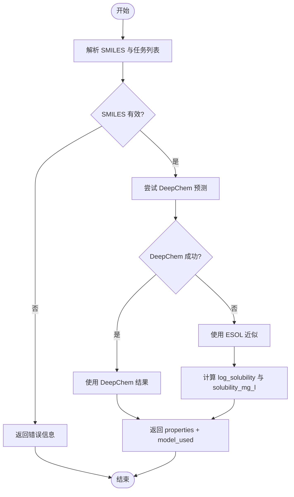
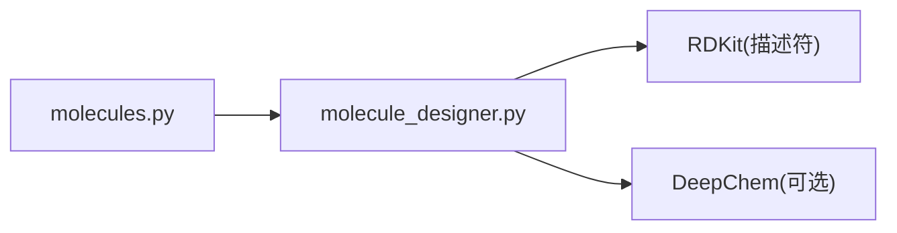

# 溶解度预测

<cite>
**本文引用的文件**   
- [molecule_designer.py](file://backend/app/services/analyzer/molecule_designer.py)
- [molecules.py](file://backend/app/api/v1/molecules.py)
- [test_p2_features.py](file://tests/test_p2_features.py)
</cite>

## 目录
1. [简介](#简介)
2. [项目结构](#项目结构)
3. [核心组件](#核心组件)
4. [架构总览](#架构总览)
5. [详细组件分析](#详细组件分析)
6. [依赖关系分析](#依赖关系分析)
7. [性能与精度说明](#性能与精度说明)
8. [故障排查指南](#故障排查指南)
9. [结论](#结论)
10. [附录](#附录)

## 简介
本文件面向“溶解度预测”功能，聚焦于 ESOL 方程的实现、Delaney 数据集回归模型的训练与评估、输出格式（log_solubility 与 solubility_mg_l）的计算与单位转换，以及分子结构特征（分子量、LogP、可旋转键数）对溶解度的影响机制。同时提供结果解释与实际应用指导，帮助使用者正确理解与使用系统返回的溶解度预测值。

## 项目结构
溶解度预测能力位于后端服务中，通过 API 暴露给前端或外部调用方：
- 服务实现：MoleculeDesigner 类封装了基于 RDKit 的特征计算与基于规则/DeepChem 的 ADMET 性质预测，其中包含 ESOL 溶解度近似。
- API 接口：/predict-properties 接收 SMILES 与任务列表，返回包括溶解度在内的性质预测结果。
- 测试用例：覆盖模型注册表与部分规则方法行为，确保基本可用性。

图表来源
- [molecules.py:220-298](file://backend/app/api/v1/molecules.py#L220-L298)
- [molecule_designer.py:136-256](file://backend/app/services/analyzer/molecule_designer.py#L136-L256)

章节来源
- [molecules.py:220-298](file://backend/app/api/v1/molecules.py#L220-L298)
- [molecule_designer.py:136-256](file://backend/app/services/analyzer/molecule_designer.py#L136-L256)

## 核心组件
- MoleculeDesigner.predict_properties：统一入口，优先尝试 DeepChem 模型，失败则降级为规则模型；在规则路径中采用 ESOL 方程进行溶解度近似。
- ESOL 近似逻辑：基于分子描述符（LogP、分子量 MW、可旋转键数 RB）线性组合得到 logS，再转换为 mg/L。
- API 层：将内部结果包装为标准响应，包含 properties、model_used、druglikeness 等字段。

章节来源
- [molecule_designer.py:136-256](file://backend/app/services/analyzer/molecule_designer.py#L136-L256)
- [molecules.py:220-298](file://backend/app/api/v1/molecules.py#L220-L298)

## 架构总览
下图展示了从请求到溶解度预测结果的完整流程，包括 DeepChem 可用与不可用两种分支。

图表来源
- [molecules.py:220-298](file://backend/app/api/v1/molecules.py#L220-L298)
- [molecule_designer.py:136-256](file://backend/app/services/analyzer/molecule_designer.py#L136-L256)

## 详细组件分析

### ESOL 方程与参数物理意义
- 公式形式：logS = 0.16 − 0.63·logP − 0.0062·MW + 0.066·RB
- 参数含义与权重方向：
  - logP（辛醇/水分配系数的对数）：衡量分子亲脂性。系数为负，表示亲脂性越强，水溶性越差（logS 越小）。
  - MW（分子量，单位 g/mol）：质量越大，扩散与溶剂化难度增加，系数为负，表示分子量增大降低溶解度。
  - RB（可旋转键数）：反映分子柔性，系数为正，表示柔性增强有助于与水分子相互作用，提升溶解度。
  - 截距 0.16：经验常数，用于校准整体基准。
- 该方程为经验线性回归模型，适用于小分子药物类似物范围，常用于快速初筛。

章节来源
- [molecule_designer.py:195-210](file://backend/app/services/analyzer/molecule_designer.py#L195-L210)
- [molecule_designer.py:237-244](file://backend/app/services/analyzer/molecule_designer.py#L237-L244)

### Delaney 数据集与回归模型训练
- 背景：Delaney 数据集是广泛使用的溶解度基准集，目标为实验测得的 logS（mol/L），常用于回归模型评估。
- 当前实现：代码注释与模型注册表提及 Delaney 回归模型（delaney_solubility），但在实际运行中采用 ESOL 近似作为简化替代。
- 训练与评估要点（概念性说明）：
  - 数据准备：清洗 SMILES、计算描述符（如 LogP、MW、RB）、对齐标签 logS。
  - 模型选择：线性回归、随机森林、图神经网络等均可用于回归。
  - 指标：常用 R²、RMSE、MAE 评估拟合与泛化能力。
  - 注意：当前仓库未包含具体训练脚本与指标数值，仅以 ESOL 近似提供快速预测。

章节来源
- [molecule_designer.py:168-173](file://backend/app/services/analyzer/molecule_designer.py#L168-L173)
- [molecule_designer.py:664-683](file://backend/app/services/analyzer/molecule_designer.py#L664-L683)
- [test_p2_features.py:252-254](file://tests/test_p2_features.py#L252-L254)

### 输出格式与单位转换
- log_solubility：即 logS，单位为 mol/L 的对数（无单位）。由 ESOL 方程直接计算得到。
- solubility_mg_l：将 logS 转换为质量浓度 mg/L 的近似值，计算公式为：
  - 先取反对数得到摩尔浓度：c_mol_L = 10^(logS)
  - 乘以分子量（g/mol）得到 g/L：c_g_L = c_mol_L × MW
  - 再乘以 1000 得到 mg/L：c_mg_L = c_g_L × 1000
  - 最终表达式：solubility_mg_l ≈ 10^(logS) × MW × 1000
- 注意：该转换假设分子在水中完全解离且不考虑离子态、pH 影响与活度系数，属于工程近似。

章节来源
- [molecule_designer.py:203-207](file://backend/app/services/analyzer/molecule_designer.py#L203-L207)
- [molecule_designer.py:242-244](file://backend/app/services/analyzer/molecule_designer.py#L242-L244)

### 分子结构特征对溶解度的影响机制
- 分子量（MW）：增大通常降低溶解度，因为更大的分子更难被水分子溶剂化，扩散也更慢。
- LogP：亲脂性越高，越倾向于进入非极性相，导致在水中的溶解度下降。
- 可旋转键数（RB）：柔性增加可能提高与水分子的接触机会，有利于溶解度提升，但过高的柔性也可能带来构象熵代价。
- 综合效应：ESOL 方程以线性方式整合上述因素，便于快速评估与排序。

章节来源
- [molecule_designer.py:195-210](file://backend/app/services/analyzer/molecule_designer.py#L195-L210)
- [molecule_designer.py:237-244](file://backend/app/services/analyzer/molecule_designer.py#L237-L244)

### 预测流程与错误处理
- 流程：
  - 解析 SMILES 并计算类药性描述符（MW、LogP、RB 等）。
  - 若 DeepChem 可用，尝试加载预训练模型进行预测；否则回退至 ESOL 近似。
  - 生成 properties 字典，包含 log_solubility 与 solubility_mg_l。
- 错误处理：
  - DeepChem 加载失败时记录警告并降级。
  - 无效 SMILES 返回错误信息。
  - API 层捕获运行时异常，返回降级响应与原因。

图表来源
- [molecule_designer.py:136-256](file://backend/app/services/analyzer/molecule_designer.py#L136-L256)
- [molecules.py:220-298](file://backend/app/api/v1/molecules.py#L220-L298)

章节来源
- [molecule_designer.py:136-256](file://backend/app/services/analyzer/molecule_designer.py#L136-L256)
- [molecules.py:220-298](file://backend/app/api/v1/molecules.py#L220-L298)

## 依赖关系分析
- 模块耦合：
  - API 层依赖 MoleculeDesigner 提供预测能力。
  - MoleculeDesigner 内部依赖 RDKit 计算描述符，并在可用时尝试 DeepChem。
- 外部依赖：
  - RDKit：用于分子结构与描述符计算。
  - DeepChem：可选，用于更复杂的模型预测；不可用时自动降级。
- 潜在循环依赖：未见明显循环导入，结构清晰。

图表来源
- [molecules.py:220-298](file://backend/app/api/v1/molecules.py#L220-L298)
- [molecule_designer.py:136-256](file://backend/app/services/analyzer/molecule_designer.py#L136-L256)

章节来源
- [molecules.py:220-298](file://backend/app/api/v1/molecules.py#L220-L298)
- [molecule_designer.py:136-256](file://backend/app/services/analyzer/molecule_designer.py#L136-L256)

## 性能与精度说明
- 性能：
  - ESOL 近似为轻量级线性计算，耗时极低，适合批量筛选。
  - DeepChem 路径涉及模型加载与推理，首次加载较慢，后续缓存复用。
- 精度：
  - ESOL 方程为经验模型，适用于小分子药物类似物的快速评估，但不具备复杂非线性建模能力。
  - 当前仓库未提供 Delaney 数据集上的训练脚本与评估指标（R²、RMSE、MAE），因此无法给出具体数值。
  - 建议在生产环境中引入经过充分验证的回归模型，并在独立测试集上报告指标。

[本节为通用指导，不直接分析具体文件]

## 故障排查指南
- 常见错误与定位：
  - RDKit 未安装：API 返回降级响应，提示安装核心依赖。
  - DeepChem 不可用：日志记录警告，自动回退到规则/ESOL 路径。
  - 无效 SMILES：返回错误信息，检查输入字符串合法性。
- 诊断步骤：
  - 查看 API 返回的 model_used 字段，确认实际使用的模型路径。
  - 检查日志中的警告与调试信息，定位异常来源。
  - 验证输入 SMILES 是否有效，必要时使用 RDKit 工具校验。

章节来源
- [molecules.py:268-298](file://backend/app/api/v1/molecules.py#L268-L298)
- [molecule_designer.py:152-160](file://backend/app/services/analyzer/molecule_designer.py#L152-L160)

## 结论
本系统的溶解度预测以 ESOL 方程为核心，结合 RDKit 描述符快速估算 logS 与 mg/L 浓度，具备良好的可扩展性与容错性。尽管当前未提供 Delaney 数据集的具体训练与评估细节，但框架已预留 DeepChem 集成点，便于未来替换为更精确的回归模型。使用者应关注输出字段的物理意义与单位转换，并结合业务场景进行结果解释与决策。

[本节为总结性内容，不直接分析具体文件]

## 附录

### 关键函数与字段参考
- predict_properties：统一入口，返回 properties、model_used、druglikeness。
- ESOL 近似：计算 log_solubility 与 solubility_mg_l。
- API 响应：ApiResponse 包裹 data 与 meta，便于追踪与降级标识。

章节来源
- [molecule_designer.py:136-256](file://backend/app/services/analyzer/molecule_designer.py#L136-L256)
- [molecules.py:220-298](file://backend/app/api/v1/molecules.py#L220-L298)