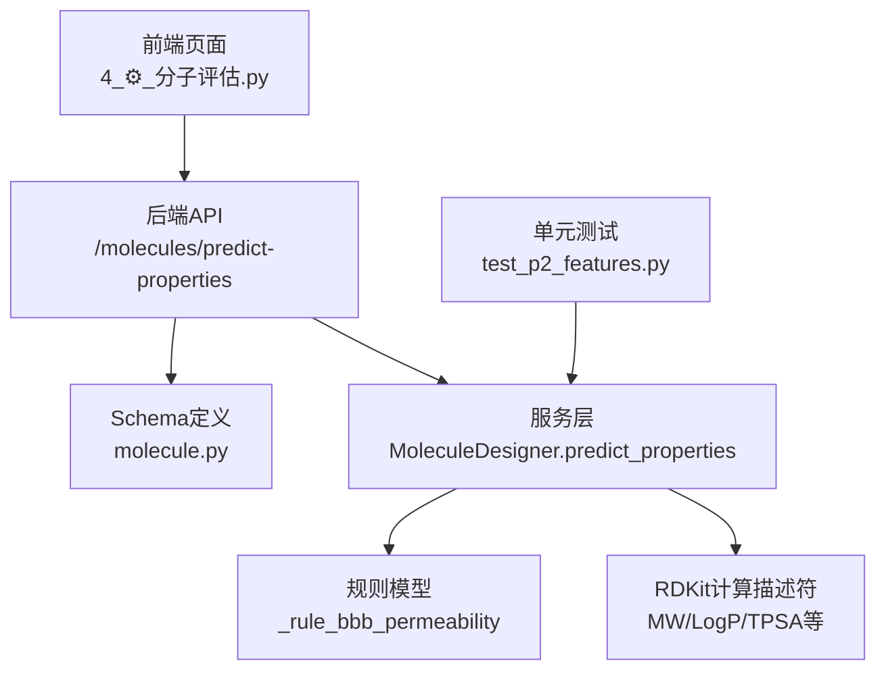
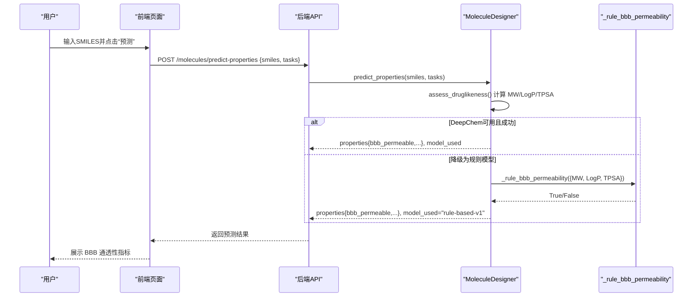
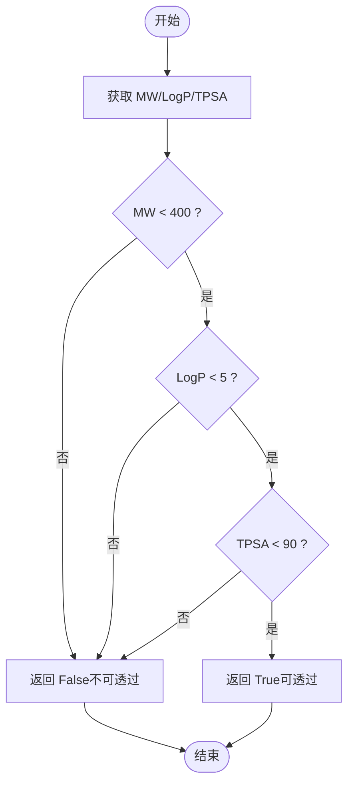
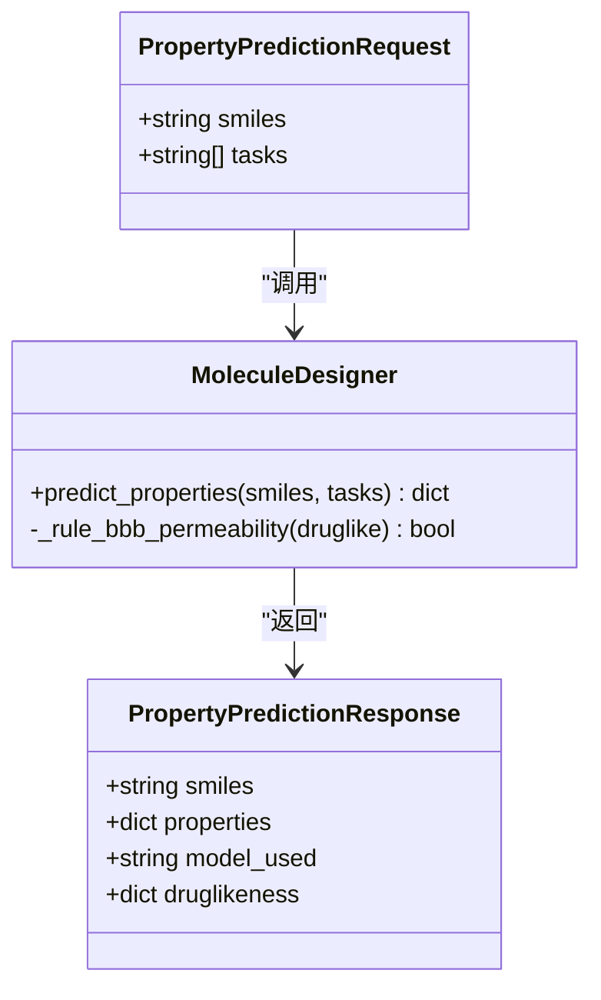
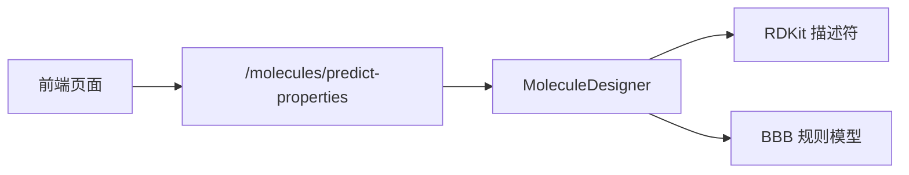

# 血脑屏障通透性预测

<cite>
**本文引用的文件**   
- [molecule_designer.py](file://backend/app/services/analyzer/molecule_designer.py)
- [test_p2_features.py](file://tests/test_p2_features.py)
- [molecules.py](file://backend/app/api/v1/molecules.py)
- [molecule.py](file://backend/app/schemas/molecule.py)
- [4_⚙️_分子评估.py](file://frontend/pages/4_⚙️_分子评估.py)
</cite>

## 目录
1. [简介](#简介)
2. [项目结构](#项目结构)
3. [核心组件](#核心组件)
4. [架构总览](#架构总览)
5. [详细组件分析](#详细组件分析)
6. [依赖关系分析](#依赖关系分析)
7. [性能与可扩展性](#性能与可扩展性)
8. [故障排查指南](#故障排查指南)
9. [结论](#结论)
10. [附录](#附录)

## 简介
本文件围绕“血脑屏障（BBB）通透性预测”功能，系统化梳理规则模型_rule_bbb_permeability的决策算法、参数阈值与使用方式，并结合前端展示与API集成路径，给出中枢神经系统（CNS）药物设计标准与外周作用药物的排除策略。文档同时提供优化建议与临床应用的落地指导，帮助研发人员快速理解并应用该能力。

## 项目结构
与BBB通透性预测相关的代码主要分布在以下位置：
- 服务层：MoleculeDesigner 类实现基于规则的BBB通透性判断与ADMET性质预测流程
- API层：/molecules/predict-properties 接口接收SMILES并返回预测结果
- Schema层：定义请求/响应结构与字段说明
- 前端页面：以指标卡片形式直观展示BBB通透性、口服生物利用度与hERG风险
- 测试用例：覆盖BBB规则的关键分支与边界条件

图表来源
- [molecules.py:240-298](file://backend/app/api/v1/molecules.py#L240-L298)
- [molecule.py:95-112](file://backend/app/schemas/molecule.py#L95-L112)
- [molecule_designer.py:136-160](file://backend/app/services/analyzer/molecule_designer.py#L136-L160)
- [molecule_designer.py:276-283](file://backend/app/services/analyzer/molecule_designer.py#L276-L283)
- [4_⚙️_分子评估.py:109-158](file://frontend/pages/4_⚙️_分子评估.py#L109-L158)
- [test_p2_features.py:309-321](file://tests/test_p2_features.py#L309-L321)

章节来源
- [molecule_designer.py:136-160](file://backend/app/services/analyzer/molecule_designer.py#L136-L160)
- [molecules.py:240-298](file://backend/app/api/v1/molecules.py#L240-L298)
- [molecule.py:95-112](file://backend/app/schemas/molecule.py#L95-L112)
- [4_⚙️_分子评估.py:109-158](file://frontend/pages/4_⚙️_分子评估.py#L109-L158)
- [test_p2_features.py:309-321](file://tests/test_p2_features.py#L309-L321)

## 核心组件
- MoleculeDesigner.predict_properties：统一入口，优先尝试DeepChem模型，失败时降级为规则模型；当任务包含bbb_permeability时，调用_rule_bbb_permeability生成布尔型预测结果。
- MoleculeDesigner._rule_bbb_permeability：基于三个关键理化参数的阈值进行判定，返回True表示可透过BBB，False表示不可透过。
- API /molecules/predict-properties：接收SMILES与可选tasks列表，返回properties中包含bbb_permeable字段。
- 前端页面：在“ADMET 性质预测”模块中，将bbb_permeable转换为“✅ 可/❌ 不可”的指标展示。
- 测试用例：验证小分子低LogP低TPSA可通过，大分子不可通过等关键场景。

章节来源
- [molecule_designer.py:136-160](file://backend/app/services/analyzer/molecule_designer.py#L136-L160)
- [molecule_designer.py:276-283](file://backend/app/services/analyzer/molecule_designer.py#L276-L283)
- [molecules.py:240-298](file://backend/app/api/v1/molecules.py#L240-L298)
- [4_⚙️_分子评估.py:109-158](file://frontend/pages/4_⚙️_分子评估.py#L109-L158)
- [test_p2_features.py:309-321](file://tests/test_p2_features.py#L309-L321)

## 架构总览
下图展示了从用户输入到BBB预测结果的端到端流程，包括参数提取、规则判定与结果回传。

图表来源
- [molecules.py:240-298](file://backend/app/api/v1/molecules.py#L240-L298)
- [molecule_designer.py:136-160](file://backend/app/services/analyzer/molecule_designer.py#L136-L160)
- [molecule_designer.py:276-283](file://backend/app/services/analyzer/molecule_designer.py#L276-L283)
- [4_⚙️_分子评估.py:109-158](file://frontend/pages/4_⚙️_分子评估.py#L109-L158)

## 详细组件分析

### 规则模型_decision algorithm
_rule_bbb_permeability采用三项硬性阈值的逻辑与运算：
- 分子量（molecular_weight）< 400 Da
- 脂水分配系数（logp）< 5
- 拓扑极性表面积（tpsa）< 90 Ų

任一条件不满足即判定为不可透过BBB。该规则用于快速筛选潜在的中枢活性候选物，作为DeepChem模型的降级方案或早期过滤手段。

图表来源
- [molecule_designer.py:276-283](file://backend/app/services/analyzer/molecule_designer.py#L276-L283)

章节来源
- [molecule_designer.py:276-283](file://backend/app/services/analyzer/molecule_designer.py#L276-L283)

### 参数阈值与生物学依据
- 分子量 < 400 Da：小分子更易被动扩散穿过内皮细胞膜，过大分子难以通过紧密连接和转运体介导途径进入脑组织。
- LogP < 5：适度脂溶性有助于跨膜，但过高会引发非特异性结合与代谢清除加速，影响入脑效率与安全性。
- TPSA < 90 Ų：较低的极性表面积有利于穿透脂质双分子层；高极性通常限制被动扩散。

这些阈值来源于广泛使用的经验法则与文献总结，适用于初筛与快速评估。实际入脑还受主动转运体、P-糖蛋白外排、血浆蛋白结合等因素影响，因此该规则应视为“必要不充分”条件。

章节来源
- [molecule_designer.py:276-283](file://backend/app/services/analyzer/molecule_designer.py#L276-L283)

### 中枢神经系统药物设计标准与外周作用药物排除标准
- CNS药物设计标准（建议）：
  - 分子量控制在较低范围（例如≤350–400 Da）
  - LogP适中（约2–4），避免过高导致非特异结合
  - TPSA尽量低于90 Ų，必要时不超过120 Ų
  - 氢键供体/受体数量适中，降低极性负担
  - 考虑引入弱碱性中心以提升脑分布（需结合靶点特性）
- 外周作用药物排除标准（建议）：
  - 若目标为外周组织，可放宽TPSA上限至120–140 Ų
  - 允许较高LogP（但仍需兼顾安全性与PK）
  - 有意提高极性或使用前药策略以降低入脑风险

章节来源
- [molecule_designer.py:276-283](file://backend/app/services/analyzer/molecule_designer.py#L276-L283)

### 实验验证数据与回归策略
- 当前实现为规则模型，未内置训练好的BBB分类器；DeepChem路径存在占位逻辑，实际生产环境可替换为经过充分验证的BBB数据集模型（如BBBP）。
- 建议在后续迭代中：
  - 引入公开BBB数据集进行模型训练与交叉验证
  - 输出概率分数而非仅布尔值，便于排序与权衡
  - 结合多任务学习（如同时预测溶解度、渗透性与毒性）提升泛化能力

章节来源
- [molecule_designer.py:162-224](file://backend/app/services/analyzer/molecule_designer.py#L162-224)

### 临床应用指导与药物优化策略
- 初筛阶段：使用_rule_bbb_permeability快速剔除明显无法入脑的分子，缩小合成与测试范围。
- 先导优化：对接近阈值的分子进行微调（如减少极性基团、控制分子量、调整脂溶性），使其满足三项阈值。
- 组合策略：将BBB规则与口服生物利用度、hERG风险、溶解度等指标联合评估，形成多维打分体系。
- 风险管控：对于LogP偏高或TPSA偏高的分子，优先考虑前药策略或靶向递送技术。

章节来源
- [molecule_designer.py:276-283](file://backend/app/services/analyzer/molecule_designer.py#L276-L283)

### API与前端集成
- API：POST /molecules/predict-properties，支持传入tasks=["bbb_permeability"]，返回properties.bbb_permeable。
- 前端：在“ADMET 性质预测”页面中以指标卡片展示BBB通透性，并提供JSON详情以便深入分析。

图表来源
- [molecule.py:95-112](file://backend/app/schemas/molecule.py#L95-L112)
- [molecule_designer.py:136-160](file://backend/app/services/analyzer/molecule_designer.py#L136-L160)
- [molecule_designer.py:276-283](file://backend/app/services/analyzer/molecule_designer.py#L276-L283)

章节来源
- [molecules.py:240-298](file://backend/app/api/v1/molecules.py#L240-L298)
- [molecule.py:95-112](file://backend/app/schemas/molecule.py#L95-L112)
- [4_⚙️_分子评估.py:109-158](file://frontend/pages/4_⚙️_分子评估.py#L109-L158)

### 测试覆盖与断言要点
- 小分子低LogP低TPSA应判定为可透过BBB
- 大分子即使其他参数良好也应判定为不可透过
- 确保返回类型为布尔值，便于前端直接展示

章节来源
- [test_p2_features.py:309-321](file://tests/test_p2_features.py#L309-L321)

## 依赖关系分析
- 服务层依赖RDKit计算基础描述符（MW、LogP、TPSA等），用于规则模型输入。
- API层负责校验请求、组装响应，并在异常情况下返回降级信息。
- 前端页面消费API返回的bbb_permeable字段，进行可视化展示。

图表来源
- [molecules.py:240-298](file://backend/app/api/v1/molecules.py#L240-L298)
- [molecule_designer.py:136-160](file://backend/app/services/analyzer/molecule_designer.py#L136-L160)
- [molecule_designer.py:276-283](file://backend/app/services/analyzer/molecule_designer.py#L276-L283)

章节来源
- [molecules.py:240-298](file://backend/app/api/v1/molecules.py#L240-L298)
- [molecule_designer.py:136-160](file://backend/app/services/analyzer/molecule_designer.py#L136-L160)

## 性能与可扩展性
- 规则模型时间复杂度为O(1)，适合大规模初筛。
- 未来可引入缓存机制（按SMILES指纹或哈希）避免重复计算。
- 可并行化批量预测，结合异步API提升吞吐。
- 引入概率模型后，可增加置信度区间与不确定性估计，辅助决策。

[本节为通用指导，无需特定文件引用]

## 故障排查指南
- 若API返回model_used为unavailable或error，检查RDKit是否安装以及DeepChem可用性。
- 若bbb_permeable始终为False，核对输入的MW/LogP/TPSA是否超出阈值。
- 前端显示异常时，确认后端返回的properties字段结构是否符合预期。

章节来源
- [molecules.py:268-298](file://backend/app/api/v1/molecules.py#L268-L298)
- [molecule_designer.py:136-160](file://backend/app/services/analyzer/molecule_designer.py#L136-L160)

## 结论
_rule_bbb_permeability以简洁高效的三阈值规则实现了BBB通透性的快速初筛，适合作为早期筛选与降维工具。结合前端展示与API集成，可在药物设计流程中发挥重要作用。后续建议引入更精细的概率模型与多任务学习，进一步提升预测准确性与可解释性，并为CNS药物设计与外周作用药物的差异化策略提供更强的支撑。

[本节为总结性内容，无需特定文件引用]

## 附录
- 相关API端点：/molecules/predict-properties
- 前端页面：4_⚙️_分子评估.py
- 测试用例：test_p2_features.py中的BBB规则断言

章节来源
- [molecules.py:240-298](file://backend/app/api/v1/molecules.py#L240-L298)
- [4_⚙️_分子评估.py:109-158](file://frontend/pages/4_⚙️_分子评估.py#L109-L158)
- [test_p2_features.py:309-321](file://tests/test_p2_features.py#L309-L321)