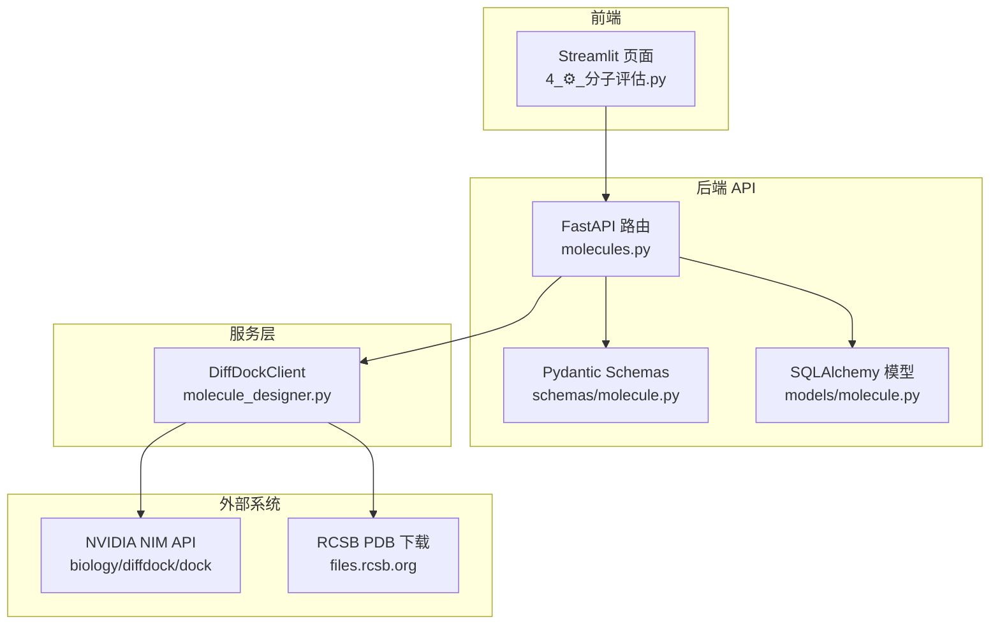
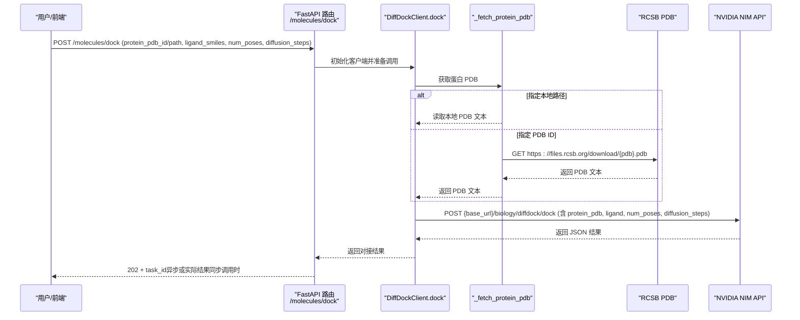
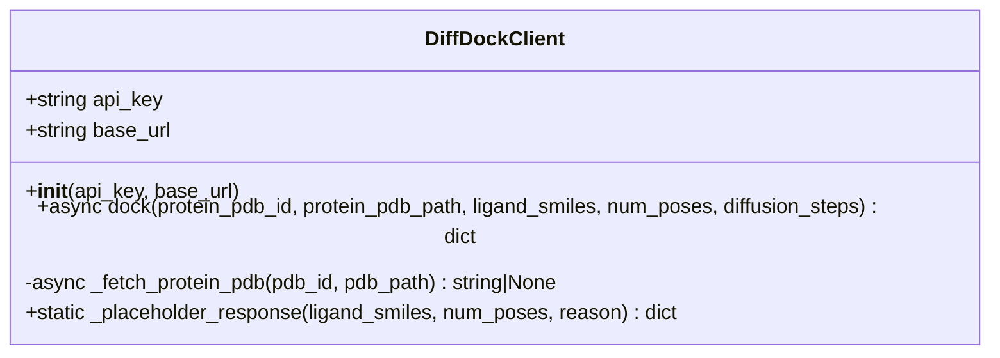
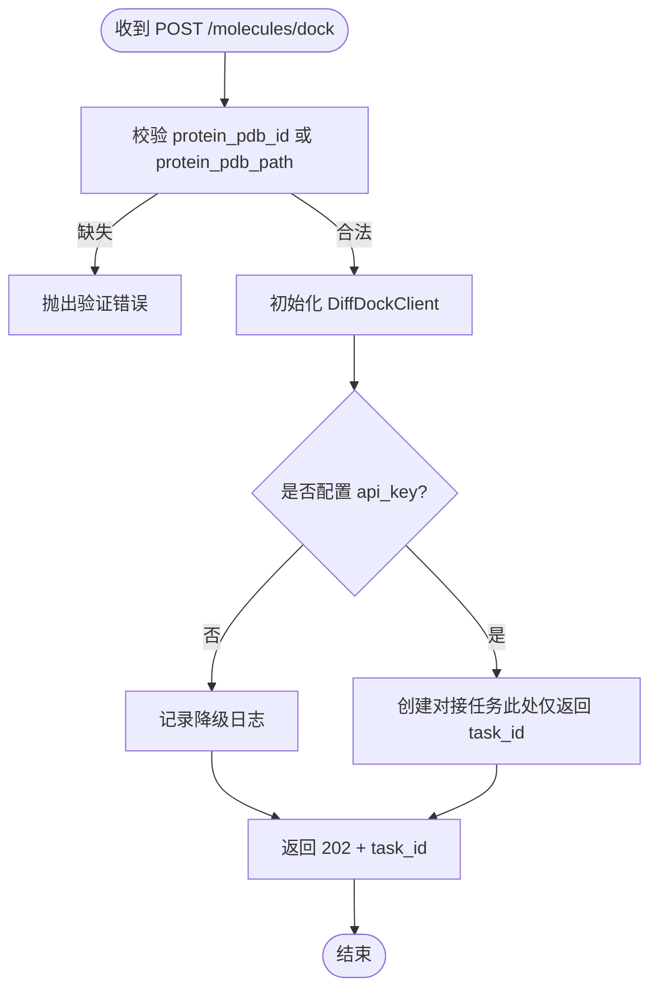
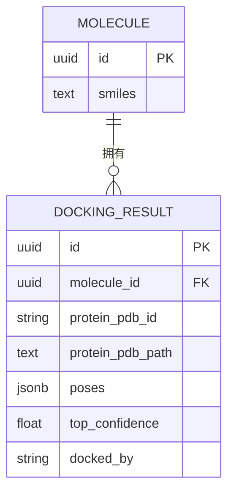
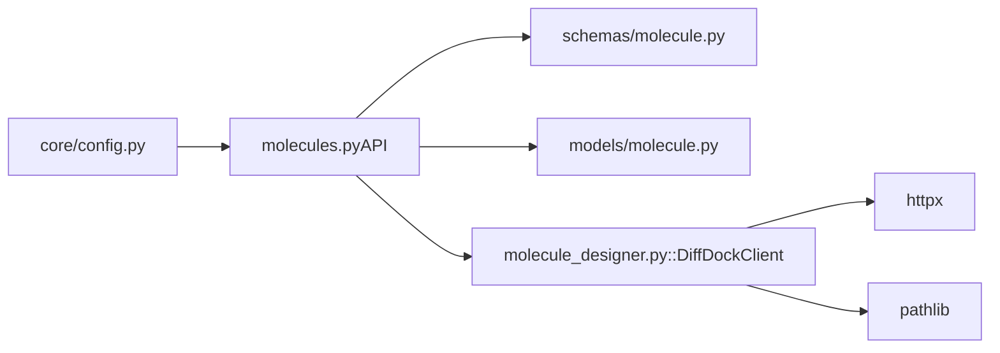

# 分子对接模拟

<cite>
**本文引用的文件列表**
- [molecule_designer.py](file://backend/app/services/analyzer/molecule_designer.py)
- [molecules.py（API）](file://backend/app/api/v1/molecules.py)
- [molecule.py（数据模型）](file://backend/app/models/molecule.py)
- [molecule.py（Schema）](file://backend/app/schemas/molecule.py)
- [config.py（配置）](file://backend/app/core/config.py)
- [test_p2_features.py（测试）](file://tests/test_p2_features.py)
- [4_⚙️_分子评估.py（前端页面）](file://frontend/pages/4_⚙️_分子评估.py)
</cite>

## 目录
1. [简介](#简介)
2. [项目结构](#项目结构)
3. [核心组件](#核心组件)
4. [架构总览](#架构总览)
5. [详细组件分析](#详细组件分析)
6. [依赖关系分析](#依赖关系分析)
7. [性能与可扩展性](#性能与可扩展性)
8. [故障排查指南](#故障排查指南)
9. [结论](#结论)
10. [附录：端到端工作流示例](#附录端到端工作流示例)

## 简介
本文件面向“分子对接模拟”能力，围绕 DiffDockClient 类的实现进行系统化文档化。内容涵盖：
- NVIDIA NIM API 集成方式、认证与超时策略
- 蛋白 PDB 获取（RCSB 下载或本地读取）
- 配体 SMILES 输入要求与参数校验
- 对接算法与扩散模型工作原理说明（概念性）
- 错误处理与降级响应策略
- 完整对接工作流（从靶点到候选分子的端到端流程）

## 项目结构
与分子对接相关的代码主要分布在以下模块：
- 服务层：DiffDockClient 实现对接调用与降级逻辑
- API 层：POST /molecules/dock 触发对接任务；GET /molecules/{id}/docking-results 查询结果
- 数据模型：Molecule 与 DockingResult 持久化对接结果
- Schema：请求/响应数据结构定义与校验
- 配置：NVIDIA NIM 相关环境变量与默认地址
- 前端：Streamlit 页面提供对接入口与交互

图表来源
- [molecules.py（API）:109-143](file://backend/app/api/v1/molecules.py#L109-L143)
- [molecule_designer.py:522-660](file://backend/app/services/analyzer/molecule_designer.py#L522-L660)
- [molecule.py（数据模型）:46-61](file://backend/app/models/molecule.py#L46-L61)
- [molecule.py（Schema）:56-93](file://backend/app/schemas/molecule.py#L56-L93)
- [config.py:62-66](file://backend/app/core/config.py#L62-L66)

章节来源
- [molecules.py（API）:109-143](file://backend/app/api/v1/molecules.py#L109-L143)
- [molecule_designer.py:522-660](file://backend/app/services/analyzer/molecule_designer.py#L522-L660)
- [molecule.py（数据模型）:46-61](file://backend/app/models/molecule.py#L46-L61)
- [molecule.py（Schema）:56-93](file://backend/app/schemas/molecule.py#L56-L93)
- [config.py:62-66](file://backend/app/core/config.py#L62-L66)

## 核心组件
- DiffDockClient：封装与 NVIDIA NIM 的对接调用，负责 PDB 获取、请求构造、异常捕获与降级占位响应生成。
- API 路由：/molecules/dock 接收对接请求并返回异步任务 ID；/molecules/{id}/docking-results 查询对接结果。
- 数据模型：DockingResult 存储对接 poses、置信度、来源等字段。
- Schema：DockingRequest/DockingResultResponse 等用于请求/响应校验与序列化。
- 配置：nim_api_key、nim_diffdock_url 等环境变量控制 NIM 接入。

章节来源
- [molecule_designer.py:522-660](file://backend/app/services/analyzer/molecule_designer.py#L522-L660)
- [molecules.py（API）:109-143](file://backend/app/api/v1/molecules.py#L109-L143)
- [molecule.py（数据模型）:46-61](file://backend/app/models/molecule.py#L46-L61)
- [molecule.py（Schema）:56-93](file://backend/app/schemas/molecule.py#L56-L93)
- [config.py:62-66](file://backend/app/core/config.py#L62-L66)

## 架构总览
下图展示从用户发起对接请求到最终返回结果的端到端流程，包括降级路径。

图表来源
- [molecules.py（API）:109-143](file://backend/app/api/v1/molecules.py#L109-L143)
- [molecule_designer.py:543-611](file://backend/app/services/analyzer/molecule_designer.py#L543-L611)
- [molecule_designer.py:613-638](file://backend/app/services/analyzer/molecule_designer.py#L613-L638)

## 详细组件分析

### DiffDockClient 类
职责与要点：
- 初始化：支持显式传入 api_key/base_url，否则从环境变量读取（NVIDIA_API_KEY/NIM_API_KEY 与 DIFFDOCK_NIM_URL），并提供默认 NIM base URL。
- dock 方法：
  - 若未配置 api_key，直接返回降级占位响应。
  - 通过 _fetch_protein_pdb 获取 PDB（优先本地路径，其次 RCSB 下载）。
  - 使用 httpx.AsyncClient 以 Bearer Token 调用 NIM biology/diffdock/dock 接口。
  - 非 200 状态码返回 error 信息；异常捕获后返回降级占位响应。
- _fetch_protein_pdb：
  - 若提供 protein_pdb_path，则读取本地文件。
  - 若提供 protein_pdb_id，则从 RCSB 下载对应 .pdb 文本。
- _placeholder_response：
  - 构造标准结构的降级响应，包含 status=degraded、error 原因、poses 占位条目、docked_by 标识。

图表来源
- [molecule_designer.py:522-660](file://backend/app/services/analyzer/molecule_designer.py#L522-L660)

章节来源
- [molecule_designer.py:522-660](file://backend/app/services/analyzer/molecule_designer.py#L522-L660)

### API 路由：/molecules/dock 与 /molecules/{id}/docking-results
- POST /molecules/dock：
  - 校验必须提供 protein_pdb_id 或 protein_pdb_path 之一。
  - 尝试初始化 DiffDockClient；若未配置 api_key，记录日志并返回降级任务 ID。
  - 返回 202 与 task_id，提示后续通过 GET /molecules/{id}/docking-results 查询结果。
- GET /molecules/{id}/docking-results：
  - 根据 molecule_id 查询 DockingResult 列表并返回。

图表来源
- [molecules.py（API）:109-143](file://backend/app/api/v1/molecules.py#L109-L143)

章节来源
- [molecules.py（API）:109-143](file://backend/app/api/v1/molecules.py#L109-L143)
- [molecules.py（API）:194-216](file://backend/app/api/v1/molecules.py#L194-L216)

### 数据模型与 Schema
- DockingResult：
  - 字段：molecule_id、protein_pdb_id、protein_pdb_path、poses（JSON）、top_confidence、docked_by。
- DockingRequest：
  - 字段：protein_pdb_id、protein_pdb_path、ligand_smiles、num_poses、diffusion_steps。
- DockingPose：
  - 字段：confidence、coordinates、sdf。
- DockingResultResponse：
  - 字段：molecule_id、protein_pdb_id、protein_pdb_path、poses、top_confidence、docked_by。

图表来源
- [molecule.py（数据模型）:46-61](file://backend/app/models/molecule.py#L46-L61)

章节来源
- [molecule.py（数据模型）:46-61](file://backend/app/models/molecule.py#L46-L61)
- [molecule.py（Schema）:56-93](file://backend/app/schemas/molecule.py#L56-L93)

### 配置与环境变量
- nim_api_key：NVIDIA NIM API Key。
- nim_diffdock_url：NIM DiffDock 服务地址（默认指向 integrate.api.nvidia.com）。
- 运行时也可通过环境变量覆盖：
  - NVIDIA_API_KEY 或 NIM_API_KEY（DiffDockClient 内部读取）
  - DIFFDOCK_NIM_URL（DiffDockClient 内部读取）

章节来源
- [config.py:62-66](file://backend/app/core/config.py#L62-L66)
- [molecule_designer.py:529-541](file://backend/app/services/analyzer/molecule_designer.py#L529-L541)

### 错误处理与降级策略
- 无 API Key：返回 status=degraded，error 包含“api_key_missing”，并生成若干占位 poses。
- PDB 获取失败：返回 status=error，error 为“无法获取蛋白 PDB 结构”。
- NIM API 非 200：返回 status=error，error 包含状态码与部分响应体。
- 网络/调用异常：捕获异常并返回 status=degraded，error 包含“api_error: ...”。
- 占位响应结构稳定，便于前端统一渲染与提示。

章节来源
- [molecule_designer.py:563-611](file://backend/app/services/analyzer/molecule_designer.py#L563-L611)
- [molecule_designer.py:640-660](file://backend/app/services/analyzer/molecule_designer.py#L640-L660)

### 测试覆盖
- 初始化行为：显式传入 api_key 生效；默认 base_url 包含 nvidia.com。
- 无 API Key 场景：返回 degraded 状态与占位 poses，且 poses 结构包含 confidence、coordinates、sdf、position。

章节来源
- [test_p2_features.py:180-221](file://tests/test_p2_features.py#L180-L221)

## 依赖关系分析
- DiffDockClient 依赖：
  - httpx：异步 HTTP 客户端，用于 RCSB 下载与 NIM 调用。
  - pathlib：本地 PDB 文件读取。
- API 路由依赖：
  - FastAPI、SQLAlchemy、Pydantic 校验与数据库访问。
- 数据模型依赖：
  - SQLAlchemy ORM 映射与 JSONB 兼容类型。
- 配置依赖：
  - pydantic-settings 加载 .env 与系统环境变量。

图表来源
- [molecules.py（API）:109-143](file://backend/app/api/v1/molecules.py#L109-L143)
- [molecule_designer.py:522-660](file://backend/app/services/analyzer/molecule_designer.py#L522-L660)
- [config.py:62-66](file://backend/app/core/config.py#L62-L66)

章节来源
- [molecules.py（API）:109-143](file://backend/app/api/v1/molecules.py#L109-L143)
- [molecule_designer.py:522-660](file://backend/app/services/analyzer/molecule_designer.py#L522-L660)
- [config.py:62-66](file://backend/app/core/config.py#L62-L66)

## 性能与可扩展性
- 超时设置：
  - NIM 调用超时 300 秒，适合长耗时对接计算。
  - RCSB 下载超时 30 秒，避免长时间阻塞。
- 并发与异步：
  - 使用 httpx.AsyncClient 提升 I/O 效率。
- 扩展建议：
  - 引入任务队列（如 Celery/RQ）将 dock 真正异步化，避免请求阻塞。
  - 增加重试与退避策略，提高对外部服务的鲁棒性。
  - 对 PDB 内容进行缓存（本地或对象存储），减少重复下载。

[本节为通用指导，不直接分析具体文件]

## 故障排查指南
- 现象：返回 status=degraded，error 包含“api_key_missing”
  - 检查环境变量 NVIDIA_API_KEY 或 NIM_API_KEY 是否正确配置。
  - 确认 DiffDockClient 初始化时能读到 api_key。
- 现象：PDB 下载失败
  - 检查网络连接与 RCSB 可达性。
  - 确认提供的 protein_pdb_id 有效。
  - 可改用 protein_pdb_path 指向本地 PDB 文件。
- 现象：NIM API 返回非 200
  - 查看 error 中的状态码与响应片段，定位服务端问题。
  - 检查 Authorization Bearer Token 是否有效。
- 现象：前端提交对接表单无响应
  - 确认 Streamlit 页面提交的字段名与后端 Schema 一致（例如 ligand_smiles、num_poses）。
  - 参考前端页面中对接表单字段映射。

章节来源
- [molecule_designer.py:563-611](file://backend/app/services/analyzer/molecule_designer.py#L563-L611)
- [molecule_designer.py:613-638](file://backend/app/services/analyzer/molecule_designer.py#L613-L638)
- [4_⚙️_分子评估.py:76-106](file://frontend/pages/4_⚙️_分子评估.py#L76-L106)

## 结论
DiffDockClient 提供了稳定的对接能力封装，具备完善的降级策略与清晰的错误反馈。结合 API 路由与数据模型，系统实现了从请求到结果查询的完整闭环。建议在后续版本中引入任务队列与缓存机制，以提升整体吞吐与稳定性。

[本节为总结性内容，不直接分析具体文件]

## 附录：端到端工作流示例
以下为从靶点蛋白到候选分子对接的端到端步骤（基于现有代码与测试用例）：

- 环境准备
  - 配置 NVIDIA_API_KEY 或 NIM_API_KEY。
  - 可选：DIFFDOCK_NIM_URL 自定义 NIM 服务地址。
- 准备输入
  - 配体 SMILES：确保为有效 SMILES 字符串（最小长度由 Schema 校验）。
  - 蛋白结构：
    - 方案一：提供 protein_pdb_id（如 6LU7），系统将自动从 RCSB 下载。
    - 方案二：提供 protein_pdb_path，系统将读取本地 PDB 文件。
- 发起对接
  - 调用 POST /molecules/dock，携带 DockingRequest 字段。
  - 若未配置 api_key，将返回 202 与降级任务 ID。
- 查询结果
  - 调用 GET /molecules/{molecule_id}/docking-results，获取 DockingResultResponse 列表。
- 前端交互
  - 在 Streamlit “分子评估”页面的“分子对接”标签页中填写 SMILES、PDB ID、构象数并提交。

章节来源
- [molecule.py（Schema）:56-93](file://backend/app/schemas/molecule.py#L56-L93)
- [molecules.py（API）:109-143](file://backend/app/api/v1/molecules.py#L109-L143)
- [molecules.py（API）:194-216](file://backend/app/api/v1/molecules.py#L194-L216)
- [4_⚙️_分子评估.py:76-106](file://frontend/pages/4_⚙️_分子评估.py#L76-L106)
- [test_p2_features.py:188-221](file://tests/test_p2_features.py#L188-L221)

## 补充说明：DiffDock 扩散模型与对接算法（概念性）
- 扩散模型原理（概述）：
  - 扩散模型通过在噪声空间中逐步去噪来学习数据分布。在分子对接中，模型学习蛋白质-配体的三维空间分布，从而预测可能的结合构象。
- 对接算法技术细节（概述）：
  - 输入为蛋白结构与配体 SMILES，输出为多个候选构象（poses），每个 pose 包含置信度、坐标与可选的 SDF 文件。
  - 扩散步骤数（diffusion_steps）影响搜索精度与耗时；构象数量（num_poses）控制采样规模。
- 构象搜索策略（概述）：
  - 通过多步去噪过程探索构象空间，结合能量评分或模型置信度筛选最优构象。
  - 该仓库通过 NIM API 执行实际计算，客户端侧负责参数传递与结果解析。

[本节为概念性说明，不直接分析具体文件]