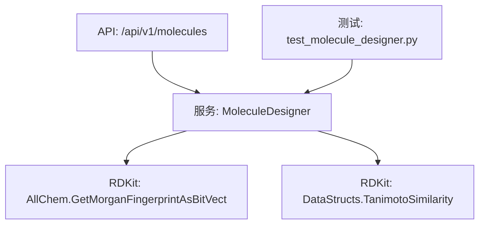
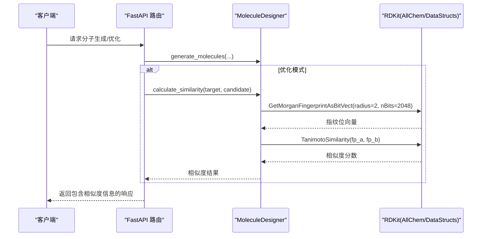
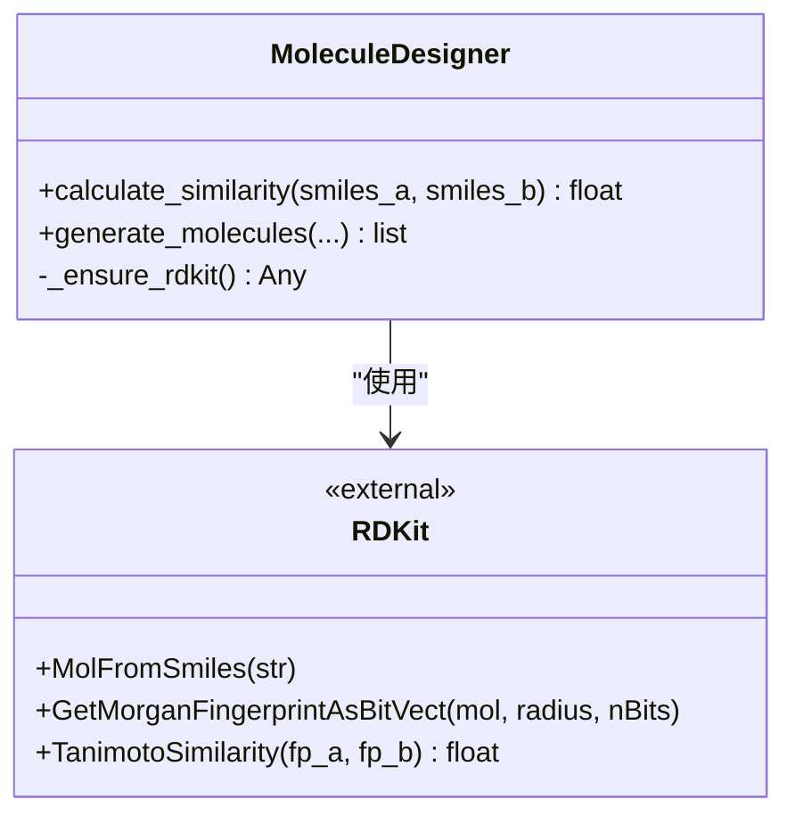

# 分子相似性分析

<cite>
**本文引用的文件**   
- [molecule_designer.py](file://backend/app/services/analyzer/molecule_designer.py)
- [molecules.py](file://backend/app/api/v1/molecules.py)
- [test_molecule_designer.py](file://tests/test_molecule_designer.py)
</cite>

## 目录
1. [简介](#简介)
2. [项目结构](#项目结构)
3. [核心组件](#核心组件)
4. [架构总览](#架构总览)
5. [详细组件分析](#详细组件分析)
6. [依赖关系分析](#依赖关系分析)
7. [性能与复杂度](#性能与复杂度)
8. [参数设置与阈值指南](#参数设置与阈值指南)
9. [应用场景与实践](#应用场景与实践)
10. [故障排查](#故障排查)
11. [结论](#结论)

## 简介
本文件聚焦于“分子相似性分析”能力，围绕 calculate_similarity 方法展开，系统阐述其实现细节：基于 Morgan 指纹（ECFP）的位向量构建、Tanimoto 相似度度量、关键参数（半径、指纹长度）的选择依据与影响，以及在实际药物研发流程中的应用策略（如先导化合物优化、类似物设计、虚拟筛选等）。同时提供计算复杂度分析与可操作的建议。

## 项目结构
与分子相似性相关的代码主要位于后端服务层与 API 层：
- 服务层：MoleculeDesigner.calculate_similarity 实现核心算法
- API 层：/api/v1/molecules 暴露分子相关接口（生成、评估、解释等），相似性计算作为内部工具被调用
- 测试：针对相似性的单元测试覆盖相同分子、不同分子与无效输入场景

图表来源
- [molecules.py](file://backend/app/api/v1/molecules.py)
- [molecule_designer.py](file://backend/app/services/analyzer/molecule_designer.py)
- [test_molecule_designer.py](file://tests/test_molecule_designer.py)

章节来源
- [molecule_designer.py](file://backend/app/services/analyzer/molecule_designer.py)
- [molecules.py](file://backend/app/api/v1/molecules.py)
- [test_molecule_designer.py](file://tests/test_molecule_designer.py)

## 核心组件
- MoleculeDesigner.calculate_similarity
  - 输入：两个分子的 SMILES 字符串
  - 输出：Tanimoto 相似度（0~1），无效分子返回 0
  - 步骤：
    1) 解析 SMILES 为 RDKit Mol 对象
    2) 使用 Morgan 指纹（半径=2，nBits=2048）生成位向量
    3) 计算 Tanimoto 相似度并返回浮点值

章节来源
- [molecule_designer.py](file://backend/app/services/analyzer/molecule_designer.py)

## 架构总览
从调用链看，相似性计算通常由上层业务逻辑或生成式模块触发，例如在“基于参考分子的相似性优化”流程中，会反复调用 calculate_similarity 对候选分子进行评分与排序。

图表来源
- [molecule_designer.py](file://backend/app/services/analyzer/molecule_designer.py)
- [molecules.py](file://backend/app/api/v1/molecules.py)

## 详细组件分析

### 组件：calculate_similarity
- 功能：计算两分子间的 Tanimoto 相似度
- 关键实现要点：
  - 惰性加载 RDKit，避免未安装时启动失败
  - 通过 Chem.MolFromSmiles 解析 SMILES，若任一解析失败直接返回 0
  - 使用 AllChem.GetMorganFingerprintAsBitVect(mol, radius=2, nBits=2048) 生成 Morgan 指纹位向量
  - 使用 DataStructs.TanimotoSimilarity(fp_a, fp_b) 计算相似度

```mermaid
flowchart TD
Start(["进入 calculate_similarity"]) --> ParseA["解析 SMILES_A 为 Mol"]
ParseA --> ParseB["解析 SMILES_B 为 Mol"]
ParseA --> |解析失败| ReturnZeroA["返回 0.0"]
ParseB --> |解析失败| ReturnZeroB["返回 0.0"]
ParseA --> GenFP_A["生成 Morgan 指纹<br/>radius=2, nBits=2048"]
ParseB --> GenFP_B["生成 Morgan 指纹<br/>radius=2, nBits=2048"]
GenFP_A --> Tanimoto["计算 Tanimoto 相似度"]
GenFP_B --> Tanimoto
Tanimoto --> End(["返回相似度 (0~1)"])
```

图表来源
- [molecule_designer.py](file://backend/app/services/analyzer/molecule_designer.py)

章节来源
- [molecule_designer.py](file://backend/app/services/analyzer/molecule_designer.py)

### 组件：generate_molecules（与相似性联动）
- 功能：支持片段组装、随机生成、基于参考分子的相似性优化三种策略
- 与相似性的关联：
  - 在“optimization”模式下，会对生成的候选分子与目标分子计算相似度，用于排序与筛选
  - 该流程间接体现了相似性驱动的虚拟筛选思想

章节来源
- [molecule_designer.py](file://backend/app/services/analyzer/molecule_designer.py)

### 测试用例：TestSimilarity
- 覆盖场景：
  - 相同分子相似度应接近 1
  - 不同分子相似度小于 1
  - 无效 SMILES 返回 0

章节来源
- [test_molecule_designer.py](file://tests/test_molecule_designer.py)

## 依赖关系分析
- 外部依赖：
  - RDKit：化学信息学核心库，提供分子解析、指纹生成与相似度计算
- 内部依赖：
  - MoleculeDesigner 类封装了 RDKit 的惰性加载与错误处理
  - API 层通过 FastAPI 路由组织接口，服务层负责具体计算

图表来源
- [molecule_designer.py](file://backend/app/services/analyzer/molecule_designer.py)

章节来源
- [molecule_designer.py](file://backend/app/services/analyzer/molecule_designer.py)

## 性能与复杂度
- 时间复杂度：
  - 指纹生成：近似 O(N)，N 为分子中原子数与环/键特征数量；半径越大，局部环境展开越多，特征计数增加
  - Tanimoto 相似度：O(K)，K 为指纹位数（nBits=2048），按位运算求交集与并集
- 空间复杂度：
  - 指纹存储：O(nBits) 位向量
- 实际影响：
  - 半径=2 是常用折中，兼顾局部结构与全局拓扑表达力
  - nBits=2048 在精度与内存/速度之间平衡，适合大多数中小规模分子库
  - 大规模筛选建议结合索引（如位图倒排、LSH）或并行化

[本节为通用性能讨论，不直接分析具体文件]

## 参数设置与阈值指南
- 半径（radius=2）选择依据：
  - 半径=2 能捕获原子周围两层邻域信息，对药效团与骨架差异敏感，常用于 ECFP/Morgan 指纹
  - 增大半径可提升区分度但会增加计算成本与稀疏性
- 指纹长度（nBits=2048）选择依据：
  - 2048 位能在多数情况下保持足够区分度且控制碰撞率
  - 更大位数可降低哈希冲突，但会牺牲部分速度与内存效率
- 相似度阈值设定指南：
  - 高阈值（≥0.85）：严格相似，适用于寻找近类似物、减少结构漂移
  - 中等阈值（0.6~0.85）：平衡多样性和相似性，适合先导优化与骨架保留
  - 低阈值（<0.6）：更宽松，适合探索新骨架或广谱筛选
- 实践建议：
  - 以目标分子为中心，先以中等阈值初筛，再结合类药性与 ADMET 指标二次过滤
  - 对大型库可采用分层阈值策略：粗筛→精筛→实验验证

[本节为通用指导，不直接分析具体文件]

## 应用场景与实践
- 先导化合物优化：
  - 以活性分子为目标，生成结构相近的衍生物，利用相似度与性质预测联合排序
- 类似物设计：
  - 固定骨架，替换侧链基团，维持较高相似度同时改善理化性质
- 分子库筛选：
  - 将候选库与已知活性分子比对，优先保留高相似度分子，降低后续实验成本
- 工作流集成：
  - 在 generate_molecules 的优化模式中，自动计算候选与目标的相似度，辅助决策

章节来源
- [molecule_designer.py](file://backend/app/services/analyzer/molecule_designer.py)

## 故障排查
- 常见错误与处理：
  - RDKit 未安装：服务层会抛出运行时异常，API 层捕获后返回降级响应
  - 无效 SMILES：calculate_similarity 直接返回 0，需检查输入格式
  - 性能问题：大规模计算时考虑并行化或缓存指纹
- 定位建议：
  - 查看日志中的警告与错误信息
  - 确认环境变量与依赖安装状态
  - 使用最小复现用例验证 RDKit 可用性

章节来源
- [molecule_designer.py](file://backend/app/services/analyzer/molecule_designer.py)
- [molecules.py](file://backend/app/api/v1/molecules.py)

## 结论
calculate_similarity 以 Morgan 指纹与 Tanimoto 相似度为核心，提供了稳定高效的分子相似性度量能力。通过合理设置半径与指纹长度，并结合阈值策略与多指标筛选，可在先导优化、类似物设计与虚拟筛选等场景中显著提升研发效率。建议在工程实践中引入缓存与并行化，以应对大规模分子库的计算需求。