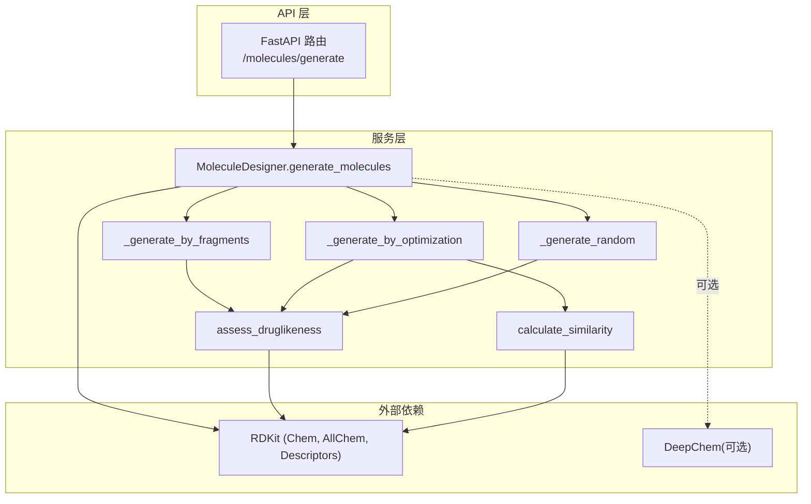
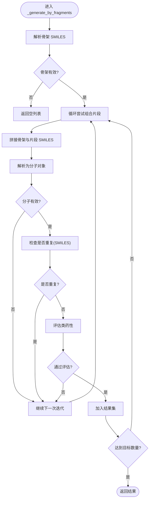
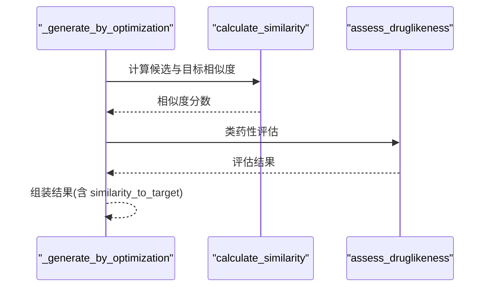
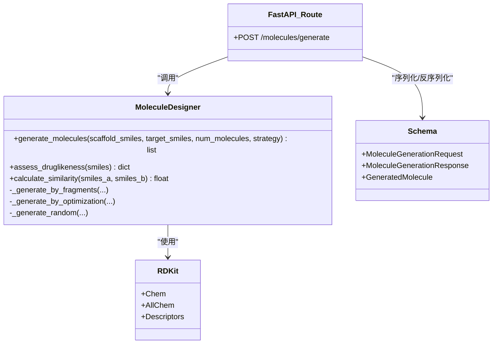

# 分子结构生成

<cite>
**本文引用的文件**   
- [molecule_designer.py](file://backend/app/services/analyzer/molecule_designer.py)
- [molecules.py](file://backend/app/api/v1/molecules.py)
- [molecule.py](file://backend/app/schemas/molecule.py)
- [test_molecule_designer.py](file://tests/test_molecule_designer.py)
</cite>

## 目录
1. [简介](#简介)
2. [项目结构](#项目结构)
3. [核心组件](#核心组件)
4. [架构总览](#架构总览)
5. [详细组件分析](#详细组件分析)
6. [依赖关系分析](#依赖关系分析)
7. [性能与优化建议](#性能与优化建议)
8. [故障排查指南](#故障排查指南)
9. [结论](#结论)
10. [附录：使用示例与参数调优](#附录使用示例与参数调优)

## 简介
本文件聚焦于“分子结构生成功能”，围绕 MoleculeDesigner 类中的 generate_molecules 方法，系统阐述三种生成策略：
- 基于片段组合的分子生成（fragment）
- 基于参考分子的相似性优化生成（optimization）
- 随机分子生成（random）

文档将解释每种算法的工作原理、参数配置与适用场景；说明片段库设计思路、骨架生长机制、SMILES 字符串操作技术；并提供端到端的使用示例、参数调优建议与性能优化技巧。同时涵盖生成分子的验证流程、去重机制与质量控制措施。

## 项目结构
与分子生成相关的代码主要分布在以下位置：
- 服务层：MoleculeDesigner 实现核心生成逻辑与评估能力
- API 层：FastAPI 路由暴露 /molecules/generate 等接口
- Schema 层：请求/响应模型定义
- 测试层：单元测试覆盖关键行为



图表来源
- [molecules.py:301-354](file://backend/app/api/v1/molecules.py#L301-L354)
- [molecule_designer.py:360-519](file://backend/app/services/analyzer/molecule_designer.py#L360-L519)

章节来源
- [molecules.py:301-354](file://backend/app/api/v1/molecules.py#L301-L354)
- [molecule_designer.py:360-519](file://backend/app/services/analyzer/molecule_designer.py#L360-L519)
- [molecule.py:114-148](file://backend/app/schemas/molecule.py#L114-L148)

## 核心组件
- MoleculeDesigner：封装 RDKit 与 DeepChem 的惰性加载，提供类药性评估、性质预测、相似度计算与分子生成。
- generate_molecules：统一入口，根据 strategy 分派到具体生成器。
- _generate_by_fragments：基于预定义片段与骨架的组合生成。
- _generate_by_optimization：以目标分子为参考，进行相似性导向的衍生化生成。
- _generate_random：从片段库中随机采样生成候选。
- assess_druglikeness：基于 Lipinski/Veber/QED 的规则评估。
- calculate_similarity：基于 Morgan 指纹的 Tanimoto 相似度。

章节来源
- [molecule_designer.py:20-519](file://backend/app/services/analyzer/molecule_designer.py#L20-L519)

## 架构总览
下图展示从 HTTP 请求到生成结果的调用链路与数据流。

```mermaid
sequenceDiagram
participant Client as "客户端"
participant API as "FastAPI 路由<br/>/molecules/generate"
participant Designer as "MoleculeDesigner"
participant Frag as "_generate_by_fragments"
participant Opt as "_generate_by_optimization"
participant Rand as "_generate_random"
participant Eval as "assess_druglikeness"
participant Sim as "calculate_similarity"
participant RDKit as "RDKit"
Client->>API : POST {scaffold_smiles,target_smiles,num_molecules,strategy}
API->>Designer : generate_molecules(...)
alt strategy == "fragment"
Designer->>Frag : 传入 scaffold + num_molecules
Frag->>RDKit : 解析骨架/片段 SMILES
Frag->>Eval : 对每个候选做类药性评估
Frag-->>Designer : 返回候选列表
else strategy == "optimization"
Designer->>Opt : 传入 target_smiles + num_molecules
Opt->>Sim : 计算与目标的相似度
Opt->>Eval : 类药性评估
Opt-->>Designer : 返回候选列表
else strategy == "random"
Designer->>Rand : 传入 num_molecules
Rand->>Eval : 类药性评估
Rand-->>Designer : 返回候选列表
end
Designer-->>API : 标准化后的结果
API-->>Client : ApiResponse(MoleculeGenerationResponse)
```

图表来源
- [molecules.py:301-354](file://backend/app/api/v1/molecules.py#L301-L354)
- [molecule_designer.py:360-519](file://backend/app/services/analyzer/molecule_designer.py#L360-L519)

## 详细组件分析

### 生成入口：generate_molecules
- 功能：根据 strategy 选择具体生成路径；支持 fragment、optimization、random 三种策略。
- 参数：
  - scaffold_smiles：骨架 SMILES（fragment 策略时作为基础骨架）
  - target_smiles：参考分子 SMILES（optimization 策略时用于相似度约束）
  - num_molecules：期望生成的分子数量
  - strategy：生成策略枚举值
- 返回值：包含 smiles、druglikeness、similarity_to_target、source/modification 等字段的候选列表。

章节来源
- [molecule_designer.py:360-391](file://backend/app/services/analyzer/molecule_designer.py#L360-L391)

#### 策略一：基于片段组合（fragment）
- 工作原理：
  - 维护一个药物化学常见片段集合（如苯环、吡啶、羧基、酰胺、羟基、氨基、卤素取代等）。
  - 若未提供骨架，则默认使用苯环作为骨架。
  - 通过 SMILES 拼接方式将片段与骨架组合，尝试构建有效分子。
  - 使用 set 记录已生成的 SMILES 进行去重。
  - 对每个候选执行类药性评估，仅保留有效的分子。
- 关键流程（流程图）：



图表来源
- [molecule_designer.py:393-454](file://backend/app/services/analyzer/molecule_designer.py#L393-L454)

- 片段库设计思路：
  - 选取常见药效团与可合成片段，兼顾芳香环、杂环、极性基团与卤素取代，提升多样性与类药性概率。
- 骨架生长机制：
  - 当前实现采用“拼接”简化策略，实际生产环境应替换为反应模板或生成模型驱动的骨架扩展。
- 适用场景：
  - 已知骨架但需要快速探索周边化学空间，适合先导化合物优化初期。

章节来源
- [molecule_designer.py:393-454](file://backend/app/services/analyzer/molecule_designer.py#L393-L454)

#### 策略二：基于参考分子的相似性优化（optimization）
- 工作原理：
  - 以 target_smiles 为参考，计算候选与目标的 Morgan 指纹 Tanimoto 相似度。
  - 在参考分子基础上进行简单修饰（占位实现），并评估类药性与相似度。
  - 返回包含 similarity_to_target 字段的结果，便于后续筛选。
- 关键流程（序列图片段）：



图表来源
- [molecule_designer.py:456-491](file://backend/app/services/analyzer/molecule_designer.py#L456-L491)
- [molecule_designer.py:333-358](file://backend/app/services/analyzer/molecule_designer.py#L333-L358)

- 适用场景：
  - 需要在保持高相似性的前提下微调性质（如改善溶解度、降低毒性风险）。
- 注意：
  - 当前实现为占位，生产环境应引入 SMILES LSTM/GAN 或基于反应的定向合成路径。

章节来源
- [molecule_designer.py:456-491](file://backend/app/services/analyzer/molecule_designer.py#L456-L491)
- [molecule_designer.py:333-358](file://backend/app/services/analyzer/molecule_designer.py#L333-L358)

#### 策略三：随机分子生成（random）
- 工作原理：
  - 从片段库中随机采样片段，直接评估其类药性并输出。
  - 适用于快速探索小片段空间或作为对比基线。
- 适用场景：
  - 快速验证评估管线、生成小规模候选集。

章节来源
- [molecule_designer.py:493-519](file://backend/app/services/analyzer/molecule_designer.py#L493-L519)

### 质量评估与相似度计算
- assess_druglikeness：
  - 计算分子量、LogP、氢键供体/受体、旋转键数、TPSA。
  - 应用 Lipinski 五规则与 Veber 规则，并计算 QED 分数。
  - 返回 valid 标志与 violations 列表，便于下游过滤。
- calculate_similarity：
  - 使用 Morgan 指纹（半径=2，长度=2048）计算 Tanimoto 相似度。
  - 无效分子返回 0。

章节来源
- [molecule_designer.py:71-134](file://backend/app/services/analyzer/molecule_designer.py#L71-L134)
- [molecule_designer.py:333-358](file://backend/app/services/analyzer/molecule_designer.py#L333-L358)

### API 集成与数据契约
- 请求模型（MoleculeGenerationRequest）：
  - scaffold_smiles：可选骨架 SMILES
  - target_smiles：可选参考分子 SMILES
  - num_molecules：[1,100]
  - strategy：fragment | random | optimization
- 响应模型（MoleculeGenerationResponse）：
  - strategy：使用的策略
  - molecules：GeneratedMolecule 列表
  - model_used：模型版本标识
- GeneratedMolecule：
  - smiles、druglikeness、similarity_to_target、source、modification

章节来源
- [molecule.py:114-148](file://backend/app/schemas/molecule.py#L114-L148)
- [molecules.py:301-354](file://backend/app/api/v1/molecules.py#L301-L354)

## 依赖关系分析
- 内部依赖：
  - API 路由依赖 MoleculeDesigner 提供的生成与评估能力。
  - 生成器依赖 assess_druglikeness 与 calculate_similarity 完成质量控制与相似度度量。
- 外部依赖：
  - RDKit：分子解析、描述符计算、指纹生成与相似度计算。
  - DeepChem（可选）：性质预测（当前实现降级为规则模型）。



图表来源
- [molecule_designer.py:20-519](file://backend/app/services/analyzer/molecule_designer.py#L20-L519)
- [molecules.py:301-354](file://backend/app/api/v1/molecules.py#L301-L354)
- [molecule.py:114-148](file://backend/app/schemas/molecule.py#L114-L148)

章节来源
- [molecule_designer.py:20-519](file://backend/app/services/analyzer/molecule_designer.py#L20-L519)
- [molecules.py:301-354](file://backend/app/api/v1/molecules.py#L301-L354)
- [molecule.py:114-148](file://backend/app/schemas/molecule.py#L114-L148)

## 性能与优化建议
- 批量评估缓存：
  - 对同一 SMILES 多次评估时，增加内存缓存（LRU）以减少 RDKit 重复计算。
- 并行化：
  - 对大量候选的类药性评估与相似度计算可使用线程池或进程池并行处理。
- 片段库扩展：
  - 引入更丰富的片段集与反应模板，提高生成多样性与有效性。
- 生成策略增强：
  - 将“拼接”替换为基于反应的组合或生成模型（SMILES LSTM/GAN），提升真实可合成性与新颖性。
- 去重与早停：
  - 在生成过程中尽早过滤无效 SMILES，减少后续评估开销。
- 资源控制：
  - 限制单次请求的最大生成数量，避免长时间占用资源。

[本节为通用指导，不直接分析具体文件]

## 故障排查指南
- RDKit 未安装：
  - 现象：生成或评估抛出运行时错误。
  - 处理：安装 rdkit 后重试；API 层会返回 ValidationError 提示缺失依赖。
- 无效 SMILES：
  - 现象：assess_druglikeness 返回 valid=False 且包含 error 字段。
  - 处理：检查输入 SMILES 语法；确保骨架/片段为合法 SMILES。
- 生成结果为空：
  - 可能原因：骨架无效、片段组合无法形成有效分子、num_molecules 过大导致早期终止。
  - 处理：更换骨架、扩大片段库、调整 num_molecules。
- 相似度为 0：
  - 可能原因：任一分子无效或指纹计算失败。
  - 处理：校验输入分子有效性。

章节来源
- [test_molecule_designer.py:29-41](file://tests/test_molecule_designer.py#L29-L41)
- [molecules.py:350-354](file://backend/app/api/v1/molecules.py#L350-L354)

## 结论
MoleculeDesigner 的 generate_molecules 提供了三种实用的分子生成策略，结合 RDKit 的类药性评估与相似度计算，形成了完整的“生成—评估—筛选”闭环。当前实现为简化版，适合作为原型与教学演示；在生产环境中建议引入更强大的生成模型与反应模板，以提升分子的可合成性与新颖性。

[本节为总结，不直接分析具体文件]

## 附录：使用示例与参数调优

### 使用示例（HTTP 调用）
- 基于片段组合（fragment）
  - 请求体：{ "scaffold_smiles": "c1ccccc1", "num_molecules": 5, "strategy": "fragment" }
  - 预期：返回 5 个候选分子及其类药性评估结果。
- 基于参考分子优化（optimization）
  - 请求体：{ "target_smiles": "CC(C)CC1=CC=C(C=C1)CC(C(=O)O)C", "num_molecules": 5, "strategy": "optimization" }
  - 预期：返回候选分子及 similarity_to_target 字段。
- 随机生成（random）
  - 请求体：{ "num_molecules": 5, "strategy": "random" }
  - 预期：返回随机片段候选及其类药性评估。

章节来源
- [molecules.py:301-354](file://backend/app/api/v1/molecules.py#L301-L354)
- [molecule.py:114-148](file://backend/app/schemas/molecule.py#L114-L148)

### 参数调优建议
- num_molecules：
  - 建议从较小值开始（如 10），逐步增大以观察生成效率与质量变化。
- scaffold_smiles：
  - 选择具有明确药效团的骨架，有助于提高生成分子的活性可能性。
- target_smiles：
  - 选择与目标靶点活性相关的参考分子，以获得更高相似度的优化结果。
- strategy：
  - 探索阶段优先使用 fragment 或 random；优化阶段使用 optimization。

### 质量控制与去重机制
- 去重：
  - 使用 SMILES 字符串作为唯一键，避免重复候选进入结果集。
- 类药性过滤：
  - 仅保留通过 Lipinski/Veber/QED 评估的分子。
- 相似度阈值：
  - 在 optimization 策略中，可根据业务需求设置最小相似度阈值进行二次筛选。

章节来源
- [molecule_designer.py:393-454](file://backend/app/services/analyzer/molecule_designer.py#L393-L454)
- [molecule_designer.py:456-491](file://backend/app/services/analyzer/molecule_designer.py#L456-L491)
- [molecule_designer.py:71-134](file://backend/app/services/analyzer/molecule_designer.py#L71-L134)