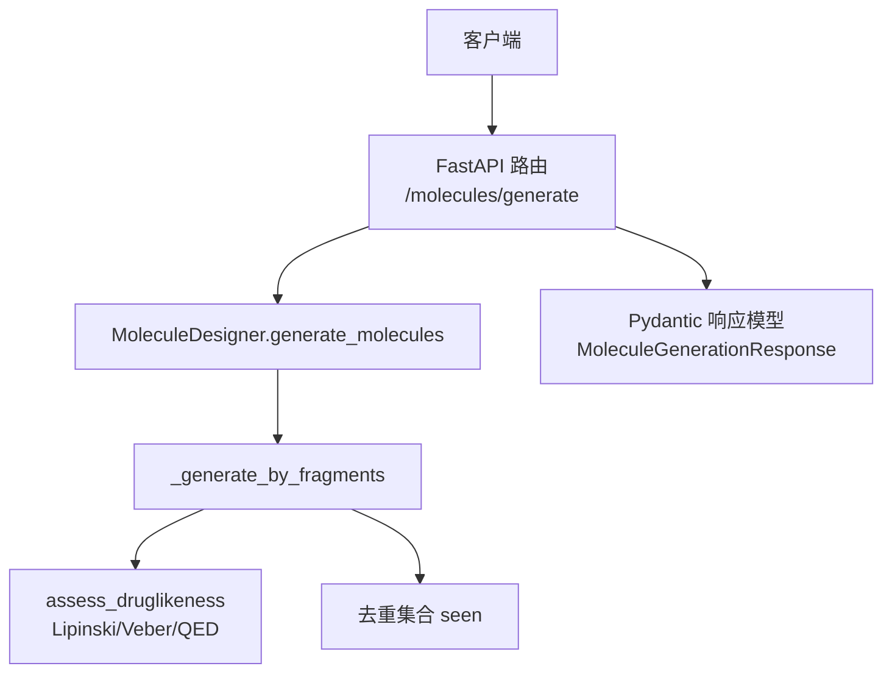
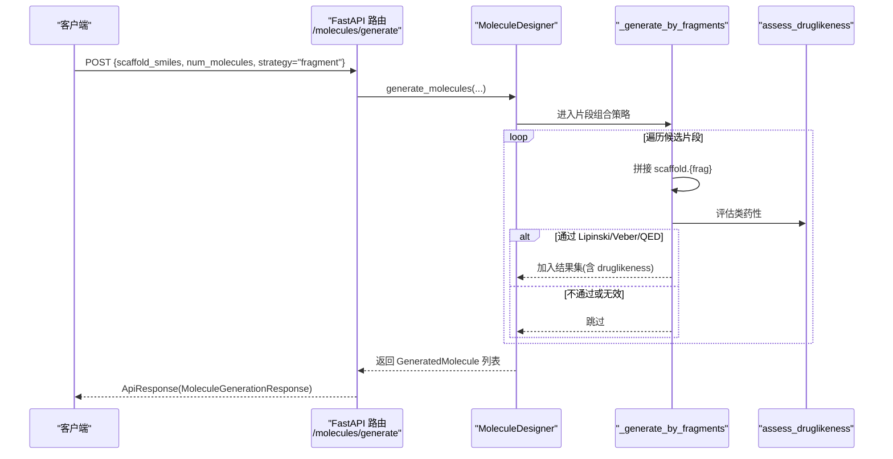
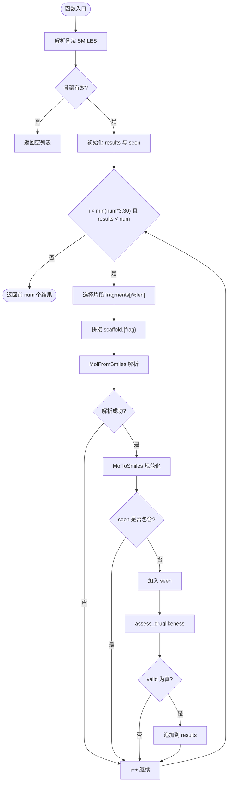
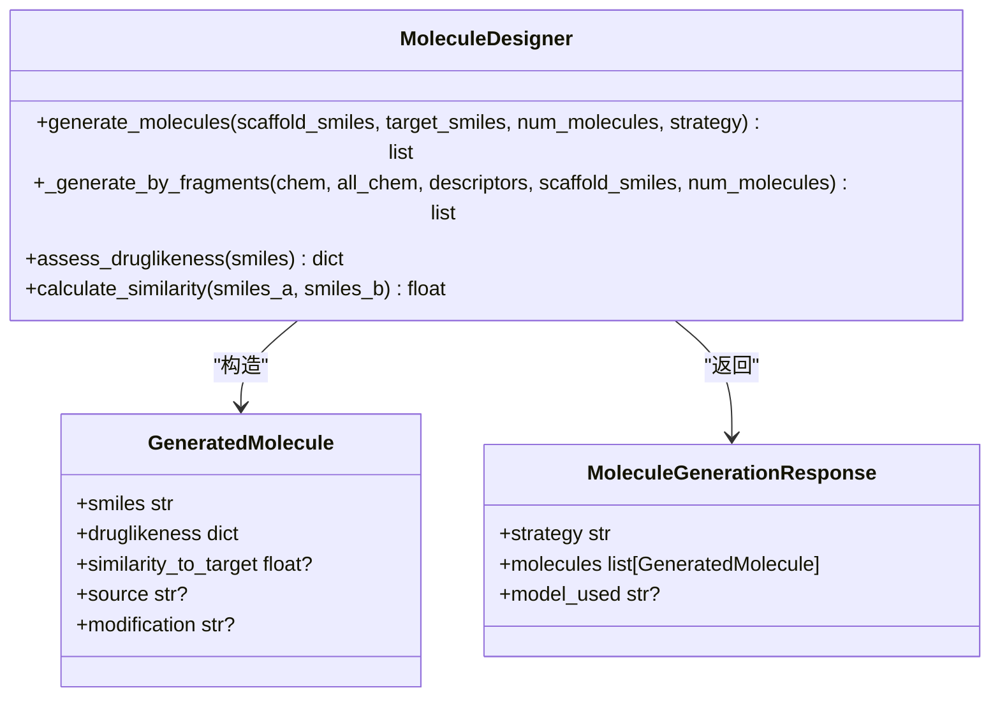
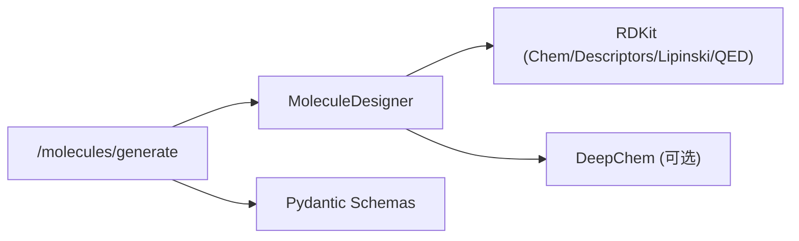

# 基于片段组合的分子生成

<cite>
**本文引用的文件**   
- [molecule_designer.py](file://backend/app/services/analyzer/molecule_designer.py)
- [molecules.py](file://backend/app/api/v1/molecules.py)
- [molecule.py](file://backend/app/schemas/molecule.py)
- [test_molecule_designer.py](file://tests/test_molecule_designer.py)
- [test_p2_endpoints.py](file://scripts/test_p2_endpoints.py)
</cite>

## 目录
1. [简介](#简介)
2. [项目结构](#项目结构)
3. [核心组件](#核心组件)
4. [架构总览](#架构总览)
5. [详细组件分析](#详细组件分析)
6. [依赖关系分析](#依赖关系分析)
7. [性能与可扩展性](#性能与可扩展性)
8. [故障排查指南](#故障排查指南)
9. [结论](#结论)
10. [附录：使用示例与扩展方法](#附录使用示例与扩展方法)

## 简介
本文件围绕“基于片段组合的分子生成”能力，深入解析 _generate_by_fragments 方法的实现原理、片段库设计思路、片段与骨架的组合策略、SMILES 拼接技术、片段选择算法、组合验证机制、去重处理逻辑，并给出类药性评估与质量控制措施。同时提供 API 调用方式、片段库扩展方法与性能优化建议，帮助读者快速上手并在生产环境中进行改进。

## 项目结构
该功能位于后端服务中，由 FastAPI 路由暴露接口，核心逻辑封装在 MoleculeDesigner 类中，并通过 Pydantic Schema 定义请求/响应结构。测试脚本覆盖端到端调用路径。

图表来源
- [molecules.py:301-354](file://backend/app/api/v1/molecules.py#L301-L354)
- [molecule_designer.py:360-454](file://backend/app/services/analyzer/molecule_designer.py#L360-L454)
- [molecule.py:114-148](file://backend/app/schemas/molecule.py#L114-L148)

章节来源
- [molecules.py:301-354](file://backend/app/api/v1/molecules.py#L301-L354)
- [molecule_designer.py:360-454](file://backend/app/services/analyzer/molecule_designer.py#L360-L454)
- [molecule.py:114-148](file://backend/app/schemas/molecule.py#L114-L148)

## 核心组件
- MoleculeDesigner：封装 RDKit/DeepChem 的惰性加载与调用，提供类药性评估、性质预测、相似性计算与分子生成等能力。
- _generate_by_fragments：基于预定义片段库与骨架 SMILES 的组合生成器（简化版）。
- assess_druglikeness：基于 Lipinski 五规则、Veber 规则与 QED 的类药性评分。
- generate_molecules：统一入口，根据 strategy 分发到 fragment/random/optimization 三种生成策略。
- FastAPI 路由 /molecules/generate：对外暴露生成式分子设计的 HTTP 接口。
- Pydantic Schema：定义输入输出结构，确保参数校验与返回格式一致。

章节来源
- [molecule_designer.py:20-519](file://backend/app/services/analyzer/molecule_designer.py#L20-L519)
- [molecules.py:301-354](file://backend/app/api/v1/molecules.py#L301-L354)
- [molecule.py:114-148](file://backend/app/schemas/molecule.py#L114-L148)

## 架构总览
下图展示了从 HTTP 请求到片段组合生成的完整流程，包括参数校验、策略分发、片段组合、类药性过滤与结果组装。

图表来源
- [molecules.py:301-354](file://backend/app/api/v1/molecules.py#L301-L354)
- [molecule_designer.py:360-454](file://backend/app/services/analyzer/molecule_designer.py#L360-L454)
- [molecule_designer.py:71-134](file://backend/app/services/analyzer/molecule_designer.py#L71-L134)

## 详细组件分析

### _generate_by_fragments 实现原理
- 片段库设计
  - 内置常见药物化学片段，包含芳香环、杂环、羧酸、酰胺、羟基、氨基、卤素取代基、脂环等，覆盖高频药效团与可修饰位点。
  - 片段以 SMILES 字符串形式存储，便于快速枚举与组合。
- 骨架与片段组合策略
  - 当前为简化实现：将片段与骨架以 “.” 连接形成多片段 SMILES，交由 RDKit 解析；实际生产中应使用反应模板或图编辑操作进行原子级连接。
- SMILES 拼接技术
  - 采用 f"{scaffold}.{frag}" 拼接，RDKit 会将其解析为多个独立片段组成的分子对象；随后用 MolToSmiles 规范化输出。
- 片段选择算法
  - 顺序循环片段库，按 i % len(fragments) 轮转选取，保证均匀覆盖片段空间。
- 组合验证机制
  - 每次拼接后尝试解析为分子对象，若失败则跳过。
  - 对每个有效分子执行 assess_druglikeness，仅保留 valid=True 的结果。
- 去重处理逻辑
  - 使用 set(seen) 记录已接受的 SMILES，避免重复分子进入结果集。
- 终止条件
  - 外层循环上限为 min(num_molecules * 3, 30)，当收集到的结果数达到 num_molecules 时提前退出。

图表来源
- [molecule_designer.py:393-454](file://backend/app/services/analyzer/molecule_designer.py#L393-L454)

章节来源
- [molecule_designer.py:393-454](file://backend/app/services/analyzer/molecule_designer.py#L393-L454)

### 片段库与常见药物片段的化学特性
- 苯环 c1ccccc1：芳香核心，广泛用于构建疏水相互作用与 π-π 堆积。
- 吡啶 c1ccncc1：含氮杂环，常作为氢键受体与碱性中心。
- 羧酸 C(=O)O：酸性基团，参与盐桥与氢键供体/受体。
- 酰胺 C(=O)N：极性基团，增强溶解性与结合特异性。
- 羟基 OC：氢键供体/受体，提升极性与代谢稳定性。
- 氨基 NC：碱性中心，常用于成盐与提高水溶性。
- 氟 FC：电子效应与代谢阻断，改善膜通透性与选择性。
- 氯苯 Clc1ccccc1：卤代芳环，增加疏水性与结合亲和力。
- 嘧啶 n1ccncc1：双氮杂环，常见于激酶抑制剂核心。
- 环己烷 C1CCCCC1：脂环，调节构象与立体选择性。

这些片段在药物设计中常用于：
- 构建药效团骨架与关键相互作用位点
- 调节理化性质（LogP、TPSA、HBD/HBA）
- 引入代谢稳定化基团（如氟、氯）
- 优化溶解度与渗透性（引入极性基团）

章节来源
- [molecule_designer.py:405-416](file://backend/app/services/analyzer/molecule_designer.py#L405-L416)

### 类药性评估与质量控制
- Lipinski 五规则：分子量≤500、LogP≤5、HBD≤5、HBA≤10。
- Veber 规则：可旋转键≤10、TPSA≤140。
- QED：综合药物相似性评分（0-1），越高越接近已知药物。
- 生成流程中的质量控制：
  - 仅接受 valid=True 的分子进入结果集。
  - 通过去重集合避免重复分子。
  - 限制最大尝试次数，防止无限循环。

章节来源
- [molecule_designer.py:71-134](file://backend/app/services/analyzer/molecule_designer.py#L71-L134)
- [molecule_designer.py:393-454](file://backend/app/services/analyzer/molecule_designer.py#L393-L454)

### API 集成与数据流
- 路由 /molecules/generate 接收 scaffold_smiles、num_molecules、strategy 等参数。
- 内部调用 MoleculeDesigner.generate_molecules，根据 strategy 分发至 _generate_by_fragments。
- 返回 MoleculeGenerationResponse，包含策略、生成的分子列表与使用的模型标识。

图表来源
- [molecule_designer.py:360-454](file://backend/app/services/analyzer/molecule_designer.py#L360-L454)
- [molecule.py:114-148](file://backend/app/schemas/molecule.py#L114-L148)

章节来源
- [molecules.py:301-354](file://backend/app/api/v1/molecules.py#L301-L354)
- [molecule.py:114-148](file://backend/app/schemas/molecule.py#L114-L148)

## 依赖关系分析
- 外部依赖
  - RDKit：用于 SMILES 解析、分子属性计算、指纹与相似度计算。
  - DeepChem（可选）：用于 ADMET 性质预测，未安装时降级为规则模型。
- 模块耦合
  - 路由层仅依赖 MoleculeDesigner 与 Pydantic Schema，保持低耦合。
  - MoleculeDesigner 内部通过惰性加载降低启动成本与运行时错误风险。

图表来源
- [molecule_designer.py:34-70](file://backend/app/services/analyzer/molecule_designer.py#L34-L70)
- [molecules.py:301-354](file://backend/app/api/v1/molecules.py#L301-L354)

章节来源
- [molecule_designer.py:34-70](file://backend/app/services/analyzer/molecule_designer.py#L34-L70)
- [molecules.py:301-354](file://backend/app/api/v1/molecules.py#L301-L354)

## 性能与可扩展性
- 时间复杂度
  - 片段组合循环上限为 O(min(num*3, 30))，每次迭代包含一次 SMILES 解析与一次类药性评估，整体近似 O(K)。
- 空间复杂度
  - seen 集合最多保存 K 个唯一 SMILES，空间 O(K)。
- 优化建议
  - 并行化：对片段组合与评估进行并发处理（注意线程安全与资源限制）。
  - 缓存：对频繁出现的 scaffold 与片段组合结果进行缓存。
  - 片段筛选：先进行快速理化性质过滤（如 MW、LogP 阈值）再进入深度评估。
  - 真实连接：替换 “.” 拼接为基于反应模板的连接，减少无效组合。
  - 采样策略：引入权重或启发式选择片段，优先高价值片段。

[本节为通用指导，无需特定文件引用]

## 故障排查指南
- RDKit 未安装
  - 现象：生成或评估抛出异常或返回降级响应。
  - 处理：安装 rdkit，或在 API 层捕获异常并返回明确错误信息。
- 骨架 SMILES 无效
  - 现象：_generate_by_fragments 直接返回空列表。
  - 处理：校验输入 SMILES，提供默认骨架或提示用户修正。
- 大量无效组合
  - 现象：results 增长缓慢，循环达到上限仍未满足 num_molecules。
  - 处理：扩大片段库、调整组合策略、放宽类药性阈值或增加尝试上限。
- 去重导致结果不足
  - 现象：seen 集合过大，有效分子被去重。
  - 处理：检查片段与骨架组合是否产生等价 SMILES，必要时引入规范化前的指纹去重。

章节来源
- [molecule_designer.py:393-454](file://backend/app/services/analyzer/molecule_designer.py#L393-L454)
- [molecules.py:301-354](file://backend/app/api/v1/molecules.py#L301-L354)

## 结论
_generate_by_fragments 提供了基于片段组合的分子生成基础能力，具备清晰的片段库、组合策略、验证与去重机制，并结合类药性评估保障生成质量。当前实现为简化版，适合原型验证与教学演示；在生产环境中建议引入真实反应模板、更丰富的片段库与高级生成模型以提升多样性与有效性。

[本节为总结性内容，无需特定文件引用]

## 附录：使用示例与扩展方法

### 通过 API 使用片段组合生成
- 请求示例（JSON）
  - scaffold_smiles: "c1ccccc1"
  - num_molecules: 5
  - strategy: "fragment"
- 响应结构
  - strategy: "fragment"
  - molecules: 列表，每项含 smiles、druglikeness、source 等字段
  - model_used: "fragment_assembly_v1"

章节来源
- [test_p2_endpoints.py:126-146](file://scripts/test_p2_endpoints.py#L126-L146)
- [molecules.py:301-354](file://backend/app/api/v1/molecules.py#L301-L354)
- [molecule.py:114-148](file://backend/app/schemas/molecule.py#L114-L148)

### 代码级调用示例（Python）
- 实例化 MoleculeDesigner
- 调用 generate_molecules(strategy="fragment", scaffold_smiles="c1ccccc1", num_molecules=10)
- 遍历返回的分子列表，查看 druglikeness 与 source 字段

章节来源
- [test_molecule_designer.py:19-23](file://tests/test_molecule_designer.py#L19-L23)
- [molecule_designer.py:360-454](file://backend/app/services/analyzer/molecule_designer.py#L360-L454)

### 片段库扩展方法
- 新增片段：在 fragments 列表中追加新的 SMILES 片段（如含硫、含磷、稠环体系等）。
- 分类管理：按类别（芳香族、杂环、官能团、脂环）组织片段，支持按目标性质筛选。
- 权重采样：为不同片段设置权重，优先选择高价值片段。
- 动态加载：从配置文件或数据库加载片段库，支持版本管理与热更新。

章节来源
- [molecule_designer.py:405-416](file://backend/app/services/analyzer/molecule_designer.py#L405-L416)

### 性能优化技巧
- 批量评估：对一批候选分子一次性计算类药性指标，减少 RDKit 调用开销。
- 早期剪枝：在拼接前依据片段特征预估性质，剔除明显不合格的片段。
- 结果缓存：对相同 scaffold+frag 组合的结果进行缓存，避免重复计算。
- 并发控制：合理设置并发度，避免 CPU/内存瓶颈。

[本节为通用指导，无需特定文件引用]