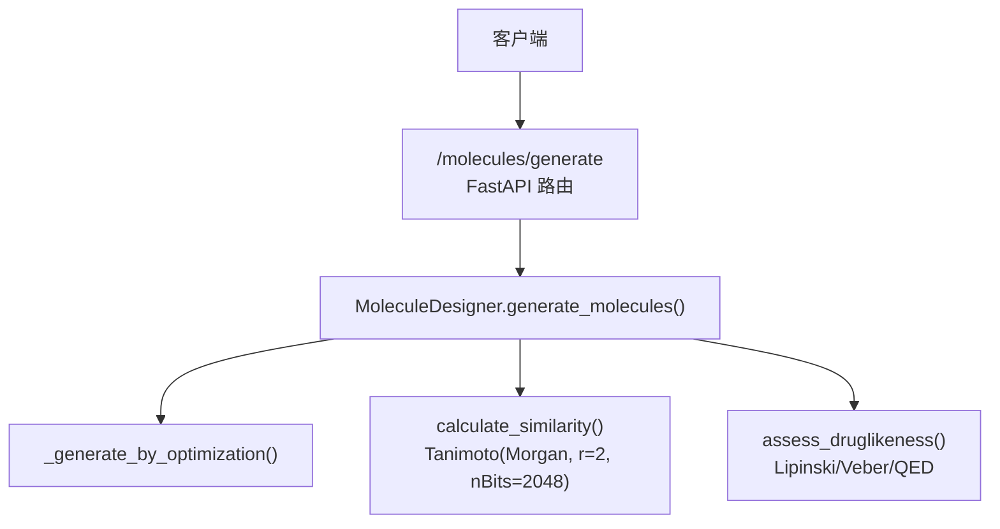
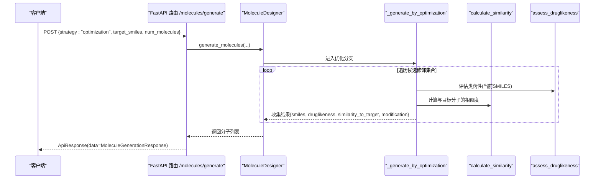
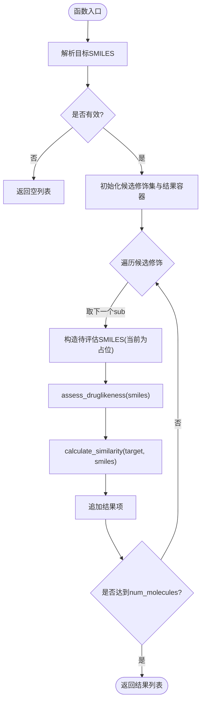
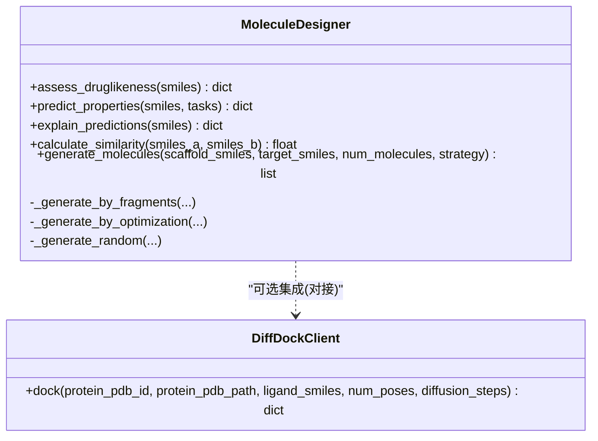

# 相似性优化分子生成

<cite>
**本文引用的文件**   
- [molecule_designer.py](file://backend/app/services/analyzer/molecule_designer.py)
- [molecules.py](file://backend/app/api/v1/molecules.py)
- [test_molecule_designer.py](file://tests/test_molecule_designer.py)
</cite>

## 目录
1. [简介](#简介)
2. [项目结构](#项目结构)
3. [核心组件](#核心组件)
4. [架构总览](#架构总览)
5. [详细组件分析](#详细组件分析)
6. [依赖关系分析](#依赖关系分析)
7. [性能与复杂度](#性能与复杂度)
8. [故障排查指南](#故障排查指南)
9. [结论](#结论)
10. [附录：使用示例与参数调优](#附录使用示例与参数调优)

## 简介
本文件聚焦“相似性优化分子生成”能力，围绕 MoleculeDesigner 中的 _generate_by_optimization 方法展开，系统阐述其实现原理、相似度计算（Tanimoto）、参考分子选择、取代基替换机制、结构保持原则、阈值控制、多样性控制，以及生成质量评估与后续构象优化建议。文档同时给出端到端调用路径与可复现的使用示例，帮助读者快速上手并深入理解该功能。

## 项目结构
与相似性优化相关的代码主要位于后端服务层与API层：
- 服务层：MoleculeDesigner 封装 RDKit/DeepChem，提供类药性评估、性质预测、相似度计算与分子生成策略。
- API层：/molecules/generate 暴露三种生成策略，其中 optimization 即基于参考分子的相似性优化。
- 测试：针对类药性与相似度计算的单元测试，验证关键行为。

图表来源
- [molecules.py:301-349](file://backend/app/api/v1/molecules.py#L301-L349)
- [molecule_designer.py:360-391](file://backend/app/services/analyzer/molecule_designer.py#L360-L391)
- [molecule_designer.py:456-491](file://backend/app/services/analyzer/molecule_designer.py#L456-L491)
- [molecule_designer.py:333-358](file://backend/app/services/analyzer/molecule_designer.py#L333-L358)

章节来源
- [molecules.py:301-349](file://backend/app/api/v1/molecules.py#L301-L349)
- [molecule_designer.py:360-391](file://backend/app/services/analyzer/molecule_designer.py#L360-L391)

## 核心组件
- MoleculeDesigner：统一封装分子评估、性质预测、相似度计算与多种生成策略。
- calculate_similarity：基于 Morgan 指纹（半径2，位长2048）的 Tanimoto 相似度。
- assess_druglikeness：Lipinski 五规则 + Veber 规则 + QED 综合评估。
- generate_molecules：根据 strategy 分发到 fragment/random/optimization 分支。
- _generate_by_optimization：以目标分子为参考，进行相似性优化的简化版生成流程。

章节来源
- [molecule_designer.py:20-51](file://backend/app/services/analyzer/molecule_designer.py#L20-L51)
- [molecule_designer.py:333-358](file://backend/app/services/analyzer/molecule_designer.py#L333-L358)
- [molecule_designer.py:360-391](file://backend/app/services/analyzer/molecule_designer.py#L360-L391)
- [molecule_designer.py:456-491](file://backend/app/services/analyzer/molecule_designer.py#L456-L491)

## 架构总览
从请求到生成的完整序列如下：

图表来源
- [molecules.py:301-349](file://backend/app/api/v1/molecules.py#L301-L349)
- [molecule_designer.py:360-391](file://backend/app/services/analyzer/molecule_designer.py#L360-L391)
- [molecule_designer.py:456-491](file://backend/app/services/analyzer/molecule_designer.py#L456-L491)
- [molecule_designer.py:333-358](file://backend/app/services/analyzer/molecule_designer.py#L333-L358)

## 详细组件分析

### 1) _generate_by_optimization 实现原理
- 输入校验：解析目标 SMILES，若无效直接返回空列表。
- 候选修饰集：内置一组常见取代基片段（如卤素、含氧/氮基团、烷基等）。
- 生成循环：对每个候选修饰，构造一个“待评估”的 SMILES（当前实现为占位逻辑，未实际执行原子级替换），随后：
  - 调用 assess_druglikeness 评估类药性；
  - 调用 calculate_similarity 计算与目标分子的 Tanimoto 相似度；
  - 将结果记录为一条候选分子条目，包含 smiles、druglikeness、similarity_to_target、modification。
- 输出：返回最多 num_molecules 条候选结果。

要点说明
- 当前实现为“简化版”，并未真正在目标分子上执行原子级取代或骨架保持操作，而是以占位方式返回目标分子本身及其评估指标。生产环境应替换为真正的结构修饰引擎（见后文“扩展建议”）。

章节来源
- [molecule_designer.py:456-491](file://backend/app/services/analyzer/molecule_designer.py#L456-L491)

#### 流程图：_generate_by_optimization

图表来源
- [molecule_designer.py:456-491](file://backend/app/services/analyzer/molecule_designer.py#L456-L491)

### 2) 基于参考分子的相似性搜索算法与 Tanimoto 相似度
- 指纹类型：Morgan 指纹（半径 r=2，位长 nBits=2048）。
- 相似度度量：DataStructs.TanimotoSimilarity，取值范围[0,1]，相同分子为1。
- 异常处理：任一分子无效时返回0。

章节来源
- [molecule_designer.py:333-358](file://backend/app/services/analyzer/molecule_designer.py#L333-L358)
- [test_molecule_designer.py:90-107](file://tests/test_molecule_designer.py#L90-L107)

### 3) 取代基替换机制与结构保持原则
- 当前实现：定义了一组常见取代基片段，但并未在目标分子上进行实际的原子级替换，而是以占位方式返回目标分子本身。
- 结构保持原则：由于当前未执行真实替换，结构保持由“不改变目标SMILES”隐式保证。
- 改进方向：引入反应模板或子结构映射，确保仅对指定位置进行修饰，保留核心骨架不变。

章节来源
- [molecule_designer.py:456-491](file://backend/app/services/analyzer/molecule_designer.py#L456-L491)

### 4) 相似性阈值控制与多样性控制
- 阈值控制：当前未内置相似度阈值过滤。可在外层对 results 按 similarity_to_target 筛选，例如只保留高于阈值的候选。
- 多样性控制：可通过限制候选修饰集、去重（基于 SMILES 或指纹）、或结合多样性采样策略（如最大最小距离）提升多样性。

章节来源
- [molecule_designer.py:456-491](file://backend/app/services/analyzer/molecule_designer.py#L456-L491)

### 5) 参考分子的选择标准
- 当前实现：直接使用用户传入的 target_smiles 作为参考分子。
- 建议标准：优先选择具有已知活性、良好类药性、明确药效团的分子；必要时结合靶点结合模式或文献证据进行筛选。

章节来源
- [molecules.py:301-349](file://backend/app/api/v1/molecules.py#L301-L349)
- [molecule_designer.py:360-391](file://backend/app/services/analyzer/molecule_designer.py#L360-L391)

### 6) 修饰位点识别算法
- 当前实现：未实现自动位点识别。
- 建议方案：
  - 基于 SMARTS 匹配的可修饰位点（如芳香环上的氢、特定杂原子邻位）；
  - 基于合成可及性评分（SA）与立体位阻过滤；
  - 结合药效团约束，避免破坏关键相互作用位点。

章节来源
- [molecule_designer.py:456-491](file://backend/app/services/analyzer/molecule_designer.py#L456-L491)

### 7) 生成分子的药效团保持分析与构象优化建议
- 药效团保持：在真实替换中，需通过子结构映射或药效团对齐，确保关键官能团与空间排布不被破坏。
- 构象优化：对接后可进行局部能量最小化或构象搜索，以获得更合理的三维构象用于后续评估。

章节来源
- [molecule_designer.py:522-660](file://backend/app/services/analyzer/molecule_designer.py#L522-L660)

## 依赖关系分析
- 外部库：RDKit（化学信息学）、DeepChem（可选，用于性质预测降级回退）。
- 模块耦合：
  - API 路由依赖 MoleculeDesigner；
  - MoleculeDesigner 内部组合 assess_druglikeness、calculate_similarity 与生成策略。

图表来源
- [molecule_designer.py:20-51](file://backend/app/services/analyzer/molecule_designer.py#L20-L51)
- [molecule_designer.py:522-660](file://backend/app/services/analyzer/molecule_designer.py#L522-L660)

章节来源
- [molecule_designer.py:20-51](file://backend/app/services/analyzer/molecule_designer.py#L20-L51)
- [molecule_designer.py:522-660](file://backend/app/services/analyzer/molecule_designer.py#L522-L660)

## 性能与复杂度
- 相似度计算：Morgan 指纹构建与 Tanimoto 比较的时间复杂度近似 O(N)，N 为指纹位数（2048），单次计算开销较小。
- 生成循环：复杂度 O(K)，K=min(num_molecules, 候选修饰数)。每次迭代包含一次类药性评估与一次相似度计算。
- 内存占用：主要为指纹向量与中间结果字典，整体线性增长。

章节来源
- [molecule_designer.py:333-358](file://backend/app/services/analyzer/molecule_designer.py#L333-L358)
- [molecule_designer.py:456-491](file://backend/app/services/analyzer/molecule_designer.py#L456-L491)

## 故障排查指南
- RDKit 未安装：会抛出运行时错误，导致生成接口不可用。请确认环境已正确安装 RDKit。
- DeepChem 未安装：性质预测将降级为规则模型，不影响基本生成流程。
- 无效 SMILES：assess_druglikeness 与 calculate_similarity 均会返回错误或零值，需在调用前校验。
- API 键缺失：DiffDock NIM 调用失败时会返回降级响应，不影响主流程。

章节来源
- [molecule_designer.py:34-50](file://backend/app/services/analyzer/molecule_designer.py#L34-L50)
- [molecule_designer.py:52-69](file://backend/app/services/analyzer/molecule_designer.py#L52-L69)
- [molecule_designer.py:333-358](file://backend/app/services/analyzer/molecule_designer.py#L333-L358)
- [molecule_designer.py:522-660](file://backend/app/services/analyzer/molecule_designer.py#L522-L660)

## 结论
当前 _generate_by_optimization 提供了基于参考分子的相似性优化生成框架，具备清晰的相似度计算与类药性评估链路。作为简化实现，它尚未执行真实的原子级取代与位点识别，但为后续扩展奠定了坚实基础。建议在工程落地中引入真正的结构修饰引擎、相似度阈值过滤与多样性控制，并结合药效团保持与构象优化，以提升生成分子的质量与可用性。

## 附录：使用示例与参数调优

### A. 通过 API 发起相似性优化生成
- 端点：POST /molecules/generate
- 请求体关键字段：
  - strategy: "optimization"
  - target_smiles: 目标分子 SMILES
  - num_molecules: 生成数量
- 响应字段：
  - data.strategy
  - data.molecules[].smiles
  - data.molecules[].druglikeness
  - data.molecules[].similarity_to_target
  - data.molecules[].modification

章节来源
- [molecules.py:301-349](file://backend/app/api/v1/molecules.py#L301-L349)

### B. 直接调用服务层的示例
- 实例化 MoleculeDesigner；
- 调用 generate_molecules(strategy="optimization", target_smiles=..., num_molecules=...)；
- 读取返回的 molecules 列表，逐项检查 druglikeness 与 similarity_to_target。

章节来源
- [molecule_designer.py:360-391](file://backend/app/services/analyzer/molecule_designer.py#L360-L391)
- [molecule_designer.py:456-491](file://backend/app/services/analyzer/molecule_designer.py#L456-L491)

### C. 相似度调优参数建议
- 指纹半径 r：默认2，可根据任务调整（更大半径捕获更长上下文，但计算成本上升）。
- 指纹位长 nBits：默认2048，增大可提高区分度但增加内存与计算开销。
- 相似度阈值：建议在生产层对 results 进行过滤，例如保留 similarity_to_target ≥ 0.7 的候选。

章节来源
- [molecule_designer.py:333-358](file://backend/app/services/analyzer/molecule_designer.py#L333-L358)

### D. 生成质量评估方法
- 类药性：passes_lipinski、passes_veber、QED 分数；
- ADMET 预测：toxicity、solubility、oral_bioavailable、bbb_permeable、herg_toxicity_risk；
- 相似度：similarity_to_target；
- 多样性：基于 SMILES 去重或指纹距离统计。

章节来源
- [molecule_designer.py:71-134](file://backend/app/services/analyzer/molecule_designer.py#L71-L134)
- [molecule_designer.py:136-256](file://backend/app/services/analyzer/molecule_designer.py#L136-L256)
- [molecule_designer.py:456-491](file://backend/app/services/analyzer/molecule_designer.py#L456-L491)

### E. 药效团保持与构象优化建议
- 药效团保持：在真实替换中，使用子结构映射或药效团对齐，避免破坏关键官能团与空间排布。
- 构象优化：对接后进行能量最小化或构象搜索，获得稳定构象用于后续评估。

章节来源
- [molecule_designer.py:522-660](file://backend/app/services/analyzer/molecule_designer.py#L522-L660)