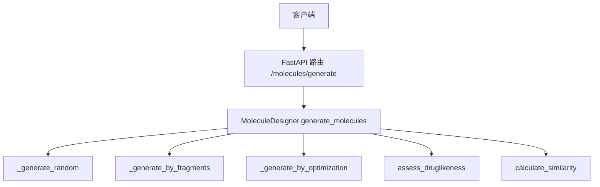
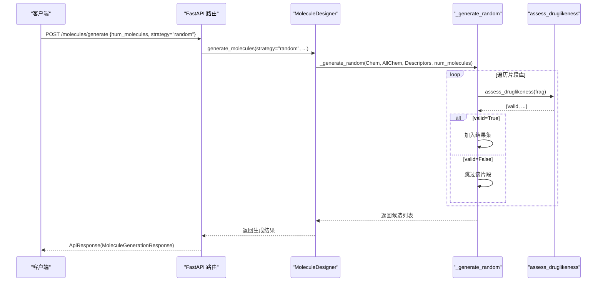
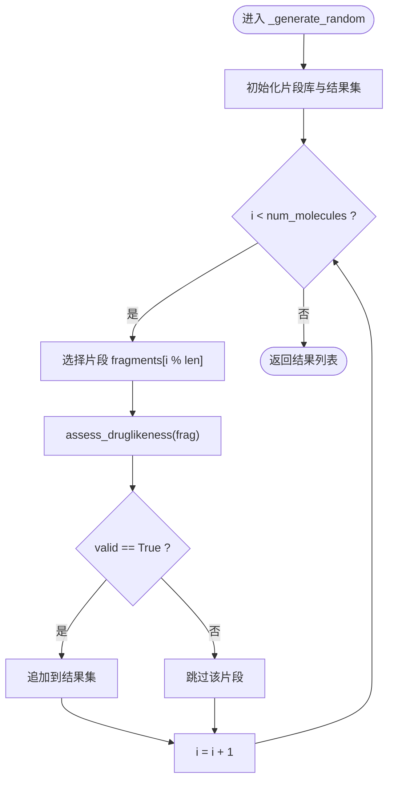
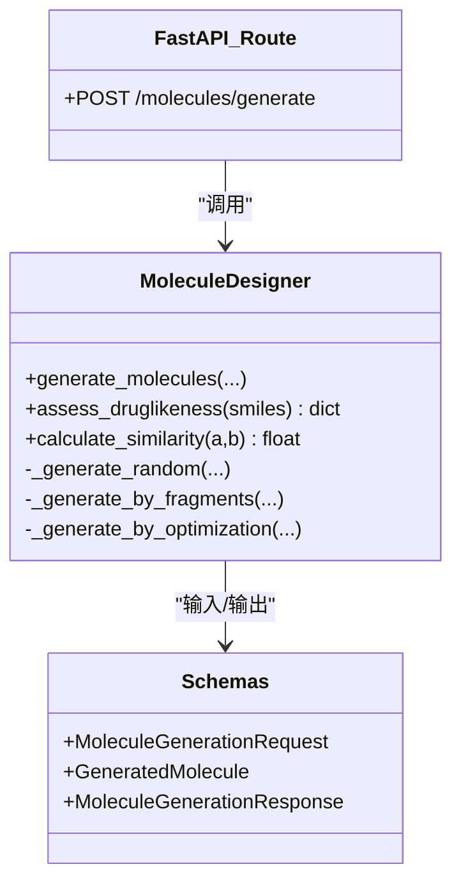

# 随机分子生成

<cite>
**本文引用的文件**   
- [molecule_designer.py](file://backend/app/services/analyzer/molecule_designer.py)
- [molecules.py](file://backend/app/api/v1/molecules.py)
- [molecule.py](file://backend/app/schemas/molecule.py)
- [test_molecule_designer.py](file://tests/test_molecule_designer.py)
</cite>

## 目录
1. [简介](#简介)
2. [项目结构](#项目结构)
3. [核心组件](#核心组件)
4. [架构总览](#架构总览)
5. [详细组件分析](#详细组件分析)
6. [依赖关系分析](#依赖关系分析)
7. [性能与效率](#性能与效率)
8. [故障排查指南](#故障排查指南)
9. [结论](#结论)
10. [附录：配置示例与最佳实践](#附录配置示例与最佳实践)

## 简介
本文件围绕“随机分子生成功能”展开，聚焦于 MoleculeDesigner 中的 _generate_random 方法及其在整体系统中的调用路径。文档将解释其实现原理、片段库与组合策略、多样性保证机制、无效结构过滤、化学合理性约束（类药性筛选）、以及可操作的参数配置建议与优化技巧。同时提供流程图与时序图帮助理解数据流与控制流。

## 项目结构
与随机分子生成相关的代码主要位于后端服务层与 API 层：
- 服务层：MoleculeDesigner 封装了基于 RDKit 的类药性评估、相似性计算与多种生成策略（包括随机生成）。
- API 层：/molecules/generate 暴露生成式分子设计接口，支持 fragment/random/optimization 三种策略。
- Schema 层：定义请求/响应模型，包含 num_molecules、strategy 等关键参数。

图表来源
- [molecules.py:301-354](file://backend/app/api/v1/molecules.py#L301-L354)
- [molecule_designer.py:360-391](file://backend/app/services/analyzer/molecule_designer.py#L360-L391)
- [molecule_designer.py:493-519](file://backend/app/services/analyzer/molecule_designer.py#L493-L519)

章节来源
- [molecules.py:301-354](file://backend/app/api/v1/molecules.py#L301-L354)
- [molecule_designer.py:360-391](file://backend/app/services/analyzer/molecule_designer.py#L360-L391)
- [molecule.py:114-148](file://backend/app/schemas/molecule.py#L114-L148)

## 核心组件
- MoleculeDesigner：提供分子评估、性质预测、相似性计算与分子生成能力。
- generate_molecules：统一入口，根据 strategy 分发到不同生成器。
- _generate_random：当前实现的随机生成逻辑，基于内置片段库进行循环选择与有效性校验。
- assess_druglikeness：对候选分子执行 Lipinski/Veber/QED 等规则检查，作为无效结构过滤的核心。
- calculate_similarity：用于优化策略下的相似度评估（随机策略未使用）。

章节来源
- [molecule_designer.py:20-50](file://backend/app/services/analyzer/molecule_designer.py#L20-L50)
- [molecule_designer.py:360-391](file://backend/app/services/analyzer/molecule_designer.py#L360-L391)
- [molecule_designer.py:493-519](file://backend/app/services/analyzer/molecule_designer.py#L493-L519)
- [molecule_designer.py:71-134](file://backend/app/services/analyzer/molecule_designer.py#L71-L134)
- [molecule_designer.py:333-358](file://backend/app/services/analyzer/molecule_designer.py#L333-L358)

## 架构总览
下图展示了从 API 到服务层的完整调用链，以及随机生成的内部流程。

图表来源
- [molecules.py:301-354](file://backend/app/api/v1/molecules.py#L301-L354)
- [molecule_designer.py:360-391](file://backend/app/services/analyzer/molecule_designer.py#L360-L391)
- [molecule_designer.py:493-519](file://backend/app/services/analyzer/molecule_designer.py#L493-L519)
- [molecule_designer.py:71-134](file://backend/app/services/analyzer/molecule_designer.py#L71-L134)

## 详细组件分析

### _generate_random 实现原理
- 片段库：内部维护一个小型片段集合，用于循环选择候选 SMILES。
- 遍历与去重：按 num_molecules 次数迭代，依次选取片段；通过类药性评估过滤无效结构。
- 输出格式：每个有效片段以字典形式返回，包含 smiles、druglikeness、source 字段。

图表来源
- [molecule_designer.py:493-519](file://backend/app/services/analyzer/molecule_designer.py#L493-L519)
- [molecule_designer.py:71-134](file://backend/app/services/analyzer/molecule_designer.py#L71-L134)

章节来源
- [molecule_designer.py:493-519](file://backend/app/services/analyzer/molecule_designer.py#L493-L519)

### 片段随机选择算法
- 选择策略：顺序循环取模（fragments[i % len]），并非真正的随机采样。
- 片段范围：固定小集合，覆盖常见芳香环、杂环与官能团片段。
- 改进方向：引入加权概率或外部片段库以提升多样性与覆盖率。

章节来源
- [molecule_designer.py:493-519](file://backend/app/services/analyzer/molecule_designer.py#L493-L519)

### 组合验证流程与无效结构过滤
- 验证入口：assess_druglikeness 对候选 SMILES 进行解析与属性计算。
- 过滤规则：
  - Lipinski 五规则：MW≤500、LogP≤5、HBD≤5、HBA≤10。
  - Veber 规则：旋转键≤10、TPSA≤140。
  - QED：药物相似性评分（若可用）。
- 无效处理：当 valid=False 时直接丢弃该片段，不加入结果集。

章节来源
- [molecule_designer.py:71-134](file://backend/app/services/analyzer/molecule_designer.py#L71-L134)

### 化学合理性约束与类药性筛选
- 约束来源：assess_druglikeness 中计算的 MW、LogP、HBD、HBA、旋转键、TPSA 及 QED。
- 决策依据：passes_lipinski、passes_veber、QED 分数共同决定候选是否保留。
- 扩展点：可在 _generate_random 中增加额外阈值（如 QED≥0.5）进一步筛选高质量候选。

章节来源
- [molecule_designer.py:71-134](file://backend/app/services/analyzer/molecule_designer.py#L71-L134)

### 结构新颖性评估
- 当前状态：_generate_random 未实现去重或新颖性度量。
- 相关工具：calculate_similarity 可用于后续扩展，比较候选与参考分子的 Tanimoto 相似度。
- 建议方案：维护已生成 SMILES 集合，结合相似度阈值避免重复或过于相似的分子。

章节来源
- [molecule_designer.py:333-358](file://backend/app/services/analyzer/molecule_designer.py#L333-L358)

### 生成分子的多样性保证机制
- 现状：片段库较小且为顺序循环，多样性有限。
- 提升策略：
  - 扩大并分层片段库（按类别、复杂度、反应位点）。
  - 引入随机权重或温度采样，提高探索空间。
  - 结合骨架生长或修饰策略（已有 _generate_by_fragments/_generate_by_optimization）。

章节来源
- [molecule_designer.py:393-454](file://backend/app/services/analyzer/molecule_designer.py#L393-L454)
- [molecule_designer.py:456-491](file://backend/app/services/analyzer/molecule_designer.py#L456-L491)

### API 集成与参数说明
- 端点：POST /molecules/generate
- 关键参数：
  - scaffold_smiles：骨架 SMILES（fragment 策略使用）
  - target_smiles：参考分子 SMILES（optimization 策略使用）
  - num_molecules：生成数量（1–100）
  - strategy：fragment | random | optimization
- 响应：包含 molecules 列表，每项含 smiles、druglikeness、similarity_to_target、source、modification。

章节来源
- [molecules.py:301-354](file://backend/app/api/v1/molecules.py#L301-L354)
- [molecule.py:114-148](file://backend/app/schemas/molecule.py#L114-L148)

## 依赖关系分析
- 运行时依赖：RDKit（惰性加载），DeepChem（可选，用于性质预测）。
- 模块耦合：
  - API 路由依赖 MoleculeDesigner。
  - MoleculeDesigner 内部依赖 assess_druglikeness、calculate_similarity。
  - 生成策略之间相互独立，便于扩展新策略。

图表来源
- [molecules.py:301-354](file://backend/app/api/v1/molecules.py#L301-L354)
- [molecule_designer.py:360-391](file://backend/app/services/analyzer/molecule_designer.py#L360-L391)
- [molecule.py:114-148](file://backend/app/schemas/molecule.py#L114-L148)

章节来源
- [molecule_designer.py:20-50](file://backend/app/services/analyzer/molecule_designer.py#L20-L50)
- [molecules.py:301-354](file://backend/app/api/v1/molecules.py#L301-L354)
- [molecule.py:114-148](file://backend/app/schemas/molecule.py#L114-L148)

## 性能与效率
- 时间复杂度：_generate_random 为 O(num_molecules)，每次迭代调用一次 assess_druglikeness。
- I/O 与解析：assess_druglikeness 涉及 RDKit 分子解析与描述符计算，为主要开销。
- 优化建议：
  - 批量预处理片段库，缓存常用描述符。
  - 并行化评估（注意线程安全与资源占用）。
  - 限制最大 num_molecules 或使用分页返回。
  - 引入去重集合以减少冗余评估。

[本节为通用指导，无需具体文件引用]

## 故障排查指南
- RDKit 未安装：
  - 现象：生成或评估失败，抛出运行时错误。
  - 处理：安装 rdkit 或降级为占位响应（API 层已做异常捕获）。
- DeepChem 不可用：
  - 现象：性质预测降级为规则模型。
  - 处理：按需安装 deepchem 以获得更准确的 ADMET 预测。
- 无效 SMILES：
  - 现象：assess_druglikeness 返回 valid=False。
  - 处理：检查片段库质量与 SMILES 合法性。

章节来源
- [molecule_designer.py:34-50](file://backend/app/services/analyzer/molecule_designer.py#L34-L50)
- [molecule_designer.py:52-69](file://backend/app/services/analyzer/molecule_designer.py#L52-L69)
- [molecules.py:350-354](file://backend/app/api/v1/molecules.py#L350-L354)

## 结论
当前的 _generate_random 实现了基于固定片段库的简单随机生成流程，并通过类药性规则进行无效结构过滤。其优点是轻量、易部署；缺点是片段库规模小、选择非随机、缺乏去重与新颖性控制。建议在保持现有架构的基础上，扩展片段库、引入随机采样与相似度去重，并结合骨架生长与优化策略，以获得更高多样性与质量的候选分子集合。

[本节为总结性内容，无需具体文件引用]

## 附录：配置示例与最佳实践

- 基本调用（随机生成）
  - 端点：POST /molecules/generate
  - 请求体关键字段：
    - num_molecules：期望生成数量（1–100）
    - strategy："random"
  - 响应体：
    - molecules：包含 smiles、druglikeness、source 等字段

- 片段库优化建议
  - 扩充片段种类：芳香环、杂环、卤素、极性基团、脂环等。
  - 引入权重分布：按出现频率或类药性偏好分配选择概率。
  - 分层管理：按复杂度或合成可行性分组，便于策略切换。

- 生成效率提升技巧
  - 预计算片段描述符并缓存。
  - 设置合理的 num_molecules 上限，避免单次请求过大。
  - 使用去重集合减少重复评估。
  - 必要时采用异步并发（确保 RDKit 线程安全）。

- 统计分析与分布特征研究
  - 指标建议：
    - 类药性通过率（passes_lipinski、passes_veber）
    - QED 分布（均值、方差、分位数）
    - 分子量、LogP、TPSA 的分布直方图
    - 相似度矩阵（与参考分子或种子片段）
  - 分析方法：
    - 描述符统计与可视化
    - 聚类分析（基于指纹）
    - 新颖性评估（与已知数据库比对）

- 单元测试参考
  - 类药性评估用例：阿司匹林符合 Lipinski、大分子违反规则、无效 SMILES 返回错误。
  - 相似性计算用例：相同分子相似度为 1，不同分子小于 1，无效分子返回 0。

章节来源
- [molecules.py:301-354](file://backend/app/api/v1/molecules.py#L301-L354)
- [molecule_designer.py:71-134](file://backend/app/services/analyzer/molecule_designer.py#L71-L134)
- [molecule_designer.py:333-358](file://backend/app/services/analyzer/molecule_designer.py#L333-L358)
- [test_molecule_designer.py:26-108](file://tests/test_molecule_designer.py#L26-L108)