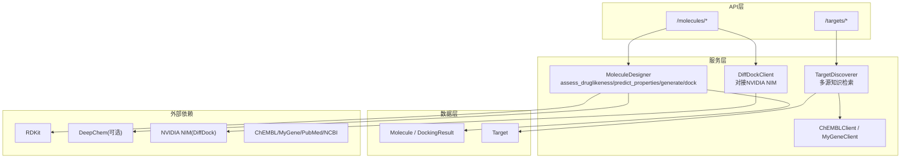
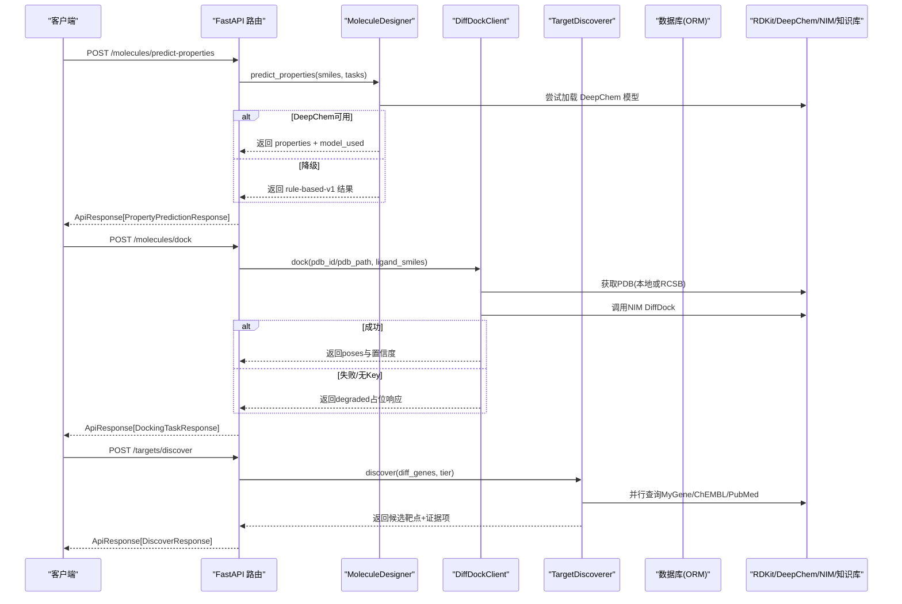
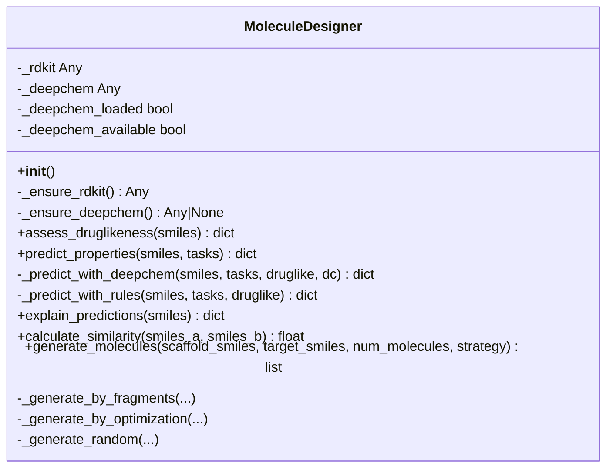
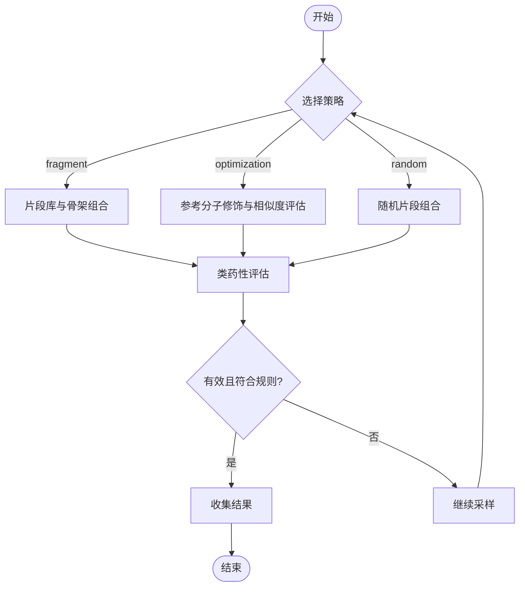
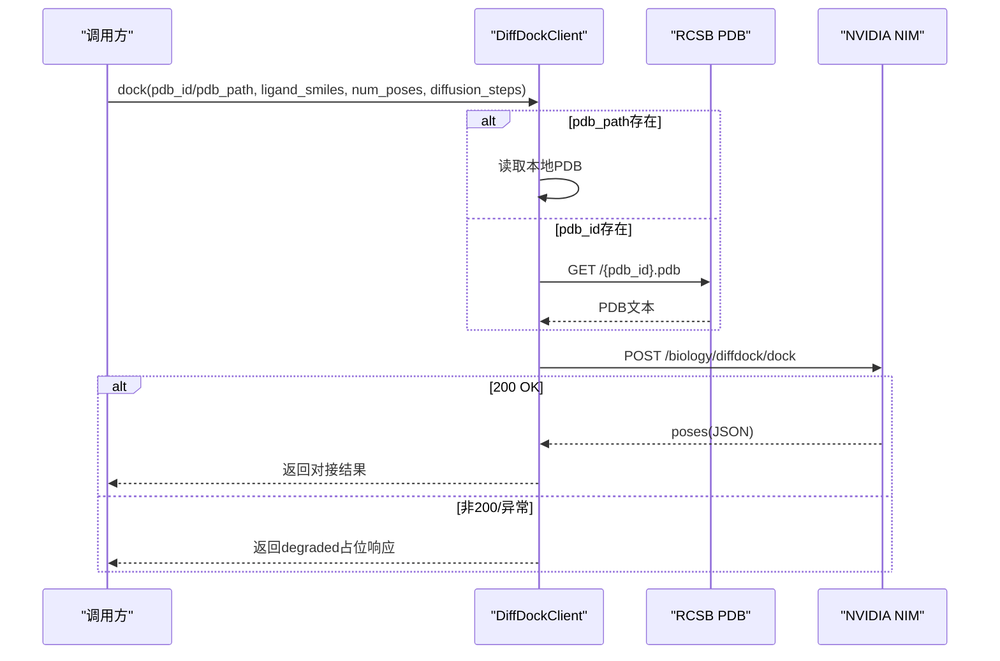
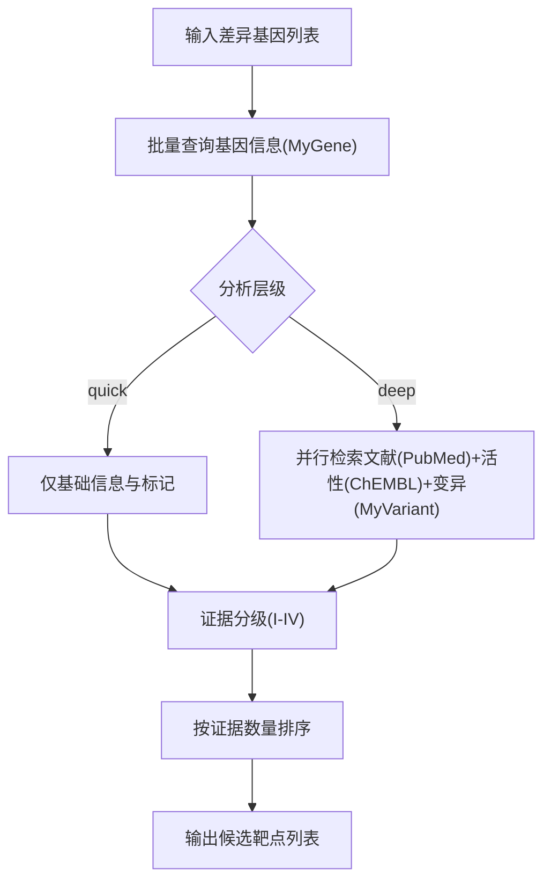
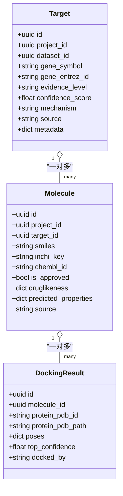
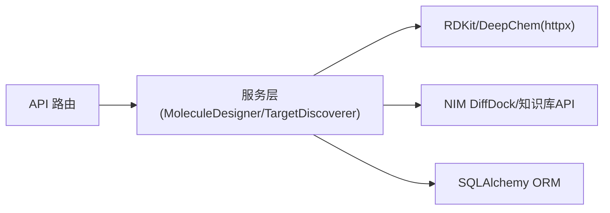

# 分子设计与评估

<cite>
**本文引用的文件**   
- [molecule_designer.py](file://backend/app/services/analyzer/molecule_designer.py)
- [molecules.py](file://backend/app/api/v1/molecules.py)
- [molecule.py](file://backend/app/models/molecule.py)
- [molecule.py](file://backend/app/schemas/molecule.py)
- [targets.py](file://backend/app/api/v1/targets.py)
- [target_discoverer.py](file://backend/app/services/analyzer/target_discoverer.py)
- [chembl_client.py](file://backend/app/services/knowledge/chembl_client.py)
- [mygene_client.py](file://backend/app/services/knowledge/mygene_client.py)
- [evidence.py](file://backend/app/utils/evidence.py)
- [config.py](file://backend/app/core/config.py)
- [README.md](file://README.md)
- [test_molecule_designer.py](file://tests/test_molecule_designer.py)
</cite>

## 目录
1. [简介](#简介)
2. [项目结构](#项目结构)
3. [核心组件](#核心组件)
4. [架构总览](#架构总览)
5. [详细组件分析](#详细组件分析)
6. [依赖关系分析](#依赖关系分析)
7. [性能与可扩展性](#性能与可扩展性)
8. [故障排查指南](#故障排查指南)
9. [结论](#结论)
10. [附录：使用示例与工作流配置](#附录使用示例与工作流配置)

## 简介
本系统面向“从靶点到候选分子”的端到端药物设计流程，提供以下关键能力：
- 分子表示与生成：基于 SMILES 的片段组装、参考分子优化与随机生成策略。
- 类药性与 ADMET 评估：Lipinski 五规则、Veber 规则、QED；溶解度（ESOL 近似）、毒性评分、口服生物利用度、血脑屏障通透性等。
- 分子对接模拟：通过 NVIDIA NIM DiffDock API 执行蛋白-配体对接，支持 PDB ID 或本地 PDB 路径输入。
- 靶点发现与证据分级：整合 MyGene、ChEMBL、PubMed、MyVariant 等知识库，形成 I–IV 级证据链。
- 可解释性：基于特征贡献的 SHAP 风格解释，辅助理解性质预测驱动因素。
- 集成 RDKit 与 DeepChem：优先使用 DeepChem 模型，不可用时自动降级为规则模型；RDKit 未安装时返回降级响应，保证服务可用性。

## 项目结构
围绕分子设计与评估的核心代码分布在后端服务的 analyzer、api、models、schemas 以及 utils 等模块中：
- services/analyzer：分子设计器与靶点发现编排器
- api/v1：REST 接口（分子、靶点）
- models：数据库 ORM 模型（分子、对接结果、靶点）
- schemas：Pydantic 请求/响应模型
- utils：证据分级工具
- core/config：全局配置与环境变量加载

图示来源
- [molecules.py:1-403](file://backend/app/api/v1/molecules.py#L1-L403)
- [molecule_designer.py:1-689](file://backend/app/services/analyzer/molecule_designer.py#L1-L689)
- [targets.py:1-344](file://backend/app/api/v1/targets.py#L1-L344)
- [target_discoverer.py:1-176](file://backend/app/services/analyzer/target_discoverer.py#L1-L176)
- [chembl_client.py:1-127](file://backend/app/services/knowledge/chembl_client.py#L1-L127)
- [mygene_client.py:1-97](file://backend/app/services/knowledge/mygene_client.py#L1-L97)
- [molecule.py:1-61](file://backend/app/models/molecule.py#L1-L61)
- [target.py:1-52](file://backend/app/models/target.py#L1-L52)

章节来源
- [README.md:1-421](file://README.md#L1-L421)

## 核心组件
- MoleculeDesigner：封装 RDKit 与 DeepChem，提供类药性评估、ADMET 预测、相似性计算、分子生成与可解释性输出。
- DiffDockClient：调用 NVIDIA NIM DiffDock 进行分子对接，支持 PDB ID 下载或本地 PDB 读取，失败时返回降级占位响应。
- TargetDiscoverer：编排多组学与知识库查询，产出带证据分级的候选靶点列表。
- ChEMBLClient / MyGeneClient：对外部知识库的异步 HTTP 访问封装。
- 证据分级工具：将不同来源的证据映射到 I–IV 等级，并统计最高等级。

章节来源
- [molecule_designer.py:1-689](file://backend/app/services/analyzer/molecule_designer.py#L1-L689)
- [molecule_designer.py:522-661](file://backend/app/services/analyzer/molecule_designer.py#L522-L661)
- [target_discoverer.py:1-176](file://backend/app/services/analyzer/target_discoverer.py#L1-L176)
- [chembl_client.py:1-127](file://backend/app/services/knowledge/chembl_client.py#L1-L127)
- [mygene_client.py:1-97](file://backend/app/services/knowledge/mygene_client.py#L1-L97)
- [evidence.py:1-103](file://backend/app/utils/evidence.py#L1-L103)

## 架构总览
下图展示从用户请求到外部依赖的完整调用链路，包括降级策略与数据存储。

图示来源
- [molecules.py:95-143](file://backend/app/api/v1/molecules.py#L95-L143)
- [molecules.py:219-298](file://backend/app/api/v1/molecules.py#L219-L298)
- [molecule_designer.py:136-256](file://backend/app/services/analyzer/molecule_designer.py#L136-L256)
- [molecule_designer.py:543-611](file://backend/app/services/analyzer/molecule_designer.py#L543-L611)
- [targets.py:42-130](file://backend/app/api/v1/targets.py#L42-L130)
- [target_discoverer.py:52-139](file://backend/app/services/analyzer/target_discoverer.py#L52-L139)

## 详细组件分析

### MoleculeDesigner 类
职责与能力
- 惰性加载 RDKit 与 DeepChem，避免启动失败。
- 类药性评估：Lipinski 五规则、Veber 规则、QED。
- ADMET 预测：优先 DeepChem（Tox21/Delaney/BBBP），不可用时回退规则模型（毒性评分、ESOL 溶解度、口服生物利用度、BBB 通透性、hERG 风险）。
- 相似性计算：Tanimoto（Morgan 指纹）。
- 分子生成：片段组合、参考分子优化、随机生成。
- 可解释性：基于特征的线性贡献（SHAP 风格代理）。

图示来源
- [molecule_designer.py:20-519](file://backend/app/services/analyzer/molecule_designer.py#L20-L519)

章节来源
- [molecule_designer.py:20-519](file://backend/app/services/analyzer/molecule_designer.py#L20-L519)

#### 类药性与 ADMET 算法要点
- Lipinski 五规则：MW≤500、LogP≤5、HBD≤5、HBA≤10。
- Veber 规则：旋转键≤10、TPSA≤140。
- QED：药物相似性定量评分（RDKit QED）。
- 溶解度（ESOL 近似）：logS = 0.16 − 0.63·LogP − 0.0062·MW + 0.066·RB。
- 毒性评分：基于 LogP 与 TPSA 的规则函数。
- BBB 通透性：MW<400、LogP<5、TPSA<90。
- hERG 风险：按 LogP 阈值划分高/中/低。

章节来源
- [molecule_designer.py:71-134](file://backend/app/services/analyzer/molecule_designer.py#L71-L134)
- [molecule_designer.py:162-256](file://backend/app/services/analyzer/molecule_designer.py#L162-L256)
- [molecule_designer.py:258-293](file://backend/app/services/analyzer/molecule_designer.py#L258-L293)

#### 分子生成工作流

图示来源
- [molecule_designer.py:360-519](file://backend/app/services/analyzer/molecule_designer.py#L360-L519)

章节来源
- [molecule_designer.py:360-519](file://backend/app/services/analyzer/molecule_designer.py#L360-L519)

### DiffDockClient 对接流程
- 支持 protein_pdb_id 或 protein_pdb_path 二选一。
- 若未配置 API Key，直接返回降级占位响应。
- 通过 httpx 异步调用 NIM DiffDock 接口，超时保护与错误处理。

图示来源
- [molecule_designer.py:543-611](file://backend/app/services/analyzer/molecule_designer.py#L543-L611)
- [molecule_designer.py:613-660](file://backend/app/services/analyzer/molecule_designer.py#L613-L660)

章节来源
- [molecule_designer.py:522-661](file://backend/app/services/analyzer/molecule_designer.py#L522-L661)

### 靶点发现与证据分级
- TargetDiscoverer 协调 MyGene、ChEMBL、PubMed、MyVariant 等客户端，批量查询差异基因，产出候选靶点及证据项。
- 证据分级工具将来源类型映射为 I–IV 等级，并提供聚合与最高等级提取。

图示来源
- [target_discoverer.py:52-139](file://backend/app/services/analyzer/target_discoverer.py#L52-L139)
- [evidence.py:39-103](file://backend/app/utils/evidence.py#L39-L103)

章节来源
- [target_discoverer.py:1-176](file://backend/app/services/analyzer/target_discoverer.py#L1-L176)
- [evidence.py:1-103](file://backend/app/utils/evidence.py#L1-L103)

### API 层与数据模型
- 分子相关端点：类药性评估、性质预测、对接任务、生成式分子设计、可解释性分析、模型注册表查询。
- 靶点相关端点：发现（快速/深度）、列表、详情（含证据与相关分子）、网络构建、协同效应预测。
- 数据模型：Molecule、DockingResult、Target 及其关联关系。

图示来源
- [molecule.py:14-61](file://backend/app/models/molecule.py#L14-L61)
- [target.py:14-52](file://backend/app/models/target.py#L14-L52)

章节来源
- [molecules.py:1-403](file://backend/app/api/v1/molecules.py#L1-L403)
- [targets.py:1-344](file://backend/app/api/v1/targets.py#L1-L344)
- [molecule.py:1-61](file://backend/app/models/molecule.py#L1-L61)
- [target.py:1-52](file://backend/app/models/target.py#L1-L52)

## 依赖关系分析
- 外部依赖
  - RDKit：必需用于类药性评估、指纹计算、描述符计算。
  - DeepChem：可选，用于 Tox21/Delaney/BBBP 等模型；未安装则降级为规则模型。
  - NVIDIA NIM DiffDock：可选，用于分子对接；未配置 Key 或不可用时返回降级响应。
  - 知识库：ChEMBL、MyGene、PubMed、MyVariant、NCBI 等，用于靶点发现与证据收集。
- 内部耦合
  - API 层与服务层解耦，通过 Pydantic Schema 校验与统一响应信封。
  - 服务层对第三方库采用惰性加载与异常捕获，确保整体可用性。

图示来源
- [molecules.py:1-403](file://backend/app/api/v1/molecules.py#L1-L403)
- [molecule_designer.py:1-689](file://backend/app/services/analyzer/molecule_designer.py#L1-L689)
- [target_discoverer.py:1-176](file://backend/app/services/analyzer/target_discoverer.py#L1-L176)

章节来源
- [molecule_designer.py:1-689](file://backend/app/services/analyzer/molecule_designer.py#L1-L689)
- [targets.py:1-344](file://backend/app/api/v1/targets.py#L1-L344)

## 性能与可扩展性
- 惰性加载与降级策略：避免缺失依赖导致启动失败，提升鲁棒性。
- 异步 IO：httpx 异步调用外部 API，降低阻塞时间。
- 批量查询：MyGene 批量接口限制单次最多 1000 个 ID，建议分批处理。
- 缓存与重试：HTTP 客户端内置最大重试次数与超时控制。
- 扩展点：
  - 替换生成模型：当前为简化版片段组装，可替换为 SMILES LSTM/GAN。
  - 替换性质预测：接入预训练 DeepChem 模型或自定义模型。
  - 对接引擎：除 NIM DiffDock 外，可集成本地 AutoDock/Vina 等。

[本节为通用指导，不直接分析具体文件]

## 故障排查指南
- RDKit 未安装
  - 现象：类药性评估抛出运行时错误；性质预测返回 unavailable 降级响应。
  - 处理：安装 rdkit 或使用降级规则模型。
- DeepChem 未安装
  - 现象：预测降级为 rule-based-v1。
  - 处理：安装 deepchem 以启用模型预测。
- DiffDock NIM API Key 缺失
  - 现象：返回 degraded 占位响应。
  - 处理：设置环境变量 NVIDIA_API_KEY 或 NIM_API_KEY，并配置 DIFFDOCK_NIM_URL。
- 外部知识库不可用
  - 现象：靶点发现返回空结果或错误提示。
  - 处理：检查网络与 API 限流，必要时减少 max_targets 或切换 quick 模式。

章节来源
- [molecules.py:219-298](file://backend/app/api/v1/molecules.py#L219-L298)
- [molecule_designer.py:543-611](file://backend/app/services/analyzer/molecule_designer.py#L543-L611)
- [targets.py:42-130](file://backend/app/api/v1/targets.py#L42-L130)

## 结论
本系统在工程上实现了“可运行、可降级、可扩展”的分子设计与评估管线：以 RDKit 为核心支撑，结合可选的 DeepChem 与 NIM DiffDock，提供从类药性评估、ADMET 预测、分子生成到对接模拟的一体化能力；同时通过靶点发现与证据分级，打通“靶点→分子”的设计闭环。建议在生产环境中完善模型加载与缓存、对接任务队列与持久化，以提升稳定性与吞吐。

[本节为总结，不直接分析具体文件]

## 附录：使用示例与工作流配置

### 配置参数与环境变量
- 应用与数据库：app_name、database_url、redis_url 等
- 对象存储：s3_endpoint、s3_access_key、s3_secret_key、s3_bucket、s3_region
- LLM：openai_api_key、anthropic_api_key、llm_default_model、llm_deep_model、预算限制
- NVIDIA NIM：nim_api_key、nim_diffdock_url
- 知识库：mygene_base_url、myvariant_base_url、chembl_base_url、pubmed_base_url、clinical_trials_url
- NCBI：ncbi_email
- 认证：jwt_* 系列
- CORS：cors_origins
- 联邦学习：flower_server_address、flower_num_rounds
- PySyft：pysyft_domain_port、pysyft_domain_name
- CDISC：cdisc_sdtm_output_dir、pinnacle21_jar_path
- 干湿闭环：lims_api_url、lims_api_token
- 数据处理：scanpy_n_jobs、scanpy_use_dask、dask_dashboard_address
- 数据目录：data_raw_dir、data_processed_dir

章节来源
- [config.py:21-143](file://backend/app/core/config.py#L21-L143)

### 输入/输出格式（摘要）
- 类药性评估
  - 输入：smiles
  - 输出：valid、molecular_weight、logp、hbd、hba、rotatable_bonds、tpsa、lipinski_pass、violations
- 性质预测
  - 输入：smiles、tasks（toxicity | solubility | bioavailability | bbb_permeability | herg_toxicity）
  - 输出：properties、model_used、druglikeness
- 分子对接
  - 输入：protein_pdb_id 或 protein_pdb_path、ligand_smiles、num_poses、diffusion_steps
  - 输出：task_id、estimated_duration_seconds；结果通过 GET /molecules/{id}/docking-results 获取
- 分子生成
  - 输入：scaffold_smiles、target_smiles、num_molecules、strategy（fragment | random | optimization）
  - 输出：strategy、molecules（含 smiles、druglikeness、similarity_to_target、source、modification）、model_used
- 可解释性
  - 输入：smiles、target_property
  - 输出：base_value、contributions、explainer、summary

章节来源
- [molecule.py:36-178](file://backend/app/schemas/molecule.py#L36-L178)
- [molecules.py:95-403](file://backend/app/api/v1/molecules.py#L95-L403)

### 端到端工作流示例（从靶点到候选分子）
- 步骤一：靶点发现
  - 调用 POST /targets/discover，传入 focus_genes 或 dataset_id，选择 quick/deep 模式。
  - 返回候选靶点与证据项，依据证据等级筛选目标。
- 步骤二：类药性与 ADMET 评估
  - 调用 POST /molecules/assess-druglikeness 与 POST /molecules/predict-properties。
  - 根据 Lipinski/Veber/QED 与 ADMET 指标筛选候选。
- 步骤三：分子生成与优化
  - 调用 POST /molecules/generate，选择 fragment/optimization/random 策略。
  - 对生成的分子再次进行评估与排序。
- 步骤四：分子对接
  - 调用 POST /molecules/dock，提交对接任务。
  - 通过 GET /molecules/{id}/docking-results 获取 poses 与置信度。
- 步骤五：可解释性与报告
  - 调用 POST /molecules/explain，获取特征贡献与总结。
  - 结合数据库模型（Molecule/DockingResult/Target）持久化与可视化。

章节来源
- [targets.py:42-130](file://backend/app/api/v1/targets.py#L42-L130)
- [molecules.py:95-403](file://backend/app/api/v1/molecules.py#L95-L403)
- [molecule.py:1-61](file://backend/app/models/molecule.py#L1-L61)
- [target.py:1-52](file://backend/app/models/target.py#L1-L52)

### 测试与验证
- 单元测试覆盖类药性评估、无效 SMILES 处理、相似性计算等场景。
- 在缺少 RDKit 的情况下，测试将被跳过；确保开发环境正确安装依赖。

章节来源
- [test_molecule_designer.py:1-108](file://tests/test_molecule_designer.py#L1-L108)