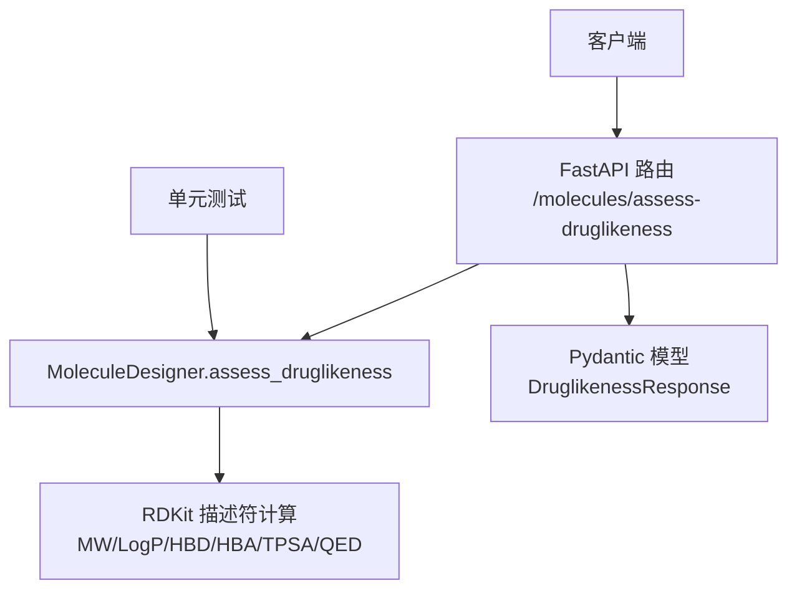
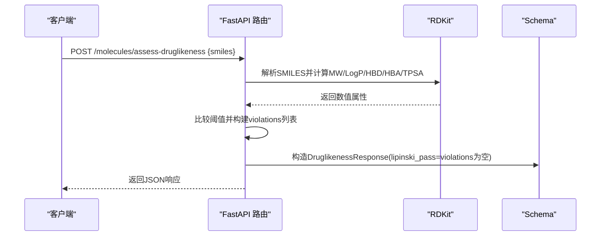
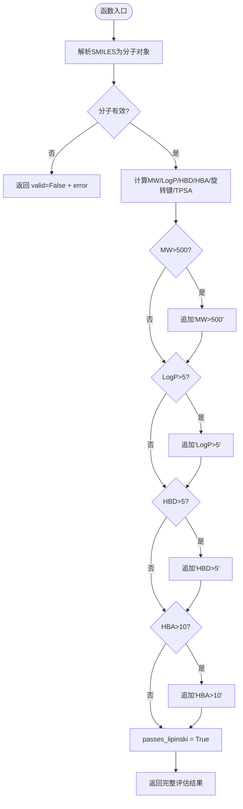
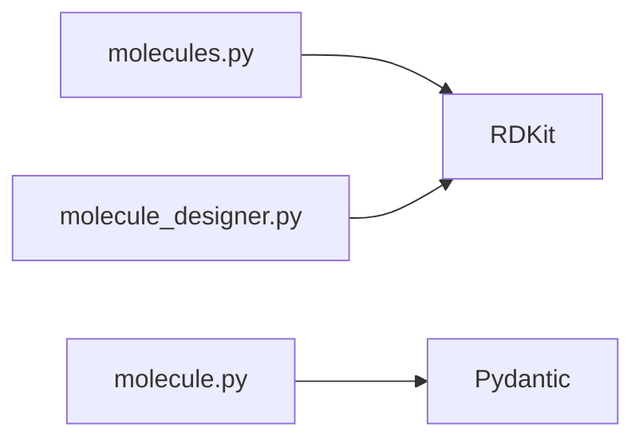

# Lipinski五规则评估

<cite>
**本文引用的文件**   
- [molecule_designer.py](file://backend/app/services/analyzer/molecule_designer.py)
- [molecules.py](file://backend/app/api/v1/molecules.py)
- [molecule.py](file://backend/app/schemas/molecule.py)
- [test_molecule_designer.py](file://tests/test_molecule_designer.py)
</cite>

## 目录
1. [简介](#简介)
2. [项目结构](#项目结构)
3. [核心组件](#核心组件)
4. [架构总览](#架构总览)
5. [详细组件分析](#详细组件分析)
6. [依赖关系分析](#依赖关系分析)
7. [性能与可扩展性](#性能与可扩展性)
8. [故障排查指南](#故障排查指南)
9. [结论](#结论)
10. [附录：使用示例与优化建议](#附录使用示例与优化建议)

## 简介
本文件围绕“Lipinski五规则评估系统”的实现进行系统化文档化，重点解析 assess_druglikeness 方法中四个核心指标的验证逻辑：分子权重（MW≤500）、脂溶性（LogP≤5）、氢键供体（HBD≤5）、氢键受体（HBA≤10）。同时说明 violations 字段如何标识违反的规则、passes_lipinski 布尔值的计算方式，并结合测试用例中的 SMILES 示例展示如何通过违规列表识别问题分子，以及基于违反规则的数量和类型给出分子优化指导。

## 项目结构
与 Lipinski 评估相关的代码主要分布在以下位置：
- 服务层：MoleculeDesigner.assess_druglikeness 实现完整的类药性评估（含 Lipinski、Veber、QED）
- API 层：/molecules/assess-druglikeness 提供 REST 接口，内部调用 RDKit 直接计算并返回结果
- Schema 层：DruglikenessResponse 定义响应结构，包含 violations 等字段
- 测试层：针对常见分子（如阿司匹林、布洛芬）及异常输入进行断言

图表来源
- [molecules.py:95-106](file://backend/app/api/v1/molecules.py#L95-L106)
- [molecule_designer.py:71-134](file://backend/app/services/analyzer/molecule_designer.py#L71-L134)
- [molecule.py:42-54](file://backend/app/schemas/molecule.py#L42-L54)

章节来源
- [molecules.py:1-110](file://backend/app/api/v1/molecules.py#L1-L110)
- [molecule_designer.py:1-134](file://backend/app/services/analyzer/molecule_designer.py#L1-L134)
- [molecule.py:42-54](file://backend/app/schemas/molecule.py#L42-L54)

## 核心组件
- MoleculeDesigner.assess_druglikeness：基于 RDKit 计算 MW、LogP、HBD、HBA、旋转键数、TPSA，并按 Lipinski 与 Veber 规则判定通过情况，同时计算 QED 分数。
- API 端点 /molecules/assess-druglikeness：接收 SMILES，调用 RDKit 计算并返回 DruglikenessResponse，其中包含 violations 列表与 lipinski_pass 标志。
- Pydantic 模型 DruglipenessResponse：定义返回字段，包括 molecular_weight、logp、hbd、hba、rotatable_bonds、tpsa、lipinski_pass、violations 等。

章节来源
- [molecule_designer.py:71-134](file://backend/app/services/analyzer/molecule_designer.py#L71-L134)
- [molecules.py:47-92](file://backend/app/api/v1/molecules.py#L47-L92)
- [molecule.py:42-54](file://backend/app/schemas/molecule.py#L42-L54)

## 架构总览
从请求到响应的关键流程如下：
- 客户端提交 SMILES 至 /molecules/assess-druglikeness
- API 层解析请求并调用 RDKit 计算属性
- 根据阈值判断是否违反 Lipinski 规则，生成 violations 列表
- 将 lipinski_pass 设置为 violations 是否为空
- 返回结构化响应

图表来源
- [molecules.py:95-106](file://backend/app/api/v1/molecules.py#L95-L106)
- [molecules.py:47-92](file://backend/app/api/v1/molecules.py#L47-L92)
- [molecule.py:42-54](file://backend/app/schemas/molecule.py#L42-L54)

## 详细组件分析

### assess_druglikeness 算法与数据流
- 输入：SMILES 字符串
- 计算：
  - MW = Descriptors.MolWt(mol)
  - LogP = Descriptors.MolLogP(mol)
  - HBD = Lipinski.NumHDonors(mol)
  - HBA = Lipinski.NumHAcceptors(mol)
  - 旋转键数 = Lipinski.NumRotatableBonds(mol)
  - TPSA = Descriptors.TPSA(mol)
- 判定：
  - 若 MW > 500，追加 "MW>500"
  - 若 LogP > 5，追加 "LogP>5"
  - 若 HBD > 5，追加 "HBD>5"
  - 若 HBA > 10，追加 "HBA>10"
  - passes_lipinski = len(violations) == 0
- 输出：包含 smiles、valid、各项属性、passes_lipinski、passes_veber、qed、violations 的字典

图表来源
- [molecule_designer.py:71-134](file://backend/app/services/analyzer/molecule_designer.py#L71-L134)

章节来源
- [molecule_designer.py:71-134](file://backend/app/services/analyzer/molecule_designer.py#L71-L134)

### API 层实现要点
- 路由 /molecules/assess-druglikeness 接收 DruglikenessRequest（包含 smiles）
- 内部 _assess_druglikeness 直接使用 RDKit 计算属性
- 构建 violations 列表，并将 lipinski_pass 设为 violations 是否为空
- 返回 ApiResponse[DruglikenessResponse]

章节来源
- [molecules.py:47-92](file://backend/app/api/v1/molecules.py#L47-L92)
- [molecules.py:95-106](file://backend/app/api/v1/molecules.py#L95-L106)
- [molecule.py:42-54](file://backend/app/schemas/molecule.py#L42-L54)

### 数据结构与复杂度
- 时间复杂度：O(N)，N 为分子原子数；RDKit 描述符计算线性于分子规模
- 空间复杂度：O(1)，仅存储少量标量属性与一个短列表（最多4条违规）
- 数据结构：
  - 输入：SMILES 字符串
  - 中间：分子对象与若干浮点/整型属性
  - 输出：字典或 Pydantic 模型，包含属性与违规列表

章节来源
- [molecule_designer.py:71-134](file://backend/app/services/analyzer/molecule_designer.py#L71-L134)
- [molecules.py:47-92](file://backend/app/api/v1/molecules.py#L47-L92)

### 生物学意义与阈值依据（概念性说明）
- 分子权重（MW≤500）：限制分子大小以利于跨膜扩散与口服吸收
- 脂溶性（LogP≤5）：控制疏水性，避免过强脂溶性导致溶解度差或代谢不稳定
- 氢键供体（HBD≤5）：过多供体会降低渗透性
- 氢键受体（HBA≤10）：过多受体会增加极性表面积，影响膜通透性
- 这些阈值来源于对已知口服药物的统计经验，用于快速筛选潜在可开发分子

（本节为概念性内容，不直接分析具体文件）

## 依赖关系分析
- 服务层依赖 RDKit 计算描述符；当 DeepChem 不可用时，预测模块会降级为规则模型
- API 层直接依赖 RDKit；未安装时抛出验证错误
- Schema 层定义响应结构，确保字段一致性

图表来源
- [molecules.py:47-92](file://backend/app/api/v1/molecules.py#L47-L92)
- [molecule_designer.py:71-134](file://backend/app/services/analyzer/molecule_designer.py#L71-L134)
- [molecule.py:42-54](file://backend/app/schemas/molecule.py#L42-L54)

章节来源
- [molecules.py:1-110](file://backend/app/api/v1/molecules.py#L1-L110)
- [molecule_designer.py:1-134](file://backend/app/services/analyzer/molecule_designer.py#L1-L134)
- [molecule.py:1-178](file://backend/app/schemas/molecule.py#L1-L178)

## 性能与可扩展性
- 单次评估开销低，适合批量处理；可通过并发或批处理提升吞吐
- 若需扩展更多规则（如 Veber、QED），可在服务层统一维护，API 层透传
- 当 DeepChem 可用时，predict_properties 可融合机器学习预测，但 Lipinski 评估仍由 RDKit 负责

（本节为通用指导，不直接分析具体文件）

## 故障排查指南
- RDKit 未安装：API 层会抛出验证错误，提示缺失 rdkit；请安装依赖后重试
- 无效 SMILES：返回 valid=False，并在 druglikeness 中包含 error 信息
- 大量违规：检查 violations 列表，逐项对应 MW/LogP/HBD/HBA 超标原因

章节来源
- [molecules.py:47-92](file://backend/app/api/v1/molecules.py#L47-L92)
- [molecule_designer.py:71-134](file://backend/app/services/analyzer/molecule_designer.py#L71-L134)

## 结论
本系统通过 RDKit 高效计算分子属性，并以 Lipinski 四指标为核心进行快速类药性筛选。violations 字段明确标识每条违规规则，passes_lipinski 直观反映整体通过情况。结合测试用例中的真实分子示例，开发者可据此进行定向优化与迭代。

（本节为总结性内容，不直接分析具体文件）

## 附录：使用示例与优化建议

### 实际调用示例（路径引用）
- 服务层调用：designer.assess_druglikeness(smiles)
  - 参考：[molecule_designer.py:71-134](file://backend/app/services/analyzer/molecule_designer.py#L71-L134)
- API 调用：POST /molecules/assess-druglikeness
  - 参考：[molecules.py:95-106](file://backend/app/api/v1/molecules.py#L95-L106)

### 典型 SMILES 示例（来自测试）
- 阿司匹林：CC(=O)OC1=CC=CC=C1C(=O)O
  - 预期：passes_lipinski=True，无违规
  - 参考：[test_molecule_designer.py:29-36](file://tests/test_molecule_designer.py#L29-L36)
- 布洛芬：CC(C)CC1=CC=C(C=C1)CC(C(=O)O)C
  - 预期：valid=True，MW 在合理范围
  - 参考：[test_molecule_designer.py:63-67](file://tests/test_molecule_designer.py#L63-L67)
- 超大分子：重复碳链（例如 "C"*200）
  - 预期：可能触发 "MW>500" 违规
  - 参考：[test_molecule_designer.py:43-49](file://tests/test_molecule_designer.py#L43-L49)

### 违规识别与优化指导
- 若 violations 包含 "MW>500"：考虑减少重原子数量、拆分大片段或引入更紧凑骨架
- 若 violations 包含 "LogP>5"：引入极性基团（如羟基、羧基）以降低脂溶性
- 若 violations 包含 "HBD>5"：减少氨基、羟基等供体数量，或将其保护/替换
- 若 violations 包含 "HBA>10"：减少醚氧、羰基、杂环氮等受体位点，或合并功能团

（本节为实践指导，不直接分析具体文件）