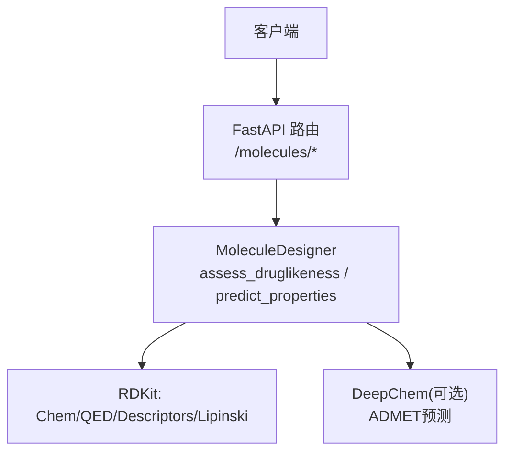
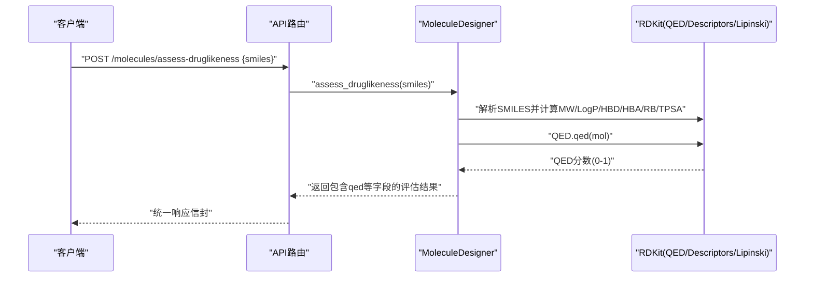
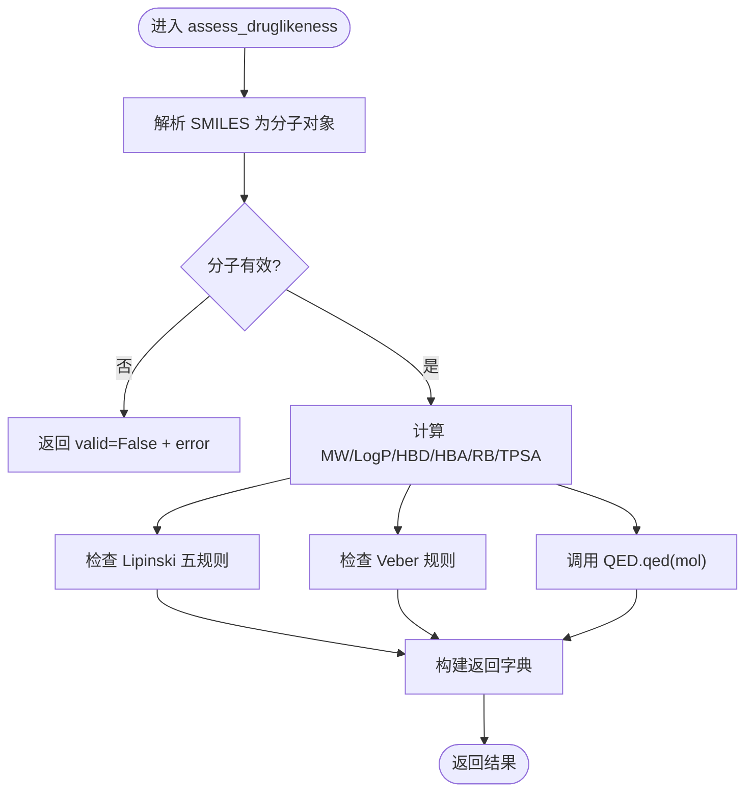
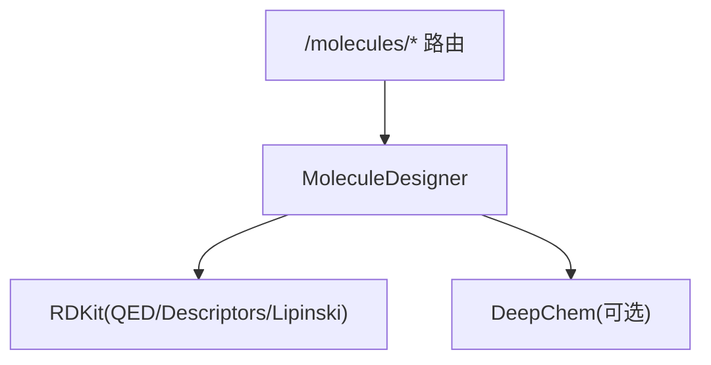

# QED药物相似性评分

<cite>
**本文引用的文件**   
- [molecule_designer.py](file://backend/app/services/analyzer/molecule_designer.py)
- [molecules.py](file://backend/app/api/v1/molecules.py)
- [test_molecule_designer.py](file://tests/test_molecule_designer.py)
</cite>

## 目录
1. [简介](#简介)
2. [项目结构](#项目结构)
3. [核心组件](#核心组件)
4. [架构总览](#架构总览)
5. [详细组件分析](#详细组件分析)
6. [依赖关系分析](#依赖关系分析)
7. [性能与可扩展性](#性能与可扩展性)
8. [故障排查指南](#故障排查指南)
9. [结论](#结论)
10. [附录：使用示例与解读指南](#附录使用示例与解读指南)

## 简介
本文件聚焦于QED（Qualitative Estimate of Drug-likeness）药物相似性评分在系统中的实现与应用。系统通过调用RDKit的QED模块，对候选分子进行多维类药性评估，并结合Lipinski五规则与Veber规则进行协同筛选。文档将解释assess_druglikeness方法中QED.qed()的调用方式、输出字段含义、分数区间解读，以及与Lipinski/Veber规则的协同使用方法，帮助研发人员高效筛选和优化候选分子。

## 项目结构
与QED评分直接相关的代码位于后端服务层与API层：
- 服务层：MoleculeDesigner.assess_druglikeness 封装了基于RDKit的类药性评估（含QED）。
- API层：/api/v1/molecules 提供类药性评估接口，并集成预测与生成能力。
- 测试：针对类药性评估与性质预测的单元测试覆盖关键路径。

图表来源
- [molecules.py:95-106](file://backend/app/api/v1/molecules.py#L95-L106)
- [molecule_designer.py:71-134](file://backend/app/services/analyzer/molecule_designer.py#L71-L134)

章节来源
- [molecule_designer.py:1-134](file://backend/app/services/analyzer/molecule_designer.py#L1-L134)
- [molecules.py:1-106](file://backend/app/api/v1/molecules.py#L1-L106)

## 核心组件
- MoleculeDesigner.assess_druglikeness：计算分子量、LogP、氢键供体/受体、可旋转键数、极性表面积TPSA；执行Lipinski与Veber规则判定；调用QED.qed(mol)得到QED分数。
- API端点：POST /molecules/assess-druglikeness 与 POST /molecules/predict-properties 暴露评估与预测能力，返回包含qed字段的响应。

章节来源
- [molecule_designer.py:71-134](file://backend/app/services/analyzer/molecule_designer.py#L71-L134)
- [molecules.py:95-106](file://backend/app/api/v1/molecules.py#L95-L106)

## 架构总览
QED评分在整体流程中的位置如下：
- 输入：SMILES字符串
- 解析与特征提取：RDKit解析为分子对象，计算基础理化特征
- 规则判定：Lipinski五规则与Veber规则
- QED评分：调用QED.qed(mol)得到0-1之间的综合分数
- 输出：结构化结果，包含各项指标与规则判定结果

图表来源
- [molecules.py:95-106](file://backend/app/api/v1/molecules.py#L95-L106)
- [molecule_designer.py:71-134](file://backend/app/services/analyzer/molecule_designer.py#L71-L134)

## 详细组件分析

### assess_druglikeness 方法与QED评分
- 功能概述：
  - 解析SMILES为分子对象
  - 计算分子量(MW)、LogP、氢键供体(HBD)、氢键受体(HBA)、可旋转键(RB)、极性表面积(TPSA)
  - Lipinski五规则判定：MW≤500、LogP≤5、HBD≤5、HBA≤10
  - Veber规则判定：RB≤10且TPSA≤140
  - QED评分：调用QED.qed(mol)，四舍五入保留四位小数
- 返回值关键字段：
  - valid：是否有效分子
  - molecular_weight/logp/hbd/hba/rotatable_bonds/tpsa：理化特征
  - passes_lipinski/passes_veber：规则通过情况
  - qed：QED分数（0-1）
  - violations：违反Lipinski的具体条目列表

图表来源
- [molecule_designer.py:71-134](file://backend/app/services/analyzer/molecule_designer.py#L71-L134)

章节来源
- [molecule_designer.py:71-134](file://backend/app/services/analyzer/molecule_designer.py#L71-L134)

### QED评分的计算模型与权重说明
- 在本项目中，QED评分由RDKit的QED.qed(mol)函数计算，返回值为0到1之间的连续分数。
- 关于QED算法的多维特征与权重细节（如分子量、LogP、氢键数量、极性表面积等特征的贡献权重），本项目未内嵌具体公式或权重参数，而是直接调用RDKit的实现。因此，具体的数学模型与权重分配以RDKit库为准。
- 本项目提供的“可解释性”功能为基于规则的线性近似，用于展示各特征对“类药性”的相对影响方向与大小，并非QED的真实权重分解。

章节来源
- [molecule_designer.py:116-119](file://backend/app/services/analyzer/molecule_designer.py#L116-L119)
- [molecule_designer.py:295-331](file://backend/app/services/analyzer/molecule_designer.py#L295-L331)

### QED分数取值范围与生物学含义
- 取值范围：0-1
- 含义：越接近1表示该分子越接近已知药物的理化特性分布，通常意味着更好的口服生物利用度与更低的早期失败风险；越接近0表示偏离典型药物空间较远，可能存在吸收、渗透性或代谢稳定性方面的挑战。
- 注意：QED仅衡量“类药性”，不等同于活性或安全性。高分不代表一定有效或安全，低分也不代表绝对不可行，需结合靶点、机制与后续实验验证。

章节来源
- [molecule_designer.py:116-134](file://backend/app/services/analyzer/molecule_designer.py#L116-L134)

### 高分与低分分子的常见模式
- 高分分子常见模式：
  - 分子量适中（通常在200-400之间）
  - LogP适中（约1-3）
  - HBD/HBA较少（HBD≤3，HBA≤6）
  - TPSA较低（一般<90）
  - 可旋转键数较少（≤7）
- 低分分子常见问题：
  - 分子量过大（>500）
  - LogP过高（>5）导致脂溶性过强
  - HBD/HBA过多导致极性与水溶性问题
  - TPSA过高（>140）影响膜通透性
  - 可旋转键过多导致构象柔性大、口服吸收差

章节来源
- [molecule_designer.py:101-114](file://backend/app/services/analyzer/molecule_designer.py#L101-L114)

### QED评分解读指南与开发潜力评估
- 0.0-0.3：较差类药性，建议优先优化MW/LogP/TPSA/HBD/HBA等关键特征
- 0.3-0.5：中等偏下，存在明显改进空间，建议调整骨架或取代基
- 0.5-0.7：良好，具备进一步优化的基础，可结合活性与选择性推进
- 0.7-0.9：优秀，符合多数口服小分子药物特征，适合进入先导优化阶段
- 0.9-1.0：极佳，接近理想药物空间，但仍需关注特异性与安全性

章节来源
- [molecule_designer.py:116-134](file://backend/app/services/analyzer/molecule_designer.py#L116-L134)

### 与Lipinski与Veber规则的协同使用
- Lipinski五规则：快速初筛，过滤掉明显不符合口服小分子特征的分子
- Veber规则：补充评估膜通透性与构象柔性，提高筛选质量
- QED评分：综合量化类药性，作为排序与优先级判断依据
- 协同策略：
  - 先应用Lipinski与Veber规则进行硬性过滤
  - 再按QED分数从高到低排序，选择高潜力分子进入下一步
  - 结合其他ADMET预测（如溶解度、血脑屏障通透性）进行综合决策

章节来源
- [molecule_designer.py:101-114](file://backend/app/services/analyzer/molecule_designer.py#L101-L114)
- [molecule_designer.py:116-134](file://backend/app/services/analyzer/molecule_designer.py#L116-L134)

## 依赖关系分析
- 外部依赖：
  - RDKit：提供化学信息学工具（QED、Descriptors、Lipinski等）
  - DeepChem（可选）：用于ADMET预测，若不可用则降级为规则模型
- 内部耦合：
  - API层依赖服务层MoleculeDesigner
  - 服务层延迟加载RDKit与DeepChem，避免启动失败

图表来源
- [molecules.py:95-106](file://backend/app/api/v1/molecules.py#L95-L106)
- [molecule_designer.py:34-69](file://backend/app/services/analyzer/molecule_designer.py#L34-L69)

章节来源
- [molecule_designer.py:34-69](file://backend/app/services/analyzer/molecule_designer.py#L34-L69)
- [molecules.py:95-106](file://backend/app/api/v1/molecules.py#L95-L106)

## 性能与可扩展性
- 延迟加载：RDKit与DeepChem按需导入，降低启动开销与依赖冲突风险
- 降级策略：DeepChem不可用时自动回退至规则模型，保证可用性
- 批处理建议：对大量SMILES进行批量评估时，建议复用MoleculeDesigner实例以减少重复初始化成本

[本节为通用指导，不涉及具体文件分析]

## 故障排查指南
- RDKit未安装：
  - 现象：调用assess_druglikeness抛出运行时错误
  - 处理：安装rdkit后重试
- 无效SMILES：
  - 现象：valid=False并附带error字段
  - 处理：校验SMILES格式或使用标准化工具修正
- QED计算异常：
  - 现象：qed_score为None
  - 处理：检查分子结构是否合理，必要时简化或替换片段

章节来源
- [molecule_designer.py:86-92](file://backend/app/services/analyzer/molecule_designer.py#L86-L92)
- [molecule_designer.py:116-119](file://backend/app/services/analyzer/molecule_designer.py#L116-L119)

## 结论
本项目通过整合RDKit的QED评分与Lipinski/Veber规则，提供了高效的类药性评估能力。QED分数可作为候选分子排序与优先级判断的重要依据，但需结合其他ADMET指标与实验数据进行综合决策。建议在管线中采用“规则过滤+QED排序+多目标优化”的策略，以提升早期筛选效率与成功率。

[本节为总结性内容，不涉及具体文件分析]

## 附录：使用示例与解读指南

### 通过API获取QED评分
- 请求：
  - 方法：POST
  - 路径：/api/v1/molecules/assess-druglikeness
  - 请求体：{ "smiles": "CC(=O)OC1=CC=CC=C1C(=O)O" }
- 响应关键字段：
  - valid：布尔值，指示SMILES是否有效
  - molecular_weight/logp/hbd/hba/rotatable_bonds/tpsa：理化特征
  - passes_lipinski/passes_veber：规则通过情况
  - violations：违反Lipinski的具体条目
  - qed：QED分数（0-1）

章节来源
- [molecules.py:95-106](file://backend/app/api/v1/molecules.py#L95-L106)

### 通过Python服务层调用
- 示例步骤：
  - 创建MoleculeDesigner实例
  - 调用assess_druglikeness(smiles)
  - 读取返回结果中的qed字段与其他指标
- 参考测试用例：
  - 阿司匹林应通过Lipinski规则
  - 无效SMILES应返回valid=False
  - 布洛芬的分子量应在合理范围内

章节来源
- [test_molecule_designer.py:29-68](file://tests/test_molecule_designer.py#L29-L68)

### 与Lipinski和Veber协同筛选的流程
- 步骤：
  - 输入候选分子SMILES集合
  - 调用assess_druglikeness获取各项指标与规则判定
  - 过滤passes_lipinski=True且passes_veber=True的分子
  - 按qed分数降序排列，选择前N个进入后续优化
- 扩展：
  - 结合predict_properties获取溶解度、BBB通透性等指标
  - 根据业务需求设定阈值与权重进行多目标打分

章节来源
- [molecule_designer.py:101-134](file://backend/app/services/analyzer/molecule_designer.py#L101-L134)
- [molecule_designer.py:136-224](file://backend/app/services/analyzer/molecule_designer.py#L136-L224)