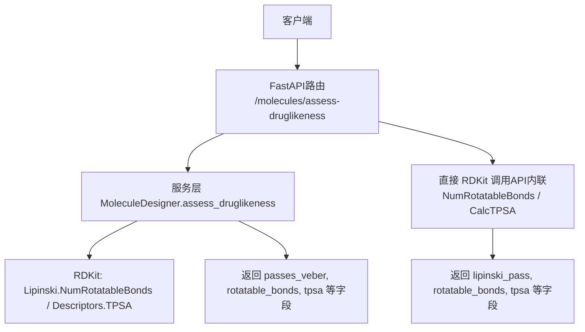
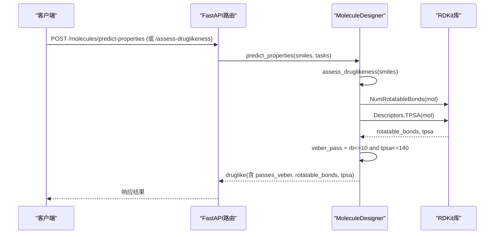
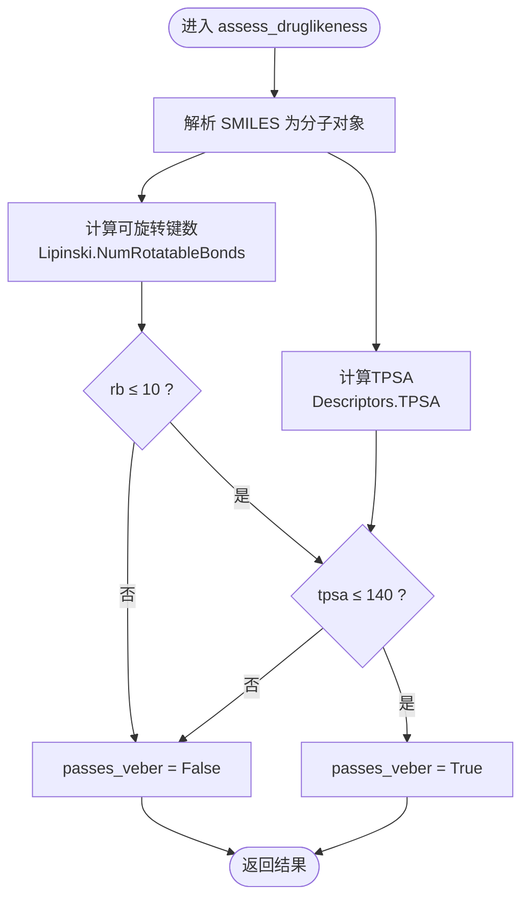
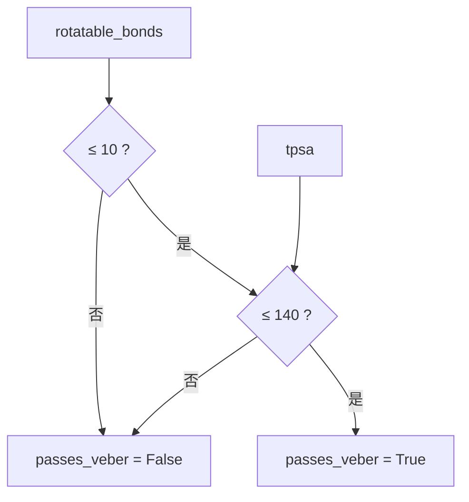
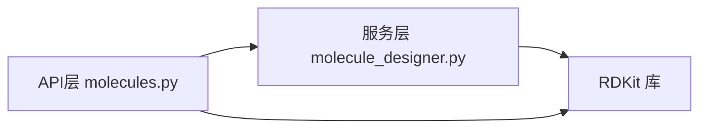

# Veber规则检查

<cite>
**本文引用的文件**   
- [molecule_designer.py](file://backend/app/services/analyzer/molecule_designer.py)
- [molecules.py](file://backend/app/api/v1/molecules.py)
- [test_molecule_designer.py](file://tests/test_molecule_designer.py)
</cite>

## 目录
1. [简介](#简介)
2. [项目结构](#项目结构)
3. [核心组件](#核心组件)
4. [架构总览](#架构总览)
5. [详细组件分析](#详细组件分析)
6. [依赖关系分析](#依赖关系分析)
7. [性能考量](#性能考量)
8. [故障排查指南](#故障排查指南)
9. [结论](#结论)
10. [附录](#附录)

## 简介
本文件聚焦于Veber规则在assess_druglikeness方法中的实现机制，围绕两个关键参数：可旋转键数（≤10）与拓扑极性表面积TPSA（≤140），系统性地说明其计算来源、判断逻辑、与口服生物利用度的关联，以及分子吸收/分布特性的影响。同时给出当Veber规则失败时的优化建议、具体分子案例与规则调整策略，帮助读者快速理解并应用该规则进行类药性筛选与优化。

## 项目结构
本项目在后端服务中提供分子评估能力，其中Veber规则由“服务层”和“API层”共同完成：
- 服务层：MoleculeDesigner.assess_druglikeness 负责基于RDKit计算分子描述符并执行Lipinski与Veber规则判定。
- API层：/api/v1/molecules.py 暴露REST接口，内部也直接调用RDKit进行类药性评估（用于独立端点）。

图表来源
- [molecule_designer.py:71-134](file://backend/app/services/analyzer/molecule_designer.py#L71-L134)
- [molecules.py:47-92](file://backend/app/api/v1/molecules.py#L47-L92)

章节来源
- [molecule_designer.py:71-134](file://backend/app/services/analyzer/molecule_designer.py#L71-L134)
- [molecules.py:47-92](file://backend/app/api/v1/molecules.py#L47-L92)

## 核心组件
- assess_druglikeness（服务层）
  - 输入：SMILES字符串
  - 输出：包含 molecular_weight、logp、hbd、hba、rotatable_bonds、tpsa、passes_lipinski、passes_veber、qed、violations 等字段的字典
  - 关键点：
    - 使用 RDKit 的 Lipinski.NumRotatableBonds 计算可旋转键数
    - 使用 RDKit 的 Descriptors.TPSA 计算TPSA
    - Veber规则判定：rotatable_bonds ≤ 10 且 tpsa ≤ 140
- 类药性评估（API层）
  - 通过 /molecules/assess-druglikeness 暴露
  - 内部直接调用 RDKit 的 Lipinski.NumRotatableBonds 与 rdMolDescriptors.CalcTPSA
  - 返回 lipinski_pass、rotatable_bonds、tpsa 等字段（注意字段名差异）

章节来源
- [molecule_designer.py:71-134](file://backend/app/services/analyzer/molecule_designer.py#L71-L134)
- [molecules.py:47-92](file://backend/app/api/v1/molecules.py#L47-L92)

## 架构总览
以下序列图展示从请求到Veber规则判定的完整流程（以服务层为例）：

图表来源
- [molecule_designer.py:136-160](file://backend/app/services/analyzer/molecule_designer.py#L136-L160)
- [molecule_designer.py:71-134](file://backend/app/services/analyzer/molecule_designer.py#L71-L134)
- [molecules.py:219-298](file://backend/app/api/v1/molecules.py#L219-L298)

## 详细组件分析

### Veber规则在assess_druglikeness中的实现
- 计算来源
  - 可旋转键数：Lipinski.NumRotatableBonds(mol)
  - TPSA：Descriptors.TPSA(mol)
- 判定逻辑
  - passes_veber = (rotatable_bonds ≤ 10) AND (tpsa ≤ 140)
- 返回值
  - 包含 rotatable_bonds、tpsa、passes_veber 等字段，供后续ADMET预测与前端展示使用

图表来源
- [molecule_designer.py:94-113](file://backend/app/services/analyzer/molecule_designer.py#L94-L113)
- [molecule_designer.py:121-134](file://backend/app/services/analyzer/molecule_designer.py#L121-L134)

章节来源
- [molecule_designer.py:94-113](file://backend/app/services/analyzer/molecule_designer.py#L94-L113)
- [molecule_designer.py:121-134](file://backend/app/services/analyzer/molecule_designer.py#L121-L134)

### 可旋转键数（rotatable_bonds）计算方法
- 函数来源：Lipinski.NumRotatableBonds(mol)
- 作用：统计分子中符合定义的可旋转键数量，常用于衡量分子柔性；数值越大，构象自由度越高，可能影响跨膜渗透性与代谢稳定性
- 在本系统中的使用：
  - 服务层：assess_druglikeness 中直接调用
  - API层：/molecules/assess-druglikeness 中也直接调用（字段名为 rotatable_bonds）

章节来源
- [molecule_designer.py:97-98](file://backend/app/services/analyzer/molecule_designer.py#L97-L98)
- [molecules.py:68-69](file://backend/app/api/v1/molecules.py#L68-L69)

### 拓扑极性表面积（TPSA）计算方法
- 函数来源：
  - 服务层：Descriptors.TPSA(mol)
  - API层：rdMolDescriptors.CalcTPSA(mol)
- 作用：量化分子表面极性原子贡献的表面积，反映氢键供体/受体能力与极性特征；TPSA越低，通常越有利于跨膜渗透
- 在本系统中的使用：
  - 服务层：assess_druglikeness 中直接调用
  - API层：/molecules/assess-druglikeness 中直接调用（字段名为 tpsa）

章节来源
- [molecule_designer.py:98-99](file://backend/app/services/analyzer/molecule_designer.py#L98-L99)
- [molecules.py:69-70](file://backend/app/api/v1/molecules.py#L69-L70)

### passes_veber布尔值判断逻辑
- 判定条件：rotatable_bonds ≤ 10 且 tpsa ≤ 140
- 返回值：True/False
- 下游影响：
  - 口服生物利用度规则（_rule_bioavailability）会综合 Lipinski 与 Veber 的结果，若任一不满足则口服生物利用度为False
  - 前端展示与过滤逻辑可直接依据 passes_veber 进行筛选

图表来源
- [molecule_designer.py:112-113](file://backend/app/services/analyzer/molecule_designer.py#L112-L113)
- [molecule_designer.py:268-274](file://backend/app/services/analyzer/molecule_designer.py#L268-L274)

章节来源
- [molecule_designer.py:112-113](file://backend/app/services/analyzer/molecule_designer.py#L112-L113)
- [molecule_designer.py:268-274](file://backend/app/services/analyzer/molecule_designer.py#L268-L274)

### Veber规则与口服生物利用度的关系
- 口服生物利用度规则（_rule_bioavailability）：
  - 需要 Lipinski 通过、Veber 通过，且 tpsa < 140
- 意义：
  - 可旋转键数控制分子柔性，过多会导致跨膜困难与代谢不稳定
  - TPSA控制极性表面积，过高会降低脂溶性，影响肠道吸收与血脑屏障穿透
- 在本系统中：
  - 服务层将 passes_veber 与 tpsa 阈值纳入口服生物利用度判断
  - API层返回的 druglikeness 字段中包含 passes_veber，便于上层聚合

章节来源
- [molecule_designer.py:268-274](file://backend/app/services/analyzer/molecule_designer.py#L268-L274)
- [molecules.py:242-257](file://backend/app/api/v1/molecules.py#L242-L257)

### 对分子吸收与分布特性的影响
- 吸收（Absorption）：
  - 低TPSA与适度柔性有助于被动扩散穿过肠上皮细胞膜
  - 高TPSA与过多可旋转键会降低渗透性，降低口服吸收率
- 分布（Distribution）：
  - 低TPSA与较小分子量更利于组织分布与血脑屏障穿透
  - 高TPSA易被外排泵识别，限制组织分布

[本节为概念性说明，不直接分析具体文件]

### 分子案例与规则调整策略
- 案例一：阿司匹林（示例SMILES）
  - 预期：符合Lipinski与Veber，passes_veber应为True
  - 参考测试断言：验证 passes_lipinski 与属性字段存在
- 案例二：布洛芬（示例SMILES）
  - 预期：分子量在合理范围，passes_veber通常为True
- 案例三：超大分子（长链C重复）
  - 预期：违反Lipinski，可能同时违反Veber（取决于结构与TPSA）
- 调整策略（当Veber失败时）：
  - 减少可旋转键：
    - 引入环化或刚性片段，减少单键连接
    - 合并侧链，缩短柔性链长度
  - 降低TPSA：
    - 替换强极性基团为弱极性或非极性基团
    - 减少氢键供体/受体数量（如用甲基取代羟基）
  - 平衡LogP与TPSA：
    - 避免过度亲脂导致毒性风险升高
    - 维持TPSA在140以下，兼顾渗透性与溶解性

章节来源
- [test_molecule_designer.py:29-67](file://tests/test_molecule_designer.py#L29-L67)

## 依赖关系分析
- 模块耦合
  - API层依赖服务层进行性质预测，但类药性评估端点也可独立调用RDKit
  - 服务层依赖RDKit进行描述符计算
- 外部依赖
  - RDKit：Lipinski.NumRotatableBonds、Descriptors.TPSA、rdMolDescriptors.CalcTPSA
- 潜在循环依赖
  - 当前实现无循环依赖；服务层与API层职责清晰

图表来源
- [molecule_designer.py:71-134](file://backend/app/services/analyzer/molecule_designer.py#L71-L134)
- [molecules.py:47-92](file://backend/app/api/v1/molecules.py#L47-L92)

章节来源
- [molecule_designer.py:71-134](file://backend/app/services/analyzer/molecule_designer.py#L71-L134)
- [molecules.py:47-92](file://backend/app/api/v1/molecules.py#L47-L92)

## 性能考量
- RDKit计算开销
  - NumRotatableBonds与TPSA均为轻量级描述符，单次计算耗时极低
- 批量评估
  - 建议在批量场景下复用RDKit分子对象，避免重复解析SMILES
- 降级策略
  - DeepChem不可用时自动降级为规则模型，不影响Veber规则的计算与判定

[本节为通用指导，不直接分析具体文件]

## 故障排查指南
- RDKit未安装
  - 现象：类药性评估抛出异常或返回valid=False
  - 处理：安装RDKit并确保环境可用
- 无效SMILES
  - 现象：返回valid=False与错误信息
  - 处理：校验SMILES语法或使用工具修复
- 字段不一致
  - 服务层返回 passes_veber，API层返回 lipinski_pass
  - 处理：根据调用路径选择正确的字段名

章节来源
- [molecules.py:52-59](file://backend/app/api/v1/molecules.py#L52-L59)
- [molecule_designer.py:86-92](file://backend/app/services/analyzer/molecule_designer.py#L86-L92)

## 结论
Veber规则在本系统中通过RDKit的描述符计算与简洁的阈值判定实现，服务于口服生物利用度与渗透性评估。rotatable_bonds与tpsa作为关键指标，直接影响分子的吸收与分布特性。当Veber规则失败时，可通过结构刚性化与极性基团替换等手段进行优化。结合Lipinski与QED等多维度规则，可更全面地指导早期药物发现阶段的分子筛选与设计。

[本节为总结性内容，不直接分析具体文件]

## 附录
- 相关API端点
  - POST /molecules/assess-druglikeness：返回 lipinski_pass、rotatable_bonds、tpsa 等
  - POST /molecules/predict-properties：返回 druglikeness（含 passes_veber）与 properties
- 前端展示
  - 分子评估页面显示 rotatable_bonds 与 tpsa 指标，便于直观查看

章节来源
- [molecules.py:95-106](file://backend/app/api/v1/molecules.py#L95-L106)
- [molecules.py:219-298](file://backend/app/api/v1/molecules.py#L219-L298)