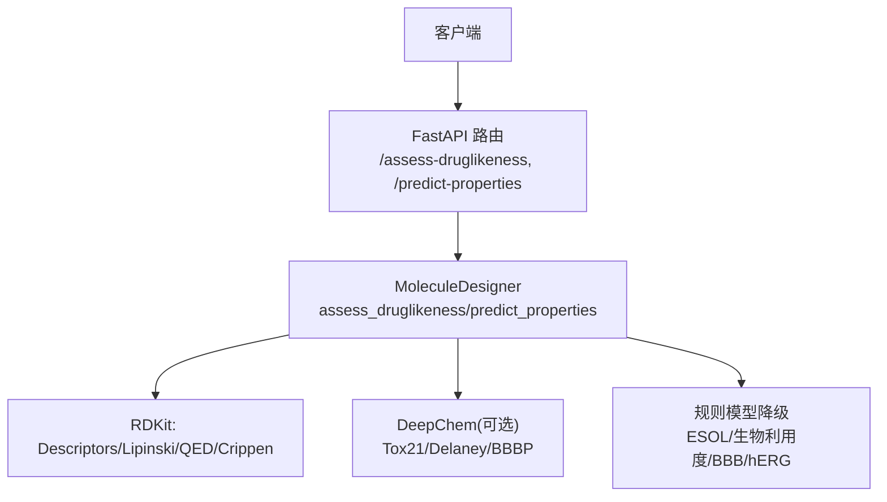
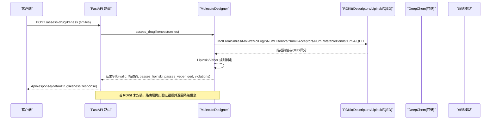
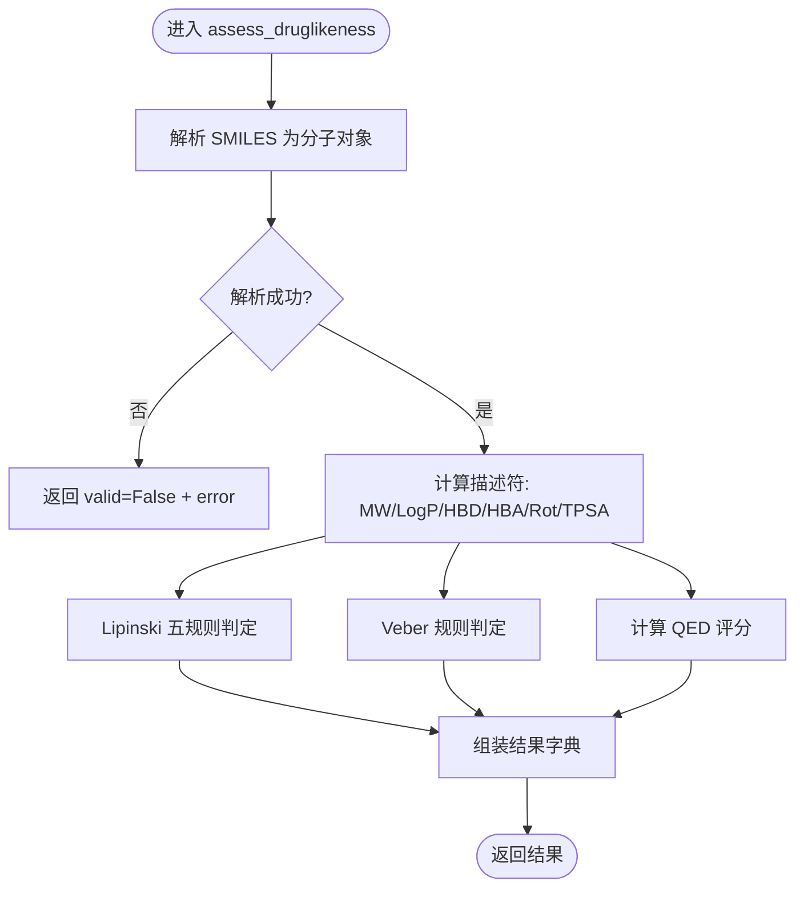
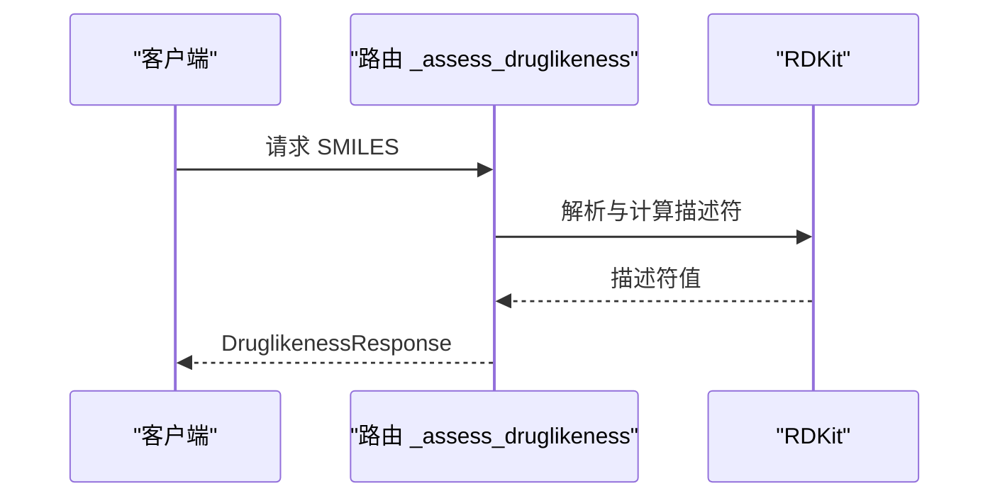
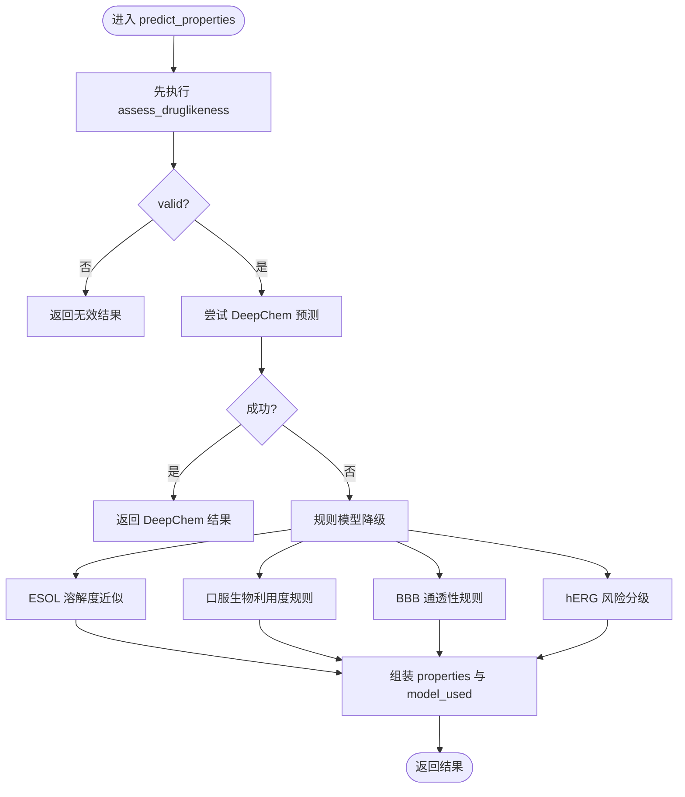
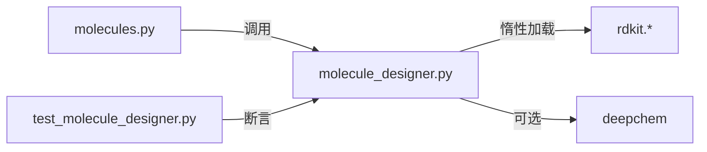

# 分子描述符计算

<cite>
**本文引用的文件**
- [molecule_designer.py](file://backend/app/services/analyzer/molecule_designer.py)
- [molecules.py](file://backend/app/api/v1/molecules.py)
- [molecule.py](file://backend/app/schemas/molecule.py)
- [test_molecule_designer.py](file://tests/test_molecule_designer.py)
- [check_rdkit.py](file://scripts/check_rdkit.py)
</cite>

## 目录
1. [简介](#简介)
2. [项目结构](#项目结构)
3. [核心组件](#核心组件)
4. [架构总览](#架构总览)
5. [详细组件分析](#详细组件分析)
6. [依赖关系分析](#依赖关系分析)
7. [性能与精度考量](#性能与精度考量)
8. [故障排查指南](#故障排查指南)
9. [结论](#结论)
10. [附录：参考范围与异常处理策略](#附录参考范围与异常处理策略)

## 简介
本技术文档聚焦于“分子描述符计算系统”中的类药性评估流程，重点解析 assess_druglikeness 方法如何基于 RDKit 计算关键物理化学性质（分子权重、分配系数、氢键供体/受体、可旋转键、拓扑极性表面积等），并说明这些描述符在药物吸收、分布、代谢、排泄（ADME）中的作用。同时，文档梳理了 API 层与服务层的调用路径、错误降级策略、以及测试覆盖要点，帮助读者理解从输入 SMILES 到输出描述符与规则判断的完整链路。

## 项目结构
围绕分子描述符计算的核心代码分布在服务层与 API 层：
- 服务层：封装 RDKit 惰性加载与描述符计算、规则判定（Lipinski/Veber/QED）、以及 ADMET 预测（DeepChem 优先，规则模型降级）。
- API 层：暴露 /assess-druglikeness 与 /predict-properties 等端点，统一请求/响应结构与错误包装。
- 数据模型：Pydantic Schema 定义字段类型与校验约束。
- 测试与脚本：提供最小可用验证与单元测试用例。

图表来源
- [molecules.py:95-106](file://backend/app/api/v1/molecules.py#L95-L106)
- [molecule_designer.py:71-134](file://backend/app/services/analyzer/molecule_designer.py#L71-L134)

章节来源
- [molecules.py:1-12](file://backend/app/api/v1/molecules.py#L1-L12)
- [molecule_designer.py:1-10](file://backend/app/services/analyzer/molecule_designer.py#L1-L10)

## 核心组件
- MoleculeDesigner.assess_druglikeness：接收 SMILES，计算 MW、LogP、HBD、HBA、可旋转键、TPSA，执行 Lipinski 五规则与 Veber 规则判定，并尝试计算 QED。
- API._assess_druglikeness：在路由层直接调用 RDKit 进行快速评估，返回结构化响应。
- predict_properties：优先使用 DeepChem 模型；不可用时回退至基于规则的 ADMET 预测（包含 ESOL 溶解度近似、口服生物利用度、血脑屏障通透性与 hERG 风险等级）。

章节来源
- [molecule_designer.py:71-134](file://backend/app/services/analyzer/molecule_designer.py#L71-L134)
- [molecules.py:47-92](file://backend/app/api/v1/molecules.py#L47-L92)
- [molecule_designer.py:136-256](file://backend/app/services/analyzer/molecule_designer.py#L136-L256)

## 架构总览
以下序列图展示一次类药性评估的请求-响应流程，包括错误处理与降级逻辑。

图表来源
- [molecules.py:95-106](file://backend/app/api/v1/molecules.py#L95-L106)
- [molecule_designer.py:71-134](file://backend/app/services/analyzer/molecule_designer.py#L71-L134)

章节来源
- [molecules.py:95-106](file://backend/app/api/v1/molecules.py#L95-L106)
- [molecule_designer.py:71-134](file://backend/app/services/analyzer/molecule_designer.py#L71-L134)

## 详细组件分析

### 组件A：assess_druglikeness（服务层）
- 输入：SMILES 字符串
- 计算步骤：
  - 解析为 RDKit 分子对象
  - 计算分子权重（MW）、分配系数（LogP）、氢键供体数（HBD）、氢键受体数（HBA）、可旋转键数、拓扑极性表面积（TPSA）
  - 应用 Lipinski 五规则（MW≤500、LogP≤5、HBD≤5、HBA≤10）
  - 应用 Veber 规则（可旋转键≤10、TPSA≤140）
  - 计算 QED（药物相似性定量评分）
- 输出：包含 valid、描述符值、passes_lipinski、passes_veber、qed、violations 的结构化结果

图表来源
- [molecule_designer.py:71-134](file://backend/app/services/analyzer/molecule_designer.py#L71-L134)

章节来源
- [molecule_designer.py:71-134](file://backend/app/services/analyzer/molecule_designer.py#L71-L134)

### 组件B：_assess_druglikeness（API 层）
- 作用：在路由层直接调用 RDKit 完成快速评估，便于独立使用或作为轻量接口。
- 特点：
  - 若 RDKit 未安装，抛出验证错误并返回缺失依赖提示
  - 返回 DruglikenessResponse，包含 molecular_weight、logp、hbd、hba、rotatable_bonds、tpsa、lipinski_pass、violations

图表来源
- [molecules.py:47-92](file://backend/app/api/v1/molecules.py#L47-L92)

章节来源
- [molecules.py:47-92](file://backend/app/api/v1/molecules.py#L47-L92)

### 组件C：predict_properties（服务层）
- 目标：预测 ADMET 相关性质（毒性、溶解度、口服生物利用度、血脑屏障通透性、hERG 毒性风险）
- 策略：
  - 优先使用 DeepChem 模型（如 Tox21、Delaney、BBBP），失败则记录警告并降级
  - 降级时使用规则模型：
    - 溶解度：ESOL 近似公式（基于 LogP、MW、可旋转键）
    - 口服生物利用度：结合 Lipinski 与 Veber 规则
    - BBB 通透性：基于 MW、LogP、TPSA 阈值
    - hERG 毒性风险：基于 LogP 分级

图表来源
- [molecule_designer.py:136-256](file://backend/app/services/analyzer/molecule_designer.py#L136-L256)

章节来源
- [molecule_designer.py:136-256](file://backend/app/services/analyzer/molecule_designer.py#L136-L256)

### 组件D：Schema 与数据类型
- DruglikenessRequest/Response：定义输入 SMILES 与输出描述符字段及校验
- PropertyPredictionRequest/Response：定义任务列表与返回的 properties、model_used、druglikeness 字段
- GeneratedMolecule 等：用于生成式分子设计的结果封装

章节来源
- [molecule.py:36-54](file://backend/app/schemas/molecule.py#L36-L54)
- [molecule.py:95-112](file://backend/app/schemas/molecule.py#L95-L112)
- [molecule.py:132-147](file://backend/app/schemas/molecule.py#L132-L147)

## 依赖关系分析
- 服务层对 RDKit 采用惰性加载，避免启动时强依赖导致失败；DeepChem 同样惰性加载且支持降级。
- API 层在路由函数中直接导入 RDKit，若缺失则抛出验证错误，保证接口可用性。
- 测试用例覆盖有效/无效 SMILES、Lipinski 通过情况、属性完整性、相似度计算等场景。

图表来源
- [molecules.py:47-92](file://backend/app/api/v1/molecules.py#L47-L92)
- [molecule_designer.py:34-50](file://backend/app/services/analyzer/molecule_designer.py#L34-L50)
- [test_molecule_designer.py:26-68](file://tests/test_molecule_designer.py#L26-L68)

章节来源
- [molecule_designer.py:34-50](file://backend/app/services/analyzer/molecule_designer.py#L34-L50)
- [molecules.py:47-92](file://backend/app/api/v1/molecules.py#L47-L92)
- [test_molecule_designer.py:26-68](file://tests/test_molecule_designer.py#L26-L68)

## 性能与精度考量
- 惰性加载：避免不必要的模块导入开销，提升启动速度。
- 数值舍入：描述符值通常保留两位小数，QED 保留四位，平衡可读性与精度。
- 规则判定：Lipinski 与 Veber 阈值明确，计算复杂度低，适合批量筛选。
- 模型降级：DeepChem 不可用时自动回退规则模型，保障服务稳定性。

[本节为通用指导，不直接分析具体文件]

## 故障排查指南
- RDKit 未安装：
  - 现象：路由层抛出验证错误，返回 missing rdkit 提示
  - 处理：安装 RDKit 或使用脚本检查环境
- 无效 SMILES：
  - 现象：valid=False，error 字段包含错误原因
  - 处理：校验 SMILES 语法，必要时使用标准化或修复工具
- DeepChem 不可用：
  - 现象：日志警告“DeepChem 未安装，性质预测将降级为规则模型”
  - 处理：安装 DeepChem 或接受规则模型降级结果

章节来源
- [molecules.py:52-59](file://backend/app/api/v1/molecules.py#L52-L59)
- [molecule_designer.py:52-69](file://backend/app/services/analyzer/molecule_designer.py#L52-L69)
- [check_rdkit.py:1-16](file://scripts/check_rdkit.py#L1-16)

## 结论
本系统以 RDKit 为核心，实现了稳健的分子描述符计算与类药性评估流程，并通过规则模型与可选的 DeepChem 模型组合，提供了可扩展的 ADMET 预测能力。服务层与 API 层职责清晰，错误处理与降级策略完善，测试覆盖关键路径，整体具备良好的工程实践与可维护性。

[本节为总结，不直接分析具体文件]

## 附录：参考范围与异常处理策略

### 描述符算法与生物学意义
- 分子权重（MW）
  - 算法：原子质量求和（RDKit Descriptors.MolWt）
  - 生物学意义：影响渗透性与清除率；过大可能降低口服吸收
  - 正常范围参考：常见小分子药物多在 200–500 Da
  - 异常处理：超过阈值标记 Lipinski 违规，建议结构精简或片段优化
- 分配系数（LogP）
  - 算法：Crippen 贡献法（RDKit Crippen.MolLogP 或 Descriptors.MolLogP）
  - 生物学意义：反映脂溶性，过高降低水溶性与吸收，过低降低膜渗透
  - 正常范围参考：多数口服药物 LogP 在 0–5 之间
  - 异常处理：高 LogP 提示引入极性基团或减少疏水片段
- 氢键供体/受体（HBD/HBA）
  - 算法：Lipinski.NumHDonors/NumHAcceptors
  - 生物学意义：影响水溶性与膜穿透；过多会降低渗透性
  - 正常范围参考：HBD≤5、HBA≤10（Lipinski）
  - 异常处理：减少强极性或可电离基团数量
- 可旋转键（Rotatable Bonds）
  - 算法：Lipinski.NumRotatableBonds
  - 生物学意义：影响构象熵与口服生物利用度
  - 正常范围参考：≤10（Veber）
  - 异常处理：环化或引入刚性结构以降低柔性
- 拓扑极性表面积（TPSA）
  - 算法：RDKit rdMolDescriptors.CalcTPSA 或 Descriptors.TPSA
  - 生物学意义：反映极性表面积，影响渗透与 BBB 穿透
  - 正常范围参考：口服药物 TPSA 多小于 140 Ų；BBB 穿透常要求 <90 Ų
  - 异常处理：引入非极性片段或减少极性基团

### 规则与评分
- Lipinski 五规则：MW≤500、LogP≤5、HBD≤5、HBA≤10
- Veber 规则：可旋转键≤10、TPSA≤140
- QED：综合多个描述符的药物相似性评分（0–1），越高越接近已知药物特性

### 异常值处理策略
- 无效 SMILES：返回 valid=False 与错误信息，前端提示修正
- 超出阈值：记录 violations 列表，辅助结构优化决策
- 模型不可用：记录日志与降级状态，确保接口稳定

### 实际计算示例与相关性分析
- 示例：阿司匹林（CC(=O)OC1=CC=CC=C1C(=O)O）应通过 Lipinski 规则，分子量与 LogP 符合常规范围
- 示例：布洛芬（CC(C)CC1=CC=C(C=C1)CC(C(=O)O)C）分子量应在 200–300 范围内
- 相关性：
  - LogP 与溶解度负相关（ESOL 近似体现）
  - TPSA 与 BBB 通透性负相关
  - MW 与口服生物利用度存在非线性关系（过小或过大均不利）

章节来源
- [molecule_designer.py:94-134](file://backend/app/services/analyzer/molecule_designer.py#L94-L134)
- [molecules.py:64-92](file://backend/app/api/v1/molecules.py#L64-L92)
- [test_molecule_designer.py:29-68](file://tests/test_molecule_designer.py#L29-L68)