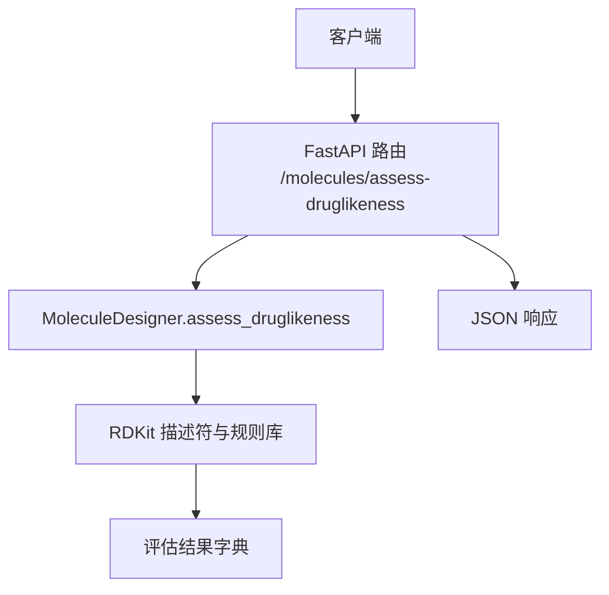
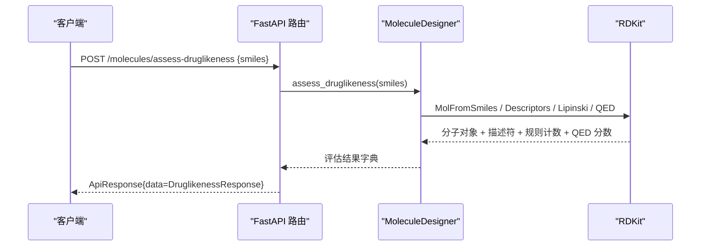
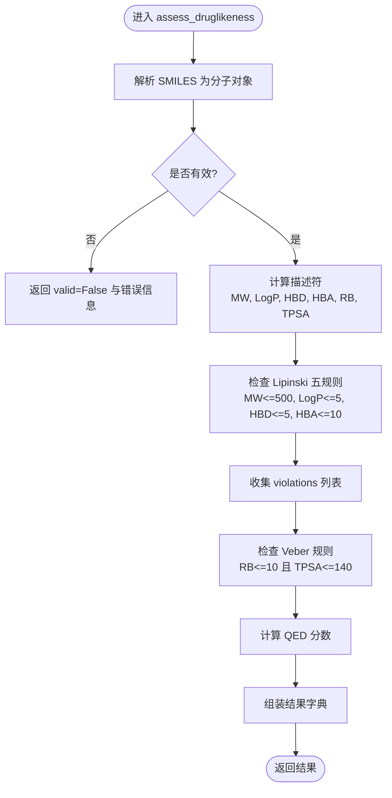
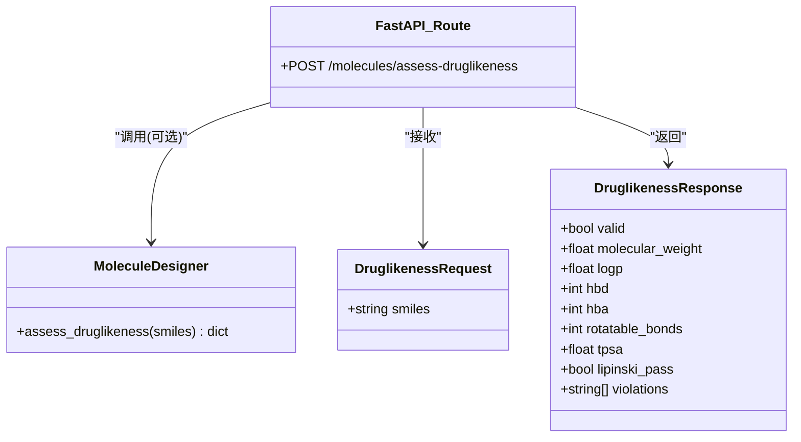
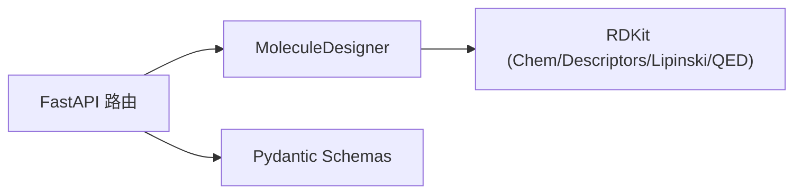

# 类药性评估

<cite>
**本文引用的文件**   
- [molecule_designer.py](file://backend/app/services/analyzer/molecule_designer.py)
- [molecules.py](file://backend/app/api/v1/molecules.py)
- [molecule.py](file://backend/app/schemas/molecule.py)
- [test_molecule_designer.py](file://tests/test_molecule_designer.py)
</cite>

## 目录
1. [简介](#简介)
2. [项目结构](#项目结构)
3. [核心组件](#核心组件)
4. [架构总览](#架构总览)
5. [详细组件分析](#详细组件分析)
6. [依赖关系分析](#依赖关系分析)
7. [性能与可扩展性](#性能与可扩展性)
8. [使用示例](#使用示例)
9. [结果解读指南](#结果解读指南)
10. [常见问题与排障](#常见问题与排障)
11. [结论](#结论)

## 简介
本文件面向药物化学与计算化学工程师，系统化阐述“类药性评估”模块的实现与使用方法。重点覆盖：
- assess_druglikeness 方法的实现架构与调用链路
- Lipinski 五规则、Veber 规则、QED 药物相似性评分的核心算法与阈值依据
- 分子权重、LogP、氢键供体/受体数量、可旋转键数、拓扑极性表面积等关键参数的计算方法
- 评估结果字段含义与解读（含 violations 与 qed_score）
- 实际使用示例与常见问题解决方案

## 项目结构
类药性评估能力由服务层与 API 层共同提供：
- 服务层：MoleculeDesigner.assess_druglikeness 封装 RDKit 计算并输出结构化结果
- API 层：FastAPI 路由暴露 /molecules/assess-druglikeness 接口，统一入参与响应格式
- Schema 层：Pydantic 模型定义请求/响应结构与字段说明
- 测试层：单元测试覆盖典型场景（有效/无效 SMILES、Lipinski 通过/失败）

图表来源
- [molecules.py:95-106](file://backend/app/api/v1/molecules.py#L95-L106)
- [molecule_designer.py:71-134](file://backend/app/services/analyzer/molecule_designer.py#L71-L134)

章节来源
- [molecules.py:1-12](file://backend/app/api/v1/molecules.py#L1-L12)
- [molecule_designer.py:1-10](file://backend/app/services/analyzer/molecule_designer.py#L1-L10)

## 核心组件
- MoleculeDesigner.assess_druglikeness
  - 输入：SMILES 字符串
  - 输出：包含分子基本性质、规则判定与 QED 分数的结构化结果
  - 关键点：惰性加载 RDKit；对无效 SMILES 返回 valid=False；按 Lipinski/Veber 规则生成 violations；计算 QED.qed(mol)
- FastAPI 路由 assess_druglikeness
  - 接收 DruglikenessRequest，调用内部 _assess_druglikeness（基于 RDKit），返回 ApiResponse[DruglikenessResponse]
- Pydantic Schemas
  - DruglikenessRequest/DruglikenessResponse 明确字段类型与说明，便于前后端契约一致

章节来源
- [molecule_designer.py:71-134](file://backend/app/services/analyzer/molecule_designer.py#L71-L134)
- [molecules.py:47-106](file://backend/app/api/v1/molecules.py#L47-L106)
- [molecule.py:36-54](file://backend/app/schemas/molecule.py#L36-L54)

## 架构总览
从请求到结果的端到端流程如下：

图表来源
- [molecules.py:95-106](file://backend/app/api/v1/molecules.py#L95-L106)
- [molecule_designer.py:71-134](file://backend/app/services/analyzer/molecule_designer.py#L71-L134)

## 详细组件分析

### assess_druglikeness 方法实现
- 解析与校验
  - 将 SMILES 解析为 RDKit 分子对象；若解析失败，直接返回 valid=False 与错误信息
- 描述符计算
  - 分子权重：Descriptors.MolWt
  - LogP：Descriptors.MolLogP（或 Crippen.MolLogP，取决于调用路径）
  - 氢键供体/受体：Lipinski.NumHDonors / NumHAcceptors
  - 可旋转键数：Lipinski.NumRotatableBonds
  - 拓扑极性表面积：Descriptors.TPSA
- 规则判定
  - Lipinski 五规则：MW≤500、LogP≤5、HBD≤5、HBA≤10；任一违反即记录至 violations
  - Veber 规则：rotatable_bonds≤10 且 TPSA≤140
- QED 评分
  - QED.qed(mol) 返回 0~1 的连续值，越接近 1 表示更接近已知口服药物的综合属性分布

图表来源
- [molecule_designer.py:71-134](file://backend/app/services/analyzer/molecule_designer.py#L71-L134)

章节来源
- [molecule_designer.py:71-134](file://backend/app/services/analyzer/molecule_designer.py#L71-L134)

### API 路由与数据契约
- 路由 /molecules/assess-druglikeness
  - 入参：DruglikenessRequest.smiles
  - 出参：ApiResponse.data=DruglikenessResponse
- 内部 _assess_druglikeness
  - 直接基于 RDKit 计算并返回 DruglikenessResponse（不含 QED，侧重 Lipinski）
- 注意差异
  - 服务层 assess_druglikeness 返回包含 QED 与 passes_veber 的完整结果
  - API 内部 _assess_druglikeness 返回不包含 QED 的轻量结果（用于快速 Lipinski 检查）

图表来源
- [molecule.py:36-54](file://backend/app/schemas/molecule.py#L36-L54)
- [molecules.py:95-106](file://backend/app/api/v1/molecules.py#L95-L106)
- [molecule_designer.py:71-134](file://backend/app/services/analyzer/molecule_designer.py#L71-L134)

章节来源
- [molecules.py:95-106](file://backend/app/api/v1/molecules.py#L95-L106)
- [molecule.py:36-54](file://backend/app/schemas/molecule.py#L36-L54)

### 参数计算方法与生物学意义
- 分子权重（MW）
  - 计算：原子质量总和
  - 阈值依据：Lipinski MW≤500，过大影响膜渗透性与溶解度
- LogP（辛醇/水分配系数）
  - 计算：经验/半经验方法估计脂溶性
  - 阈值依据：LogP≤5，过高降低水溶性与生物利用度
- 氢键供体（HBD）/受体（HBA）
  - 计算：统计可形成氢键的供体/受体位点
  - 阈值依据：HBD≤5、HBA≤10，过多会显著降低渗透性
- 可旋转键数（RB）
  - 计算：非环单键中可自由旋转的数量
  - 阈值依据：Veber RB≤10，过多降低构象刚性，影响结合熵
- 拓扑极性表面积（TPSA）
  - 计算：极性原子表面积的加和近似
  - 阈值依据：Veber TPSA≤140，过高不利于跨膜转运
- QED 分数
  - 计算：基于多属性分布的综合评分（0~1）
  - 意义：越高表示越接近已知口服小分子药物的属性空间

章节来源
- [molecule_designer.py:94-119](file://backend/app/services/analyzer/molecule_designer.py#L94-L119)

### 规则与阈值的设定依据
- Lipinski 五规则
  - 来源于大量口服活性小分子的统计经验，旨在筛选具备良好吸收潜力的分子
- Veber 规则
  - 针对口服生物利用度的补充约束，强调柔性与极性的平衡
- QED
  - 定量评估分子在多维属性空间中与已知药物的相似度，作为整体“类药性”指标

章节来源
- [molecule_designer.py:101-119](file://backend/app/services/analyzer/molecule_designer.py#L101-L119)

## 依赖关系分析
- 外部依赖
  - RDKit：分子解析、描述符计算、QED 评分
- 内部耦合
  - API 路由与服务层解耦，Schema 层统一数据契约
  - 服务层支持惰性加载 RDKit，避免未安装时启动失败

图表来源
- [molecules.py:95-106](file://backend/app/api/v1/molecules.py#L95-L106)
- [molecule_designer.py:34-50](file://backend/app/services/analyzer/molecule_designer.py#L34-L50)
- [molecule.py:36-54](file://backend/app/schemas/molecule.py#L36-L54)

章节来源
- [molecule_designer.py:34-50](file://backend/app/services/analyzer/molecule_designer.py#L34-L50)
- [molecules.py:95-106](file://backend/app/api/v1/molecules.py#L95-L106)

## 性能与可扩展性
- 惰性加载 RDKit：仅在首次需要时导入，减少冷启动开销
- 规则计算复杂度低：描述符计算为 O(N) 级别（N 为原子/键数），适合批量处理
- 可扩展方向
  - 增加更多 ADMET 预测任务（如 BBB、hERG）
  - 引入更复杂的生成式设计与优化策略
  - 缓存常用 SMILES 的描述符以加速重复评估

[本节为通用建议，不直接分析具体文件]

## 使用示例
以下示例展示如何调用类药性评估接口与解读返回结果。为避免泄露代码内容，仅给出调用要点与字段说明。

- 调用方式
  - HTTP POST /molecules/assess-druglikeness
  - 请求体包含 smiles 字段
  - 响应体包含 data=DruglikenessResponse
- 关键字段
  - valid：是否为有效分子
  - molecular_weight/logp/hbd/hba/rotatable_bonds/tpsa：基础描述符
  - lipinski_pass：是否通过 Lipinski 五规则
  - violations：违反的规则条目（如 mw>500、logp>5 等）
  - 若通过服务层方法，还可获得 passes_veber 与 qed 分数

章节来源
- [molecules.py:95-106](file://backend/app/api/v1/molecules.py#L95-L106)
- [molecule.py:36-54](file://backend/app/schemas/molecule.py#L36-L54)
- [test_molecule_designer.py:29-68](file://tests/test_molecule_designer.py#L29-L68)

## 结果解读指南
- 如何通过 violations 识别问题分子
  - 若 violations 非空，逐条查看违反的具体规则（例如 mw>500、logp>5、hbd>5、hba>10），据此进行结构修饰（减小分子量、降低脂溶性、减少氢键位点等）
- 如何根据 qed_score 判断药物潜力
  - QED 分数越接近 1，表示该分子在多维属性上更接近已知口服药物集合；通常 >0.5 具备一定潜力，>0.7 较为理想
- 其他辅助指标
  - passes_veber：若为 False，需关注可旋转键数与 TPSA，适当提高刚性或降低极性
  - 口服生物利用度与 BBB 通透性（在扩展预测中）：可作为后续筛选参考

章节来源
- [molecule_designer.py:101-134](file://backend/app/services/analyzer/molecule_designer.py#L101-L134)

## 常见问题与排障
- RDKit 未安装
  - 现象：API 抛出验证错误或返回降级响应
  - 解决：安装 rdkit 后重启服务；或使用仅提供 Lipinski 的快速路径（内部 _assess_druglikeness）
- 无效 SMILES
  - 现象：valid=False，error 提示无效 SMILES
  - 解决：检查 SMILES 语法与价态合理性
- 大分子或高脂溶性导致 Lipinski 失败
  - 现象：violations 包含 mw>500 或 logp>5
  - 解决：削减片段、引入极性基团、降低疏水性
- QED 计算异常
  - 现象：qed 为 None
  - 解决：确认 RDKit 版本兼容；必要时回退到规则判定

章节来源
- [molecules.py:47-63](file://backend/app/api/v1/molecules.py#L47-L63)
- [molecule_designer.py:86-92](file://backend/app/services/analyzer/molecule_designer.py#L86-L92)
- [molecule_designer.py:116-119](file://backend/app/services/analyzer/molecule_designer.py#L116-L119)

## 结论
本模块以 RDKit 为核心，实现了稳健的类药性评估流水线：从 SMILES 解析、描述符计算、规则判定到 QED 评分，形成完整的评估闭环。通过清晰的 API 契约与详尽的结果字段，用户可快速定位问题分子并进行有针对性的结构优化。未来可在保持现有稳定性的基础上，进一步集成更多 ADMET 预测与生成式设计能力，提升整体研发效率。