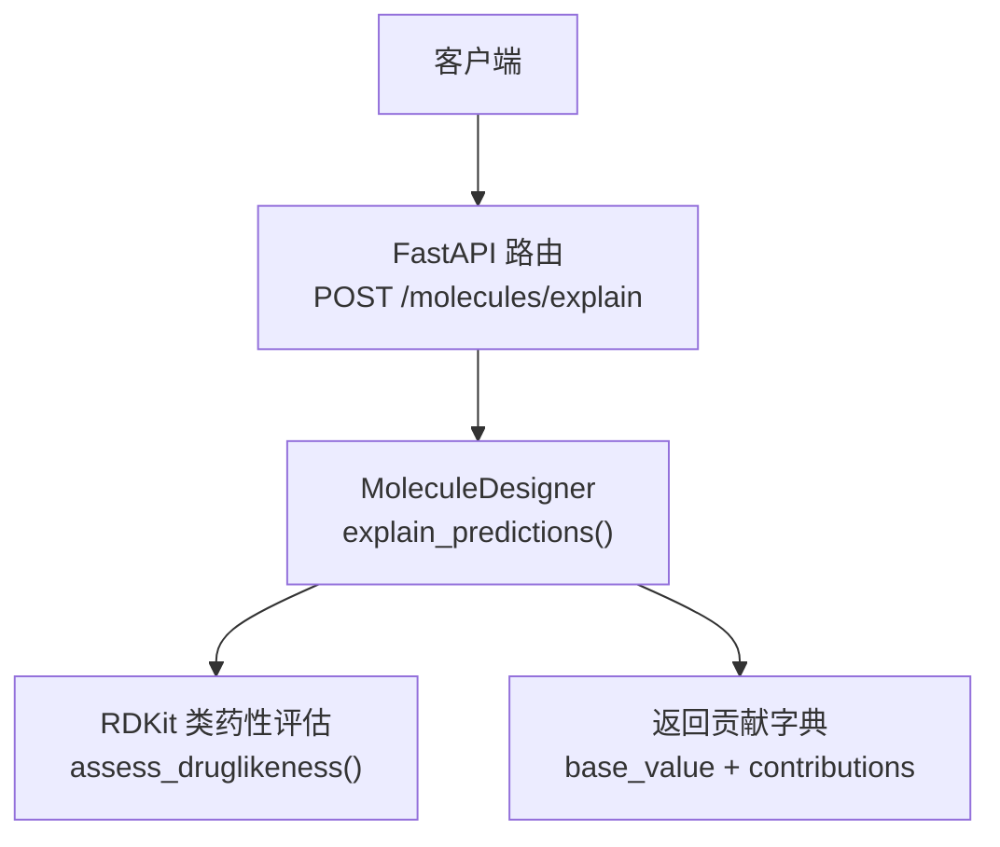
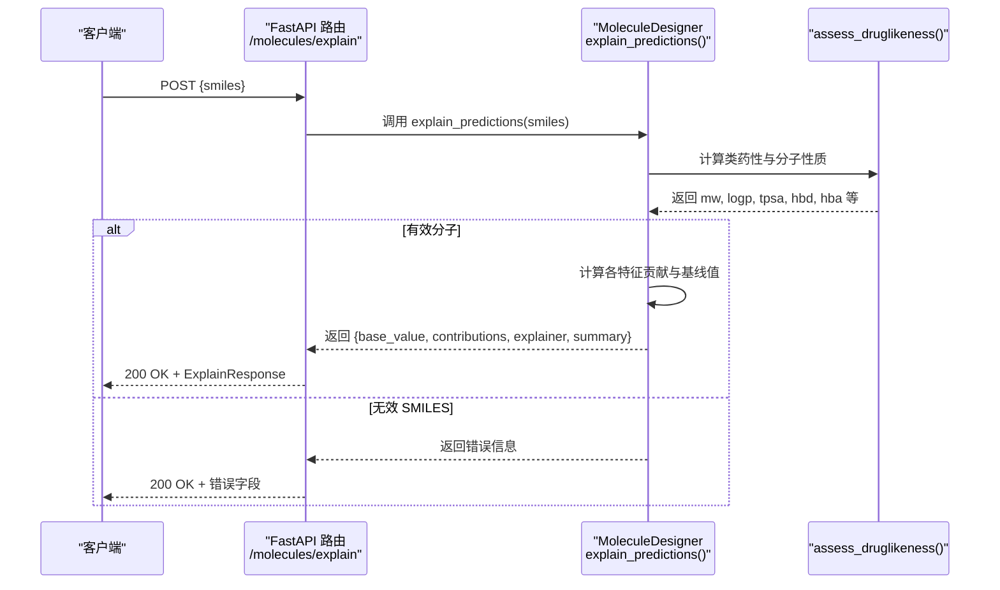
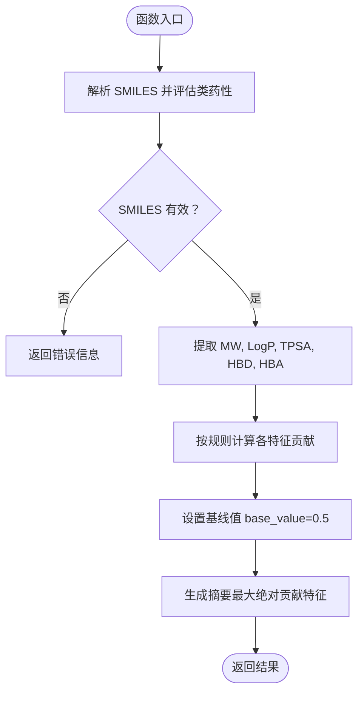
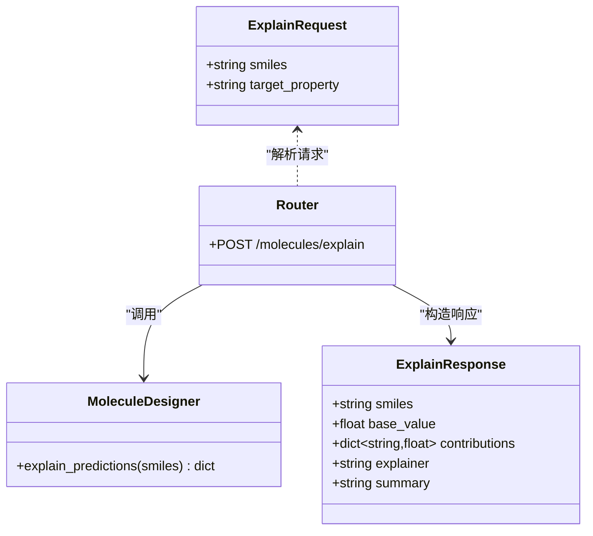
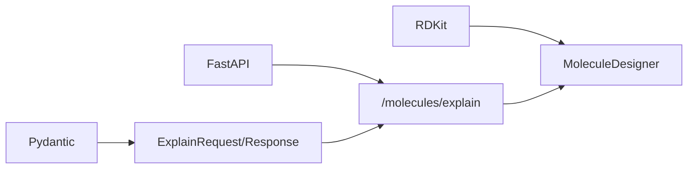

# 预测可解释性

<cite>
**本文引用的文件**   
- [molecule_designer.py](file://backend/app/services/analyzer/molecule_designer.py)
- [molecules.py](file://backend/app/api/v1/molecules.py)
- [molecule.py](file://backend/app/schemas/molecule.py)
- [test_p2_endpoints.py](file://scripts/test_p2_endpoints.py)
</cite>

## 目录
1. [引言](#引言)
2. [项目结构](#项目结构)
3. [核心组件](#核心组件)
4. [架构总览](#架构总览)
5. [详细组件分析](#详细组件分析)
6. [依赖关系分析](#依赖关系分析)
7. [性能与可扩展性](#性能与可扩展性)
8. [故障排查指南](#故障排查指南)
9. [结论](#结论)
10. [附录：API 契约与数据结构](#附录api-契约与数据结构)

## 引言
本文件面向“预测可解释性”能力，聚焦 explain_predictions 方法的实现与使用。该功能采用 SHAP 风格的可解释性思路，通过线性近似对分子特征贡献进行归因，输出每个特征的贡献值、方向与基线值，帮助研发人员理解并指导分子优化设计。文档涵盖：
- 方法实现与数据流
- 特征重要性评估与贡献方向判定
- 基线值设定与线性近似逻辑
- 分子权重、LogP、TPSA、氢键数量等关键特征的贡献计算
- 可解释性结果的数据结构与可视化建议
- 决策支持应用、特征工程指导、模型调试方法与验证策略
- 实际案例分析（基于现有端点与测试脚本）

## 项目结构
与预测可解释性相关的代码主要分布在以下位置：
- 服务层：MoleculeDesigner.explain_predictions 提供可解释性核心逻辑
- API 层：/molecules/explain 暴露可解释性接口
- Schema 层：ExplainRequest / ExplainResponse 定义请求与响应结构
- 集成测试：test_p2_endpoints.py 包含对 /molecules/explain 的端到端调用示例

图表来源
- [molecules.py:357-390](file://backend/app/api/v1/molecules.py#L357-L390)
- [molecule_designer.py:295-331](file://backend/app/services/analyzer/molecule_designer.py#L295-L331)

章节来源
- [molecule_designer.py:295-331](file://backend/app/services/analyzer/molecule_designer.py#L295-L331)
- [molecules.py:357-390](file://backend/app/api/v1/molecules.py#L357-L390)
- [molecule.py:150-168](file://backend/app/schemas/molecule.py#L150-L168)

## 核心组件
- MoleculeDesigner.explain_predictions：SHAP 风格的线性近似可解释性实现，输入 SMILES，输出 base_value 与各特征贡献。
- FastAPI 路由 /molecules/explain：封装请求参数，调用服务层，返回结构化响应。
- ExplainRequest / ExplainResponse：Pydantic 模型，约束输入输出字段类型与描述。

章节来源
- [molecule_designer.py:295-331](file://backend/app/services/analyzer/molecule_designer.py#L295-L331)
- [molecules.py:357-390](file://backend/app/api/v1/molecules.py#L357-L390)
- [molecule.py:150-168](file://backend/app/schemas/molecule.py#L150-L168)

## 架构总览
下图展示从 HTTP 请求到可解释性输出的完整流程，包括错误处理与降级路径。

图表来源
- [molecules.py:357-390](file://backend/app/api/v1/molecules.py#L357-L390)
- [molecule_designer.py:295-331](file://backend/app/services/analyzer/molecule_designer.py#L295-L331)

## 详细组件分析

### 可解释性算法与数据流
explain_predictions 的核心步骤如下：
- 输入校验与类药性评估：调用 assess_druglikeness 获取分子基本属性（MW、LogP、TPSA、HBD、HBA）。
- 线性近似贡献计算：为每个特征计算相对于“最优阈值”的偏离度，映射为 -1 到 +1 的贡献值（正有利、负不利）。
- 基线值设定：固定 base_value=0.5，作为预测参考点。
- 输出汇总：返回 smiles、base_value、contributions、explainer、summary。

图表来源
- [molecule_designer.py:295-331](file://backend/app/services/analyzer/molecule_designer.py#L295-L331)

章节来源
- [molecule_designer.py:295-331](file://backend/app/services/analyzer/molecule_designer.py#L295-L331)

### 特征贡献计算逻辑
当前实现采用“规则代理”的线性近似，针对药物相似性目标，将各特征相对最优阈值的超出部分按比例折算为贡献值。具体逻辑要点：
- molecular_weight：以 350 为最优，超过则产生负贡献；比例因子 150。
- logp：以 3 为最优，超过则产生负贡献；比例因子 2。
- tpsa：以 60 为最优，超过则产生负贡献；比例因子 80。
- hbd：以 2 为最优，超过则产生负贡献；比例因子 3。
- hba：以 5 为最优，超过则产生负贡献；比例因子 5。

贡献方向约定：正值表示对目标有利，负值表示不利；当特征未超过阈值时贡献为 0。

章节来源
- [molecule_designer.py:308-324](file://backend/app/services/analyzer/molecule_designer.py#L308-L324)

### 基线值设定与线性近似
- 基线值 base_value=0.5：作为预测参考点，便于在可视化中直观显示各特征对最终预测的偏移。
- 线性近似：贡献值由特征偏离最优阈值的程度线性缩放得到，体现“简单可解释”的设计原则。

章节来源
- [molecule_designer.py:325-331](file://backend/app/services/analyzer/molecule_designer.py#L325-L331)

### API 层与数据结构
- 请求体：ExplainRequest 包含 smiles 与可选 target_property（默认 druglikeness）。
- 响应体：ExplainResponse 包含 smiles、base_value、contributions、explainer、summary。
- 路由：/molecules/explain 接收请求，调用 MoleculeDesigner.explain_predictions，构造 ApiResponse 返回。

图表来源
- [molecule.py:150-168](file://backend/app/schemas/molecule.py#L150-L168)
- [molecules.py:357-390](file://backend/app/api/v1/molecules.py#L357-L390)
- [molecule_designer.py:295-331](file://backend/app/services/analyzer/molecule_designer.py#L295-L331)

章节来源
- [molecule.py:150-168](file://backend/app/schemas/molecule.py#L150-L168)
- [molecules.py:357-390](file://backend/app/api/v1/molecules.py#L357-L390)

### 端到端调用示例
测试脚本展示了如何调用 /molecules/explain 并检查返回字段（如 explainer、summary），可用于快速验证可解释性功能是否正常工作。

章节来源
- [test_p2_endpoints.py:149-164](file://scripts/test_p2_endpoints.py#L149-L164)

## 依赖关系分析
- 外部依赖：
  - RDKit：用于分子解析与类药性评估（MW、LogP、TPSA、HBD、HBA 等）。
  - FastAPI：提供 REST 接口。
  - Pydantic：用于请求/响应模型校验。
- 内部依赖：
  - MoleculeDesigner.explain_predictions 依赖 assess_druglikeness 提供的分子属性。
  - API 路由依赖 ExplainRequest/ExplainResponse 进行序列化与校验。

图表来源
- [molecule_designer.py:295-331](file://backend/app/services/analyzer/molecule_designer.py#L295-L331)
- [molecules.py:357-390](file://backend/app/api/v1/molecules.py#L357-L390)
- [molecule.py:150-168](file://backend/app/schemas/molecule.py#L150-L168)

章节来源
- [molecule_designer.py:295-331](file://backend/app/services/analyzer/molecule_designer.py#L295-L331)
- [molecules.py:357-390](file://backend/app/api/v1/molecules.py#L357-L390)
- [molecule.py:150-168](file://backend/app/schemas/molecule.py#L150-L168)

## 性能与可扩展性
- 当前实现为轻量级规则代理，计算开销低，适合快速迭代与前端交互。
- 可扩展方向：
  - 替换为真实模型（如 DeepChem 或自定义图神经网络）后，可用 SHAP/LIME 等工具进行更精确的特征归因。
  - 引入多任务目标（毒性、溶解度、BBB 通透性等），分别计算贡献并聚合。
  - 增加特征交互项与非线性近似，提升解释精度。

[本节为通用建议，不直接分析具体文件]

## 故障排查指南
- 常见错误：
  - 无效 SMILES：返回 error 字段，需检查输入字符串是否符合化学规范。
  - RDKit 未安装：API 层可能抛出 ValidationError，需安装 rdkit 以启用完整功能。
- 定位方法：
  - 查看 API 返回的 meta.error 与 data.error 字段。
  - 使用测试脚本 test_p2_endpoints.py 快速复现问题。

章节来源
- [molecules.py:386-390](file://backend/app/api/v1/molecules.py#L386-L390)
- [test_p2_endpoints.py:149-164](file://scripts/test_p2_endpoints.py#L149-L164)

## 结论
predict 可解释性模块在当前阶段提供了基于规则的线性近似解释，能够直观展示分子权重、LogP、TPSA、氢键数量等特征对药物相似性的贡献方向与大小。配合清晰的 API 契约与测试用例，便于快速集成与扩展。后续可结合真实模型与标准 XAI 工具进一步提升解释质量与可信度。

[本节为总结性内容，不直接分析具体文件]

## 附录：API 契约与数据结构

### 请求与响应字段说明
- ExplainRequest
  - smiles：分子 SMILES 字符串（必填）
  - target_property：解释的目标性质（可选，默认 druglikeness）
- ExplainResponse
  - smiles：输入的 SMILES
  - base_value：基线值（当前固定为 0.5）
  - contributions：特征贡献字典，键为特征名，值为贡献分数（-1 到 +1）
  - explainer：解释器标识（rule-based-shap-proxy）
  - summary：简要摘要（例如“主要影响因素: xxx”）

章节来源
- [molecule.py:150-168](file://backend/app/schemas/molecule.py#L150-L168)
- [molecule_designer.py:325-331](file://backend/app/services/analyzer/molecule_designer.py#L325-L331)

### 可视化建议
- 条形图：按贡献绝对值排序，红色表示不利，绿色表示有利。
- 瀑布图：从 base_value 开始，逐特征叠加贡献，展示最终预测偏移。
- 热力图：批量分子对比，行代表分子，列代表特征，颜色深浅表示贡献强度。

[本节为概念性建议，不直接分析具体文件]

### 决策支持与优化指导
- 若某特征贡献显著为负（如 LogP 过高），优先考虑降低脂溶性（减少疏水片段）。
- 若 MW 贡献为负，考虑缩小分子量（去除冗余环或长链）。
- 若 TPSA 贡献为负，适当调整极性基团以提升渗透性。
- 结合 QED 与 Lipinski/Veber 规则，综合权衡多目标优化。

[本节为概念性建议，不直接分析具体文件]

### 特征工程指导
- 优先保留与药效和 ADMET 强相关的物理化学特征（MW、LogP、TPSA、HBD/HBA）。
- 可增加拓扑指纹或子结构计数，但需注意解释成本与过拟合风险。
- 对非线性关系较强的特征，建议使用树模型或核方法并结合 SHAP 进行归因。

[本节为概念性建议，不直接分析具体文件]

### 模型调试与验证策略
- 单元测试：覆盖有效/无效 SMILES、边界条件（大分子、高 LogP 等）。
- 回归测试：确保贡献计算稳定，避免随机性或环境差异导致结果波动。
- 基准对比：与真实模型（DeepChem/NN）的 SHAP 结果进行一致性检验。

章节来源
- [test_molecule_designer.py:29-68](file://tests/test_molecule_designer.py#L29-L68)

### 实际案例分析
- 使用测试脚本调用 /molecules/explain，观察返回的 explainer 与 summary，确认功能正常。
- 针对特定分子（如阿司匹林、布洛芬片段），比较不同特征的贡献分布，指导结构修饰。

章节来源
- [test_p2_endpoints.py:149-164](file://scripts/test_p2_endpoints.py#L149-L164)
- [test_molecule_designer.py:29-68](file://tests/test_molecule_designer.py#L29-L68)