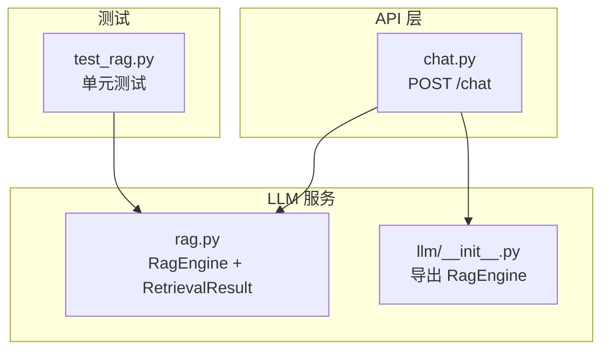
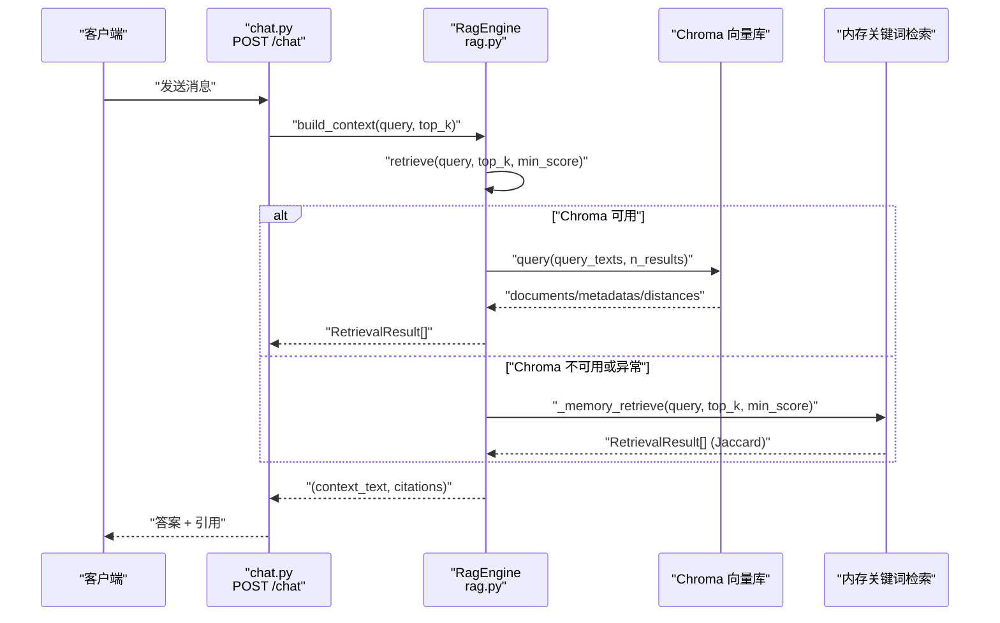
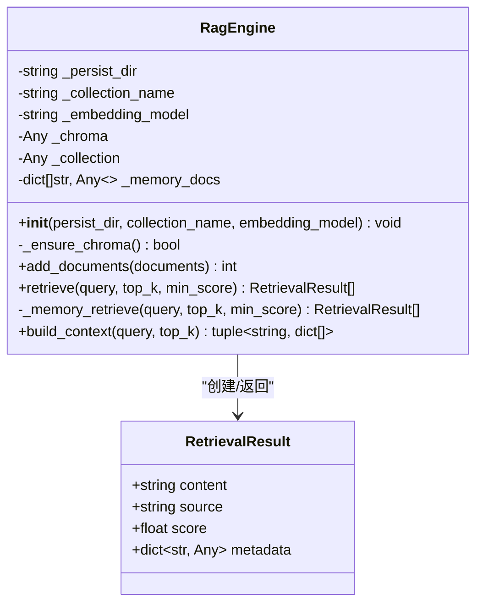
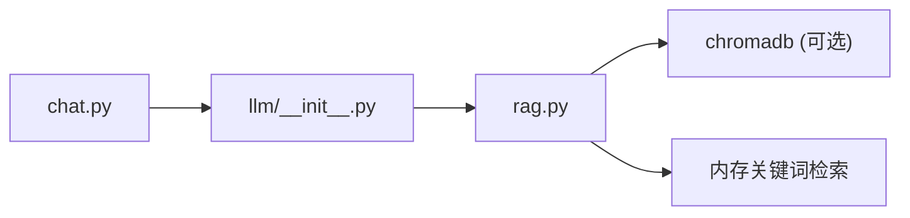

# RAG检索增强生成系统

<cite>
**本文引用的文件**   
- [rag.py](file://backend/app/services/llm/rag.py)
- [chat.py](file://backend/app/api/v1/chat.py)
- [__init__.py](file://backend/app/services/llm/__init__.py)
- [test_rag.py](file://tests/test_rag.py)
</cite>

## 目录
1. [简介](#简介)
2. [项目结构](#项目结构)
3. [核心组件](#核心组件)
4. [架构总览](#架构总览)
5. [详细组件分析](#详细组件分析)
6. [依赖关系分析](#依赖关系分析)
7. [性能考量](#性能考量)
8. [故障排查指南](#故障排查指南)
9. [结论](#结论)
10. [附录：使用示例与最佳实践](#附录使用示例与最佳实践)

## 简介
本技术文档聚焦于RAG（检索增强生成）系统的实现，围绕 RagEngine 的核心架构展开，涵盖以下关键主题：
- Chroma 向量数据库集成与自动降级机制
- 文档入库流程（add_documents）：UUID 生成、元数据处理、批量添加优化
- 检索逻辑（retrieve）：Chroma 查询、相似度计算、阈值过滤、降级到内存关键词检索
- 上下文构建（build_context）：结果格式化、引用信息生成、上下文注入策略
- RetrievalResult 数据模型设计与使用方式
- 内存关键词检索的 Jaccard 相似度实现
- 实际使用示例与性能优化建议

## 项目结构
RAG 相关代码位于后端服务模块中，API 层通过聊天接口调用 RAG 能力。

图表来源
- [chat.py:30-157](file://backend/app/api/v1/chat.py#L30-L157)
- [rag.py:35-237](file://backend/app/services/llm/rag.py#L35-L237)
- [__init__.py:1-9](file://backend/app/services/llm/__init__.py#L1-L9)
- [test_rag.py:1-207](file://tests/test_rag.py#L1-L207)

章节来源
- [chat.py:30-157](file://backend/app/api/v1/chat.py#L30-L157)
- [rag.py:35-237](file://backend/app/services/llm/rag.py#L35-L237)
- [__init__.py:1-9](file://backend/app/services/llm/__init__.py#L1-L9)
- [test_rag.py:1-207](file://tests/test_rag.py#L1-L207)

## 核心组件
- RetrievalResult：单条检索结果的轻量数据类，包含内容、来源、相似度分数与附加元数据。
- RagEngine：RAG 引擎主类，封装了 Chroma 集成、惰性初始化、文档入库、检索、上下文构建以及内存降级检索。

章节来源
- [rag.py:18-33](file://backend/app/services/llm/rag.py#L18-L33)
- [rag.py:35-237](file://backend/app/services/llm/rag.py#L35-L237)

## 架构总览
RAG 在 API 层被调用，负责将用户问题转换为结构化上下文并返回给 LLM；当外部依赖不可用时，系统自动降级为内存关键词检索，保证可用性。

图表来源
- [chat.py:61-157](file://backend/app/api/v1/chat.py#L61-L157)
- [rag.py:126-237](file://backend/app/services/llm/rag.py#L126-L237)

## 详细组件分析

### RetrievalResult 数据模型
- 字段说明
  - content：文本内容
  - source：来源标识（如“pubmed:12345678”）
  - score：相似度分数（0-1，越大越相似）
  - metadata：附加元数据（字典）
- 设计要点
  - 使用 dataclass 简化构造与比较
  - 作为检索结果的标准载体，贯穿 retrieve 与 build_context 流程

章节来源
- [rag.py:18-33](file://backend/app/services/llm/rag.py#L18-L33)
- [test_rag.py:10-33](file://tests/test_rag.py#L10-L33)

### RagEngine 类图

图表来源
- [rag.py:18-33](file://backend/app/services/llm/rag.py#L18-L33)
- [rag.py:35-237](file://backend/app/services/llm/rag.py#L35-L237)

#### add_documents 方法：文档入库流程
- 输入格式
  - documents：列表，每项为 dict，至少包含 content 字段，可选 source 字段
- 处理步骤
  - 尝试确保 Chroma 可用（惰性初始化）
  - 若可用：
    - 为每条文档生成 UUID 作为唯一 id
    - 提取 contents 与 metadatas（source 默认 "unknown"）
    - 批量调用集合 add(ids, documents, metadatas)
  - 始终同步到内存备份（_memory_docs），用于降级检索
  - 返回成功添加的文档数
- 关键点
  - 批量写入提升吞吐
  - 失败时记录错误日志但不中断内存同步
  - 默认 source 处理保障下游引用完整性

章节来源
- [rag.py:90-124](file://backend/app/services/llm/rag.py#L90-L124)
- [test_rag.py:97-110](file://tests/test_rag.py#L97-L110)

#### retrieve 方法：检索逻辑
- 参数
  - query：查询文本
  - top_k：返回条数
  - min_score：最小相似度阈值
- 处理步骤
  - 优先走 Chroma 查询：
    - 调用集合 query(query_texts=[query], n_results=top_k)
    - 解析返回的 documents、metadatas、distances
    - 将距离转换为相似度：score = max(0.0, 1.0 - dist)
    - 按 min_score 过滤，构造 RetrievalResult 列表
  - 若 Chroma 不可用或异常：
    - 降级到内存关键词检索（Jaccard 相似度）
- 输出
  - 按相似度降序的 RetrievalResult 列表

章节来源
- [rag.py:126-169](file://backend/app/services/llm/rag.py#L126-L169)

#### _memory_retrieve 方法：内存关键词检索（Jaccard）
- 算法
  - 将 query 与文档内容分词为小写词集
  - 计算交集与并集大小，得到 Jaccard 相似度
  - 按 min_score 过滤，排序后取 top_k
- 适用场景
  - Chroma 未安装或初始化失败时的降级路径
  - 快速验证与本地开发环境

章节来源
- [rag.py:171-209](file://backend/app/services/llm/rag.py#L171-L209)
- [test_rag.py:145-165](file://tests/test_rag.py#L145-L165)

#### build_context 方法：上下文构建过程
- 功能
  - 调用 retrieve 获取检索结果
  - 若无结果，返回空上下文与空引用
  - 否则：
    - 格式化每个结果为带编号、来源与相似度的段落
    - 生成 citations 列表（id、source、score）
    - 拼接为 context_text 返回
- 用途
  - 作为 LLM 提示词的参考信息注入
  - 提供可追溯的引用信息

章节来源
- [rag.py:211-237](file://backend/app/services/llm/rag.py#L211-L237)
- [test_rag.py:178-207](file://tests/test_rag.py#L178-L207)

#### _ensure_chroma 方法：惰性初始化与降级判断
- 行为
  - 若已初始化直接返回 True
  - 尝试导入 chromadb 并创建 PersistentClient
  - 获取或创建集合，设置余弦空间（hnsw:space=cosine）
  - 捕获异常并记录警告，返回 False 触发降级

章节来源
- [rag.py:62-88](file://backend/app/services/llm/rag.py#L62-L88)

### API 集成：聊天端点中的 RAG 使用
- 流程
  - 安全护栏检查输入
  - 调用 RagEngine.build_context 构建上下文与引用
  - 根据分析层级选择 top_k（quick 为 5，deep 为 20）
  - 将上下文注入用户提示词，调用 LLMRouter 生成回答
  - 输出护栏检查，返回答案与引用
  - 若 LLM 不可用，降级返回 RAG 检索结果摘要
- 降级策略
  - 当 LLM 调用失败时，仍返回基于 RAG 的结果，并在 meta 中标记 degraded

章节来源
- [chat.py:30-157](file://backend/app/api/v1/chat.py#L30-L157)

## 依赖关系分析
- 模块导出
  - llm/__init__.py 显式导出 RagEngine，便于上层统一导入
- 运行时依赖
  - chromadb：可选依赖，缺失时自动降级
  - loguru：日志记录
- 耦合与内聚
  - RagEngine 内部聚合 Chroma 客户端与集合对象，降低外部耦合
  - RetrievalResult 作为稳定契约，解耦检索与上下文构建

图表来源
- [__init__.py:1-9](file://backend/app/services/llm/__init__.py#L1-L9)
- [rag.py:62-88](file://backend/app/services/llm/rag.py#L62-L88)
- [chat.py:61-157](file://backend/app/api/v1/chat.py#L61-L157)

章节来源
- [__init__.py:1-9](file://backend/app/services/llm/__init__.py#L1-L9)
- [rag.py:62-88](file://backend/app/services/llm/rag.py#L62-L88)
- [chat.py:61-157](file://backend/app/api/v1/chat.py#L61-L157)

## 性能考量
- 批量写入
  - add_documents 使用批量 add，减少网络往返与序列化开销
- 惰性初始化
  - _ensure_chroma 仅在首次需要时初始化，避免启动成本
- 相似度转换与阈值过滤
  - 将距离转为相似度并进行阈值过滤，减少无效结果进入上下文
- 内存降级
  - 内存模式无外部 IO，适合开发与调试；生产应启用 Chroma
- 提示词长度控制
  - 通过 top_k 与 min_score 控制上下文规模，避免超出 LLM 上下文窗口

[本节为通用指导，不直接分析具体文件]

## 故障排查指南
- 常见问题
  - chromadb 未安装：系统将降级为内存关键词检索，并记录警告
  - Chroma 初始化失败：记录警告并回退到内存检索
  - 检索结果为空：检查 min_score 阈值是否过高或文档是否已入库
- 定位手段
  - 查看日志中的警告与错误信息
  - 确认持久化目录与集合名配置
  - 使用测试用例验证内存模式下的检索行为

章节来源
- [rag.py:62-88](file://backend/app/services/llm/rag.py#L62-L88)
- [rag.py:166-169](file://backend/app/services/llm/rag.py#L166-L169)
- [test_rag.py:69-84](file://tests/test_rag.py#L69-L84)

## 结论
RagEngine 以简洁清晰的接口实现了 RAG 的核心能力：
- 通过 Chroma 进行向量检索，具备完善的降级机制
- 提供稳定的 RetrievalResult 数据模型与上下文构建工具
- 在 API 层无缝集成，支持不同分析层级与引用标注
- 在开发与生产环境中均具备良好的可用性与可扩展性

[本节为总结性内容，不直接分析具体文件]

## 附录：使用示例与最佳实践

### 基本用法（内存模式）
- 初始化引擎（强制 chromadb 不可用，走内存模式）
- 添加文档（content 必填，source 可选）
- 检索并构建上下文
- 将上下文注入提示词供 LLM 使用

章节来源
- [test_rag.py:86-165](file://tests/test_rag.py#L86-L165)
- [test_rag.py:178-207](file://tests/test_rag.py#L178-L207)

### 生产环境建议
- 启用 Chroma 持久化存储，合理设置集合名与嵌入模型
- 调整 top_k 与 min_score 平衡召回率与上下文长度
- 监控日志，关注降级告警与异常堆栈
- 定期评估与更新知识库，保持检索质量

[本节为通用指导，不直接分析具体文件]