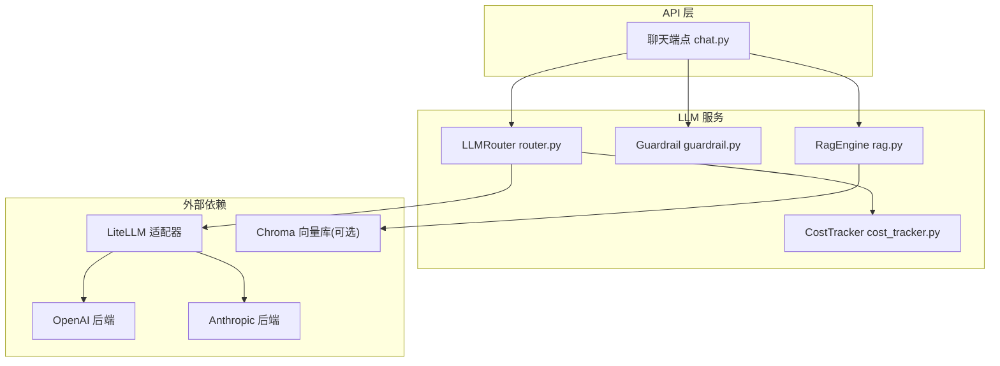
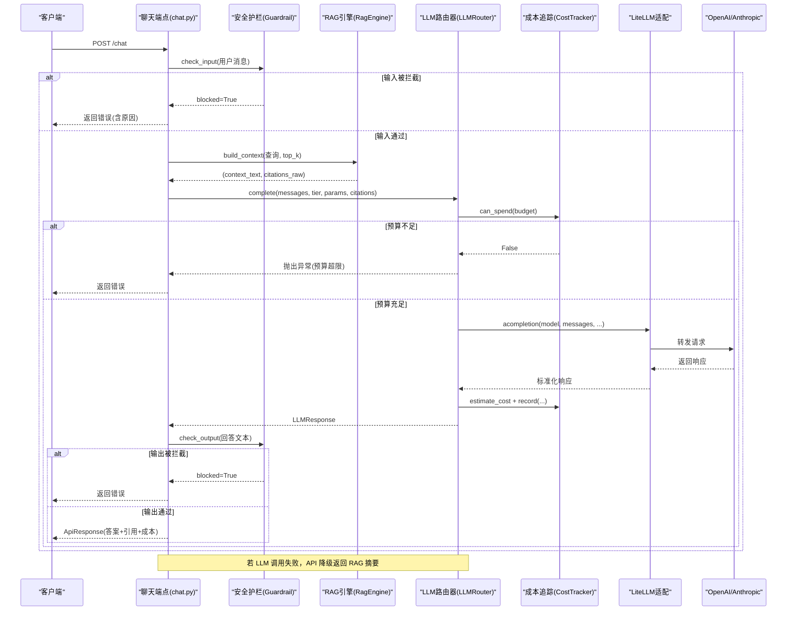
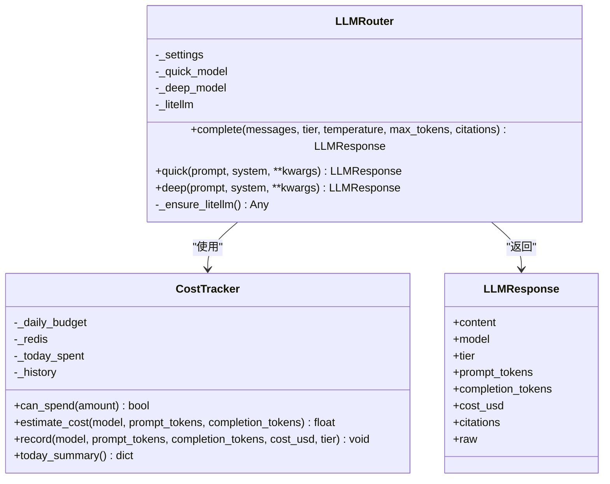
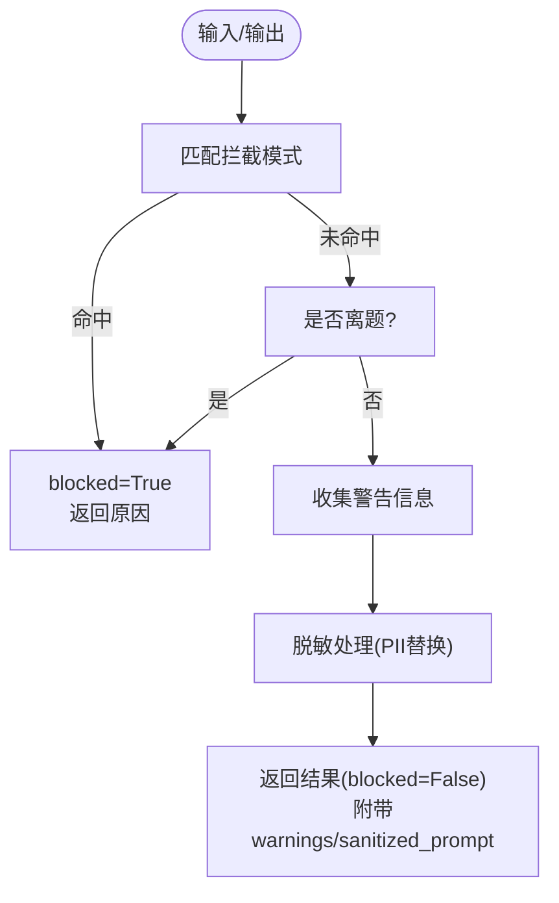
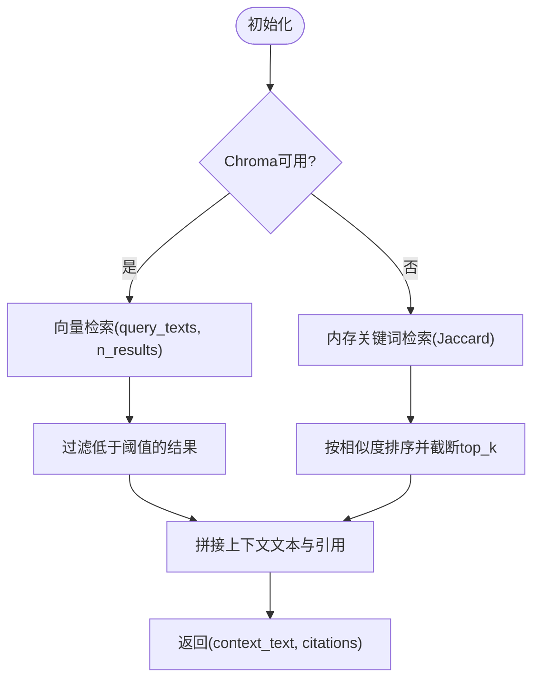
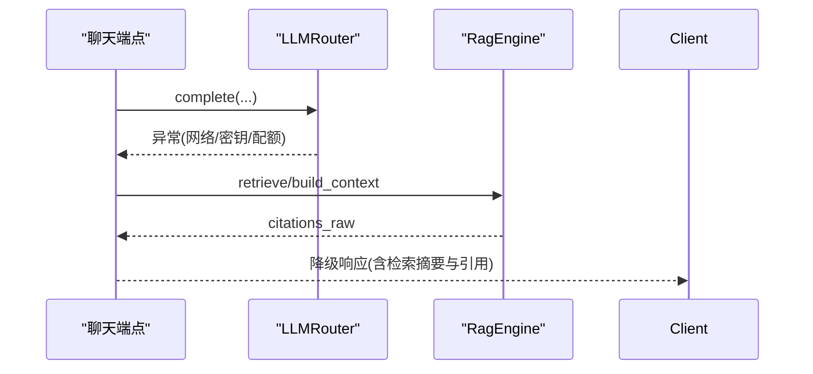
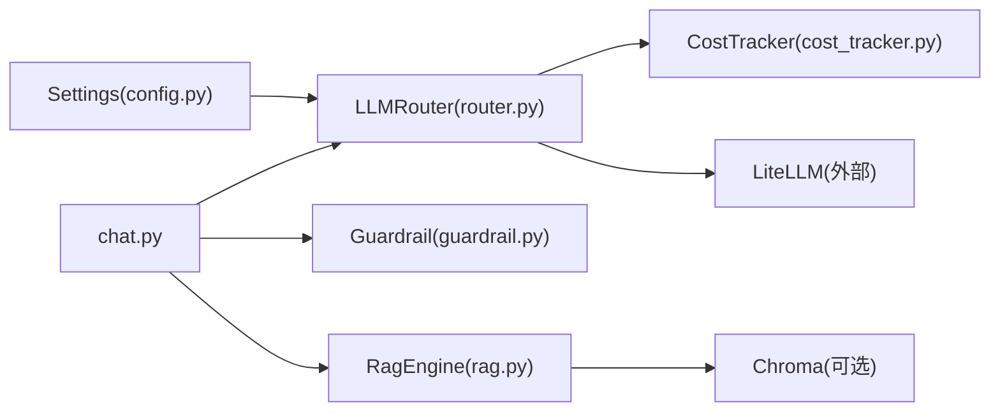

# 多模型路由系统

<cite>
**本文引用的文件**
- [router.py](file://backend/app/services/llm/router.py)
- [cost_tracker.py](file://backend/app/services/llm/cost_tracker.py)
- [guardrail.py](file://backend/app/services/llm/guardrail.py)
- [rag.py](file://backend/app/services/llm/rag.py)
- [config.py](file://backend/app/core/config.py)
- [chat.py](file://backend/app/api/v1/chat.py)
- [__init__.py](file://backend/app/services/llm/__init__.py)
</cite>

## 目录
1. [简介](#简介)
2. [项目结构](#项目结构)
3. [核心组件](#核心组件)
4. [架构总览](#架构总览)
5. [详细组件分析](#详细组件分析)
6. [依赖关系分析](#依赖关系分析)
7. [性能与成本特性](#性能与成本特性)
8. [故障排查指南](#故障排查指南)
9. [结论](#结论)
10. [附录：配置项说明](#附录配置项说明)

## 简介
本技术文档围绕“多模型路由系统”展开，聚焦 LLMRouter 的智能路由架构、多后端支持（OpenAI、Anthropic）、负载均衡与降级策略、模型选择算法、请求分发逻辑（重试、超时、错误恢复）、以及监控统计（调用次数、响应时间、成本追踪）。同时提供最佳实践与故障排查建议，帮助读者在生产环境中稳定高效地使用该系统。

## 项目结构
多模型路由系统位于后端服务的 LLM 子模块中，包含路由器、成本追踪、安全护栏、检索增强生成（RAG）等能力，并通过 API 层暴露统一接口。

图表来源
- [chat.py:30-157](file://backend/app/api/v1/chat.py#L30-L157)
- [router.py:55-197](file://backend/app/services/llm/router.py#L55-L197)
- [cost_tracker.py:27-167](file://backend/app/services/llm/cost_tracker.py#L27-L167)
- [guardrail.py:58-168](file://backend/app/services/llm/guardrail.py#L58-L168)
- [rag.py:35-238](file://backend/app/services/llm/rag.py#L35-L238)

章节来源
- [chat.py:1-177](file://backend/app/api/v1/chat.py#L1-L177)
- [__init__.py:1-9](file://backend/app/services/llm/__init__.py#L1-L9)

## 核心组件
- LLMRouter：统一路由入口，按任务层级（quick/deep）选择模型，集成预算检查与成本记录。
- CostTracker：成本估算与累计，支持按日重置与汇总统计。
- Guardrail：输入/输出安全规则，拦截违规内容并脱敏敏感信息。
- RagEngine：基于 Chroma 的向量检索，不可用时降级为内存关键词检索。
- 配置管理：通过 Settings 集中加载环境变量，提供默认值与校验。

章节来源
- [router.py:55-197](file://backend/app/services/llm/router.py#L55-L197)
- [cost_tracker.py:27-167](file://backend/app/services/llm/cost_tracker.py#L27-L167)
- [guardrail.py:58-168](file://backend/app/services/llm/guardrail.py#L58-L168)
- [rag.py:35-238](file://backend/app/services/llm/rag.py#L35-L238)
- [config.py:21-144](file://backend/app/core/config.py#L21-L144)

## 架构总览
下图展示了从 API 到 LLM 后端的完整调用链路，包括安全护栏、RAG 上下文注入、路由选择、成本追踪与异常降级。

图表来源
- [chat.py:30-157](file://backend/app/api/v1/chat.py#L30-L157)
- [router.py:92-171](file://backend/app/services/llm/router.py#L92-L171)
- [cost_tracker.py:68-167](file://backend/app/services/llm/cost_tracker.py#L68-L167)
- [guardrail.py:70-145](file://backend/app/services/llm/guardrail.py#L70-L145)
- [rag.py:211-238](file://backend/app/services/llm/rag.py#L211-L238)

## 详细组件分析

### LLMRouter 类图与职责
LLMRouter 负责根据 tier 选择模型、执行预算检查、调用 LiteLLM 完成请求、解析响应并记录成本。

图表来源
- [router.py:30-197](file://backend/app/services/llm/router.py#L30-L197)
- [cost_tracker.py:27-167](file://backend/app/services/llm/cost_tracker.py#L27-L167)

章节来源
- [router.py:55-197](file://backend/app/services/llm/router.py#L55-L197)

#### 模型选择与分层策略
- 快速层（quick）：默认映射到轻量模型，适合分类、简单问答，预算较低。
- 深度层（deep）：默认映射到更强模型，适合综合推理、报告生成，预算较高。
- 模型名可通过配置覆盖；未设置时回退到内置映射。

章节来源
- [router.py:18-27](file://backend/app/services/llm/router.py#L18-L27)
- [router.py:70-76](file://backend/app/services/llm/router.py#L70-L76)

#### 预算控制与成本估算
- 在每次调用前进行预算检查，超出则拒绝请求。
- 根据模型定价表估算单次费用，并累计当日花费。
- 提供今日汇总统计（按模型/层级分解、调用次数、剩余预算）。

章节来源
- [router.py:119-128](file://backend/app/services/llm/router.py#L119-L128)
- [cost_tracker.py:80-105](file://backend/app/services/llm/cost_tracker.py#L80-L105)
- [cost_tracker.py:143-167](file://backend/app/services/llm/cost_tracker.py#L143-L167)

#### 延迟加载与外部依赖
- LiteLLM 惰性导入，避免未安装时启动失败。
- 未知模型价格采用默认估算，降低耦合风险。

章节来源
- [router.py:80-90](file://backend/app/services/llm/router.py#L80-L90)
- [cost_tracker.py:96-105](file://backend/app/services/llm/cost_tracker.py#L96-L105)

### 安全护栏 Guardrail
- 输入检查：拦截处方剂量、绝对化承诺、提示词注入、非医学话题；检测敏感术语并警告；对 PII 进行脱敏。
- 输出检查：再次验证输出合规性，发现具体剂量建议时发出警告。

图表来源
- [guardrail.py:70-145](file://backend/app/services/llm/guardrail.py#L70-L145)

章节来源
- [guardrail.py:58-168](file://backend/app/services/llm/guardrail.py#L58-L168)

### 检索增强生成 RagEngine
- 优先使用 Chroma 向量库进行相似度检索；若不可用或初始化失败，自动降级为内存关键词检索（Jaccard 相似度）。
- 构建上下文用于 LLM 提示，并附带引用元数据供上层展示。

图表来源
- [rag.py:62-88](file://backend/app/services/llm/rag.py#L62-L88)
- [rag.py:126-169](file://backend/app/services/llm/rag.py#L126-L169)
- [rag.py:171-209](file://backend/app/services/llm/rag.py#L171-L209)
- [rag.py:211-238](file://backend/app/services/llm/rag.py#L211-L238)

章节来源
- [rag.py:35-238](file://backend/app/services/llm/rag.py#L35-L238)

### API 集成与降级策略
- 聊天端点在 LLM 调用失败时，自动降级返回 RAG 检索结果摘要，保障可用性。
- 将 RAG 的引用源转换为结构化 Citation，便于前端展示证据来源。

图表来源
- [chat.py:68-157](file://backend/app/api/v1/chat.py#L68-L157)

章节来源
- [chat.py:30-157](file://backend/app/api/v1/chat.py#L30-L157)

## 依赖关系分析
- LLMRouter 依赖配置中心获取模型与预算参数，依赖 CostTracker 进行成本管理与统计。
- API 层组合 Guardrail、RagEngine、LLMRouter，形成端到端流程。
- 外部依赖 LiteLLM 抽象不同厂商后端，Chroma 作为可选向量存储。

图表来源
- [config.py:21-144](file://backend/app/core/config.py#L21-L144)
- [router.py:55-197](file://backend/app/services/llm/router.py#L55-L197)
- [cost_tracker.py:27-167](file://backend/app/services/llm/cost_tracker.py#L27-L167)
- [guardrail.py:58-168](file://backend/app/services/llm/guardrail.py#L58-L168)
- [rag.py:35-238](file://backend/app/services/llm/rag.py#L35-L238)
- [chat.py:30-157](file://backend/app/api/v1/chat.py#L30-L157)

章节来源
- [__init__.py:1-9](file://backend/app/services/llm/__init__.py#L1-L9)

## 性能与成本特性
- 分层路由：quick 层低延迟低成本，deep 层高能力高成本，按需选择。
- 预算保护：调用前检查预算，防止超支；按日重置累计。
- 成本估算：基于模型单价表计算 input/output token 费用，未知模型使用默认价格。
- 降级策略：LLM 不可用时返回 RAG 摘要，提升鲁棒性。
- 可观测性：今日汇总包含总花费、剩余预算、按模型/层级分解与调用次数。

章节来源
- [router.py:119-171](file://backend/app/services/llm/router.py#L119-L171)
- [cost_tracker.py:80-167](file://backend/app/services/llm/cost_tracker.py#L80-L167)
- [chat.py:120-157](file://backend/app/api/v1/chat.py#L120-L157)

## 故障排查指南
- 未安装 LiteLLM：会抛出运行时异常，需安装依赖后再启动。
- 预算超限：当 quick/deep 预算耗尽时，请求将被拒绝，需调整预算或等待次日重置。
- 模型不可用：网络或密钥问题导致调用失败，API 层将降级返回 RAG 摘要。
- 安全拦截：输入或输出命中拦截规则会被拒绝，请检查提示词与输出内容是否符合规范。
- 向量库不可用：Chroma 初始化失败将自动降级为内存关键词检索，功能可用但检索质量可能下降。

章节来源
- [router.py:80-90](file://backend/app/services/llm/router.py#L80-L90)
- [router.py:119-128](file://backend/app/services/llm/router.py#L119-L128)
- [chat.py:120-157](file://backend/app/api/v1/chat.py#L120-L157)
- [guardrail.py:70-145](file://backend/app/services/llm/guardrail.py#L70-L145)
- [rag.py:62-88](file://backend/app/services/llm/rag.py#L62-L88)

## 结论
该多模型路由系统以 LLMRouter 为核心，结合 CostTracker、Guardrail、RagEngine 与配置管理，实现了分层路由、预算控制、安全合规与检索增强的完整链路。系统在 LLM 不可用时具备良好降级能力，并提供成本与调用统计的可观测性。生产部署建议关注预算配置、密钥管理、Chroma 可用性，并结合业务需求优化 tier 选择与 top_k 参数。

## 附录：配置项说明
- 应用与环境变量：
  - app_name、app_version、app_env、app_debug、app_host、app_port、app_log_level
- 数据库与缓存：
  - database_url、database_echo、redis_url
- 对象存储：
  - s3_endpoint、s3_access_key、s3_secret_key、s3_bucket、s3_region
- 向量库：
  - chroma_persist_dir
- LLM 相关：
  - openai_api_key、anthropic_api_key
  - llm_default_model、llm_deep_model
  - llm_max_budget_usd、llm_quick_budget_usd
- 其他外部服务与认证、CORS、联邦学习、CDISC、数据处理等配置项详见 Settings 定义。

章节来源
- [config.py:21-144](file://backend/app/core/config.py#L21-L144)