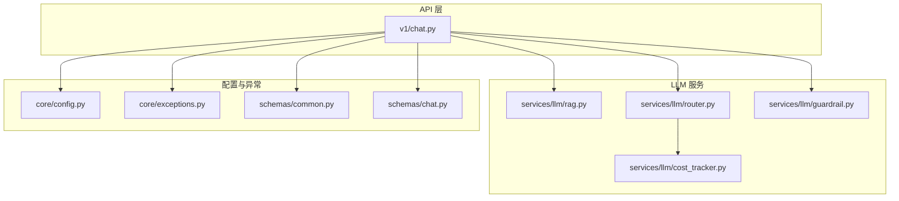
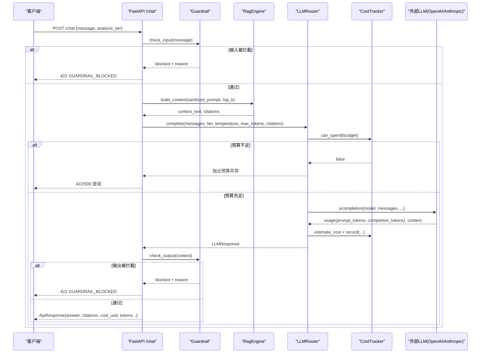
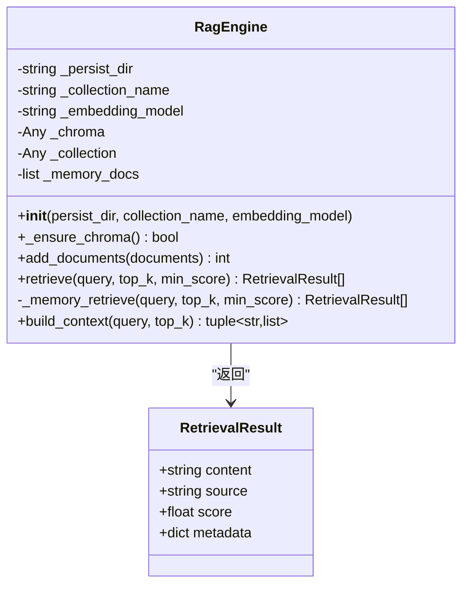
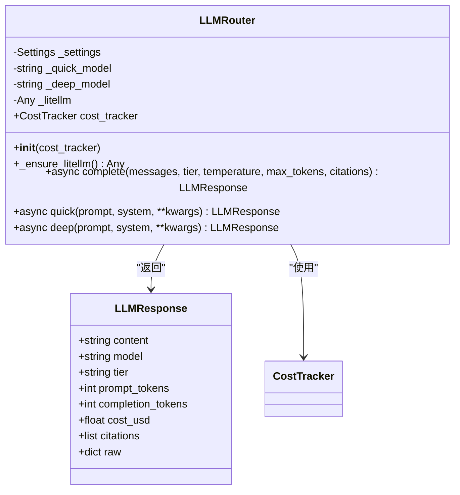
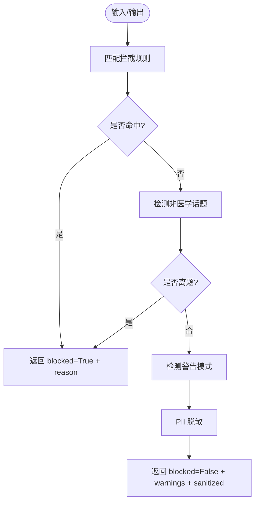
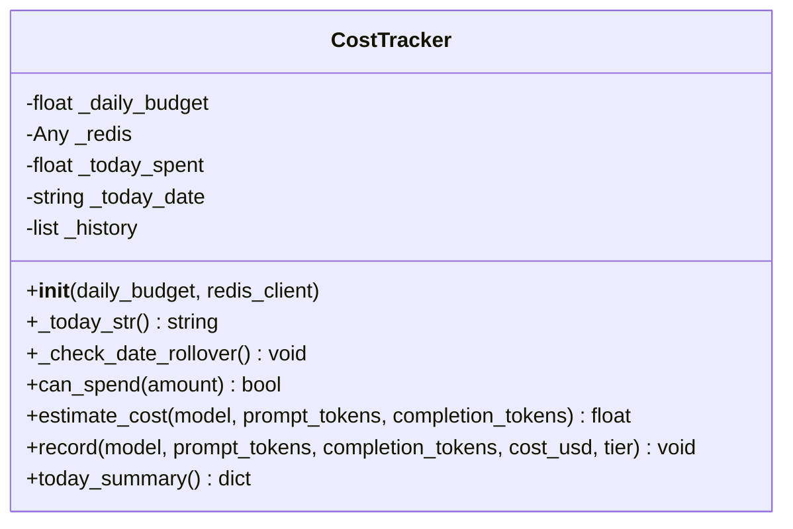
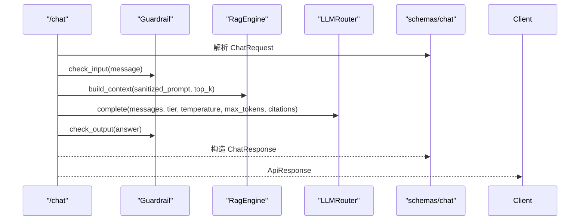
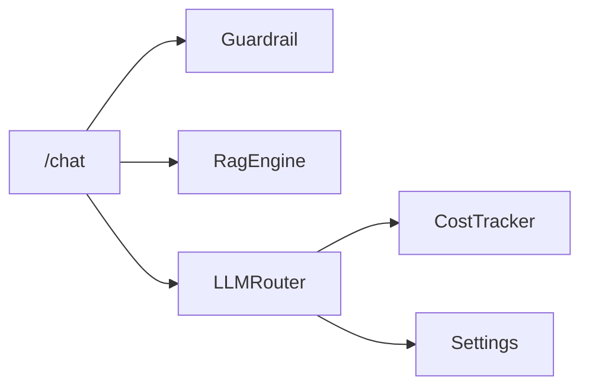

# 大语言模型集成

<cite>
**本文引用的文件**   
- [rag.py](file://precision-drug-design/backend/app/services/llm/rag.py)
- [router.py](file://precision-drug-design/backend/app/services/llm/router.py)
- [guardrail.py](file://precision-drug-design/backend/app/services/llm/guardrail.py)
- [cost_tracker.py](file://precision-drug-design/backend/app/services/llm/cost_tracker.py)
- [chat.py](file://precision-drug-design/backend/app/api/v1/chat.py)
- [config.py](file://precision-drug-design/backend/app/core/config.py)
- [exceptions.py](file://precision-drug-design/backend/app/core/exceptions.py)
- [chat_schemas.py](file://precision-drug-design/backend/app/schemas/chat.py)
- [common_schemas.py](file://precision-drug-design/backend/app/schemas/common.py)
- [test_rag.py](file://precision-drug-design/tests/test_rag.py)
- [test_llm_router.py](file://precision-drug-design/tests/test_llm_router.py)
- [test_guardrail.py](file://precision-drug-design/tests/test_guardrail.py)
- [test_cost_tracker.py](file://precision-drug-design/tests/test_cost_tracker.py)
</cite>

## 目录
1. [简介](#简介)
2. [项目结构](#项目结构)
3. [核心组件](#核心组件)
4. [架构总览](#架构总览)
5. [详细组件分析](#详细组件分析)
6. [依赖关系分析](#依赖关系分析)
7. [性能与成本优化](#性能与成本优化)
8. [故障排查指南](#故障排查指南)
9. [结论](#结论)
10. [附录](#附录)

## 简介
本技术文档面向“精准药物设计”系统中的大语言模型（LLM）集成子系统，重点覆盖以下能力：
- RAG 检索增强生成：基于向量数据库的语义检索与上下文注入，支持降级到内存关键词检索。
- 多模型路由策略：统一抽象 OpenAI、Anthropic 等后端，按任务层级选择模型并自动预算控制。
- 安全护栏机制：输入输出双向检查，拦截违规内容、提示注入、非医学话题，并对敏感信息进行脱敏。
- 成本追踪系统：按模型与层级统计费用，提供预算上限与超支阻断。
- Chat 服务：对话请求处理、上下文构建、错误降级与引用来源返回。

## 项目结构
与 LLM 集成相关的核心代码位于 backend/app/services/llm 与 API 层 v1/chat，配置集中于 core/config，异常与通用响应在 core/exceptions 与 schemas/common。

图表来源
- [chat.py:1-177](file://precision-drug-design/backend/app/api/v1/chat.py#L1-L177)
- [rag.py:1-238](file://precision-drug-design/backend/app/services/llm/rag.py#L1-L238)
- [router.py:1-198](file://precision-drug-design/backend/app/services/llm/router.py#L1-L198)
- [guardrail.py:1-168](file://precision-drug-design/backend/app/services/llm/guardrail.py#L1-L168)
- [cost_tracker.py:1-167](file://precision-drug-design/backend/app/services/llm/cost_tracker.py#L1-L167)
- [config.py:1-144](file://precision-drug-design/backend/app/core/config.py#L1-L144)
- [exceptions.py:1-179](file://precision-drug-design/backend/app/core/exceptions.py#L1-L179)
- [chat_schemas.py:1-81](file://precision-drug-design/backend/app/schemas/chat.py#L1-L81)
- [common_schemas.py:1-158](file://precision-drug-design/backend/app/schemas/common.py#L1-L158)

章节来源
- [chat.py:1-177](file://precision-drug-design/backend/app/api/v1/chat.py#L1-L177)
- [config.py:1-144](file://precision-drug-design/backend/app/core/config.py#L1-L144)

## 核心组件
- RagEngine：实现向量检索与上下文构建，优先使用 Chroma 向量库，不可用时回退到内存 Jaccard 相似度检索。
- LLMRouter：基于 LiteLLM 的多厂商统一调用，按 quick/deep 层级选择模型，记录 token 用量与估算费用。
- Guardrail：输入/输出安全检查，包含违规词过滤、提示注入防护、PII 脱敏与非医学话题拦截。
- CostTracker：按模型单价估算费用，维护当日累计花费与预算上限，提供汇总统计。
- Chat 服务：串联 Guardrail → RAG → Router → Guardrail，失败时降级为仅返回 RAG 摘要。

章节来源
- [rag.py:1-238](file://precision-drug-design/backend/app/services/llm/rag.py#L1-L238)
- [router.py:1-198](file://precision-drug-design/backend/app/services/llm/router.py#L1-L198)
- [guardrail.py:1-168](file://precision-drug-design/backend/app/services/llm/guardrail.py#L1-L168)
- [cost_tracker.py:1-167](file://precision-drug-design/backend/app/services/llm/cost_tracker.py#L1-L167)
- [chat.py:1-177](file://precision-drug-design/backend/app/api/v1/chat.py#L1-L177)

## 架构总览
下图展示了从 HTTP 请求到 LLM 生成的完整流程，包括安全护栏、RAG 检索、模型路由与成本追踪。

图表来源
- [chat.py:30-157](file://precision-drug-design/backend/app/api/v1/chat.py#L30-L157)
- [guardrail.py:70-145](file://precision-drug-design/backend/app/services/llm/guardrail.py#L70-L145)
- [rag.py:211-237](file://precision-drug-design/backend/app/services/llm/rag.py#L211-L237)
- [router.py:92-171](file://precision-drug-design/backend/app/services/llm/router.py#L92-L171)
- [cost_tracker.py:68-141](file://precision-drug-design/backend/app/services/llm/cost_tracker.py#L68-L141)

## 详细组件分析

### RAG 引擎（RagEngine）
- 目标：将领域知识（如 PubMed 摘要、靶点报告、内部知识库）向量化并用于检索增强生成。
- 关键特性：
  - 向量存储：优先使用 Chroma 持久化集合，空间度量 cosine；若未安装或初始化失败，则降级为内存模式。
  - 文档入库：add_documents 同时写入 Chroma 与内存备份，确保可用性。
  - 检索策略：retrieve 支持 top_k 与 min_score 阈值；Chroma 模式下将距离转换为相似度分数；内存模式采用 Jaccard 相似度。
  - 上下文构建：build_context 将检索结果拼接为结构化文本，并附带可溯源的 citations。
- 复杂度与性能：
  - Chroma 查询时间复杂度近似 O(k log n)，k=top_k，n=文档数；Jaccard 内存检索为 O(n·|query_terms|)。
  - 建议在生产环境启用 Chroma 以获得更好的召回质量与扩展性。
- 错误处理：
  - 导入失败或初始化异常均会记录警告并回退到内存模式，保证服务可用。

图表来源
- [rag.py:18-33](file://precision-drug-design/backend/app/services/llm/rag.py#L18-L33)
- [rag.py:35-237](file://precision-drug-design/backend/app/services/llm/rag.py#L35-L237)

章节来源
- [rag.py:1-238](file://precision-drug-design/backend/app/services/llm/rag.py#L1-L238)
- [test_rag.py:1-207](file://precision-drug-design/tests/test_rag.py#L1-L207)

### LLM 路由器（LLMRouter）
- 目标：统一多厂商 LLM 调用接口，按任务层级选择模型，内置预算检查与成本记录。
- 关键特性：
  - 层级选择：quick 层默认 gpt-4o-mini/claude-haiku，deep 层默认 gpt-4o/claude-sonnet；可通过配置覆盖。
  - 延迟加载：LiteLLM 模块按需导入，避免未安装时启动失败。
  - 预算控制：complete 前根据 tier 获取对应预算上限，调用 CostTracker.can_spend 判断是否允许继续。
  - 成本估算与记录：解析 usage 字段，estimate_cost 计算美元费用，record 写入历史与累计值。
  - 便捷方法：quick/deep 封装消息构造与参数传递。
- 错误处理：
  - 未安装 litellm 抛 RuntimeError；LLM 调用异常包装为 RuntimeError；tier 非法抛 ValueError。

图表来源
- [router.py:30-53](file://precision-drug-design/backend/app/services/llm/router.py#L30-L53)
- [router.py:55-198](file://precision-drug-design/backend/app/services/llm/router.py#L55-L198)
- [cost_tracker.py:27-167](file://precision-drug-design/backend/app/services/llm/cost_tracker.py#L27-L167)

章节来源
- [router.py:1-198](file://precision-drug-design/backend/app/services/llm/router.py#L1-L198)
- [test_llm_router.py:1-258](file://precision-drug-design/tests/test_llm_router.py#L1-L258)

### 安全护栏（Guardrail）
- 目标：防止不合规内容生成，保护用户隐私，抵御提示注入攻击。
- 规则体系：
  - 拦截模式：禁止剂量处方、绝对化承诺、提示注入（忽略指令、扮演医生）、系统标签注入、非医学话题。
  - 警告模式：涉及孕妇/儿童/严重副作用等敏感术语时给出警告。
  - PII 脱敏：手机号、身份证号、邮箱替换为占位符。
- 使用方法：
  - check_input 对用户输入进行校验与脱敏；check_output 对 LLM 输出进行二次检查。
  - 返回 GuardrailResult，包含 blocked、reason、warnings、sanitized_prompt。

图表来源
- [guardrail.py:17-38](file://precision-drug-design/backend/app/services/llm/guardrail.py#L17-L38)
- [guardrail.py:70-145](file://precision-drug-design/backend/app/services/llm/guardrail.py#L70-L145)
- [guardrail.py:147-167](file://precision-drug-design/backend/app/services/llm/guardrail.py#L147-L167)

章节来源
- [guardrail.py:1-168](file://precision-drug-design/backend/app/services/llm/guardrail.py#L1-L168)
- [test_guardrail.py:1-90](file://precision-drug-design/tests/test_guardrail.py#L1-L90)

### 成本追踪器（CostTracker）
- 目标：控制 LLM 调用成本，防止预算超支，提供按模型与层级的费用统计。
- 关键特性：
  - 模型定价：内置常见模型单价（USD per 1K tokens），未知模型使用默认价格估算。
  - 预算检查：can_spend 判断今日累计花费 + 预计花费是否超过 daily_budget。
  - 记录与汇总：record 追加历史条目；today_summary 提供 total_spent_usd、by_model、by_tier、total_calls 等。
  - 日期切换：自动重置当日累计与历史记录。
- 使用场景：
  - LLMRouter.complete 中先 can_spend，再 estimate_cost 与 record。
  - 前端或监控面板可读取 today_summary 展示实时成本。

图表来源
- [cost_tracker.py:27-167](file://precision-drug-design/backend/app/services/llm/cost_tracker.py#L27-L167)

章节来源
- [cost_tracker.py:1-167](file://precision-drug-design/backend/app/services/llm/cost_tracker.py#L1-L167)
- [test_cost_tracker.py:1-77](file://precision-drug-design/tests/test_cost_tracker.py#L1-L77)

### Chat 服务（自然语言问答）
- 端点：POST /chat，GET /chat/history。
- 处理流程：
  1) 安全护栏检查输入，必要时抛出 GuardrailBlockedError。
  2) 构建 RAG 上下文，top_k 随 analysis_tier 调整（quick 取 5，deep 取 20）。
  3) 组装 system/user 消息，调用 LLMRouter.complete，携带 citations。
  4) 输出再次经 Guardrail 检查，若被拦截则返回 422。
  5) 成功时返回 ApiResponse，包含 answer、citations、cost_usd、tokens_in/out 等。
  6) 异常时降级为仅返回 RAG 摘要，并标记 degraded。
- 数据模型：
  - ChatRequest/ChatResponse/Citation 定义于 schemas/chat，遵循 camelCase 兼容。
  - 统一响应信封 ApiResponse 定义于 schemas/common。

图表来源
- [chat.py:30-157](file://precision-drug-design/backend/app/api/v1/chat.py#L30-L157)
- [chat_schemas.py:22-59](file://precision-drug-design/backend/app/schemas/chat.py#L22-L59)
- [common_schemas.py:63-73](file://precision-drug-design/backend/app/schemas/common.py#L63-L73)

章节来源
- [chat.py:1-177](file://precision-drug-design/backend/app/api/v1/chat.py#L1-L177)
- [chat_schemas.py:1-81](file://precision-drug-design/backend/app/schemas/chat.py#L1-L81)
- [common_schemas.py:1-158](file://precision-drug-design/backend/app/schemas/common.py#L1-L158)

## 依赖关系分析
- 组件耦合：
  - Chat 服务强依赖 Guardrail、RagEngine、LLMRouter；LLMRouter 依赖 CostTracker。
  - 配置集中由 Settings 管理，LLMRouter 通过 get_settings 获取默认模型与预算。
- 外部依赖：
  - Chroma（可选）：向量数据库，缺失时降级内存检索。
  - LiteLLM（必需）：多厂商 LLM 统一调用，缺失时抛错。
- 潜在循环依赖：
  - 当前无直接循环；各服务以单向依赖组合。
- 接口契约：
  - LLMRouter.complete 返回 LLMResponse，包含 content、usage、cost_usd、citations。
  - Guardrail.check_input/check_output 返回 GuardrailResult。
  - CostTracker.today_summary 返回标准化统计字典。

图表来源
- [chat.py:30-157](file://precision-drug-design/backend/app/api/v1/chat.py#L30-L157)
- [router.py:60-90](file://precision-drug-design/backend/app/services/llm/router.py#L60-L90)
- [config.py:136-144](file://precision-drug-design/backend/app/core/config.py#L136-L144)

章节来源
- [chat.py:1-177](file://precision-drug-design/backend/app/api/v1/chat.py#L1-L177)
- [router.py:1-198](file://precision-drug-design/backend/app/services/llm/router.py#L1-L198)
- [config.py:1-144](file://precision-drug-design/backend/app/core/config.py#L1-L144)

## 性能与成本优化
- RAG 优化建议：
  - 生产环境启用 Chroma 并使用合适的 chunk 大小与嵌入模型，提升召回质量。
  - 合理设置 top_k 与 min_score，平衡上下文长度与相关性。
- 路由与预算：
  - 简单任务使用 quick 层降低费用；复杂推理使用 deep 层提高质量。
  - 结合 CostTracker.today_summary 监控每日花费，动态调整 llm_max_budget_usd 与 llm_quick_budget_usd。
- 错误降级：
  - LLM 不可用时返回 RAG 摘要，保障用户体验与可用性。

[本节为通用指导，无需特定文件来源]

## 故障排查指南
- 常见问题与定位：
  - 未安装 litellm：LLMRouter._ensure_litellm 抛出 RuntimeError，需安装依赖。
  - 未安装 chromadb：RagEngine 降级为内存检索，功能可用但召回质量下降。
  - 预算不足：Router.complete 抛出 RuntimeError，检查 CostTracker.daily_budget 与已花费。
  - 安全拦截：Guardrail 触发返回 422，查看 reason 与 warnings，调整提示词或规则。
- 日志与异常：
  - 全局异常处理器将业务异常与意外异常分别记录并返回统一信封。
  - GuardrailBlockedError 映射为 422，UpstreamError 映射为 502。

章节来源
- [router.py:80-90](file://precision-drug-design/backend/app/services/llm/router.py#L80-L90)
- [rag.py:62-88](file://precision-drug-design/backend/app/services/llm/rag.py#L62-L88)
- [cost_tracker.py:68-78](file://precision-drug-design/backend/app/services/llm/cost_tracker.py#L68-L78)
- [exceptions.py:77-94](file://precision-drug-design/backend/app/core/exceptions.py#L77-L94)
- [exceptions.py:131-179](file://precision-drug-design/backend/app/core/exceptions.py#L131-L179)

## 结论
该集成方案通过 RAG 增强、多模型路由、安全护栏与成本追踪四大核心组件，构建了高可用、可控、可观测的大语言模型服务。系统在向量检索、模型选择、安全防护与费用控制方面具备完善的工程实践，并通过测试用例验证了关键路径的正确性与鲁棒性。后续可在流式响应、会话持久化、更多本地模型接入等方面持续演进。

[本节为总结，无需特定文件来源]

## 附录
- 环境变量与配置项（节选）：
  - openai_api_key、anthropic_api_key：外部 LLM 密钥。
  - llm_default_model、llm_deep_model：默认模型名。
  - llm_max_budget_usd、llm_quick_budget_usd：预算上限。
  - chroma_persist_dir：向量库持久化目录。
- 数据模型参考：
  - ChatRequest/ChatResponse/Citation：问答请求与响应结构。
  - ApiResponse/PagedResponse：统一响应信封。

章节来源
- [config.py:54-61](file://precision-drug-design/backend/app/core/config.py#L54-L61)
- [chat_schemas.py:22-59](file://precision-drug-design/backend/app/schemas/chat.py#L22-L59)
- [common_schemas.py:63-89](file://precision-drug-design/backend/app/schemas/common.py#L63-L89)