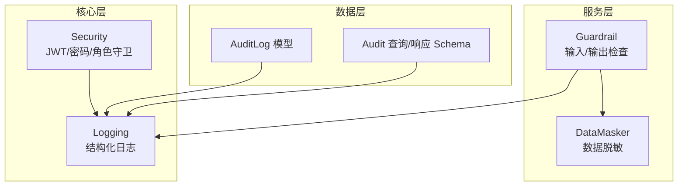
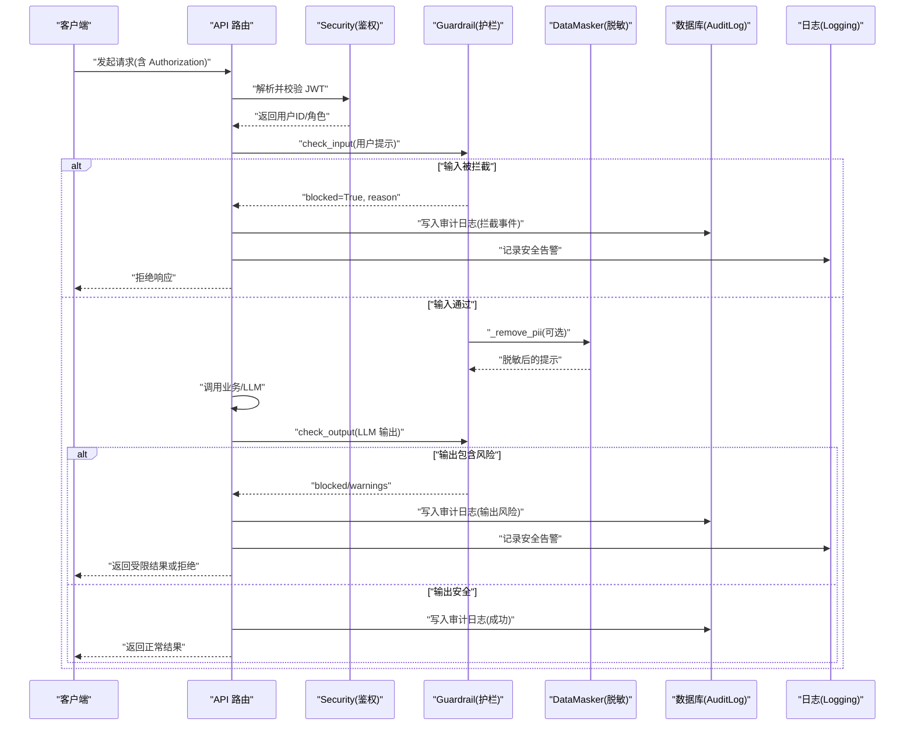
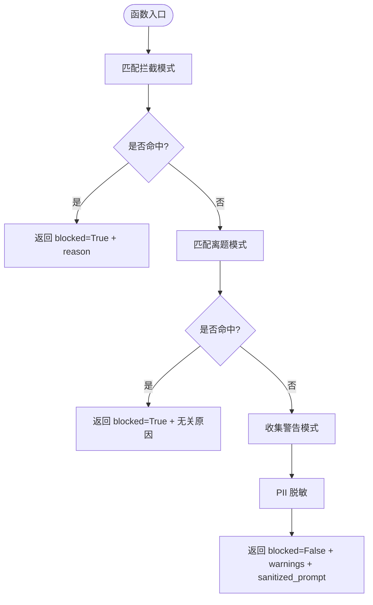
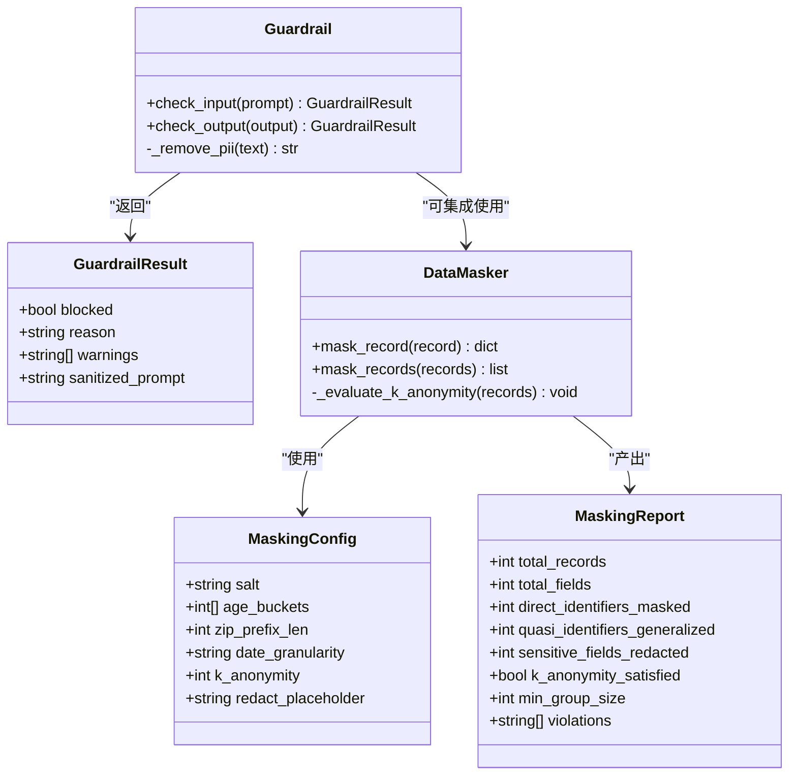
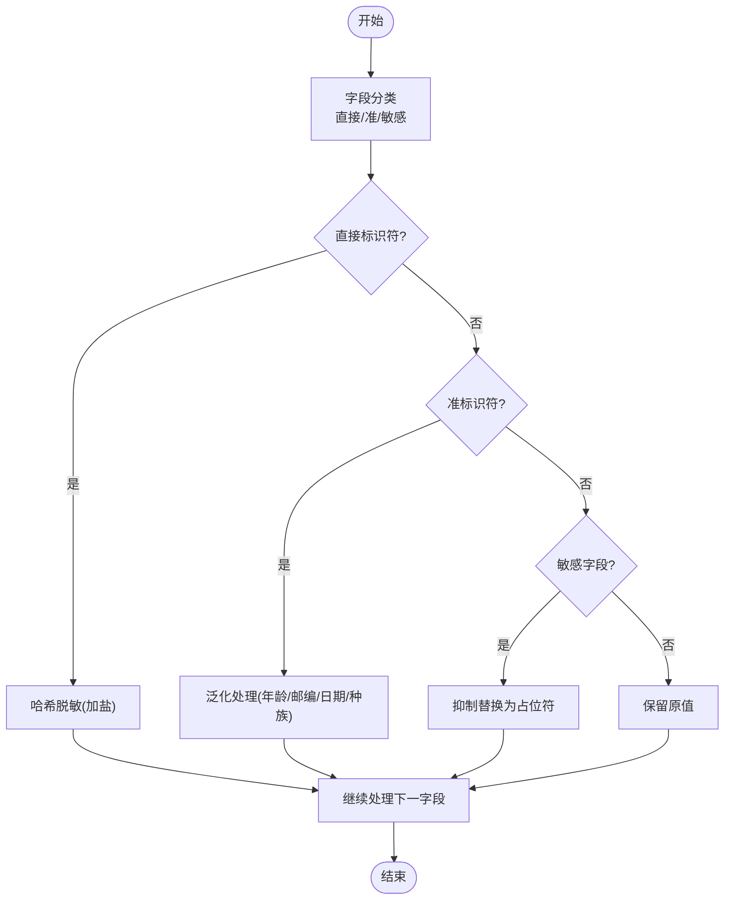
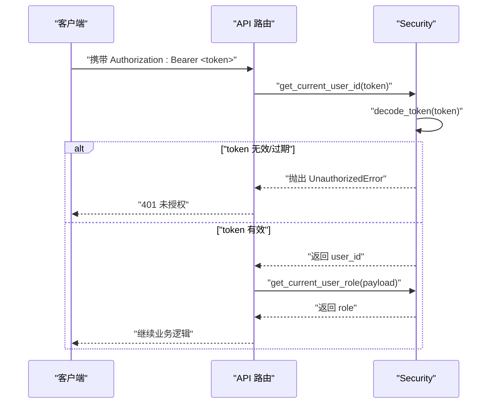
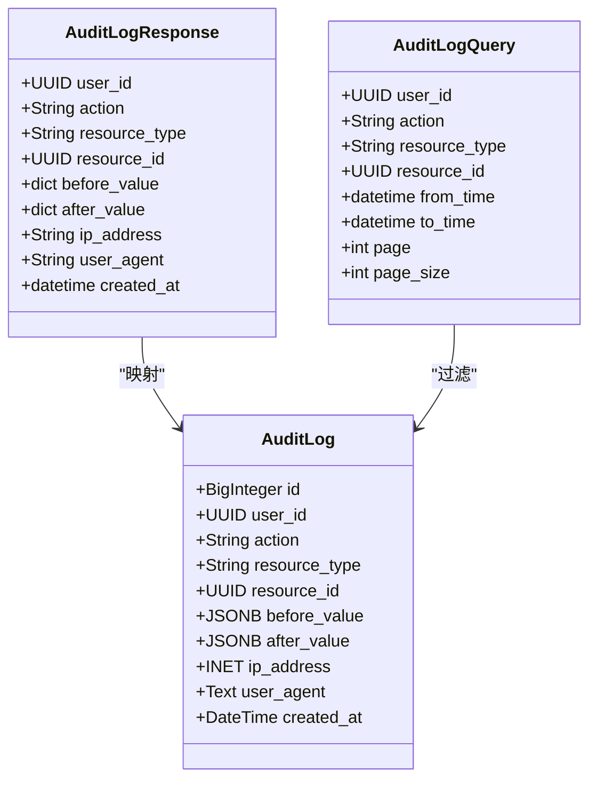
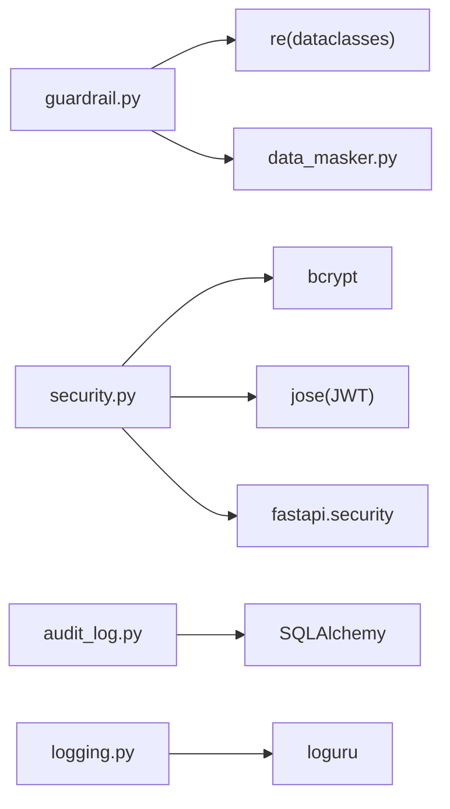

# 安全护栏机制

<cite>
**本文引用的文件**   
- [backend/app/services/llm/guardrail.py](file://backend/app/services/llm/guardrail.py)
- [tests/test_guardrail.py](file://tests/test_guardrail.py)
- [backend/app/core/security.py](file://backend/app/core/security.py)
- [backend/app/models/audit_log.py](file://backend/app/models/audit_log.py)
- [backend/app/schemas/audit.py](file://backend/app/schemas/audit.py)
- [backend/app/core/logging.py](file://backend/app/core/logging.py)
- [backend/app/services/privacy/data_masker.py](file://backend/app/services/privacy/data_masker.py)
</cite>

## 目录
1. [简介](#简介)
2. [项目结构](#项目结构)
3. [核心组件](#核心组件)
4. [架构总览](#架构总览)
5. [详细组件分析](#详细组件分析)
6. [依赖关系分析](#依赖关系分析)
7. [性能考量](#性能考量)
8. [故障排查指南](#故障排查指南)
9. [结论](#结论)
10. [附录](#附录)

## 简介
本技术文档围绕“安全护栏机制”展开，聚焦于 LLM 输入/输出安全检查框架、内容过滤系统、提示注入防护与合规性检查引擎。文档覆盖以下关键主题：
- 安全检查规则的配置与管理（敏感词库维护、正则表达式模式、自定义检查器扩展）
- 多层安全防护策略（输入验证、输出过滤、上下文审查）
- 违规检测算法（语义/意图识别、风险评估）
- 安全日志记录与审计（违规事件追踪、安全报告生成）
- 安全配置最佳实践与常见攻击场景防护

该机制以轻量、可组合、可扩展为核心设计目标，适用于药物研发与精准医疗领域的 AI 助手与 RAG 工作流。

## 项目结构
与安全护栏相关的代码主要分布在如下模块：
- 服务层：LLM 安全护栏实现与单元测试
- 核心层：认证与令牌校验、结构化日志
- 数据层：审计日志模型与查询 Schema
- 隐私层：数据脱敏与 k-匿名评估

图表来源
- [backend/app/services/llm/guardrail.py:1-168](file://backend/app/services/llm/guardrail.py#L1-L168)
- [backend/app/services/privacy/data_masker.py:1-294](file://backend/app/services/privacy/data_masker.py#L1-L294)
- [backend/app/core/security.py:1-211](file://backend/app/core/security.py#L1-L211)
- [backend/app/core/logging.py:1-93](file://backend/app/core/logging.py#L1-L93)
- [backend/app/models/audit_log.py:1-45](file://backend/app/models/audit_log.py#L1-L45)
- [backend/app/schemas/audit.py:1-39](file://backend/app/schemas/audit.py#L1-L39)

章节来源
- [backend/app/services/llm/guardrail.py:1-168](file://backend/app/services/llm/guardrail.py#L1-L168)
- [backend/app/services/privacy/data_masker.py:1-294](file://backend/app/services/privacy/data_masker.py#L1-L294)
- [backend/app/core/security.py:1-211](file://backend/app/core/security.py#L1-L211)
- [backend/app/core/logging.py:1-93](file://backend/app/core/logging.py#L1-L93)
- [backend/app/models/audit_log.py:1-45](file://backend/app/models/audit_log.py#L1-L45)
- [backend/app/schemas/audit.py:1-39](file://backend/app/schemas/audit.py#L1-L39)

## 核心组件
- Guardrail（LLM 安全护栏）
  - 功能：输入/输出双重检查；拦截违规内容；提示注入防护；PII 脱敏；警告与阻断决策
  - 关键方法：check_input、check_output、_remove_pii
  - 数据结构：GuardrailResult（blocked、reason、warnings、sanitized_prompt）
- DataMasker（数据脱敏器）
  - 功能：直接标识符哈希、准标识符泛化、敏感值抑制、k-匿名评估
  - 关键方法：mask_record、mask_records、_evaluate_k_anonymity
  - 数据结构：MaskingConfig、MaskingReport
- Security（认证与授权）
  - 功能：bcrypt 密码哈希/校验、JWT access/refresh token 生成与解析、FastAPI 依赖注入获取当前用户与角色、基于角色的访问控制
- AuditLog（审计日志）
  - 功能：不可篡改的 append-only 审计记录；支持按 action/time 索引；JSONB 存储 before/after 快照
- Logging（结构化日志）
  - 功能：生产 JSON 输出、开发彩色控制台、按大小/时间轮转、错误独立归档、上下文绑定

章节来源
- [backend/app/services/llm/guardrail.py:1-168](file://backend/app/services/llm/guardrail.py#L1-L168)
- [backend/app/services/privacy/data_masker.py:1-294](file://backend/app/services/privacy/data_masker.py#L1-L294)
- [backend/app/core/security.py:1-211](file://backend/app/core/security.py#L1-L211)
- [backend/app/models/audit_log.py:1-45](file://backend/app/models/audit_log.py#L1-L45)
- [backend/app/core/logging.py:1-93](file://backend/app/core/logging.py#L1-L93)

## 架构总览
下图展示了从请求进入、身份鉴权、安全护栏检查到审计与日志记录的端到端流程。

图表来源
- [backend/app/core/security.py:155-211](file://backend/app/core/security.py#L155-L211)
- [backend/app/services/llm/guardrail.py:70-145](file://backend/app/services/llm/guardrail.py#L70-L145)
- [backend/app/services/privacy/data_masker.py:144-172](file://backend/app/services/privacy/data_masker.py#L144-L172)
- [backend/app/models/audit_log.py:15-45](file://backend/app/models/audit_log.py#L15-L45)
- [backend/app/core/logging.py:20-74](file://backend/app/core/logging.py#L20-L74)

## 详细组件分析

### Guardrail 组件分析
Guardrail 提供输入/输出双向检查，内置三类正则模式集合：
- 拦截模式（BLOCKED_PATTERNS）：剂量处方、绝对化承诺、提示注入等
- 离题模式（OFF_TOPIC_PATTERNS）：非医学/药物相关话题
- 警告模式（WARN_PATTERNS）：涉及孕妇/儿童/严重副作用等敏感术语

处理流程要点：
- 输入阶段：先匹配拦截模式，再匹配离题模式，最后收集警告；执行 PII 脱敏后返回 sanitized_prompt
- 输出阶段：再次匹配拦截模式；对具体剂量建议进行警告标注

图表来源
- [backend/app/services/llm/guardrail.py:70-114](file://backend/app/services/llm/guardrail.py#L70-L114)
- [backend/app/services/llm/guardrail.py:116-145](file://backend/app/services/llm/guardrail.py#L116-L145)
- [backend/app/services/llm/guardrail.py:147-167](file://backend/app/services/llm/guardrail.py#L147-L167)

类与方法关系图

图表来源
- [backend/app/services/llm/guardrail.py:41-68](file://backend/app/services/llm/guardrail.py#L41-L68)
- [backend/app/services/privacy/data_masker.py:80-124](file://backend/app/services/privacy/data_masker.py#L80-L124)
- [backend/app/services/privacy/data_masker.py:126-172](file://backend/app/services/privacy/data_masker.py#L126-L172)

章节来源
- [backend/app/services/llm/guardrail.py:1-168](file://backend/app/services/llm/guardrail.py#L1-L168)
- [tests/test_guardrail.py:1-90](file://tests/test_guardrail.py#L1-L90)

### 数据脱敏组件分析
DataMasker 针对 HIPAA Safe Harbor 18 项中的关键标识符进行处理：
- 直接标识符：哈希脱敏（带盐），避免彩虹表攻击
- 准标识符：泛化处理（年龄分段、邮编前缀、日期精度）
- 敏感字段：抑制替换为占位符
- k-匿名评估：统计同质组大小，输出最小分组与违规项

图表来源
- [backend/app/services/privacy/data_masker.py:174-190](file://backend/app/services/privacy/data_masker.py#L174-L190)
- [backend/app/services/privacy/data_masker.py:192-255](file://backend/app/services/privacy/data_masker.py#L192-L255)

章节来源
- [backend/app/services/privacy/data_masker.py:1-294](file://backend/app/services/privacy/data_masker.py#L1-L294)

### 认证与授权组件分析
Security 模块提供：
- bcrypt 密码哈希与校验（恒定时间比较，抵御时序攻击）
- JWT access/refresh token 生成与解码（含过期时间、jti、role 声明）
- FastAPI 依赖注入：get_current_user_id、get_current_user_role、require_roles 工厂

图表来源
- [backend/app/core/security.py:125-149](file://backend/app/core/security.py#L125-L149)
- [backend/app/core/security.py:155-191](file://backend/app/core/security.py#L155-L191)
- [backend/app/core/security.py:194-211](file://backend/app/core/security.py#L194-L211)

章节来源
- [backend/app/core/security.py:1-211](file://backend/app/core/security.py#L1-L211)

### 审计与日志组件分析
- AuditLog：append-only 审计记录，支持 action、resource_type、before/after JSONB 快照、IP/UA 记录、时间索引
- Audit 查询/响应 Schema：分页、时间范围、资源过滤
- Logging：生产 JSON 输出、开发彩色控制台、按大小/时间轮转、错误独立归档、上下文绑定

图表来源
- [backend/app/models/audit_log.py:15-45](file://backend/app/models/audit_log.py#L15-L45)
- [backend/app/schemas/audit.py:14-39](file://backend/app/schemas/audit.py#L14-L39)

章节来源
- [backend/app/models/audit_log.py:1-45](file://backend/app/models/audit_log.py#L1-L45)
- [backend/app/schemas/audit.py:1-39](file://backend/app/schemas/audit.py#L1-L39)
- [backend/app/core/logging.py:1-93](file://backend/app/core/logging.py#L1-L93)

## 依赖关系分析
- Guardrail 依赖正则表达式与 dataclasses，无外部运行时耦合；可与 DataMasker 组合使用
- Security 依赖 bcrypt、jose、fastapi.security；提供 FastAPI 依赖注入
- AuditLog 依赖 SQLAlchemy ORM 与类型兼容封装
- Logging 依赖 loguru，统一应用日志出口

图表来源
- [backend/app/services/llm/guardrail.py:1-168](file://backend/app/services/llm/guardrail.py#L1-L168)
- [backend/app/services/privacy/data_masker.py:1-294](file://backend/app/services/privacy/data_masker.py#L1-L294)
- [backend/app/core/security.py:1-211](file://backend/app/core/security.py#L1-L211)
- [backend/app/models/audit_log.py:1-45](file://backend/app/models/audit_log.py#L1-L45)
- [backend/app/core/logging.py:1-93](file://backend/app/core/logging.py#L1-L93)

章节来源
- [backend/app/services/llm/guardrail.py:1-168](file://backend/app/services/llm/guardrail.py#L1-L168)
- [backend/app/services/privacy/data_masker.py:1-294](file://backend/app/services/privacy/data_masker.py#L1-L294)
- [backend/app/core/security.py:1-211](file://backend/app/core/security.py#L1-L211)
- [backend/app/models/audit_log.py:1-45](file://backend/app/models/audit_log.py#L1-L45)
- [backend/app/core/logging.py:1-93](file://backend/app/core/logging.py#L1-L93)

## 性能考量
- 正则匹配复杂度：Guardrail 在输入/输出路径上对每条文本执行多模式匹配，建议将高频模式预编译（已实现）并按优先级排序以减少回溯
- 批量脱敏：DataMasker 的 mask_records 会遍历所有记录并计算 k-匿名，建议在大数据集上使用分片与并行处理
- 日志 I/O：生产环境启用 JSON 序列化与异步安全，注意磁盘 I/O 与轮转策略对吞吐的影响
- 鉴权开销：JWT 解码与 bcrypt 校验属于 CPU 密集操作，应结合缓存与限流策略

[本节为通用指导，不直接分析具体文件]

## 故障排查指南
- 输入被误拦截
  - 现象：合法医学问题被 blocked
  - 排查：核对 BLOCKED_PATTERNS 与 OFF_TOPIC_PATTERNS 的正则表达式，确认是否存在过度匹配
  - 参考：[backend/app/services/llm/guardrail.py:17-38](file://backend/app/services/llm/guardrail.py#L17-L38)
- 输出剂量警告频繁
  - 现象：输出包含 mg/ml 等剂量单位触发警告
  - 排查：调整 check_output 中剂量检测正则，区分“示例数值”与“处方建议”
  - 参考：[backend/app/services/llm/guardrail.py:136-139](file://backend/app/services/llm/guardrail.py#L136-L139)
- PII 脱敏不完整
  - 现象：手机号/邮箱/身份证号未被完全替换
  - 排查：检查 _remove_pii 正则边界与字符集，必要时引入更严格的格式校验
  - 参考：[backend/app/services/llm/guardrail.py:147-167](file://backend/app/services/llm/guardrail.py#L147-L167)
- k-匿名未满足
  - 现象：MaskingReport.k_anonymity_satisfied=False
  - 排查：增大 k 参数或进一步泛化准标识符；关注 violations 列表定位小样本组
  - 参考：[backend/app/services/privacy/data_masker.py:257-290](file://backend/app/services/privacy/data_masker.py#L257-L290)
- 审计日志缺失
  - 现象：拦截事件未落库
  - 排查：确认审计写入逻辑与数据库权限（REVOKE UPDATE/DELETE）；检查索引 idx_audit_action_time
  - 参考：[backend/app/models/audit_log.py:22-41](file://backend/app/models/audit_log.py#L22-L41)
- 日志无法定位上下文
  - 现象：缺少 request_id/user_id
  - 排查：确保在中间件或依赖中绑定上下文；确认 setup_logging 已在启动时调用
  - 参考：[backend/app/core/logging.py:20-64](file://backend/app/core/logging.py#L20-L64)

章节来源
- [backend/app/services/llm/guardrail.py:17-38](file://backend/app/services/llm/guardrail.py#L17-L38)
- [backend/app/services/llm/guardrail.py:136-139](file://backend/app/services/llm/guardrail.py#L136-L139)
- [backend/app/services/llm/guardrail.py:147-167](file://backend/app/services/llm/guardrail.py#L147-L167)
- [backend/app/services/privacy/data_masker.py:257-290](file://backend/app/services/privacy/data_masker.py#L257-L290)
- [backend/app/models/audit_log.py:22-41](file://backend/app/models/audit_log.py#L22-L41)
- [backend/app/core/logging.py:20-64](file://backend/app/core/logging.py#L20-L64)

## 结论
本安全护栏机制以“规则优先、可扩展、可观测”为原则，构建了输入/输出双层防护、PII 脱敏与审计日志闭环。通过正则模式与数据脱敏的组合，可有效缓解提示注入、越权输出与隐私泄露风险。后续可在语义分析与意图识别层面引入轻量 NLP 模型，进一步提升复杂攻击的检出率与误报控制。

[本节为总结性内容，不直接分析具体文件]

## 附录

### 安全检查规则配置与管理
- 敏感词库维护
  - 建议将 BLOCKED_PATTERNS/WARN_PATTERNS/OFF_TOPIC_PATTERNS 外置为配置文件或数据库表，支持热更新与版本管理
  - 为每条规则添加元数据（类别、严重级别、生效范围、创建者、更新时间）
- 正则表达式模式
  - 采用命名捕获与注释提升可读性；定期回归测试覆盖率
  - 对高危模式设置白名单豁免机制（如内部知识库引用）
- 自定义检查器开发
  - 在 Guardrail 中增加插件式检查器接口，按顺序执行；每个检查器返回局部结果，最终聚合为 GuardrailResult
  - 支持异步检查器（如远程内容审核 API），并通过超时与熔断保护主流程

[本节为概念性指导，不直接分析具体文件]

### 多层安全防护策略
- 输入验证
  - 长度/格式限制、编码规范化、HTML/脚本标签清洗
  - 提示注入检测：系统标签、角色扮演指令、忽略指令等
- 输出过滤
  - 禁止处方剂量、绝对化承诺、危险行为引导
  - 输出后处理：去重、敏感信息二次扫描、格式化约束
- 上下文审查
  - 会话级上下文窗口内的历史消息一致性检查
  - 跨轮次意图漂移检测与阈值告警

[本节为概念性指导，不直接分析具体文件]

### 违规检测算法说明
- 语义分析
  - 基于词典与规则的快速筛查；对长尾语义可采用轻量分类器或嵌入相似度
- 意图识别
  - 对用户提问进行分类（咨询/处方/研究/闲聊），不同类别应用不同策略
- 风险评估
  - 综合规则命中数、严重级别、上下文置信度，计算风险分数并决定阻断/警告/放行

[本节为概念性指导，不直接分析具体文件]

### 安全日志记录与审计
- 违规事件追踪
  - 记录用户 ID、动作、资源类型、前后值快照、IP/UA、时间戳
  - 支持按 action/time 高效检索
- 安全报告生成
  - 基于 AuditLog 聚合统计（拦截次数、Top 规则、高风险用户/资源）
  - 导出 CSV/JSON 供合规团队审阅

章节来源
- [backend/app/models/audit_log.py:15-45](file://backend/app/models/audit_log.py#L15-L45)
- [backend/app/schemas/audit.py:14-39](file://backend/app/schemas/audit.py#L14-L39)

### 安全配置最佳实践
- 密钥与令牌
  - 使用强随机 secret_key；合理设置 access/refresh 过期时间；启用 jti 防重放
  - 参考：[backend/app/core/security.py:64-122](file://backend/app/core/security.py#L64-L122)
- 日志与监控
  - 生产环境开启 JSON 序列化与错误独立归档；集中采集与告警
  - 参考：[backend/app/core/logging.py:30-74](file://backend/app/core/logging.py#L30-L74)
- 数据脱敏
  - 根据业务敏感度调整 k-anonymity 与泛化粒度；定期评估合规性
  - 参考：[backend/app/services/privacy/data_masker.py:80-124](file://backend/app/services/privacy/data_masker.py#L80-L124)

章节来源
- [backend/app/core/security.py:64-122](file://backend/app/core/security.py#L64-L122)
- [backend/app/core/logging.py:30-74](file://backend/app/core/logging.py#L30-L74)
- [backend/app/services/privacy/data_masker.py:80-124](file://backend/app/services/privacy/data_masker.py#L80-L124)

### 常见攻击场景与防护措施
- 提示注入（system/imagine/assistant 标签、角色扮演、忽略指令）
  - 防护：BLOCKED_PATTERNS 严格匹配；上下文窗口内重复检测
  - 参考：[backend/app/services/llm/guardrail.py:17-27](file://backend/app/services/llm/guardrail.py#L17-L27)
- 越权输出（处方剂量、绝对化承诺）
  - 防护：输出侧二次扫描；警告升级策略；人工复核通道
  - 参考：[backend/app/services/llm/guardrail.py:136-139](file://backend/app/services/llm/guardrail.py#L136-L139)
- 隐私泄露（手机号/邮箱/身份证）
  - 防护：输入/输出双端脱敏；DataMasker 批量处理与 k-匿名评估
  - 参考：[backend/app/services/llm/guardrail.py:147-167](file://backend/app/services/llm/guardrail.py#L147-L167), [backend/app/services/privacy/data_masker.py:257-290](file://backend/app/services/privacy/data_masker.py#L257-L290)
- 非业务域滥用（股票/理财/赌博/色情/政治）
  - 防护：OFF_TOPIC_PATTERNS 拦截；用户教育与黑白名单管理
  - 参考：[backend/app/services/llm/guardrail.py:36-38](file://backend/app/services/llm/guardrail.py#L36-L38)

章节来源
- [backend/app/services/llm/guardrail.py:17-27](file://backend/app/services/llm/guardrail.py#L17-L27)
- [backend/app/services/llm/guardrail.py:136-139](file://backend/app/services/llm/guardrail.py#L136-L139)
- [backend/app/services/llm/guardrail.py:147-167](file://backend/app/services/llm/guardrail.py#L147-L167)
- [backend/app/services/privacy/data_masker.py:257-290](file://backend/app/services/privacy/data_masker.py#L257-L290)
- [backend/app/services/llm/guardrail.py:36-38](file://backend/app/services/llm/guardrail.py#L36-L38)