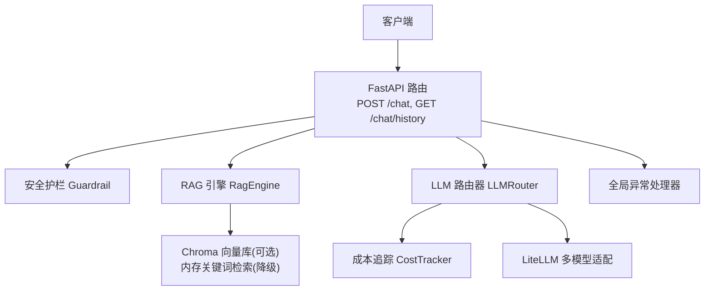
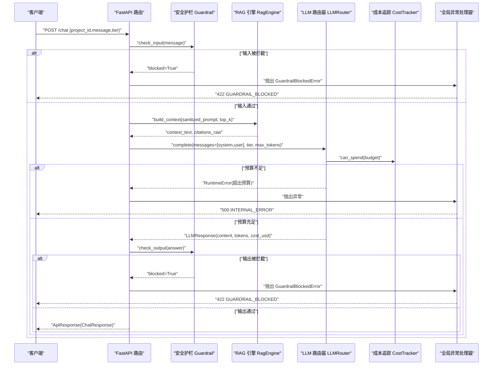
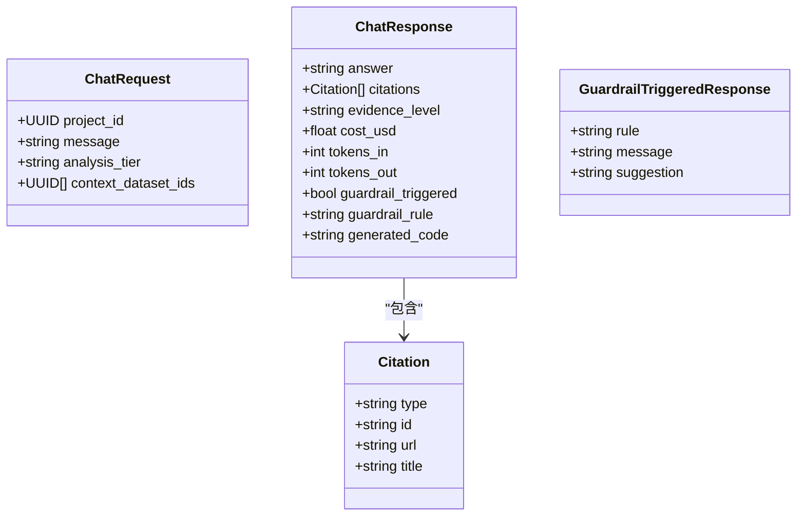
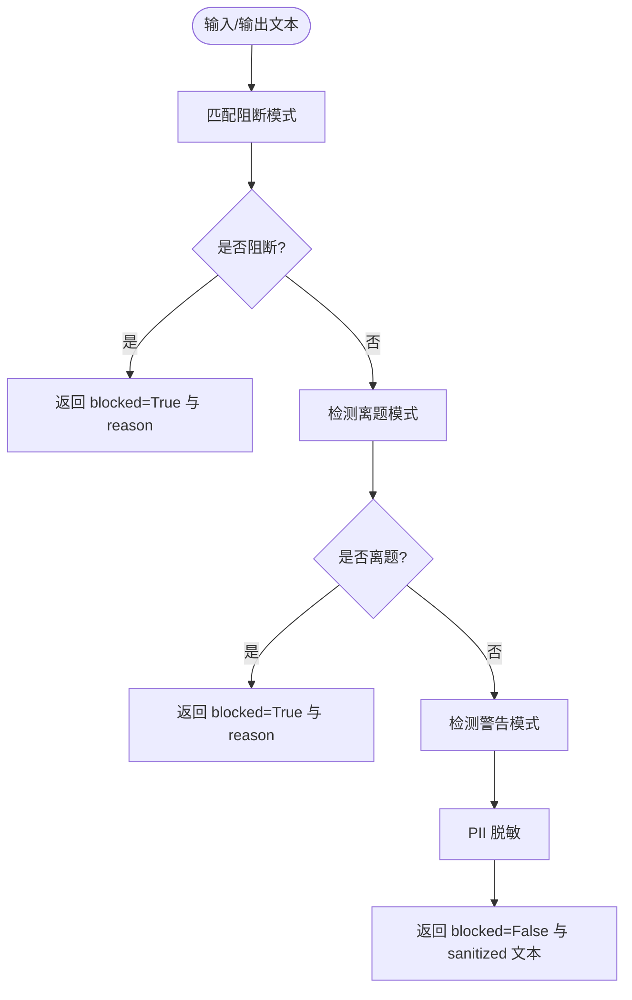
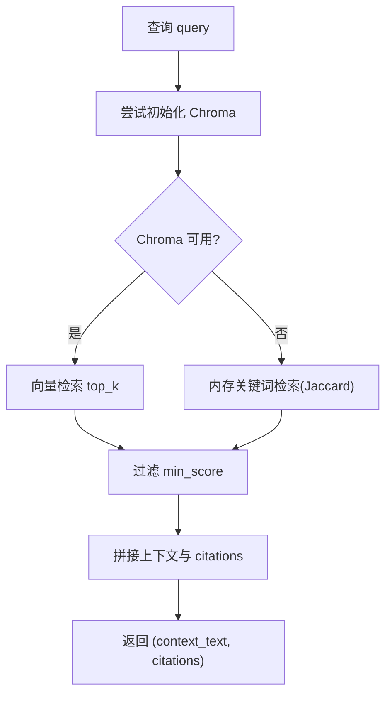
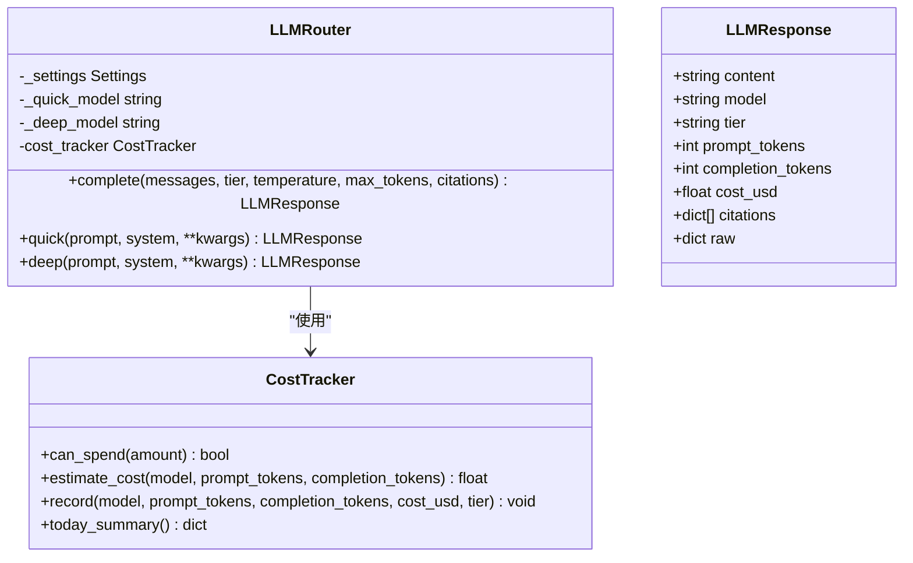
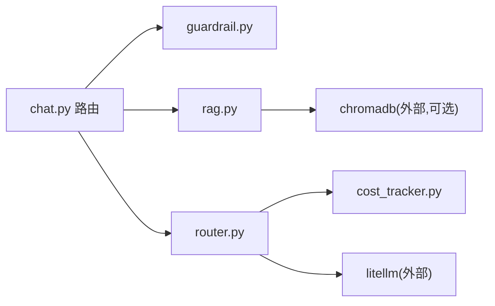

# 对话管理服务

<cite>
**本文引用的文件**   
- [backend/app/api/v1/chat.py](file://precision-drug-design/backend/app/api/v1/chat.py)
- [backend/app/schemas/chat.py](file://precision-drug-design/backend/app/schemas/chat.py)
- [backend/app/services/llm/router.py](file://precision-drug-design/backend/app/services/llm/router.py)
- [backend/app/services/llm/rag.py](file://precision-drug-design/backend/app/services/llm/rag.py)
- [backend/app/services/llm/guardrail.py](file://precision-drug-design/backend/app/services/llm/guardrail.py)
- [backend/app/services/llm/cost_tracker.py](file://precision-drug-design/backend/app/services/llm/cost_tracker.py)
- [backend/app/core/config.py](file://precision-drug-design/backend/app/core/config.py)
- [backend/app/core/exceptions.py](file://precision-drug-design/backend/app/core/exceptions.py)
- [backend/app/main.py](file://precision-drug-design/backend/app/main.py)
</cite>

## 目录
1. [简介](#简介)
2. [项目结构](#项目结构)
3. [核心组件](#核心组件)
4. [架构总览](#架构总览)
5. [详细组件分析](#详细组件分析)
6. [依赖关系分析](#依赖关系分析)
7. [性能考量](#性能考量)
8. [故障排查指南](#故障排查指南)
9. [结论](#结论)
10. [附录：API 规范与错误码](#附录api-规范与错误码)

## 简介
本技术文档聚焦于“对话管理服务”的 Chat 服务，围绕会话状态维护、上下文管理、消息历史存储、对话生命周期、流式响应实现、上下文窗口管理以及与 RAG 系统的集成进行系统化说明。同时提供 API 接口规范、错误处理策略和性能优化建议，帮助开发者快速理解并扩展该服务。

## 项目结构
后端采用 FastAPI 分层组织：
- API 层：路由定义与请求/响应模型绑定
- 服务层：LLM 路由、RAG 检索、安全护栏、成本追踪
- 配置与异常：集中配置加载与统一异常处理
- 中间件：请求 ID 注入与响应头增强（主应用）

图表来源
- [backend/app/api/v1/chat.py:30-157](file://precision-drug-design/backend/app/api/v1/chat.py#L30-L157)
- [backend/app/services/llm/router.py:55-171](file://precision-drug-design/backend/app/services/llm/router.py#L55-L171)
- [backend/app/services/llm/rag.py:35-237](file://precision-drug-design/backend/app/services/llm/rag.py#L35-L237)
- [backend/app/services/llm/guardrail.py:58-167](file://precision-drug-design/backend/app/services/llm/guardrail.py#L58-L167)
- [backend/app/services/llm/cost_tracker.py:27-166](file://precision-drug-design/backend/app/services/llm/cost_tracker.py#L27-L166)
- [backend/app/core/exceptions.py:131-178](file://precision-drug-design/backend/app/core/exceptions.py#L131-L178)

章节来源
- [backend/app/api/v1/chat.py:1-177](file://precision-drug-design/backend/app/api/v1/chat.py#L1-L177)
- [backend/app/schemas/chat.py:1-81](file://precision-drug-design/backend/app/schemas/chat.py#L1-L81)
- [backend/app/services/llm/router.py:1-198](file://precision-drug-design/backend/app/services/llm/router.py#L1-L198)
- [backend/app/services/llm/rag.py:1-238](file://precision-drug-design/backend/app/services/llm/rag.py#L1-L238)
- [backend/app/services/llm/guardrail.py:1-168](file://precision-drug-design/backend/app/services/llm/guardrail.py#L1-L168)
- [backend/app/services/llm/cost_tracker.py:1-167](file://precision-drug-design/backend/app/services/llm/cost_tracker.py#L1-L167)
- [backend/app/core/config.py:1-144](file://precision-drug-design/backend/app/core/config.py#L1-L144)
- [backend/app/core/exceptions.py:1-179](file://precision-drug-design/backend/app/core/exceptions.py#L1-L179)
- [backend/app/main.py:73-170](file://precision-drug-design/backend/app/main.py#L73-L170)

## 核心组件
- 路由与模式
  - POST /chat：自然语言问答，集成安全护栏、RAG 检索、LLM 生成与输出护栏检查，支持按 tier 选择模型与预算控制。
  - GET /chat/history：返回历史对话（当前为内存占位，后续将持久化）。
  - 请求/响应模式：ChatRequest、ChatResponse、Citation、GuardrailTriggeredResponse 等。
- 安全护栏 Guardrail
  - 输入/输出双重校验，拦截违规内容、提示词注入、非医学话题；对敏感信息进行脱敏。
- RAG 引擎 RagEngine
  - 基于 Chroma 的向量检索，失败时回退到内存关键词检索；构建 LLM 上下文与引用列表。
- LLM 路由器 LLMRouter
  - 通过 LiteLLM 统一调用不同厂商模型，按 quick/deep 层级选择模型，记录 token 用量与估算费用。
- 成本追踪 CostTracker
  - 按日预算上限控制，统计累计花费，支持 Redis 共享（未启用时为内存）。
- 配置与异常
  - Settings 集中读取环境变量；统一异常封装与全局处理器注册。

章节来源
- [backend/app/api/v1/chat.py:30-157](file://precision-drug-design/backend/app/api/v1/chat.py#L30-L157)
- [backend/app/schemas/chat.py:22-81](file://precision-drug-design/backend/app/schemas/chat.py#L22-L81)
- [backend/app/services/llm/guardrail.py:58-167](file://precision-drug-design/backend/app/services/llm/guardrail.py#L58-L167)
- [backend/app/services/llm/rag.py:35-237](file://precision-drug-design/backend/app/services/llm/rag.py#L35-L237)
- [backend/app/services/llm/router.py:55-171](file://precision-drug-design/backend/app/services/llm/router.py#L55-L171)
- [backend/app/services/llm/cost_tracker.py:27-166](file://precision-drug-design/backend/app/services/llm/cost_tracker.py#L27-L166)
- [backend/app/core/config.py:21-144](file://precision-drug-design/backend/app/core/config.py#L21-L144)
- [backend/app/core/exceptions.py:19-178](file://precision-drug-design/backend/app/core/exceptions.py#L19-L178)

## 架构总览
下图展示一次完整问答请求的处理流程，包括输入护栏、RAG 上下文构建、LLM 生成、输出护栏与降级策略。

图表来源
- [backend/app/api/v1/chat.py:30-157](file://precision-drug-design/backend/app/api/v1/chat.py#L30-L157)
- [backend/app/services/llm/guardrail.py:70-145](file://precision-drug-design/backend/app/services/llm/guardrail.py#L70-L145)
- [backend/app/services/llm/rag.py:211-237](file://precision-drug-design/backend/app/services/llm/rag.py#L211-L237)
- [backend/app/services/llm/router.py:92-171](file://precision-drug-design/backend/app/services/llm/router.py#L92-L171)
- [backend/app/services/llm/cost_tracker.py:68-78](file://precision-drug-design/backend/app/services/llm/cost_tracker.py#L68-L78)
- [backend/app/core/exceptions.py:131-178](file://precision-drug-design/backend/app/core/exceptions.py#L131-L178)

## 详细组件分析

### 路由与模式（API 层）
- POST /chat
  - 输入校验：analysis_tier 限定为 quick/deep；message 长度限制。
  - 流程：输入护栏 → RAG 构建上下文 → LLM 生成 → 输出护栏 → 返回 ApiResponse[ChatResponse]。
  - 降级：当 LLM 不可用时，返回 RAG 检索结果摘要，并在 meta.degraded 标记。
- GET /chat/history
  - 当前返回空数组，meta.note 提示后续将持久化。
- 模式定义
  - Citation：type、id、url、title。
  - ChatRequest：project_id、message、analysis_tier、context_dataset_ids。
  - ChatResponse：answer、citations、evidence_level、cost_usd、tokens_in/out、guardrail_triggered/rule、generated_code。
  - GuardrailTriggeredResponse：rule、message、suggestion。

图表来源
- [backend/app/schemas/chat.py:22-81](file://precision-drug-design/backend/app/schemas/chat.py#L22-L81)

章节来源
- [backend/app/api/v1/chat.py:30-157](file://precision-drug-design/backend/app/api/v1/chat.py#L30-L157)
- [backend/app/api/v1/chat.py:160-176](file://precision-drug-design/backend/app/api/v1/chat.py#L160-L176)
- [backend/app/schemas/chat.py:22-81](file://precision-drug-design/backend/app/schemas/chat.py#L22-L81)

### 安全护栏 Guardrail
- 规则集
  - 阻断：剂量处方、绝对化承诺、提示词注入、非医学话题。
  - 警告：涉及孕妇/儿童/严重副作用等敏感术语。
  - 脱敏：手机号、身份证号、邮箱替换为占位符。
- 使用方式
  - check_input(prompt)：返回是否拦截、原因、警告与脱敏后的 prompt。
  - check_output(output)：检查输出是否违规或包含具体剂量建议。

图表来源
- [backend/app/services/llm/guardrail.py:70-167](file://precision-drug-design/backend/app/services/llm/guardrail.py#L70-L167)

章节来源
- [backend/app/services/llm/guardrail.py:1-168](file://precision-drug-design/backend/app/services/llm/guardrail.py#L1-L168)

### RAG 引擎 RagEngine
- 功能
  - add_documents：批量添加文档到 Chroma 集合，并同步到内存备份。
  - retrieve：优先 Chroma 向量检索，失败回退到内存 Jaccard 相似度检索。
  - build_context：组装 top-k 结果作为 LLM 上下文，并生成 citations。
- 关键参数
  - persist_dir、collection_name、embedding_model。
  - retrieve 的 top_k、min_score。
- 降级策略
  - Chroma 不可用或未安装时，自动降级为内存关键词检索。

图表来源
- [backend/app/services/llm/rag.py:62-237](file://precision-drug-design/backend/app/services/llm/rag.py#L62-L237)

章节来源
- [backend/app/services/llm/rag.py:1-238](file://precision-drug-design/backend/app/services/llm/rag.py#L1-L238)

### LLM 路由器 LLMRouter
- 设计要点
  - 层级选择：quick（gpt-4o-mini/claude-haiku）、deep（gpt-4o/claude-sonnet）。
  - 预算检查：在调用前根据 tier 预算判断是否允许消费。
  - 成本估算与记录：依据模型定价表估算并按日累计。
- 方法
  - complete：通用完成接口，接收 messages、tier、temperature、max_tokens、citations。
  - quick/deep：便捷封装。

图表来源
- [backend/app/services/llm/router.py:30-198](file://precision-drug-design/backend/app/services/llm/router.py#L30-L198)
- [backend/app/services/llm/cost_tracker.py:27-166](file://precision-drug-design/backend/app/services/llm/cost_tracker.py#L27-L166)

章节来源
- [backend/app/services/llm/router.py:1-198](file://precision-drug-design/backend/app/services/llm/router.py#L1-L198)
- [backend/app/services/llm/cost_tracker.py:1-167](file://precision-drug-design/backend/app/services/llm/cost_tracker.py#L1-L167)

### 配置与异常
- 配置 Settings
  - 从 .env 与环境变量加载，覆盖默认值；提供 llm_default_model、llm_deep_model、llm_max_budget_usd、llm_quick_budget_usd 等字段。
- 异常体系
  - AppException 基类，子类如 GuardrailBlockedError、RateLimitedError、UpstreamError。
  - 全局处理器将业务异常转换为统一信封响应，携带 request_id。

章节来源
- [backend/app/core/config.py:21-144](file://precision-drug-design/backend/app/core/config.py#L21-L144)
- [backend/app/core/exceptions.py:19-178](file://precision-drug-design/backend/app/core/exceptions.py#L19-L178)

## 依赖关系分析
- 模块耦合
  - chat 路由强依赖 Guardrail、RagEngine、LLMRouter；LLMRouter 依赖 CostTracker 与 LiteLLM。
  - RagEngine 依赖 Chroma（可选），否则回退内存检索。
- 外部依赖
  - LiteLLM：多模型统一调用。
  - ChromaDB：向量数据库（可选）。
  - OpenAI/Anthropic：实际模型提供方（通过 LiteLLM）。
- 潜在循环依赖
  - 当前未见循环导入；各服务以数据类与函数式组合为主，耦合度适中。

图表来源
- [backend/app/api/v1/chat.py:30-157](file://precision-drug-design/backend/app/api/v1/chat.py#L30-L157)
- [backend/app/services/llm/router.py:92-171](file://precision-drug-design/backend/app/services/llm/router.py#L92-L171)
- [backend/app/services/llm/rag.py:62-169](file://precision-drug-design/backend/app/services/llm/rag.py#L62-L169)

章节来源
- [backend/app/api/v1/chat.py:1-177](file://precision-drug-design/backend/app/api/v1/chat.py#L1-L177)
- [backend/app/services/llm/router.py:1-198](file://precision-drug-design/backend/app/services/llm/router.py#L1-L198)
- [backend/app/services/llm/rag.py:1-238](file://precision-drug-design/backend/app/services/llm/rag.py#L1-L238)

## 性能考量
- 预算与限流
  - 通过 CostTracker 的 can_spend 与 daily budget 防止超支；可按 tier 设置不同预算。
- 检索优化
  - Chroma 使用 HNSW cosine 空间；合理设置 top_k 与 min_score 平衡召回与延迟。
- 模型调用
  - 选择合适的 tier 与 max_tokens；避免过长的系统提示与用户上下文。
- 降级与容错
  - RAG 与 LLM 均具备降级路径，保障可用性。
- 中间件与响应头
  - 主应用中间件在最终响应阶段注入 x-request-id、x-response-time-ms 与 content-length，便于观测与调试。

章节来源
- [backend/app/services/llm/cost_tracker.py:68-78](file://precision-drug-design/backend/app/services/llm/cost_tracker.py#L68-L78)
- [backend/app/services/llm/rag.py:77-88](file://precision-drug-design/backend/app/services/llm/rag.py#L77-L88)
- [backend/app/main.py:73-170](file://precision-drug-design/backend/app/main.py#L73-L170)

## 故障排查指南
- 常见错误与定位
  - 422 GUARDRAIL_BLOCKED：输入或输出被安全护栏拦截，查看 details.rule 与 reason。
  - 500 INTERNAL_ERROR：LLM 调用失败或未知异常，检查日志中的堆栈与上游服务状态。
  - UPSTREAM_ERROR：外部 API（MyGene/ChEMBL/LLM）调用失败，检查网络与密钥配置。
- 诊断信息
  - 响应信封中包含 request_id，结合服务端日志可快速定位问题。
  - 若 LLM 不可用，会返回 degraded=true 的降级响应，附带 RAG 检索结果。
- 配置检查
  - 确认 OPENAI_API_KEY/ANTHROPIC_API_KEY 已正确配置；检查 chroma_persist_dir 与向量库状态。

章节来源
- [backend/app/core/exceptions.py:77-94](file://precision-drug-design/backend/app/core/exceptions.py#L77-L94)
- [backend/app/core/exceptions.py:131-178](file://precision-drug-design/backend/app/core/exceptions.py#L131-L178)
- [backend/app/api/v1/chat.py:120-157](file://precision-drug-design/backend/app/api/v1/chat.py#L120-L157)

## 结论
对话管理服务以 FastAPI 为核心，结合安全护栏、RAG 检索与 LLM 路由，形成高可用、可观测、可控制的问答链路。当前版本实现了完整的输入/输出护栏、RAG 上下文构建与 LLM 生成，并提供预算控制与降级策略。历史对话暂存内存，后续将引入持久化与更完善的上下文窗口管理。

## 附录：API 规范与错误码

### 接口规范
- POST /chat
  - 请求体：ChatRequest
    - project_id: UUID
    - message: string（1-4000）
    - analysis_tier: "quick" | "deep"
    - context_dataset_ids: list<UUID>
  - 响应体：ApiResponse[ChatResponse]
    - data.answer: string
    - data.citations: list<Citation>
    - data.evidence_level: string | null
    - data.cost_usd: float | null
    - data.tokens_in: int | null
    - data.tokens_out: int | null
    - data.guardrail_triggered: bool
    - data.guardrail_rule: string | null
    - data.generated_code: string | null
    - meta.request_id: string
    - meta.degraded: boolean（降级时存在）
- GET /chat/history
  - 查询参数：project_id（字符串）
  - 响应体：ApiResponse[list]（当前为空数组，meta.note 提示后续持久化）

章节来源
- [backend/app/api/v1/chat.py:30-157](file://precision-drug-design/backend/app/api/v1/chat.py#L30-L157)
- [backend/app/api/v1/chat.py:160-176](file://precision-drug-design/backend/app/api/v1/chat.py#L160-L176)
- [backend/app/schemas/chat.py:22-81](file://precision-drug-design/backend/app/schemas/chat.py#L22-L81)

### 错误码与处理
- 422 GUARDRAIL_BLOCKED：输入或输出被安全护栏拦截，details 包含 rule 与 warnings。
- 400 VALIDATION_ERROR：请求参数校验失败，errors 包含具体字段错误。
- 502 UPSTREAM_ERROR：上游服务调用失败（如外部知识库或 LLM）。
- 500 INTERNAL_ERROR：未捕获异常或内部错误，request_id 用于追踪。

章节来源
- [backend/app/core/exceptions.py:52-94](file://precision-drug-design/backend/app/core/exceptions.py#L52-L94)
- [backend/app/core/exceptions.py:131-178](file://precision-drug-design/backend/app/core/exceptions.py#L131-L178)

## 关于对话生命周期、流式响应与上下文窗口的补充说明
- 对话生命周期管理
  - 会话创建：当前路由未显式创建会话实体，GET /chat/history 仅返回空数组，待后续引入持久化与会话实体。
  - 消息处理：每次请求独立处理，不维护跨请求的会话状态。
  - 会话清理：无显式清理逻辑，因无持久化与会话状态。
- 流式响应实现
  - 当前 POST /chat 返回完整 JSON 响应，未实现 SSE 或 StreamingResponse。
  - 主应用中间件在最终响应阶段注入追踪头，但不改变响应是否为流式的语义。
- 上下文窗口管理
  - 当前未实现消息压缩、历史截断或关键信息保留策略。
  - 可通过在路由层维护会话上下文，并结合 RAG 的 top_k 与最小相似度阈值控制上下文大小。

章节来源
- [backend/app/api/v1/chat.py:160-176](file://precision-drug-design/backend/app/api/v1/chat.py#L160-L176)
- [backend/app/main.py:73-170](file://precision-drug-design/backend/app/main.py#L73-L170)