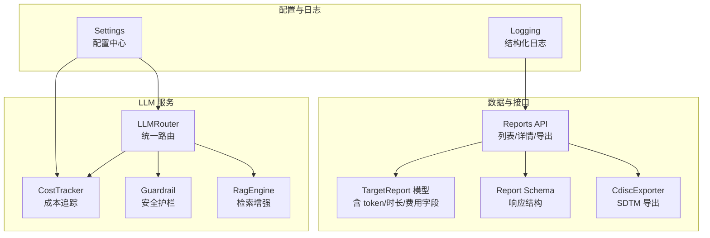
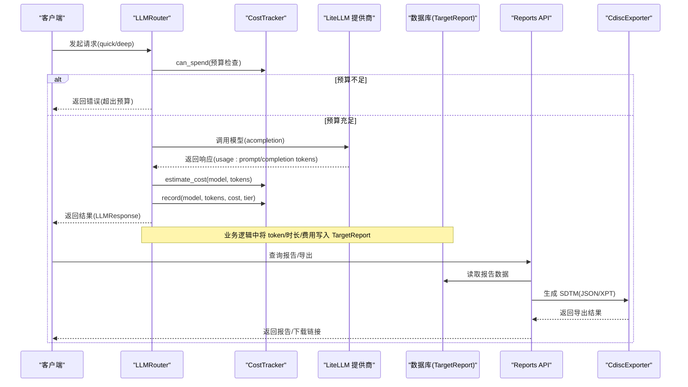
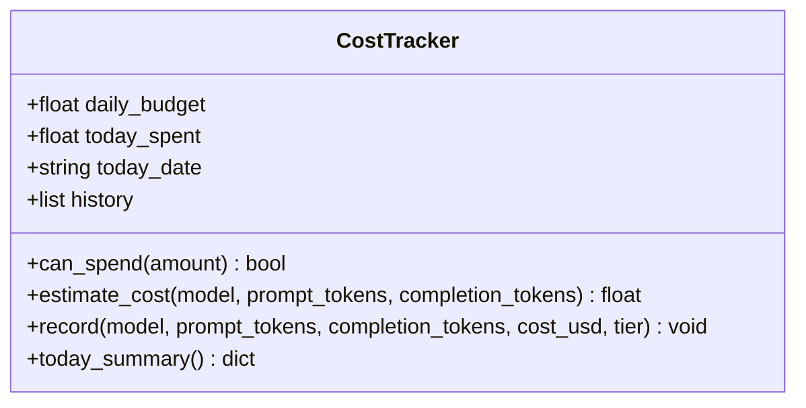
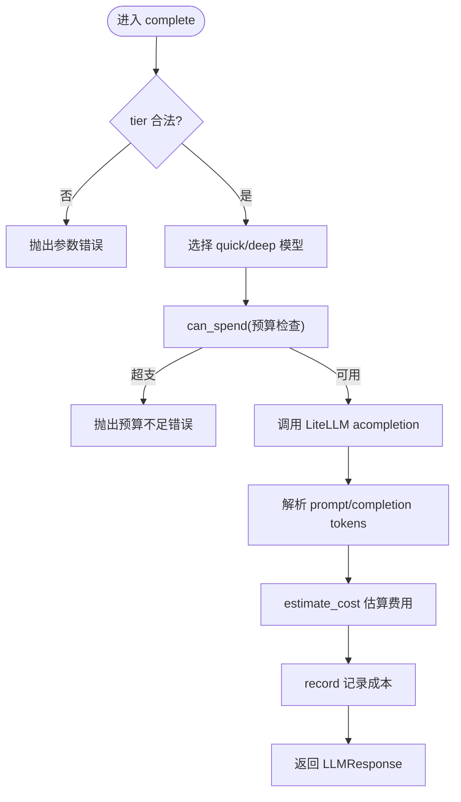
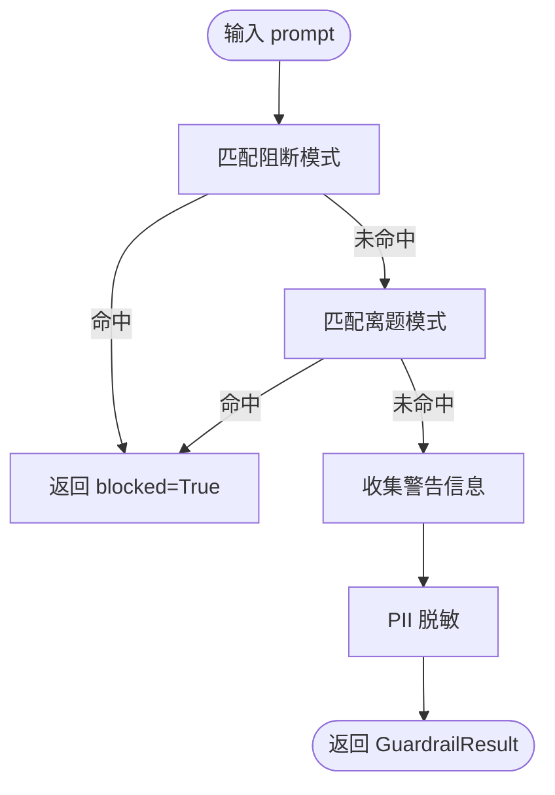
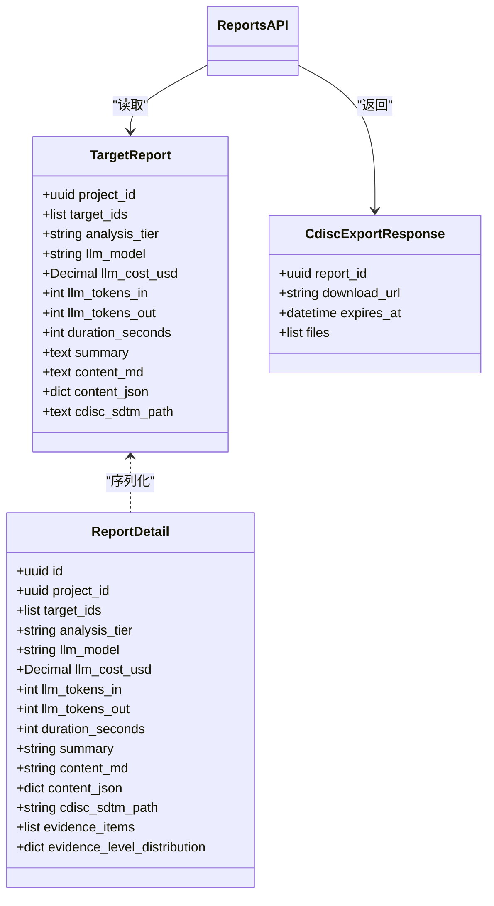
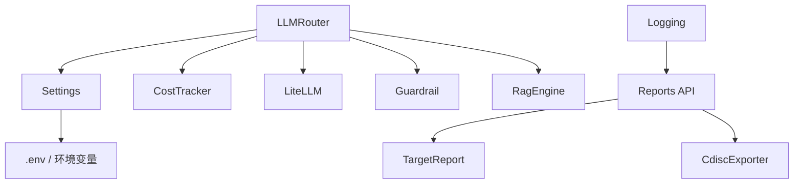

# 成本追踪系统

<cite>
**本文引用的文件列表**
- [cost_tracker.py](file://backend/app/services/llm/cost_tracker.py)
- [router.py](file://backend/app/services/llm/router.py)
- [guardrail.py](file://backend/app/services/llm/guardrail.py)
- [rag.py](file://backend/app/services/llm/rag.py)
- [config.py](file://backend/app/core/config.py)
- [logging.py](file://backend/app/core/logging.py)
- [report.py](file://backend/app/models/report.py)
- [report_schema.py](file://backend/app/schemas/report.py)
- [reports_api.py](file://backend/app/api/v1/reports.py)
- [cdisc_exporter.py](file://backend/app/services/report/cdisc_exporter.py)
- [test_cost_tracker.py](file://tests/test_cost_tracker.py)
</cite>

## 目录
1. [简介](#简介)
2. [项目结构](#项目结构)
3. [核心组件](#核心组件)
4. [架构总览](#架构总览)
5. [详细组件分析](#详细组件分析)
6. [依赖关系分析](#依赖关系分析)
7. [性能与优化](#性能与优化)
8. [故障排查指南](#故障排查指南)
9. [结论](#结论)
10. [附录](#附录)

## 简介
本技术文档围绕“成本追踪系统”展开，聚焦于 LLM 调用成本监控、多模型计费标准、用量统计与成本计算引擎。系统通过统一路由器接入多个大模型（OpenAI、Anthropic），在每次调用前后进行预算检查、token 计数与费用估算，并将关键指标持久化到数据库报告模型中，以便按项目、用户、模型维度进行分析与可视化。同时提供安全护栏、RAG 上下文注入、CDISC SDTM 导出等能力，形成从数据采集、计算、存储到报告的完整闭环。

## 项目结构
与成本追踪相关的代码主要分布在以下模块：
- 服务层：LLM 路由与成本追踪、安全护栏、检索增强生成
- 配置与日志：全局配置、结构化日志
- 数据模型与 API：报告模型、API 端点、导出器
- 测试：成本追踪器单元测试

图表来源
- [router.py:1-198](file://backend/app/services/llm/router.py#L1-L198)
- [cost_tracker.py:1-167](file://backend/app/services/llm/cost_tracker.py#L1-L167)
- [guardrail.py:1-168](file://backend/app/services/llm/guardrail.py#L1-L168)
- [rag.py:1-238](file://backend/app/services/llm/rag.py#L1-L238)
- [config.py:1-144](file://backend/app/core/config.py#L1-L144)
- [logging.py:1-93](file://backend/app/core/logging.py#L1-L93)
- [report.py:1-73](file://backend/app/models/report.py#L1-L73)
- [report_schema.py:1-59](file://backend/app/schemas/report.py#L1-L59)
- [reports_api.py:1-181](file://backend/app/api/v1/reports.py#L1-L181)
- [cdisc_exporter.py:1-187](file://backend/app/services/report/cdisc_exporter.py#L1-L187)

章节来源
- [router.py:1-198](file://backend/app/services/llm/router.py#L1-L198)
- [cost_tracker.py:1-167](file://backend/app/services/llm/cost_tracker.py#L1-L167)
- [config.py:1-144](file://backend/app/core/config.py#L1-L144)
- [logging.py:1-93](file://backend/app/core/logging.py#L1-L93)
- [report.py:1-73](file://backend/app/models/report.py#L1-L73)
- [report_schema.py:1-59](file://backend/app/schemas/report.py#L1-L59)
- [reports_api.py:1-181](file://backend/app/api/v1/reports.py#L1-L181)
- [cdisc_exporter.py:1-187](file://backend/app/services/report/cdisc_exporter.py#L1-L187)

## 核心组件
- 成本追踪器（CostTracker）
  - 维护每日预算上限、累计花费与历史记录
  - 支持按模型与层级（quick/deep）的汇总统计
  - 提供预算检查、单次费用估算与记录方法
- LLM 路由器（LLMRouter）
  - 基于 LiteLLM 的多模型统一调用
  - 自动选择 quick/deep 模型并执行预算检查
  - 解析 token 用量并估算成本，记录到追踪器
- 安全护栏（Guardrail）
  - 输入输出内容合规性检查与脱敏
  - 拦截违规提示词与不合规输出
- 检索增强（RagEngine）
  - 向量库检索或内存关键词检索
  - 为 LLM 构建上下文与引用源
- 配置与日志
  - Settings 集中管理 LLM 预算、模型映射等
  - 结构化日志便于审计与排障
- 报告模型与 API
  - TargetReport 模型包含 llm_model、llm_tokens_in/out、duration_seconds、llm_cost_usd 等字段
  - Reports API 提供分页查询、详情、CDISC 导出入口
- CDISC 导出器（CdiscExporter）
  - 将报告转换为 SDTM JSON/XPT 格式

章节来源
- [cost_tracker.py:1-167](file://backend/app/services/llm/cost_tracker.py#L1-L167)
- [router.py:1-198](file://backend/app/services/llm/router.py#L1-L198)
- [guardrail.py:1-168](file://backend/app/services/llm/guardrail.py#L1-L168)
- [rag.py:1-238](file://backend/app/services/llm/rag.py#L1-L238)
- [config.py:1-144](file://backend/app/core/config.py#L1-L144)
- [logging.py:1-93](file://backend/app/core/logging.py#L1-L93)
- [report.py:1-73](file://backend/app/models/report.py#L1-L73)
- [reports_api.py:1-181](file://backend/app/api/v1/reports.py#L1-L181)
- [cdisc_exporter.py:1-187](file://backend/app/services/report/cdisc_exporter.py#L1-L187)

## 架构总览
下图展示一次 LLM 调用的端到端流程，包括预算检查、token 计数、费用估算与记录，以及后续报告持久化与导出。

图表来源
- [router.py:92-171](file://backend/app/services/llm/router.py#L92-L171)
- [cost_tracker.py:68-166](file://backend/app/services/llm/cost_tracker.py#L68-L166)
- [reports_api.py:35-181](file://backend/app/api/v1/reports.py#L35-L181)
- [cdisc_exporter.py:28-88](file://backend/app/services/report/cdisc_exporter.py#L28-L88)
- [report.py:15-44](file://backend/app/models/report.py#L15-L44)

## 详细组件分析

### 成本追踪器（CostTracker）
- 功能要点
  - 维护每日预算与累计花费，支持日期切换重置
  - 提供 can_spend、estimate_cost、record、today_summary 等方法
  - 内置多模型单价表（input/output 分别计价），未知模型使用默认价格
- 数据结构与复杂度
  - _history 列表用于当日记录，today_summary 遍历 O(n)
  - 内存存储为主，预留 Redis 扩展接口（跨实例共享）
- 错误处理
  - 未知模型时记录警告并使用默认价格
  - 日期切换时清理历史与重置累计值
- 性能考量
  - 估算与记录均为常数时间操作
  - 汇总统计为线性时间，适合日粒度聚合

图表来源
- [cost_tracker.py:27-166](file://backend/app/services/llm/cost_tracker.py#L27-L166)

章节来源
- [cost_tracker.py:1-167](file://backend/app/services/llm/cost_tracker.py#L1-L167)
- [test_cost_tracker.py:1-77](file://tests/test_cost_tracker.py#L1-L77)

### LLM 路由器（LLMRouter）
- 功能要点
  - 根据 tier 选择 quick/deep 模型
  - 调用前进行预算检查，失败则拒绝
  - 解析 usage 中的 prompt/completion tokens，估算成本并记录
- 集成点
  - 依赖 Settings 获取模型名与预算上限
  - 延迟导入 litellm，避免未安装时启动失败
- 异常处理
  - 未安装 litellm 抛出运行时错误
  - 调用失败包装为运行时错误

图表来源
- [router.py:92-171](file://backend/app/services/llm/router.py#L92-L171)
- [config.py:54-60](file://backend/app/core/config.py#L54-L60)

章节来源
- [router.py:1-198](file://backend/app/services/llm/router.py#L1-L198)
- [config.py:1-144](file://backend/app/core/config.py#L1-L144)

### 安全护栏（Guardrail）
- 功能要点
  - 输入/输出规则匹配：禁止处方剂量、绝对化承诺、提示词注入等
  - 非医学话题拦截与敏感术语警告
  - PII 脱敏（手机号、身份证、邮箱）
- 使用场景
  - 在 LLM 调用前检查用户输入
  - 在返回结果后检查输出内容

图表来源
- [guardrail.py:70-145](file://backend/app/services/llm/guardrail.py#L70-L145)

章节来源
- [guardrail.py:1-168](file://backend/app/services/llm/guardrail.py#L1-L168)

### 检索增强（RagEngine）
- 功能要点
  - 优先使用 Chroma 向量库检索，不可用时降级为内存关键词检索
  - 构建上下文文本与引用源，供 LLM 使用
- 成本影响
  - 减少无关上下文，降低 prompt 长度与 token 消耗
  - 提升回答质量，间接优化成本效益

章节来源
- [rag.py:1-238](file://backend/app/services/llm/rag.py#L1-L238)

### 报告模型与 API
- 报告模型（TargetReport）
  - 包含 llm_model、llm_tokens_in、llm_tokens_out、duration_seconds、llm_cost_usd 等字段，支撑多维度成本分析
- API 端点
  - GET /reports：分页列出报告，支持按项目与分析层级过滤
  - GET /reports/{id}：详情（Markdown + JSON + 证据项分布）
  - GET /reports/{id}/cdisc：CDISC SDTM 导出入口
  - POST /reports/{id}/regenerate：异步重新生成任务
- 导出器（CdiscExporter）
  - 支持 SDTM JSON 导出，包含 TS/DM/AE/LB 域

图表来源
- [report.py:15-44](file://backend/app/models/report.py#L15-L44)
- [report_schema.py:16-50](file://backend/app/schemas/report.py#L16-L50)
- [reports_api.py:35-181](file://backend/app/api/v1/reports.py#L35-L181)

章节来源
- [report.py:1-73](file://backend/app/models/report.py#L1-L73)
- [report_schema.py:1-59](file://backend/app/schemas/report.py#L1-L59)
- [reports_api.py:1-181](file://backend/app/api/v1/reports.py#L1-L181)
- [cdisc_exporter.py:1-187](file://backend/app/services/report/cdisc_exporter.py#L1-L187)

## 依赖关系分析
- 组件耦合
  - LLMRouter 依赖 Settings 与 CostTracker；CostTracker 可依赖 Redis（当前实现以内存为主）
  - Reports API 依赖 TargetReport 模型与 CdiscExporter
  - Guardrail 与 RagEngine 作为横切能力被上层服务复用
- 外部依赖
  - LiteLLM：多模型统一调用
  - Chroma：向量检索（可选，具备降级策略）
  - Pydantic-settings：配置加载
  - loguru：结构化日志

图表来源
- [router.py:61-90](file://backend/app/services/llm/router.py#L61-L90)
- [config.py:136-144](file://backend/app/core/config.py#L136-L144)
- [logging.py:20-74](file://backend/app/core/logging.py#L20-L74)
- [reports_api.py:35-181](file://backend/app/api/v1/reports.py#L35-L181)

章节来源
- [router.py:1-198](file://backend/app/services/llm/router.py#L1-L198)
- [config.py:1-144](file://backend/app/core/config.py#L1-L144)
- [logging.py:1-93](file://backend/app/core/logging.py#L1-L93)
- [reports_api.py:1-181](file://backend/app/api/v1/reports.py#L1-L181)

## 性能与优化
- 缓存机制
  - RagEngine 在 Chroma 不可用时回退到内存关键词检索，保证可用性
  - 建议对高频查询结果进行短期缓存（如最近 top-k 上下文），减少重复检索与 token 消耗
- 请求合并
  - 对于批量相似查询，可在应用层合并上下文构建，减少多次 LLM 调用
- 模型选择优化
  - 简单任务走 quick 层，复杂推理走 deep 层，结合预算阈值动态调整
  - 未知模型采用默认价格估算，建议逐步完善定价表以降低误差
- 日志与监控
  - 使用结构化日志记录请求耗时、token 用量与费用，便于趋势分析与异常检测
  - 在响应头中附加 X-Response-Time-ms，便于前端与网关侧监控

[本节为通用指导，无需特定文件来源]

## 故障排查指南
- 常见错误
  - 预算不足：Router 在 can_spend 失败时抛出错误，需检查 Settings.llm_max_budget_usd 与今日累计花费
  - 模型不可用：LiteLLM 调用异常，检查网络与密钥配置
  - 未安装依赖：litellm/chromadb 缺失导致运行时错误，按提示安装
- 定位方法
  - 查看 logs/app_YYYY-MM-DD.log 与 logs/error_YYYY-MM-DD.log
  - 通过 Reports API 查询报告详情，核对 llm_tokens_in/out、duration_seconds、llm_cost_usd
  - 使用 today_summary 快速了解按模型与层级的费用分布
- 恢复建议
  - 临时提高预算或等待次日重置
  - 切换到备用模型或降级检索方式
  - 修正输入内容以通过安全护栏检查

章节来源
- [router.py:115-140](file://backend/app/services/llm/router.py#L115-L140)
- [cost_tracker.py:68-166](file://backend/app/services/llm/cost_tracker.py#L68-L166)
- [logging.py:20-74](file://backend/app/core/logging.py#L20-L74)
- [reports_api.py:76-120](file://backend/app/api/v1/reports.py#L76-L120)

## 结论
本成本追踪系统通过统一的 LLM 路由与成本追踪器，实现了多模型计费标准、实时预算控制与用量统计。报告模型与 API 提供了按项目、用户、模型的维度统计与导出能力，配合结构化日志与安全护栏，形成完整的成本控制与合规保障体系。建议在后续迭代中引入更完善的缓存与请求合并策略，持续优化模型选择与定价表，以提升整体成本效益。

[本节为总结性内容，无需特定文件来源]

## 附录
- 最佳实践
  - 合理设置 daily_budget 与 tier 预算，避免突发流量导致超支
  - 对高频查询启用上下文缓存，减少重复 token 消耗
  - 定期审查报告中的 by_model/by_tier 分布，识别高成本模型与任务
  - 建立异常成本检测规则（如单请求 token 激增、超时比例上升），触发告警
- 异常成本检测方案
  - 基于日志与报告数据，设定阈值（如单日费用超过预算 80%、单请求时长超过均值 3 倍）
  - 结合安全护栏的警告与阻断记录，关联异常输入与高成本输出
  - 使用 Reports API 的分页与过滤能力，快速定位问题报告与证据项

[本节为通用指导，无需特定文件来源]