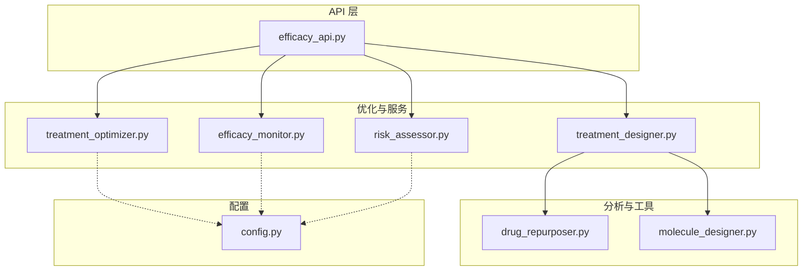
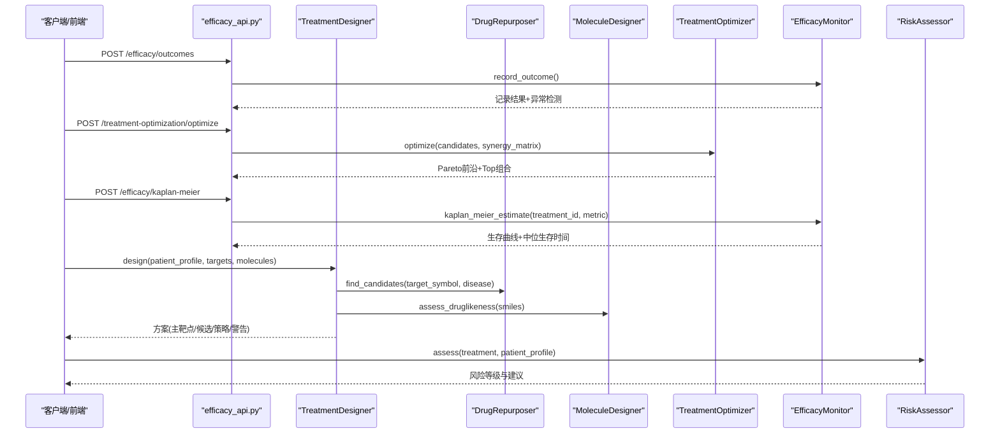
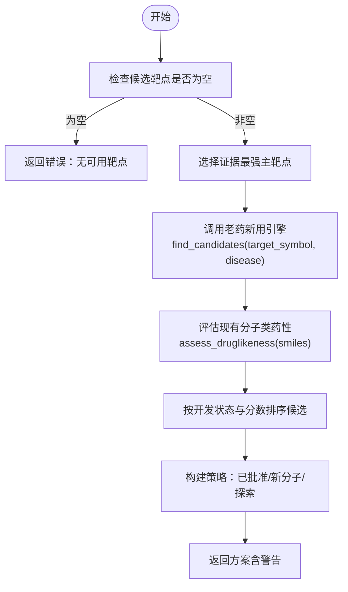
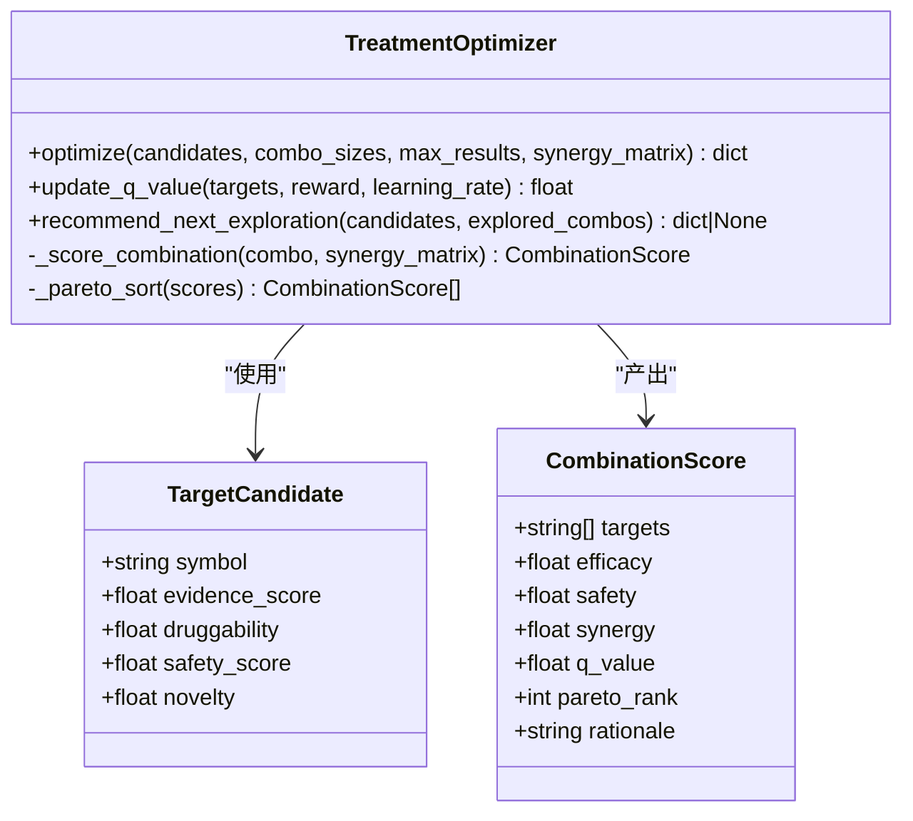
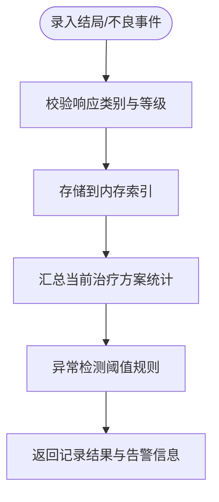
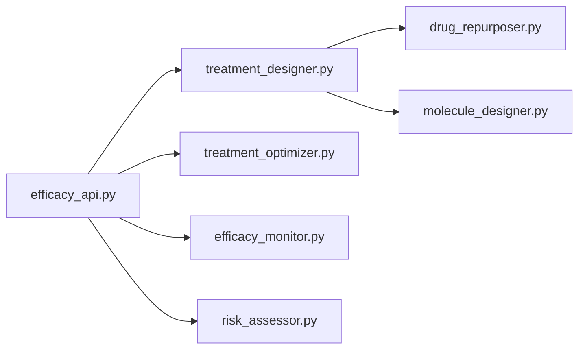

# 治疗方案优化

<cite>
**本文引用的文件**   
- [treatment_designer.py](file://precision-drug-design/backend/app/services/optimizer/treatment_designer.py)
- [treatment_optimizer.py](file://precision-drug-design/backend/app/services/optimizer/treatment_optimizer.py)
- [efficacy_monitor.py](file://precision-drug-design/backend/app/services/optimizer/efficacy_monitor.py)
- [risk_assessor.py](file://precision-drug-design/backend/app/services/optimizer/risk_assessor.py)
- [drug_repurposer.py](file://precision-drug-design/backend/app/services/analyzer/drug_repurposer.py)
- [molecule_designer.py](file://precision-drug-design/backend/app/services/analyzer/molecule_designer.py)
- [efficacy_api.py](file://precision-drug-design/backend/app/api/v1/efficacy.py)
- [config.py](file://precision-drug-design/backend/app/core/config.py)
- [test_treatment_designer.py](file://precision-drug-design/tests/test_treatment_designer.py)
- [test_risk_assessor.py](file://precision-drug-design/tests/test_risk_assessor.py)
</cite>

## 目录
1. [简介](#简介)
2. [项目结构](#项目结构)
3. [核心组件](#核心组件)
4. [架构总览](#架构总览)
5. [详细组件分析](#详细组件分析)
6. [依赖关系分析](#依赖关系分析)
7. [性能与可扩展性](#性能与可扩展性)
8. [故障排查指南](#故障排查指南)
9. [结论](#结论)
10. [附录：配置、约束与评估指标](#附录配置约束与评估指标)

## 简介
本技术文档围绕“治疗方案优化系统”的核心算法与工程实现，系统性阐述以下能力：
- 个性化治疗策略设计（TreatmentDesigner）
- 老药新用推荐（DrugRepurposer）
- 联合用药优化（TreatmentOptimizer）
- 疗效监测与生存分析（EfficacyMonitor）
- 风险预测与多维风险评估（RiskAssessor）
- 强化学习在方案优化中的应用（Q-learning 启发式 + UCB 探索）
- 临床决策支持系统集成方式与实际应用场景

目标读者包括算法工程师、后端开发者、临床研究数据分析师以及希望理解系统原理的临床决策支持使用者。

## 项目结构
与治疗方案优化相关的代码主要位于后端服务层 optimizer 与 analyzer 子模块，并通过 API 暴露给前端或外部系统。关键路径如下：
- 优化器与服务：backend/app/services/optimizer/*
- 分析与分子工具：backend/app/services/analyzer/*
- 对外接口：backend/app/api/v1/efficacy.py
- 全局配置：backend/app/core/config.py
- 测试用例：tests/*



图表来源
- [efficacy_api.py:1-347](file://precision-drug-design/backend/app/api/v1/efficacy.py#L1-L347)
- [treatment_designer.py:1-146](file://precision-drug-design/backend/app/services/optimizer/treatment_designer.py#L1-L146)
- [treatment_optimizer.py:1-363](file://precision-drug-design/backend/app/services/optimizer/treatment_optimizer.py#L1-L363)
- [efficacy_monitor.py:1-407](file://precision-drug-design/backend/app/services/optimizer/efficacy_monitor.py#L1-L407)
- [risk_assessor.py:1-155](file://precision-drug-design/backend/app/services/optimizer/risk_assessor.py#L1-L155)
- [drug_repurposer.py:1-124](file://precision-drug-design/backend/app/services/analyzer/drug_repurposer.py#L1-L124)
- [molecule_designer.py:1-689](file://precision-drug-design/backend/app/services/analyzer/molecule_designer.py#L1-L689)
- [config.py:1-144](file://precision-drug-design/backend/app/core/config.py#L1-L144)

章节来源
- [efficacy_api.py:1-347](file://precision-drug-design/backend/app/api/v1/efficacy.py#L1-L347)
- [config.py:1-144](file://precision-drug-design/backend/app/core/config.py#L1-L144)

## 核心组件
- TreatmentDesigner：整合患者画像、靶点列表与候选分子，输出个性化治疗方案（主靶点、老药新用候选、类药性评估结果、策略建议）。
- DrugRepurposer：基于 ChEMBL 等知识库进行老药新用候选发现（按靶点匹配、适应症匹配、去重与排序）。
- MoleculeDesigner：提供分子类药性评估（Lipinski/Veber/QED）、ADMET 性质预测（DeepChem 优先，规则降级）、相似性与生成式分子设计。
- TreatmentOptimizer：多靶点组合优化，采用 Q-learning 启发式评分、Pareto 前沿选择与 ε-贪心探索，并支持 UCB 推荐下一步探索。
- EfficacyMonitor：患者结局录入、不良事件追踪、ORR/DCR/PFS/OS 统计、异常结局检测与 Kaplan-Meier 生存估计。
- RiskAssessor：从靶点安全性、分子安全性、患者特异性、证据强度四个维度进行综合风险评估与建议。

章节来源
- [treatment_designer.py:1-146](file://precision-drug-design/backend/app/services/optimizer/treatment_designer.py#L1-L146)
- [drug_repurposer.py:1-124](file://precision-drug-design/backend/app/services/analyzer/drug_repurposer.py#L1-L124)
- [molecule_designer.py:1-689](file://precision-drug-design/backend/app/services/analyzer/molecule_designer.py#L1-L689)
- [treatment_optimizer.py:1-363](file://precision-drug-design/backend/app/services/optimizer/treatment_optimizer.py#L1-L363)
- [efficacy_monitor.py:1-407](file://precision-drug-design/backend/app/services/optimizer/efficacy_monitor.py#L1-L407)
- [risk_assessor.py:1-155](file://precision-drug-design/backend/app/services/optimizer/risk_assessor.py#L1-L155)

## 架构总览
系统以 FastAPI 为入口，调用优化与服务模块完成方案设计、组合优化、疗效监测与风险评估；同时通过外部知识库（ChEMBL）与分子计算库（RDKit/DeepChem）增强候选发现与评估能力。



图表来源
- [efficacy_api.py:1-347](file://precision-drug-design/backend/app/api/v1/efficacy.py#L1-L347)
- [treatment_designer.py:1-146](file://precision-drug-design/backend/app/services/optimizer/treatment_designer.py#L1-L146)
- [drug_repurposer.py:1-124](file://precision-drug-design/backend/app/services/analyzer/drug_repurposer.py#L1-L124)
- [molecule_designer.py:1-689](file://precision-drug-design/backend/app/services/analyzer/molecule_designer.py#L1-L689)
- [treatment_optimizer.py:1-363](file://precision-drug-design/backend/app/services/optimizer/treatment_optimizer.py#L1-L363)
- [efficacy_monitor.py:1-407](file://precision-drug-design/backend/app/services/optimizer/efficacy_monitor.py#L1-L407)
- [risk_assessor.py:1-155](file://precision-drug-design/backend/app/services/optimizer/risk_assessor.py#L1-L155)

## 详细组件分析

### 个性化治疗策略设计（TreatmentDesigner）
- 输入：患者画像（年龄、性别、基因突变、既往用药、疾病类型等）、候选靶点列表、已有候选分子（SMILES 等）。
- 处理流程：
  - 选择证据最强的主靶点。
  - 调用 DrugRepurposer 基于主靶点与疾病关键词检索已批准或接近批准的候选药物。
  - 对现有候选分子进行类药性评估（Lipinski/Veber/QED），过滤不合规分子。
  - 构建策略：优先已批准老药新用，其次类药性良好的新分子，否则进入探索阶段。
- 输出：主靶点、候选药物、评估分子、策略描述与风险提示。



图表来源
- [treatment_designer.py:1-146](file://precision-drug-design/backend/app/services/optimizer/treatment_designer.py#L1-L146)
- [drug_repurposer.py:1-124](file://precision-drug-design/backend/app/services/analyzer/drug_repurposer.py#L1-L124)
- [molecule_designer.py:1-689](file://precision-drug-design/backend/app/services/analyzer/molecule_designer.py#L1-134)

章节来源
- [treatment_designer.py:1-146](file://precision-drug-design/backend/app/services/optimizer/treatment_designer.py#L1-L146)
- [test_treatment_designer.py:1-206](file://precision-drug-design/tests/test_treatment_designer.py#L1-L206)

### 老药新用推荐（DrugRepurposer）
- 策略：
  - 靶点匹配：根据 target_symbol 查询已知药物。
  - 适应症匹配：若提供 disease，则查询相关已批准药物。
  - 去重与排序：按 chembl_id 去重，按 score 降序。
- 输出：候选药物列表（包含名称、首次批准年份、开发状态、来源与分数）。

章节来源
- [drug_repurposer.py:1-124](file://precision-drug-design/backend/app/services/analyzer/drug_repurposer.py#L1-L124)

### 联合用药优化（TreatmentOptimizer）
- 目标：在多靶点空间中寻找有效性、安全性与协同效应的平衡解。
- 方法：
  - 枚举组合：支持大小 k ∈ {1,2,3} 的组合搜索。
  - 评分函数：Q(s,a) = α·efficacy + β·safety + γ·synergy − δ·complexity。
  - Pareto 前沿：在 (efficacy, safety) 二维空间筛选非支配解。
  - 探索策略：ε-贪心选择 Top-K 中的随机项，避免局部最优。
  - UCB 推荐：结合访问次数与 Q 值推荐下一个探索组合。
- 数据结构：TargetCandidate（symbol/evidence_score/druggability/safety_score/novelty）、CombinationScore（targets/efficacy/safety/synergy/q_value/pareto_rank/rationale）。



图表来源
- [treatment_optimizer.py:1-363](file://precision-drug-design/backend/app/services/optimizer/treatment_optimizer.py#L1-L363)

章节来源
- [treatment_optimizer.py:1-363](file://precision-drug-design/backend/app/services/optimizer/treatment_optimizer.py#L1-L363)

### 疗效监测（EfficacyMonitor）
- 功能：
  - 患者结局录入（CR/PR/SD/PD/Unknown），自动记录时间戳。
  - 不良事件上报（CTCAE v5.0 分级），严重事件自动标记。
  - 汇总统计：ORR、DCR、中位 PFS/OS、AE 发生率、停药率。
  - 异常检测：低 ORR、高严重 AE 率、高停药率触发告警。
  - Kaplan-Meier 生存估计：返回生存曲线与中位生存时间。
- 数据结构：PatientOutcome、AdverseEvent、EfficacySummary。



图表来源
- [efficacy_monitor.py:1-407](file://precision-drug-design/backend/app/services/optimizer/efficacy_monitor.py#L1-L407)

章节来源
- [efficacy_monitor.py:1-407](file://precision-drug-design/backend/app/services/optimizer/efficacy_monitor.py#L1-L407)

### 风险预测（RiskAssessor）
- 维度：
  - 靶点安全性：依据证据数量与质量划分低/中/高风险。
  - 分子安全性：是否含已批准药物、类药性是否良好。
  - 患者特异性：合并症、合并用药、高龄、肾功能不全等。
  - 证据强度：高质量证据（I/II级）数量。
- 输出：整体风险分数与等级、各维度详情、缓解建议。

章节来源
- [risk_assessor.py:1-155](file://precision-drug-design/backend/app/services/optimizer/risk_assessor.py#L1-L155)
- [test_risk_assessor.py:1-154](file://precision-drug-design/tests/test_risk_assessor.py#L1-L154)

### 强化学习在治疗方案优化中的应用
- 状态空间 s：由组合的靶点集合表示（如 (A,B,C)）。
- 动作空间 a：在当前状态下选择某个组合（或下一步探索的组合）。
- 奖励函数 r：来自临床观测（如响应率、安全性改善），用于更新 Q 表。
- 策略：
  - Q 值近似：Q(s,a) = α·efficacy + β·safety + γ·synergy − δ·complexity。
  - 探索利用：ε-贪心与 UCB 平衡探索与利用。
  - 持久化：get_q_table()/update_q_value() 支持在线学习与离线回放。

```mermaid
sequenceDiagram
participant Opt as "TreatmentOptimizer"
participant API as "efficacy_api.py"
participant Clin as "临床观测数据"
API->>Opt : optimize(candidates, synergy_matrix)
Opt-->>API : 返回 Pareto 前沿与 Top 组合
API->>Clin : 收集实际响应/安全性反馈
Clin-->>API : 奖励 reward
API->>Opt : update_q_value(targets, reward, lr)
Opt-->>API : 更新后的 Q 值
```

图表来源
- [treatment_optimizer.py:1-363](file://precision-drug-design/backend/app/services/optimizer/treatment_optimizer.py#L1-L363)
- [efficacy_api.py:1-347](file://precision-drug-design/backend/app/api/v1/efficacy.py#L1-L347)

章节来源
- [treatment_optimizer.py:1-363](file://precision-drug-design/backend/app/services/optimizer/treatment_optimizer.py#L1-L363)
- [efficacy_api.py:1-347](file://precision-drug-design/backend/app/api/v1/efficacy.py#L1-L347)

### 分子设计与老药新用集成
- 分子设计：
  - 类药性评估：Lipinski 五规则、Veber 规则、QED。
  - ADMET 预测：DeepChem 预训练模型优先，不可用时回退至规则模型（ESOL 溶解度、口服生物利用度、BBB 通透性等）。
  - 相似性与生成：Tanimoto 相似度、片段组装与参考分子优化。
- 老药新用：
  - 基于 ChEMBL 的靶点与适应症检索，去重后按分数排序。

章节来源
- [molecule_designer.py:1-689](file://precision-drug-design/backend/app/services/analyzer/molecule_designer.py#L1-689)
- [drug_repurposer.py:1-124](file://precision-drug-design/backend/app/services/analyzer/drug_repurposer.py#L1-L124)

## 依赖关系分析
- 组件耦合：
  - TreatmentDesigner 依赖 DrugRepurposer 与 MoleculeDesigner。
  - API 层统一编排 EfficacyMonitor、TreatmentOptimizer、DataMasker 等。
  - TreatmentOptimizer 内部维护 Q 表，支持在线更新。
- 外部依赖：
  - RDKit/DeepChem（分子计算与性质预测）。
  - ChEMBL（老药新用候选检索）。
  - NVIDIA NIM DiffDock（分子对接，可降级占位）。
- 潜在循环依赖：未发现直接循环导入；模块职责清晰。



图表来源
- [efficacy_api.py:1-347](file://precision-drug-design/backend/app/api/v1/efficacy.py#L1-L347)
- [treatment_designer.py:1-146](file://precision-drug-design/backend/app/services/optimizer/treatment_designer.py#L1-L146)
- [treatment_optimizer.py:1-363](file://precision-drug-design/backend/app/services/optimizer/treatment_optimizer.py#L1-L363)
- [efficacy_monitor.py:1-407](file://precision-drug-design/backend/app/services/optimizer/efficacy_monitor.py#L1-L407)
- [risk_assessor.py:1-155](file://precision-drug-design/backend/app/services/optimizer/risk_assessor.py#L1-L155)
- [drug_repurposer.py:1-124](file://precision-drug-design/backend/app/services/analyzer/drug_repurposer.py#L1-L124)
- [molecule_designer.py:1-689](file://precision-drug-design/backend/app/services/analyzer/molecule_designer.py#L1-689)

章节来源
- [efficacy_api.py:1-347](file://precision-drug-design/backend/app/api/v1/efficacy.py#L1-L347)

## 性能与可扩展性
- 组合搜索复杂度：C(n,k) 随 n 增长呈指数上升，建议限制 combo_sizes 与候选规模。
- Q 表规模：随组合数增加而增大，需定期持久化与清理。
- 分子计算：RDKit/DeepChem 加载耗时，采用惰性加载与降级策略提升启动速度。
- 外部 API：ChEMBL/NVIDIA NIM 失败时具备降级逻辑，保障可用性。
- 扩展建议：
  - 引入并行化与缓存（如组合评分缓存、分子属性缓存）。
  - 将 Q 表迁移至 Redis/数据库以实现跨进程共享。
  - 使用更高效的 Pareto 排序算法（如快速非支配排序）。

[本节为通用指导，无需具体文件引用]

## 故障排查指南
- 常见错误与定位：
  - 无效 SMILES：分子评估返回 valid=False，检查输入 SMILES 合法性。
  - DeepChem 未安装：性质预测降级为规则模型，查看日志提示。
  - ChEMBL 查询失败：网络或权限问题，检查 API Key 与基础 URL。
  - NVIDIA NIM 不可用：返回降级占位响应，确认环境变量与网络连通。
- 日志与监控：
  - 使用 loguru 记录关键步骤与异常，便于回溯。
  - 通过 API 元信息 request_id 关联请求链路。

章节来源
- [molecule_designer.py:1-689](file://precision-drug-design/backend/app/services/analyzer/molecule_designer.py#L1-689)
- [drug_repurposer.py:1-124](file://precision-drug-design/backend/app/services/analyzer/drug_repurposer.py#L1-L124)
- [efficacy_api.py:1-347](file://precision-drug-design/backend/app/api/v1/efficacy.py#L1-L347)

## 结论
本系统以模块化架构实现了从个性化方案设计、老药新用推荐、联合用药优化到疗效监测与风险评估的全流程支撑。通过 Q-learning 启发式与 Pareto 前沿选择，系统在有效性、安全性与协同效应之间取得平衡；借助 RDKit/DeepChem 与 ChEMBL 等外部资源，增强了候选发现与评估能力。未来可通过在线学习、并行化与持久化进一步提升性能与实用性。

[本节为总结，无需具体文件引用]

## 附录：配置、约束与评估指标

### 配置参数（部分）
- 应用与环境：app_name、app_env、app_debug、app_host、app_port、app_log_level
- 数据库与缓存：database_url、redis_url
- 对象存储：s3_endpoint、s3_access_key、s3_secret_key、s3_bucket、s3_region
- LLM：openai_api_key、anthropic_api_key、llm_default_model、llm_deep_model、预算控制
- NVIDIA NIM：nim_api_key、nim_diffdock_url
- 外部知识库：mygene_base_url、myvariant_base_url、chembl_base_url、pubmed_base_url、clinical_trials_url
- NCBI：ncbi_email
- 认证：jwt_* 系列
- CORS：cors_origins
- 联邦学习：flower_server_address、flower_num_rounds
- PySyft：pysyft_domain_port、pysyft_domain_name
- CDISC：cdisc_sdtm_output_dir、pinnacle21_jar_path
- 干湿闭环：lims_api_url、lims_api_token
- 数据处理：scanpy_n_jobs、scanpy_use_dask、dask_dashboard_address
- 数据目录：data_raw_dir、data_processed_dir

章节来源
- [config.py:1-144](file://precision-drug-design/backend/app/core/config.py#L1-L144)

### 约束条件
- 组合大小限制：combo_sizes 默认 [1,2,3]，可根据临床需求调整。
- 权重系数：alpha/beta/gamma/delta 控制有效性、安全性、协同效应与复杂度惩罚。
- 探索概率：epsilon 控制 ε-贪心探索强度。
- 类药性约束：Lipinski 五规则与 Veber 规则作为过滤条件。
- 严重事件阈值：CTCAE grade ≥3 自动判定为严重不良事件。
- 异常检测阈值：ORR < 20%、严重 AE 率 > 30%、停药率 > 20% 触发告警。

章节来源
- [treatment_optimizer.py:1-363](file://precision-drug-design/backend/app/services/optimizer/treatment_optimizer.py#L1-L363)
- [efficacy_monitor.py:1-407](file://precision-drug-design/backend/app/services/optimizer/efficacy_monitor.py#L1-L407)
- [molecule_designer.py:1-689](file://precision-drug-design/backend/app/services/analyzer/molecule_designer.py#L1-134)

### 评估指标
- 疗效：ORR（客观缓解率）、DCR（疾病控制率）、中位 PFS/OS。
- 安全性：AE 发生率、严重 AE 率、因 AE 停药率。
- 优化质量：Pareto 前沿分布、Q 值收敛趋势、UCB 探索效率。
- 风险等级：低/中/高三级，综合各维度得分。

章节来源
- [efficacy_monitor.py:1-407](file://precision-drug-design/backend/app/services/optimizer/efficacy_monitor.py#L1-L407)
- [treatment_optimizer.py:1-363](file://precision-drug-design/backend/app/services/optimizer/treatment_optimizer.py#L1-L363)
- [risk_assessor.py:1-155](file://precision-drug-design/backend/app/services/optimizer/risk_assessor.py#L1-L155)

### 临床决策支持系统集成与应用场景
- 集成方式：
  - 通过 REST API 暴露疗效监测与优化能力，供电子病历系统、临床试验管理平台或研究平台调用。
  - 使用 DataMasker 进行 HIPAA Safe Harbor 脱敏，满足隐私合规要求。
- 应用场景：
  - 肿瘤学：基于靶点与分子特征生成个体化联合用药方案，持续跟踪疗效与安全信号。
  - 罕见病：老药新用快速筛选，缩短研发周期。
  - 真实世界研究：结合队列数据在线更新 Q 值，形成闭环优化。

章节来源
- [efficacy_api.py:1-347](file://precision-drug-design/backend/app/api/v1/efficacy.py#L1-L347)