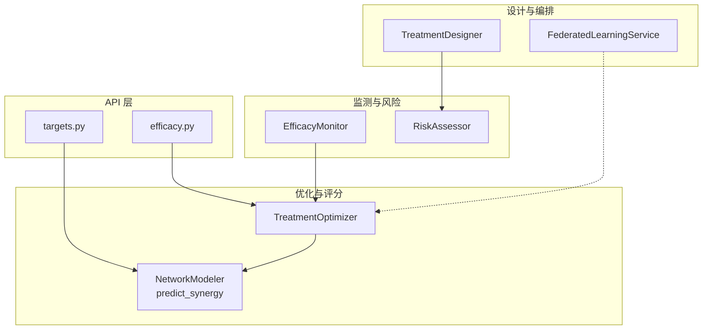
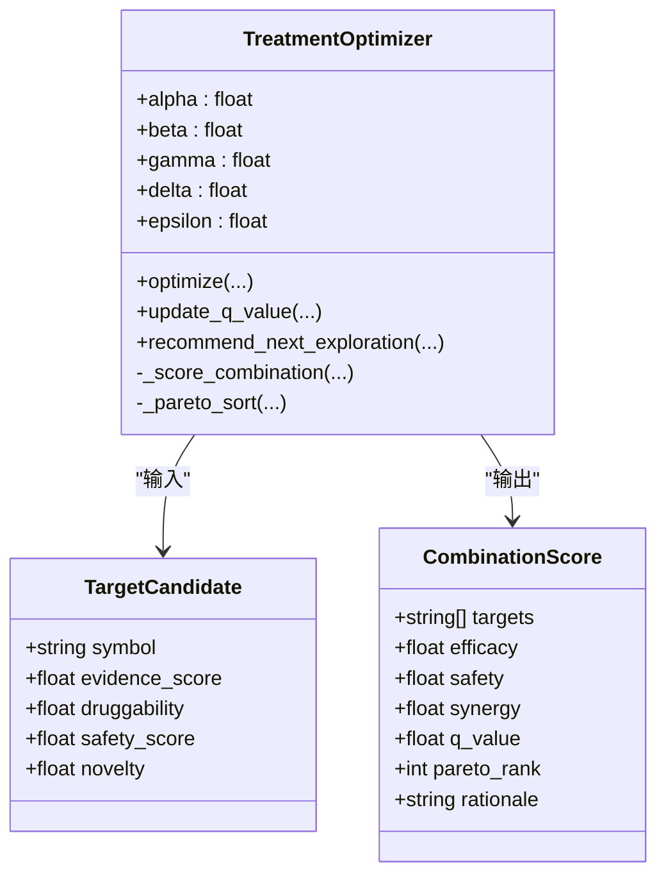
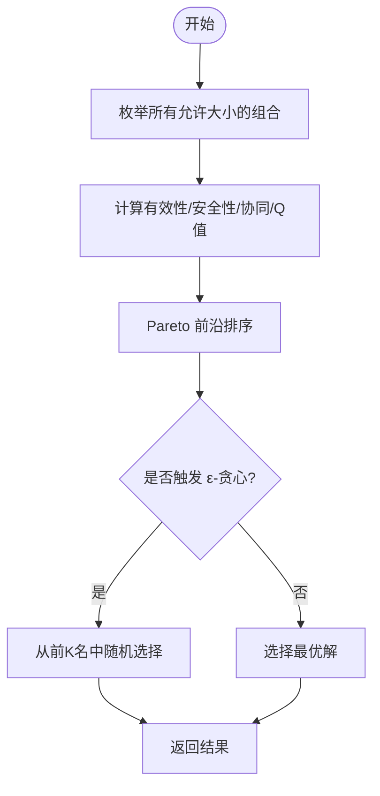
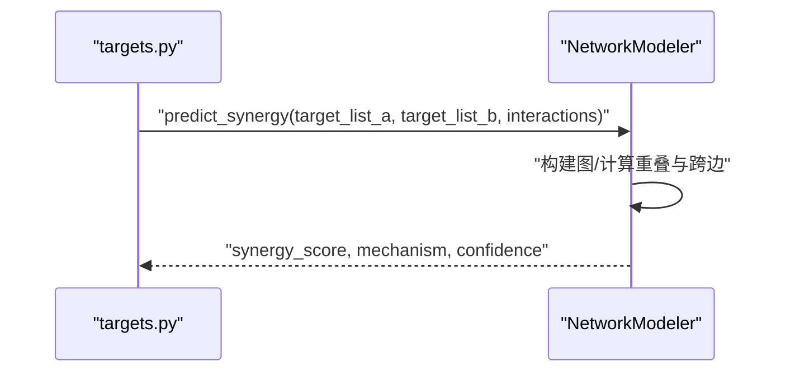
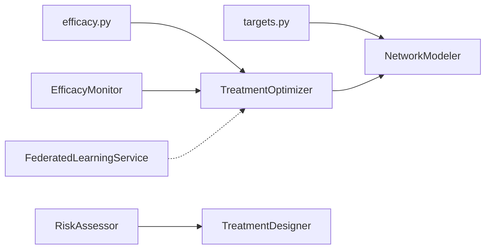

# 治疗方案优化器

<cite>
**本文引用的文件**   
- [treatment_optimizer.py](file://backend/app/services/optimizer/treatment_optimizer.py)
- [network_modeler.py](file://backend/app/services/analyzer/network_modeler.py)
- [efficacy_monitor.py](file://backend/app/services/optimizer/efficacy_monitor.py)
- [risk_assessor.py](file://backend/app/services/optimizer/risk_assessor.py)
- [treatment_designer.py](file://backend/app/services/optimizer/treatment_designer.py)
- [federated_learning.py](file://backend/app/services/optimizer/federated_learning.py)
- [efficacy.py](file://backend/app/api/v1/efficacy.py)
- [targets.py](file://backend/app/api/v1/targets.py)
- [test_treatment_designer.py](file://tests/test_treatment_designer.py)
- [test_p3_features.py](file://tests/test_p3_features.py)
</cite>

## 目录
1. [简介](#简介)
2. [项目结构](#项目结构)
3. [核心组件](#核心组件)
4. [架构总览](#架构总览)
5. [详细组件分析](#详细组件分析)
6. [依赖关系分析](#依赖关系分析)
7. [性能与调优](#性能与调优)
8. [故障排查指南](#故障排查指南)
9. [结论](#结论)
10. [附录](#附录)

## 简介
本技术文档围绕“治疗方案优化器”展开，聚焦 TreatmentOptimizer 的多目标优化算法实现、联合用药协同建模、疗效监测闭环以及强化学习（RL）在方案迭代中的应用。文档同时覆盖权重配置、约束条件、收敛判断、性能优化技巧与调试方法，帮助研发与临床工程团队快速理解并落地使用。

## 项目结构
与治疗方案优化相关的核心代码位于后端服务模块 optimizer 与 analyzer 子包中，并通过 API 层对外暴露能力：
- 优化与评分：TreatmentOptimizer（多目标组合搜索、Pareto 前沿、Q 表更新、UCB 探索）
- 协同效应预测：NetworkModeler.predict_synergy（网络重叠度、跨边连接数等启发式）
- 疗效监测：EfficacyMonitor（RECIST 响应、CTCAE AE、KM 生存估计占位）
- 风险评估：RiskAssessor（靶点安全性、分子类药性、患者特异性、证据强度）
- 方案设计：TreatmentDesigner（老药新用候选、类药性评估、策略建议）
- 联邦学习：FederatedLearningService（任务编排、客户端注册、轮次指标追踪）
- API 集成：efficacy.py（优化接口）、targets.py（协同预测接口）



图表来源
- [treatment_optimizer.py:66-165](file://backend/app/services/optimizer/treatment_optimizer.py#L66-L165)
- [network_modeler.py:271-333](file://backend/app/services/analyzer/network_modeler.py#L271-L333)
- [efficacy_monitor.py:114-157](file://backend/app/services/optimizer/efficacy_monitor.py#L114-L157)
- [risk_assessor.py:15-64](file://backend/app/services/optimizer/risk_assessor.py#L15-L64)
- [treatment_designer.py:17-101](file://backend/app/services/optimizer/treatment_designer.py#L17-L101)
- [federated_learning.py:53-199](file://backend/app/services/optimizer/federated_learning.py#L53-L199)
- [efficacy.py:254-282](file://backend/app/api/v1/efficacy.py#L254-L282)
- [targets.py:323-343](file://backend/app/api/v1/targets.py#L323-L343)

章节来源
- [treatment_optimizer.py:66-165](file://backend/app/services/optimizer/treatment_optimizer.py#L66-L165)
- [network_modeler.py:271-333](file://backend/app/services/analyzer/network_modeler.py#L271-L333)
- [efficacy_monitor.py:114-157](file://backend/app/services/optimizer/efficacy_monitor.py#L114-L157)
- [risk_assessor.py:15-64](file://backend/app/services/optimizer/risk_assessor.py#L15-L64)
- [treatment_designer.py:17-101](file://backend/app/services/optimizer/treatment_designer.py#L17-L101)
- [federated_learning.py:53-199](file://backend/app/services/optimizer/federated_learning.py#L53-L199)
- [efficacy.py:254-282](file://backend/app/api/v1/efficacy.py#L254-L282)
- [targets.py:323-343](file://backend/app/api/v1/targets.py#L323-L343)

## 核心组件
- 多目标优化器（TreatmentOptimizer）
  - 目标函数：Q(s,a) = α·有效性 + β·安全性 + γ·协同 − δ·复杂度
  - 搜索策略：枚举 C(n,k) 组合；ε-贪心选择；Pareto 前沿排序
  - 强化学习：Q 表维护与在线更新；UCB 推荐下一探索组合
- 协同效应预测（NetworkModeler.predict_synergy）
  - 基于网络重叠度（Jaccard）、跨组合连接数、规模因子计算协同分数
  - 机制推断：功能冗余/通路互补/独立机制
- 疗效监测（EfficacyMonitor）
  - RECIST 响应类别、CTCAE 不良事件分级
  - ORR/DCR/PFS/OS 统计、异常结局检测、KM 生存估计占位
- 风险评估（RiskAssessor）
  - 靶点安全性、分子类药性、患者特异性、证据强度四维评估
- 方案设计（TreatmentDesigner）
  - 主靶点选择、老药新用候选、类药性筛选、策略优先级建议
- 联邦学习（FederatedLearningService）
  - 任务创建、客户端注册、训练轮次指标记录与状态流转

章节来源
- [treatment_optimizer.py:66-165](file://backend/app/services/optimizer/treatment_optimizer.py#L66-L165)
- [network_modeler.py:271-333](file://backend/app/services/analyzer/network_modeler.py#L271-L333)
- [efficacy_monitor.py:114-157](file://backend/app/services/optimizer/efficacy_monitor.py#L114-L157)
- [risk_assessor.py:15-64](file://backend/app/services/optimizer/risk_assessor.py#L15-L64)
- [treatment_designer.py:17-101](file://backend/app/services/optimizer/treatment_designer.py#L17-L101)
- [federated_learning.py:53-199](file://backend/app/services/optimizer/federated_learning.py#L53-L199)

## 架构总览
下图展示从 API 到优化器、协同预测、疗效反馈的端到端流程，体现“设计—优化—评估—再优化”的闭环。

```mermaid
sequenceDiagram
participant Client as "调用方"
participant API as "efficacy.py"
participant Opt as "TreatmentOptimizer"
participant Net as "NetworkModeler"
participant Mon as "EfficacyMonitor"
Client->>API : "提交候选靶点/组合大小/权重"
API->>Opt : "optimize(candidates, combo_sizes, synergy_matrix)"
Opt->>Net : "可选：协同矩阵或内部默认协同"
Net-->>Opt : "协同评分/机制说明"
Opt-->>API : "Pareto 前沿、Top 组合、Q 表统计"
API-->>Client : "返回优化结果"
Note over Client,Mon : "后续可录入疗效与AE，驱动Q值更新与探索策略"
```

图表来源
- [efficacy.py:254-282](file://backend/app/api/v1/efficacy.py#L254-L282)
- [treatment_optimizer.py:102-165](file://backend/app/services/optimizer/treatment_optimizer.py#L102-L165)
- [network_modeler.py:271-333](file://backend/app/services/analyzer/network_modeler.py#L271-L333)
- [efficacy_monitor.py:114-157](file://backend/app/services/optimizer/efficacy_monitor.py#L114-L157)

## 详细组件分析

### 多目标优化器（TreatmentOptimizer）
- 数据模型
  - TargetCandidate：包含 symbol、evidence_score、druggability、safety_score、novelty
  - CombinationScore：包含 targets、efficacy、safety、synergy、q_value、pareto_rank、rationale
- 优化流程
  - 枚举允许的组合大小（默认 1/2/3），对每个组合计算有效性、安全性、协同与 Q 值
  - Pareto 前沿排序（以 efficacy 与 safety 为双目标），同一前沿内按 Q 值降序
  - ε-贪心：以概率 ε 在前 K 名中随机选择，否则选最优
  - Q 表维护：键为排序后的靶点元组，值为 Q 值；支持在线 update_q_value
  - UCB 探索：recommend_next_exploration 基于访问次数与 Q 值推荐下一个 2-靶点组合
- 关键公式与逻辑
  - 有效性：平均证据强度 × 0.5 + 平均可成药性 × 0.5
  - 安全性：平均安全分 − δ·(组合大小−1)，下界 0
  - 协同：优先使用外部 synergy_matrix，否则以新颖性互补作为默认协同
  - Q 值：α·efficacy + β·safety + γ·synergy − δ·复杂度惩罚，裁剪至 [0,1]
  - Pareto 支配：若另一解在两个目标均不劣且至少一个严格更优，则当前解被支配
  - UCB：Q + c·sqrt(ln(N)/n_a)，c=√2，未访问组合赋予无穷大上界



图表来源
- [treatment_optimizer.py:24-64](file://backend/app/services/optimizer/treatment_optimizer.py#L24-L64)
- [treatment_optimizer.py:66-165](file://backend/app/services/optimizer/treatment_optimizer.py#L66-L165)
- [treatment_optimizer.py:167-230](file://backend/app/services/optimizer/treatment_optimizer.py#L167-L230)
- [treatment_optimizer.py:232-266](file://backend/app/services/optimizer/treatment_optimizer.py#L232-L266)
- [treatment_optimizer.py:285-309](file://backend/app/services/optimizer/treatment_optimizer.py#L285-L309)
- [treatment_optimizer.py:311-362](file://backend/app/services/optimizer/treatment_optimizer.py#L311-L362)



图表来源
- [treatment_optimizer.py:102-165](file://backend/app/services/optimizer/treatment_optimizer.py#L102-L165)
- [treatment_optimizer.py:167-230](file://backend/app/services/optimizer/treatment_optimizer.py#L167-L230)
- [treatment_optimizer.py:232-266](file://backend/app/services/optimizer/treatment_optimizer.py#L232-L266)

章节来源
- [treatment_optimizer.py:66-165](file://backend/app/services/optimizer/treatment_optimizer.py#L66-L165)
- [treatment_optimizer.py:167-230](file://backend/app/services/optimizer/treatment_optimizer.py#L167-L230)
- [treatment_optimizer.py:232-266](file://backend/app/services/optimizer/treatment_optimizer.py#L232-L266)
- [treatment_optimizer.py:285-309](file://backend/app/services/optimizer/treatment_optimizer.py#L285-L309)
- [treatment_optimizer.py:311-362](file://backend/app/services/optimizer/treatment_optimizer.py#L311-L362)

### 联合用药优化策略（协同建模、协同/拮抗）
- 协同效应建模
  - 通过 NetworkModeler.predict_synergy 计算两组合间的协同分数，考虑：
    - Jaccard 重叠度（越低越互补）
    - 跨组合连接数（越高越可能通路互补）
    - 规模因子（平衡组合大小差异）
  - 机制推断：高重叠→功能冗余；有跨边→通路互补；无互作→独立机制
- 协同/拮抗判定
  - 当前实现以启发式协同评分为主；若需显式拮抗检测，可在 synergy_matrix 中注入负值或扩展规则
- 与优化器集成
  - optimize 接受 synergy_matrix，若无则回退到基于新颖性的默认协同



图表来源
- [targets.py:323-343](file://backend/app/api/v1/targets.py#L323-L343)
- [network_modeler.py:271-333](file://backend/app/services/analyzer/network_modeler.py#L271-L333)

章节来源
- [network_modeler.py:271-333](file://backend/app/services/analyzer/network_modeler.py#L271-L333)
- [targets.py:323-343](file://backend/app/api/v1/targets.py#L323-L343)

### 给药方案设计算法（剂量、间隔、疗程）
- 现状说明
  - 当前代码未实现具体剂量调整、给药间隔优化与疗程规划算法
  - 可通过扩展 TreatmentDesigner 与 RiskAssessor 引入 PK/PD 模型、禁忌症与相互作用检查、个体化剂量规则库
- 建议方向
  - 将患者生理指标（肝肾功能、体重、年龄）与药物特性（半衰期、治疗窗）纳入风险与策略评估
  - 结合 EfficacyMonitor 的 AE 与响应数据，动态调整剂量与间隔（如阶梯式递增/递减）
  - 引入约束求解或贝叶斯优化进行疗程规划

章节来源
- [treatment_designer.py:17-101](file://backend/app/services/optimizer/treatment_designer.py#L17-L101)
- [risk_assessor.py:15-64](file://backend/app/services/optimizer/risk_assessor.py#L15-L64)

### 强化学习在治疗方案优化中的应用
- 状态空间（S）
  - 患者生理指标（年龄、合并症、器官功能）
  - 药物浓度/暴露量（AUC/Cmax/TDM）
  - 历史疗效与 AE 摘要（ORR、严重 AE 率、停药率）
- 动作空间（A）
  - 药物组合选择（单药/双药/多药）
  - 剂量调整（上调/下调/维持）
  - 给药间隔与疗程变更
- 奖励函数（R）
  - 疗效评分（ORR、DCR、PFS/OS 增益）
  - 安全性评分（严重 AE 率、停药率）
  - 成本效益（药物价格、监测成本）
- 策略与学习
  - 当前采用 Q 表近似与 ε-贪心探索；可升级为 DQN/Policy Gradient
  - UCB 用于探索未知组合，缓解局部最优
- 收敛判断
  - Q 值变化阈值（ΔQ < ε）
  - 连续若干轮 Pareto 前沿稳定
  - 探索率 ε 衰减至下限

章节来源
- [treatment_optimizer.py:66-165](file://backend/app/services/optimizer/treatment_optimizer.py#L66-L165)
- [treatment_optimizer.py:285-309](file://backend/app/services/optimizer/treatment_optimizer.py#L285-L309)
- [treatment_optimizer.py:311-362](file://backend/app/services/optimizer/treatment_optimizer.py#L311-L362)
- [efficacy_monitor.py:114-157](file://backend/app/services/optimizer/efficacy_monitor.py#L114-L157)

### 优化参数配置与约束
- 权重配置
  - α（有效性）、β（安全性）、γ（协同）、δ（复杂度惩罚）、ε（探索率）
- 组合搜索范围
  - combo_sizes（默认 [1,2,3]），max_results（返回数量上限）
- 约束条件
  - 安全性下界（safety ≥ 0）
  - Q 值裁剪至 [0,1]
  - Pareto 非支配约束
- 收敛标准
  - Q 表更新幅度低于阈值
  - Pareto 前沿稳定
  - 探索率 ε 衰减完成

章节来源
- [treatment_optimizer.py:75-100](file://backend/app/services/optimizer/treatment_optimizer.py#L75-L100)
- [treatment_optimizer.py:102-165](file://backend/app/services/optimizer/treatment_optimizer.py#L102-L165)
- [treatment_optimizer.py:167-230](file://backend/app/services/optimizer/treatment_optimizer.py#L167-L230)
- [treatment_optimizer.py:232-266](file://backend/app/services/optimizer/treatment_optimizer.py#L232-L266)

## 依赖关系分析
- 组件耦合
  - TreatmentOptimizer 依赖协同矩阵（可由 NetworkModeler 提供）
  - API 层将请求参数映射为优化器输入，并返回结构化结果
  - EfficacyMonitor 与 RiskAssessor 为后续 RL 奖励与约束提供依据
- 外部依赖
  - 协同预测可接入 STRING 网络（当前为占位）
  - 联邦学习服务用于多中心协作训练（与优化器解耦）



图表来源
- [efficacy.py:254-282](file://backend/app/api/v1/efficacy.py#L254-L282)
- [targets.py:323-343](file://backend/app/api/v1/targets.py#L323-L343)
- [treatment_optimizer.py:66-165](file://backend/app/services/optimizer/treatment_optimizer.py#L66-L165)
- [network_modeler.py:271-333](file://backend/app/services/analyzer/network_modeler.py#L271-L333)
- [efficacy_monitor.py:114-157](file://backend/app/services/optimizer/efficacy_monitor.py#L114-L157)
- [risk_assessor.py:15-64](file://backend/app/services/optimizer/risk_assessor.py#L15-L64)
- [treatment_designer.py:17-101](file://backend/app/services/optimizer/treatment_designer.py#L17-L101)
- [federated_learning.py:53-199](file://backend/app/services/optimizer/federated_learning.py#L53-L199)

章节来源
- [efficacy.py:254-282](file://backend/app/api/v1/efficacy.py#L254-L282)
- [targets.py:323-343](file://backend/app/api/v1/targets.py#L323-L343)
- [treatment_optimizer.py:66-165](file://backend/app/services/optimizer/treatment_optimizer.py#L66-L165)
- [network_modeler.py:271-333](file://backend/app/services/analyzer/network_modeler.py#L271-L333)
- [efficacy_monitor.py:114-157](file://backend/app/services/optimizer/efficacy_monitor.py#L114-L157)
- [risk_assessor.py:15-64](file://backend/app/services/optimizer/risk_assessor.py#L15-L64)
- [treatment_designer.py:17-101](file://backend/app/services/optimizer/treatment_designer.py#L17-L101)
- [federated_learning.py:53-199](file://backend/app/services/optimizer/federated_learning.py#L53-L199)

## 性能与调优
- 组合枚举复杂度
  - 时间复杂度 O(Σ C(n,k))，k∈combo_sizes；当 n 较大时建议限制 k 或使用采样/剪枝
- 协同矩阵查询
  - 使用哈希表存储 (t1,t2)→score，O(1) 查询；避免重复计算
- Pareto 排序
  - 朴素支配比较 O(m^2)，m 为组合数；可改用分层快速算法
- Q 表与 UCB
  - Q 表查找 O(1)；UCB 仅评估 2-靶点组合，控制开销
- 并发与 I/O
  - API 层异步处理；协同预测若接入外部网络应做超时与重试
- 基准参考
  - 系统级性能报告展示了后端 API 的优化效果，可作为整体性能基线

章节来源
- [treatment_optimizer.py:102-165](file://backend/app/services/optimizer/treatment_optimizer.py#L102-L165)
- [treatment_optimizer.py:167-230](file://backend/app/services/optimizer/treatment_optimizer.py#L167-L230)
- [treatment_optimizer.py:232-266](file://backend/app/services/optimizer/treatment_optimizer.py#L232-L266)
- [treatment_optimizer.py:311-362](file://backend/app/services/optimizer/treatment_optimizer.py#L311-L362)

## 故障排查指南
- 空候选列表
  - 现象：optimize 返回错误字段与空结果
  - 定位：检查输入 candidates 是否为空
- Pareto rank 验证
  - 现象：rank=0 应为前沿
  - 定位：确认支配比较逻辑与排序稳定性
- Q 值范围
  - 现象：Q 值应在 [0,1]
  - 定位：检查裁剪逻辑与更新步长
- Q 更新一致性
  - 现象：update_q_value 后 Q 值应按学习率移动
  - 定位：核对旧值读取与更新公式
- 设计方案警告
  - 现象：返回 warning 提示 AI 生成仅供参考
  - 定位：确认策略分支与优先级逻辑

章节来源
- [treatment_optimizer.py:102-165](file://backend/app/services/optimizer/treatment_optimizer.py#L102-L165)
- [treatment_optimizer.py:167-230](file://backend/app/services/optimizer/treatment_optimizer.py#L167-L230)
- [treatment_optimizer.py:232-266](file://backend/app/services/optimizer/treatment_optimizer.py#L232-L266)
- [treatment_optimizer.py:285-309](file://backend/app/services/optimizer/treatment_optimizer.py#L285-L309)
- [treatment_designer.py:17-101](file://backend/app/services/optimizer/treatment_designer.py#L17-L101)
- [test_p3_features.py:350-380](file://tests/test_p3_features.py#L350-L380)

## 结论
TreatmentOptimizer 提供了以 Q-learning 启发的多目标组合优化框架，结合 Pareto 前沿与 ε-贪心探索，能够在有效性、安全性与协同之间取得良好权衡。协同预测由 NetworkModeler 提供启发式评分，EfficacyMonitor 与 RiskAssessor 为后续 RL 奖励与约束奠定基础。未来可扩展剂量/间隔/疗程优化与深度 RL 策略，进一步提升个性化与可解释性。

## 附录
- 测试要点
  - 空候选返回错误
  - Pareto rank=0 为最优前沿
  - Q 值范围校验
  - Q 更新单调性与边界行为
  - 设计方案策略分支与警告信息

章节来源
- [test_p3_features.py:350-380](file://tests/test_p3_features.py#L350-L380)
- [test_treatment_designer.py:49-102](file://tests/test_treatment_designer.py#L49-L102)
- [test_treatment_designer.py:104-127](file://tests/test_treatment_designer.py#L104-L127)
- [test_treatment_designer.py:129-149](file://tests/test_treatment_designer.py#L129-L149)
- [test_treatment_designer.py:150-162](file://tests/test_treatment_designer.py#L150-L162)
- [test_treatment_designer.py:163-177](file://tests/test_treatment_designer.py#L163-L177)
- [test_treatment_designer.py:178-193](file://tests/test_treatment_designer.py#L178-L193)
- [test_treatment_designer.py:195-206](file://tests/test_treatment_designer.py#L195-L206)