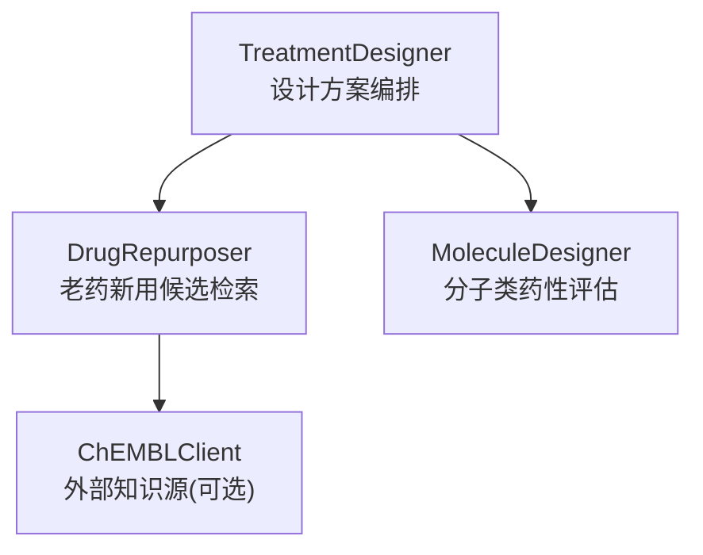
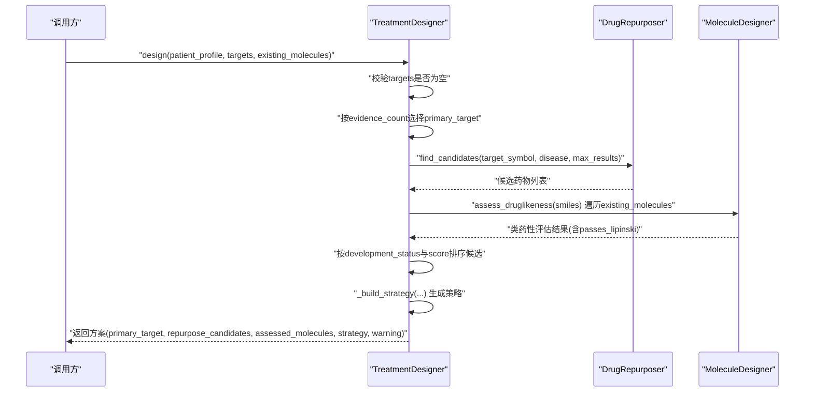
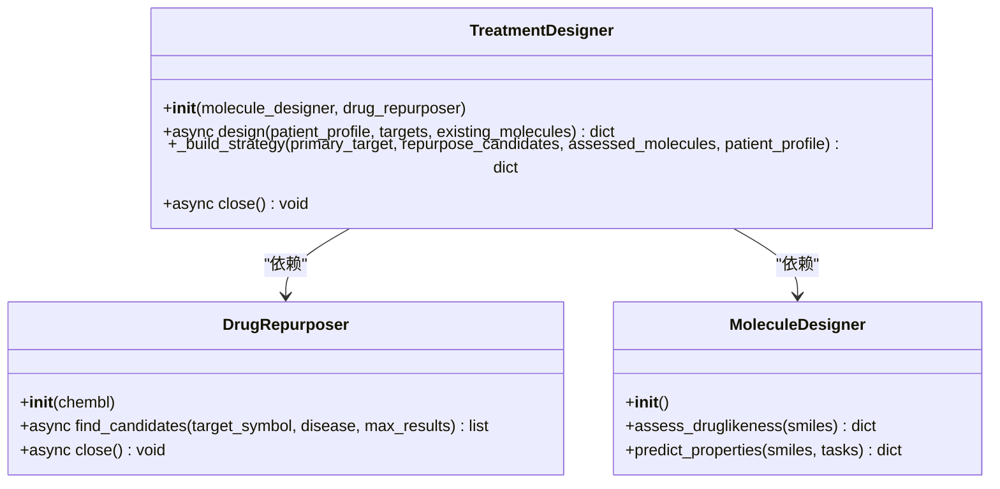
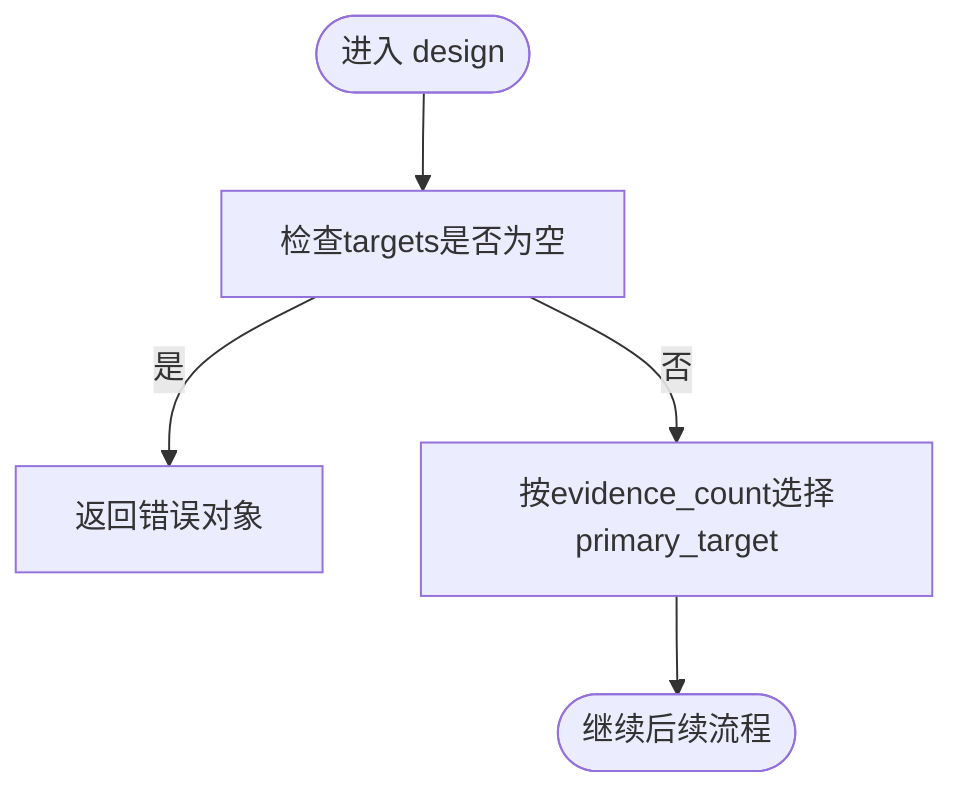
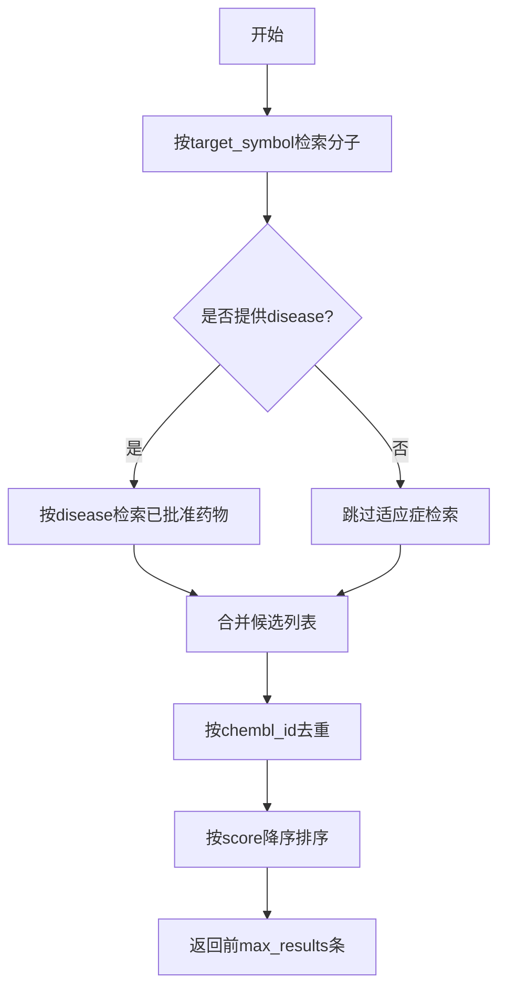
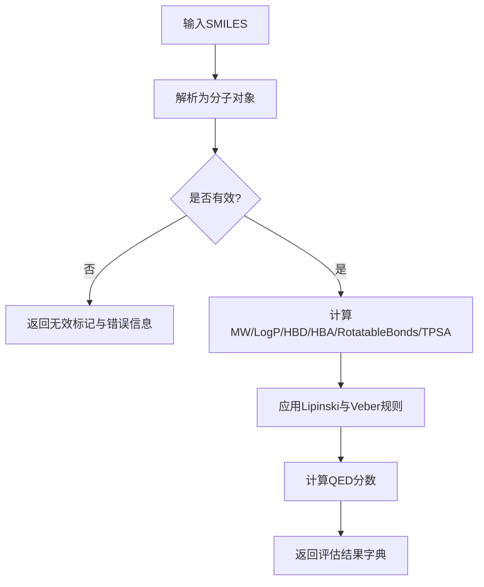
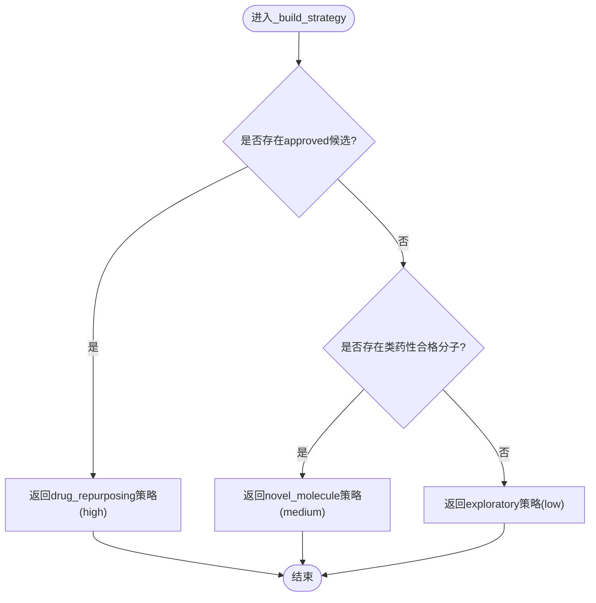
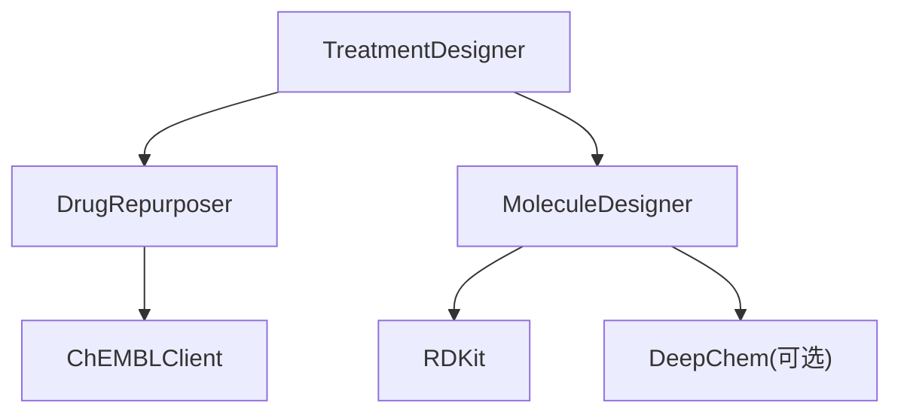

# 治疗方案设计器

<cite>
**本文引用的文件**   
- [treatment_designer.py](file://backend/app/services/optimizer/treatment_designer.py)
- [drug_repurposer.py](file://backend/app/services/analyzer/drug_repurposer.py)
- [molecule_designer.py](file://backend/app/services/analyzer/molecule_designer.py)
- [test_treatment_designer.py](file://tests/test_treatment_designer.py)
</cite>

## 目录
1. [简介](#简介)
2. [项目结构](#项目结构)
3. [核心组件](#核心组件)
4. [架构总览](#架构总览)
5. [详细组件分析](#详细组件分析)
6. [依赖关系分析](#依赖关系分析)
7. [性能考量](#性能考量)
8. [故障排查指南](#故障排查指南)
9. [结论](#结论)
10. [附录](#附录)

## 简介
本技术文档聚焦于“治疗方案设计器”，围绕 TreatmentDesigner 类展开，系统阐述其核心能力与实现逻辑：
- 患者画像分析：基于传入的患者画像（如疾病、年龄、性别、基因突变等）进行策略选择。
- 靶点选择策略：从候选靶点中按证据强度排序选择主靶点。
- 老药新用候选推荐：通过 DrugRepurposer 检索已批准或接近批准的候选药物。
- 分子评估整合：对现有候选分子进行类药性评估（Lipinski/Veber/QED），并纳入策略建议。
- 策略生成：在 _build_strategy 中根据已有信息生成“已批准药物优先”、“新分子开发”和“探索性研究”三类策略。

该模块为个性化治疗方案的快速构建提供自动化决策支持，输出包含主靶点、候选药物、分子评估结果与策略说明。

## 项目结构
TreatmentDesigner 位于优化服务层，依赖两个分析子模块：
- 老药新用引擎（DrugRepurposer）：负责从知识库检索与目标相关且具备临床进展的候选药物。
- 分子设计器（MoleculeDesigner）：负责分子类药性与 ADMET 性质评估，用于筛选现有候选分子。

图示来源
- [treatment_designer.py:17-146](file://backend/app/services/optimizer/treatment_designer.py#L17-L146)
- [drug_repurposer.py:19-124](file://backend/app/services/analyzer/drug_repurposer.py#L19-L124)
- [molecule_designer.py:20-134](file://backend/app/services/analyzer/molecule_designer.py#L20-L134)

章节来源
- [treatment_designer.py:1-146](file://backend/app/services/optimizer/treatment_designer.py#L1-L146)
- [drug_repurposer.py:1-124](file://backend/app/services/analyzer/drug_repurposer.py#L1-L124)
- [molecule_designer.py:1-134](file://backend/app/services/analyzer/molecule_designer.py#L1-L134)

## 核心组件
- TreatmentDesigner
  - 职责：编排患者画像、靶点列表与候选分子，产出治疗方案。
  - 关键方法：
    - design：主流程入口，完成主靶点选择、老药新用候选检索、分子评估与策略生成。
    - _build_strategy：策略决策树，返回三种策略之一。
    - close：资源清理。
- DrugRepurposer
  - 职责：基于 ChEMBL 数据检索与目标/适应症相关的候选药物，并进行去重与评分排序。
- MoleculeDesigner
  - 职责：对 SMILES 分子执行类药性评估（Lipinski/Veber/QED），并提供 ADMET 规则模型预测。

章节来源
- [treatment_designer.py:17-146](file://backend/app/services/optimizer/treatment_designer.py#L17-L146)
- [drug_repurposer.py:19-124](file://backend/app/services/analyzer/drug_repurposer.py#L19-L124)
- [molecule_designer.py:20-134](file://backend/app/services/analyzer/molecule_designer.py#L20-L134)

## 架构总览
下图展示了 TreatmentDesigner 的主流程时序，包括输入校验、主靶点选择、老药新用候选检索、分子评估、排序与策略生成。

图示来源
- [treatment_designer.py:34-101](file://backend/app/services/optimizer/treatment_designer.py#L34-L101)
- [drug_repurposer.py:30-94](file://backend/app/services/analyzer/drug_repurposer.py#L30-L94)
- [molecule_designer.py:71-134](file://backend/app/services/analyzer/molecule_designer.py#L71-L134)

## 详细组件分析

### TreatmentDesigner 类分析
- 初始化
  - 注入 MoleculeDesigner 与 DrugRepurposer，若未提供则使用默认实例。
- design 方法
  - 输入校验：当 targets 为空时直接返回错误对象。
  - 主靶点选择：以 evidence_count 最大者为 primary_target。
  - 老药新用候选：调用 drug_repurposer.find_candidates，参数包含 target_symbol、disease、max_results。
  - 分子评估：遍历 existing_molecules，提取 smiles 并调用 assess_druglikeness；仅保留 passes_lipinski 为真的分子，合并评估结果。
  - 候选排序：优先 development_status 为 approved 的候选，其次按 score 降序。
  - 策略生成：调用 _build_strategy 生成策略描述。
  - 返回结构：包含 primary_target、repurpose_candidates[:5]、assessed_molecules[:5]、strategy、patient_profile、warning。
- _build_strategy 方法
  - 决策树：
    - 若存在已批准药物候选：approach=drug_repurposing，priority=high。
    - 否则若存在类药性合格的新分子：approach=novel_molecule，priority=medium。
    - 否则：approach=exploratory，priority=low。
- close 方法
  - 关闭 DrugRepurposer 客户端资源。

图示来源
- [treatment_designer.py:17-146](file://backend/app/services/optimizer/treatment_designer.py#L17-L146)
- [drug_repurposer.py:19-124](file://backend/app/services/analyzer/drug_repurposer.py#L19-L124)
- [molecule_designer.py:20-134](file://backend/app/services/analyzer/molecule_designer.py#L20-L134)

章节来源
- [treatment_designer.py:17-146](file://backend/app/services/optimizer/treatment_designer.py#L17-L146)

### 主靶点选择算法（基于证据强度排序）
- 算法要点
  - 输入：targets 列表，每项包含 symbol 与 evidence_count。
  - 过程：选取 evidence_count 最大的项作为 primary_target。
  - 复杂度：O(n)，n 为候选靶点数。
- 边界情况
  - 若 targets 为空，design 直接返回错误对象，避免后续流程执行。

图示来源
- [treatment_designer.py:50-58](file://backend/app/services/optimizer/treatment_designer.py#L50-L58)

章节来源
- [treatment_designer.py:50-58](file://backend/app/services/optimizer/treatment_designer.py#L50-L58)

### 老药新用候选筛选流程
- 流程步骤
  - 通过 target_symbol 查询已知药物（target_match）。
  - 若提供 disease，再查询适应症相关已批准药物（indication_match）。
  - 去重：按 chembl_id 去重。
  - 排序：按 score 降序，限制返回数量。
- 数据来源
  - 依赖 ChEMBLClient 提供的分子与适应症接口。
- 返回字段
  - chembl_id、name、first_approval、development_status、source、score。

图示来源
- [drug_repurposer.py:30-94](file://backend/app/services/analyzer/drug_repurposer.py#L30-L94)

章节来源
- [drug_repurposer.py:30-94](file://backend/app/services/analyzer/drug_repurposer.py#L30-L94)

### 现有分子类药性评估流程
- 评估内容
  - Lipinski 五规则：MW<=500、LogP<=5、HBD<=5、HBA<=10。
  - Veber 规则：可旋转键<=10、TPSA<=140。
  - QED 分数：药物相似性定量评估。
- 处理逻辑
  - 解析 SMILES，计算分子描述符。
  - 统计违规项，判定 passes_lipinski 与 passes_veber。
  - 返回结构化评估结果。
- 集成方式
  - TreatmentDesigner 仅保留 passes_lipinski 为真且能成功解析的分子，并将评估结果合并到原始分子记录中。

图示来源
- [molecule_designer.py:71-134](file://backend/app/services/analyzer/molecule_designer.py#L71-L134)

章节来源
- [molecule_designer.py:71-134](file://backend/app/services/analyzer/molecule_designer.py#L71-L134)

### _build_strategy 策略生成逻辑（决策树）
- 决策顺序
  - 若存在已批准药物候选：approach=drug_repurposing，priority=high。
  - 否则若存在类药性合格的新分子：approach=novel_molecule，priority=medium。
  - 否则：approach=exploratory，priority=low。
- 输出字段
  - approach、description、priority、rationale。

图示来源
- [treatment_designer.py:103-141](file://backend/app/services/optimizer/treatment_designer.py#L103-L141)

章节来源
- [treatment_designer.py:103-141](file://backend/app/services/optimizer/treatment_designer.py#L103-L141)

## 依赖关系分析
- 内部依赖
  - TreatmentDesigner 依赖 DrugRepurposer 与 MoleculeDesigner。
- 外部依赖
  - DrugRepurposer 依赖 ChEMBLClient（知识库检索）。
  - MoleculeDesigner 依赖 RDKit（化学描述符与指纹）、DeepChem（可选，用于 ADMET 预测，不可用时降级为规则模型）。

图示来源
- [treatment_designer.py:13-14](file://backend/app/services/optimizer/treatment_designer.py#L13-L14)
- [drug_repurposer.py:16](file://backend/app/services/analyzer/drug_repurposer.py#L16)
- [molecule_designer.py:34-69](file://backend/app/services/analyzer/molecule_designer.py#L34-L69)

章节来源
- [treatment_designer.py:13-14](file://backend/app/services/optimizer/treatment_designer.py#L13-L14)
- [drug_repurposer.py:16](file://backend/app/services/analyzer/drug_repurposer.py#L16)
- [molecule_designer.py:34-69](file://backend/app/services/analyzer/molecule_designer.py#L34-L69)

## 性能考量
- 时间复杂度
  - 主靶点选择：O(n)。
  - 老药新用候选检索：取决于外部 API 响应时间与去重/排序开销。
  - 分子评估：对每个候选分子执行一次评估，整体 O(m)，m 为候选分子数。
- 空间复杂度
  - 存储候选药物与评估结果，线性增长。
- 优化建议
  - 对 existing_molecules 进行并行评估（注意线程安全与资源占用）。
  - 缓存 ChEMBL 查询结果以减少重复请求。
  - 限制返回候选数量（已在设计中限制为前5条）。

[本节为通用指导，不直接分析具体文件]

## 故障排查指南
- 常见错误与处理
  - 无可用靶点：design 返回 {"error": "无可用靶点"}。
  - 分子评估失败：捕获异常并记录警告日志，跳过该分子。
  - DeepChem 不可用：自动降级为规则模型，不影响基本功能。
  - DiffDock NIM API 不可用：返回降级占位响应，不影响主流程。
- 定位建议
  - 检查 targets 是否为空。
  - 确认 existing_molecules 中的 smiles 是否有效。
  - 查看日志中的警告信息，定位外部依赖问题。

章节来源
- [treatment_designer.py:50-78](file://backend/app/services/optimizer/treatment_designer.py#L50-L78)
- [molecule_designer.py:152-160](file://backend/app/services/analyzer/molecule_designer.py#L152-L160)
- [molecule_designer.py:563-611](file://backend/app/services/analyzer/molecule_designer.py#L563-L611)

## 结论
TreatmentDesigner 将患者画像、靶点证据、老药新用候选与分子类药性评估整合为一个可编排的治疗方案设计流程。其策略生成逻辑清晰、可扩展性强，适合在精准医疗场景中快速生成个性化方案建议。通过合理的错误处理与降级机制，系统在外部依赖不可用时仍能保持基本可用性。

[本节为总结性内容，不直接分析具体文件]

## 附录

### 输入数据格式说明
- patient_profile
  - 类型：dict[str, Any]
  - 关键字段示例：disease、age、gender、mutations 等（由调用方定义，至少包含 disease 以便传递给老药新用检索）。
- targets
  - 类型：list[dict[str, Any]]
  - 关键字段：symbol、evidence_count（用于主靶点选择）。
- existing_molecules
  - 类型：list[dict[str, Any]] | None
  - 关键字段：smiles（必填，用于类药性评估），其他字段将被合并到评估结果中。

章节来源
- [treatment_designer.py:34-49](file://backend/app/services/optimizer/treatment_designer.py#L34-L49)
- [test_treatment_designer.py:13-14](file://tests/test_treatment_designer.py#L13-L14)

### 输出数据格式说明
- 返回对象
  - primary_target：dict，主靶点信息（来自 targets 中证据最强的一项）。
  - repurpose_candidates：list[dict]，老药新用候选（最多5条），字段含 name、development_status、score 等。
  - assessed_molecules：list[dict]，类药性合格的分子（最多5条），合并了评估结果（如 passes_lipinski、qed 等）。
  - strategy：dict，策略描述，包含 approach、description、priority、rationale。
  - patient_profile：dict，原样回传。
  - warning：字符串，AI 生成免责声明。

章节来源
- [treatment_designer.py:94-101](file://backend/app/services/optimizer/treatment_designer.py#L94-L101)

### 实际使用示例（路径引用）
- 初始化与默认依赖注入
  - 参考测试用例：[test_treatment_designer.py:35-46](file://tests/test_treatment_designer.py#L35-L46)
- 无靶点错误处理
  - 参考测试用例：[test_treatment_designer.py:52-64](file://tests/test_treatment_designer.py#L52-L64)
- 主靶点选择验证
  - 参考测试用例：[test_treatment_designer.py:66-83](file://tests/test_treatment_designer.py#L66-L83)
- 策略分支覆盖（已批准药物/新分子/探索性）
  - 参考测试用例：[test_treatment_designer.py:85-148](file://tests/test_treatment_designer.py#L85-L148)
- 返回结构与字段校验
  - 参考测试用例：[test_treatment_designer.py:150-176](file://tests/test_treatment_designer.py#L150-L176)
- 资源关闭
  - 参考测试用例：[test_treatment_designer.py:198-205](file://tests/test_treatment_designer.py#L198-L205)

章节来源
- [test_treatment_designer.py:35-205](file://tests/test_treatment_designer.py#L35-L205)