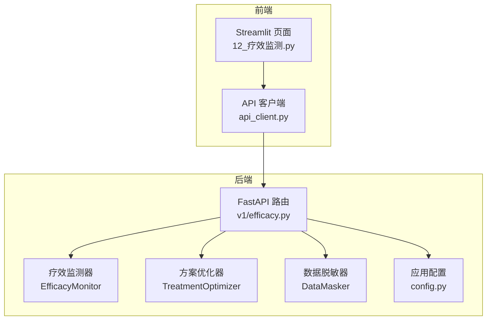
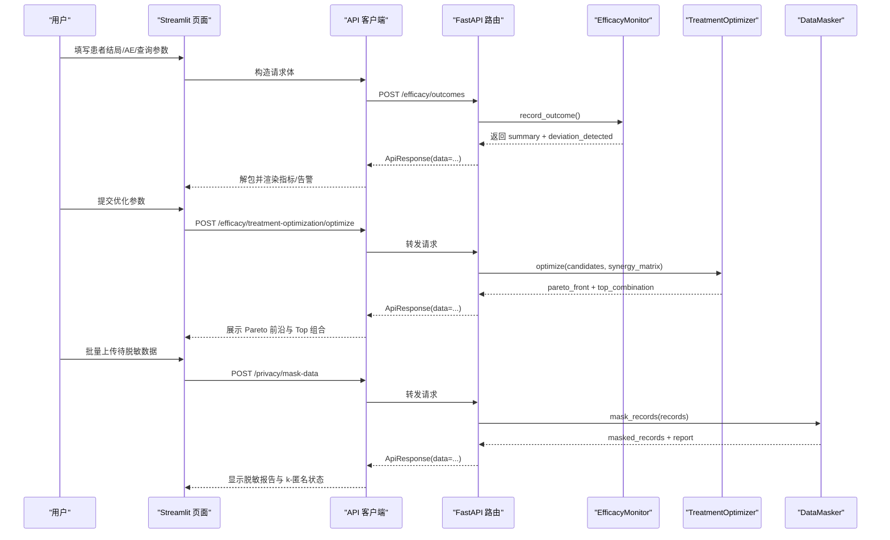
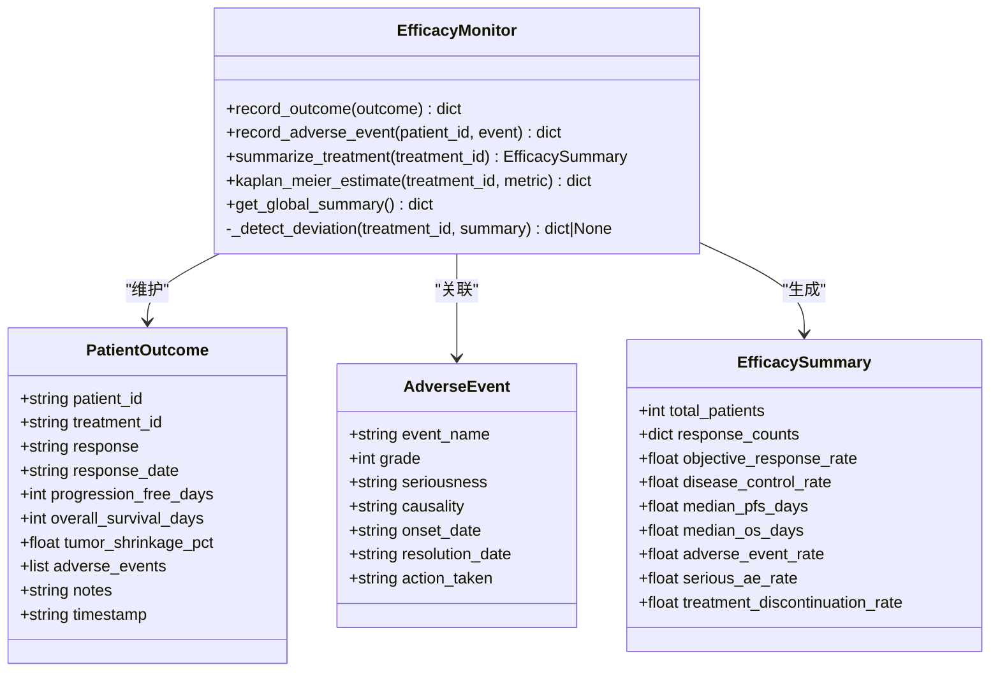
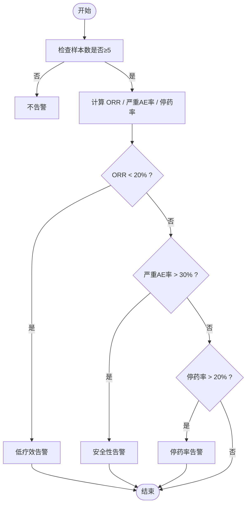
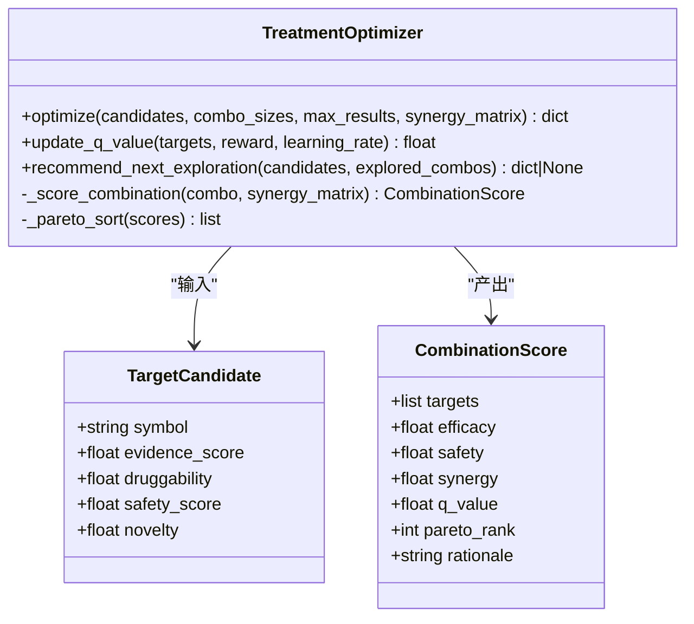
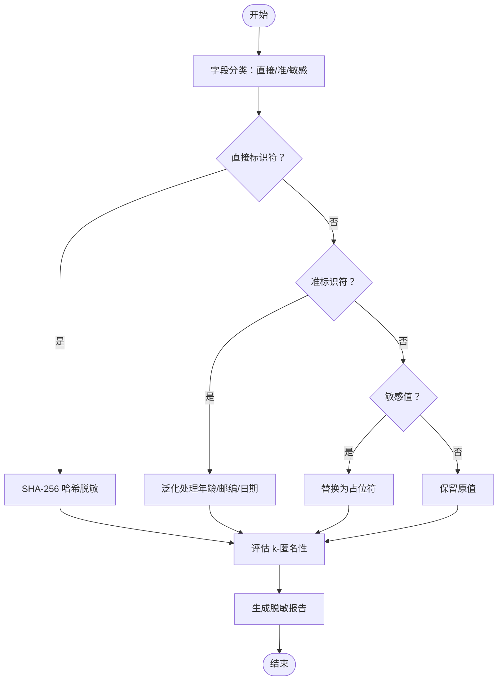
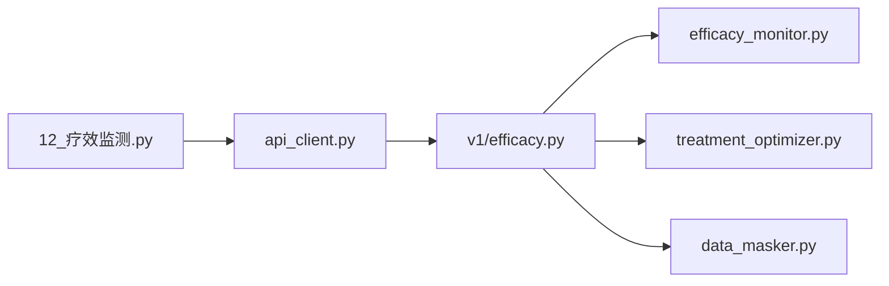

# 疗效监测系统

<cite>
**本文引用的文件列表**   
- [backend/app/services/optimizer/efficacy_monitor.py](file://precision-drug-design/backend/app/services/optimizer/efficacy_monitor.py)
- [backend/app/api/v1/efficacy.py](file://precision-drug-design/backend/app/api/v1/efficacy.py)
- [backend/app/schemas/efficacy.py](file://precision-drug-design/backend/app/schemas/efficacy.py)
- [frontend/pages/12_📊_疗效监测.py](file://precision-drug-design/frontend/pages/12_📊_疗效监测.py)
- [backend/app/services/optimizer/treatment_optimizer.py](file://precision-drug-design/backend/app/services/optimizer/treatment_optimizer.py)
- [backend/app/services/privacy/data_masker.py](file://precision-drug-design/backend/app/services/privacy/data_masker.py)
- [frontend/api_client.py](file://precision-drug-design/frontend/api_client.py)
- [backend/app/core/config.py](file://precision-drug-design/backend/app/core/config.py)
- [README.md](file://precision-drug-design/README.md)
</cite>

## 目录
1. [简介](#简介)
2. [项目结构](#项目结构)
3. [核心组件](#核心组件)
4. [架构总览](#架构总览)
5. [详细组件分析](#详细组件分析)
6. [依赖关系分析](#依赖关系分析)
7. [性能与可扩展性](#性能与可扩展性)
8. [故障排查指南](#故障排查指南)
9. [结论](#结论)
10. [附录：API 规范与使用要点](#附录api-规范与使用要点)

## 简介
本技术文档围绕“疗效监测系统”展开，聚焦于 EfficacyMonitor 的疗效评估模型、临床终点指标定义、不良事件追踪、Kaplan-Meier 生存估计、异常结局检测、治疗方案组合优化（Q-learning 启发 + Pareto 前沿）、数据脱敏合规以及前端可视化展示。文档同时给出端到端的数据流、时序处理思路、响应分类规则与扩展建议，帮助读者快速理解并在此基础上进行二次开发。

## 项目结构
疗效监测相关代码主要分布在后端服务层、API 路由层、Pydantic Schema 层、前端页面与 API 客户端中，形成清晰的职责分层：
- 服务层：EfficacyMonitor 负责患者结局录入、汇总统计、异常检测、KM 估计；TreatmentOptimizer 提供多靶点组合优化；DataMasker 提供 HIPAA Safe Harbor 脱敏能力。
- API 层：FastAPI 路由暴露 REST 接口，统一封装请求/响应信封。
- 前端：Streamlit 页面提供交互表单、图表与结果展示。
- 配置：集中式环境变量管理。

图示来源
- [backend/app/api/v1/efficacy.py:1-347](file://precision-drug-design/backend/app/api/v1/efficacy.py#L1-L347)
- [backend/app/services/optimizer/efficacy_monitor.py:1-407](file://precision-drug-design/backend/app/services/optimizer/efficacy_monitor.py#L1-L407)
- [backend/app/services/optimizer/treatment_optimizer.py:1-363](file://precision-drug-design/backend/app/services/optimizer/treatment_optimizer.py#L1-L363)
- [backend/app/services/privacy/data_masker.py:1-294](file://precision-drug-design/backend/app/services/privacy/data_masker.py#L1-L294)
- [frontend/pages/12_📊_疗效监测.py:1-583](file://precision-drug-design/frontend/pages/12_📊_疗效监测.py#L1-L583)
- [frontend/api_client.py:1-251](file://precision-drug-design/frontend/api_client.py#L1-L251)
- [backend/app/core/config.py:1-144](file://precision-drug-design/backend/app/core/config.py#L1-L144)

章节来源
- [README.md:1-421](file://precision-drug-design/README.md#L1-L421)

## 核心组件
- EfficacyMonitor：实现 RECIST 1.1 响应类别记录、ORR/DCR/PFS/OS 统计、严重 AE 自动判定、异常结局阈值告警、简化版 KM 生存曲线计算。
- TreatmentOptimizer：基于 Q-learning 启发式的多靶点组合评分、Pareto 前沿选择、ε-贪心探索与 UCB 推荐。
- DataMasker：HIPAA Safe Harbor 标识符去标识化、准标识符泛化、敏感值抑制、k-匿名性验证。
- FastAPI 路由：将上述服务以 REST API 暴露，统一响应信封与认证依赖。
- Streamlit 页面：提供患者结局录入、AE 上报、疗效汇总、KM 曲线、方案优化等交互界面。

章节来源
- [backend/app/services/optimizer/efficacy_monitor.py:1-407](file://precision-drug-design/backend/app/services/optimizer/efficacy_monitor.py#L1-L407)
- [backend/app/services/optimizer/treatment_optimizer.py:1-363](file://precision-drug-design/backend/app/services/optimizer/treatment_optimizer.py#L1-L363)
- [backend/app/services/privacy/data_masker.py:1-294](file://precision-drug-design/backend/app/services/privacy/data_masker.py#L1-L294)
- [backend/app/api/v1/efficacy.py:1-347](file://precision-drug-design/backend/app/api/v1/efficacy.py#L1-L347)
- [frontend/pages/12_📊_疗效监测.py:1-583](file://precision-drug-design/frontend/pages/12_📊_疗效监测.py#L1-L583)

## 架构总览
系统采用前后端分离架构，前端通过 httpx 连接后端 FastAPI 服务，调用疗效监测、方案优化与数据脱敏等能力。所有请求携带 JWT 令牌，响应遵循统一信封格式。

图示来源
- [backend/app/api/v1/efficacy.py:62-223](file://precision-drug-design/backend/app/api/v1/efficacy.py#L62-L223)
- [backend/app/services/optimizer/efficacy_monitor.py:114-407](file://precision-drug-design/backend/app/services/optimizer/efficacy_monitor.py#L114-L407)
- [backend/app/services/optimizer/treatment_optimizer.py:66-363](file://precision-drug-design/backend/app/services/optimizer/treatment_optimizer.py#L66-L363)
- [backend/app/services/privacy/data_masker.py:126-294](file://precision-drug-design/backend/app/services/privacy/data_masker.py#L126-L294)
- [frontend/pages/12_📊_疗效监测.py:54-583](file://precision-drug-design/frontend/pages/12_📊_疗效监测.py#L54-L583)
- [frontend/api_client.py:42-163](file://precision-drug-design/frontend/api_client.py#L42-L163)

## 详细组件分析

### EfficacyMonitor 疗效评估模型
- 临床终点指标定义
  - ORR（客观缓解率）= (CR + PR) / total
  - DCR（疾病控制率）= (CR + PR + SD) / total
  - PFS（无进展生存天数）/ OS（总生存天数）用于中位数统计
  - 不良事件发生率、严重 AE 率、停药率
- 生物标志物与影像学集成
  - 当前版本支持肿瘤缩小百分比字段，便于后续接入影像测量或 ctDNA 等标志物时间序列。
- 响应分类（RECIST 1.1）
  - cr/pr/sd/pd/unknown，默认 unknown 兜底。
- 异常结局检测
  - 样本量 < 5 不告警
  - ORR < 20% 触发低疗效告警
  - 严重 AE 率 > 30% 触发安全性告警
  - 停药率 > 20% 触发停药率告警
- Kaplan-Meier 生存估计（简化版）
  - 按时间排序，逐步更新生存概率，输出 survival_curve 与中位生存时间。

图示来源
- [backend/app/services/optimizer/efficacy_monitor.py:35-112](file://precision-drug-design/backend/app/services/optimizer/efficacy_monitor.py#L35-L112)
- [backend/app/services/optimizer/efficacy_monitor.py:114-407](file://precision-drug-design/backend/app/services/optimizer/efficacy_monitor.py#L114-L407)

章节来源
- [backend/app/services/optimizer/efficacy_monitor.py:1-407](file://precision-drug-design/backend/app/services/optimizer/efficacy_monitor.py#L1-L407)

#### 异常检测流程（流程图）

图示来源
- [backend/app/services/optimizer/efficacy_monitor.py:270-307](file://precision-drug-design/backend/app/services/optimizer/efficacy_monitor.py#L270-L307)

### 疗效动态追踪算法（时间序列与趋势预测）
- 现状
  - 当前版本未内置时间序列分析与趋势预测模块，但数据结构已预留肿瘤缩小百分比与时间戳字段，便于后续扩展。
- 建议扩展
  - 时间序列建模：对每个患者的肿瘤大小/标志物随时间变化建立平滑与趋势拟合（如指数衰减、线性回归、样条）。
  - 趋势预测：基于历史观测预测未来时间点的关键指标，辅助提前识别 PD 风险。
  - 响应分类增强：结合多时间点数据与置信区间，动态更新 CR/PR/SD/PD 分类，降低单次测量的噪声影响。
  - 协变量调整：在模型中加入年龄、基线负荷、合并症等协变量，提升个性化评估准确性。

[本节为概念性扩展建议，不涉及具体源码]

### 疗效预测模型（机器学习）
- 现状
  - 当前未实现 ML 训练与验证流水线，但提供了结构化输入字段与 API 入口，可无缝对接下游模型服务。
- 建议实现
  - 特征工程：从 PatientOutcome 与 AdverseEvent 中提取时变特征（如斜率、方差、峰值）、静态特征（性别、基线分期）、治疗特征（剂量、周期）。
  - 模型选择：逻辑回归/XGBoost/LightGBM 作为基线，深度学习（时序网络）用于复杂轨迹建模。
  - 训练与验证：交叉验证、时间切分验证、外部队列验证；指标包括 AUC、Brier Score、校准曲线、NRI。
  - 在线学习：结合 Q-learning 奖励信号持续更新策略权重。

[本节为概念性扩展建议，不涉及具体源码]

### 个性化疗效评估标准
- 患者分层：依据基线特征（如分子分型、肿瘤负荷）分组，分别计算 ORR/DCR/PFS/OS。
- 基线校正：以基线值为参考，计算相对变化率，减少个体差异。
- 协变量调整：在统计模型中引入协变量，获得调整后效应估计。

[本节为概念性扩展建议，不涉及具体源码]

### 数据采集接口与实时监测
- 采集接口
  - POST /efficacy/outcomes：录入患者结局
  - POST /efficacy/adverse-events：上报不良事件
  - GET /efficacy/summary：某治疗方案汇总
  - GET /efficacy/global-summary：全局汇总
  - POST /efficacy/kaplan-meier：KM 生存估计
- 实时监测
  - 当前为同步请求-响应模式；可在服务层增加消息队列与事件总线，实现异步告警推送。
- 异常预警机制
  - 基于阈值的异常检测已在服务层实现，前端在录入后即时展示告警与建议动作。

章节来源
- [backend/app/api/v1/efficacy.py:62-223](file://precision-drug-design/backend/app/api/v1/efficacy.py#L62-L223)
- [backend/app/services/optimizer/efficacy_monitor.py:114-337](file://precision-drug-design/backend/app/services/optimizer/efficacy_monitor.py#L114-L337)

### 疗效评估报告生成与可视化
- 报告内容
  - 汇总指标：ORR、DCR、中位 PFS/OS、AE 率、严重 AE 率、停药率
  - 响应分布柱状图
  - KM 生存曲线与中位生存时间
  - 异常告警与建议
- 可视化
  - 前端使用 Streamlit 图表组件渲染指标与曲线，支持交互式筛选与导出。

章节来源
- [frontend/pages/12_📊_疗效监测.py:210-376](file://precision-drug-design/frontend/pages/12_📊_疗效监测.py#L210-L376)

### 治疗方案组合优化（Q-learning 启发 + Pareto 前沿）
- 目标函数
  - Q(s,a) = α·有效性 + β·安全性 + γ·协同 - δ·复杂度
- 搜索策略
  - 枚举候选组合，计算各维度得分，构建 Pareto 前沿
  - ε-贪心：以 ε 概率随机探索，否则选最优
  - UCB：平衡利用与探索，推荐下一个高潜力组合
- 输出
  - Pareto 前沿、Top 组合、Q 表大小、评估组合总数、权重配置

图示来源
- [backend/app/services/optimizer/treatment_optimizer.py:24-64](file://precision-drug-design/backend/app/services/optimizer/treatment_optimizer.py#L24-L64)
- [backend/app/services/optimizer/treatment_optimizer.py:66-363](file://precision-drug-design/backend/app/services/optimizer/treatment_optimizer.py#L66-L363)

章节来源
- [backend/app/services/optimizer/treatment_optimizer.py:1-363](file://precision-drug-design/backend/app/services/optimizer/treatment_optimizer.py#L1-L363)

### 数据脱敏（HIPAA Safe Harbor）
- 直接标识符：SHA-256 哈希脱敏（带盐）
- 准标识符：年龄分段、邮编截断、日期精度降级
- 敏感值：替换为占位符
- k-匿名性：评估同质组大小是否满足阈值

图示来源
- [backend/app/services/privacy/data_masker.py:126-294](file://precision-drug-design/backend/app/services/privacy/data_masker.py#L126-L294)

章节来源
- [backend/app/services/privacy/data_masker.py:1-294](file://precision-drug-design/backend/app/services/privacy/data_masker.py#L1-L294)

## 依赖关系分析
- 耦合与内聚
  - API 路由仅依赖服务层接口，保持良好内聚；服务层之间通过明确的数据类传递，避免循环依赖。
- 外部依赖
  - FastAPI、httpx、Pydantic、Loguru、pydantic-settings 等。
- 潜在风险
  - 内存存储：EfficacyMonitor 当前使用内存字典，重启后数据丢失；生产环境需持久化到数据库或对象存储。
  - 并发安全：多线程访问共享状态需加锁或使用线程安全容器。

图示来源
- [backend/app/api/v1/efficacy.py:1-347](file://precision-drug-design/backend/app/api/v1/efficacy.py#L1-L347)
- [backend/app/services/optimizer/efficacy_monitor.py:1-407](file://precision-drug-design/backend/app/services/optimizer/efficacy_monitor.py#L1-L407)
- [backend/app/services/optimizer/treatment_optimizer.py:1-363](file://precision-drug-design/backend/app/services/optimizer/treatment_optimizer.py#L1-L363)
- [backend/app/services/privacy/data_masker.py:1-294](file://precision-drug-design/backend/app/services/privacy/data_masker.py#L1-L294)
- [frontend/pages/12_📊_疗效监测.py:1-583](file://precision-drug-design/frontend/pages/12_📊_疗效监测.py#L1-L583)
- [frontend/api_client.py:1-251](file://precision-drug-design/frontend/api_client.py#L1-L251)

章节来源
- [backend/app/api/v1/efficacy.py:1-347](file://precision-drug-design/backend/app/api/v1/efficacy.py#L1-L347)
- [frontend/api_client.py:1-251](file://precision-drug-design/frontend/api_client.py#L1-L251)

## 性能与可扩展性
- 连接池复用：前端 httpx.Client 使用连接池，减少握手开销。
- 缓存策略：GET 请求支持 TTL 缓存，降低重复查询压力。
- 计算复杂度
  - 组合优化：C(n,k) 枚举，n 较大时需限制 combo_sizes 与 max_results。
  - KM 估计：O(N log N) 排序，N 为样本数。
- 扩展建议
  - 引入 Redis 缓存热点汇总结果
  - 异步任务队列（Celery/RQ）处理耗时计算
  - 数据库持久化与索引优化

[本节为通用指导，不涉及具体源码]

## 故障排查指南
- 常见错误
  - 参数校验失败：检查 Pydantic 字段约束（如 range、必填项）
  - 认证失败：确认 JWT token 有效且注入正确
  - 空数据：当无患者结局或生存数据时，KM 返回空曲线
- 日志定位
  - 服务层使用 Loguru 记录关键操作与告警，便于回溯
- 脱敏问题
  - k-匿名未满足：检查准标识符分组大小，必要时调整 k 值或进一步泛化

章节来源
- [backend/app/services/optimizer/efficacy_monitor.py:140-208](file://precision-drug-design/backend/app/services/optimizer/efficacy_monitor.py#L140-L208)
- [backend/app/services/privacy/data_masker.py:257-294](file://precision-drug-design/backend/app/services/privacy/data_masker.py#L257-L294)

## 结论
疗效监测系统已具备完整的临床终点统计、异常检测、KM 生存估计与方案优化能力，并通过前端实现了良好的可视化体验。下一步建议引入时间序列分析、机器学习预测与持久化存储，以提升系统的个性化评估能力与生产可用性。

[本节为总结性内容，不涉及具体源码]

## 附录：API 规范与使用要点
- 统一响应信封
  - 包含 success、data、meta.request_id 等字段
- 主要端点
  - POST /efficacy/outcomes：录入患者结局
  - POST /efficacy/adverse-events：上报不良事件
  - GET /efficacy/summary：治疗方案汇总
  - GET /efficacy/global-summary：全局汇总
  - POST /efficacy/kaplan-meier：KM 生存估计
  - POST /efficacy/treatment-optimization/optimize：方案优化
  - POST /efficacy/treatment-optimization/q-update：Q 值更新
  - POST /privacy/mask-data：数据脱敏
- 认证与鉴权
  - 通过 Bearer Token 注入 Authorization 头
- 前端缓存
  - 使用 cached_get 实现 TTL 缓存，减少重复请求

章节来源
- [backend/app/api/v1/efficacy.py:1-347](file://precision-drug-design/backend/app/api/v1/efficacy.py#L1-L347)
- [frontend/api_client.py:186-251](file://precision-drug-design/frontend/api_client.py#L186-L251)
- [backend/app/core/config.py:1-144](file://precision-drug-design/backend/app/core/config.py#L1-L144)
- [README.md:239-296](file://precision-drug-design/README.md#L239-L296)