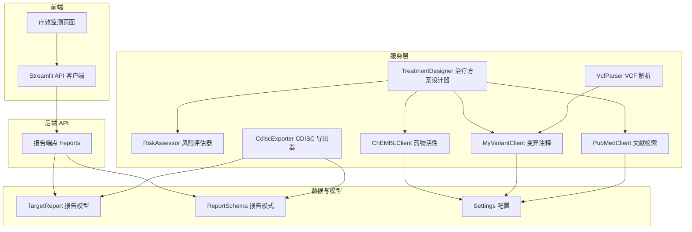
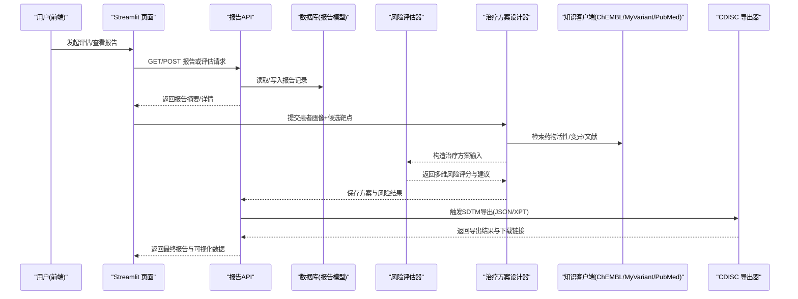
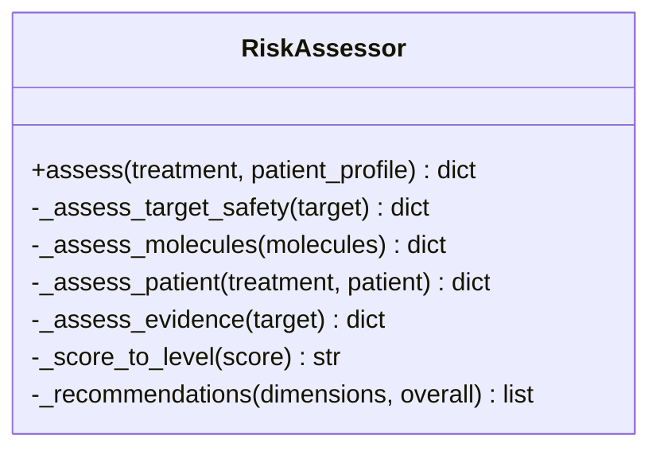
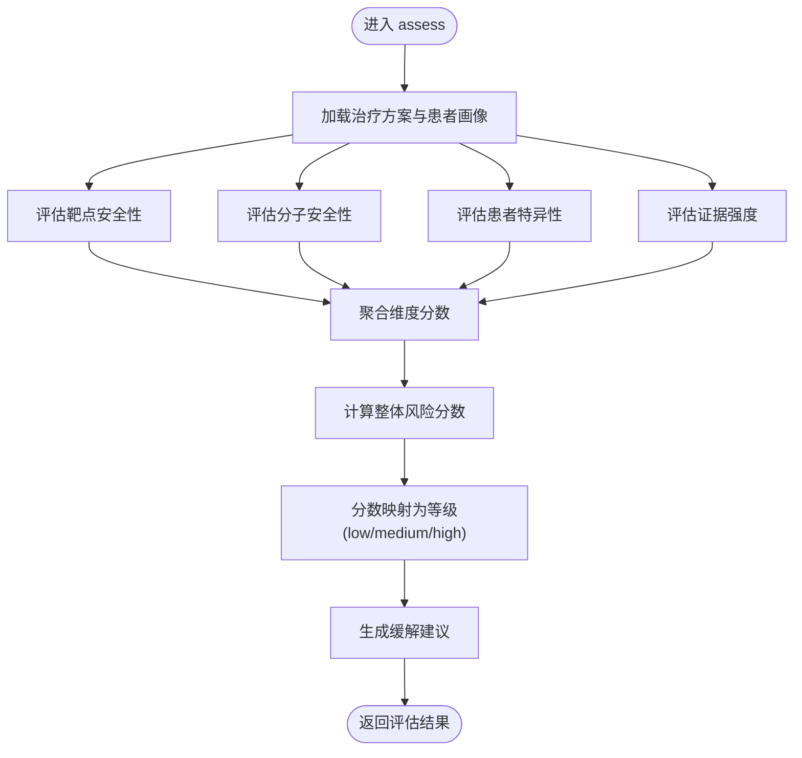
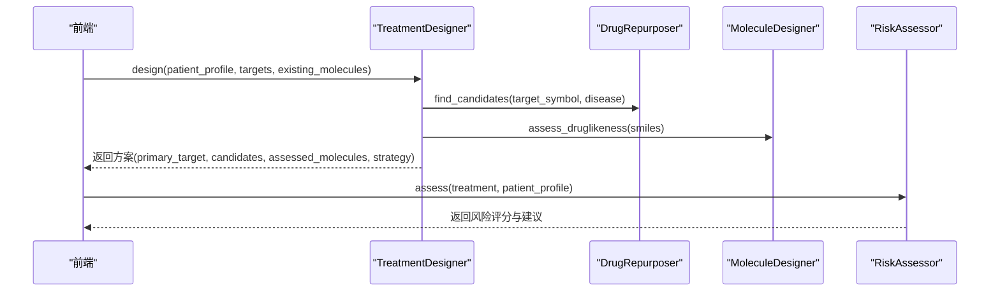
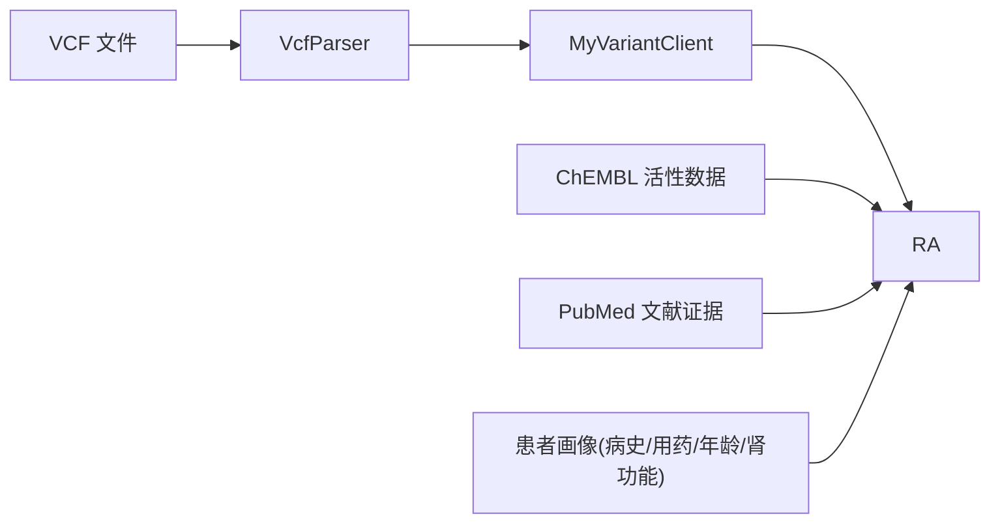
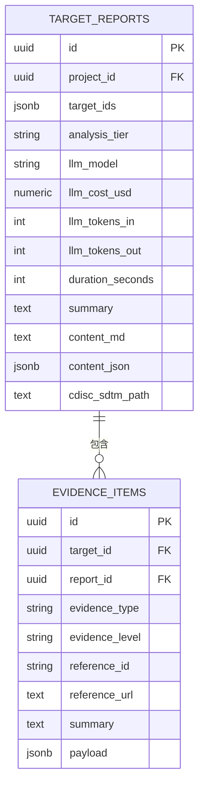
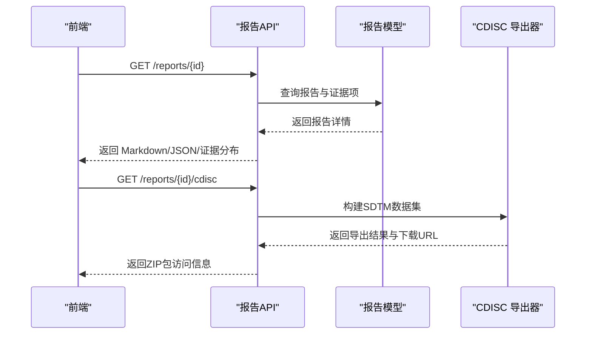
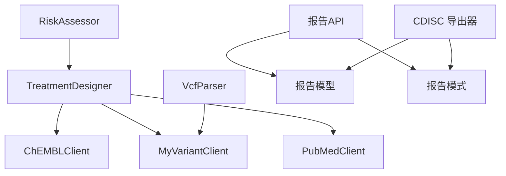

# 风险评估系统

<cite>
**本文引用的文件**   
- [risk_assessor.py](file://backend/app/services/optimizer/risk_assessor.py)
- [test_risk_assessor.py](file://tests/test_risk_assessor.py)
- [treatment_designer.py](file://backend/app/services/optimizer/treatment_designer.py)
- [chembl_client.py](file://backend/app/services/knowledge/chembl_client.py)
- [myvariant_client.py](file://backend/app/services/knowledge/myvariant_client.py)
- [pubmed_client.py](file://backend/app/services/knowledge/pubmed_client.py)
- [vcf_parser.py](file://backend/app/services/parser/vcf_parser.py)
- [cdisc_exporter.py](file://backend/app/services/report/cdisc_exporter.py)
- [reports.py](file://backend/app/api/v1/reports.py)
- [report.py](file://backend/app/models/report.py)
- [report_schema.py](file://backend/app/schemas/report.py)
- [config.py](file://backend/app/core/config.py)
- [api_client.py](file://frontend/api_client.py)
- [efficacy_page.py](file://frontend/pages/12_📊_疗效监测.py)
</cite>

## 目录
1. [引言](#引言)
2. [项目结构](#项目结构)
3. [核心组件](#核心组件)
4. [架构总览](#架构总览)
5. [详细组件分析](#详细组件分析)
6. [依赖关系分析](#依赖关系分析)
7. [性能与可扩展性](#性能与可扩展性)
8. [故障排查指南](#故障排查指南)
9. [结论](#结论)
10. [附录](#附录)

## 引言
本技术文档面向“风险评估系统”，聚焦于治疗方案的风险预测与评估能力，覆盖以下关键主题：
- 风险预测模型：药物不良反应、药物相互作用、特殊人群用药风险
- 多源风险数据整合：基因组学、临床病史、合并用药、实验室检查
- 风险评分算法：等级划分、置信度与不确定性量化（当前实现与扩展建议）
- 风险预警机制：阈值设定、预警级别、通知策略（当前实现与扩展建议）
- 配置与治理：风险因素权重、模型更新、风险数据库维护
- 报告与可视化：风险评估报告生成、CDISC SDTM 导出、前端可视化展示
- 干预建议自动生成：基于维度评估结果的结构化建议

## 项目结构
本项目采用分层架构：API 层、服务层、领域模型与模式定义、外部知识客户端、解析器、报告导出器以及前端 Streamlit 应用。风险评估核心位于服务层的优化模块中，并通过 API 层暴露报告查询与导出能力；前端提供交互界面与可视化。

图表来源
- [reports.py:1-181](file://backend/app/api/v1/reports.py#L1-L181)
- [report.py:1-73](file://backend/app/models/report.py#L1-L73)
- [report_schema.py:1-59](file://backend/app/schemas/report.py#L1-L59)
- [risk_assessor.py:1-155](file://backend/app/services/optimizer/risk_assessor.py#L1-L155)
- [treatment_designer.py:1-146](file://backend/app/services/optimizer/treatment_designer.py#L1-L146)
- [cdisc_exporter.py:1-187](file://backend/app/services/report/cdisc_exporter.py#L1-L187)
- [chembl_client.py:1-127](file://backend/app/services/knowledge/chembl_client.py#L1-L127)
- [myvariant_client.py:1-85](file://backend/app/services/knowledge/myvariant_client.py#L1-L85)
- [pubmed_client.py:1-125](file://backend/app/services/knowledge/pubmed_client.py#L1-L125)
- [vcf_parser.py:1-136](file://backend/app/services/parser/vcf_parser.py#L1-L136)
- [config.py:1-144](file://backend/app/core/config.py#L1-L144)
- [api_client.py:1-251](file://frontend/api_client.py#L1-L251)
- [efficacy_page.py:1-583](file://frontend/pages/12_📊_疗效监测.py#L1-L583)

章节来源
- [reports.py:1-181](file://backend/app/api/v1/reports.py#L1-L181)
- [report.py:1-73](file://backend/app/models/report.py#L1-L73)
- [report_schema.py:1-59](file://backend/app/schemas/report.py#L1-L59)
- [risk_assessor.py:1-155](file://backend/app/services/optimizer/risk_assessor.py#L1-L155)
- [treatment_designer.py:1-146](file://backend/app/services/optimizer/treatment_designer.py#L1-L146)
- [cdisc_exporter.py:1-187](file://backend/app/services/report/cdisc_exporter.py#L1-L187)
- [chembl_client.py:1-127](file://backend/app/services/knowledge/chembl_client.py#L1-L127)
- [myvariant_client.py:1-85](file://backend/app/services/knowledge/myvariant_client.py#L1-L85)
- [pubmed_client.py:1-125](file://backend/app/services/knowledge/pubmed_client.py#L1-L125)
- [vcf_parser.py:1-136](file://backend/app/services/parser/vcf_parser.py#L1-L136)
- [config.py:1-144](file://backend/app/core/config.py#L1-L144)
- [api_client.py:1-251](file://frontend/api_client.py#L1-L251)
- [efficacy_page.py:1-583](file://frontend/pages/12_📊_疗效监测.py#L1-L583)

## 核心组件
- RiskAssessor：对治疗方案进行多维度风险评估，输出整体风险分数与等级、各维度得分与建议。
- TreatmentDesigner：整合靶点、分子与患者画像，生成个性化治疗方案并驱动风险评估。
- CdiscExporter：将报告转换为 CDISC SDTM JSON/XPT 数据集，支持 DM/AE/LB/TS 域。
- 知识客户端：ChEMBL、MyVariant、PubMed 用于获取药物活性、变异注释与文献证据。
- VcfParser：解析 VCF 变异数据，为风险因子提供基因组学输入。
- 报告 API：提供报告列表、详情、CDISC 导出与重新生成接口。
- 前端：Streamlit 页面提供疗效监测、KM 曲线、方案优化等可视化与交互。

章节来源
- [risk_assessor.py:1-155](file://backend/app/services/optimizer/risk_assessor.py#L1-L155)
- [treatment_designer.py:1-146](file://backend/app/services/optimizer/treatment_designer.py#L1-L146)
- [cdisc_exporter.py:1-187](file://backend/app/services/report/cdisc_exporter.py#L1-L187)
- [chembl_client.py:1-127](file://backend/app/services/knowledge/chembl_client.py#L1-L127)
- [myvariant_client.py:1-85](file://backend/app/services/knowledge/myvariant_client.py#L1-L85)
- [pubmed_client.py:1-125](file://backend/app/services/knowledge/pubmed_client.py#L1-L125)
- [vcf_parser.py:1-136](file://backend/app/services/parser/vcf_parser.py#L1-L136)
- [reports.py:1-181](file://backend/app/api/v1/reports.py#L1-L181)
- [efficacy_page.py:1-583](file://frontend/pages/12_📊_疗效监测.py#L1-L583)

## 架构总览
下图展示了从前端到后端再到外部知识库的数据流与处理链路，突出风险评估在治疗方案设计与报告生成中的位置。

图表来源
- [reports.py:1-181](file://backend/app/api/v1/reports.py#L1-L181)
- [report.py:1-73](file://backend/app/models/report.py#L1-L73)
- [risk_assessor.py:1-155](file://backend/app/services/optimizer/risk_assessor.py#L1-L155)
- [treatment_designer.py:1-146](file://backend/app/services/optimizer/treatment_designer.py#L1-L146)
- [chembl_client.py:1-127](file://backend/app/services/knowledge/chembl_client.py#L1-L127)
- [myvariant_client.py:1-85](file://backend/app/services/knowledge/myvariant_client.py#L1-L85)
- [pubmed_client.py:1-125](file://backend/app/services/knowledge/pubmed_client.py#L1-L125)
- [cdisc_exporter.py:1-187](file://backend/app/services/report/cdisc_exporter.py#L1-L187)

## 详细组件分析

### 风险评估器 RiskAssessor
- 功能概述：对治疗方案进行四维评估（靶点安全性、分子类药性、患者特异性、证据强度），计算综合风险分数与等级，并生成缓解建议。
- 输入输出：
  - 输入：治疗方案字典（含主靶点、候选分子）、可选患者画像（合并症、合并用药、年龄、肾功能等）。
  - 输出：overall_risk_score、overall_risk_level、dimensions（各维度 score/level/note）、recommendations、patient_profile。
- 算法要点：
  - 靶点安全性：依据证据数量分级（高/中/低）。
  - 分子安全性：优先已批准药物，其次 Lipinski 通过情况，否则高风险。
  - 患者特异性：合并症、合并用药、高龄、肾功能不全等叠加风险。
  - 证据强度：按证据等级 I/II/III/IV 计数，高质量证据降低风险。
  - 等级划分：分数 <0.35 为 low，<0.65 为 medium，其余 high。
  - 建议生成：针对高风险维度给出关注提示，整体高风险时建议补充证据。

图表来源
- [risk_assessor.py:1-155](file://backend/app/services/optimizer/risk_assessor.py#L1-L155)

章节来源
- [risk_assessor.py:1-155](file://backend/app/services/optimizer/risk_assessor.py#L1-L155)
- [test_risk_assessor.py:1-154](file://tests/test_risk_assessor.py#L1-L154)

#### 风险评分流程（流程图）

图表来源
- [risk_assessor.py:18-64](file://backend/app/services/optimizer/risk_assessor.py#L18-L64)
- [risk_assessor.py:131-154](file://backend/app/services/optimizer/risk_assessor.py#L131-L154)

### 治疗方案设计器 TreatmentDesigner
- 功能概述：根据患者画像与候选靶点，选择主靶点，检索老药新用候选，评估现有分子类药性，构建治疗策略并输出方案。
- 与风险评估的集成：设计方案后，将 primary_target、repurpose_candidates、assessed_molecules 作为 RiskAssessor 的输入，得到多维风险与建议。

图表来源
- [treatment_designer.py:34-101](file://backend/app/services/optimizer/treatment_designer.py#L34-L101)
- [risk_assessor.py:18-64](file://backend/app/services/optimizer/risk_assessor.py#L18-L64)

章节来源
- [treatment_designer.py:1-146](file://backend/app/services/optimizer/treatment_designer.py#L1-L146)
- [risk_assessor.py:1-155](file://backend/app/services/optimizer/risk_assessor.py#L1-L155)

### 多源风险数据整合机制
- 基因组学数据：VcfParser 解析 VCF，提取变异位点与统计信息；MyVariantClient 提供变异注释（致病性、相关疾病）。
- 临床病史与合并用药：患者画像字段 comorbidities、concurrent_medications、age、renal_impairment 直接参与患者特异性风险评分。
- 实验室检查与活性数据：ChEMBLClient 获取靶点活性（IC50/Ki/Kd），可作为证据项与 AE/LB 域的基础。
- 文献证据：PubMedClient 检索文献，辅助证据强度评估。

图表来源
- [vcf_parser.py:32-87](file://backend/app/services/parser/vcf_parser.py#L32-L87)
- [myvariant_client.py:35-80](file://backend/app/services/knowledge/myvariant_client.py#L35-L80)
- [chembl_client.py:72-97](file://backend/app/services/knowledge/chembl_client.py#L72-L97)
- [pubmed_client.py:33-98](file://backend/app/services/knowledge/pubmed_client.py#L33-L98)
- [risk_assessor.py:87-113](file://backend/app/services/optimizer/risk_assessor.py#L87-L113)

章节来源
- [vcf_parser.py:1-136](file://backend/app/services/parser/vcf_parser.py#L1-L136)
- [myvariant_client.py:1-85](file://backend/app/services/knowledge/myvariant_client.py#L1-L85)
- [chembl_client.py:1-127](file://backend/app/services/knowledge/chembl_client.py#L1-L127)
- [pubmed_client.py:1-125](file://backend/app/services/knowledge/pubmed_client.py#L1-L125)
- [risk_assessor.py:87-113](file://backend/app/services/optimizer/risk_assessor.py#L87-L113)

### 风险评分算法与等级划分
- 维度评分：每个维度返回 score（0-1）与 level（low/medium/high）。
- 综合风险：维度分数的算术平均，四舍五入保留两位小数。
- 等级映射：<0.35 low，<0.65 medium，其余 high。
- 置信度与不确定性：当前实现未显式计算置信度与不确定性区间；建议在后续版本引入证据质量加权、方差估计或贝叶斯不确定性量化。

章节来源
- [risk_assessor.py:54-64](file://backend/app/services/optimizer/risk_assessor.py#L54-L64)
- [risk_assessor.py:131-138](file://backend/app/services/optimizer/risk_assessor.py#L131-L138)

### 风险预警机制（阈值、级别、通知策略）
- 当前实现：
  - 阈值与级别：由 _score_to_level 决定（low/medium/high）。
  - 建议生成：高风险维度与整体高风险时生成关注提示。
- 扩展建议：
  - 阈值可配置化（如 Settings 中新增 risk_threshold_low/risk_threshold_medium）。
  - 通知策略：对接邮件/短信/站内信，结合前端告警面板与后端任务队列异步发送。
  - 严重事件联动：当 AE 严重性或停药率超过阈值时触发自动告警（参考前端异常检测逻辑）。

章节来源
- [risk_assessor.py:131-154](file://backend/app/services/optimizer/risk_assessor.py#L131-L154)
- [efficacy_page.py:42-44](file://frontend/pages/12_📊_疗效监测.py#L42-L44)

### 风险因素权重配置与模型更新
- 当前实现：
  - 权重为硬编码规则（如合并症+0.2、合并用药+0.2、高龄+0.15、肾功能不全+0.15）。
  - 证据强度按等级计数，高质量证据≥3条降为低风险。
- 扩展建议：
  - 将权重迁移至配置（Settings），支持动态调整与灰度发布。
  - 模型更新机制：引入版本化评分函数与 A/B 测试，结合临床反馈闭环迭代。

章节来源
- [risk_assessor.py:87-113](file://backend/app/services/optimizer/risk_assessor.py#L87-L113)
- [risk_assessor.py:115-129](file://backend/app/services/optimizer/risk_assessor.py#L115-L129)
- [config.py:21-144](file://backend/app/core/config.py#L21-L144)

### 风险数据库维护与报告持久化
- 模型与模式：
  - TargetReport：存储报告元数据、LLM 使用成本、时长、Markdown/JSON 内容、CDISC 路径等。
  - EvidenceItem：存储证据类型、等级、引用信息与负载。
- API 操作：
  - 列表与分页：按 project_id、analysis_tier 过滤。
  - 详情：包含证据项与证据等级分布统计。
  - CDISC 导出：返回占位下载 URL（第二阶段实现）。
  - 重新生成：异步任务队列占位。

图表来源
- [report.py:15-73](file://backend/app/models/report.py#L15-L73)

章节来源
- [report.py:1-73](file://backend/app/models/report.py#L1-L73)
- [report_schema.py:16-59](file://backend/app/schemas/report.py#L16-L59)
- [reports.py:35-120](file://backend/app/api/v1/reports.py#L35-L120)

### 风险评估报告生成与可视化
- 后端：
  - 报告详情接口返回 Markdown 与结构化 JSON，并附带证据项与证据等级分布。
  - CDISC 导出器支持 TS/DM/AE/LB 域，输出 JSON 并可扩展 XPT。
- 前端：
  - 疗效监测页面提供结局录入、不良事件上报、汇总指标、KM 曲线与方案优化可视化。
  - 异常检测阈值：ORR<20%、严重 AE 率>30%、停药率>20% 触发告警。

图表来源
- [reports.py:76-153](file://backend/app/api/v1/reports.py#L76-L153)
- [cdisc_exporter.py:28-88](file://backend/app/services/report/cdisc_exporter.py#L28-L88)
- [efficacy_page.py:210-376](file://frontend/pages/12_📊_疗效监测.py#L210-L376)

章节来源
- [reports.py:1-181](file://backend/app/api/v1/reports.py#L1-L181)
- [cdisc_exporter.py:1-187](file://backend/app/services/report/cdisc_exporter.py#L1-L187)
- [efficacy_page.py:1-583](file://frontend/pages/12_📊_疗效监测.py#L1-L583)

### 风险干预建议自动生成
- 当前实现：
  - 整体高风险时建议“补充证据后再推进”。
  - 任一维度高风险时附加该维度的 note 并建议重点关注。
- 扩展建议：
  - 基于证据项与患者画像生成更具体的干预措施（剂量调整、替代药物、监测计划）。
  - 结合 LLM 生成自然语言建议，并结构化输出供下游系统消费。

章节来源
- [risk_assessor.py:140-154](file://backend/app/services/optimizer/risk_assessor.py#L140-L154)

## 依赖关系分析
- 组件耦合：
  - RiskAssessor 与 TreatmentDesigner 松耦合，通过字典接口传递数据。
  - 知识客户端独立封装外部 API，通过 HttpClient 统一超时与重试。
  - 报告 API 与模型/模式解耦，便于扩展与替换。
- 外部依赖：
  - ChEMBL、MyVariant、PubMed 为外部知识库，需配置 base_url 与速率限制。
  - VCF 解析依赖 cyvcf2，未安装时降级为纯文本解析。
- 潜在循环依赖：
  - 当前未发现循环导入；服务层与 API 层通过模型/模式进行通信。

图表来源
- [risk_assessor.py:1-155](file://backend/app/services/optimizer/risk_assessor.py#L1-L155)
- [treatment_designer.py:1-146](file://backend/app/services/optimizer/treatment_designer.py#L1-L146)
- [chembl_client.py:1-127](file://backend/app/services/knowledge/chembl_client.py#L1-L127)
- [myvariant_client.py:1-85](file://backend/app/services/knowledge/myvariant_client.py#L1-L85)
- [pubmed_client.py:1-125](file://backend/app/services/knowledge/pubmed_client.py#L1-L125)
- [vcf_parser.py:1-136](file://backend/app/services/parser/vcf_parser.py#L1-L136)
- [reports.py:1-181](file://backend/app/api/v1/reports.py#L1-L181)
- [report.py:1-73](file://backend/app/models/report.py#L1-L73)
- [report_schema.py:1-59](file://backend/app/schemas/report.py#L1-L59)
- [cdisc_exporter.py:1-187](file://backend/app/services/report/cdisc_exporter.py#L1-L187)

章节来源
- [config.py:1-144](file://backend/app/core/config.py#L1-L144)
- [api_client.py:1-251](file://frontend/api_client.py#L1-L251)

## 性能与可扩展性
- 连接池与缓存：
  - 前端 ApiClient 复用 httpx.Client 连接池，减少握手开销。
  - cached_get 使用 TTL 时间桶实现轻量级缓存，适用于不常变数据。
- 外部 API 限流：
  - PubMedClient 调用 NCBI E-utilities 时加入延时，避免限速。
- 解析性能：
  - VcfParser 优先使用 cyvcf2，未安装时降级为纯文本解析，保证可用性。
- 可扩展性建议：
  - 引入异步任务队列（如 Celery/RQ）处理重计算与导出任务。
  - 将评分函数与权重配置化，支持热更新与灰度发布。
  - 增加指标监控（评分耗时、外部 API 延迟、错误率）。

章节来源
- [api_client.py:24-39](file://frontend/api_client.py#L24-L39)
- [api_client.py:186-236](file://frontend/api_client.py#L186-L236)
- [pubmed_client.py:67-75](file://backend/app/services/knowledge/pubmed_client.py#L67-L75)
- [vcf_parser.py:21-30](file://backend/app/services/parser/vcf_parser.py#L21-L30)

## 故障排查指南
- 常见错误与定位：
  - 报告不存在：API 抛出 NotFoundError，检查 report_id 是否正确。
  - 外部 API 失败：HttpClient 超时或重试失败，检查网络与 base_url 配置。
  - VCF 解析失败：cyvcf2 未安装导致降级，确认依赖安装或改用纯文本解析。
  - 前端缓存失效：TTL 过期后自动刷新，必要时调用 invalidate_cache 清理。
- 日志与调试：
  - 使用 loguru 记录关键步骤与异常，便于问题追踪。
  - 前端页面在异常时显示错误消息，建议结合后端日志定位。

章节来源
- [reports.py:90-92](file://backend/app/api/v1/reports.py#L90-L92)
- [chembl_client.py:23-34](file://backend/app/services/knowledge/chembl_client.py#L23-L34)
- [myvariant_client.py:22-33](file://backend/app/services/knowledge/myvariant_client.py#L22-L33)
- [pubmed_client.py:19-31](file://backend/app/services/knowledge/pubmed_client.py#L19-L31)
- [vcf_parser.py:21-30](file://backend/app/services/parser/vcf_parser.py#L21-L30)
- [api_client.py:68-94](file://frontend/api_client.py#L68-L94)

## 结论
本风险评估系统以 RiskAssessor 为核心，结合 TreatmentDesigner 与多源知识客户端，形成从数据整合到风险评分与建议生成的完整链路。当前实现提供了清晰的多维评分与等级划分，并在报告与可视化方面具备良好基础。后续可在权重配置化、置信度与不确定性量化、预警通知策略与模型更新机制等方面进一步增强，以提升系统的可解释性与临床实用性。

## 附录
- 配置项示例（节选）：
  - 外部知识库 base_url：mygene_base_url、myvariant_base_url、chembl_base_url、pubmed_base_url、clinical_trials_url
  - 对象存储与向量库：s3_*、chroma_persist_dir
  - LLM 预算与模型：llm_default_model、llm_deep_model、llm_max_budget_usd
  - CDISC 输出目录：cdisc_sdtm_output_dir
- 前端可视化要点：
  - 疗效监测页面提供 ORR/DCR/PFS/OS 指标、KM 曲线与方案优化（Pareto 前沿、Q-learning 启发）。
  - 异常检测阈值：ORR<20%、严重 AE 率>30%、停药率>20%。

章节来源
- [config.py:68-98](file://backend/app/core/config.py#L68-L98)
- [efficacy_page.py:35-44](file://frontend/pages/12_📊_疗效监测.py#L35-L44)
- [efficacy_page.py:210-376](file://frontend/pages/12_📊_疗效监测.py#L210-L376)