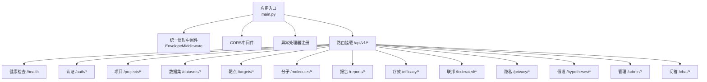
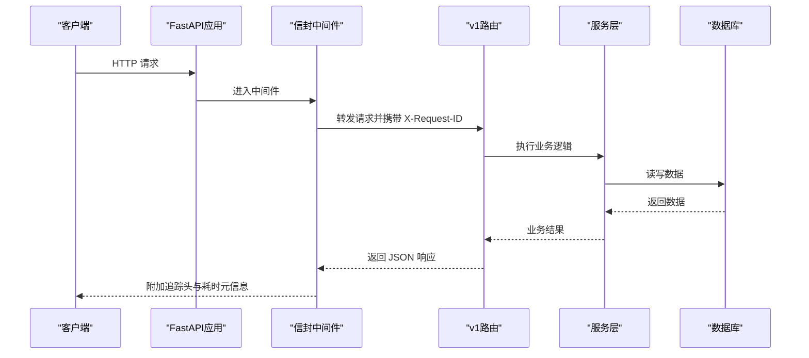
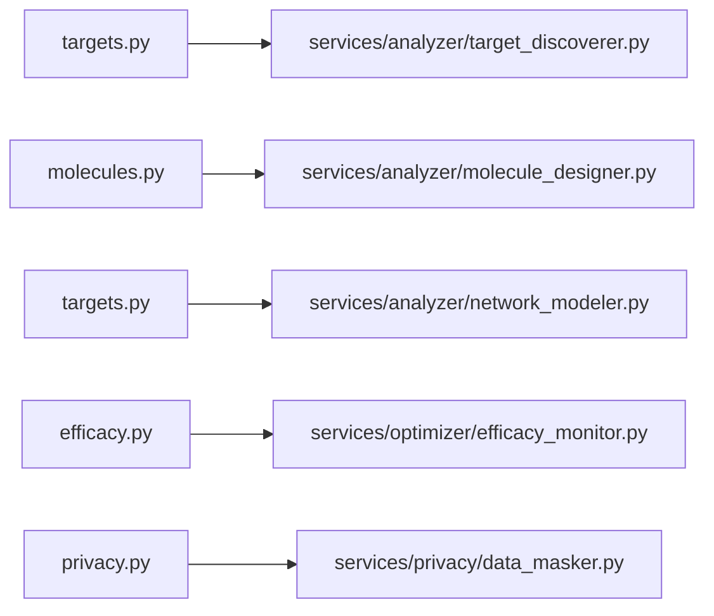

# API参考文档

<cite>
**本文引用的文件**   
- [main.py](file://backend/app/main.py)
- [config.py](file://backend/app/core/config.py)
- [security.py](file://backend/app/core/security.py)
- [health.py](file://backend/app/api/v1/health.py)
- [auth.py](file://backend/app/api/v1/auth.py)
- [projects.py](file://backend/app/api/v1/projects.py)
- [data.py](file://backend/app/api/v1/data.py)
- [targets.py](file://backend/app/api/v1/targets.py)
- [molecules.py](file://backend/app/api/v1/molecules.py)
- [reports.py](file://backend/app/api/v1/reports.py)
- [efficacy.py](file://backend/app/api/v1/efficacy.py)
- [federated.py](file://backend/app/api/v1/federated.py)
- [privacy.py](file://backend/app/api/v1/privacy.py)
- [hypotheses.py](file://backend/app/api/v1/hypotheses.py)
- [admin.py](file://backend/app/api/v1/admin.py)
- [chat.py](file://backend/app/api/v1/chat.py)
</cite>

## 目录
1. [简介](#简介)
2. [项目结构](#项目结构)
3. [核心组件](#核心组件)
4. [架构总览](#架构总览)
5. [详细组件分析](#详细组件分析)
6. [依赖关系分析](#依赖关系分析)
7. [性能与限流](#性能与限流)
8. [错误处理与最佳实践](#错误处理与最佳实践)
9. [结论](#结论)
10. [附录：统一响应格式与版本策略](#附录统一响应格式与版本策略)

## 简介
本API参考文档面向AI药物设计系统的RESTful接口，覆盖健康检查、用户认证、项目管理、数据集操作、靶点发现、分子设计、报告生成、疗效监测、联邦学习、隐私计算、假设管理与自然语言问答等模块。所有响应采用统一信封格式，包含请求追踪ID与耗时信息；提供OpenAPI文档端点，便于集成与自动化测试。

## 项目结构
后端基于FastAPI构建，应用入口负责注册中间件、异常处理器与路由，统一前缀为/api/v1。各功能域以v1子路由组织，配合Pydantic Schema进行请求/响应校验。

图表来源
- [main.py:187-248](file://backend/app/main.py#L187-L248)
- [health.py:19-102](file://backend/app/api/v1/health.py#L19-L102)
- [auth.py:38-147](file://backend/app/api/v1/auth.py#L38-L147)
- [projects.py:29-169](file://backend/app/api/v1/projects.py#L29-L169)
- [data.py:44-369](file://backend/app/api/v1/data.py#L44-L369)
- [targets.py:39-344](file://backend/app/api/v1/targets.py#L39-L344)
- [molecules.py:44-403](file://backend/app/api/v1/molecules.py#L44-L403)
- [reports.py:32-181](file://backend/app/api/v1/reports.py#L32-L181)
- [efficacy.py:52-347](file://backend/app/api/v1/efficacy.py#L52-L347)
- [federated.py:29-133](file://backend/app/api/v1/federated.py#L29-L133)
- [privacy.py:39-177](file://backend/app/api/v1/privacy.py#L39-L177)
- [hypotheses.py:36-273](file://backend/app/api/v1/hypotheses.py#L36-L273)
- [admin.py:25-124](file://backend/app/api/v1/admin.py#L25-L124)
- [chat.py:19-177](file://backend/app/api/v1/chat.py#L19-L177)

章节来源
- [main.py:187-248](file://backend/app/main.py#L187-L248)
- [config.py:21-144](file://backend/app/core/config.py#L21-L144)

## 核心组件
- 统一信封中间件：注入X-Request-ID、X-Response-Time-ms，并在JSON响应meta中追加duration_ms。
- 配置中心：集中读取环境变量（数据库、Redis、S3、LLM、NIM、CORS等），提供生产/开发环境判断。
- 安全与鉴权：bcrypt密码哈希、JWT access/refresh token签发与校验、角色守卫require_roles、当前用户依赖。
- 路由与Schema：按领域划分路由，使用Pydantic模型进行强类型校验与序列化。

章节来源
- [main.py:29-185](file://backend/app/main.py#L29-L185)
- [config.py:21-144](file://backend/app/core/config.py#L21-L144)
- [security.py:29-211](file://backend/app/core/security.py#L29-L211)

## 架构总览
系统通过中间件完成通用横切关注点（追踪、计时、CORS、异常），业务路由调用服务层执行AI/数据/外部API任务，结果经统一信封返回。

图表来源
- [main.py:187-248](file://backend/app/main.py#L187-L248)
- [auth.py:70-101](file://backend/app/api/v1/auth.py#L70-L101)
- [targets.py:42-131](file://backend/app/api/v1/targets.py#L42-L131)

## 详细组件分析

### 健康检查
- 端点
  - GET /api/v1/health
- 说明
  - 无需认证，返回服务状态、版本与各依赖组件健康度（Postgres、Redis、Chroma）。
  - 内置短TTL缓存避免频繁查询数据库。
- 请求参数
  - 无
- 响应字段
  - data.status: healthy | degraded
  - data.version: 字符串
  - data.dependencies: 对象，键为组件名，值为 ok | unhealthy | not_configured
  - meta.request_id: 请求追踪ID
- curl示例
  - curl -i http://localhost:8000/api/v1/health

章节来源
- [health.py:53-102](file://backend/app/api/v1/health.py#L53-L102)

### 用户认证
- 端点
  - POST /api/v1/auth/register
  - POST /api/v1/auth/login
  - POST /api/v1/auth/refresh
  - GET /api/v1/auth/me
- 认证方式
  - 登录成功后返回 access_token 与 refresh_token，后续请求在Authorization头携带Bearer token。
- 请求/响应要点
  - register: 仅首位founder可注册，之后需带token；返回UserPublic。
  - login: 邮箱+密码，返回TokenResponse（含access_token、refresh_token、expires_in、user）。
  - refresh: 使用refresh_token换取新的access_token与新的refresh_token。
  - me: 返回当前用户信息。
- curl示例
  - 登录
    - curl -X POST http://localhost:8000/api/v1/auth/login -H "Content-Type: application/json" -d '{"email":"a@b.com","password":"pwd"}'
  - 访问受保护资源
    - curl -H "Authorization: Bearer <access_token>" http://localhost:8000/api/v1/auth/me
- 错误码
  - 401 Unauthorized: 邮箱或密码错误、用户被禁用、token无效或缺失、token类型错误
  - 409 Conflict: 邮箱已注册

章节来源
- [auth.py:41-147](file://backend/app/api/v1/auth.py#L41-L147)
- [security.py:96-174](file://backend/app/core/security.py#L96-L174)

### 项目管理
- 端点
  - GET /api/v1/projects
  - POST /api/v1/projects
  - GET /api/v1/projects/{project_id}
  - PATCH /api/v1/projects/{project_id}
  - DELETE /api/v1/projects/{project_id}
- 权限
  - founder可访问全部项目；其他角色仅能访问自己拥有的项目。
- 分页
  - 支持page、page_size过滤，返回PagedResponse。
- curl示例
  - 创建项目
    - curl -X POST http://localhost:8000/api/v1/projects -H "Authorization: Bearer <token>" -H "Content-Type: application/json" -d '{"name":"项目A","description":"描述","cancer_type":"NSCLC","patient_pseudonym":"P001","metadata":{}}'
  - 列出项目
    - curl -H "Authorization: Bearer <token>" "http://localhost:8000/api/v1/projects?page=1&page_size=20&status=active"
- 错误码
  - 403 Forbidden: 无权访问该项目
  - 404 NotFound: 项目不存在

章节来源
- [projects.py:47-169](file://backend/app/api/v1/projects.py#L47-L169)

### 数据集操作
- 端点
  - POST /api/v1/datasets/upload
  - GET /api/v1/datasets
  - GET /api/v1/datasets/{dataset_id}
  - POST /api/v1/datasets/{dataset_id}/process
  - GET /api/v1/datasets/{dataset_id}/umap
  - GET /api/v1/datasets/{dataset_id}/markers
  - GET /api/v1/datasets/{dataset_id}/quality
  - DELETE /api/v1/datasets/{dataset_id}
- 上传
  - multipart/form-data，字段：file, project_id, name, data_type, metadata。
  - 支持的数据类型：rna_seq, scrna, vcf, fasta, wes, wgs, ihc, proteomics, metabolomics。
  - 允许的文件扩展名：csv, tsv, txt, vcf, fasta, fa, fna, h5, h5ad, mtx, pdf, png, jpg, jpeg, bam, json, xlsx。
- 数据处理
  - 触发后对scrna尝试Scanpy预处理，结果缓存至metadata_（n_cells、n_genes、clusters、umap_coords、marker_genes、quality_metrics）。
- curl示例
  - 上传
    - curl -X POST http://localhost:8000/api/v1/datasets/upload -F "file=@sample.h5ad" -F "project_id=<uuid>" -F "name=样本A" -F "data_type=scrna" -F "metadata={}"
  - 处理
    - curl -X POST http://localhost:8000/api/v1/datasets/<id>/process -H "Authorization: Bearer <token>" -H "Content-Type: application/json" -d '{}'
- 错误码
  - 400 ValidationError: 不支持的data_type或文件扩展名
  - 404 NotFound: 数据集不存在

章节来源
- [data.py:54-369](file://backend/app/api/v1/data.py#L54-L369)

### 靶点发现
- 端点
  - POST /api/v1/targets/discover
  - GET /api/v1/targets
  - GET /api/v1/targets/{target_id}
  - POST /api/v1/targets/{target_id}/force-deep-analysis
  - POST /api/v1/targets/network
  - POST /api/v1/targets/synergy
- 快速筛查与深度洞察
  - quick模式同步返回候选靶点；deep模式异步返回task_id与预估成本/时长。
- 网络与协同
  - network：构建PPI网络并识别关键节点与模块；synergy：预测多靶点组合协同效应。
- curl示例
  - 快速筛查
    - curl -X POST http://localhost:8000/api/v1/targets/discover -H "Authorization: Bearer <token>" -H "Content-Type: application/json" -d '{"analysis_tier":"quick","focus_genes":["GENE1","GENE2"],"dataset_id":null}'
- 错误码
  - 403 Forbidden: 非founder强制深度分析
  - 404 NotFound: 目标不存在

章节来源
- [targets.py:42-344](file://backend/app/api/v1/targets.py#L42-L344)

### 分子设计与评估
- 端点
  - POST /api/v1/molecules/assess-druglikeness
  - POST /api/v1/molecules/dock
  - GET /api/v1/molecules
  - GET /api/v1/molecules/{molecule_id}/docking-results
  - POST /api/v1/molecules/predict-properties
  - POST /api/v1/molecules/generate
  - POST /api/v1/molecules/explain
  - GET /api/v1/molecules/models
- 类药性评估
  - 基于RDKit实现Lipinski/Veber/QED指标。
- 分子对接
  - 异步任务，返回task_id与预估时长；结果通过GET获取。
- 性质预测与生成
  - 优先DeepChem模型，不可用时降级；生成式分子设计支持fragment/optimization/random策略。
- curl示例
  - 类药性评估
    - curl -X POST http://localhost:8000/api/v1/molecules/assess-druglikeness -H "Authorization: Bearer <token>" -H "Content-Type: application/json" -d '{"smiles":"CC(=O)OC1=CC=CC=C1C(=O)O"}'
  - 对接
    - curl -X POST http://localhost:8000/api/v1/molecules/dock -H "Authorization: Bearer <token>" -H "Content-Type: application/json" -d '{"protein_pdb_id":"1abc","smiles":"CCO"}'
- 错误码
  - 400 ValidationError: RDKit未安装或参数缺失
  - 404 NotFound: 分子不存在

章节来源
- [molecules.py:95-403](file://backend/app/api/v1/molecules.py#L95-L403)

### 报告生成
- 端点
  - GET /api/v1/reports
  - GET /api/v1/reports/{report_id}
  - GET /api/v1/reports/{report_id}/cdisc
  - POST /api/v1/reports/{report_id}/regenerate
- 说明
  - 详情返回Markdown与结构化JSON，CDISC导出返回临时下载URL（第二阶段占位）。
- curl示例
  - 重新生成
    - curl -X POST http://localhost:8000/api/v1/reports/<id>/regenerate -H "Authorization: Bearer <token>"

章节来源
- [reports.py:35-181](file://backend/app/api/v1/reports.py#L35-L181)

### 疗效监测与治疗方案优化
- 端点
  - POST /api/v1/efficacy/outcomes
  - POST /api/v1/efficacy/adverse-events
  - GET /api/v1/efficacy/summary
  - GET /api/v1/efficacy/global-summary
  - POST /api/v1/efficacy/kaplan-meier
  - POST /api/v1/efficacy/treatment-optimization/optimize
  - POST /api/v1/efficacy/treatment-optimization/q-update
  - POST /api/v1/efficacy/mask-data
- 说明
  - 录入患者结局与不良事件，自动检测异常；支持Kaplan-Meier生存估计与Q-learning方案优化；提供HIPAA Safe Harbor数据脱敏。
- curl示例
  - 录入结局
    - curl -X POST http://localhost:8000/api/v1/efficacy/outcomes -H "Authorization: Bearer <token>" -H "Content-Type: application/json" -d '{"patient_id":"p1","treatment_id":"t1","response":"CR","progression_free_days":120,"overall_survival_days":365,"tumor_shrinkage_pct":45}'
- 错误码
  - 400 ValidationError: 必填参数缺失或无效

章节来源
- [efficacy.py:62-347](file://backend/app/api/v1/efficacy.py#L62-L347)

### 联邦学习
- 端点
  - POST /api/v1/federated/jobs
  - GET /api/v1/federated/jobs
  - GET /api/v1/federated/jobs/{job_id}
  - POST /api/v1/federated/jobs/{job_id}/stop
  - POST /api/v1/federated/clients/register
- 说明
  - 内存存储任务状态，客户端注册后达到最小连接数启动训练。
- curl示例
  - 创建任务
    - curl -X POST http://localhost:8000/api/v1/federated/jobs -H "Authorization: Bearer <token>" -H "Content-Type: application/json" -d '{"name":"FL-001","model_arch":"GraphSAGE","num_rounds":10,"min_clients":2,"config":{}}'
- 错误码
  - 404 NotFound: 任务不存在

章节来源
- [federated.py:35-133](file://backend/app/api/v1/federated.py#L35-L133)

### 隐私计算
- 端点
  - POST /api/v1/privacy/domains
  - POST /api/v1/privacy/datasets
  - POST /api/v1/privacy/compute
  - GET /api/v1/privacy/results/{request_id}
  - POST /api/v1/privacy/mask-data
- 说明
  - 创建隐私域、注册数据集、提交差分隐私预算受限的计算任务；提供数据脱敏能力。
- curl示例
  - 提交计算
    - curl -X POST http://localhost:8000/api/v1/privacy/compute -H "Authorization: Bearer <token>" -H "Content-Type: application/json" -d '{"domain_id":"<uuid>","epsilon":0.1,"mock_data":[]}'
- 错误码
  - 400 ValidationError: 预算不足
  - 404 NotFound: 隐私域/计算请求不存在

章节来源
- [privacy.py:47-177](file://backend/app/api/v1/privacy.py#L47-L177)

### 假设管理
- 端点
  - POST /api/v1/hypotheses
  - GET /api/v1/hypotheses
  - GET /api/v1/hypotheses/{hypothesis_id}
  - POST /api/v1/hypotheses/{hypothesis_id}/run-analysis
  - GET /api/v1/hypotheses/compare
  - POST /api/v1/hypotheses/{hypothesis_id}/merge
  - POST /api/v1/hypotheses/{hypothesis_id}/eliminate
- 说明
  - 支持假设对比、合并与淘汰，保留历史状态。
- curl示例
  - 对比
    - curl -H "Authorization: Bearer <token>" "http://localhost:8000/api/v1/hypotheses/compare?ids=<id1>,<id2>"
- 错误码
  - 400 ValidationError: ID列表无效或数量不足
  - 404 NotFound: 假设不存在

章节来源
- [hypotheses.py:39-273](file://backend/app/api/v1/hypotheses.py#L39-L273)

### 自然语言问答
- 端点
  - POST /api/v1/chat
  - GET /api/v1/chat/history
- 说明
  - 集成安全护栏、RAG检索与LLM路由；LLM不可用时降级返回检索摘要。
- curl示例
  - 提问
    - curl -X POST http://localhost:8000/api/v1/chat -H "Authorization: Bearer <token>" -H "Content-Type: application/json" -d '{"message":"EGFR突变NSCLC的一线治疗有哪些证据？","analysis_tier":"quick"}'
- 错误码
  - GuardrailBlockedError: 输入/输出被安全护栏拦截

章节来源
- [chat.py:30-177](file://backend/app/api/v1/chat.py#L30-L177)

### 管理端点
- 端点
  - GET /api/v1/admin/metrics
  - GET /api/v1/admin/audit-logs
- 说明
  - Prometheus指标（文本格式）；审计日志查询（仅founder/engineer）。
- curl示例
  - 指标
    - curl http://localhost:8000/api/v1/admin/metrics
- 错误码
  - 403 Forbidden: 角色不足

章节来源
- [admin.py:28-124](file://backend/app/api/v1/admin.py#L28-L124)

## 依赖关系分析
- 路由到服务层
  - 靶点发现调用services.analyzer.target_discoverer
  - 分子设计调用services.analyzer.molecule_designer
  - 网络建模调用services.analyzer.network_modeler
  - 疗效与隐私调用各自服务模块
- 外部依赖
  - RDKit（类药性与性质预测）
  - NVIDIA NIM DiffDock（分子对接）
  - DeepChem（性质预测）
  - PySyft（隐私域，第三阶段）
  - Flower（联邦学习，第三阶段）

图表来源
- [targets.py:98-131](file://backend/app/api/v1/targets.py#L98-L131)
- [molecules.py:234-298](file://backend/app/api/v1/molecules.py#L234-L298)
- [efficacy.py:38-56](file://backend/app/api/v1/efficacy.py#L38-L56)
- [privacy.py:34-37](file://backend/app/api/v1/privacy.py#L34-L37)

章节来源
- [targets.py:39-344](file://backend/app/api/v1/targets.py#L39-L344)
- [molecules.py:44-403](file://backend/app/api/v1/molecules.py#L44-L403)
- [efficacy.py:52-347](file://backend/app/api/v1/efficacy.py#L52-L347)
- [privacy.py:39-177](file://backend/app/api/v1/privacy.py#L39-L177)

## 性能与限流
- 性能特征
  - 健康检查端点具备5秒内存缓存，降低数据库压力。
  - 中间件记录每个请求的耗时与追踪ID，便于监控与定位。
- 建议
  - 对高频读接口启用缓存（如Redis）与分页限制。
  - 长耗时任务（对接、靶点深度分析、报告再生成）采用异步任务队列与轮询机制。
  - 在生产环境接入Prometheus/Grafana监控与告警。

[本节为通用指导，不直接分析具体文件]

## 错误处理与最佳实践
- 统一错误响应
  - 由全局异常处理器将业务异常转换为标准错误信封，包含错误码与详细信息。
- 常见错误码
  - 400 ValidationError: 参数校验失败
  - 401 Unauthorized: 认证失败或token无效
  - 403 Forbidden: 权限不足
  - 404 NotFound: 资源不存在
  - 409 Conflict: 资源冲突（如重复注册）
- 最佳实践
  - 始终携带Authorization: Bearer <access_token>访问受保护接口。
  - 使用meta.request_id进行跨链路追踪。
  - 对异步任务采用“提交任务—轮询状态”的模式。
  - 合理设置重试与退避策略，避免雪崩。

章节来源
- [main.py:229-231](file://backend/app/main.py#L229-L231)
- [security.py:155-174](file://backend/app/core/security.py#L155-L174)

## 结论
本API参考文档系统化梳理了AI药物设计系统的接口规范、认证流程、数据流转与错误处理策略。通过统一信封与追踪头，结合OpenAPI文档，第三方开发者可快速集成与调试。建议在部署时完善限流、监控与异步任务基础设施，以提升稳定性与可观测性。

[本节为总结，不直接分析具体文件]

## 附录：统一响应格式与版本策略
- 统一信封
  - 成功响应：{ success: true, data: ..., meta: { request_id, duration_ms } }
  - 分页响应：PagedResponse(data: [...], meta: PagedMeta(page, page_size, total, total_pages, request_id))
- 版本管理
  - 路由前缀 /api/v1，未来升级采用 /api/v2 并行演进。
- OpenAPI文档
  - /docs（Swagger UI）、/redoc、/openapi.json
- 请求头
  - Authorization: Bearer <token>
  - X-Request-ID: 可选，服务端自动生成
- 响应头
  - X-Request-ID: 请求追踪ID
  - X-Response-Time-ms: 请求耗时（毫秒）
  - Content-Length: 响应体长度

章节来源
- [main.py:198-213](file://backend/app/main.py#L198-L213)
- [main.py:215-227](file://backend/app/main.py#L215-L227)
- [main.py:236-240](file://backend/app/main.py#L236-L240)