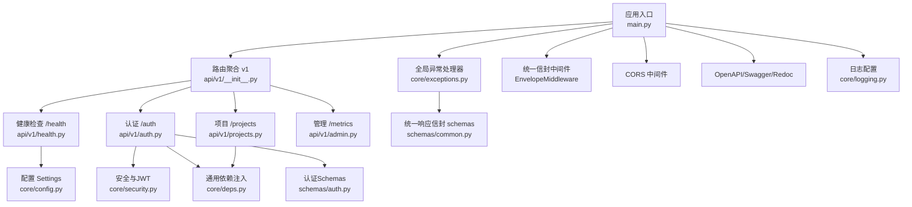
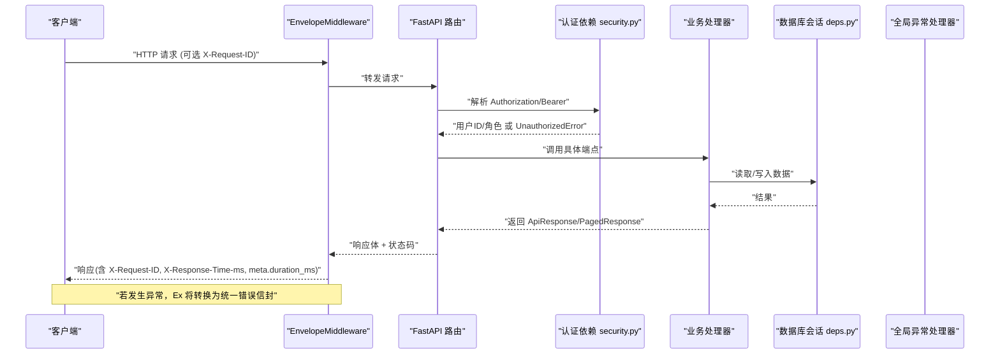
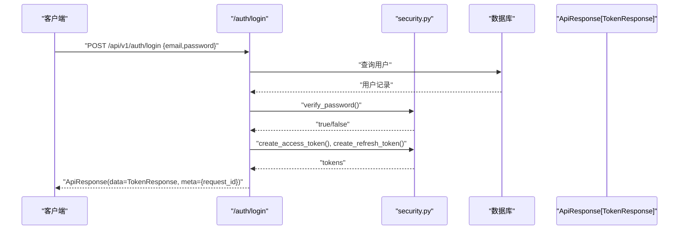
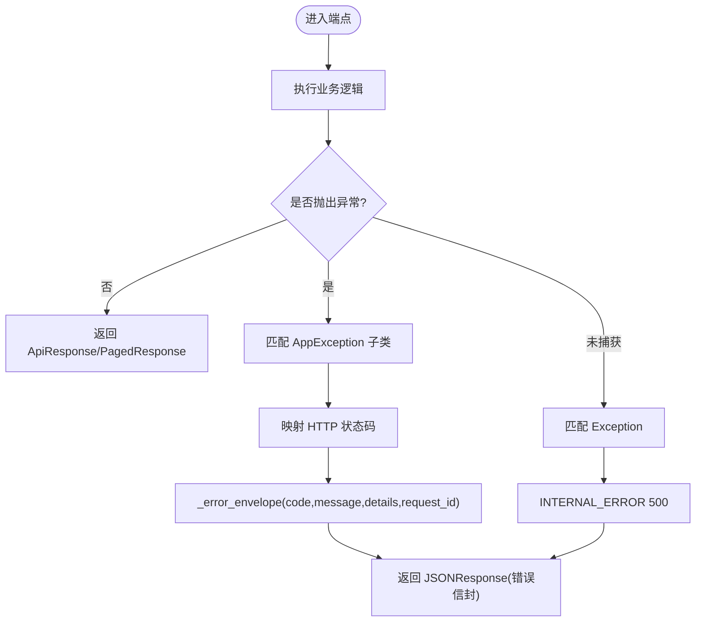
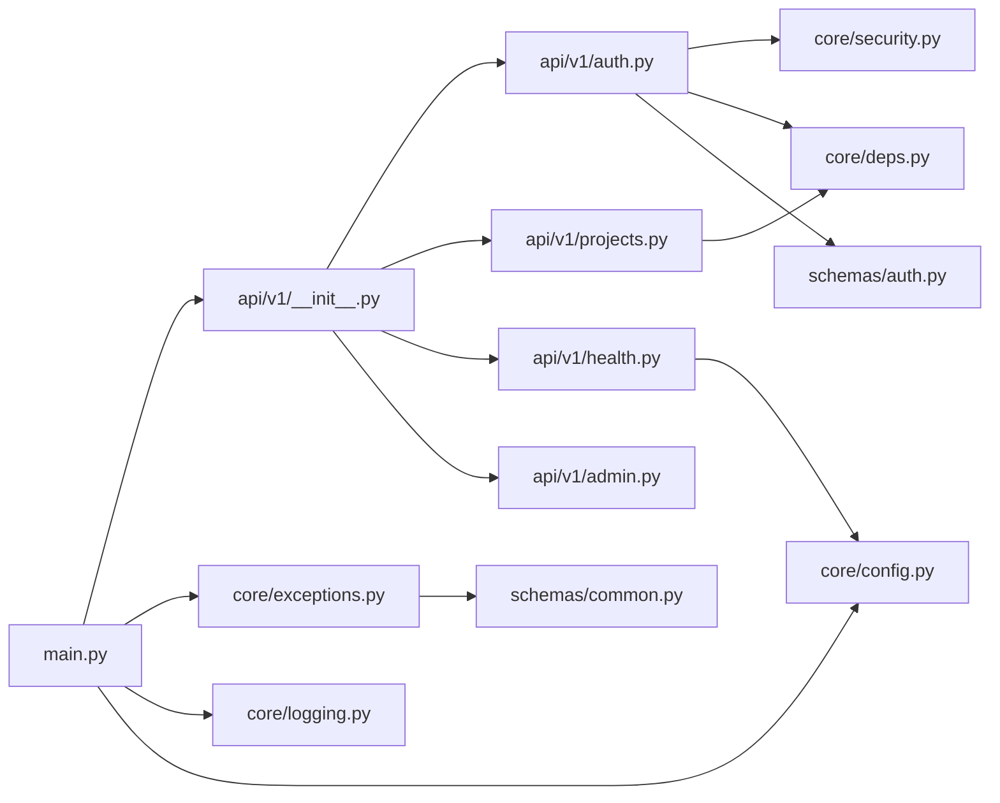

# API概览与规范

<cite>
**本文引用的文件**   
- [backend/app/main.py](file://backend/app/main.py)
- [backend/app/api/v1/__init__.py](file://backend/app/api/v1/__init__.py)
- [backend/app/core/exceptions.py](file://backend/app/core/exceptions.py)
- [backend/app/schemas/common.py](file://backend/app/schemas/common.py)
- [backend/app/core/security.py](file://backend/app/core/security.py)
- [backend/app/api/v1/auth.py](file://backend/app/api/v1/auth.py)
- [backend/app/core/config.py](file://backend/app/core/config.py)
- [backend/app/api/v1/projects.py](file://backend/app/api/v1/projects.py)
- [backend/app/api/v1/health.py](file://backend/app/api/v1/health.py)
- [backend/app/core/deps.py](file://backend/app/core/deps.py)
- [backend/app/schemas/auth.py](file://backend/app/schemas/auth.py)
- [backend/app/api/v1/admin.py](file://backend/app/api/v1/admin.py)
- [backend/app/core/logging.py](file://backend/app/core/logging.py)
</cite>

## 目录
1. [简介](#简介)
2. [项目结构](#项目结构)
3. [核心组件](#核心组件)
4. [架构总览](#架构总览)
5. [详细组件分析](#详细组件分析)
6. [依赖关系分析](#依赖关系分析)
7. [性能考虑](#性能考虑)
8. [故障排查指南](#故障排查指南)
9. [结论](#结论)
10. [附录](#附录)

## 简介
本文件为AI药物设计系统的API概览与规范，面向API消费者与集成方，覆盖RESTful设计原则、统一请求响应格式、认证机制、错误处理策略、版本管理、速率限制、监控与调试等。系统采用FastAPI构建，所有HTTP响应遵循统一信封格式{success, data, meta}，并通过中间件自动注入追踪与耗时信息；认证基于JWT Bearer Token，提供登录、刷新与当前用户信息接口；错误通过全局异常处理器统一封装返回。

## 项目结构
后端采用分层组织：入口应用负责中间件、路由挂载与全局配置；v1路由聚合各业务模块；core层提供安全、异常、配置、依赖注入与日志；schemas定义统一的响应信封与分页元数据；models与services承载领域逻辑与外部调用。

图示来源
- [backend/app/main.py:187-248](file://backend/app/main.py#L187-L248)
- [backend/app/api/v1/__init__.py:24-41](file://backend/app/api/v1/__init__.py#L24-L41)
- [backend/app/api/v1/health.py:53-102](file://backend/app/api/v1/health.py#L53-L102)
- [backend/app/api/v1/auth.py:38-147](file://backend/app/api/v1/auth.py#L38-L147)
- [backend/app/api/v1/projects.py:29-169](file://backend/app/api/v1/projects.py#L29-L169)
- [backend/app/api/v1/admin.py:25-50](file://backend/app/api/v1/admin.py#L25-L50)
- [backend/app/core/exceptions.py:131-179](file://backend/app/core/exceptions.py#L131-L179)
- [backend/app/core/security.py:155-211](file://backend/app/core/security.py#L155-L211)
- [backend/app/core/deps.py:83-129](file://backend/app/core/deps.py#L83-L129)
- [backend/app/core/config.py:21-144](file://backend/app/core/config.py#L21-L144)
- [backend/app/schemas/common.py:63-89](file://backend/app/schemas/common.py#L63-L89)
- [backend/app/schemas/auth.py:47-61](file://backend/app/schemas/auth.py#L47-L61)
- [backend/app/core/logging.py:20-74](file://backend/app/core/logging.py#L20-L74)

章节来源
- [backend/app/main.py:187-248](file://backend/app/main.py#L187-L248)
- [backend/app/api/v1/__init__.py:24-41](file://backend/app/api/v1/__init__.py#L24-L41)

## 核心组件
- 统一信封响应
  - 成功响应：ApiResponse(success=true, data=..., meta={request_id, duration_ms})
  - 分页响应：PagedResponse(success=true, data=[...], meta={page, page_size, total, total_pages, request_id, duration_ms})
  - 错误响应：ErrorResponse(success=false, error={code, message, details}, meta={request_id})
  - 元数据字段由中间件在200且application/json时自动注入duration_ms；所有响应均包含request_id（来自请求头或生成）
- 认证与授权
  - JWT access/refresh token，Bearer方式；登录返回access_token、refresh_token、token_type、expires_in与user信息
  - 角色守卫：require_roles用于端点级权限控制
- 全局异常处理
  - AppException及其子类映射到标准HTTP状态码与统一错误信封
  - 参数校验失败、未捕获异常均有兜底处理
- 版本管理
  - 路由前缀/api/v1；应用标题与版本由配置注入
- 中间件能力
  - EnvelopeMiddleware：解析/生成X-Request-ID、计算耗时并写入响应头X-Response-Time-ms、在meta中注入duration_ms
  - CORS：允许跨域源、暴露追踪相关响应头
- 监控与可观测性
  - OpenAPI文档：/docs、/redoc、/openapi.json
  - Prometheus指标：/api/v1/metrics（文本格式）
  - 健康检查：/api/v1/health（含依赖健康度与缓存）
  - 结构化日志：loguru，生产JSON输出，开发彩色控制台，按大小/时间轮转

章节来源
- [backend/app/schemas/common.py:35-89](file://backend/app/schemas/common.py#L35-L89)
- [backend/app/core/exceptions.py:19-94](file://backend/app/core/exceptions.py#L19-L94)
- [backend/app/core/exceptions.py:131-179](file://backend/app/core/exceptions.py#L131-L179)
- [backend/app/core/security.py:96-149](file://backend/app/core/security.py#L96-L149)
- [backend/app/core/security.py:194-211](file://backend/app/core/security.py#L194-L211)
- [backend/app/api/v1/auth.py:70-134](file://backend/app/api/v1/auth.py#L70-L134)
- [backend/app/api/v1/admin.py:28-50](file://backend/app/api/v1/admin.py#L28-L50)
- [backend/app/api/v1/health.py:53-102](file://backend/app/api/v1/health.py#L53-L102)
- [backend/app/main.py:198-233](file://backend/app/main.py#L198-L233)
- [backend/app/main.py:29-185](file://backend/app/main.py#L29-L185)
- [backend/app/core/logging.py:20-74](file://backend/app/core/logging.py#L20-L74)

## 架构总览
下图展示从客户端到服务端的完整请求链路，包括中间件、认证、路由、异常处理与响应信封的组装过程。

图示来源
- [backend/app/main.py:29-185](file://backend/app/main.py#L29-L185)
- [backend/app/core/security.py:155-184](file://backend/app/core/security.py#L155-L184)
- [backend/app/core/exceptions.py:131-179](file://backend/app/core/exceptions.py#L131-L179)
- [backend/app/core/deps.py:101-129](file://backend/app/core/deps.py#L101-L129)

## 详细组件分析

### 统一信封与元数据
- 成功响应结构
  - success: true
  - data: 任意业务数据
  - meta: {request_id, duration_ms}
- 分页响应结构
  - success: true
  - data: 列表
  - meta: {page, page_size, total, total_pages, request_id, duration_ms}
- 错误响应结构
  - success: false
  - error: {code, message, details}
  - meta: {request_id}
- 元数据注入规则
  - 仅对200状态且application/json响应且存在meta字段时，中间件会注入duration_ms
  - 所有响应都会确保包含X-Request-ID与X-Response-Time-ms响应头

章节来源
- [backend/app/schemas/common.py:35-89](file://backend/app/schemas/common.py#L35-L89)
- [backend/app/main.py:107-129](file://backend/app/main.py#L107-L129)
- [backend/app/main.py:130-170](file://backend/app/main.py#L130-L170)

### 认证与授权
- 登录流程
  - POST /api/v1/auth/login：邮箱+密码，返回access_token、refresh_token、token_type、expires_in与user信息
  - 使用bcrypt哈希存储密码，verify_password进行恒定时间比较
- 刷新令牌
  - POST /api/v1/auth/refresh：使用refresh_token换取新的access_token与refresh_token
- 获取当前用户
  - GET /api/v1/auth/me：需要有效access_token
- 角色守卫
  - require_roles("founder","pi")等用于端点级权限控制
- 依赖注入
  - get_current_user_id/get_current_user_role：从Authorization头提取并校验JWT
  - get_request_id：优先使用X-Request-ID，否则生成UUID

图示来源
- [backend/app/api/v1/auth.py:70-101](file://backend/app/api/v1/auth.py#L70-L101)
- [backend/app/core/security.py:46-58](file://backend/app/core/security.py#L46-58)
- [backend/app/core/security.py:96-122](file://backend/app/core/security.py#L96-L122)
- [backend/app/schemas/auth.py:47-61](file://backend/app/schemas/auth.py#L47-L61)

章节来源
- [backend/app/api/v1/auth.py:41-147](file://backend/app/api/v1/auth.py#L41-L147)
- [backend/app/core/security.py:155-211](file://backend/app/core/security.py#L155-211)
- [backend/app/core/deps.py:91-99](file://backend/app/core/deps.py#L91-99)

### 错误处理策略
- 业务异常
  - AppException及其子类：ValidationError、UnauthorizedError、ForbiddenError、NotFoundError、ConflictError、GuardrailBlockedError、RateLimitedError、UpstreamError
  - 每个异常携带默认HTTP状态码与错误码
- 全局异常处理器
  - AppException -> JSONResponse(status_code, _error_envelope(...))
  - RequestValidationError -> 400，附带errors详情
  - 未捕获异常 -> 500 INTERNAL_ERROR
- 错误信封
  - success=false，error.code/message/details，meta.request_id

图示来源
- [backend/app/core/exceptions.py:19-94](file://backend/app/core/exceptions.py#L19-L94)
- [backend/app/core/exceptions.py:131-179](file://backend/app/core/exceptions.py#L131-L179)

章节来源
- [backend/app/core/exceptions.py:19-94](file://backend/app/core/exceptions.py#L19-L94)
- [backend/app/core/exceptions.py:131-179](file://backend/app/core/exceptions.py#L131-L179)

### 版本管理与路由
- 版本前缀：/api/v1
- 路由聚合：v1/__init__.py集中注册各子路由
- 根路径重定向至文档

章节来源
- [backend/app/main.py:233-240](file://backend/app/main.py#L233-240)
- [backend/app/api/v1/__init__.py:24-41](file://backend/app/api/v1/__init__.py#L24-L41)

### 速率限制
- 已定义 RateLimitedError（429），可用于实现限流后返回统一错误信封
- 当前代码未内置全局限流中间件，可在网关或中间件层集成（例如基于Redis的滑动窗口）

章节来源
- [backend/app/core/exceptions.py:84-87](file://backend/app/core/exceptions.py#L84-L87)

### 健康检查与监控
- 健康检查：GET /api/v1/health，返回整体状态、版本与各依赖健康度（Postgres/Redis/Chroma），带短TTL内存缓存
- 指标导出：GET /api/v1/metrics，Prometheus文本格式（示例指标行）
- 文档：/docs、/redoc、/openapi.json

章节来源
- [backend/app/api/v1/health.py:53-102](file://backend/app/api/v1/health.py#L53-L102)
- [backend/app/api/v1/admin.py:28-50](file://backend/app/api/v1/admin.py#L28-L50)
- [backend/app/main.py:210-213](file://backend/app/main.py#L210-L213)

### 日志与可观测性
- loguru初始化：生产JSON输出，开发彩色控制台；文件按大小/时间轮转，错误单独归档
- 中间件记录每次请求的方法、路径、状态码与耗时

章节来源
- [backend/app/core/logging.py:20-74](file://backend/app/core/logging.py#L20-L74)
- [backend/app/main.py:172-185](file://backend/app/main.py#L172-L185)

## 依赖关系分析
- 应用入口依赖：配置、异常处理器、日志、路由聚合
- 认证依赖：安全模块（JWT）、依赖注入（用户对象、分页、请求ID）
- 业务端点依赖：数据库会话、模型与Schema、权限守卫
- 中间件依赖：请求ID、耗时统计、CORS、OpenAPI

图示来源
- [backend/app/main.py:187-248](file://backend/app/main.py#L187-L248)
- [backend/app/api/v1/__init__.py:24-41](file://backend/app/api/v1/__init__.py#L24-L41)
- [backend/app/api/v1/auth.py:38-147](file://backend/app/api/v1/auth.py#L38-L147)
- [backend/app/api/v1/projects.py:29-169](file://backend/app/api/v1/projects.py#L29-L169)
- [backend/app/api/v1/health.py:53-102](file://backend/app/api/v1/health.py#L53-L102)
- [backend/app/api/v1/admin.py:25-50](file://backend/app/api/v1/admin.py#L25-L50)
- [backend/app/core/exceptions.py:131-179](file://backend/app/core/exceptions.py#L131-L179)
- [backend/app/core/security.py:155-211](file://backend/app/core/security.py#L155-211)
- [backend/app/core/deps.py:83-129](file://backend/app/core/deps.py#L83-L129)
- [backend/app/core/config.py:21-144](file://backend/app/core/config.py#L21-L144)
- [backend/app/schemas/common.py:63-89](file://backend/app/schemas/common.py#L63-L89)
- [backend/app/schemas/auth.py:47-61](file://backend/app/schemas/auth.py#L47-L61)

## 性能考虑
- 用户对象短TTL缓存：减少频繁数据库查询
- 健康检查缓存：避免高频健康探测打满数据库
- 中间件缓冲模式：仅在最后一片body重写响应头与content-length，降低开销
- 建议
  - 在生产环境启用反向代理缓存静态资源与OpenAPI文档
  - 对热点接口增加服务端缓存或读写分离
  - 合理设置分页上限与索引优化

## 故障排查指南
- 定位请求
  - 使用X-Request-ID与响应头X-Response-Time-ms进行端到端追踪
  - 查看logs目录下的app_*.log与error_*.log
- 常见错误
  - VALIDATION_ERROR：检查请求体结构与类型
  - UNAUTHORIZED/FORBIDDEN：确认Authorization头与角色权限
  - RATE_LIMITED：检查限流策略与重试退避
  - UPSTREAM_ERROR：检查外部知识库/LLM可用性
- 诊断工具
  - Swagger UI：/docs
  - Redoc：/redoc
  - OpenAPI JSON：/openapi.json
  - Prometheus指标：/api/v1/metrics

章节来源
- [backend/app/core/deps.py:91-99](file://backend/app/core/deps.py#L91-99)
- [backend/app/core/logging.py:20-74](file://backend/app/core/logging.py#L20-L74)
- [backend/app/core/exceptions.py:131-179](file://backend/app/core/exceptions.py#L131-L179)
- [backend/app/api/v1/admin.py:28-50](file://backend/app/api/v1/admin.py#L28-L50)
- [backend/app/main.py:210-213](file://backend/app/main.py#L210-L213)

## 结论
本系统以统一信封响应、JWT认证、全局异常处理与中间件增强为核心，提供了清晰、一致、可观测的API体验。通过版本化路由、健康检查与指标导出，便于集成与运维。建议在网关层补充速率限制与更完善的审计，进一步提升稳定性与安全性。

## 附录

### RESTful 设计原则
- 资源命名：名词复数形式，如/projects、/datasets、/targets、/molecules、/reports、/hypotheses、/chat、/federated、/privacy、/feedback、/efficacy
- 方法语义：GET读、POST创建、PATCH部分更新、DELETE软删除（status='archived'）
- 状态码：200成功、201创建、400参数错误、401未认证、403无权限、404不存在、409冲突、422护栏拦截、429限流、502上游错误、500内部错误
- 分页：page/page_size，返回total/total_pages
- 排序与过滤：Query参数，如/status

章节来源
- [backend/app/api/v1/__init__.py:24-41](file://backend/app/api/v1/__init__.py#L24-L41)
- [backend/app/api/v1/projects.py:47-169](file://backend/app/api/v1/projects.py#L47-L169)
- [backend/app/core/exceptions.py:52-94](file://backend/app/core/exceptions.py#L52-L94)

### 统一信封格式定义
- 成功响应
  - success: boolean
  - data: any
  - meta: {request_id: string, duration_ms?: number}
- 分页响应
  - success: boolean
  - data: array
  - meta: {page: number, page_size: number, total: number, total_pages: number, request_id: string, duration_ms?: number}
- 错误响应
  - success: boolean(false)
  - error: {code: string, message: string, details: object?}
  - meta: {request_id: string}

章节来源
- [backend/app/schemas/common.py:35-89](file://backend/app/schemas/common.py#L35-L89)
- [backend/app/core/exceptions.py:99-126](file://backend/app/core/exceptions.py#L99-L126)

### 认证机制
- 登录：POST /api/v1/auth/login
- 刷新：POST /api/v1/auth/refresh
- 当前用户：GET /api/v1/auth/me
- 鉴权头：Authorization: Bearer <access_token>
- 角色守卫：require_roles(...)

章节来源
- [backend/app/api/v1/auth.py:70-134](file://backend/app/api/v1/auth.py#L70-L134)
- [backend/app/core/security.py:155-211](file://backend/app/core/security.py#L155-211)

### 错误码与消息
- VALIDATION_ERROR：请求参数校验失败
- UNAUTHORIZED：缺少或无效token
- FORBIDDEN：权限不足
- NOT_FOUND：资源不存在
- CONFLICT：资源冲突
- GUARDRAIL_BLOCKED：LLM安全护栏拦截
- RATE_LIMITED：请求过多
- UPSTREAM_ERROR：外部服务不可用
- INTERNAL_ERROR：服务器内部错误

章节来源
- [backend/app/core/exceptions.py:52-94](file://backend/app/core/exceptions.py#L52-L94)

### 最佳实践与集成指南
- 客户端SDK
  - 统一封装：解析ApiResponse.success/data/meta，处理错误信封
  - 重试与退避：对429/5xx实施指数退避与幂等重试（仅限GET/HEAD）
  - 超时与连接池：合理设置超时与最大并发
  - 追踪：透传X-Request-ID，记录X-Response-Time-ms
- 调试工具
  - Swagger UI：/docs
  - Redoc：/redoc
  - OpenAPI JSON：/openapi.json
  - 健康检查：/api/v1/health
  - 指标：/api/v1/metrics
- 监控方法
  - 日志：结构化JSON，按天轮转，错误独立归档
  - 指标：Prometheus文本格式，可扩展qps、latency、llm_cost、error_rate
  - 告警：基于错误率、延迟分位、上游健康度

章节来源
- [backend/app/main.py:210-213](file://backend/app/main.py#L210-L213)
- [backend/app/api/v1/health.py:53-102](file://backend/app/api/v1/health.py#L53-L102)
- [backend/app/api/v1/admin.py:28-50](file://backend/app/api/v1/admin.py#L28-L50)
- [backend/app/core/logging.py:20-74](file://backend/app/core/logging.py#L20-L74)