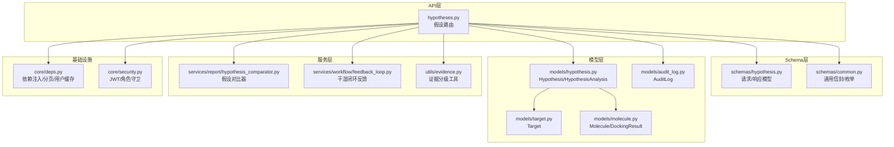
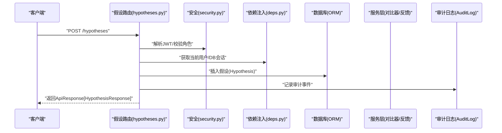
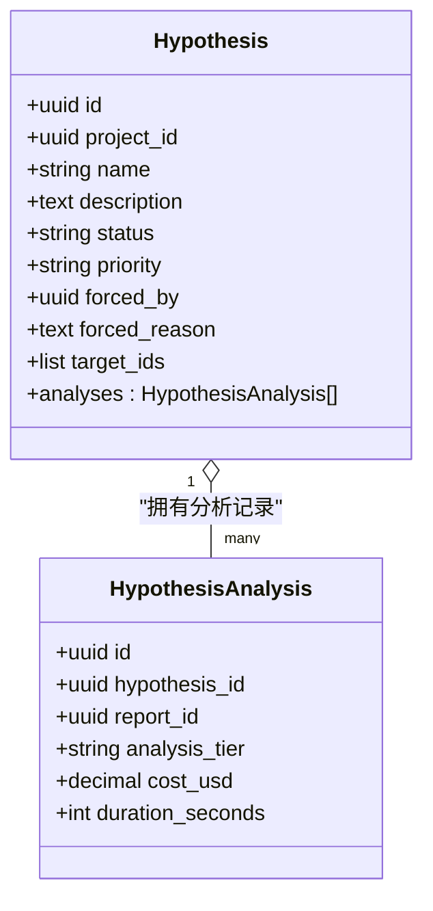
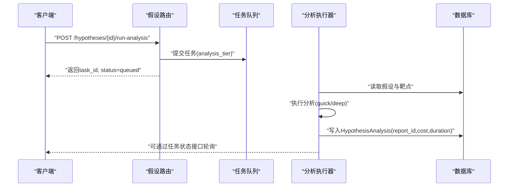
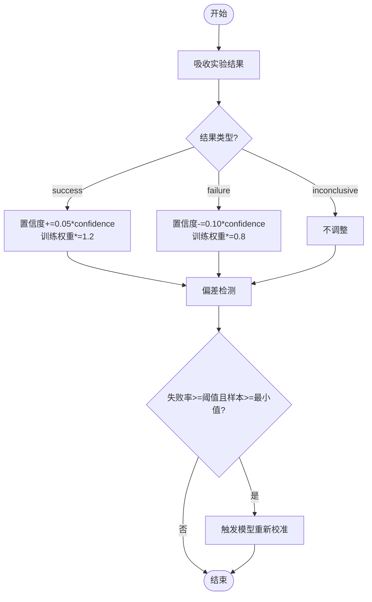
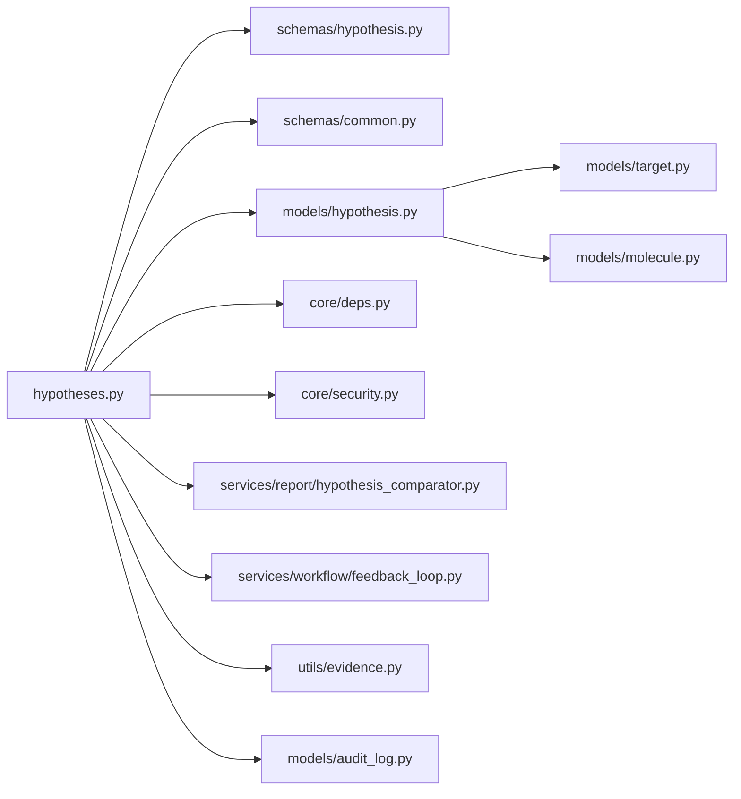

# 假设管理API

<cite>
**本文引用的文件**
- [hypotheses.py](file://backend/app/api/v1/hypotheses.py)
- [hypothesis.py](file://backend/app/models/hypothesis.py)
- [hypothesis.py](file://backend/app/schemas/hypothesis.py)
- [common.py](file://backend/app/schemas/common.py)
- [deps.py](file://backend/app/core/deps.py)
- [security.py](file://backend/app/core/security.py)
- [audit_log.py](file://backend/app/models/audit_log.py)
- [target.py](file://backend/app/models/target.py)
- [molecule.py](file://backend/app/models/molecule.py)
- [evidence.py](file://backend/app/utils/evidence.py)
- [hypothesis_comparator.py](file://backend/app/services/report/hypothesis_comparator.py)
- [feedback_loop.py](file://backend/app/services/workflow/feedback_loop.py)
</cite>

## 目录
1. [简介](#简介)
2. [项目结构](#项目结构)
3. [核心组件](#核心组件)
4. [架构总览](#架构总览)
5. [详细组件分析](#详细组件分析)
6. [依赖关系分析](#依赖关系分析)
7. [性能与可扩展性](#性能与可扩展性)
8. [故障排查指南](#故障排查指南)
9. [结论](#结论)
10. [附录：接口规范与最佳实践](#附录接口规范与最佳实践)

## 简介
本文件为“假设管理”模块的完整API文档，覆盖假设的全生命周期管理（创建、查询、更新、验证、合并、淘汰）、证据链构建与置信度评估机制、版本与变更追踪、协作评审流程、假设比较分析与冲突检测、与靶点/分子/实验数据的关联管理、权限控制与审计日志、以及假设驱动的工作流编排与自动化验证反馈闭环。文档面向研发、数据科学、临床转化与工程团队，提供从概念到落地的系统化说明。

## 项目结构
假设管理功能位于后端FastAPI应用中，采用分层架构：
- API层：路由定义与请求/响应校验
- 模型层：ORM实体与关系映射
- Schema层：Pydantic数据模型与枚举约束
- 服务层：对比器、工作流与证据工具
- 安全与依赖注入：认证、鉴权、分页、请求ID等通用能力
- 审计日志：不可篡改的操作记录

图表来源
- [hypotheses.py:1-273](file://backend/app/api/v1/hypotheses.py#L1-L273)
- [hypothesis.py:1-119](file://backend/app/schemas/hypothesis.py#L1-L119)
- [common.py:1-158](file://backend/app/schemas/common.py#L1-L158)
- [hypothesis.py:1-66](file://backend/app/models/hypothesis.py#L1-L66)
- [target.py:1-52](file://backend/app/models/target.py#L1-L52)
- [molecule.py:1-61](file://backend/app/models/molecule.py#L1-L61)
- [audit_log.py:1-45](file://backend/app/models/audit_log.py#L1-L45)
- [hypothesis_comparator.py:1-181](file://backend/app/services/report/hypothesis_comparator.py#L1-L181)
- [feedback_loop.py:1-281](file://backend/app/services/workflow/feedback_loop.py#L1-L281)
- [deps.py:1-129](file://backend/app/core/deps.py#L1-L129)
- [security.py:1-211](file://backend/app/core/security.py#L1-L211)

章节来源
- [hypotheses.py:1-273](file://backend/app/api/v1/hypotheses.py#L1-L273)
- [hypothesis.py:1-66](file://backend/app/models/hypothesis.py#L1-L66)
- [hypothesis.py:1-119](file://backend/app/schemas/hypothesis.py#L1-L119)
- [common.py:1-158](file://backend/app/schemas/common.py#L1-L158)
- [deps.py:1-129](file://backend/app/core/deps.py#L1-L129)
- [security.py:1-211](file://backend/app/core/security.py#L1-L211)
- [audit_log.py:1-45](file://backend/app/models/audit_log.py#L1-L45)
- [target.py:1-52](file://backend/app/models/target.py#L1-L52)
- [molecule.py:1-61](file://backend/app/models/molecule.py#L1-L61)
- [evidence.py:1-103](file://backend/app/utils/evidence.py#L1-L103)
- [hypothesis_comparator.py:1-181](file://backend/app/services/report/hypothesis_comparator.py#L1-L181)
- [feedback_loop.py:1-281](file://backend/app/services/workflow/feedback_loop.py#L1-L281)

## 核心组件
- 假设路由（API）：提供假设的创建、列表、详情、运行分析、对比、合并、淘汰等端点。
- 假设模型（ORM）：定义假设及其分析记录的持久化结构与关系。
- 假设Schema：定义请求/响应体、字段校验与枚举约束。
- 假设对比器（服务）：横向对比多个假设，计算共享/独有靶点并给出建议。
- 证据分级工具（工具）：依据来源与载荷推断证据等级，统计分布与最高等级。
- 干湿闭环反馈（服务）：接收湿实验结果，动态调整靶点置信度，检测系统性偏差并触发模型重新校准。
- 安全与依赖注入：JWT鉴权、角色守卫、分页、请求ID、用户对象缓存。
- 审计日志：不可变操作记录，支持按动作和时间范围检索。

章节来源
- [hypotheses.py:1-273](file://backend/app/api/v1/hypotheses.py#L1-L273)
- [hypothesis.py:1-66](file://backend/app/models/hypothesis.py#L1-L66)
- [hypothesis.py:1-119](file://backend/app/schemas/hypothesis.py#L1-L119)
- [hypothesis_comparator.py:1-181](file://backend/app/services/report/hypothesis_comparator.py#L1-L181)
- [evidence.py:1-103](file://backend/app/utils/evidence.py#L1-L103)
- [feedback_loop.py:1-281](file://backend/app/services/workflow/feedback_loop.py#L1-L281)
- [security.py:1-211](file://backend/app/core/security.py#L1-L211)
- [deps.py:1-129](file://backend/app/core/deps.py#L1-L129)
- [audit_log.py:1-45](file://backend/app/models/audit_log.py#L1-L45)

## 架构总览
假设管理在API层暴露RESTful端点，通过依赖注入获取数据库会话与当前用户；业务逻辑由服务层实现（对比器、反馈循环），并通过工具函数进行证据分级与置信度计算。所有关键写操作应写入审计日志，确保可追溯。

图表来源
- [hypotheses.py:39-59](file://backend/app/api/v1/hypotheses.py#L39-L59)
- [security.py:155-211](file://backend/app/core/security.py#L155-L211)
- [deps.py:101-129](file://backend/app/core/deps.py#L101-L129)
- [hypothesis.py:15-47](file://backend/app/models/hypothesis.py#L15-L47)
- [audit_log.py:15-45](file://backend/app/models/audit_log.py#L15-L45)

## 详细组件分析

### 假设API端点
- 创建假设
  - 方法路径：POST /api/v1/hypotheses
  - 请求体：HypothesisCreate（包含project_id、name、description、target_ids）
  - 行为：创建假设记录，设置默认状态与优先级，写入审计日志
  - 响应：ApiResponse[HypothesisResponse]
- 列出假设
  - 方法路径：GET /api/v1/hypotheses
  - 查询参数：project_id、status、page、page_size
  - 行为：按条件过滤、排序、分页
  - 响应：PagedResponse[HypothesisResponse]
- 获取假设详情
  - 方法路径：GET /api/v1/hypotheses/{id}
  - 行为：根据ID查询，不存在则抛出未找到错误
  - 响应：ApiResponse[HypothesisResponse]
- 运行分析
  - 方法路径：POST /api/v1/hypotheses/{id}/run-analysis
  - 请求体：RunAnalysisRequest（analysis_tier）
  - 行为：将分析任务入队，返回任务信息（异步）
  - 响应：ApiResponse[dict]（含task_id、status=queued）
- 对比假设
  - 方法路径：GET /api/v1/hypotheses/compare
  - 查询参数：ids（逗号分隔的UUID列表）
  - 行为：加载多假设及最新分析，计算共享/独有靶点
  - 响应：ApiResponse[HypothesisCompareResponse]
- 合并假设
  - 方法路径：POST /api/v1/hypotheses/{id}/merge
  - 请求体：MergeRequest（into_hypothesis_id）
  - 行为：将源假设的靶点并入目标假设，标记源假设为merged
  - 响应：ApiResponse[HypothesisResponse]
- 淘汰假设
  - 方法路径：POST /api/v1/hypotheses/{id}/eliminate
  - 行为：将假设状态置为eliminated，保留历史
  - 响应：ApiResponse[HypothesisResponse]

图表来源
- [hypothesis.py:15-66](file://backend/app/models/hypothesis.py#L15-L66)

章节来源
- [hypotheses.py:39-273](file://backend/app/api/v1/hypotheses.py#L39-L273)
- [hypothesis.py:15-66](file://backend/app/models/hypothesis.py#L15-L66)
- [hypothesis.py:20-119](file://backend/app/schemas/hypothesis.py#L20-L119)
- [common.py:153-158](file://backend/app/schemas/common.py#L153-L158)

### 假设对比与分析流水线
- 对比器
  - 输入：假设列表（含targets、evidence_score、status、priority等）
  - 输出：对比表、全局共享靶点、两两共享靶点、行动建议
  - 算法要点：交集/并集计算、证据强度排序、重叠率阈值建议合并
- 运行分析
  - 入队后由后台任务执行，生成报告并回写HypothesisAnalysis记录
  - 支持quick/deep两种层级，记录成本与耗时

图表来源
- [hypotheses.py:185-211](file://backend/app/api/v1/hypotheses.py#L185-L211)
- [hypothesis.py:49-66](file://backend/app/models/hypothesis.py#L49-L66)
- [hypothesis_comparator.py:26-89](file://backend/app/services/report/hypothesis_comparator.py#L26-L89)

章节来源
- [hypotheses.py:185-211](file://backend/app/api/v1/hypotheses.py#L185-L211)
- [hypothesis.py:49-66](file://backend/app/models/hypothesis.py#L49-L66)
- [hypothesis_comparator.py:26-89](file://backend/app/services/report/hypothesis_comparator.py#L26-L89)

### 证据链构建与置信度评估
- 证据分级
  - 依据来源类型与载荷推断证据等级（I/II/III/IV）
  - 支持显式指定等级或自动判定（如已获批药物→I级）
- 置信度动态调整
  - 成功+0.05×confidence，失败-0.10×confidence，边界钳制[0,1]
  - 训练权重随结果上调/下调，用于模型再训练
- 系统性偏差检测
  - 失败率≥阈值且样本数≥最小值时触发重新校准
  - 记录重新校准事件，影响多个下游模型

图表来源
- [evidence.py:39-103](file://backend/app/utils/evidence.py#L39-L103)
- [feedback_loop.py:99-163](file://backend/app/services/workflow/feedback_loop.py#L99-L163)
- [feedback_loop.py:165-206](file://backend/app/services/workflow/feedback_loop.py#L165-L206)
- [feedback_loop.py:208-231](file://backend/app/services/workflow/feedback_loop.py#L208-L231)

章节来源
- [evidence.py:39-103](file://backend/app/utils/evidence.py#L39-L103)
- [feedback_loop.py:99-163](file://backend/app/services/workflow/feedback_loop.py#L99-L163)
- [feedback_loop.py:165-206](file://backend/app/services/workflow/feedback_loop.py#L165-L206)
- [feedback_loop.py:208-231](file://backend/app/services/workflow/feedback_loop.py#L208-L231)

### 版本控制、变更追踪与协作评审
- 版本控制
  - 通过HypothesisAnalysis记录每次分析的快照（report_id、tier、cost、duration）
  - 使用created_at/updated_at时间戳维护版本演进
- 变更追踪
  - 所有写操作应记录审计日志（before_value/after_value），支持按action与时间范围检索
- 协作评审
  - 基于对比器输出生成建议（合并/淘汰/并行推进）
  - 高优先级假设优先分配资源，共享靶点优先验证

章节来源
- [hypothesis.py:49-66](file://backend/app/models/hypothesis.py#L49-L66)
- [audit_log.py:15-45](file://backend/app/models/audit_log.py#L15-L45)
- [hypothesis_comparator.py:91-146](file://backend/app/services/report/hypothesis_comparator.py#L91-L146)

### 假设比较分析、冲突检测与一致性验证
- 比较分析
  - 计算共享/独有靶点，生成对比行（含top_targets、summary等）
  - 支持两两共享靶点与全局共享靶点
- 冲突检测
  - 当多假设存在大量共享靶点时，建议合并以减少资源消耗
  - 证据强度差异显著时，建议淘汰弱假设或合并至强假设
- 一致性验证
  - 结合证据分级与置信度，对靶点选择进行一致性校验
  - 反馈循环持续修正置信度，避免长期偏差

章节来源
- [hypotheses.py:103-164](file://backend/app/api/v1/hypotheses.py#L103-L164)
- [hypothesis_comparator.py:26-89](file://backend/app/services/report/hypothesis_comparator.py#L26-L89)
- [hypothesis_comparator.py:148-180](file://backend/app/services/report/hypothesis_comparator.py#L148-L180)
- [evidence.py:39-103](file://backend/app/utils/evidence.py#L39-L103)

### 与靶点、分子、实验数据的关联管理
- 靶点关联
  - 假设通过target_ids与靶点建立关联，支持TopN展示与共享/独有分析
- 分子关联
  - 分子与靶点存在一对多关系，对接结果记录于DockingResult
- 实验数据
  - 反馈循环接收湿实验结果，更新靶点置信度与训练权重

章节来源
- [hypotheses.py:132-149](file://backend/app/api/v1/hypotheses.py#L132-L149)
- [target.py:14-52](file://backend/app/models/target.py#L14-L52)
- [molecule.py:14-61](file://backend/app/models/molecule.py#L14-L61)
- [feedback_loop.py:99-163](file://backend/app/services/workflow/feedback_loop.py#L99-L163)

### 权限控制、审计日志与数据完整性保障
- 权限控制
  - JWT access token校验，角色守卫限制敏感操作
  - 当前用户对象短TTL内存缓存，减少数据库压力
- 审计日志
  - 不可变记录（append-only），支持按action与时间范围高效扫描
- 数据完整性
  - 外键约束与级联删除，JSONB字段存储灵活元数据
  - 统一响应信封与错误封装，保证前后端契约一致

章节来源
- [security.py:155-211](file://backend/app/core/security.py#L155-L211)
- [deps.py:101-129](file://backend/app/core/deps.py#L101-L129)
- [audit_log.py:15-45](file://backend/app/models/audit_log.py#L15-L45)
- [common.py:63-89](file://backend/app/schemas/common.py#L63-L89)

### 假设驱动的工作流编排、自动化验证与结果反馈
- 工作流编排
  - 假设作为工作流节点，驱动分析任务、报告生成与评审流程
- 自动化验证
  - 运行分析接口返回任务ID，后台执行器完成计算并回写结果
- 结果反馈
  - 湿实验结果回流，动态调整置信度与训练权重，触发模型重新校准

章节来源
- [hypotheses.py:185-211](file://backend/app/api/v1/hypotheses.py#L185-L211)
- [feedback_loop.py:99-163](file://backend/app/services/workflow/feedback_loop.py#L99-L163)
- [feedback_loop.py:208-231](file://backend/app/services/workflow/feedback_loop.py#L208-L231)

## 依赖关系分析
- 组件耦合
  - API层依赖Schema与模型，服务层独立于HTTP协议，便于复用与测试
  - 安全与依赖注入贯穿各层，提供统一的认证、鉴权与上下文
- 外部依赖
  - 数据库（PostgreSQL/兼容）、任务队列（后台执行器）、存储（S3/本地）
- 潜在循环依赖
  - 模型间通过relationship声明，避免直接导入循环
- 接口契约
  - 统一响应信封与分页元数据，确保前端稳定解析

图表来源
- [hypotheses.py:1-273](file://backend/app/api/v1/hypotheses.py#L1-L273)
- [hypothesis.py:1-119](file://backend/app/schemas/hypothesis.py#L1-L119)
- [common.py:1-158](file://backend/app/schemas/common.py#L1-L158)
- [hypothesis.py:1-66](file://backend/app/models/hypothesis.py#L1-L66)
- [target.py:1-52](file://backend/app/models/target.py#L1-L52)
- [molecule.py:1-61](file://backend/app/models/molecule.py#L1-L61)
- [audit_log.py:1-45](file://backend/app/models/audit_log.py#L1-L45)
- [hypothesis_comparator.py:1-181](file://backend/app/services/report/hypothesis_comparator.py#L1-L181)
- [feedback_loop.py:1-281](file://backend/app/services/workflow/feedback_loop.py#L1-L281)
- [evidence.py:1-103](file://backend/app/utils/evidence.py#L1-L103)
- [deps.py:1-129](file://backend/app/core/deps.py#L1-L129)
- [security.py:1-211](file://backend/app/core/security.py#L1-L211)

章节来源
- [hypotheses.py:1-273](file://backend/app/api/v1/hypotheses.py#L1-L273)
- [hypothesis.py:1-119](file://backend/app/schemas/hypothesis.py#L1-L119)
- [common.py:1-158](file://backend/app/schemas/common.py#L1-L158)
- [hypothesis.py:1-66](file://backend/app/models/hypothesis.py#L1-L66)
- [target.py:1-52](file://backend/app/models/target.py#L1-L52)
- [molecule.py:1-61](file://backend/app/models/molecule.py#L1-L61)
- [audit_log.py:1-45](file://backend/app/models/audit_log.py#L1-L45)
- [hypothesis_comparator.py:1-181](file://backend/app/services/report/hypothesis_comparator.py#L1-L181)
- [feedback_loop.py:1-281](file://backend/app/services/workflow/feedback_loop.py#L1-L281)
- [evidence.py:1-103](file://backend/app/utils/evidence.py#L1-L103)
- [deps.py:1-129](file://backend/app/core/deps.py#L1-L129)
- [security.py:1-211](file://backend/app/core/security.py#L1-L211)

## 性能与可扩展性
- 分页与索引
  - 列表接口支持分页，假设表针对project_id与status建立索引，提升查询效率
- 用户缓存
  - 当前用户对象短TTL内存缓存，降低高频鉴权带来的数据库压力
- 异步任务
  - 运行分析接口返回任务ID，后台执行器并行处理，避免阻塞HTTP请求
- 对比器复杂度
  - 对比器计算共享/独有靶点的时间复杂度与假设数量与靶点数相关，建议批量对比时限制数量

章节来源
- [hypotheses.py:62-100](file://backend/app/api/v1/hypotheses.py#L62-L100)
- [hypothesis.py:27-33](file://backend/app/models/hypothesis.py#L27-L33)
- [deps.py:26-53](file://backend/app/core/deps.py#L26-L53)
- [hypotheses.py:185-211](file://backend/app/api/v1/hypotheses.py#L185-L211)
- [hypothesis_comparator.py:45-89](file://backend/app/services/report/hypothesis_comparator.py#L45-L89)

## 故障排查指南
- 常见错误
  - 未授权：缺少Authorization header或token无效
  - 未找到：假设ID不存在
  - 参数校验：IDs格式错误或至少需要2个假设才能对比
- 定位方法
  - 检查request_id与审计日志，确认操作链路
  - 查看任务状态与执行器日志，定位分析失败原因
  - 核对靶点与分子关联，确保外键有效
- 恢复策略
  - 重试任务或切换分析层级（quick/deep）
  - 合并或淘汰低价值假设，释放资源
  - 触发模型重新校准以纠正系统性偏差

章节来源
- [security.py:155-184](file://backend/app/core/security.py#L155-L184)
- [hypotheses.py:111-129](file://backend/app/api/v1/hypotheses.py#L111-L129)
- [hypotheses.py:167-182](file://backend/app/api/v1/hypotheses.py#L167-L182)
- [audit_log.py:15-45](file://backend/app/models/audit_log.py#L15-L45)
- [feedback_loop.py:165-206](file://backend/app/services/workflow/feedback_loop.py#L165-L206)

## 结论
假设管理API提供了完整的假设全生命周期管理能力，结合证据分级、置信度动态调整与干湿闭环反馈，形成从数据到决策的自动化闭环。通过对比器与合并/淘汰机制，团队可在多假设并行中高效收敛最优方案。权限控制与审计日志保障了系统的安全性与可追溯性。建议在大规模场景中引入任务队列与缓存优化，持续提升吞吐与稳定性。

## 附录：接口规范与最佳实践

### 接口清单与语义
- POST /api/v1/hypotheses
  - 作用：创建假设
  - 请求体：HypothesisCreate
  - 响应：ApiResponse[HypothesisResponse]
- GET /api/v1/hypotheses
  - 作用：列出假设（支持project_id、status过滤与分页）
  - 响应：PagedResponse[HypothesisResponse]
- GET /api/v1/hypotheses/{id}
  - 作用：获取假设详情
  - 响应：ApiResponse[HypothesisResponse]
- POST /api/v1/hypotheses/{id}/run-analysis
  - 作用：运行分析（异步）
  - 请求体：RunAnalysisRequest
  - 响应：ApiResponse[dict]（含task_id、status=queued）
- GET /api/v1/hypotheses/compare
  - 作用：对比多个假设
  - 查询参数：ids（逗号分隔UUID）
  - 响应：ApiResponse[HypothesisCompareResponse]
- POST /api/v1/hypotheses/{id}/merge
  - 作用：合并假设
  - 请求体：MergeRequest
  - 响应：ApiResponse[HypothesisResponse]
- POST /api/v1/hypotheses/{id}/eliminate
  - 作用：淘汰假设
  - 响应：ApiResponse[HypothesisResponse]

章节来源
- [hypotheses.py:39-273](file://backend/app/api/v1/hypotheses.py#L39-L273)
- [hypothesis.py:20-119](file://backend/app/schemas/hypothesis.py#L20-L119)
- [common.py:35-89](file://backend/app/schemas/common.py#L35-L89)

### 数据模型与枚举
- 假设状态：active、merged、archived、eliminated
- 假设优先级：low、normal、high、forced
- 分析层级：quick、deep
- 证据等级：I、II、III、IV

章节来源
- [common.py:153-158](file://backend/app/schemas/common.py#L153-L158)
- [hypothesis.py:15-33](file://backend/app/models/hypothesis.py#L15-L33)
- [hypothesis.py:76-86](file://backend/app/schemas/hypothesis.py#L76-L86)
- [evidence.py:39-75](file://backend/app/utils/evidence.py#L39-L75)

### 最佳实践
- 假设命名与描述清晰，明确研究问题与预期产出
- 合理选择分析层级，快速验证用quick，深度探索用deep
- 定期对比假设，合并高度重叠者，淘汰证据薄弱者
- 及时回填湿实验结果，保持置信度与训练权重准确
- 使用审计日志与请求ID进行问题定位与合规审计

章节来源
- [hypotheses.py:103-164](file://backend/app/api/v1/hypotheses.py#L103-L164)
- [hypotheses.py:214-247](file://backend/app/api/v1/hypotheses.py#L214-L247)
- [hypotheses.py:250-273](file://backend/app/api/v1/hypotheses.py#L250-L273)
- [feedback_loop.py:99-163](file://backend/app/services/workflow/feedback_loop.py#L99-L163)
- [audit_log.py:15-45](file://backend/app/models/audit_log.py#L15-L45)