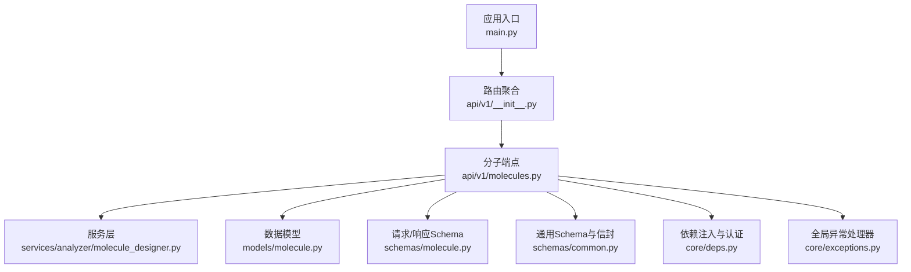
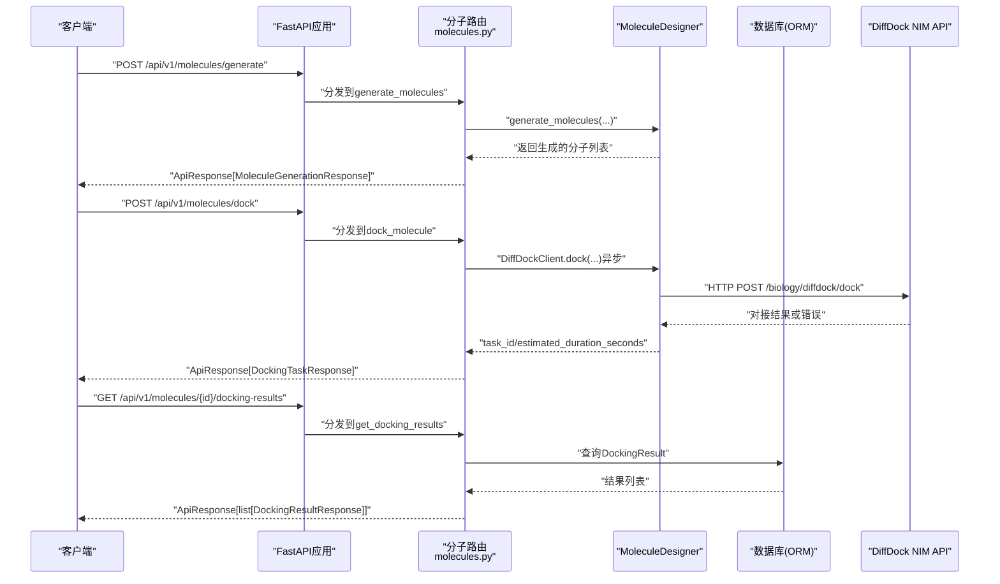
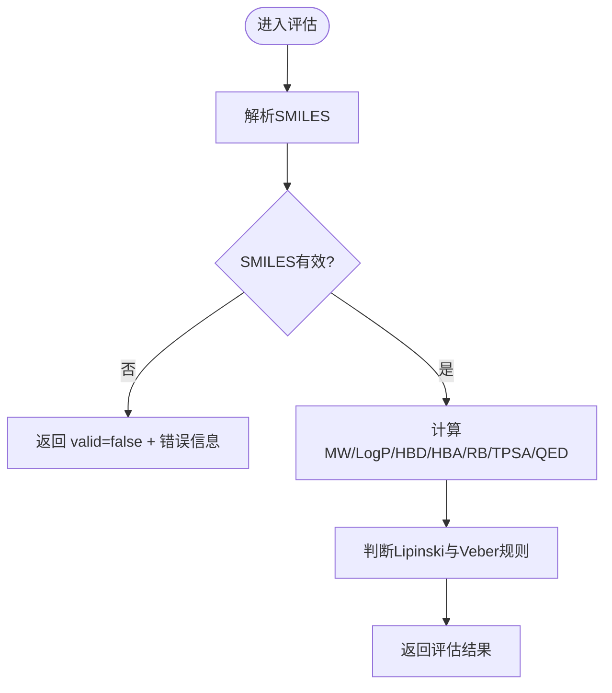
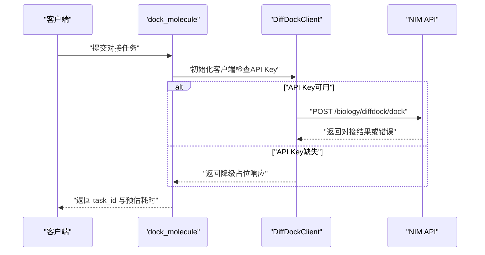
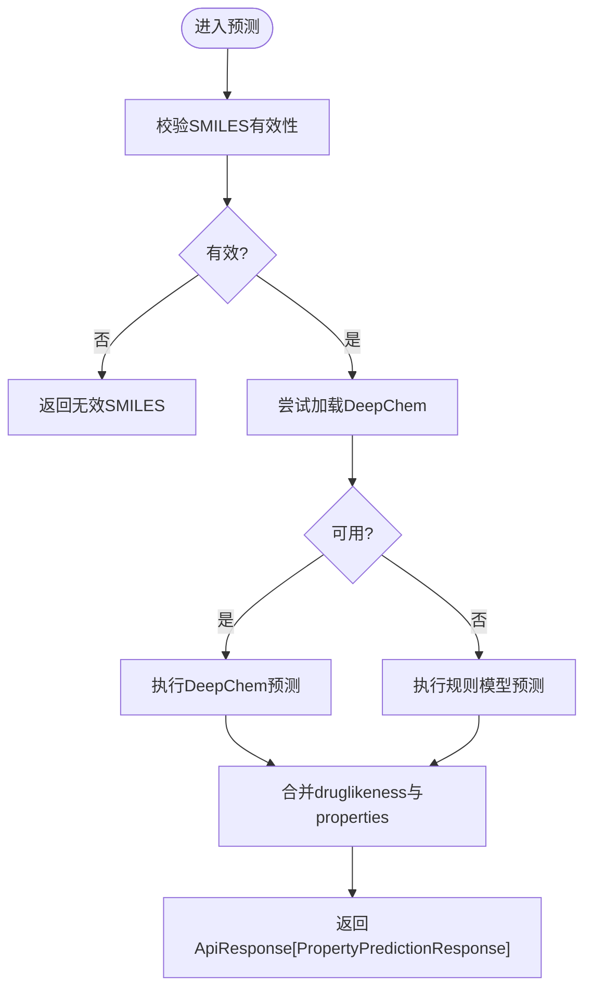
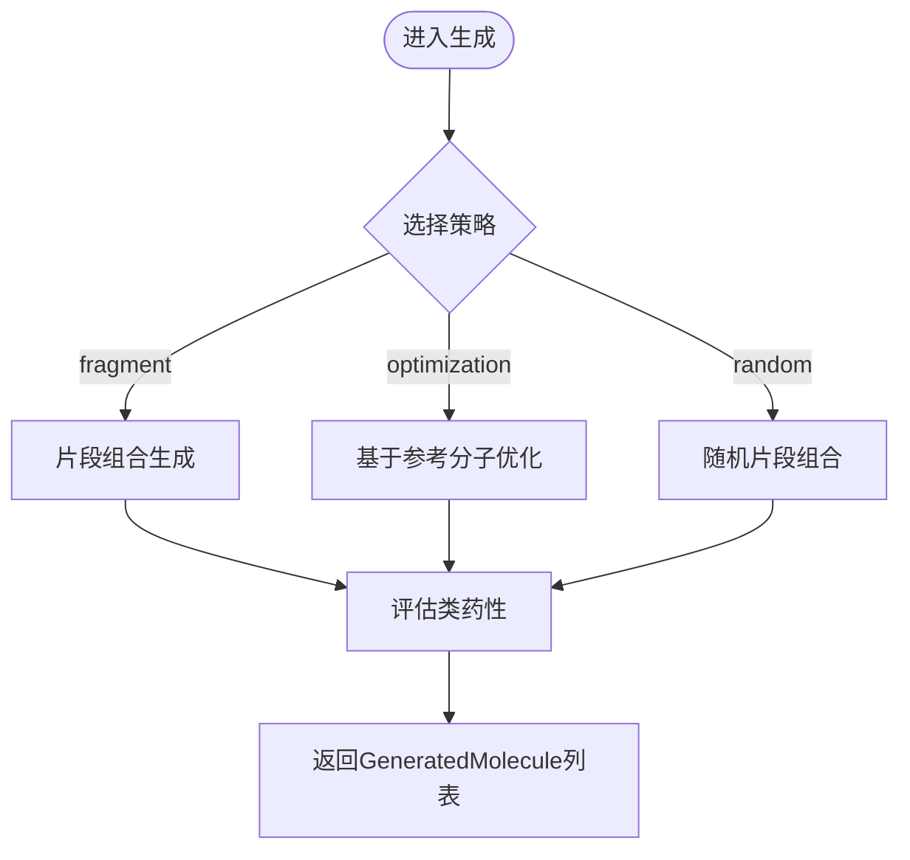
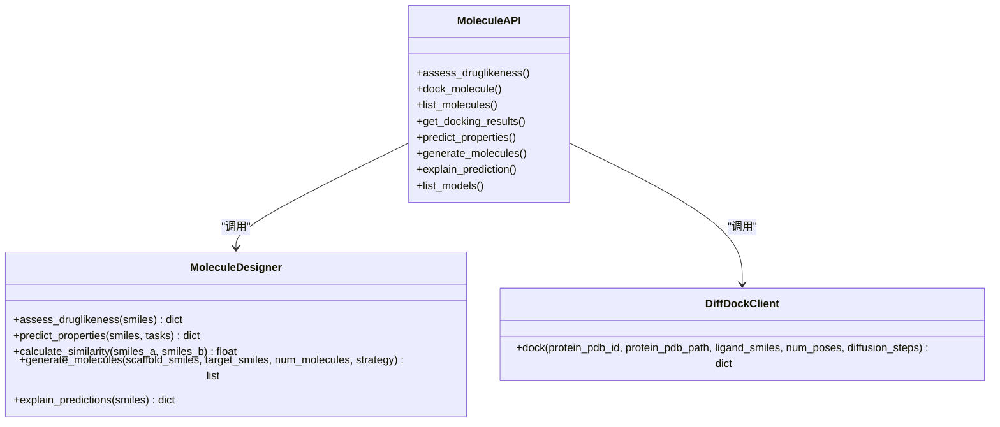

# 分子设计与评估API

<cite>
**本文引用的文件**
- [backend/app/main.py](file://precision-drug-design/backend/app/main.py)
- [backend/app/api/v1/__init__.py](file://precision-drug-design/backend/app/api/v1/__init__.py)
- [backend/app/api/v1/molecules.py](file://precision-drug-design/backend/app/api/v1/molecules.py)
- [backend/app/services/analyzer/molecule_designer.py](file://precision-drug-design/backend/app/services/analyzer/molecule_designer.py)
- [backend/app/schemas/molecule.py](file://precision-drug-design/backend/app/schemas/molecule.py)
- [backend/app/models/molecule.py](file://precision-drug-design/backend/app/models/molecule.py)
- [backend/app/core/deps.py](file://precision-drug-design/backend/app/core/deps.py)
- [backend/app/core/exceptions.py](file://precision-drug-design/backend/app/core/exceptions.py)
- [backend/app/schemas/common.py](file://precision-drug-design/backend/app/schemas/common.py)
</cite>

## 目录
1. [简介](#简介)
2. [项目结构](#项目结构)
3. [核心组件](#核心组件)
4. [架构总览](#架构总览)
5. [详细组件分析](#详细组件分析)
6. [依赖关系分析](#依赖关系分析)
7. [性能与资源管理](#性能与资源管理)
8. [故障诊断与排错指南](#故障诊断与排错指南)
9. [结论](#结论)
10. [附录：接口清单与使用示例](#附录接口清单与使用示例)

## 简介
本文件为“分子设计与评估”子系统的API文档，覆盖以下能力：
- 分子结构生成（片段组装、相似性优化、随机生成）
- ADMET性质预测（DeepChem优先，规则模型降级）
- 分子对接模拟（DiffDock NIM API异步任务）
- 类药性评估（Lipinski/Veber/QED）
- 可解释性分析（SHAP风格特征贡献）
- 分子库查询与分页
- 批量处理与迭代优化流程建议
- RDKit集成、深度学习模型调用、计算资源管理与错误诊断

所有响应采用统一信封格式，便于前端或客户端统一解析。

## 项目结构
后端基于FastAPI构建，路由按功能模块划分；分子相关能力集中在v1的molecules路由与服务层MoleculeDesigner中。

图表来源
- [backend/app/main.py:187-248](file://precision-drug-design/backend/app/main.py#L187-L248)
- [backend/app/api/v1/__init__.py:24-41](file://precision-drug-design/backend/app/api/v1/__init__.py#L24-L41)
- [backend/app/api/v1/molecules.py:1-403](file://precision-drug-design/backend/app/api/v1/molecules.py#L1-L403)
- [backend/app/services/analyzer/molecule_designer.py:1-689](file://precision-drug-design/backend/app/services/analyzer/molecule_designer.py#L1-L689)
- [backend/app/models/molecule.py:1-61](file://precision-drug-design/backend/app/models/molecule.py#L1-L61)
- [backend/app/schemas/molecule.py:1-178](file://precision-drug-design/backend/app/schemas/molecule.py#L1-L178)
- [backend/app/schemas/common.py:1-158](file://precision-drug-design/backend/app/schemas/common.py#L1-L158)
- [backend/app/core/deps.py:1-129](file://precision-drug-design/backend/app/core/deps.py#L1-L129)
- [backend/app/core/exceptions.py:1-179](file://precision-drug-design/backend/app/core/exceptions.py#L1-L179)

章节来源
- [backend/app/main.py:187-248](file://precision-drug-design/backend/app/main.py#L187-L248)
- [backend/app/api/v1/__init__.py:24-41](file://precision-drug-design/backend/app/api/v1/__init__.py#L24-L41)

## 核心组件
- 应用入口与中间件：创建FastAPI实例，注册CORS、统一信封中间件、异常处理器，挂载v1路由。
- 分子API路由：提供类药性评估、对接任务提交、列表查询、结果获取、性质预测、分子生成、可解释性分析与模型注册表查询。
- 服务层MoleculeDesigner：封装RDKit与DeepChem，实现类药性评估、ADMET预测、相似度计算、分子生成与可解释性分析。
- DiffDockClient：对接NVIDIA NIM进行分子对接，支持PDB下载与降级占位响应。
- 数据模型与Schema：定义数据库持久化结构与API请求/响应契约。
- 依赖注入与异常处理：用户鉴权、分页参数、请求ID注入与统一错误信封。

章节来源
- [backend/app/api/v1/molecules.py:1-403](file://precision-drug-design/backend/app/api/v1/molecules.py#L1-L403)
- [backend/app/services/analyzer/molecule_designer.py:1-689](file://precision-drug-design/backend/app/services/analyzer/molecule_designer.py#L1-L689)
- [backend/app/models/molecule.py:1-61](file://precision-drug-design/backend/app/models/molecule.py#L1-L61)
- [backend/app/schemas/molecule.py:1-178](file://precision-drug-design/backend/app/schemas/molecule.py#L1-L178)
- [backend/app/schemas/common.py:1-158](file://precision-drug-design/backend/app/schemas/common.py#L1-L158)
- [backend/app/core/deps.py:1-129](file://precision-drug-design/backend/app/core/deps.py#L1-L129)
- [backend/app/core/exceptions.py:1-179](file://precision-drug-design/backend/app/core/exceptions.py#L1-L179)

## 架构总览
下图展示从HTTP请求到服务层与外部依赖的完整调用链。

图表来源
- [backend/app/api/v1/molecules.py:109-143](file://precision-drug-design/backend/app/api/v1/molecules.py#L109-L143)
- [backend/app/api/v1/molecules.py:194-216](file://precision-drug-design/backend/app/api/v1/molecules.py#L194-L216)
- [backend/app/api/v1/molecules.py:301-354](file://precision-drug-design/backend/app/api/v1/molecules.py#L301-L354)
- [backend/app/services/analyzer/molecule_designer.py:522-660](file://precision-drug-design/backend/app/services/analyzer/molecule_designer.py#L522-L660)

## 详细组件分析

### 类药性评估接口
- 路径与方法：POST /api/v1/molecules/assess-druglikeness
- 输入：SMILES字符串
- 输出：是否有效、分子量、LogP、氢键供体/受体数、可旋转键数、TPSA、Lipinski通过情况、违规项
- 算法：RDKit计算描述符并判断Lipinski五规则与Veber规则，同时计算QED分数
- 错误处理：若RDKit不可用，抛出验证错误；无效SMILES返回valid=False

图表来源
- [backend/app/api/v1/molecules.py:47-106](file://precision-drug-design/backend/app/api/v1/molecules.py#L47-L106)
- [backend/app/services/analyzer/molecule_designer.py:71-134](file://precision-drug-design/backend/app/services/analyzer/molecule_designer.py#L71-L134)

章节来源
- [backend/app/api/v1/molecules.py:95-106](file://precision-drug-design/backend/app/api/v1/molecules.py#L95-L106)
- [backend/app/services/analyzer/molecule_designer.py:71-134](file://precision-drug-design/backend/app/services/analyzer/molecule_designer.py#L71-L134)
- [backend/app/schemas/molecule.py:36-54](file://precision-drug-design/backend/app/schemas/molecule.py#L36-L54)

### 分子对接模拟接口
- 路径与方法：POST /api/v1/molecules/dock
- 输入：蛋白PDB ID或本地PDB路径、配体SMILES、构象数量、扩散步数
- 行为：提交异步对接任务，返回task_id与预估耗时；实际结果通过GET /api/v1/molecules/{id}/docking-results查询
- 外部依赖：DiffDock NIM API（NVIDIA），未配置API Key时返回降级占位响应
- 错误处理：缺少必要参数时抛出验证错误；网络或服务异常时记录警告并返回降级响应

图表来源
- [backend/app/api/v1/molecules.py:109-143](file://precision-drug-design/backend/app/api/v1/molecules.py#L109-L143)
- [backend/app/services/analyzer/molecule_designer.py:522-660](file://precision-drug-design/backend/app/services/analyzer/molecule_designer.py#L522-L660)

章节来源
- [backend/app/api/v1/molecules.py:109-143](file://precision-drug-design/backend/app/api/v1/molecules.py#L109-L143)
- [backend/app/schemas/molecule.py:56-93](file://precision-drug-design/backend/app/schemas/molecule.py#L56-L93)
- [backend/app/services/analyzer/molecule_designer.py:522-660](file://precision-drug-design/backend/app/services/analyzer/molecule_designer.py#L522-L660)

### 分子性质预测接口（ADMET）
- 路径与方法：POST /api/v1/molecules/predict-properties
- 输入：SMILES、可选任务列表（toxicity/solubility/bioavailability/bbb_permeability/herg_toxicity）
- 行为：优先使用DeepChem模型（Tox21/Delaney等），不可用时降级为规则模型；返回properties与druglikeness字段
- 错误处理：RDKit不可用或DeepChem异常时返回降级响应，meta中包含degraded与reason

图表来源
- [backend/app/api/v1/molecules.py:219-298](file://precision-drug-design/backend/app/api/v1/molecules.py#L219-L298)
- [backend/app/services/analyzer/molecule_designer.py:136-256](file://precision-drug-design/backend/app/services/analyzer/molecule_designer.py#L136-L256)

章节来源
- [backend/app/api/v1/molecules.py:219-298](file://precision-drug-design/backend/app/api/v1/molecules.py#L219-L298)
- [backend/app/services/analyzer/molecule_designer.py:136-256](file://precision-drug-design/backend/app/services/analyzer/molecule_designer.py#L136-L256)
- [backend/app/schemas/molecule.py:95-112](file://precision-drug-design/backend/app/schemas/molecule.py#L95-L112)

### 分子生成接口
- 路径与方法：POST /api/v1/molecules/generate
- 输入：骨架SMILES（可选）、参考分子SMILES（可选）、生成数量、策略（fragment/random/optimization）
- 行为：根据策略生成候选分子，附带类药性评估与相似度信息；当前为简化版实现
- 错误处理：服务不可用时抛出验证错误

图表来源
- [backend/app/api/v1/molecules.py:301-354](file://precision-drug-design/backend/app/api/v1/molecules.py#L301-L354)
- [backend/app/services/analyzer/molecule_designer.py:360-519](file://precision-drug-design/backend/app/services/analyzer/molecule_designer.py#L360-L519)

章节来源
- [backend/app/api/v1/molecules.py:301-354](file://precision-drug-design/backend/app/api/v1/molecules.py#L301-L354)
- [backend/app/services/analyzer/molecule_designer.py:360-519](file://precision-drug-design/backend/app/services/analyzer/molecule_designer.py#L360-L519)
- [backend/app/schemas/molecule.py:114-148](file://precision-drug-design/backend/app/schemas/molecule.py#L114-L148)

### 可解释性分析接口
- 路径与方法：POST /api/v1/molecules/explain
- 输入：SMILES、目标性质（默认druglikeness）
- 行为：基于规则特征的线性贡献估算，返回base_value、contributions、explainer与summary
- 错误处理：服务不可用时抛出验证错误

章节来源
- [backend/app/api/v1/molecules.py:357-390](file://precision-drug-design/backend/app/api/v1/molecules.py#L357-L390)
- [backend/app/services/analyzer/molecule_designer.py:295-331](file://precision-drug-design/backend/app/services/analyzer/molecule_designer.py#L295-L331)
- [backend/app/schemas/molecule.py:150-168](file://precision-drug-design/backend/app/schemas/molecule.py#L150-L168)

### 分子库查询接口
- 路径与方法：GET /api/v1/molecules
- 过滤：project_id、target_id、is_approved
- 分页：page、page_size（最大100）
- 返回：分页元数据与分子列表

章节来源
- [backend/app/api/v1/molecules.py:146-191](file://precision-drug-design/backend/app/api/v1/molecules.py#L146-L191)
- [backend/app/models/molecule.py:14-44](file://precision-drug-design/backend/app/models/molecule.py#L14-L44)
- [backend/app/schemas/molecule.py:22-34](file://precision-drug-design/backend/app/schemas/molecule.py#L22-L34)
- [backend/app/schemas/common.py:35-81](file://precision-drug-design/backend/app/schemas/common.py#L35-L81)

### 对接结果查询接口
- 路径与方法：GET /api/v1/molecules/{molecule_id}/docking-results
- 返回：该分子的对接结果列表（poses、top_confidence、docked_by等）

章节来源
- [backend/app/api/v1/molecules.py:194-216](file://precision-drug-design/backend/app/api/v1/molecules.py#L194-L216)
- [backend/app/models/molecule.py:46-61](file://precision-drug-design/backend/app/models/molecule.py#L46-L61)
- [backend/app/schemas/molecule.py:77-93](file://precision-drug-design/backend/app/schemas/molecule.py#L77-L93)

### 模型注册表查询接口
- 路径与方法：GET /api/v1/molecules/models
- 返回：可用的DeepChem模型列表（名称、类型、任务数、featurizer、是否已加载）

章节来源
- [backend/app/api/v1/molecules.py:393-402](file://precision-drug-design/backend/app/api/v1/molecules.py#L393-L402)
- [backend/app/services/analyzer/molecule_designer.py:663-689](file://precision-drug-design/backend/app/services/analyzer/molecule_designer.py#L663-L689)

## 依赖关系分析
- 外部依赖
  - RDKit：用于分子描述符计算、指纹生成、QED评分等
  - DeepChem：用于毒性、溶解度等性质预测（不可用时降级）
  - NVIDIA NIM API：DiffDock分子对接服务
- 内部依赖
  - FastAPI路由与服务层解耦，服务层封装化学计算与AI推理逻辑
  - 统一响应信封与异常处理贯穿全链路

图表来源
- [backend/app/services/analyzer/molecule_designer.py:20-519](file://precision-drug-design/backend/app/services/analyzer/molecule_designer.py#L20-L519)
- [backend/app/services/analyzer/molecule_designer.py:522-660](file://precision-drug-design/backend/app/services/analyzer/molecule_designer.py#L522-L660)
- [backend/app/api/v1/molecules.py:1-403](file://precision-drug-design/backend/app/api/v1/molecules.py#L1-L403)

章节来源
- [backend/app/services/analyzer/molecule_designer.py:1-689](file://precision-drug-design/backend/app/services/analyzer/molecule_designer.py#L1-L689)
- [backend/app/api/v1/molecules.py:1-403](file://precision-drug-design/backend/app/api/v1/molecules.py#L1-L403)

## 性能与资源管理
- 惰性加载与降级
  - RDKit与DeepChem均延迟加载，避免启动失败；DeepChem不可用时自动降级为规则模型
- 缓存策略
  - 用户对象短TTL内存缓存，减少数据库查询压力
- 异步与超时
  - DiffDock NIM调用使用异步HTTP客户端，设置合理超时；对接任务异步返回task_id，避免阻塞
- 批处理建议
  - 对大量SMILES的性质预测与类药性评估，建议在客户端侧分批并发调用，服务端保持幂等与限流
- 资源监控
  - 统一信封中间件注入X-Request-ID与X-Response-Time-ms，便于追踪与性能分析

章节来源
- [backend/app/services/analyzer/molecule_designer.py:27-69](file://precision-drug-design/backend/app/services/analyzer/molecule_designer.py#L27-L69)
- [backend/app/core/deps.py:26-52](file://precision-drug-design/backend/app/core/deps.py#L26-L52)
- [backend/app/main.py:29-184](file://precision-drug-design/backend/app/main.py#L29-L184)

## 故障诊断与排错指南
- 常见错误码与含义
  - VALIDATION_ERROR：请求参数校验失败（如缺少protein_pdb_id/protein_pdb_path）
  - UNAUTHORIZED/FORBIDDEN：鉴权失败或权限不足
  - UPSTREAM_ERROR：上游服务（如NIM API）调用失败
  - INTERNAL_ERROR：未捕获异常兜底
- 定位方法
  - 查看响应meta中的request_id，结合服务端日志快速定位
  - 关注degraded标志与reason字段，确认是否因依赖不可用导致降级
- 典型问题
  - RDKit未安装：类药性与性质预测将返回降级响应，需安装rdkit以启用完整功能
  - DeepChem未安装或模型加载失败：性质预测回退至规则模型
  - DiffDock NIM API不可用：返回降级占位响应，需配置NVIDIA_API_KEY与DIFFDOCK_NIM_URL

章节来源
- [backend/app/core/exceptions.py:19-179](file://precision-drug-design/backend/app/core/exceptions.py#L19-L179)
- [backend/app/api/v1/molecules.py:268-298](file://precision-drug-design/backend/app/api/v1/molecules.py#L268-L298)
- [backend/app/services/analyzer/molecule_designer.py:563-660](file://precision-drug-design/backend/app/services/analyzer/molecule_designer.py#L563-L660)

## 结论
本系统围绕分子设计、评估与对接构建了清晰的API分层与健壮的服务层实现。通过RDKit与DeepChem的灵活集成以及NIM API的对接，实现了从基础类药性到高级ADMET预测与分子对接的全链路能力。统一的响应信封、完善的异常处理与性能监控为生产环境提供了良好支撑。后续可在生成式模型、真实预训练模型加载与大规模批处理方面进一步增强。

## 附录：接口清单与使用示例

### 接口清单
- 类药性评估
  - POST /api/v1/molecules/assess-druglikeness
- 分子对接任务
  - POST /api/v1/molecules/dock
  - GET /api/v1/molecules/{molecule_id}/docking-results
- 性质预测（ADMET）
  - POST /api/v1/molecules/predict-properties
- 分子生成
  - POST /api/v1/molecules/generate
- 可解释性分析
  - POST /api/v1/molecules/explain
- 模型注册表
  - GET /api/v1/molecules/models
- 分子库查询
  - GET /api/v1/molecules

### 使用示例（概念性说明）
- 类药性评估
  - 请求体包含smiles字段；响应包含valid、molecular_weight、logp、hbd、hba、rotatable_bonds、tpsa、lipinski_pass、violations
- 分子对接
  - 提交任务后，使用返回的task_id与预估耗时进行轮询；最终通过GET /molecules/{id}/docking-results获取poses与top_confidence
- 性质预测
  - 指定tasks列表；响应包含properties字典与model_used字段，指示实际使用的模型或降级策略
- 分子生成
  - 选择strategy为fragment/optimization/random；返回GeneratedMolecule列表，含druglikeness与similarity_to_target
- 可解释性分析
  - 返回base_value与contributions字典，标识各特征对目标性质的影响方向与强度

章节来源
- [backend/app/api/v1/molecules.py:1-403](file://precision-drug-design/backend/app/api/v1/molecules.py#L1-L403)
- [backend/app/schemas/molecule.py:1-178](file://precision-drug-design/backend/app/schemas/molecule.py#L1-L178)
- [backend/app/schemas/common.py:63-89](file://precision-drug-design/backend/app/schemas/common.py#L63-L89)