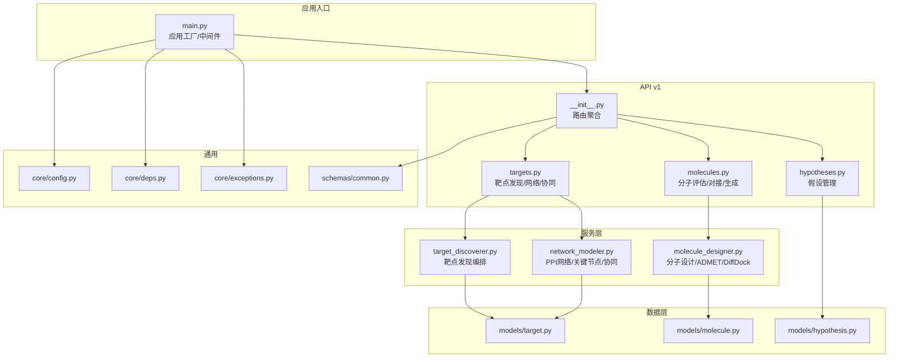
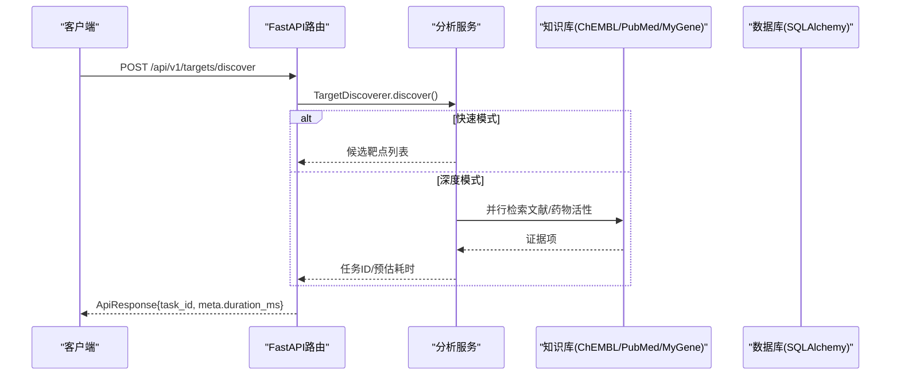
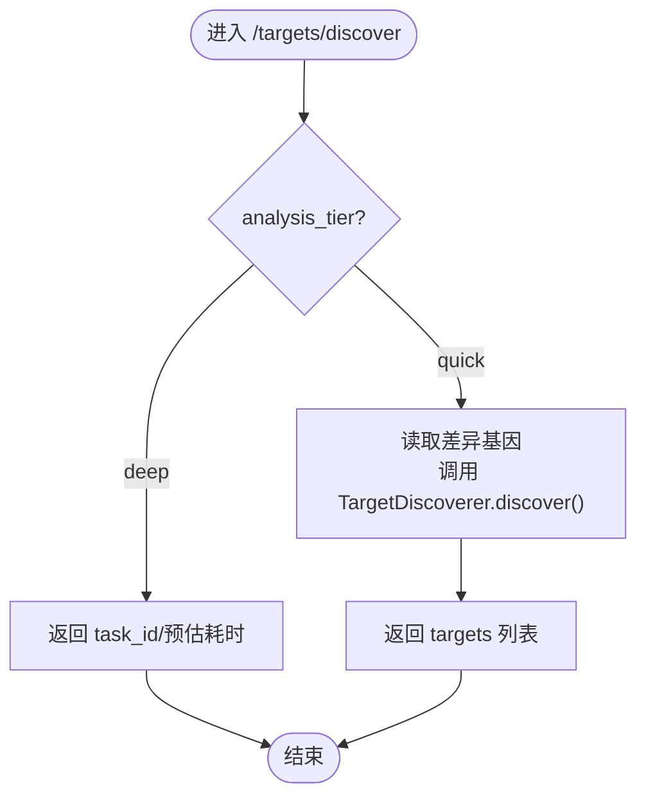
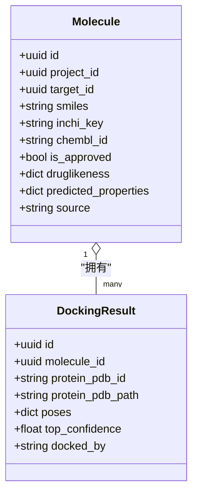
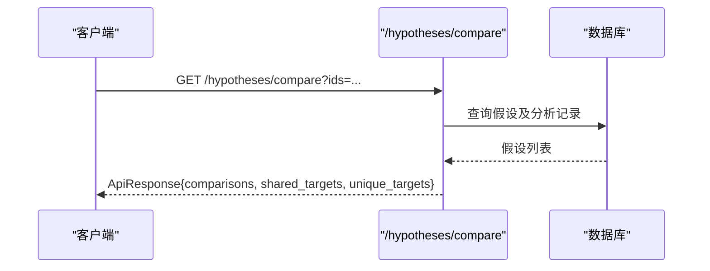
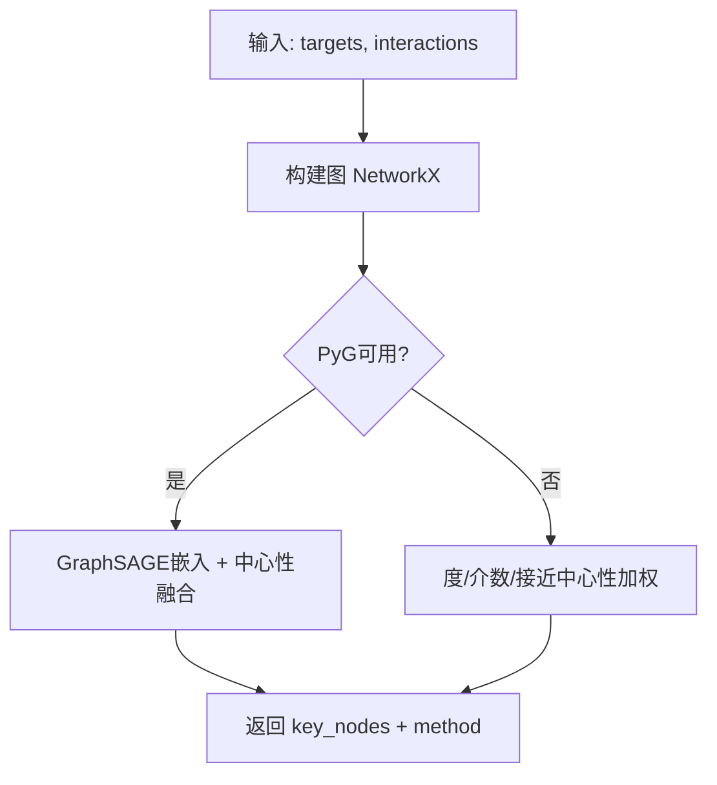
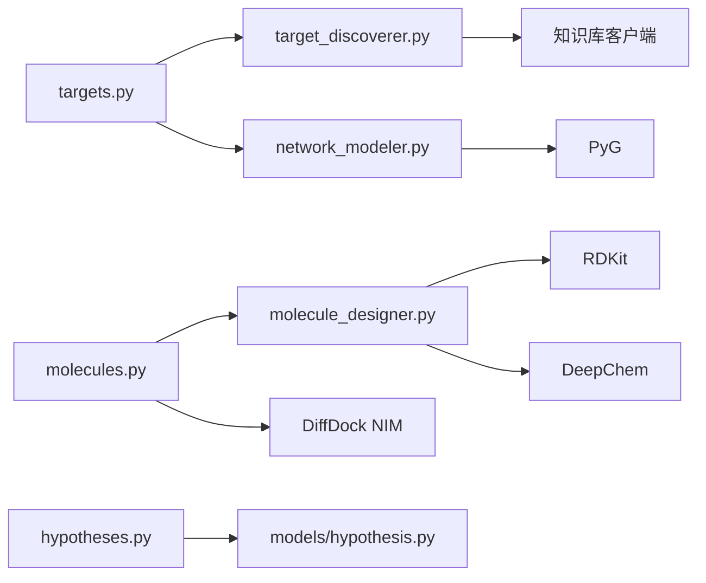

# 分析引擎API

<cite>
**本文引用的文件**
- [backend/app/main.py](file://backend/app/main.py)
- [backend/app/api/v1/__init__.py](file://backend/app/api/v1/__init__.py)
- [backend/app/api/v1/targets.py](file://backend/app/api/v1/targets.py)
- [backend/app/api/v1/molecules.py](file://backend/app/api/v1/molecules.py)
- [backend/app/api/v1/hypotheses.py](file://backend/app/api/v1/hypotheses.py)
- [backend/app/services/analyzer/target_discoverer.py](file://backend/app/services/analyzer/target_discoverer.py)
- [backend/app/services/analyzer/molecule_designer.py](file://backend/app/services/analyzer/molecule_designer.py)
- [backend/app/services/analyzer/network_modeler.py](file://backend/app/services/analyzer/network_modeler.py)
- [backend/app/schemas/common.py](file://backend/app/schemas/common.py)
- [backend/app/models/target.py](file://backend/app/models/target.py)
- [backend/app/models/molecule.py](file://backend/app/models/molecule.py)
- [backend/app/models/hypothesis.py](file://backend/app/models/hypothesis.py)
- [backend/app/core/config.py](file://backend/app/core/config.py)
- [backend/app/core/deps.py](file://backend/app/core/deps.py)
- [backend/app/core/exceptions.py](file://backend/app/core/exceptions.py)
</cite>

## 目录
1. [简介](#简介)
2. [项目结构](#项目结构)
3. [核心组件](#核心组件)
4. [架构总览](#架构总览)
5. [详细组件分析](#详细组件分析)
6. [依赖关系分析](#依赖关系分析)
7. [性能与可扩展性](#性能与可扩展性)
8. [故障诊断与排错](#故障诊断与排错)
9. [结论](#结论)
10. [附录：接口清单与参数说明](#附录接口清单与参数说明)

## 简介
本文件为AI分析引擎的API文档，聚焦以下能力：
- 靶点发现：差异表达分析、知识库检索（MyGene/ChEMBL/PubMed/MyVariant）、候选排序
- 分子设计与评估：类药性评估、ADMET预测、分子对接（DiffDock NIM API）
- 假设管理：创建、运行分析、对比、合并、淘汰
- 异步任务处理：快速/深度模式、任务ID返回、结果查询
- 进度与缓存：响应信封注入耗时、统一错误封装、降级策略
- 工作流编排：网络建模、协同效应预测、治疗方案优化
- 可视化与批量：分页列表、对比视图、模型注册表
- 性能调优、错误诊断、日志追踪指导

## 项目结构
后端采用FastAPI分层架构：路由层（v1 API）→ 服务层（分析器/网络建模/分子设计）→ 数据层（SQLAlchemy模型）。全局中间件负责请求追踪、CORS、统一信封响应。配置通过环境变量集中管理。

图表来源
- [backend/app/main.py:187-248](file://backend/app/main.py#L187-L248)
- [backend/app/api/v1/__init__.py:24-38](file://backend/app/api/v1/__init__.py#L24-L38)
- [backend/app/api/v1/targets.py:39-344](file://backend/app/api/v1/targets.py#L39-L344)
- [backend/app/api/v1/molecules.py:44-403](file://backend/app/api/v1/molecules.py#L44-L403)
- [backend/app/api/v1/hypotheses.py:36-273](file://backend/app/api/v1/hypotheses.py#L36-L273)
- [backend/app/services/analyzer/target_discoverer.py:26-176](file://backend/app/services/analyzer/target_discoverer.py#L26-L176)
- [backend/app/services/analyzer/molecule_designer.py:20-689](file://backend/app/services/analyzer/molecule_designer.py#L20-L689)
- [backend/app/services/analyzer/network_modeler.py:14-370](file://backend/app/services/analyzer/network_modeler.py#L14-L370)
- [backend/app/models/target.py:14-52](file://backend/app/models/target.py#L14-L52)
- [backend/app/models/molecule.py:14-61](file://backend/app/models/molecule.py#L14-L61)
- [backend/app/models/hypothesis.py:15-66](file://backend/app/models/hypothesis.py#L15-L66)
- [backend/app/core/config.py:21-144](file://backend/app/core/config.py#L21-L144)
- [backend/app/core/deps.py:67-129](file://backend/app/core/deps.py#L67-L129)
- [backend/app/core/exceptions.py:131-179](file://backend/app/core/exceptions.py#L131-L179)
- [backend/app/schemas/common.py:63-158](file://backend/app/schemas/common.py#L63-L158)

章节来源
- [backend/app/main.py:187-248](file://backend/app/main.py#L187-L248)
- [backend/app/api/v1/__init__.py:24-38](file://backend/app/api/v1/__init__.py#L24-L38)

## 核心组件
- 应用工厂与中间件
  - 统一信封响应中间件：注入X-Request-ID、X-Response-Time-ms，对JSON成功响应meta注入duration_ms
  - CORS、异常处理器、路由挂载
- 路由聚合
  - 将健康、认证、项目、数据集、靶点、分子、报告、假设、聊天、联邦、隐私、反馈、疗效等子模块路由聚合到/api/v1
- 通用响应与分页
  - ApiResponse/PagedResponse/TaskStatus等统一结构，便于前端解析与状态跟踪
- 依赖注入
  - get_db/get_current_user/get_request_id/pagination等依赖，保证鉴权、数据库会话、追踪ID一致性

章节来源
- [backend/app/main.py:29-185](file://backend/app/main.py#L29-L185)
- [backend/app/api/v1/__init__.py:24-38](file://backend/app/api/v1/__init__.py#L24-L38)
- [backend/app/schemas/common.py:63-158](file://backend/app/schemas/common.py#L63-L158)
- [backend/app/core/deps.py:67-129](file://backend/app/core/deps.py#L67-L129)

## 架构总览
系统以“路由→服务→外部知识库/模型”为主线，支持同步快速分析与异步深度分析，并提供统一的错误与追踪机制。

图表来源
- [backend/app/api/v1/targets.py:42-131](file://backend/app/api/v1/targets.py#L42-L131)
- [backend/app/services/analyzer/target_discoverer.py:52-139](file://backend/app/services/analyzer/target_discoverer.py#L52-L139)
- [backend/app/schemas/common.py:63-117](file://backend/app/schemas/common.py#L63-L117)

## 详细组件分析

### 靶点发现API
- 端点
  - POST /api/v1/targets/discover：触发靶点发现（quick同步返回；deep异步返回task_id）
  - GET /api/v1/targets：分页列出靶点（支持project/evidence/gene过滤）
  - GET /api/v1/targets/{id}：详情（含证据项+相关分子）
  - POST /api/v1/targets/{id}/force-deep-analysis：创始人强制深度分析（仅founder）
  - POST /api/v1/targets/network：构建PPI网络+关键节点识别
  - POST /api/v1/targets/synergy：多靶点组合协同效应预测
- 关键流程
  - discover：根据analysis_tier选择快速或深度路径；快速从数据集或focus_genes提取差异基因并调用TargetDiscoverer；深度返回异步任务信息
  - network：NetworkModeler.build_ppi_network + identify_key_nodes + find_modules
  - synergy：基于网络重叠度与跨组合连接数评分
- 数据结构
  - 目标实体Target包含evidence_level、confidence_score、metadata_等字段
  - 响应使用ApiResponse/PagedResponse统一信封

图表来源
- [backend/app/api/v1/targets.py:42-131](file://backend/app/api/v1/targets.py#L42-L131)
- [backend/app/services/analyzer/target_discoverer.py:52-139](file://backend/app/services/analyzer/target_discoverer.py#L52-L139)

章节来源
- [backend/app/api/v1/targets.py:42-344](file://backend/app/api/v1/targets.py#L42-L344)
- [backend/app/services/analyzer/target_discoverer.py:26-176](file://backend/app/services/analyzer/target_discoverer.py#L26-L176)
- [backend/app/models/target.py:14-52](file://backend/app/models/target.py#L14-L52)

### 分子设计与评估API
- 端点
  - POST /api/v1/molecules/assess-druglikeness：类药性评估（RDKit Lipinski/Veber/QED）
  - POST /api/v1/molecules/dock：提交DiffDock对接任务（异步），GET /molecules/{id}/docking-results查询结果
  - GET /api/v1/molecules：分页列出分子
  - POST /api/v1/molecules/predict-properties：DeepChem性质预测（不可用时规则降级）
  - POST /api/v1/molecules/generate：生成式分子设计（fragment/optimization/random）
  - POST /api/v1/molecules/explain：SHAP风格可解释性
  - GET /api/v1/molecules/models：可用模型注册表
- 关键流程
  - assess_druglikeness：解析SMILES，计算MW/LogP/HBD/HBA/RB/TPSA，判定Lipinski/Veber/QED
  - dock：校验蛋白来源，尝试初始化DiffDockClient，返回task_id与预估时长
  - predict_properties：优先DeepChem（Tox21/Delaney/BBBP），失败回退规则模型
  - generate：片段组装/相似优化/随机生成，输出druglikeness与相似度
- 数据结构
  - Molecule包含smiles/inchi_key/chembl_id/is_approved/druglikeness/predicted_properties/source
  - DockingResult记录poses/top_confidence/docked_by

图表来源
- [backend/app/models/molecule.py:14-61](file://backend/app/models/molecule.py#L14-L61)

章节来源
- [backend/app/api/v1/molecules.py:95-403](file://backend/app/api/v1/molecules.py#L95-L403)
- [backend/app/services/analyzer/molecule_designer.py:20-689](file://backend/app/services/analyzer/molecule_designer.py#L20-L689)
- [backend/app/models/molecule.py:14-61](file://backend/app/models/molecule.py#L14-L61)

### 假设管理API
- 端点
  - POST /api/v1/hypotheses：创建假设
  - GET /api/v1/hypotheses：分页列出（支持project/status过滤）
  - GET /api/v1/hypotheses/{id}：详情
  - POST /api/v1/hypotheses/{id}/run-analysis：在假设下运行分析（返回task_id）
  - GET /api/v1/hypotheses/compare：对比多个假设（共享/独有靶点）
  - POST /api/v1/hypotheses/{id}/merge：合并假设（去重并入）
  - POST /api/v1/hypotheses/{id}/eliminate：淘汰假设（保留历史）
- 关键流程
  - compare：加载Hypothesis及其analyses，构造对比行，计算共享/独有靶点集合
  - merge：合并target_ids去重，标记源假设为merged
  - run-analysis：返回queued状态与task_id，供后续轮询

图表来源
- [backend/app/api/v1/hypotheses.py:103-164](file://backend/app/api/v1/hypotheses.py#L103-L164)
- [backend/app/models/hypothesis.py:15-66](file://backend/app/models/hypothesis.py#L15-L66)

章节来源
- [backend/app/api/v1/hypotheses.py:39-273](file://backend/app/api/v1/hypotheses.py#L39-L273)
- [backend/app/models/hypothesis.py:15-66](file://backend/app/models/hypothesis.py#L15-L66)

### 网络建模与协同效应
- 功能
  - 构建PPI网络（NetworkX），识别hub节点、连通分量、密度
  - 社区检测（模块划分）
  - 关键节点识别（GraphSAGE优先，不可用则中心性启发式）
  - 协同效应预测（Jaccard重叠、跨组合边计数、规模因子）
- 集成点
  - targets/network与targets/synergy路由直接调用NetworkModeler

图表来源
- [backend/app/services/analyzer/network_modeler.py:139-269](file://backend/app/services/analyzer/network_modeler.py#L139-L269)
- [backend/app/api/v1/targets.py:274-344](file://backend/app/api/v1/targets.py#L274-L344)

章节来源
- [backend/app/services/analyzer/network_modeler.py:14-370](file://backend/app/services/analyzer/network_modeler.py#L14-L370)
- [backend/app/api/v1/targets.py:274-344](file://backend/app/api/v1/targets.py#L274-L344)

## 依赖关系分析
- 外部依赖
  - RDKit：类药性与指纹计算（可选，缺失时部分功能降级）
  - DeepChem：ADMET预测（可选，缺失时规则模型降级）
  - PyTorch Geometric：GraphSAGE（可选，缺失时中心性启发式降级）
  - NVIDIA NIM DiffDock：分子对接（可选，缺失时返回占位响应）
  - MyGene/ChEMBL/PubMed/MyVariant：知识库检索（可选，快速模式不依赖）
- 内部依赖
  - 路由依赖get_db/get_current_user/get_request_id/pagination
  - 响应统一封装ApiResponse/PagedResponse/TaskStatus
  - 异常体系AppException族与全局处理器

图表来源
- [backend/app/api/v1/targets.py:39-344](file://backend/app/api/v1/targets.py#L39-L344)
- [backend/app/api/v1/molecules.py:44-403](file://backend/app/api/v1/molecules.py#L44-L403)
- [backend/app/api/v1/hypotheses.py:36-273](file://backend/app/api/v1/hypotheses.py#L36-L273)
- [backend/app/services/analyzer/target_discoverer.py:26-176](file://backend/app/services/analyzer/target_discoverer.py#L26-L176)
- [backend/app/services/analyzer/molecule_designer.py:20-689](file://backend/app/services/analyzer/molecule_designer.py#L20-L689)
- [backend/app/services/analyzer/network_modeler.py:14-370](file://backend/app/services/analyzer/network_modeler.py#L14-L370)

章节来源
- [backend/app/core/deps.py:67-129](file://backend/app/core/deps.py#L67-L129)
- [backend/app/schemas/common.py:63-158](file://backend/app/schemas/common.py#L63-L158)
- [backend/app/core/exceptions.py:131-179](file://backend/app/core/exceptions.py#L131-L179)

## 性能与可扩展性
- 中间件优化
  - 统一信封中间件仅在最后一片body重写content-length，避免多次序列化开销
  - 暴露X-Response-Time-ms与X-Request-ID，便于链路追踪
- 异步与并发
  - 深度分析返回task_id，前端轮询；快速分析同步返回，降低延迟
  - 知识库检索使用asyncio.gather并行，提升吞吐
- 降级策略
  - RDKit/DeepChem/PyG/NIM不可用时自动降级，保障可用性
- 配置与环境
  - 所有外部服务URL/密钥通过环境变量集中管理，便于部署与扩缩容

章节来源
- [backend/app/main.py:29-185](file://backend/app/main.py#L29-L185)
- [backend/app/services/analyzer/target_discoverer.py:82-139](file://backend/app/services/analyzer/target_discoverer.py#L82-L139)
- [backend/app/services/analyzer/molecule_designer.py:52-69](file://backend/app/services/analyzer/molecule_designer.py#L52-L69)
- [backend/app/services/analyzer/network_modeler.py:39-64](file://backend/app/services/analyzer/network_modeler.py#L39-L64)
- [backend/app/core/config.py:21-144](file://backend/app/core/config.py#L21-L144)

## 故障诊断与排错
- 统一错误封装
  - AppException族定义错误码与HTTP状态，全局处理器转换为统一信封
  - 参数校验失败返回VALIDATION_ERROR，未捕获异常返回INTERNAL_ERROR
- 常见错误定位
  - 上游服务不可用：UPSTREAM_ERROR（如MyGene/ChEMBL/LLM）
  - 权限不足：UNAUTHORIZED/FORBIDDEN
  - 资源不存在：NOT_FOUND
  - 速率限制：RATE_LIMITED
- 追踪与日志
  - X-Request-ID贯穿请求，EnvelopeMiddleware写入响应头
  - 中间件记录method/path/status/duration，便于性能与问题排查

章节来源
- [backend/app/core/exceptions.py:19-179](file://backend/app/core/exceptions.py#L19-L179)
- [backend/app/main.py:29-185](file://backend/app/main.py#L29-L185)

## 结论
该API体系围绕“靶点发现—分子设计—假设管理”的主线，提供同步快速与异步深度两种模式，具备完善的统一响应、错误封装、追踪与降级策略。通过模块化服务与惰性加载，系统在依赖缺失时仍能保持基本可用，适合持续迭代与生产部署。

## 附录：接口清单与参数说明

### 靶点发现
- POST /api/v1/targets/discover
  - 请求体关键字段：focus_genes、dataset_id、analysis_tier（quick/deep）
  - 响应：ApiResponse[DiscoverResponse]，包含task_id、estimated_cost_usd、estimated_duration_seconds、mode
- GET /api/v1/targets
  - 查询参数：project_id、evidence_level、gene_symbol、page、page_size
  - 响应：PagedResponse[TargetResponse]
- GET /api/v1/targets/{id}
  - 响应：ApiResponse[TargetDetail]（含证据项与相关分子）
- POST /api/v1/targets/{id}/force-deep-analysis
  - 请求体：reason
  - 响应：ApiResponse[dict]（status: deep_analysis_queued）
- POST /api/v1/targets/network
  - 请求体：targets、interactions
  - 响应：ApiResponse[NetworkResponse]（node_count、edge_count、density、hubs、modules、key_nodes）
- POST /api/v1/targets/synergy
  - 请求体：target_list_a、target_list_b、interactions
  - 响应：ApiResponse[SynergyResponse]（synergy_score、jaccard_overlap、cross_edges、mechanism、confidence）

章节来源
- [backend/app/api/v1/targets.py:42-344](file://backend/app/api/v1/targets.py#L42-L344)

### 分子设计与评估
- POST /api/v1/molecules/assess-druglikeness
  - 请求体：smiles
  - 响应：ApiResponse[DruglikenessResponse]
- POST /api/v1/molecules/dock
  - 请求体：protein_pdb_id或protein_pdb_path、ligand_smiles、num_poses、diffusion_steps
  - 响应：ApiResponse[DockingTaskResponse]（task_id、estimated_duration_seconds）
- GET /api/v1/molecules
  - 查询参数：project_id、target_id、is_approved、page、page_size
  - 响应：PagedResponse[MoleculeResponse]
- GET /api/v1/molecules/{molecule_id}/docking-results
  - 响应：ApiResponse[list[DockingResultResponse]]
- POST /api/v1/molecules/predict-properties
  - 请求体：smiles、tasks（toxicity/solubility/bioavailability/bbb_permeability）
  - 响应：ApiResponse[PropertyPredictionResponse]
- POST /api/v1/molecules/generate
  - 请求体：scaffold_smiles、target_smiles、num_molecules、strategy（fragment/optimization/random）
  - 响应：ApiResponse[MoleculeGenerationResponse]
- POST /api/v1/molecules/explain
  - 请求体：smiles
  - 响应：ApiResponse[ExplainResponse]
- GET /api/v1/molecules/models
  - 响应：ApiResponse[list]（模型注册表）

章节来源
- [backend/app/api/v1/molecules.py:95-403](file://backend/app/api/v1/molecules.py#L95-L403)

### 假设管理
- POST /api/v1/hypotheses
  - 请求体：project_id、name、description、target_ids
  - 响应：ApiResponse[HypothesisResponse]
- GET /api/v1/hypotheses
  - 查询参数：project_id、status、page、page_size
  - 响应：PagedResponse[HypothesisResponse]
- GET /api/v1/hypotheses/{id}
  - 响应：ApiResponse[HypothesisResponse]
- POST /api/v1/hypotheses/{id}/run-analysis
  - 请求体：analysis_tier
  - 响应：ApiResponse[dict]（task_id、status: queued）
- GET /api/v1/hypotheses/compare
  - 查询参数：ids（逗号分隔）
  - 响应：ApiResponse[HypothesisCompareResponse]（comparisons、shared_targets、unique_targets）
- POST /api/v1/hypotheses/{id}/merge
  - 请求体：into_hypothesis_id
  - 响应：ApiResponse[HypothesisResponse]
- POST /api/v1/hypotheses/{id}/eliminate
  - 响应：ApiResponse[HypothesisResponse]

章节来源
- [backend/app/api/v1/hypotheses.py:39-273](file://backend/app/api/v1/hypotheses.py#L39-L273)

### 通用约定
- 统一响应信封
  - ApiResponse：success、data、meta（request_id、duration_ms）
  - PagedResponse：success、data[]、meta（page、page_size、total、total_pages、request_id）
  - TaskStatus：task_id、status（queued/running/completed/failed）、progress、stage、message、result、error、created_at、updated_at
- 分页参数
  - page≥1，page_size∈[1,100]
- 角色与枚举
  - ALLOWED_ROLES、ALLOWED_EVIDENCE_LEVELS、ALLOWED_ANALYSIS_TIERS、ALLOWED_DATA_TYPES、ALLOWED_DATASET_STATUS、ALLOWED_PROJECT_STATUS、ALLOWED_HYPOTHESIS_STATUS、ALLOWED_HYPOTHESIS_PRIORITY

章节来源
- [backend/app/schemas/common.py:63-158](file://backend/app/schemas/common.py#L63-L158)