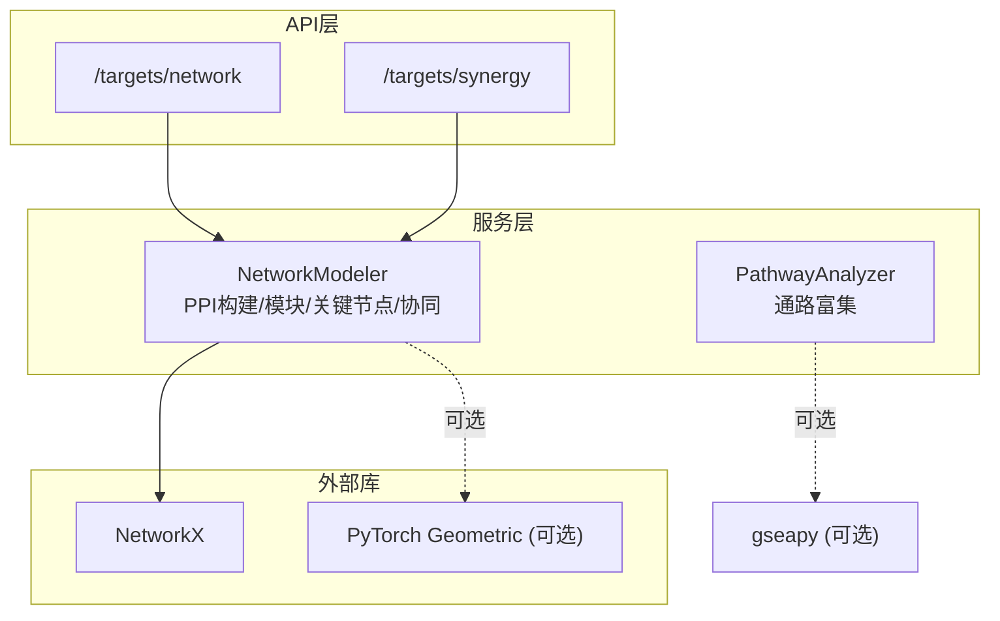
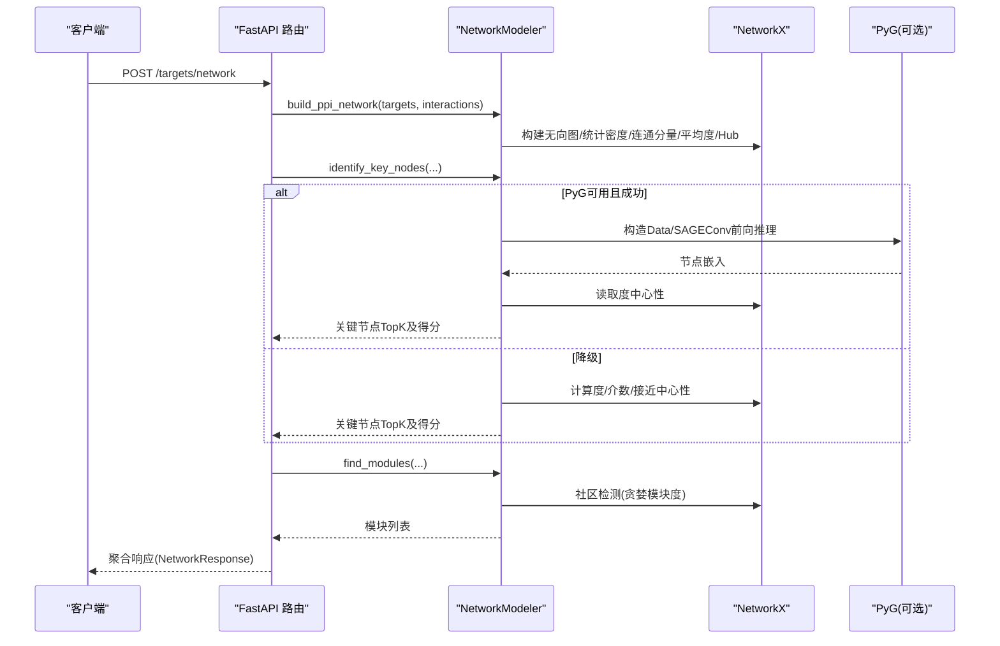
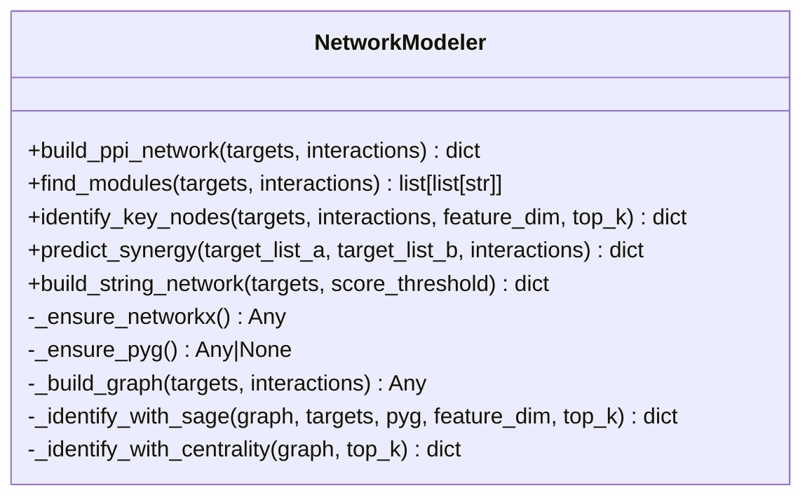
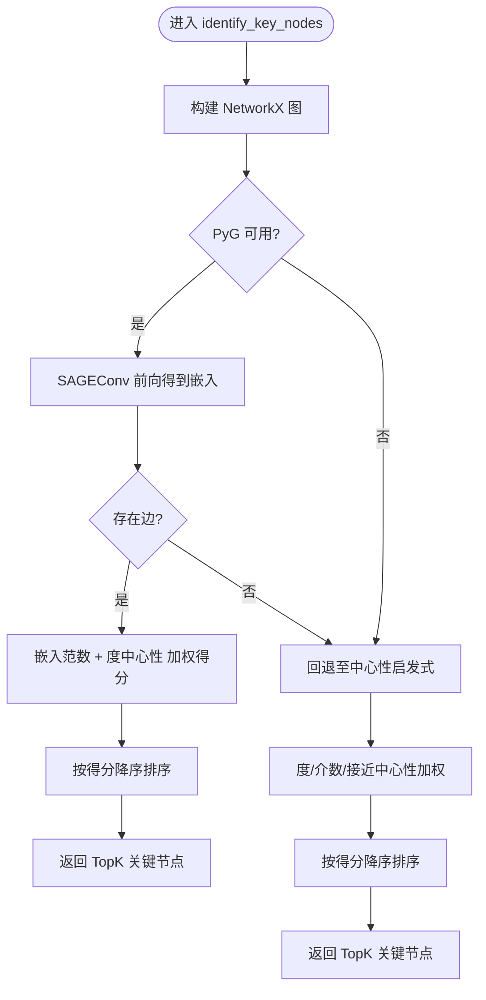
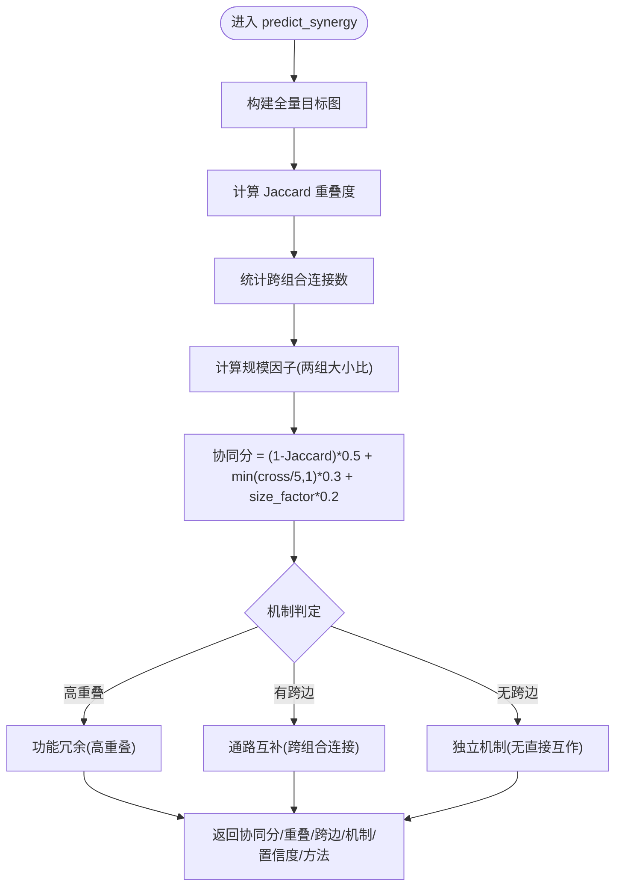
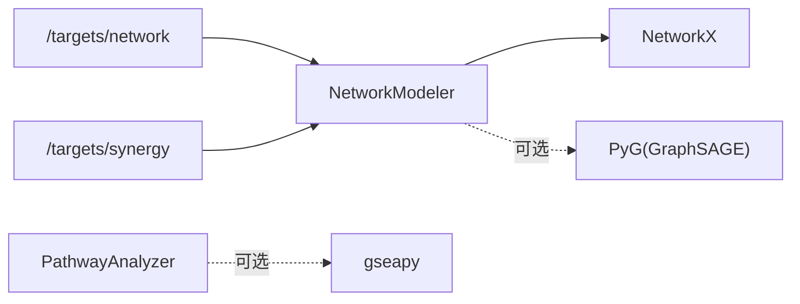

# 网络分析API

<cite>
**本文引用的文件**   
- [network_modeler.py](file://backend/app/services/analyzer/network_modeler.py)
- [targets.py](file://backend/app/api/v1/targets.py)
- [target.py](file://backend/app/schemas/target.py)
- [pathway_analyzer.py](file://backend/app/services/analyzer/pathway_analyzer.py)
- [test_network_modeler.py](file://tests/test_network_modeler.py)
</cite>

## 目录
1. [简介](#简介)
2. [项目结构](#项目结构)
3. [核心组件](#核心组件)
4. [架构总览](#架构总览)
5. [详细组件分析](#详细组件分析)
6. [依赖关系分析](#依赖关系分析)
7. [性能与可扩展性](#性能与可扩展性)
8. [故障排查指南](#故障排查指南)
9. [结论](#结论)
10. [附录：API定义](#附录api定义)

## 简介
本文件为“网络分析”功能的API文档，聚焦于蛋白质互作网络（PPI）构建、关键节点识别、功能模块分析、多靶点协同效应预测等能力。系统以 NetworkX 作为图计算基础，可选使用 PyTorch Geometric（PyG）的 GraphSAGE 进行节点嵌入与关键节点评分；在 PyG 不可用时自动降级为中心性启发式方法。同时提供通路富集分析的辅助能力，便于将网络结果与生物学通路关联解释。

## 项目结构
与网络分析相关的代码主要分布在以下位置：
- 服务层：NetworkModeler（网络建模）、PathwayAnalyzer（通路富集）
- API层：/targets/network、/targets/synergy 两个端点
- Schema层：NetworkBuildRequest、NetworkResponse、SynergyRequest、SynergyResponse
- 测试：覆盖 PPI 构建、模块发现、协同预测等用例

图表来源
- [targets.py:274-312](file://backend/app/api/v1/targets.py#L274-L312)
- [targets.py:315-343](file://backend/app/api/v1/targets.py#L315-L343)
- [network_modeler.py:14-64](file://backend/app/services/analyzer/network_modeler.py#L14-L64)
- [pathway_analyzer.py:13-32](file://backend/app/services/analyzer/pathway_analyzer.py#L13-L32)

章节来源
- [targets.py:274-312](file://backend/app/api/v1/targets.py#L274-L312)
- [targets.py:315-343](file://backend/app/api/v1/targets.py#L315-L343)
- [network_modeler.py:14-64](file://backend/app/services/analyzer/network_modeler.py#L14-L64)
- [pathway_analyzer.py:13-32](file://backend/app/services/analyzer/pathway_analyzer.py#L13-L32)

## 核心组件
- NetworkModeler
  - 基于 NetworkX 构建 PPI 网络骨架，统计密度、连通分量、平均度、Hub 节点等拓扑指标。
  - 支持社区检测（贪婪模块度），输出功能模块列表。
  - 关键节点识别：优先使用 PyG GraphSAGE 生成节点嵌入并融合度中心性打分；若 PyG 不可用或失败，则回退到中心性启发式（度+介数+接近）。
  - 多靶点协同效应预测：基于两组合的重叠度（Jaccard）、跨组合连接数、规模因子计算协同分，并给出机制推断与置信度。
  - STRING 网络构建占位接口（预留调用外部数据库的能力）。
- PathwayAnalyzer
  - 对差异基因列表执行通路富集分析（优先 gseapy），未安装时返回简化占位结果。
  - 提供显著通路过滤接口。

章节来源
- [network_modeler.py:66-104](file://backend/app/services/analyzer/network_modeler.py#L66-L104)
- [network_modeler.py:106-137](file://backend/app/services/analyzer/network_modeler.py#L106-L137)
- [network_modeler.py:139-168](file://backend/app/services/analyzer/network_modeler.py#L139-L168)
- [network_modeler.py:185-235](file://backend/app/services/analyzer/network_modeler.py#L185-L235)
- [network_modeler.py:237-269](file://backend/app/services/analyzer/network_modeler.py#L237-L269)
- [network_modeler.py:271-333](file://backend/app/services/analyzer/network_modeler.py#L271-L333)
- [pathway_analyzer.py:34-85](file://backend/app/services/analyzer/pathway_analyzer.py#L34-L85)
- [pathway_analyzer.py:87-104](file://backend/app/services/analyzer/pathway_analyzer.py#L87-L104)

## 架构总览
下图展示从 HTTP 请求到网络分析服务的调用链与数据流向。

图表来源
- [targets.py:274-312](file://backend/app/api/v1/targets.py#L274-L312)
- [network_modeler.py:66-104](file://backend/app/services/analyzer/network_modeler.py#L66-L104)
- [network_modeler.py:139-168](file://backend/app/services/analyzer/network_modeler.py#L139-L168)
- [network_modeler.py:185-235](file://backend/app/services/analyzer/network_modeler.py#L185-L235)
- [network_modeler.py:237-269](file://backend/app/services/analyzer/network_modeler.py#L237-L269)
- [network_modeler.py:106-137](file://backend/app/services/analyzer/network_modeler.py#L106-L137)

## 详细组件分析

### 组件A：NetworkModeler（网络建模器）
- 职责
  - 构建 PPI 网络骨架与拓扑统计
  - 社区检测（功能模块）
  - 关键节点识别（GraphSAGE 或中心性启发式）
  - 多靶点协同效应预测
  - STRING 网络构建占位
- 设计要点
  - 惰性加载依赖：NetworkX 必需，PyG 可选；PyG 缺失或异常时自动降级
  - 健壮性：空边、无效交互项被安全跳过；大型网络中心性计算异常时回退默认值
  - 可解释性：返回 method 字段标识实际使用的算法路径

图表来源
- [network_modeler.py:14-64](file://backend/app/services/analyzer/network_modeler.py#L14-L64)
- [network_modeler.py:66-104](file://backend/app/services/analyzer/network_modeler.py#L66-L104)
- [network_modeler.py:106-137](file://backend/app/services/analyzer/network_modeler.py#L106-L137)
- [network_modeler.py:139-168](file://backend/app/services/analyzer/network_modeler.py#L139-L168)
- [network_modeler.py:170-183](file://backend/app/services/analyzer/network_modeler.py#L170-L183)
- [network_modeler.py:185-235](file://backend/app/services/analyzer/network_modeler.py#L185-L235)
- [network_modeler.py:237-269](file://backend/app/services/analyzer/network_modeler.py#L237-L269)
- [network_modeler.py:271-333](file://backend/app/services/analyzer/network_modeler.py#L271-L333)
- [network_modeler.py:335-369](file://backend/app/services/analyzer/network_modeler.py#L335-L369)

#### 关键流程：关键节点识别（GraphSAGE vs 中心性）

图表来源
- [network_modeler.py:139-168](file://backend/app/services/analyzer/network_modeler.py#L139-L168)
- [network_modeler.py:185-235](file://backend/app/services/analyzer/network_modeler.py#L185-L235)
- [network_modeler.py:237-269](file://backend/app/services/analyzer/network_modeler.py#L237-L269)

#### 关键流程：多靶点协同效应预测

图表来源
- [network_modeler.py:271-333](file://backend/app/services/analyzer/network_modeler.py#L271-L333)

章节来源
- [network_modeler.py:139-168](file://backend/app/services/analyzer/network_modeler.py#L139-L168)
- [network_modeler.py:185-235](file://backend/app/services/analyzer/network_modeler.py#L185-L235)
- [network_modeler.py:237-269](file://backend/app/services/analyzer/network_modeler.py#L237-L269)
- [network_modeler.py:271-333](file://backend/app/services/analyzer/network_modeler.py#L271-L333)

### 组件B：PathwayAnalyzer（通路分析器）
- 职责
  - 对差异基因列表执行通路富集（KEGG/Reactome/GO），返回通路ID、名称、p值、调整p值、重叠基因等
  - 显著通路过滤（按 adjusted_p_value）
- 降级策略
  - gseapy 未安装时返回内部占位结果，保证接口可用性

章节来源
- [pathway_analyzer.py:34-85](file://backend/app/services/analyzer/pathway_analyzer.py#L34-L85)
- [pathway_analyzer.py:87-104](file://backend/app/services/analyzer/pathway_analyzer.py#L87-L104)

## 依赖关系分析
- 运行时依赖
  - NetworkX：必须，用于图构建与拓扑分析
  - PyTorch Geometric：可选，用于 GraphSAGE 节点嵌入
  - gseapy：可选，用于通路富集
- 耦合与内聚
  - API 层仅负责参数校验与响应封装，业务逻辑集中在服务层，耦合低、内聚高
  - 服务层通过惰性加载降低启动成本与运行期依赖风险

图表来源
- [targets.py:274-312](file://backend/app/api/v1/targets.py#L274-L312)
- [targets.py:315-343](file://backend/app/api/v1/targets.py#L315-L343)
- [network_modeler.py:14-64](file://backend/app/services/analyzer/network_modeler.py#L14-L64)
- [pathway_analyzer.py:13-32](file://backend/app/services/analyzer/pathway_analyzer.py#L13-L32)

章节来源
- [targets.py:274-312](file://backend/app/api/v1/targets.py#L274-L312)
- [targets.py:315-343](file://backend/app/api/v1/targets.py#L315-L343)
- [network_modeler.py:14-64](file://backend/app/services/analyzer/network_modeler.py#L14-L64)
- [pathway_analyzer.py:13-32](file://backend/app/services/analyzer/pathway_analyzer.py#L13-L32)

## 性能与可扩展性
- 时间复杂度
  - 图构建：O(V+E)
  - 社区检测（贪婪模块度）：近似线性到二次级，取决于实现与图规模
  - 中心性（介数/接近）：最坏 O(VE)，大规模图建议限制范围或采样
  - GraphSAGE 前向：O(E·d)，d 为隐藏维度
- 空间复杂度
  - 图存储 O(V+E)
  - 嵌入向量 O(V·d)
- 优化建议
  - 大图场景下优先使用邻接表与稀疏表示（NetworkX 已内置）
  - 对介数/接近中心性设置超时或子图采样
  - 批量处理与缓存：对重复查询的 targets 集合缓存图与中心性结果
  - 异步化：对外部依赖（如 STRING API）采用异步IO
  - 分布式：未来可将社区检测与中心性计算迁移至分布式图框架（如 DGL/GraphScope）

[本节为通用指导，不直接分析具体文件]

## 故障排查指南
- 常见错误与定位
  - networkx 未安装：初始化 _ensure_networkx 会抛出运行时错误
    - 参考：[network_modeler.py:28-37](file://backend/app/services/analyzer/network_modeler.py#L28-L37)
  - PyG 未安装或导入失败：自动降级为中心性启发式，日志包含警告信息
    - 参考：[network_modeler.py:39-64](file://backend/app/services/analyzer/network_modeler.py#L39-L64)
  - 图无边导致 GraphSAGE 分支短路：回退至中心性启发式
    - 参考：[network_modeler.py:209-210](file://backend/app/services/analyzer/network_modeler.py#L209-L210)
  - 中心性计算异常：介数/接近中心性捕获异常并回退为0字典
    - 参考：[network_modeler.py:246-253](file://backend/app/services/analyzer/network_modeler.py#L246-L253)
- 验证与回归
  - 单元测试覆盖 PPI 构建、模块发现、协同预测等关键路径
    - 参考：[test_network_modeler.py:48-127](file://tests/test_network_modeler.py#L48-L127)、[test_network_modeler.py:130-167](file://tests/test_network_modeler.py#L130-L167)

章节来源
- [network_modeler.py:28-37](file://backend/app/services/analyzer/network_modeler.py#L28-L37)
- [network_modeler.py:39-64](file://backend/app/services/analyzer/network_modeler.py#L39-L64)
- [network_modeler.py:209-210](file://backend/app/services/analyzer/network_modeler.py#L209-L210)
- [network_modeler.py:246-253](file://backend/app/services/analyzer/network_modeler.py#L246-L253)
- [test_network_modeler.py:48-127](file://tests/test_network_modeler.py#L48-L127)
- [test_network_modeler.py:130-167](file://tests/test_network_modeler.py#L130-L167)

## 结论
该网络分析API以 NetworkX 为核心，结合可选的 PyG GraphSAGE，提供了从 PPI 构建、关键节点识别、功能模块检测到多靶点协同预测的完整链路。系统在依赖缺失或异常时具备良好降级能力，并通过清晰的请求/响应模型暴露稳定接口。后续可在大规模网络处理、分布式计算与外部知识库集成方面进一步增强。

[本节为总结性内容，不直接分析具体文件]

## 附录：API定义

### 端点：POST /targets/network
- 功能：构建 PPI 网络、识别关键节点与功能模块
- 请求体：NetworkBuildRequest
  - targets: 靶点 symbol 列表（必填，长度1-200）
  - interactions: 已知互作列表，每项含 source、target、weight（可选）
  - score_threshold: STRING 综合得分阈值（可选，0-1）
- 响应体：NetworkResponse
  - node_count、edge_count、density、hubs、avg_degree、connected_components
  - modules: 模块列表（list[list[str]]）
  - key_nodes: 关键节点TopK（含 target、score）
  - method: 实际使用的关键节点识别方法（graphsage 或 centrality_heuristic）
- 行为说明
  - 若 PyG 可用且成功，method=graphsage；否则 method=centrality_heuristic
  - 当 edges 为空时，GraphSAGE 分支短路，自动降级为中心性启发式

章节来源
- [targets.py:274-312](file://backend/app/api/v1/targets.py#L274-L312)
- [target.py:128-161](file://backend/app/schemas/target.py#L128-L161)
- [network_modeler.py:66-104](file://backend/app/services/analyzer/network_modeler.py#L66-L104)
- [network_modeler.py:106-137](file://backend/app/services/analyzer/network_modeler.py#L106-L137)
- [network_modeler.py:139-168](file://backend/app/services/analyzer/network_modeler.py#L139-L168)
- [network_modeler.py:185-235](file://backend/app/services/analyzer/network_modeler.py#L185-L235)
- [network_modeler.py:237-269](file://backend/app/services/analyzer/network_modeler.py#L237-L269)

### 端点：POST /targets/synergy
- 功能：多靶点组合协同效应预测
- 请求体：SynergyRequest
  - target_list_a、target_list_b：两组靶点（均必填）
  - interactions：已知互作列表（可选）
- 响应体：SynergyResponse
  - synergy_score：协同分（0-1）
  - jaccard_overlap：重叠度
  - cross_edges：跨组合连接数
  - mechanism：机制推断（功能冗余/通路互补/独立机制）
  - confidence：置信度（low/medium/high）
  - method：方法标识（network_overlap_heuristic）
  - note：扩展说明（例如需预训练模型进行深度预测）
- 行为说明
  - 协同分由重叠度、跨边数与规模因子加权计算
  - 机制判定依据重叠度与跨边情况

章节来源
- [targets.py:315-343](file://backend/app/api/v1/targets.py#L315-L343)
- [target.py:164-184](file://backend/app/schemas/target.py#L164-L184)
- [network_modeler.py:271-333](file://backend/app/services/analyzer/network_modeler.py#L271-L333)

### 附加能力：通路富集（可选）
- 类：PathwayAnalyzer.enrich
  - 输入：gene_list、background、top_n
  - 输出：通路列表（含 pathway_id、name、p_value、adjusted_p_value、genes、source）
- 类：PathwayAnalyzer.filter_significant
  - 输入：pathways、p_threshold
  - 输出：显著通路列表

章节来源
- [pathway_analyzer.py:34-85](file://backend/app/services/analyzer/pathway_analyzer.py#L34-L85)
- [pathway_analyzer.py:87-104](file://backend/app/services/analyzer/pathway_analyzer.py#L87-L104)