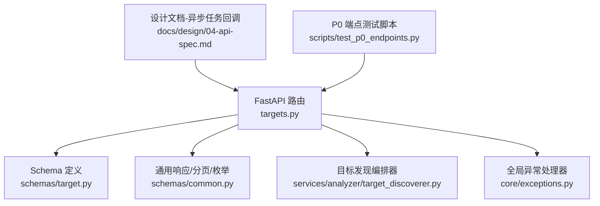
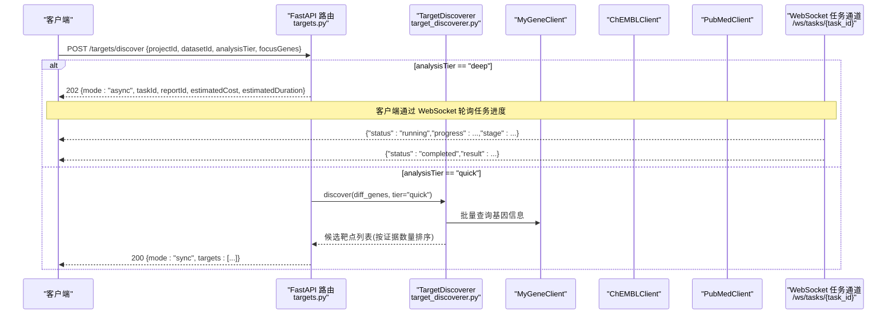
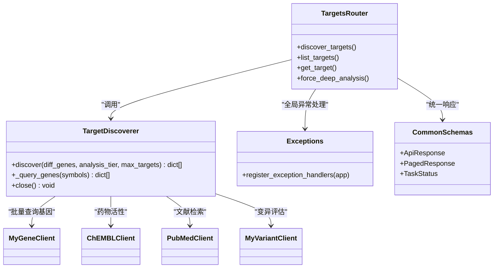

# 靶点发现API

<cite>
**本文引用的文件**   
- [targets.py](file://backend/app/api/v1/targets.py)
- [target.py](file://backend/app/schemas/target.py)
- [common.py](file://backend/app/schemas/common.py)
- [target_discoverer.py](file://backend/app/services/analyzer/target_discoverer.py)
- [exceptions.py](file://backend/app/core/exceptions.py)
- [04-api-spec.md](file://docs/design/04-api-spec.md)
- [test_p0_endpoints.py](file://scripts/test_p0_endpoints.py)
</cite>

## 目录
1. [简介](#简介)
2. [项目结构](#项目结构)
3. [核心组件](#核心组件)
4. [架构总览](#架构总览)
5. [详细接口说明](#详细接口说明)
6. [依赖关系分析](#依赖关系分析)
7. [性能与可用性](#性能与可用性)
8. [故障排查指南](#故障排查指南)
9. [结论](#结论)
10. [附录：调用示例与最佳实践](#附录调用示例与最佳实践)

## 简介
本文件为“靶点发现”功能的后端 API 文档，覆盖以下能力：
- 触发靶点发现（POST /targets/discover），支持快速筛查（quick）与深度分析（deep）两种模式
- 差异表达分析、知识库检索、候选靶点排序算法说明
- 异步任务处理机制、任务状态查询与进度跟踪（基于 WebSocket）
- 靶点列表查询（GET /targets）、靶点详情获取（GET /targets/{id}）、强制深度分析（POST /targets/{id}/force-deep-analysis）
- 请求参数、响应格式、错误处理策略
- 实际调用示例与最佳实践指导

## 项目结构
与靶点发现相关的核心代码位于后端 FastAPI 路由层、Pydantic Schema、领域服务编排器以及异常与通用响应封装中。

图表来源
- [targets.py:1-344](file://backend/app/api/v1/targets.py#L1-L344)
- [target.py:1-185](file://backend/app/schemas/target.py#L1-L185)
- [common.py:1-158](file://backend/app/schemas/common.py#L1-L158)
- [target_discoverer.py:1-176](file://backend/app/services/analyzer/target_discoverer.py#L1-L176)
- [exceptions.py:1-179](file://backend/app/core/exceptions.py#L1-L179)
- [04-api-spec.md:605-626](file://docs/design/04-api-spec.md#L605-L626)
- [test_p0_endpoints.py:125-205](file://scripts/test_p0_endpoints.py#L125-L205)

章节来源
- [targets.py:1-344](file://backend/app/api/v1/targets.py#L1-L344)
- [target.py:1-185](file://backend/app/schemas/target.py#L1-L185)
- [common.py:1-158](file://backend/app/schemas/common.py#L1-L158)
- [target_discoverer.py:1-176](file://backend/app/services/analyzer/target_discoverer.py#L1-L176)
- [exceptions.py:1-179](file://backend/app/core/exceptions.py#L1-L179)
- [04-api-spec.md:605-626](file://docs/design/04-api-spec.md#L605-L626)
- [test_p0_endpoints.py:125-205](file://scripts/test_p0_endpoints.py#L125-L205)

## 核心组件
- 路由层 targets.py：暴露 REST 接口，负责鉴权、参数校验、数据库访问、调用服务编排器、返回统一信封响应。
- Schema 层 target.py：定义请求/响应模型，包含字段约束、枚举值校验、camelCase/snake_case 兼容。
- 通用层 common.py：统一响应信封 ApiResponse/PagedResponse、分页元数据、TaskStatus 等。
- 服务层 target_discoverer.py：整合多组学与知识库客户端，执行差异基因到候选靶点的发现流程。
- 异常层 exceptions.py：全局异常处理器，将业务异常转换为统一错误信封。
- 设计文档 04-api-spec.md：定义异步任务 WebSocket 推送规范。
- 测试脚本 test_p0_endpoints.py：对 POST /targets/discover deep 模式进行端到端验证。

章节来源
- [targets.py:1-344](file://backend/app/api/v1/targets.py#L1-L344)
- [target.py:1-185](file://backend/app/schemas/target.py#L1-L185)
- [common.py:1-158](file://backend/app/schemas/common.py#L1-L158)
- [target_discoverer.py:1-176](file://backend/app/services/analyzer/target_discoverer.py#L1-L176)
- [exceptions.py:1-179](file://backend/app/core/exceptions.py#L1-L179)
- [04-api-spec.md:605-626](file://docs/design/04-api-spec.md#L605-L626)
- [test_p0_endpoints.py:125-205](file://scripts/test_p0_endpoints.py#L125-L205)

## 架构总览
下图展示了从前端发起请求到后端路由、服务编排器、外部知识库的交互路径，以及异步任务的 WebSocket 推送通道。

图表来源
- [targets.py:42-130](file://backend/app/api/v1/targets.py#L42-L130)
- [target_discoverer.py:52-139](file://backend/app/services/analyzer/target_discoverer.py#L52-L139)
- [04-api-spec.md:605-626](file://docs/design/04-api-spec.md#L605-L626)

## 详细接口说明

### 公共约定
- 所有成功响应使用统一信封 ApiResponse[T]，包含 success、data、meta.request_id。
- 所有失败响应使用统一错误信封 ErrorResponse，包含 error.code、error.message、error.details、meta.request_id。
- 分页响应使用 PagedResponse[T]，包含 data 列表与 meta.page/page_size/total/total_pages/request_id。
- 枚举值在 Schema 中校验，如 evidence_level ∈ {"I","II","III","IV"}，analysis_tier ∈ {"quick","deep"}。

章节来源
- [common.py:63-89](file://backend/app/schemas/common.py#L63-L89)
- [common.py:102-117](file://backend/app/schemas/common.py#L102-L117)
- [target.py:20-40](file://backend/app/schemas/target.py#L20-L40)
- [target.py:67-87](file://backend/app/schemas/target.py#L67-L87)

### POST /targets/discover
- 功能：触发靶点发现流程。支持 quick（同步返回结果）与 deep（异步任务）。
- 认证：需要当前用户上下文（由依赖注入提供）。
- 请求体（DiscoverRequest）
  - projectId: UUID，必填
  - datasetId: UUID，必填
  - analysisTier: "quick" | "deep"，默认 "quick"
  - focusGenes: string[]，可选；若为空且为 quick 模式，则尝试从数据集 metadata.marker_genes 读取
  - hypothesisId: UUID | null，可选
- 行为差异
  - deep：立即返回 202，包含 task_id、report_id、estimated_cost_usd、estimated_duration_seconds、mode="async"。后续通过 WebSocket 获取进度与结果。
  - quick：同步执行差异基因到候选靶点的发现流程，返回 mode="sync" 及 targets 列表。若无差异基因或上游不可用，会降级返回空结果并附带 error 提示。
- 响应体（ApiResponse[DiscoverResponse]）
  - data.taskId: UUID
  - data.reportId: UUID | null
  - data.estimatedCostUsd: float | null
  - data.estimatedDurationSeconds: int | null
  - data.targets: dict[]（仅 quick 模式）
  - data.mode: "sync" | "async"
  - data.error: string | null（降级时携带错误信息）
- 状态码
  - 200：quick 模式成功
  - 202：deep 模式已入队
  - 404：数据集不存在（quick 模式下未提供 focusGenes 且无法从数据集读取）
  - 400/422：参数校验失败（由全局异常处理器转换）
  - 500：内部错误（由全局异常处理器转换）

章节来源
- [targets.py:42-130](file://backend/app/api/v1/targets.py#L42-L130)
- [target.py:67-103](file://backend/app/schemas/target.py#L67-L103)
- [exceptions.py:131-179](file://backend/app/core/exceptions.py#L131-L179)

### GET /targets
- 功能：列出靶点，支持按 project_id、evidence_level、gene_symbol 过滤，分页返回。
- 查询参数
  - project_id: UUID | null
  - evidence_level: "I"|"II"|"III"|"IV" | null
  - gene_symbol: string | null
  - page: int ≥ 1，默认 1
  - page_size: int 1..100，默认 20
- 响应体（PagedResponse[TargetResponse]）
  - data: TargetResponse[]，每项含 id、project_id、dataset_id、gene_symbol、gene_entrez_id、evidence_level、confidence_score、mechanism、source、metadata
  - meta: page、page_size、total、total_pages、request_id

章节来源
- [targets.py:133-179](file://backend/app/api/v1/targets.py#L133-L179)
- [target.py:42-65](file://backend/app/schemas/target.py#L42-L65)
- [common.py:75-81](file://backend/app/schemas/common.py#L75-L81)

### GET /targets/{id}
- 功能：获取靶点详情，包含证据项与相关分子摘要。
- 路径参数
  - id: UUID
- 响应体（ApiResponse[TargetDetail]）
  - data: TargetDetail，继承 TargetResponse，额外包含 evidence_items、related_molecules
  - meta.request_id

章节来源
- [targets.py:182-225](file://backend/app/api/v1/targets.py#L182-L225)
- [target.py:60-65](file://backend/app/schemas/target.py#L60-L65)

### POST /targets/{id}/force-deep-analysis
- 功能：创始人强制深度分析，记录强制理由至 metadata.forced_analyses，用于“创始人直觉 vs AI 排序”对照数据集。
- 权限：仅 founder 角色可调用。
- 请求体（ForceDeepAnalysisRequest）
  - reason: string，长度 1..500
- 响应体（ApiResponse[dict]）
  - data.targetId: string
  - data.status: "deep_analysis_queued"
  - data.reason: string
  - meta.request_id
- 状态码
  - 202：入队成功
  - 403：非 founder 角色
  - 404：靶点不存在

章节来源
- [targets.py:228-271](file://backend/app/api/v1/targets.py#L228-L271)
- [target.py:105-109](file://backend/app/schemas/target.py#L105-L109)
- [exceptions.py:62-69](file://backend/app/core/exceptions.py#L62-L69)

### 异步任务与进度跟踪（WebSocket）
- 通道：WS /ws/tasks/{task_id}
- 消息格式
  - status: "queued" | "running" | "completed" | "failed"
  - progress: float 0..1（可选）
  - stage: string（可选）
  - message: string（可选）
  - result: dict（可选，终态携带结果摘要）
  - error: string（可选，失败原因）
  - timestamp: ISO 时间戳
- 用法：客户端在收到 deep 模式的 task_id 后建立 WebSocket 连接，订阅该任务的状态更新直至 completed/failed。

章节来源
- [04-api-spec.md:605-626](file://docs/design/04-api-spec.md#L605-L626)
- [common.py:102-117](file://backend/app/schemas/common.py#L102-L117)

## 依赖关系分析
- 路由层依赖
  - 依赖注入：get_current_user、get_db、get_pagination、get_request_id
  - ORM：SQLAlchemy select/selectinload 加载关联数据
  - 服务：TargetDiscoverer（快速模式）
- 服务层依赖
  - 知识库客户端：MyGeneClient、ChEMBLClient、PubMedClient、MyVariantClient
  - 证据分级：classify_evidence_level
- 异常与响应
  - 全局异常处理器将 AppException 子类映射为 HTTP 状态码与统一错误信封
  - 通用响应封装 ApiResponse/PagedResponse/TaskStatus

图表来源
- [targets.py:1-344](file://backend/app/api/v1/targets.py#L1-L344)
- [target_discoverer.py:26-176](file://backend/app/services/analyzer/target_discoverer.py#L26-L176)
- [exceptions.py:131-179](file://backend/app/core/exceptions.py#L131-L179)
- [common.py:63-117](file://backend/app/schemas/common.py#L63-L117)

章节来源
- [targets.py:1-344](file://backend/app/api/v1/targets.py#L1-L344)
- [target_discoverer.py:26-176](file://backend/app/services/analyzer/target_discoverer.py#L26-L176)
- [exceptions.py:131-179](file://backend/app/core/exceptions.py#L131-L179)
- [common.py:63-117](file://backend/app/schemas/common.py#L63-L117)

## 性能与可用性
- 快速筛查（quick）
  - 差异基因上限：最多取前 50 个进行批量查询
  - 最大候选靶点数：默认 20
  - 排序策略：按证据数量降序
- 深度分析（deep）
  - 预估成本与时长：服务端根据 tier 估算并返回给客户端
  - 异步任务：通过 WebSocket 推送阶段与进度，避免长轮询阻塞
- 容错与降级
  - 上游不可用时，quick 模式返回空结果并附带 error 提示
  - 全局异常处理器捕获未预期异常，返回 500 与 INTERNAL_ERROR

章节来源
- [target_discoverer.py:52-139](file://backend/app/services/analyzer/target_discoverer.py#L52-L139)
- [targets.py:54-130](file://backend/app/api/v1/targets.py#L54-L130)
- [exceptions.py:131-179](file://backend/app/core/exceptions.py#L131-L179)

## 故障排查指南
- 常见错误码
  - VALIDATION_ERROR：请求参数不符合 Schema 约束（如 analysis_tier 不在允许集合）
  - NOT_FOUND：数据集或靶点不存在
  - FORBIDDEN：非 founder 角色调用强制深度分析
  - UPSTREAM_ERROR：外部知识库调用失败（由上游异常类映射）
  - INTERNAL_ERROR：未捕获异常兜底
- 定位建议
  - 检查 meta.request_id 与服务端日志，便于追踪
  - deep 模式优先确认 WebSocket 连接是否建立、是否收到 completed/failed 终态
  - quick 模式关注 error 字段提示，必要时提供 focusGenes 或确保数据集存在

章节来源
- [exceptions.py:19-94](file://backend/app/core/exceptions.py#L19-L94)
- [targets.py:71-130](file://backend/app/api/v1/targets.py#L71-L130)
- [04-api-spec.md:605-626](file://docs/design/04-api-spec.md#L605-L626)

## 结论
本 API 以统一信封与强类型 Schema 保障前后端契约一致性；通过 quick/deep 双模式兼顾即时反馈与深度洞察；借助 WebSocket 实现长任务进度可视化；配合全局异常处理提升系统健壮性与可观测性。

## 附录：调用示例与最佳实践

### 示例一：快速筛查（quick）
- 请求
  - 方法：POST
  - 路径：/targets/discover
  - 头部：Authorization: Bearer <token>
  - 主体：{
      "projectId": "<UUID>",
      "datasetId": "<UUID>",
      "analysisTier": "quick",
      "focusGenes": ["EGFR", "KRAS", "TP53"]
    }
- 响应
  - 状态码：200
  - 主体：ApiResponse[DiscoverResponse]，data.mode="sync"，data.targets 为候选列表

章节来源
- [targets.py:71-117](file://backend/app/api/v1/targets.py#L71-L117)
- [target.py:67-103](file://backend/app/schemas/target.py#L67-L103)

### 示例二：深度分析（deep）
- 请求
  - 方法：POST
  - 路径：/targets/discover
  - 头部：Authorization: Bearer <token>
  - 主体：{
      "projectId": "<UUID>",
      "datasetId": "<UUID>",
      "analysisTier": "deep",
      "focusGenes": ["EGFR", "KRAS", "TP53"]
    }
- 响应
  - 状态码：202
  - 主体：ApiResponse[DiscoverResponse]，data.mode="async"，data.taskId 用于 WebSocket 轮询

章节来源
- [targets.py:59-69](file://backend/app/api/v1/targets.py#L59-L69)
- [test_p0_endpoints.py:125-141](file://scripts/test_p0_endpoints.py#L125-L141)

### 示例三：任务进度（WebSocket）
- 连接：ws://host/ws/tasks/<taskId>
- 消息：{"status":"running","progress":0.65,"stage":"scanning_chembl","message":"扫描 ChEMBL 已获批药物...","timestamp":"..."}
- 终态：status ∈ {"completed","failed"}，result 携带结果摘要

章节来源
- [04-api-spec.md:605-626](file://docs/design/04-api-spec.md#L605-L626)

### 示例四：靶点列表与详情
- 列表：GET /targets?project_id=<UUID>&evidence_level=I&page=1&page_size=20
- 详情：GET /targets/<targetId>

章节来源
- [targets.py:133-225](file://backend/app/api/v1/targets.py#L133-L225)

### 示例五：强制深度分析
- 请求
  - 方法：POST
  - 路径：/targets/<targetId>/force-deep-analysis
  - 头部：Authorization: Bearer <token>（需 founder 角色）
  - 主体：{"reason": "临床优先级高，需深入评估"}
- 响应
  - 状态码：202
  - 主体：ApiResponse[dict]，data.status="deep_analysis_queued"

章节来源
- [targets.py:228-271](file://backend/app/api/v1/targets.py#L228-L271)

### 最佳实践
- 参数校验
  - 严格遵循 Schema 约束，避免 VALIDATION_ERROR
- 快速筛查优化
  - 合理设置 focusGenes 长度，避免过长导致上游限流
  - 利用分页与过滤条件减少不必要的数据传输
- 深度分析体验
  - 收到 202 后立即建立 WebSocket 连接，展示进度条与阶段信息
  - 超时重试与断线重连策略
- 错误处理
  - 解析 meta.request_id 上报问题
  - 区分业务异常与系统异常，面向用户提供友好提示

章节来源
- [target.py:67-103](file://backend/app/schemas/target.py#L67-L103)
- [exceptions.py:131-179](file://backend/app/core/exceptions.py#L131-L179)
- [04-api-spec.md:605-626](file://docs/design/04-api-spec.md#L605-L626)