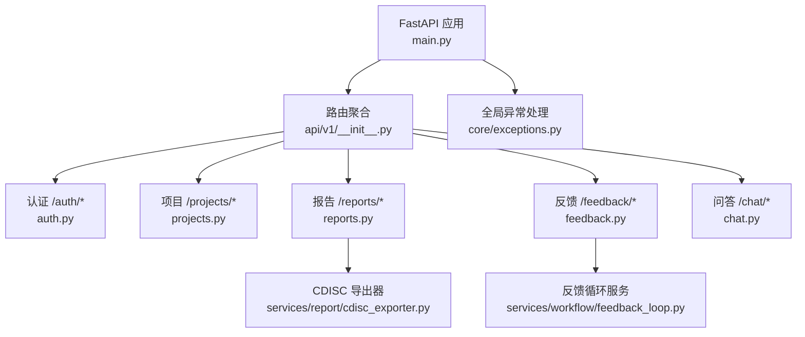
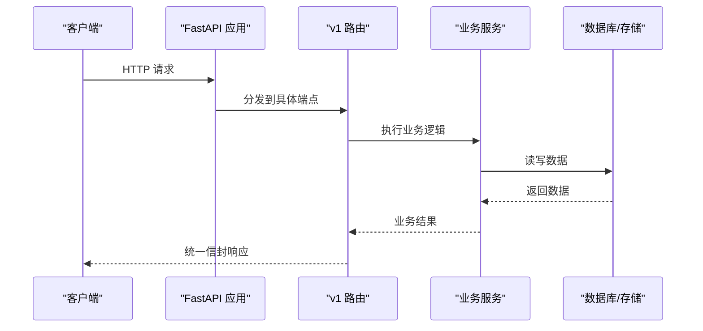
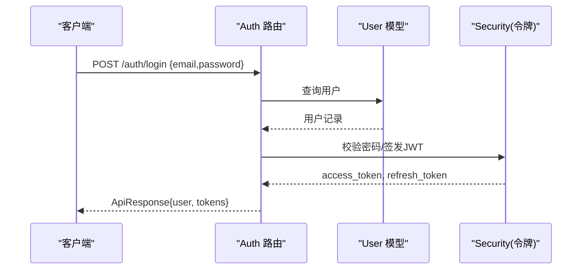
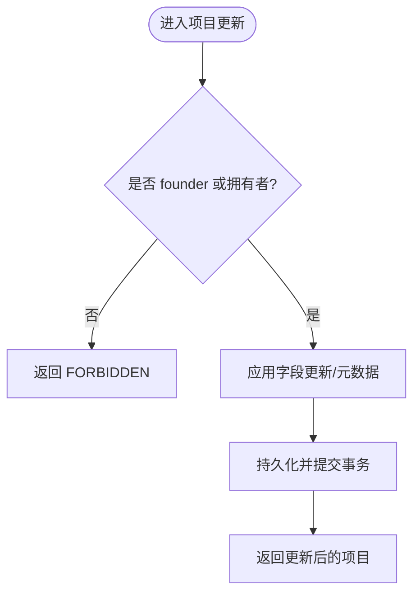
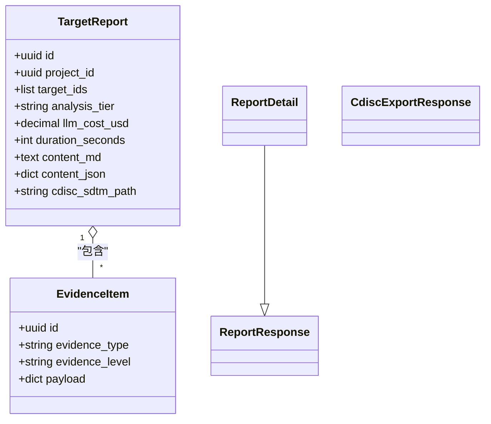
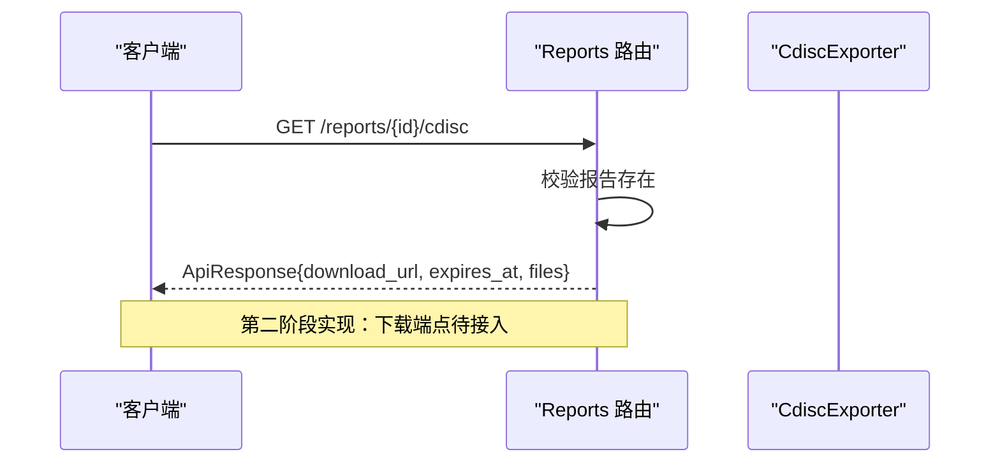
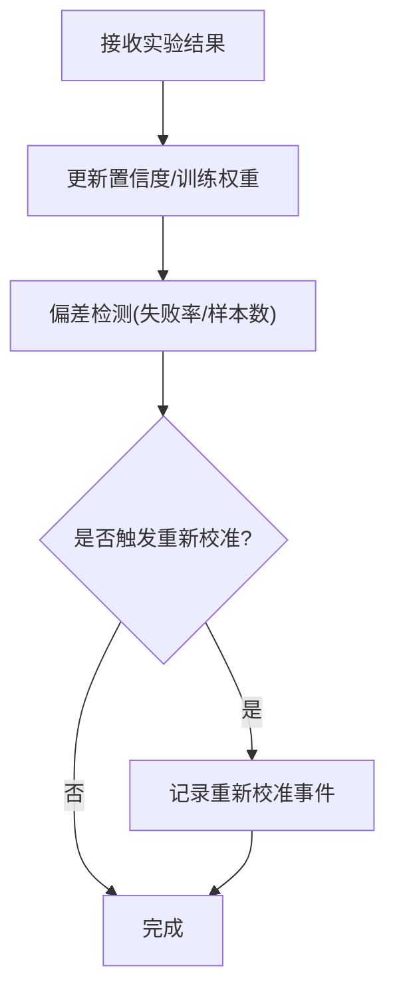
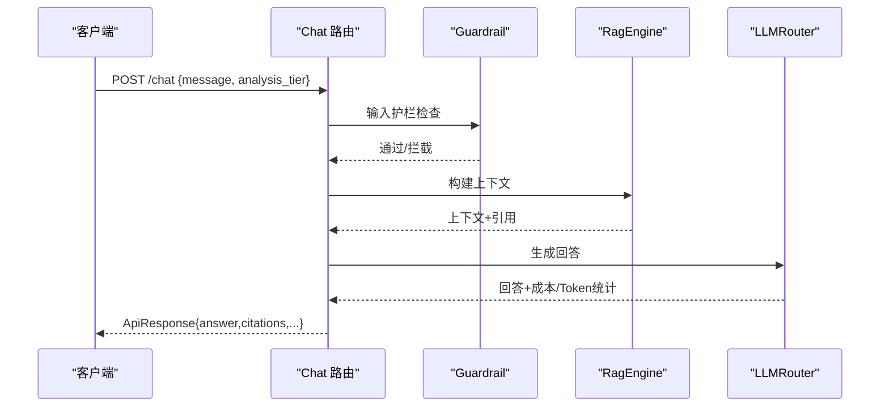
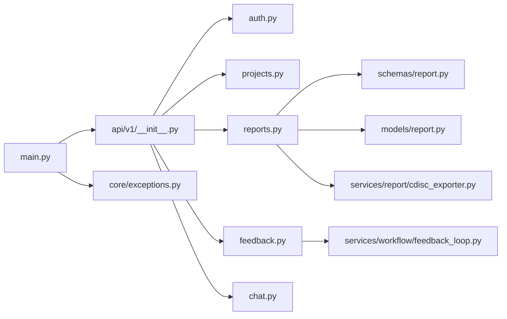

# 协作平台API

<cite>
**本文引用的文件**   
- [backend/app/main.py](file://backend/app/main.py)
- [backend/app/api/v1/__init__.py](file://backend/app/api/v1/__init__.py)
- [backend/app/api/v1/reports.py](file://backend/app/api/v1/reports.py)
- [backend/app/api/v1/feedback.py](file://backend/app/api/v1/feedback.py)
- [backend/app/api/v1/projects.py](file://backend/app/api/v1/projects.py)
- [backend/app/api/v1/auth.py](file://backend/app/api/v1/auth.py)
- [backend/app/api/v1/chat.py](file://backend/app/api/v1/chat.py)
- [backend/app/schemas/report.py](file://backend/app/schemas/report.py)
- [backend/app/schemas/common.py](file://backend/app/schemas/common.py)
- [backend/app/schemas/feedback.py](file://backend/app/schemas/feedback.py)
- [backend/app/models/report.py](file://backend/app/models/report.py)
- [backend/app/models/user.py](file://backend/app/models/user.py)
- [backend/app/services/report/cdisc_exporter.py](file://backend/app/services/report/cdisc_exporter.py)
- [backend/app/services/workflow/feedback_loop.py](file://backend/app/services/workflow/feedback_loop.py)
- [backend/app/core/exceptions.py](file://backend/app/core/exceptions.py)
</cite>

## 目录
1. [简介](#简介)
2. [项目结构](#项目结构)
3. [核心组件](#核心组件)
4. [架构总览](#架构总览)
5. [详细组件分析](#详细组件分析)
6. [依赖关系分析](#依赖关系分析)
7. [性能与扩展性](#性能与扩展性)
8. [故障排查指南](#故障排查指南)
9. [结论](#结论)
10. [附录：接口清单](#附录接口清单)

## 简介
本文件为“协作平台”后端 API 的权威文档，聚焦以下能力：
- 报告生成与导出：CDISC SDTM 标准导出、Markdown/JSON 结构化内容、重新生成任务
- 反馈收集：干湿闭环实验结果提交、偏差检测、模型重新校准、LIMS 数据导入、实验状态追踪
- 团队协作：项目管理（含权限控制）、自然语言问答（RAG + LLM）
- 安全与合规：统一响应信封、全局异常处理、请求追踪、CORS、角色访问控制
- 自动化与通知：异步任务占位（202 Accepted）、可扩展至定时任务与消息队列

说明：
- 所有接口均返回统一信封格式 {success, data, meta}，分页接口使用 PagedResponse。
- 认证采用 JWT（access_token + refresh_token），部分端点需要登录态。
- 当前实现中，CDISC 导出与报告重新生成为第二阶段/第三阶段能力，提供占位或内存版实现，生产环境可替换为持久化与外部系统对接。

## 项目结构
后端基于 FastAPI，路由按 v1 聚合，模块按领域划分（auth、projects、reports、feedback、chat 等）。应用启动时注册中间件（信封、CORS、异常处理器）并挂载路由。

图表来源
- [backend/app/main.py:187-248](file://backend/app/main.py#L187-L248)
- [backend/app/api/v1/__init__.py:24-38](file://backend/app/api/v1/__init__.py#L24-L38)
- [backend/app/api/v1/reports.py:1-181](file://backend/app/api/v1/reports.py#L1-L181)
- [backend/app/api/v1/feedback.py:1-357](file://backend/app/api/v1/feedback.py#L1-L357)
- [backend/app/api/v1/auth.py:1-147](file://backend/app/api/v1/auth.py#L1-L147)
- [backend/app/api/v1/chat.py:1-177](file://backend/app/api/v1/chat.py#L1-L177)
- [backend/app/services/report/cdisc_exporter.py:1-187](file://backend/app/services/report/cdisc_exporter.py#L1-L187)
- [backend/app/services/workflow/feedback_loop.py:1-281](file://backend/app/services/workflow/feedback_loop.py#L1-L281)
- [backend/app/core/exceptions.py:131-179](file://backend/app/core/exceptions.py#L131-L179)

章节来源
- [backend/app/main.py:187-248](file://backend/app/main.py#L187-L248)
- [backend/app/api/v1/__init__.py:24-38](file://backend/app/api/v1/__init__.py#L24-L38)

## 核心组件
- 统一响应信封与分页
  - ApiResponse/PagedResponse 用于成功响应；ErrorResponse 用于错误响应；PagedMeta 包含 page/page_size/total/total_pages/request_id/duration_ms。
- 认证与安全
  - JWT access/refresh token；用户角色 founder/pi/researcher/doctor/engineer；部分端点需登录态。
- 报告与证据
  - TargetReport/EvidenceItem 模型；ReportResponse/ReportDetail/CdiscExportResponse 等 Schema。
- 反馈闭环
  - FeedbackLoop 内存实现：置信度调整、偏差检测、重新校准事件；ExperimentTracker 管理实验状态机。
- CDISC 导出
  - CdiscExporter 支持 TS/DM/AE/LB 域构建与 JSON 输出。

章节来源
- [backend/app/schemas/common.py:63-117](file://backend/app/schemas/common.py#L63-L117)
- [backend/app/models/report.py:15-73](file://backend/app/models/report.py#L15-L73)
- [backend/app/schemas/report.py:16-59](file://backend/app/schemas/report.py#L16-L59)
- [backend/app/services/workflow/feedback_loop.py:71-281](file://backend/app/services/workflow/feedback_loop.py#L71-L281)
- [backend/app/services/report/cdisc_exporter.py:22-88](file://backend/app/services/report/cdisc_exporter.py#L22-L88)

## 架构总览
整体调用链：客户端 → FastAPI 中间件（信封/CORS/日志）→ 路由层 → 业务服务 → 数据模型/存储。

图表来源
- [backend/app/main.py:187-248](file://backend/app/main.py#L187-L248)
- [backend/app/api/v1/__init__.py:24-38](file://backend/app/api/v1/__init__.py#L24-L38)

## 详细组件分析

### 认证与鉴权
- 功能要点
  - 注册（首位 founder 开放，后续需 token）、登录（返回 access/refresh token）、刷新 token、获取当前用户信息。
  - 角色控制：founder 可访问全部资源；其他角色仅能访问自有项目。
- 关键端点
  - POST /api/v1/auth/register
  - POST /api/v1/auth/login
  - POST /api/v1/auth/refresh
  - GET /api/v1/auth/me
- 鉴权流程
  - 登录成功后，客户端在后续请求携带 access_token；服务端解析并注入 current_user 依赖。

图表来源
- [backend/app/api/v1/auth.py:70-101](file://backend/app/api/v1/auth.py#L70-L101)
- [backend/app/models/user.py:14-36](file://backend/app/models/user.py#L14-L36)

章节来源
- [backend/app/api/v1/auth.py:41-147](file://backend/app/api/v1/auth.py#L41-L147)
- [backend/app/models/user.py:14-36](file://backend/app/models/user.py#L14-L36)

### 项目管理（团队协作基础）
- 功能要点
  - 项目 CRUD、软删除（status=archived）、分页列表、按状态过滤。
  - 权限：非 founder 仅能访问 own 项目。
- 关键端点
  - GET /api/v1/projects
  - POST /api/v1/projects
  - GET /api/v1/projects/{project_id}
  - PATCH /api/v1/projects/{project_id}
  - DELETE /api/v1/projects/{project_id}

图表来源
- [backend/app/api/v1/projects.py:128-150](file://backend/app/api/v1/projects.py#L128-L150)
- [backend/app/api/v1/projects.py:32-44](file://backend/app/api/v1/projects.py#L32-L44)

章节来源
- [backend/app/api/v1/projects.py:47-169](file://backend/app/api/v1/projects.py#L47-L169)

### 报告生成与导出（CDISC/自定义模板/批量导出）
- 功能要点
  - 报告列表（支持 project_id、analysis_tier 过滤与分页）。
  - 报告详情（Markdown + 结构化 JSON + 证据项分布）。
  - CDISC SDTM 导出（返回下载 URL 与过期时间，第二阶段占位）。
  - 重新生成报告（异步任务占位，返回 202）。
- 关键端点
  - GET /api/v1/reports
  - GET /api/v1/reports/{report_id}
  - GET /api/v1/reports/{report_id}/cdisc
  - POST /api/v1/reports/{report_id}/regenerate
- 数据模型与 Schema
  - TargetReport/EvidenceItem 模型；ReportResponse/ReportDetail/CdiscExportResponse。

图表来源
- [backend/app/models/report.py:15-73](file://backend/app/models/report.py#L15-L73)
- [backend/app/schemas/report.py:16-59](file://backend/app/schemas/report.py#L16-L59)

章节来源
- [backend/app/api/v1/reports.py:35-181](file://backend/app/api/v1/reports.py#L35-L181)
- [backend/app/schemas/report.py:16-59](file://backend/app/schemas/report.py#L16-L59)
- [backend/app/models/report.py:15-73](file://backend/app/models/report.py#L15-L73)

#### CDISC 导出流程
- 行为说明
  - 返回临时下载链接与过期时间；实际导出由 CdiscExporter 负责，当前返回占位 URL。
  - 支持 TS/DM/AE/LB 域构建与 JSON 输出。

图表来源
- [backend/app/api/v1/reports.py:123-153](file://backend/app/api/v1/reports.py#L123-L153)
- [backend/app/services/report/cdisc_exporter.py:28-88](file://backend/app/services/report/cdisc_exporter.py#L28-L88)

章节来源
- [backend/app/api/v1/reports.py:123-153](file://backend/app/api/v1/reports.py#L123-L153)
- [backend/app/services/report/cdisc_exporter.py:22-88](file://backend/app/services/report/cdisc_exporter.py#L22-L88)

### 反馈收集（干湿闭环）
- 功能要点
  - 提交湿实验结果：自动调整靶点置信度、训练权重、偏差检测、触发重新校准。
  - 偏差检测：失败率阈值与最小样本数判定。
  - 手动重新校准：记录事件与受影响模型。
  - LIMS 导入：CSV/JSON 两种输入，自动吸收为实验结果。
  - 实验状态机：添加/转换/查询实验记录。
- 关键端点
  - POST /api/v1/feedback/experiments
  - GET /api/v1/feedback/experiments?target_symbol=...
  - POST /api/v1/feedback/recalibrate
  - GET /api/v1/feedback/bias-detection/{target_symbol}
  - GET /api/v1/feedback/summary
  - POST /api/v1/feedback/lims-import
  - POST /api/v1/feedback/experiments/{experiment_id}/transition
  - POST /api/v1/feedback/experiments/tracker
  - GET /api/v1/feedback/experiments/tracker

图表来源
- [backend/app/services/workflow/feedback_loop.py:99-163](file://backend/app/services/workflow/feedback_loop.py#L99-L163)
- [backend/app/services/workflow/feedback_loop.py:165-206](file://backend/app/services/workflow/feedback_loop.py#L165-L206)
- [backend/app/services/workflow/feedback_loop.py:208-231](file://backend/app/services/workflow/feedback_loop.py#L208-L231)

章节来源
- [backend/app/api/v1/feedback.py:53-357](file://backend/app/api/v1/feedback.py#L53-L357)
- [backend/app/services/workflow/feedback_loop.py:71-281](file://backend/app/services/workflow/feedback_loop.py#L71-L281)
- [backend/app/schemas/feedback.py:12-116](file://backend/app/schemas/feedback.py#L12-L116)

### 自然语言问答（RAG + LLM）
- 功能要点
  - 输入安全护栏检查 → RAG 检索上下文 → LLM 生成回答 → 输出护栏检查 → 返回答案与引用。
  - LLM 不可用时降级返回 RAG 摘要。
- 关键端点
  - POST /api/v1/chat
  - GET /api/v1/chat/history

图表来源
- [backend/app/api/v1/chat.py:30-157](file://backend/app/api/v1/chat.py#L30-L157)

章节来源
- [backend/app/api/v1/chat.py:30-177](file://backend/app/api/v1/chat.py#L30-L177)

## 依赖关系分析
- 路由依赖
  - 所有 v1 路由通过 api_router 聚合挂载于 /api/v1。
- 服务依赖
  - reports 路由依赖 report schemas 与 models；feedback 路由依赖 feedback_loop 与 LIMS importer。
- 全局依赖
  - 统一异常处理、信封中间件、CORS、健康检查。

图表来源
- [backend/app/main.py:187-248](file://backend/app/main.py#L187-L248)
- [backend/app/api/v1/__init__.py:24-38](file://backend/app/api/v1/__init__.py#L24-L38)
- [backend/app/api/v1/reports.py:1-181](file://backend/app/api/v1/reports.py#L1-L181)
- [backend/app/api/v1/feedback.py:1-357](file://backend/app/api/v1/feedback.py#L1-L357)
- [backend/app/schemas/report.py:16-59](file://backend/app/schemas/report.py#L16-L59)
- [backend/app/models/report.py:15-73](file://backend/app/models/report.py#L15-L73)
- [backend/app/services/report/cdisc_exporter.py:22-88](file://backend/app/services/report/cdisc_exporter.py#L22-L88)
- [backend/app/services/workflow/feedback_loop.py:71-281](file://backend/app/services/workflow/feedback_loop.py#L71-L281)
- [backend/app/core/exceptions.py:131-179](file://backend/app/core/exceptions.py#L131-L179)

章节来源
- [backend/app/api/v1/__init__.py:24-38](file://backend/app/api/v1/__init__.py#L24-L38)

## 性能与扩展性
- 中间件优化
  - 信封中间件对 200 且 application/json 的响应注入 duration_ms，并回写 X-Request-ID/X-Response-Time-ms。
- 分页与查询
  - 列表接口统一使用 offset/limit 分页，避免大结果集一次性加载。
- 异步与占位
  - 报告重新生成返回 202，便于后续接入 Celery/RQ 等任务队列。
- 建议扩展
  - 将 FeedbackLoop/ExperimentTracker 持久化至数据库或缓存。
  - CDISC 导出改为流式 ZIP 生成与对象存储直传。
  - 引入速率限制与审计日志中间件。

[本节为通用指导，不直接分析具体文件]

## 故障排查指南
- 统一错误信封
  - 所有异常经全局处理器转换为 {success:false, error:{code,message,details}, meta:{request_id}}。
- 常见错误码
  - VALIDATION_ERROR：参数校验失败。
  - UNAUTHORIZED：未认证或 token 无效。
  - FORBIDDEN：无权限访问资源。
  - NOT_FOUND：资源不存在。
  - GUARDRAIL_BLOCKED：安全护栏拦截。
  - RATE_LIMITED：请求频率受限。
  - UPSTREAM_ERROR：上游服务不可用。
  - INTERNAL_ERROR：服务器内部错误。
- 定位技巧
  - 使用 X-Request-ID 进行全链路追踪。
  - 关注服务端日志中的业务异常与未捕获异常。

章节来源
- [backend/app/core/exceptions.py:19-94](file://backend/app/core/exceptions.py#L19-L94)
- [backend/app/core/exceptions.py:131-179](file://backend/app/core/exceptions.py#L131-L179)

## 结论
该协作平台 API 以 FastAPI 为核心，提供统一的响应信封、完善的异常处理与清晰的模块化路由。报告与反馈两大子系统已具备端到端能力，CDISC 导出与异步任务处于第二阶段/第三阶段实现路径，易于扩展为生产级方案。建议在后续版本中完善持久化、任务调度、审计与合规机制，以满足更严格的监管要求。

[本节为总结，不直接分析具体文件]

## 附录：接口清单
- 认证
  - POST /api/v1/auth/register
  - POST /api/v1/auth/login
  - POST /api/v1/auth/refresh
  - GET /api/v1/auth/me
- 项目
  - GET /api/v1/projects
  - POST /api/v1/projects
  - GET /api/v1/projects/{project_id}
  - PATCH /api/v1/projects/{project_id}
  - DELETE /api/v1/projects/{project_id}
- 报告
  - GET /api/v1/reports
  - GET /api/v1/reports/{report_id}
  - GET /api/v1/reports/{report_id}/cdisc
  - POST /api/v1/reports/{report_id}/regenerate
- 反馈
  - POST /api/v1/feedback/experiments
  - GET /api/v1/feedback/experiments
  - POST /api/v1/feedback/recalibrate
  - GET /api/v1/feedback/bias-detection/{target_symbol}
  - GET /api/v1/feedback/summary
  - POST /api/v1/feedback/lims-import
  - POST /api/v1/feedback/experiments/{experiment_id}/transition
  - POST /api/v1/feedback/experiments/tracker
  - GET /api/v1/feedback/experiments/tracker
- 问答
  - POST /api/v1/chat
  - GET /api/v1/chat/history

章节来源
- [backend/app/api/v1/auth.py:41-147](file://backend/app/api/v1/auth.py#L41-L147)
- [backend/app/api/v1/projects.py:47-169](file://backend/app/api/v1/projects.py#L47-L169)
- [backend/app/api/v1/reports.py:35-181](file://backend/app/api/v1/reports.py#L35-L181)
- [backend/app/api/v1/feedback.py:53-357](file://backend/app/api/v1/feedback.py#L53-L357)
- [backend/app/api/v1/chat.py:30-177](file://backend/app/api/v1/chat.py#L30-L177)