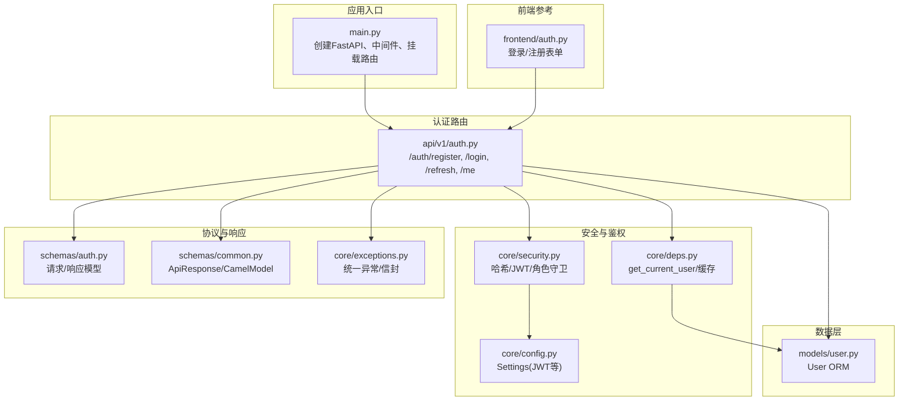
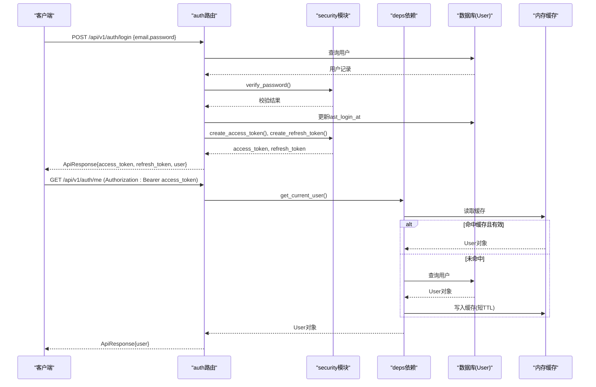
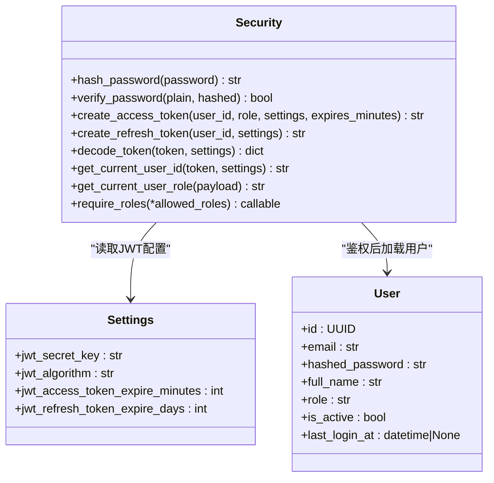
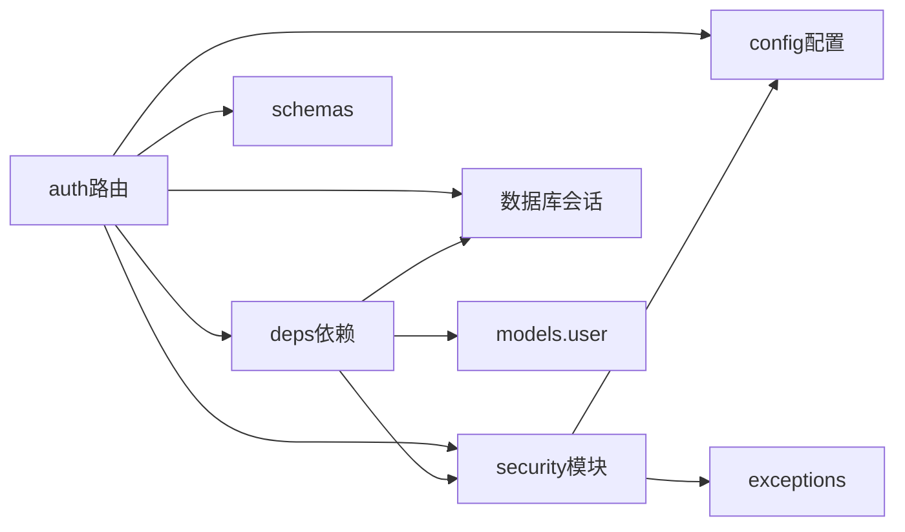

# 用户认证API

<cite>
**本文引用的文件**
- [backend/app/api/v1/auth.py](file://backend/app/api/v1/auth.py)
- [backend/app/schemas/auth.py](file://backend/app/schemas/auth.py)
- [backend/app/core/security.py](file://backend/app/core/security.py)
- [backend/app/models/user.py](file://backend/app/models/user.py)
- [backend/app/core/deps.py](file://backend/app/core/deps.py)
- [backend/app/core/config.py](file://backend/app/core/config.py)
- [backend/app/core/exceptions.py](file://backend/app/core/exceptions.py)
- [backend/app/schemas/common.py](file://backend/app/schemas/common.py)
- [backend/app/main.py](file://backend/app/main.py)
- [frontend/auth.py](file://frontend/auth.py)
</cite>

## 目录
1. [简介](#简介)
2. [项目结构](#项目结构)
3. [核心组件](#核心组件)
4. [架构总览](#架构总览)
5. [详细组件分析](#详细组件分析)
6. [依赖关系分析](#依赖关系分析)
7. [性能与扩展性](#性能与扩展性)
8. [故障排查指南](#故障排查指南)
9. [结论](#结论)
10. [附录：请求与响应规范、示例与安全实践](#附录请求与响应规范示例与安全实践)

## 简介
本文件为用户认证模块的完整API文档，覆盖以下能力：
- 用户注册、登录、刷新令牌、获取当前用户信息
- JWT访问令牌与刷新令牌机制
- 基于角色的权限控制（RBAC）
- 统一错误处理与响应信封
- 安全最佳实践与多因素认证扩展建议
- curl与Python SDK调用示例

说明：
- 登出为前端本地会话清理，后端未提供专用登出端点。
- 密码重置功能在本仓库中未实现，可在“附录”中给出扩展建议。

## 项目结构
认证相关代码主要分布在以下位置：
- API路由：backend/app/api/v1/auth.py
- 数据模型：backend/app/models/user.py
- 校验Schema：backend/app/schemas/auth.py、backend/app/schemas/common.py
- 安全与JWT：backend/app/core/security.py
- 通用依赖注入：backend/app/core/deps.py
- 配置项（JWT等）：backend/app/core/config.py
- 全局异常处理与统一信封：backend/app/core/exceptions.py、backend/app/main.py
- 前端登录/注册交互参考：frontend/auth.py

图表来源
- [backend/app/main.py:187-248](file://backend/app/main.py#L187-L248)
- [backend/app/api/v1/auth.py:1-147](file://backend/app/api/v1/auth.py#L1-L147)
- [backend/app/core/security.py:1-211](file://backend/app/core/security.py#L1-L211)
- [backend/app/core/deps.py:1-129](file://backend/app/core/deps.py#L1-L129)
- [backend/app/models/user.py:1-36](file://backend/app/models/user.py#L1-L36)
- [backend/app/schemas/auth.py:1-61](file://backend/app/schemas/auth.py#L1-L61)
- [backend/app/schemas/common.py:1-158](file://backend/app/schemas/common.py#L1-L158)
- [backend/app/core/exceptions.py:1-179](file://backend/app/core/exceptions.py#L1-L179)
- [frontend/auth.py:1-137](file://frontend/auth.py#L1-L137)

章节来源
- [backend/app/main.py:187-248](file://backend/app/main.py#L187-L248)
- [backend/app/api/v1/auth.py:1-147](file://backend/app/api/v1/auth.py#L1-L147)

## 核心组件
- 认证路由：提供注册、登录、刷新、获取当前用户信息四个端点。
- 安全模块：bcrypt密码哈希与校验、JWT生成与解析、OAuth2 Bearer提取、角色守卫工厂。
- 依赖注入：从Header或Cookie中提取token并解析用户ID，再加载完整User对象（含短TTL内存缓存）。
- 数据模型：User包含邮箱、密码哈希、姓名、角色、激活状态、最后登录时间等字段。
- Schema定义：注册/登录/刷新/公开用户信息/令牌响应的Pydantic模型，支持snake_case与camelCase双向兼容。
- 配置：JWT密钥、算法、有效期等通过环境变量加载。
- 异常与信封：统一错误码、HTTP状态码与响应信封，便于客户端一致处理。

章节来源
- [backend/app/api/v1/auth.py:1-147](file://backend/app/api/v1/auth.py#L1-L147)
- [backend/app/core/security.py:1-211](file://backend/app/core/security.py#L1-L211)
- [backend/app/core/deps.py:1-129](file://backend/app/core/deps.py#L1-L129)
- [backend/app/models/user.py:1-36](file://backend/app/models/user.py#L1-L36)
- [backend/app/schemas/auth.py:1-61](file://backend/app/schemas/auth.py#L1-L61)
- [backend/app/schemas/common.py:1-158](file://backend/app/schemas/common.py#L1-L158)
- [backend/app/core/config.py:1-144](file://backend/app/core/config.py#L1-L144)
- [backend/app/core/exceptions.py:1-179](file://backend/app/core/exceptions.py#L1-L179)

## 架构总览
认证流程采用无状态JWT + 短期访问令牌 + 长期刷新令牌的组合模式。敏感操作通过角色守卫进行授权控制；用户对象在内存中做短TTL缓存以降低数据库压力。

图表来源
- [backend/app/api/v1/auth.py:70-101](file://backend/app/api/v1/auth.py#L70-L101)
- [backend/app/api/v1/auth.py:137-146](file://backend/app/api/v1/auth.py#L137-L146)
- [backend/app/core/security.py:96-122](file://backend/app/core/security.py#L96-L122)
- [backend/app/core/deps.py:101-124](file://backend/app/core/deps.py#L101-L124)

## 详细组件分析

### 认证端点清单
- 注册：POST /api/v1/auth/register
- 登录：POST /api/v1/auth/login
- 刷新令牌：POST /api/v1/auth/refresh
- 获取当前用户：GET /api/v1/auth/me

注意：
- 所有成功响应均使用统一信封 ApiResponse。
- 所有错误响应均使用统一错误信封，包含 code、message、details 与 meta.request_id。

章节来源
- [backend/app/api/v1/auth.py:41-67](file://backend/app/api/v1/auth.py#L41-L67)
- [backend/app/api/v1/auth.py:70-101](file://backend/app/api/v1/auth.py#L70-L101)
- [backend/app/api/v1/auth.py:104-134](file://backend/app/api/v1/auth.py#L104-L134)
- [backend/app/api/v1/auth.py:137-146](file://backend/app/api/v1/auth.py#L137-L146)
- [backend/app/schemas/common.py:63-89](file://backend/app/schemas/common.py#L63-L89)

#### 注册 POST /api/v1/auth/register
- 功能：创建新用户。首位 founder 可开放注册，后续需带 token（由外层守卫控制）。
- 请求体（CamelModel，支持 snake/camel）：
  - email: 邮箱
  - password: 字符串，长度 8-128
  - full_name: 字符串，长度 1-100
  - role: 枚举之一，默认 researcher
- 校验规则：
  - 邮箱唯一性检查
  - 角色必须在允许集合内
- 成功响应：
  - data: UserPublic
  - meta: request_id
- 失败场景：
  - 邮箱已存在：409 CONFLICT
  - 参数校验失败：400 VALIDATION_ERROR
  - 其他业务异常：对应错误码

章节来源
- [backend/app/api/v1/auth.py:41-67](file://backend/app/api/v1/auth.py#L41-L67)
- [backend/app/schemas/auth.py:13-26](file://backend/app/schemas/auth.py#L13-L26)
- [backend/app/schemas/common.py:132-133](file://backend/app/schemas/common.py#L132-L133)
- [backend/app/core/exceptions.py:72-75](file://backend/app/core/exceptions.py#L72-L75)

#### 登录 POST /api/v1/auth/login
- 功能：邮箱+密码登录，返回 access_token 与 refresh_token。
- 请求体：
  - email: 邮箱
  - password: 明文密码
- 处理逻辑：
  - 校验用户是否存在与密码是否正确
  - 检查用户是否被禁用
  - 更新 last_login_at
  - 签发 access_token（短期）与 refresh_token（长期）
- 成功响应：
  - data: TokenResponse（包含 access_token、refresh_token、token_type、expires_in、user）
  - meta: request_id
- 失败场景：
  - 邮箱或密码错误：401 UNAUTHORIZED
  - 用户被禁用：401 UNAUTHORIZED

章节来源
- [backend/app/api/v1/auth.py:70-101](file://backend/app/api/v1/auth.py#L70-L101)
- [backend/app/core/security.py:46-58](file://backend/app/core/security.py#L46-L58)
- [backend/app/models/user.py:27-32](file://backend/app/models/user.py#L27-L32)

#### 刷新令牌 POST /api/v1/auth/refresh
- 功能：使用 refresh_token 换取新的 access_token 与新的 refresh_token。
- 请求体：
  - refresh_token: 字符串
- 处理逻辑：
  - 解码并校验类型为 refresh
  - 根据 sub 查找用户并检查 is_active
  - 签发新的 access_token 与 refresh_token
- 成功响应：
  - data: TokenResponse
  - meta: request_id
- 失败场景：
  - token类型错误或无效：401 UNAUTHORIZED
  - 用户不存在或被禁用：401 UNAUTHORIZED

章节来源
- [backend/app/api/v1/auth.py:104-134](file://backend/app/api/v1/auth.py#L104-L134)
- [backend/app/core/security.py:125-149](file://backend/app/core/security.py#L125-L149)

#### 获取当前用户 GET /api/v1/auth/me
- 功能：返回当前登录用户公开信息。
- 鉴权：需要有效的 access_token（Authorization: Bearer ...）。
- 成功响应：
  - data: UserPublic
  - meta: request_id
- 失败场景：
  - 缺少或无效token：401 UNAUTHORIZED
  - 用户不存在或被禁用：401 UNAUTHORIZED

章节来源
- [backend/app/api/v1/auth.py:137-146](file://backend/app/api/v1/auth.py#L137-L146)
- [backend/app/core/deps.py:101-124](file://backend/app/core/deps.py#L101-L124)

### JWT令牌机制与角色权限
- 令牌类型：
  - access_token：短期，携带 role 声明，用于访问受保护资源。
  - refresh_token：长期，仅用于刷新 access_token。
- 令牌载荷：
  - sub：用户ID
  - iat/exp：签发与过期时间
  - type：access 或 refresh
  - jti：唯一标识
  - role：仅在 access_token 中携带
- 角色守卫：
  - require_roles(*allowed_roles) 工厂函数，用于装饰器式权限校验。
  - 未满足角色时返回 403 FORBIDDEN，并附带 required_roles 与 current_role 详情。

图表来源
- [backend/app/core/security.py:32-58](file://backend/app/core/security.py#L32-L58)
- [backend/app/core/security.py:96-122](file://backend/app/core/security.py#L96-L122)
- [backend/app/core/security.py:125-149](file://backend/app/core/security.py#L125-L149)
- [backend/app/core/security.py:187-210](file://backend/app/core/security.py#L187-L210)
- [backend/app/core/config.py:78-82](file://backend/app/core/config.py#L78-L82)
- [backend/app/models/user.py:14-32](file://backend/app/models/user.py#L14-L32)

章节来源
- [backend/app/core/security.py:1-211](file://backend/app/core/security.py#L1-L211)
- [backend/app/core/config.py:78-82](file://backend/app/core/config.py#L78-L82)
- [backend/app/models/user.py:14-32](file://backend/app/models/user.py#L14-L32)

### 会话管理与缓存
- 无状态鉴权：服务端不维护会话，依赖JWT签名与过期时间。
- 用户对象缓存：
  - 内存缓存结构：{user_id: (user_object, expire_timestamp)}
  - TTL：10秒，减少重复数据库查询
  - 失效策略：按时间过期或主动清除
- 请求追踪：
  - X-Request-ID：优先使用客户端传入，否则自动生成
  - 中间件注入 duration_ms 到响应信封 meta

章节来源
- [backend/app/core/deps.py:26-65](file://backend/app/core/deps.py#L26-L65)
- [backend/app/core/deps.py:101-124](file://backend/app/core/deps.py#L101-L124)
- [backend/app/main.py:29-184](file://backend/app/main.py#L29-L184)

### 数据模型与Schema
- User模型字段：
  - id、email、hashed_password、full_name、role、is_active、last_login_at
- 认证相关Schema：
  - UserCreate：注册请求
  - UserLogin：登录请求
  - UserPublic：公开用户信息
  - TokenResponse：登录/刷新响应
  - RefreshRequest：刷新请求
- 通用Schema：
  - CamelModel：snake_case ↔ camelCase 双向兼容
  - ApiResponse/PagedResponse/ErrorResponse：统一信封

章节来源
- [backend/app/models/user.py:14-32](file://backend/app/models/user.py#L14-L32)
- [backend/app/schemas/auth.py:13-61](file://backend/app/schemas/auth.py#L13-L61)
- [backend/app/schemas/common.py:21-33](file://backend/app/schemas/common.py#L21-L33)
- [backend/app/schemas/common.py:63-89](file://backend/app/schemas/common.py#L63-L89)

## 依赖关系分析
- 路由依赖：
  - auth路由依赖 security（哈希/JWT）、deps（当前用户）、config（JWT配置）、db（异步会话）、schemas（请求/响应模型）。
- 安全依赖：
  - security依赖 config（JWT密钥/算法/有效期）、exceptions（统一异常）。
- 依赖注入：
  - deps依赖 security（提取用户ID）、db（数据库会话）、models.user（User模型）。

图表来源
- [backend/app/api/v1/auth.py:18-36](file://backend/app/api/v1/auth.py#L18-L36)
- [backend/app/core/security.py:21-23](file://backend/app/core/security.py#L21-23)
- [backend/app/core/deps.py:22-24](file://backend/app/core/deps.py#L22-L24)

章节来源
- [backend/app/api/v1/auth.py:18-36](file://backend/app/api/v1/auth.py#L18-L36)
- [backend/app/core/security.py:21-23](file://backend/app/core/security.py#L21-23)
- [backend/app/core/deps.py:22-24](file://backend/app/core/deps.py#L22-L24)

## 性能与扩展性
- 用户对象短TTL缓存：降低高频鉴权的数据库压力。
- 无状态鉴权：水平扩展友好，无需共享会话存储。
- 可扩展点：
  - 刷新令牌黑名单/白名单：结合Redis实现短期撤销。
  - 多因素认证：在登录成功后增加二次验证步骤，并在JWT中附加mfa_verified标志。
  - 细粒度权限：在role基础上引入资源级ACL或策略引擎。

[本节为通用指导，不涉及具体文件分析]

## 故障排查指南
- 常见错误码：
  - 400 VALIDATION_ERROR：请求参数校验失败，查看 errors 详情。
  - 401 UNAUTHORIZED：缺少/无效token、用户不存在或被禁用。
  - 403 FORBIDDEN：角色不足，查看 details.required_roles 与 details.current_role。
  - 409 CONFLICT：邮箱已注册。
  - 500 INTERNAL_ERROR：服务器内部错误，联系管理员。
- 定位方法：
  - 使用 meta.request_id 在服务端日志中检索请求链路。
  - 关注中间件注入的 X-Response-Time-ms 与 X-Request-ID 响应头。
  - 检查JWT配置（密钥、算法、有效期）是否与部署环境一致。

章节来源
- [backend/app/core/exceptions.py:131-179](file://backend/app/core/exceptions.py#L131-L179)
- [backend/app/main.py:29-184](file://backend/app/main.py#L29-L184)

## 结论
本认证模块采用标准JWT方案，结合短TTL用户缓存与统一信封响应，具备清晰的职责划分与良好的扩展性。建议在后续迭代中补充登出、密码重置、多因素认证与更细粒度的权限控制。

[本节为总结，不涉及具体文件分析]

## 附录：请求与响应规范、示例与安全实践

### 统一响应信封
- 成功响应：
  - success: true
  - data: 业务数据
  - meta: { request_id, duration_ms? }
- 错误响应：
  - success: false
  - error: { code, message, details }
  - meta: { request_id }

章节来源
- [backend/app/schemas/common.py:63-89](file://backend/app/schemas/common.py#L63-L89)
- [backend/app/core/exceptions.py:99-125](file://backend/app/core/exceptions.py#L99-L125)

### 请求参数验证规则
- 注册：
  - email：合法邮箱格式
  - password：长度 8-128
  - full_name：长度 1-100
  - role：必须为 founder/pi/researcher/doctor/engineer 之一
- 登录：
  - email：合法邮箱格式
  - password：非空
- 刷新：
  - refresh_token：有效的refresh类型JWT

章节来源
- [backend/app/schemas/auth.py:13-34](file://backend/app/schemas/auth.py#L13-L34)
- [backend/app/schemas/auth.py:57-61](file://backend/app/schemas/auth.py#L57-L61)
- [backend/app/schemas/common.py:132-133](file://backend/app/schemas/common.py#L132-L133)

### 典型curl示例
- 注册
  - curl -X POST http://localhost:8000/api/v1/auth/register -H "Content-Type: application/json" -d '{"email":"user@example.com","password":"yourpassword123","full_name":"张三","role":"researcher"}'
- 登录
  - curl -X POST http://localhost:8000/api/v1/auth/login -H "Content-Type: application/json" -d '{"email":"user@example.com","password":"yourpassword123"}'
- 刷新令牌
  - curl -X POST http://localhost:8000/api/v1/auth/refresh -H "Content-Type: application/json" -d '{"refresh_token":"<你的refresh_token>"}'
- 获取当前用户
  - curl -X GET http://localhost:8000/api/v1/auth/me -H "Authorization: Bearer <你的access_token>"

[本节为概念性示例，不直接映射具体源码行]

### Python SDK调用示例（httpx）
- 登录
  - import httpx
  - resp = httpx.post("http://localhost:8000/api/v1/auth/login", json={"email": "...", "password": "..."})
  - 从 resp.json()["data"] 中取 access_token 与 refresh_token
- 刷新令牌
  - resp = httpx.post("http://localhost:8000/api/v1/auth/refresh", json={"refresh_token": "..."})
- 获取当前用户
  - headers = {"Authorization": f"Bearer {access_token}"}
  - resp = httpx.get("http://localhost:8000/api/v1/auth/me", headers=headers)

[本节为概念性示例，不直接映射具体源码行]

### 安全最佳实践
- 传输安全：生产环境强制HTTPS，避免明文传输凭证。
- 密钥管理：JWT密钥应来自安全的环境变量或密钥管理服务，禁止硬编码。
- 令牌生命周期：合理设置access_token与refresh_token有效期，必要时引入刷新令牌黑名单。
- 密码强度：最小长度与复杂度要求，考虑加入历史密码校验与锁定策略。
- 审计与追踪：利用meta.request_id与中间件耗时统计进行问题定位。
- CORS与CSP：严格限制允许的源与头部，防止跨站攻击。

章节来源
- [backend/app/core/config.py:78-82](file://backend/app/core/config.py#L78-L82)
- [backend/app/main.py:219-227](file://backend/app/main.py#L219-L227)
- [backend/app/main.py:29-184](file://backend/app/main.py#L29-L184)

### 令牌刷新机制
- 流程：
  - 客户端保存 access_token 与 refresh_token
  - access_token 过期前，使用 refresh_token 调用 /auth/refresh 获取新令牌对
  - 若 refresh_token 也过期，则引导用户重新登录
- 注意事项：
  - 刷新后会返回新的 refresh_token，建议客户端替换旧值
  - 服务端应校验用户状态（is_active）

章节来源
- [backend/app/api/v1/auth.py:104-134](file://backend/app/api/v1/auth.py#L104-L134)
- [backend/app/core/security.py:114-122](file://backend/app/core/security.py#L114-L122)

### 多因素认证（MFA）支持（扩展建议）
- 登录成功后，若用户启用MFA，返回临时凭证并要求完成二次验证。
- 二次验证通过后，签发包含 mfa_verified=true 的 access_token。
- 受保护接口可根据需求强制要求 mfa_verified。

[本节为概念性扩展建议，不直接映射具体源码行]

### 登出（当前实现）
- 后端未提供专用登出端点。
- 前端登出为本地会话清理（移除 access_token、refresh_token、user_email）。

章节来源
- [frontend/auth.py:116-127](file://frontend/auth.py#L116-L127)