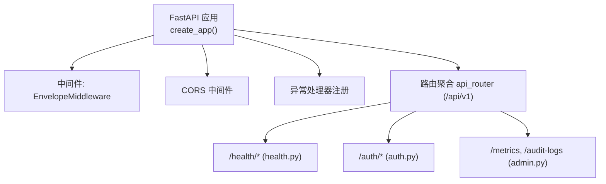
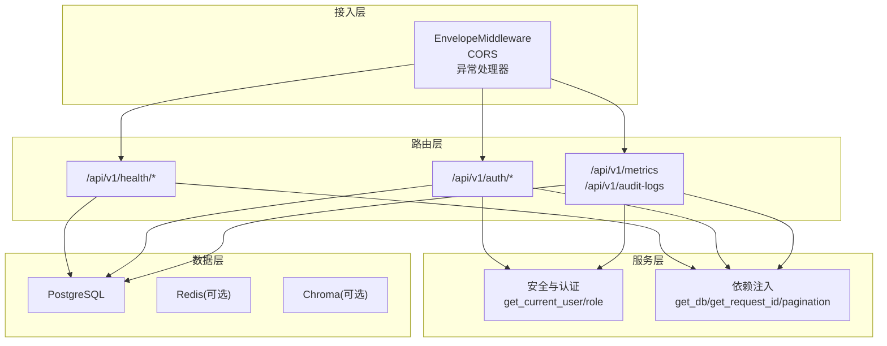
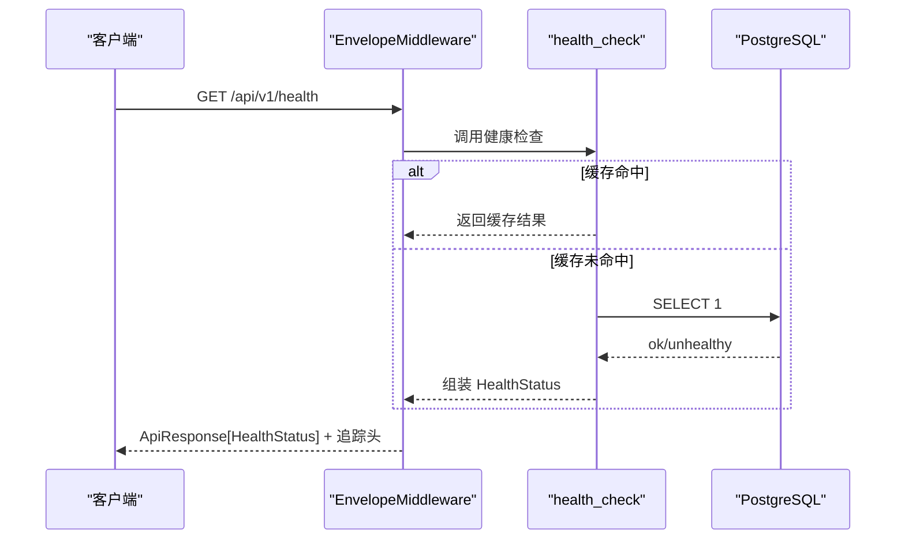
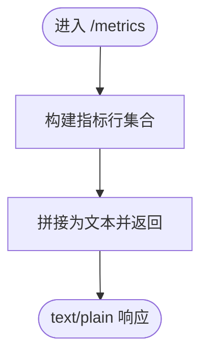
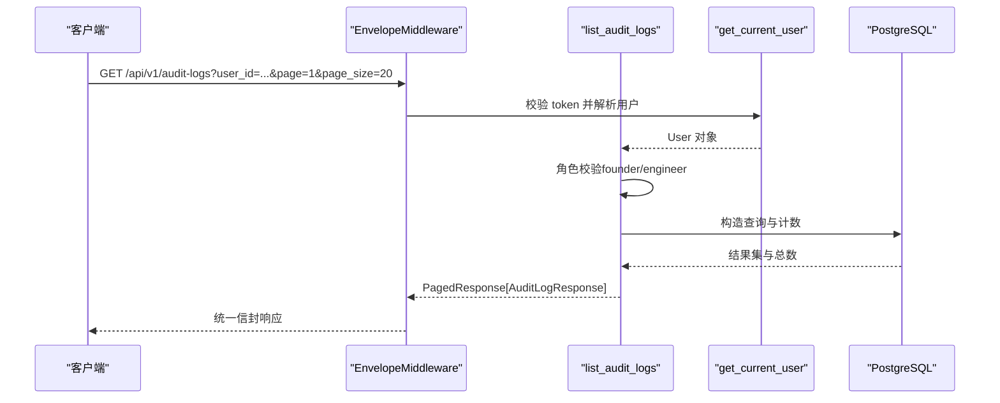
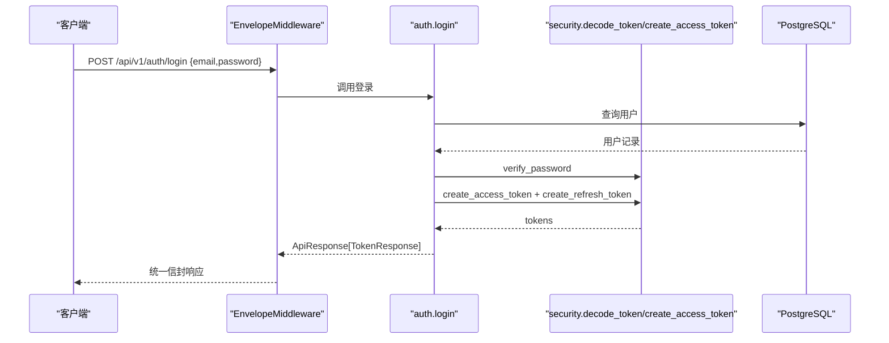
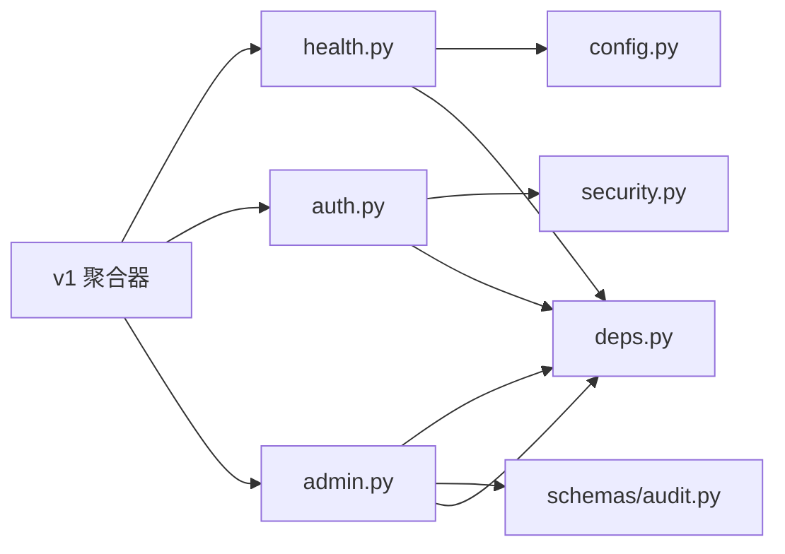

# 系统管理API

<cite>
**本文引用的文件**   
- [backend/app/main.py](file://backend/app/main.py)
- [backend/app/api/v1/__init__.py](file://backend/app/api/v1/__init__.py)
- [backend/app/api/v1/health.py](file://backend/app/api/v1/health.py)
- [backend/app/api/v1/admin.py](file://backend/app/api/v1/admin.py)
- [backend/app/api/v1/auth.py](file://backend/app/api/v1/auth.py)
- [backend/app/core/config.py](file://backend/app/core/config.py)
- [backend/app/core/logging.py](file://backend/app/core/logging.py)
- [backend/app/core/deps.py](file://backend/app/core/deps.py)
- [backend/app/core/security.py](file://backend/app/core/security.py)
- [backend/app/models/user.py](file://backend/app/models/user.py)
- [backend/app/models/audit_log.py](file://backend/app/models/audit_log.py)
- [backend/app/schemas/common.py](file://backend/app/schemas/common.py)
- [backend/app/schemas/audit.py](file://backend/app/schemas/audit.py)
</cite>

## 目录
1. [简介](#简介)
2. [项目结构](#项目结构)
3. [核心组件](#核心组件)
4. [架构总览](#架构总览)
5. [详细组件分析](#详细组件分析)
6. [依赖关系分析](#依赖关系分析)
7. [性能考虑](#性能考虑)
8. [故障排查指南](#故障排查指南)
9. [结论](#结论)
10. [附录：运维接口清单](#附录运维接口清单)

## 简介
本文件为“系统管理API”的权威文档，聚焦于健康检查、系统监控、管理员操作、配置管理、日志查看等运维相关能力。内容覆盖：
- 系统状态监控与依赖健康度
- 性能指标收集（Prometheus 格式）
- 审计日志查询与合规追溯
- 用户管理与权限控制（登录、刷新令牌、当前用户信息）
- 统一响应信封与请求追踪
- 安全与认证机制（JWT、角色守卫）
- 日志输出策略与轮转归档
- 配置加载与环境变量管理

## 项目结构
后端采用 FastAPI 应用工厂模式，集中注册中间件、异常处理器与路由；v1 API 通过聚合器挂载到 /api/v1 前缀下。关键入口与组织方式如下：
- 应用工厂与中间件：创建 FastAPI 实例、注入 CORS、统一信封中间件、异常处理器
- v1 路由聚合：将 health、auth、admin 等子模块按前缀挂载
- 核心支撑：配置、依赖注入、安全、模型与 Schema

图表来源
- [backend/app/main.py:187-248](file://backend/app/main.py#L187-L248)
- [backend/app/api/v1/__init__.py:24-38](file://backend/app/api/v1/__init__.py#L24-L38)

章节来源
- [backend/app/main.py:187-248](file://backend/app/main.py#L187-L248)
- [backend/app/api/v1/__init__.py:24-38](file://backend/app/api/v1/__init__.py#L24-L38)

## 核心组件
- 健康检查与健康缓存：提供无鉴权的健康端点，内置短 TTL 内存缓存以降低数据库压力
- Prometheus 指标端点：返回文本格式的指标定义（可扩展为真实采集）
- 审计日志查询：支持多条件过滤与分页，仅允许特定角色访问
- 认证与授权：登录、刷新令牌、获取当前用户；基于 JWT 的角色守卫
- 统一响应信封与请求追踪：所有响应包含 meta，自动注入 request_id 与耗时
- 配置与环境：集中式 Settings，环境变量优先级明确，属性派生（如 CORS 列表）
- 日志体系：结构化 JSON（生产）或彩色控制台（开发），文件轮转与错误独立归档

章节来源
- [backend/app/api/v1/health.py:53-102](file://backend/app/api/v1/health.py#L53-L102)
- [backend/app/api/v1/admin.py:28-50](file://backend/app/api/v1/admin.py#L28-L50)
- [backend/app/api/v1/admin.py:53-124](file://backend/app/api/v1/admin.py#L53-L124)
- [backend/app/api/v1/auth.py:41-147](file://backend/app/api/v1/auth.py#L41-L147)
- [backend/app/core/deps.py:91-129](file://backend/app/core/deps.py#L91-L129)
- [backend/app/core/config.py:21-144](file://backend/app/core/config.py#L21-L144)
- [backend/app/core/logging.py:20-74](file://backend/app/core/logging.py#L20-L74)
- [backend/app/schemas/common.py:63-100](file://backend/app/schemas/common.py#L63-L100)

## 架构总览
系统管理面由以下层次构成：
- 接入层：FastAPI 应用 + 中间件（信封、CORS、异常处理）
- 路由层：/api/v1 下的 health、auth、admin 等子路由
- 服务层：业务逻辑与外部依赖交互（数据库、缓存、对象存储等）
- 数据层：PostgreSQL（ORM）、可选 Redis、Chroma 向量库
- 可观测性：统一日志（loguru）、请求追踪、Prometheus 指标出口

图表来源
- [backend/app/main.py:187-248](file://backend/app/main.py#L187-L248)
- [backend/app/api/v1/__init__.py:24-38](file://backend/app/api/v1/__init__.py#L24-L38)
- [backend/app/core/deps.py:91-129](file://backend/app/core/deps.py#L91-L129)
- [backend/app/core/security.py:155-211](file://backend/app/core/security.py#L155-L211)

## 详细组件分析

### 健康检查（Health Check）
- 端点：GET /api/v1/health
- 鉴权：无需认证
- 功能：
  - 检查 PostgreSQL 连通性
  - 检测 Redis、Chroma 是否可用或未配置
  - 整体状态 healthy/degraded/unhealthy
  - 返回版本信息与依赖状态
  - 使用 5 秒内存缓存降低数据库压力
- 响应：统一 ApiResponse[HealthStatus]

图表来源
- [backend/app/api/v1/health.py:53-102](file://backend/app/api/v1/health.py#L53-L102)
- [backend/app/main.py:187-248](file://backend/app/main.py#L187-L248)

章节来源
- [backend/app/api/v1/health.py:27-102](file://backend/app/api/v1/health.py#L27-L102)
- [backend/app/schemas/common.py:91-100](file://backend/app/schemas/common.py#L91-L100)

### 系统监控（Prometheus 指标）
- 端点：GET /api/v1/metrics
- 鉴权：无需认证
- 功能：
  - 返回 text/plain 格式的 Prometheus 指标定义
  - 示例指标：HTTP 请求总数、请求耗时、LLM 累计成本、错误总数
  - 生产环境建议接入 prometheus_client 或 OpenTelemetry exporter 实现真实采集
- 响应：纯文本

图表来源
- [backend/app/api/v1/admin.py:28-50](file://backend/app/api/v1/admin.py#L28-L50)

章节来源
- [backend/app/api/v1/admin.py:28-50](file://backend/app/api/v1/admin.py#L28-L50)

### 审计日志查询（Audit Logs）
- 端点：GET /api/v1/audit-logs
- 鉴权：需要有效 access token，且角色为 founder 或 engineer
- 功能：
  - 支持按 user_id、action、resource_type、时间范围过滤
  - 分页返回审计记录
  - 不可篡改（append-only），数据库层保护
- 响应：PagedResponse[AuditLogResponse]

图表来源
- [backend/app/api/v1/admin.py:53-124](file://backend/app/api/v1/admin.py#L53-L124)
- [backend/app/core/deps.py:101-129](file://backend/app/core/deps.py#L101-L129)
- [backend/app/models/audit_log.py:15-45](file://backend/app/models/audit_log.py#L15-L45)

章节来源
- [backend/app/api/v1/admin.py:53-124](file://backend/app/api/v1/admin.py#L53-L124)
- [backend/app/schemas/audit.py:14-39](file://backend/app/schemas/audit.py#L14-39)
- [backend/app/models/audit_log.py:15-45](file://backend/app/models/audit_log.py#L15-L45)

### 用户管理与认证（Auth）
- 端点：
  - POST /api/v1/auth/register
  - POST /api/v1/auth/login
  - POST /api/v1/auth/refresh
  - GET /api/v1/auth/me
- 鉴权：
  - register：首位 founder 开放注册，后续需带 token（由外层守卫控制）
  - login/refresh/me：需要有效 access token（me 强制要求）
- 功能：
  - 密码 bcrypt 哈希与校验
  - JWT access/refresh token 签发与校验
  - 获取当前用户信息
- 响应：统一 ApiResponse

图表来源
- [backend/app/api/v1/auth.py:70-101](file://backend/app/api/v1/auth.py#L70-L101)
- [backend/app/core/security.py:96-122](file://backend/app/core/security.py#L96-L122)
- [backend/app/core/security.py:125-149](file://backend/app/core/security.py#L125-L149)

章节来源
- [backend/app/api/v1/auth.py:41-147](file://backend/app/api/v1/auth.py#L41-L147)
- [backend/app/core/security.py:29-149](file://backend/app/core/security.py#L29-L149)
- [backend/app/models/user.py:14-36](file://backend/app/models/user.py#L14-36)

### 配置管理（Settings）
- 配置来源：环境变量 > .env 文件 > 代码默认值
- 主要类别：
  - 应用：名称、版本、环境、调试、主机端口、日志级别
  - 数据库：连接串、SQL 回显
  - Redis：连接 URL
  - 对象存储：MinIO/S3 兼容参数
  - 向量库：Chroma 持久化目录
  - LLM：OpenAI/Anthropic/NVIDIA NIM 密钥与模型选择
  - 外部知识库：MyGene/MyVariant/ChEMBL/PubMed/ClinicalTrials
  - NCBI：邮箱
  - 认证：JWT 密钥、算法、过期时间
  - CORS：允许的源列表
  - 联邦学习：Flower 服务器地址与轮次
  - PySyft：域名与端口
  - CDISC：SDTM 输出目录与工具路径
  - 干湿闭环：LIMS API 地址与令牌
  - 数据处理：Scanpy/Dask 并行与仪表盘地址
  - 数据目录：原始与处理后数据目录
- 特性：
  - pydantic-settings 自动类型校验与默认值填充
  - 派生属性：cors_origin_list、is_production
  - lru_cache 单例 get_settings()

章节来源
- [backend/app/core/config.py:21-144](file://backend/app/core/config.py#L21-L144)

### 日志查看与输出（Logging）
- 输出策略：
  - 生产环境：JSON 结构化输出至 stdout
  - 开发环境：彩色控制台输出，含回溯与诊断信息
  - 文件输出：按日期滚动，大小限制与保留期
  - 错误日志：单独归档，更长保留期
- 上下文绑定：支持绑定 module、request_id、user_id 等上下文字段
- 启动初始化：在应用工厂中优先执行 setup_logging()

章节来源
- [backend/app/core/logging.py:20-74](file://backend/app/core/logging.py#L20-L74)
- [backend/app/main.py:187-206](file://backend/app/main.py#L187-L206)

### 统一响应信封与请求追踪
- 信封结构：ApiResponse[T] 包含 success、data、meta
- 元数据：
  - request_id：来自请求头 X-Request-ID 或自动生成
  - duration_ms：服务端处理耗时（毫秒）
- 中间件行为：
  - 注入 X-Request-ID、X-Response-Time-ms
  - 对 200 且 application/json 且含 meta 的响应体注入 duration_ms
  - 流式响应不重写，保持透传
  - 更新 content-length 避免截断

章节来源
- [backend/app/main.py:29-185](file://backend/app/main.py#L29-L185)
- [backend/app/schemas/common.py:44-89](file://backend/app/schemas/common.py#L44-89)
- [backend/app/core/deps.py:91-99](file://backend/app/core/deps.py#L91-99)

## 依赖关系分析
- 路由与模块耦合：
  - v1 聚合器将 health、auth、admin 等子路由挂载到 /api/v1
  - admin 依赖 deps（get_current_user、get_pagination、get_request_id、get_db）
  - auth 依赖 security（token 生成/校验、密码哈希）
- 外部依赖：
  - PostgreSQL（异步会话）
  - Redis（可选）
  - Chroma（可选）
- 安全与权限：
  - JWT access/refresh token
  - 角色守卫 require_roles（可用于扩展更多受保护接口）

图表来源
- [backend/app/api/v1/__init__.py:24-38](file://backend/app/api/v1/__init__.py#L24-L38)
- [backend/app/api/v1/admin.py:53-124](file://backend/app/api/v1/admin.py#L53-L124)
- [backend/app/api/v1/auth.py:41-147](file://backend/app/api/v1/auth.py#L41-L147)
- [backend/app/api/v1/health.py:53-102](file://backend/app/api/v1/health.py#L53-L102)

章节来源
- [backend/app/api/v1/__init__.py:24-38](file://backend/app/api/v1/__init__.py#L24-L38)

## 性能考虑
- 健康检查缓存：5 秒 TTL 减少高频健康查询对数据库的压力
- 用户对象缓存：10 秒 TTL 的内存缓存，降低重复鉴权时的数据库查询
- 中间件开销：统一信封中间件会缓冲非流式响应以注入元数据，注意大响应体的内存占用
- 日志轮转：按大小与时间轮转，避免磁盘膨胀；错误日志独立归档便于快速定位
- 指标采集：当前为占位实现，生产建议接入 prometheus_client/OpenTelemetry，避免阻塞主线程

章节来源
- [backend/app/api/v1/health.py:22-24](file://backend/app/api/v1/health.py#L22-L24)
- [backend/app/core/deps.py:26-40](file://backend/app/core/deps.py#L26-L40)
- [backend/app/main.py:29-185](file://backend/app/main.py#L29-L185)
- [backend/app/core/logging.py:54-74](file://backend/app/core/logging.py#L54-L74)
- [backend/app/api/v1/admin.py:28-50](file://backend/app/api/v1/admin.py#L28-L50)

## 故障排查指南
- 健康检查失败：
  - 检查 PostgreSQL 连接串与网络可达性
  - 确认 Redis/Chroma 是否安装与配置
  - 关注整体状态 degraded 时具体依赖项
- 认证失败：
  - 检查 Authorization header 是否携带有效的 access token
  - 校验 JWT 密钥与算法配置
  - 确认用户未被禁用
- 审计日志无数据：
  - 确认角色是否为 founder/engineer
  - 检查过滤参数（user_id、action、resource_type、时间范围）
  - 验证分页参数是否合理
- 日志问题：
  - 生产环境请确保 stdout 被正确收集
  - 检查 logs 目录权限与磁盘空间
  - 关注 error_*.log 中的错误堆栈

章节来源
- [backend/app/api/v1/health.py:27-102](file://backend/app/api/v1/health.py#L27-L102)
- [backend/app/core/security.py:155-211](file://backend/app/core/security.py#L155-L211)
- [backend/app/api/v1/admin.py:53-124](file://backend/app/api/v1/admin.py#L53-L124)
- [backend/app/core/logging.py:20-74](file://backend/app/core/logging.py#L20-L74)

## 结论
系统管理 API 提供了完善的运维能力：健康检查、指标导出、审计日志、用户认证与权限控制、统一响应信封与请求追踪、结构化日志与配置管理。建议在生产环境中完善指标采集、强化审计写入、启用更严格的角色守卫，并结合容器编排与可观测性平台进行集中监控与告警。

## 附录：运维接口清单
- 健康检查
  - GET /api/v1/health
  - 鉴权：否
  - 说明：返回服务状态、版本与依赖健康度
- 系统监控
  - GET /api/v1/metrics
  - 鉴权：否
  - 说明：Prometheus 格式指标（当前为定义占位）
- 审计日志
  - GET /api/v1/audit-logs
  - 鉴权：是（founder/engineer）
  - 说明：支持多条件过滤与分页
- 用户管理
  - POST /api/v1/auth/register
  - 鉴权：首位 founder 开放，后续需 token
  - 说明：注册用户
  - POST /api/v1/auth/login
  - 鉴权：否
  - 说明：登录获取 access/refresh token
  - POST /api/v1/auth/refresh
  - 鉴权：否
  - 说明：使用 refresh token 换取新的 access token
  - GET /api/v1/auth/me
  - 鉴权：是（access token）
  - 说明：获取当前用户信息

章节来源
- [backend/app/api/v1/health.py:53-102](file://backend/app/api/v1/health.py#L53-L102)
- [backend/app/api/v1/admin.py:28-50](file://backend/app/api/v1/admin.py#L28-L50)
- [backend/app/api/v1/admin.py:53-124](file://backend/app/api/v1/admin.py#L53-L124)
- [backend/app/api/v1/auth.py:41-147](file://backend/app/api/v1/auth.py#L41-L147)