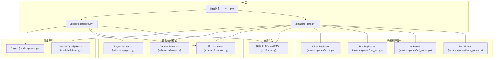
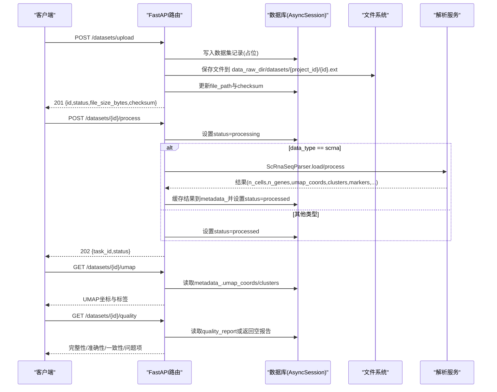
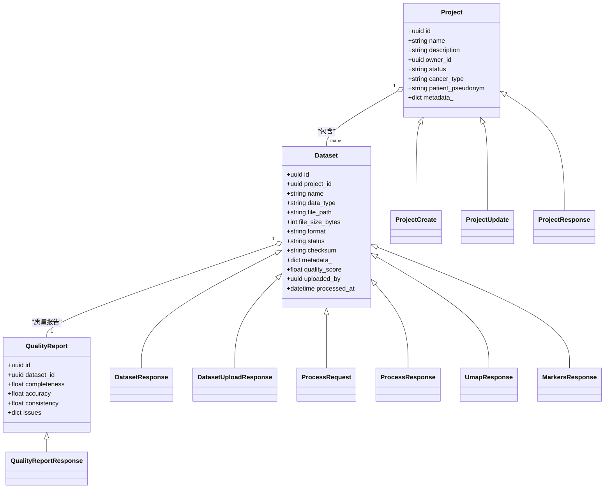
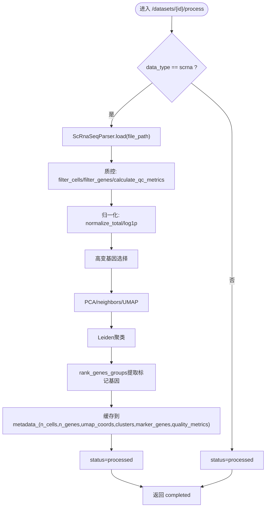
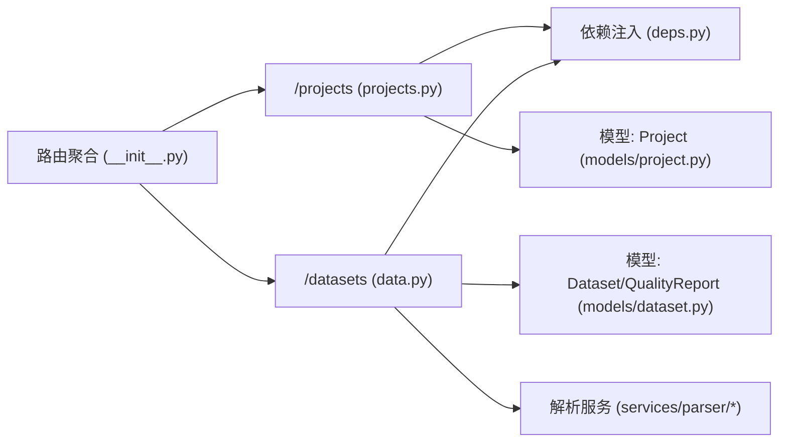

# 项目与数据管理API

<cite>
**本文引用的文件**   
- [projects.py](file://precision-drug-design/backend/app/api/v1/projects.py)
- [data.py](file://precision-drug-design/backend/app/api/v1/data.py)
- [project.py](file://precision-drug-design/backend/app/models/project.py)
- [dataset.py](file://precision-drug-design/backend/app/models/dataset.py)
- [project.py](file://precision-drug-design/backend/app/schemas/project.py)
- [dataset.py](file://precision-drug-design/backend/app/schemas/dataset.py)
- [common.py](file://precision-drug-design/backend/app/schemas/common.py)
- [deps.py](file://precision-drug-design/backend/app/core/deps.py)
- [__init__.py](file://precision-drug-design/backend/app/api/v1/__init__.py)
- [scrna.py](file://precision-drug-design/backend/app/services/parser/scrna.py)
- [rna_seq.py](file://precision-drug-design/backend/app/services/parser/rna_seq.py)
- [vcf_parser.py](file://precision-drug-design/backend/app/services/parser/vcf_parser.py)
- [fasta_parser.py](file://precision-drug-design/backend/app/services/parser/fasta_parser.py)
</cite>

## 目录
1. [简介](#简介)
2. [项目结构](#项目结构)
3. [核心组件](#核心组件)
4. [架构总览](#架构总览)
5. [详细组件分析](#详细组件分析)
6. [依赖关系分析](#依赖关系分析)
7. [性能考虑](#性能考虑)
8. [故障排查指南](#故障排查指南)
9. [结论](#结论)
10. [附录](#附录)

## 简介
本文件为“项目与数据管理”模块的完整API文档，覆盖：
- 项目管理：创建、查询、更新、软删除；权限控制（基于用户角色与所有者）
- 数据集管理：上传、列表、详情、处理触发、UMAP坐标、标记基因、质量报告、删除
- 多组学数据格式支持：RNA-seq、scRNA-seq、VCF、FASTA
- 数据验证规则：数据类型、状态枚举、扩展名白名单
- 批量操作接口：分页查询、按条件过滤
- 文件上传下载：上传端点、校验和计算、保存路径策略
- 进度跟踪与错误恢复：任务ID返回、状态机、异常降级
- 数据导入导出示例与脚本建议、性能优化建议

## 项目结构
后端采用FastAPI + SQLAlchemy异步会话。路由集中在v1下，模型与Schema分离，解析器位于services.parser子包。

图表来源
- [__init__.py:1-41](file://precision-drug-design/backend/app/api/v1/__init__.py#L1-L41)
- [projects.py:1-169](file://precision-drug-design/backend/app/api/v1/projects.py#L1-L169)
- [data.py:1-369](file://precision-drug-design/backend/app/api/v1/data.py#L1-L369)
- [project.py:1-42](file://precision-drug-design/backend/app/models/project.py#L1-L42)
- [dataset.py:1-70](file://precision-drug-design/backend/app/models/dataset.py#L1-L70)
- [project.py:1-55](file://precision-drug-design/backend/app/schemas/project.py#L1-L55)
- [dataset.py:1-147](file://precision-drug-design/backend/app/schemas/dataset.py#L1-L147)
- [common.py:1-158](file://precision-drug-design/backend/app/schemas/common.py#L1-L158)
- [deps.py:1-129](file://precision-drug-design/backend/app/core/deps.py#L1-L129)
- [scrna.py:1-160](file://precision-drug-design/backend/app/services/parser/scrna.py#L1-L160)
- [rna_seq.py:1-106](file://precision-drug-design/backend/app/services/parser/rna_seq.py#L1-L106)
- [vcf_parser.py:1-136](file://precision-drug-design/backend/app/services/parser/vcf_parser.py#L1-L136)
- [fasta_parser.py:1-100](file://precision-drug-design/backend/app/services/parser/fasta_parser.py#L1-L100)

章节来源
- [__init__.py:1-41](file://precision-drug-design/backend/app/api/v1/__init__.py#L1-L41)

## 核心组件
- 项目CRUD与权限控制：通过依赖注入获取当前用户，非founder仅能访问自己拥有的项目；提供软删除（status=archived）。
- 数据集上传与处理：支持多种数据类型的表单上传，计算文件大小与校验和；对scRNA-seq调用Scanpy流程进行质控、降维、聚类与标记基因提取；其他类型直接标记为已处理。
- 可视化与质量：提供UMAP坐标、差异表达基因、质量报告读取接口。
- 统一响应信封与分页：所有响应使用ApiResponse/PagedResponse，包含request_id等元信息。

章节来源
- [projects.py:32-169](file://precision-drug-design/backend/app/api/v1/projects.py#L32-L169)
- [data.py:54-369](file://precision-drug-design/backend/app/api/v1/data.py#L54-L369)
- [common.py:63-89](file://precision-drug-design/backend/app/schemas/common.py#L63-L89)

## 架构总览
下图展示了从HTTP请求到数据库与文件系统的端到端流程，以及关键的数据处理服务。

图表来源
- [data.py:54-121](file://precision-drug-design/backend/app/api/v1/data.py#L54-L121)
- [data.py:191-254](file://precision-drug-design/backend/app/api/v1/data.py#L191-L254)
- [data.py:257-340](file://precision-drug-design/backend/app/api/v1/data.py#L257-L340)
- [scrna.py:38-160](file://precision-drug-design/backend/app/services/parser/scrna.py#L38-L160)

## 详细组件分析

### 项目管理API
- 列出项目
  - 方法/路径: GET /projects
  - 认证: 需要有效token，非founder仅返回其own的项目
  - 查询参数: status(可选), page/page_size(分页)
  - 响应: PagedResponse[ProjectResponse]
- 创建项目
  - 方法/路径: POST /projects
  - 请求体: ProjectCreate(name, description, cancer_type, patient_pseudonym, metadata)
  - 响应: ApiResponse[ProjectResponse], 201
- 获取项目
  - 方法/路径: GET /projects/{project_id}
  - 权限: founder可访问全部，否则需owner匹配
  - 响应: ApiResponse[ProjectResponse]
- 更新项目
  - 方法/路径: PATCH /projects/{project_id}
  - 请求体: ProjectUpdate(字段可选)
  - 响应: ApiResponse[ProjectResponse]
- 软删除项目
  - 方法/路径: DELETE /projects/{project_id}
  - 行为: 将status置为archived
  - 响应: ApiResponse[ProjectResponse]

权限控制要点
- 通过依赖注入获取当前用户对象，结合项目owner_id判断是否允许访问。
- founder角色拥有全局可见性。

章节来源
- [projects.py:47-84](file://precision-drug-design/backend/app/api/v1/projects.py#L47-L84)
- [projects.py:87-110](file://precision-drug-design/backend/app/api/v1/projects.py#L87-L110)
- [projects.py:113-125](file://precision-drug-design/backend/app/api/v1/projects.py#L113-L125)
- [projects.py:128-150](file://precision-drug-design/backend/app/api/v1/projects.py#L128-L150)
- [projects.py:153-169](file://precision-drug-design/backend/app/api/v1/projects.py#L153-L169)
- [project.py:14-42](file://precision-drug-design/backend/app/models/project.py#L14-L42)
- [project.py:13-55](file://precision-drug-design/backend/app/schemas/project.py#L13-L55)
- [common.py:150-151](file://precision-drug-design/backend/app/schemas/common.py#L150-L151)

### 数据集管理API
- 上传数据集
  - 方法/路径: POST /datasets/upload
  - 表单字段: file, project_id, name, data_type, metadata(可选JSON字符串)
  - 校验: data_type必须在白名单；文件扩展名在白名单内
  - 行为: 计算文件大小与sha256校验和；保存到data_raw_dir/datasets/{project_id}/{id}.{ext}
  - 响应: ApiResponse[DatasetUploadResponse], 201
- 列出数据集
  - 方法/路径: GET /datasets
  - 查询参数: project_id, data_type, status, page/page_size
  - 响应: PagedResponse[DatasetResponse]
- 获取数据集详情
  - 方法/路径: GET /datasets/{dataset_id}
  - 响应: ApiResponse[DatasetResponse]
- 触发数据处理
  - 方法/路径: POST /datasets/{dataset_id}/process
  - 请求体: ProcessRequest(pipeline, params)
  - 行为: 
    - scrna: 调用ScRnaSeqParser.load/process，缓存n_cells/n_genes/umap_coords/clusters/marker_genes/quality_metrics到metadata_，status=processed
    - 其他类型: 直接status=processed
  - 响应: ApiResponse[ProcessResponse], 202
- 获取UMAP坐标
  - 方法/路径: GET /datasets/{dataset_id}/umap
  - 响应: ApiResponse[UmapResponse]
- 获取标记基因
  - 方法/路径: GET /datasets/{dataset_id}/markers
  - 响应: ApiResponse[MarkersResponse]
- 获取质量报告
  - 方法/路径: GET /datasets/{dataset_id}/quality
  - 响应: ApiResponse[QualityReportResponse]
- 删除数据集
  - 方法/路径: DELETE /datasets/{dataset_id}
  - 行为: 删除物理文件后删除数据库记录
  - 响应: ApiResponse[dict]

章节来源
- [data.py:54-121](file://precision-drug-design/backend/app/api/v1/data.py#L54-L121)
- [data.py:124-171](file://precision-drug-design/backend/app/api/v1/data.py#L124-L171)
- [data.py:174-188](file://precision-drug-design/backend/app/api/v1/data.py#L174-L188)
- [data.py:191-254](file://precision-drug-design/backend/app/api/v1/data.py#L191-L254)
- [data.py:257-281](file://precision-drug-design/backend/app/api/v1/data.py#L257-L281)
- [data.py:284-306](file://precision-drug-design/backend/app/api/v1/data.py#L284-L306)
- [data.py:309-340](file://precision-drug-design/backend/app/api/v1/data.py#L309-L340)
- [data.py:343-369](file://precision-drug-design/backend/app/api/v1/data.py#L343-L369)
- [dataset.py:15-70](file://precision-drug-design/backend/app/models/dataset.py#L15-L70)
- [dataset.py:20-147](file://precision-drug-design/backend/app/schemas/dataset.py#L20-L147)
- [common.py:142-148](file://precision-drug-design/backend/app/schemas/common.py#L142-L148)

### 多组学数据解析服务
- scRNA-seq解析器
  - 支持: 10x MTX/HDF5/CSV
  - 流程: 加载 → 质控 → 归一化 → 高变基因选择 → PCA/UMAP → Leiden聚类 → 标记基因
  - 输出: n_cells_after_qc, n_genes_after_qc, n_clusters, umap_coords, clusters, marker_genes, quality_metrics
- RNA-seq解析器
  - 支持: CSV/TSV/GCT
  - 功能: 加载表达矩阵、CPM/TPM归一化、低表达过滤
- VCF解析器
  - 支持: VCF 4.x，优先cyvcf2，未安装时回退纯文本解析
  - 输出: variants预览、样本列表、统计信息
- FASTA解析器
  - 支持: 序列读取与写入，单条或多条记录

章节来源
- [scrna.py:13-160](file://precision-drug-design/backend/app/services/parser/scrna.py#L13-L160)
- [rna_seq.py:15-106](file://precision-drug-design/backend/app/services/parser/rna_seq.py#L15-L106)
- [vcf_parser.py:14-136](file://precision-drug-design/backend/app/services/parser/vcf_parser.py#L14-L136)
- [fasta_parser.py:12-100](file://precision-drug-design/backend/app/services/parser/fasta_parser.py#L12-L100)

### 类图（模型与Schema）

图表来源
- [project.py:14-42](file://precision-drug-design/backend/app/models/project.py#L14-L42)
- [dataset.py:15-70](file://precision-drug-design/backend/app/models/dataset.py#L15-L70)
- [project.py:13-55](file://precision-drug-design/backend/app/schemas/project.py#L13-L55)
- [dataset.py:20-147](file://precision-drug-design/backend/app/schemas/dataset.py#L20-L147)

### 数据处理流程图（scRNA-seq）

图表来源
- [data.py:191-254](file://precision-drug-design/backend/app/api/v1/data.py#L191-L254)
- [scrna.py:75-160](file://precision-drug-design/backend/app/services/parser/scrna.py#L75-L160)

## 依赖关系分析
- 路由聚合
  - v1路由聚合将/projects与/datasets挂载到api_router，供主应用引入。
- 依赖注入
  - get_current_user: 从token解析user_id，带短TTL内存缓存，避免频繁查库
  - get_pagination: 标准化page/page_size，生成offset/limit
  - get_request_id: 追踪请求ID
- 权限控制
  - 项目接口中根据current_user.role是否为founder决定查询范围；否则限制为owner_id=current_user.id

图表来源
- [__init__.py:24-38](file://precision-drug-design/backend/app/api/v1/__init__.py#L24-L38)
- [deps.py:83-129](file://precision-drug-design/backend/app/core/deps.py#L83-L129)
- [projects.py:14-44](file://precision-drug-design/backend/app/api/v1/projects.py#L14-L44)
- [data.py:24-44](file://precision-drug-design/backend/app/api/v1/data.py#L24-L44)

章节来源
- [__init__.py:1-41](file://precision-drug-design/backend/app/api/v1/__init__.py#L1-L41)
- [deps.py:1-129](file://precision-drug-design/backend/app/core/deps.py#L1-L129)

## 性能考虑
- 用户对象缓存：get_current_user使用短TTL内存缓存，减少数据库查询压力。
- 大文件上传：在上传阶段一次性读取内容以计算校验和，注意内存占用；生产环境建议分块上传与流式写入。
- scRNA-seq处理：默认仅返回前100个UMAP坐标用于预览，避免传输过大；可根据前端需求调整。
- 解析器惰性加载：scanpy/pandas/cyvcf2/biopython按需导入，降低启动开销。
- 分页限制：page_size上限100，防止单次返回过多数据。

章节来源
- [deps.py:26-53](file://precision-drug-design/backend/app/core/deps.py#L26-L53)
- [scrna.py:126-127](file://precision-drug-design/backend/app/services/parser/scrna.py#L126-L127)
- [common.py:83-88](file://precision-drug-design/backend/app/core/deps.py#L83-L88)

## 故障排查指南
- 上传失败
  - 检查data_type是否在白名单；检查文件扩展名是否在允许集合；确认data_raw_dir存在且可写。
- 处理失败（scRNA-seq）
  - 若scanpy未安装会抛出运行时异常；代码捕获异常后将status回退为uploaded并返回failed；查看日志定位具体错误。
- 找不到资源
  - 项目或数据集不存在时返回NotFound；确认ID正确且具备访问权限。
- 权限不足
  - 非founder访问他人项目会返回Forbidden；确认当前用户为owner或具有founder角色。
- 质量报告为空
  - 若尚未生成质量报告，GET /datasets/{id}/quality会返回空报告结构；先执行处理流程或补充质量评估逻辑。

章节来源
- [data.py:72-102](file://precision-drug-design/backend/app/api/v1/data.py#L72-L102)
- [data.py:240-247](file://precision-drug-design/backend/app/api/v1/data.py#L240-L247)
- [projects.py:32-44](file://precision-drug-design/backend/app/api/v1/projects.py#L32-L44)
- [data.py:309-340](file://precision-drug-design/backend/app/api/v1/data.py#L309-L340)

## 结论
本项目提供了完善的项目与数据集管理API，涵盖多组学数据的上传、处理与可视化能力。通过统一的响应信封、分页与权限控制，保证了接口的易用性与安全性。针对大数据量场景，提供了缓存与惰性加载等优化手段。后续可扩展更多数据类型的处理流水线与异步任务队列，以提升吞吐与可靠性。

## 附录

### 数据格式支持与验证规则
- 支持的数据类型(data_type)
  - rna_seq, scrna, vcf, fasta, wes, wgs, ihc, proteomics, metabolomics
- 允许的扩展名
  - csv, tsv, txt, vcf, fasta, fa, fna, h5, h5ad, mtx, pdf, png, jpg, jpeg, bam, json, xlsx
- 项目状态
  - active, archived, completed
- 数据集状态
  - uploaded, processing, ready, failed

章节来源
- [common.py:142-151](file://precision-drug-design/backend/app/schemas/common.py#L142-L151)
- [data.py:47-51](file://precision-drug-design/backend/app/api/v1/data.py#L47-L51)

### 批量操作与分页
- 列表接口均支持分页(page/page_size)，并提供按project_id、data_type、status过滤。
- 建议在前端实现批量选择与批量删除（逐个调用DELETE），或在服务端增加批量接口。

章节来源
- [data.py:124-171](file://precision-drug-design/backend/app/api/v1/data.py#L124-L171)
- [projects.py:47-84](file://precision-drug-design/backend/app/api/v1/projects.py#L47-L84)

### 文件上传下载与进度跟踪
- 上传
  - 使用multipart/form-data提交file与元数据；服务端计算sha256并持久化文件路径。
- 下载
  - 当前未提供直接下载端点；可通过file_path在服务端实现受保护的下载接口。
- 进度跟踪
  - 处理接口返回task_id与status；当前为同步处理，可在未来接入Celery/RQ等任务队列以实现真正的异步与进度上报。

章节来源
- [data.py:54-121](file://precision-drug-design/backend/app/api/v1/data.py#L54-L121)
- [data.py:191-254](file://precision-drug-design/backend/app/api/v1/data.py#L191-L254)

### 数据导入导出示例（说明）
- 导入
  - 使用POST /datasets/upload，携带file、project_id、name、data_type；metadata可为JSON字符串。
- 导出
  - 对于scRNA-seq，可使用GET /datasets/{id}/umap与GET /datasets/{id}/markers获取可视化与标记基因；其他类型可按需扩展导出端点。

章节来源
- [data.py:54-121](file://precision-drug-design/backend/app/api/v1/data.py#L54-L121)
- [data.py:257-306](file://precision-drug-design/backend/app/api/v1/data.py#L257-L306)

### 批量处理脚本建议（说明）
- 批量上传
  - 遍历本地目录，构造multipart表单，依次调用上传接口，记录返回的id与checksum。
- 批量处理
  - 对每个数据集调用POST /datasets/{id}/process，收集task_id与status；必要时轮询质量与UMAP接口。
- 错误重试
  - 对网络异常或5xx错误进行指数退避重试；对4xx错误记录并跳过。

章节来源
- [data.py:54-121](file://precision-drug-design/backend/app/api/v1/data.py#L54-L121)
- [data.py:191-254](file://precision-drug-design/backend/app/api/v1/data.py#L191-L254)