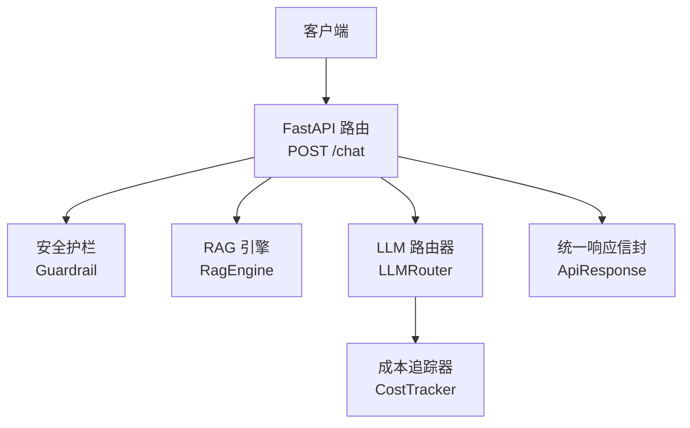
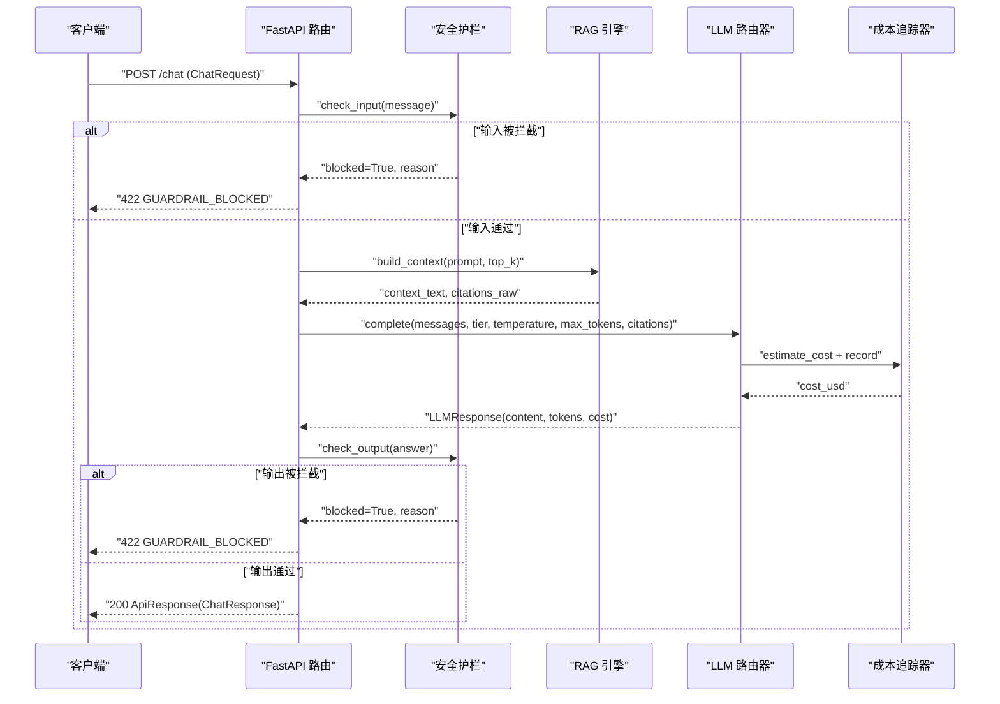
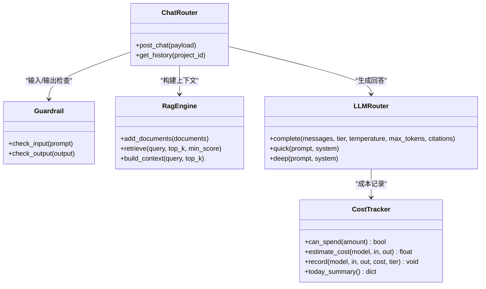

# AI智能问答API

<cite>
**本文引用的文件**   
- [chat.py](file://precision-drug-design/backend/app/api/v1/chat.py)
- [schemas/chat.py](file://precision-drug-design/backend/app/schemas/chat.py)
- [common.py](file://precision-drug-design/backend/app/schemas/common.py)
- [router.py](file://precision-drug-design/backend/app/services/llm/router.py)
- [rag.py](file://precision-drug-design/backend/app/services/llm/rag.py)
- [guardrail.py](file://precision-drug-design/backend/app/services/llm/guardrail.py)
- [cost_tracker.py](file://precision-drug-design/backend/app/services/llm/cost_tracker.py)
- [config.py](file://precision-drug-design/backend/app/core/config.py)
- [exceptions.py](file://precision-drug-design/backend/app/core/exceptions.py)
- [deps.py](file://precision-drug-design/backend/app/core/deps.py)
</cite>

## 目录
1. [简介](#简介)
2. [项目结构](#项目结构)
3. [核心组件](#核心组件)
4. [架构总览](#架构总览)
5. [详细组件分析](#详细组件分析)
6. [依赖关系分析](#依赖关系分析)
7. [性能与成本](#性能与成本)
8. [错误处理与降级](#错误处理与降级)
9. [调用示例与集成指南](#调用示例与集成指南)
10. [结论](#结论)

## 简介
本文件为AI智能问答系统的API文档，聚焦自然语言问答接口POST /chat。该端点实现“输入安全检查→RAG检索增强→LLM回答生成→输出安全验证”的完整流程，支持多模型路由、证据分级标注、引用格式规范、成本追踪与令牌统计，并提供异常与降级策略说明。

## 项目结构
围绕问答能力的相关代码分布在以下模块：
- API层：FastAPI路由定义请求/响应契约与编排流程
- Schemas：Pydantic数据模型，统一信封与枚举
- LLM服务：路由器（多模型）、RAG引擎（向量检索）、护栏（输入/输出校验）
- 成本追踪：按模型与层级累计费用、预算控制
- 配置与安全：环境变量加载、全局异常处理器、依赖注入

图表来源
- [chat.py:30-157](file://precision-drug-design/backend/app/api/v1/chat.py#L30-L157)
- [guardrail.py:58-145](file://precision-drug-design/backend/app/services/llm/guardrail.py#L58-L145)
- [rag.py:35-238](file://precision-drug-design/backend/app/services/llm/rag.py#L35-L238)
- [router.py:55-171](file://precision-drug-design/backend/app/services/llm/router.py#L55-L171)
- [cost_tracker.py:27-167](file://precision-drug-design/backend/app/services/llm/cost_tracker.py#L27-L167)
- [common.py:63-89](file://precision-drug-design/backend/app/schemas/common.py#L63-L89)

章节来源
- [chat.py:1-177](file://precision-drug-design/backend/app/api/v1/chat.py#L1-L177)
- [schemas/chat.py:1-81](file://precision-drug-design/backend/app/schemas/chat.py#L1-L81)
- [common.py:1-158](file://precision-drug-design/backend/app/schemas/common.py#L1-L158)

## 核心组件
- POST /chat 路由：编排输入护栏、RAG上下文构建、LLM生成、输出护栏、返回结果；在LLM不可用时降级返回RAG摘要。
- 安全护栏：拦截违规提示词、非医学话题、PII脱敏；对输出进行二次检查。
- RAG引擎：基于Chroma向量库或内存关键词检索，返回top-k相关片段及引用元信息。
- LLM路由器：根据quick/deep层级选择模型，记录token用量与估算费用，支持预算上限控制。
- 成本追踪：按模型与层级累计费用，提供今日汇总与剩余预算查询。
- 统一响应信封：所有成功响应使用 ApiResponse[T]，错误响应通过全局异常处理器转换为统一格式。

章节来源
- [chat.py:30-157](file://precision-drug-design/backend/app/api/v1/chat.py#L30-L157)
- [guardrail.py:58-145](file://precision-drug-design/backend/app/services/llm/guardrail.py#L58-L145)
- [rag.py:35-238](file://precision-drug-design/backend/app/services/llm/rag.py#L35-L238)
- [router.py:55-171](file://precision-drug-design/backend/app/services/llm/router.py#L55-L171)
- [cost_tracker.py:27-167](file://precision-drug-design/backend/app/services/llm/cost_tracker.py#L27-L167)
- [common.py:63-89](file://precision-drug-design/backend/app/schemas/common.py#L63-L89)

## 架构总览
下图展示了POST /chat从接收到响应的端到端流程，包括护栏、RAG、LLM路由与成本追踪的交互。

图表来源
- [chat.py:30-157](file://precision-drug-design/backend/app/api/v1/chat.py#L30-L157)
- [guardrail.py:70-145](file://precision-drug-design/backend/app/services/llm/guardrail.py#L70-L145)
- [rag.py:211-238](file://precision-drug-design/backend/app/services/llm/rag.py#L211-L238)
- [router.py:92-171](file://precision-drug-design/backend/app/services/llm/router.py#L92-L171)
- [cost_tracker.py:80-141](file://precision-drug-design/backend/app/services/llm/cost_tracker.py#L80-L141)

## 详细组件分析

### 端点：POST /chat
- 功能：接收自然语言问题，执行输入护栏→RAG检索→LLM生成→输出护栏→返回结构化答案与引用。
- 参数：
  - project_id: UUID，用于业务归属
  - message: 用户问题（长度限制）
  - analysis_tier: quick 或 deep，影响RAG top_k与LLM max_tokens
  - context_dataset_ids: 可选，限定上下文数据集范围（当前未参与检索逻辑）
- 返回：
  - answer: 文本答案
  - citations: 引用列表（type/id/url/title）
  - evidence_level: 证据等级（I/II/III/IV），由上层策略决定
  - cost_usd/tokens_in/tokens_out: 成本与令牌统计
  - guardrail_triggered/guardrail_rule: 是否触发护栏及规则
  - generated_code: 深度分析时可能生成的代码（可选）
- 降级：当LLM调用失败时，返回RAG检索结果摘要并标记degraded。

章节来源
- [chat.py:30-157](file://precision-drug-design/backend/app/api/v1/chat.py#L30-L157)
- [schemas/chat.py:22-59](file://precision-drug-design/backend/app/schemas/chat.py#L22-L59)
- [common.py:63-89](file://precision-drug-design/backend/app/schemas/common.py#L63-L89)

### 安全护栏：Guardrail
- 输入检查：
  - 拦截模式：剂量处方、绝对化承诺、提示词注入、角色扮演等
  - 离题检测：非医学/药物相关问题
  - 警告模式：涉及敏感术语（如孕妇/儿童禁用等）
  - PII脱敏：手机号、身份证号、邮箱替换为占位符
- 输出检查：
  - 复用拦截模式
  - 额外检测具体剂量建议并给出警告
- 返回：
  - blocked/reason/warnings/sanitized_prompt

章节来源
- [guardrail.py:58-145](file://precision-drug-design/backend/app/services/llm/guardrail.py#L58-L145)

### RAG引擎：RagEngine
- 初始化：可指定持久化目录、集合名、嵌入模型；默认使用Chroma。
- 文档入库：add_documents将content/source写入Chroma，同时同步到内存作为降级备份。
- 检索：
  - 优先Chroma向量检索（cosine相似度），过滤min_score阈值
  - 降级为内存Jaccard关键词检索
- 上下文构建：
  - build_context返回格式化上下文文本与citations_raw（含source与score）
- 复杂度：
  - Chroma检索近似O(k log n)，k为top_k
  - 内存检索O(n)，n为内存文档数

章节来源
- [rag.py:35-238](file://precision-drug-design/backend/app/services/llm/rag.py#L35-L238)

### LLM路由器：LLMRouter
- 层级与模型映射：
  - quick：gpt-4o-mini / claude-3-5-haiku-latest
  - deep：gpt-4o / claude-3-5-sonnet-latest
- 预算控制：
  - 根据tier选择预算上限，调用前检查can_spend
- 调用流程：
  - complete组装messages，调用LiteLLM异步接口
  - 解析usage，估算cost_usd，记录到CostTracker
- 便捷方法：quick/deep封装system+user消息

章节来源
- [router.py:18-171](file://precision-drug-design/backend/app/services/llm/router.py#L18-L171)
- [config.py:54-60](file://precision-drug-design/backend/app/core/config.py#L54-L60)

### 成本追踪器：CostTracker
- 定价表：内置常见模型input/output单价（USD per 1K tokens）
- 预算控制：
  - can_spend(amount)：判断是否超支
  - daily_budget：单日预算上限
- 记录与汇总：
  - record(model, prompt_tokens, completion_tokens, cost_usd, tier)
  - today_summary()：返回总花费、剩余预算、按模型/层级分解、调用次数

章节来源
- [cost_tracker.py:17-167](file://precision-drug-design/backend/app/services/llm/cost_tracker.py#L17-L167)

### 数据模型与统一信封
- ChatRequest/ChatResponse/Citation：定义问答请求与响应结构，包含字段校验与枚举约束。
- ApiResponse[PagedResponse/ErrorResponse]：统一成功/分页/错误响应信封。
- 枚举：
  - ALLOWED_ANALYSIS_TIERS = {"quick", "deep"}
  - ALLOWED_EVIDENCE_LEVELS = {"I", "II", "III", "IV"}

章节来源
- [schemas/chat.py:1-81](file://precision-drug-design/backend/app/schemas/chat.py#L1-L81)
- [common.py:132-158](file://precision-drug-design/backend/app/schemas/common.py#L132-L158)

## 依赖关系分析
- 路由依赖：
  - get_request_id：注入请求追踪ID
  - get_current_user：鉴权后获取用户对象（带短TTL缓存）
- 外部依赖：
  - LiteLLM：多模型统一调用
  - ChromaDB：向量数据库（可选，不可用则降级）
- 配置依赖：
  - Settings：从.env与环境变量加载LLM密钥、预算、模型映射等

图表来源
- [chat.py:30-157](file://precision-drug-design/backend/app/api/v1/chat.py#L30-L157)
- [guardrail.py:58-145](file://precision-drug-design/backend/app/services/llm/guardrail.py#L58-L145)
- [rag.py:35-238](file://precision-drug-design/backend/app/services/llm/rag.py#L35-L238)
- [router.py:55-171](file://precision-drug-design/backend/app/services/llm/router.py#L55-L171)
- [cost_tracker.py:27-167](file://precision-drug-design/backend/app/services/llm/cost_tracker.py#L27-L167)

章节来源
- [deps.py:91-124](file://precision-drug-design/backend/app/core/deps.py#L91-L124)
- [config.py:21-144](file://precision-drug-design/backend/app/core/config.py#L21-L144)

## 性能与成本
- 分析级别配置：
  - quick：top_k=5，max_tokens=1024，适合快速问答
  - deep：top_k=20，max_tokens=2048，适合深度推理与报告生成
- 令牌统计：
  - tokens_in/prompt_tokens：输入token数
  - tokens_out/completion_tokens：输出token数
- 成本估算：
  - 依据模型单价与token数计算cost_usd
  - 每日预算上限防止超支
- 性能优化建议：
  - 合理设置top_k与min_score，减少无关上下文
  - 使用quick层级提升吞吐，仅在必要时切换deep
  - 启用Chroma持久化以提升检索稳定性

章节来源
- [chat.py:62-87](file://precision-drug-design/backend/app/api/v1/chat.py#L62-L87)
- [router.py:115-171](file://precision-drug-design/backend/app/services/llm/router.py#L115-L171)
- [cost_tracker.py:80-141](file://precision-drug-design/backend/app/services/llm/cost_tracker.py#L80-L141)

## 错误处理与降级
- 全局异常处理器：
  - AppException及其子类映射到HTTP状态码与统一错误信封
  - 未捕获异常兜底为500 INTERNAL_ERROR
- 护栏拦截：
  - GuardrailBlockedError：422，携带rule与details
- 降级机制：
  - LLM不可用时返回RAG检索结果摘要，meta.degraded=true
  - RAG不可用时返回空答案与提示信息
- 认证与权限：
  - UnauthorizedError：401，用户不存在或被禁用
  - ForbiddenError：403，无权限访问

章节来源
- [exceptions.py:77-179](file://precision-drug-design/backend/app/core/exceptions.py#L77-L179)
- [chat.py:120-157](file://precision-drug-design/backend/app/api/v1/chat.py#L120-L157)
- [deps.py:101-124](file://precision-drug-design/backend/app/core/deps.py#L101-L124)

## 调用示例与集成指南

### 请求体（ChatRequest）
- 必填字段：
  - project_id: UUID
  - message: 字符串，长度1-4000
- 可选字段：
  - analysis_tier: "quick" | "deep"，默认"quick"
  - context_dataset_ids: UUID列表，默认空

章节来源
- [schemas/chat.py:22-36](file://precision-drug-design/backend/app/schemas/chat.py#L22-L36)

### 响应体（ChatResponse）
- 字段：
  - answer: 字符串
  - citations: Citation[]，包含type/id/url/title
  - evidence_level: "I"|"II"|"III"|"IV" 或 null
  - cost_usd: 浮点数或null
  - tokens_in/tokens_out: 整数或null
  - guardrail_triggered: 布尔
  - guardrail_rule: 字符串或null
  - generated_code: 字符串或null（深度分析时）

章节来源
- [schemas/chat.py:38-59](file://precision-drug-design/backend/app/schemas/chat.py#L38-L59)

### 引用格式规范（Citation）
- type: 来源类型，如pubmed/chembl/clinvar/clinical_trial等
- id: 来源标识（例如pubmed:12345678）
- url/title: 可选，便于前端展示

章节来源
- [schemas/chat.py:13-20](file://precision-drug-design/backend/schemas/chat.py#L13-L20)

### 实际调用示例（概念性）
- 请求示例（JSON）：
  - {
      "project_id": "<UUID>",
      "message": "某靶点的靶向药有哪些？",
      "analysis_tier": "deep",
      "context_dataset_ids": []
    }
- 成功响应（JSON）：
  - {
      "success": true,
      "data": {
        "answer": "...",
        "citations": [{"type":"pubmed","id":"pubmed:12345678"}],
        "evidence_level": "I",
        "cost_usd": 0.012,
        "tokens_in": 1200,
        "tokens_out": 600,
        "guardrail_triggered": false,
        "guardrail_rule": null,
        "generated_code": null
      },
      "meta": {"request_id": "<UUID>"}
    }
- 护栏拦截响应（JSON）：
  - {
      "success": false,
      "error": {"code":"GUARDRAIL_BLOCKED","message":"...","details":{"rule":"input_guardrail","warnings":[]}},
      "meta": {"request_id": "<UUID>"}
    }
- 降级响应（JSON）：
  - {
      "success": true,
      "data": {
        "answer": "LLM 服务暂时不可用，以下为检索到的相关文献：...",
        "citations": [...],
        "cost_usd": 0.0,
        "tokens_in": 0,
        "tokens_out": 0,
        "guardrail_triggered": false,
        "guardrail_rule": null
      },
      "meta": {"request_id": "<UUID>", "degraded": true}
    }

[本节为概念性示例，不直接分析具体文件，故无章节来源]

### 集成指导
- 环境配置：
  - OPENAI_API_KEY/ANTHROPIC_API_KEY：LLM密钥
  - llm_default_model/llm_deep_model：默认与深度模型
  - llm_max_budget_usd/llm_quick_budget_usd：预算上限
- 依赖安装：
  - litellm：多模型调用
  - chromadb：向量数据库（可选）
- 健康检查与监控：
  - 关注meta.request_id用于链路追踪
  - 结合日志与成本汇总进行运维监控

章节来源
- [config.py:54-60](file://precision-drug-design/backend/app/core/config.py#L54-L60)
- [router.py:70-76](file://precision-drug-design/backend/app/services/llm/router.py#L70-L76)
- [cost_tracker.py:143-167](file://precision-drug-design/backend/app/services/llm/cost_tracker.py#L143-L167)

## 结论
POST /chat提供了完整的自然语言问答能力，涵盖安全护栏、RAG检索增强、多模型路由与成本追踪。系统具备明确的降级策略与统一的错误处理，便于在生产环境中稳定运行与持续优化。建议结合业务需求调整分析层级、top_k与预算上限，以获得最佳效果与成本平衡。