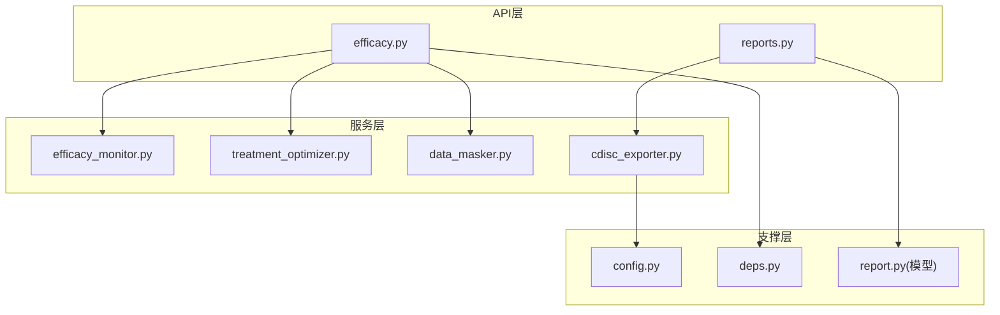
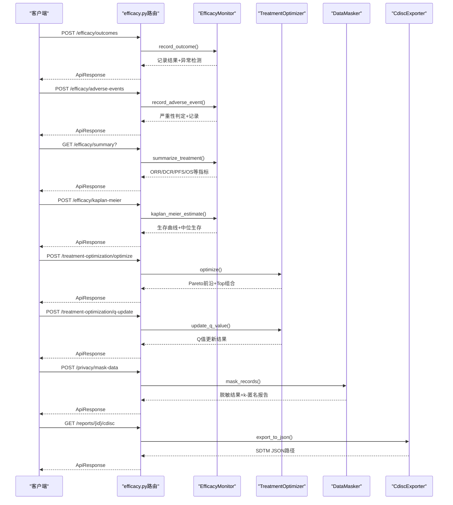
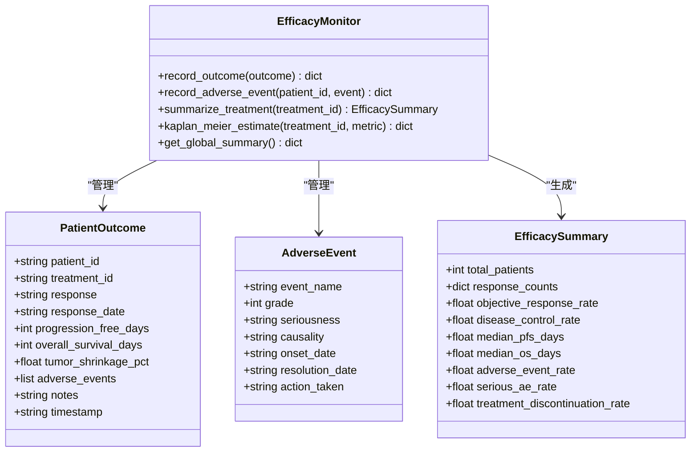
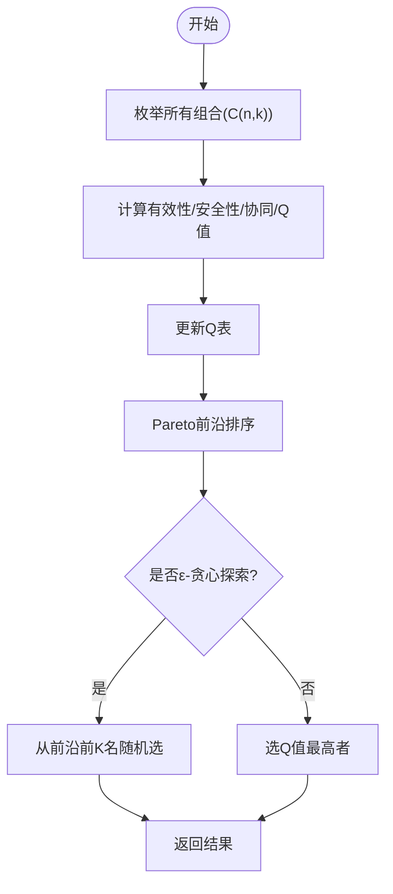
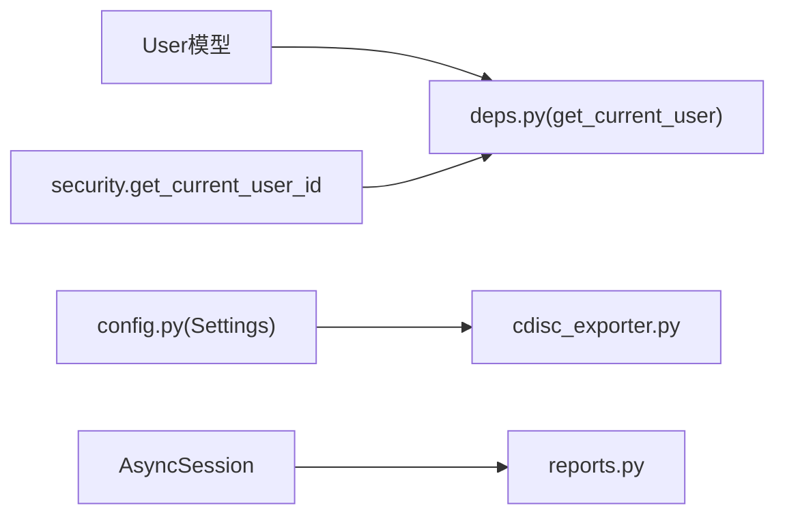

# 疗效监测API

<cite>
**本文引用的文件列表**
- [backend/app/api/v1/efficacy.py](file://precision-drug-design/backend/app/api/v1/efficacy.py)
- [backend/app/schemas/efficacy.py](file://precision-drug-design/backend/app/schemas/efficacy.py)
- [backend/app/services/optimizer/efficacy_monitor.py](file://precision-drug-design/backend/app/services/optimizer/efficacy_monitor.py)
- [backend/app/services/optimizer/treatment_optimizer.py](file://precision-drug-design/backend/app/services/optimizer/treatment_optimizer.py)
- [backend/app/services/privacy/data_masker.py](file://precision-drug-design/backend/app/services/privacy/data_masker.py)
- [backend/app/services/report/cdisc_exporter.py](file://precision-drug-design/backend/app/services/report/cdisc_exporter.py)
- [backend/app/api/v1/reports.py](file://precision-drug-design/backend/app/api/v1/reports.py)
- [backend/app/core/deps.py](file://precision-drug-design/backend/app/core/deps.py)
- [backend/app/core/config.py](file://precision-drug-design/backend/app/core/config.py)
- [backend/app/models/report.py](file://precision-drug-design/backend/app/models/report.py)
</cite>

## 目录
1. [简介](#简介)
2. [项目结构](#项目结构)
3. [核心组件](#核心组件)
4. [架构总览](#架构总览)
5. [详细组件分析](#详细组件分析)
6. [依赖关系分析](#依赖关系分析)
7. [性能与可扩展性](#性能与可扩展性)
8. [故障排查指南](#故障排查指南)
9. [结论](#结论)
10. [附录：接口清单](#附录接口清单)

## 简介
本API文档聚焦“疗效监测系统”的核心能力，覆盖治疗效果评估、风险预测分析、治疗响应监测、临床终点评估（PFS/OS）、生存分析（Kaplan-Meier）、剂量调整与治疗方案优化建议生成、个性化治疗监测、实时疗效反馈与预警机制。同时包含医学标准遵循（CTCAE v5.0、RECIST 1.1、CDISC SDTM）、数据质量控制（k-匿名脱敏）、结果可视化支持（前端页面集成）以及临床试验数据集成与监管报告导出能力。

## 项目结构
后端采用FastAPI分层架构：路由层（API）→ 服务层（业务逻辑）→ 模型/Schema（数据结构）→ 配置与依赖注入。疗效监测相关代码主要分布在以下模块：
- API路由：v1/efficacy.py
- 业务服务：services/optimizer/efficacy_monitor.py、services/optimizer/treatment_optimizer.py
- 隐私与合规：services/privacy/data_masker.py
- 报告与监管：services/report/cdisc_exporter.py、api/v1/reports.py
- 配置与依赖：core/config.py、core/deps.py
- 数据模型：models/report.py

图表来源
- [backend/app/api/v1/efficacy.py:1-347](file://precision-drug-design/backend/app/api/v1/efficacy.py#L1-L347)
- [backend/app/services/optimizer/efficacy_monitor.py:1-407](file://precision-drug-design/backend/app/services/optimizer/efficacy_monitor.py#L1-L407)
- [backend/app/services/optimizer/treatment_optimizer.py:1-363](file://precision-drug-design/backend/app/services/optimizer/treatment_optimizer.py#L1-L363)
- [backend/app/services/privacy/data_masker.py:1-294](file://precision-drug-design/backend/app/services/privacy/data_masker.py#L1-L294)
- [backend/app/services/report/cdisc_exporter.py:1-187](file://precision-drug-design/backend/app/services/report/cdisc_exporter.py#L1-L187)
- [backend/app/api/v1/reports.py:1-181](file://precision-drug-design/backend/app/api/v1/reports.py#L1-L181)
- [backend/app/core/config.py:1-144](file://precision-drug-design/backend/app/core/config.py#L1-L144)
- [backend/app/core/deps.py:1-129](file://precision-drug-design/backend/app/core/deps.py#L1-L129)
- [backend/app/models/report.py:1-73](file://precision-drug-design/backend/app/models/report.py#L1-L73)

章节来源
- [backend/app/api/v1/efficacy.py:1-347](file://precision-drug-design/backend/app/api/v1/efficacy.py#L1-L347)
- [backend/app/api/v1/reports.py:1-181](file://precision-drug-design/backend/app/api/v1/reports.py#L1-L181)

## 核心组件
- 疗效监测器（EfficacyMonitor）
  - 负责患者结局录入、不良事件上报、疗效汇总统计（ORR/DCR/PFS/OS中位数等）、异常检测与Kaplan-Meier生存估计。
- 治疗方案优化器（TreatmentOptimizer）
  - 基于Q-learning启发式搜索与Pareto前沿选择，提供多靶点组合优化、Q值更新与探索策略推荐。
- 数据脱敏器（DataMasker）
  - 实现HIPAA Safe Harbor去标识化、准标识符泛化、敏感字段抑制与k-匿名验证。
- CDISC导出器（CdiscExporter）
  - 将报告转换为SDTM JSON格式，输出TS/DM/AE/LB域数据集。
- 报告API（reports.py）
  - 提供报告列表、详情、CDISC导出入口与重新生成任务。

章节来源
- [backend/app/services/optimizer/efficacy_monitor.py:114-407](file://precision-drug-design/backend/app/services/optimizer/efficacy_monitor.py#L114-L407)
- [backend/app/services/optimizer/treatment_optimizer.py:66-363](file://precision-drug-design/backend/app/services/optimizer/treatment_optimizer.py#L66-L363)
- [backend/app/services/privacy/data_masker.py:126-294](file://precision-drug-design/backend/app/services/privacy/data_masker.py#L126-L294)
- [backend/app/services/report/cdisc_exporter.py:22-187](file://precision-drug-design/backend/app/services/report/cdisc_exporter.py#L22-L187)
- [backend/app/api/v1/reports.py:35-181](file://precision-drug-design/backend/app/api/v1/reports.py#L35-L181)

## 架构总览
疗效监测API的整体调用链如下：客户端请求进入FastAPI路由，路由校验并组装请求体，调用服务层进行计算与分析，返回统一ApiResponse封装的结果。

图表来源
- [backend/app/api/v1/efficacy.py:62-347](file://precision-drug-design/backend/app/api/v1/efficacy.py#L62-L347)
- [backend/app/services/optimizer/efficacy_monitor.py:123-407](file://precision-drug-design/backend/app/services/optimizer/efficacy_monitor.py#L123-L407)
- [backend/app/services/optimizer/treatment_optimizer.py:102-363](file://precision-drug-design/backend/app/services/optimizer/treatment_optimizer.py#L102-L363)
- [backend/app/services/privacy/data_masker.py:156-294](file://precision-drug-design/backend/app/services/privacy/data_masker.py#L156-L294)
- [backend/app/services/report/cdisc_exporter.py:28-187](file://precision-drug-design/backend/app/services/report/cdisc_exporter.py#L28-L187)
- [backend/app/api/v1/reports.py:123-153](file://precision-drug-design/backend/app/api/v1/reports.py#L123-L153)

## 详细组件分析

### 疗效监测器（EfficacyMonitor）
- 功能要点
  - 患者结局录入：支持CR/PR/SD/PD/Unknown，自动记录时间戳，关联到治疗方案。
  - 不良反应追踪：CTCAE v5.0等级1-5，Grade≥3自动标记为严重不良事件。
  - 疗效汇总：计算ORR、DCR、AE率、严重AE率、停药率；统计中位PFS/OS。
  - 异常检测：低疗效、高严重AE率、高停药率阈值告警。
  - Kaplan-Meier生存估计：按PFS或OS构建生存曲线，估算中位生存时间。
- 关键数据结构
  - PatientOutcome：患者结局记录（含PFS/OS、肿瘤缩小百分比、备注等）。
  - AdverseEvent：不良事件（含等级、因果关系、发生/缓解日期、处理措施）。
  - EfficacySummary：疗效汇总（计数与比率、中位生存等）。
- 复杂度与性能
  - 汇总统计对每个方案遍历其患者集合，时间复杂度O(N)，N为该方案患者数。
  - KM估计排序时间为O(N log N)。
- 错误处理
  - 未知响应类别归为unknown；未知metric返回错误信息。
- 可视化支持
  - 返回的survival_curve可用于前端绘制生存曲线。

图表来源
- [backend/app/services/optimizer/efficacy_monitor.py:35-112](file://precision-drug-design/backend/app/services/optimizer/efficacy_monitor.py#L35-L112)
- [backend/app/services/optimizer/efficacy_monitor.py:114-407](file://precision-drug-design/backend/app/services/optimizer/efficacy_monitor.py#L114-L407)

章节来源
- [backend/app/services/optimizer/efficacy_monitor.py:114-407](file://precision-drug-design/backend/app/services/optimizer/efficacy_monitor.py#L114-L407)

### 治疗方案优化器（TreatmentOptimizer）
- 功能要点
  - 多靶点组合枚举：支持不同组合大小（默认1/2/3）。
  - 评分函数：有效性（证据强度×可成药性）、安全性（安全分-复杂度惩罚）、协同效应（矩阵或新颖性互补）。
  - Q值近似：Q(s,a)=α·efficacy+β·safety+γ·synergy−δ·complexity。
  - Pareto前沿：在(efficacy,safety)二维空间筛选非支配解。
  - ε-贪心探索：以ε概率随机选择，避免局部最优。
  - UCB推荐：结合访问次数平衡利用与探索。
- 关键数据结构
  - TargetCandidate：候选靶点（symbol、证据、可成药性、安全性、新颖性）。
  - CombinationScore：组合评分（efficacy/safety/synergy/q_value/pareto_rank/rationale）。
- 算法流程（评分与Pareto排序）

图表来源
- [backend/app/services/optimizer/treatment_optimizer.py:102-266](file://precision-drug-design/backend/app/services/optimizer/treatment_optimizer.py#L102-L266)

章节来源
- [backend/app/services/optimizer/treatment_optimizer.py:66-363](file://precision-drug-design/backend/app/services/optimizer/treatment_optimizer.py#L66-L363)

### 数据脱敏器（DataMasker）
- 功能要点
  - HIPAA Safe Harbor直接标识符哈希脱敏（SHA-256加盐）。
  - 准标识符泛化：年龄分段、邮编截断、日期精度控制。
  - 敏感字段抑制：替换为占位符。
  - k-匿名验证：同质组大小≥k，输出违规项。
- 配置项
  - salt、age_buckets、zip_prefix_len、date_granularity、k_anonymity、redact_placeholder。
- 输出报告
  - 总记录数、字段数、各类处理计数、最小同质组大小、是否满足k-匿名、违规项。

章节来源
- [backend/app/services/privacy/data_masker.py:80-124](file://precision-drug-design/backend/app/services/privacy/data_masker.py#L80-L124)
- [backend/app/services/privacy/data_masker.py:126-294](file://precision-drug-design/backend/app/services/privacy/data_masker.py#L126-L294)

### CDISC导出器（CdiscExporter）
- 功能要点
  - 输出SDTM JSON，包含TS/DM/AE/LB域。
  - 根据内部报告内容映射到SDTM字段。
  - 写入指定目录，返回文件路径与元数据。
- 标准化遵循
  - 遵循SDTM IG 3.2标准命名与域结构。

章节来源
- [backend/app/services/report/cdisc_exporter.py:22-187](file://precision-drug-design/backend/app/services/report/cdisc_exporter.py#L22-L187)

### 报告API（reports.py）
- 功能要点
  - 报告列表（分页、过滤）。
  - 报告详情（Markdown+结构化JSON+证据分布）。
  - CDISC导出入口（返回下载URL与过期时间）。
  - 重新生成报告（异步任务队列状态）。

章节来源
- [backend/app/api/v1/reports.py:35-181](file://precision-drug-design/backend/app/api/v1/reports.py#L35-L181)
- [backend/app/models/report.py:15-73](file://precision-drug-design/backend/app/models/report.py#L15-L73)

## 依赖关系分析
- 认证与用户上下文
  - get_current_user依赖JWT解析与数据库查询，带短TTL内存缓存以提升性能。
- 配置中心
  - Settings集中管理环境变量，包括CDISC输出目录、外部知识库URL等。
- 数据库会话
  - get_async_db提供异步会话，用于报告与证据项持久化。

图表来源
- [backend/app/core/deps.py:101-129](file://precision-drug-design/backend/app/core/deps.py#L101-L129)
- [backend/app/core/config.py:21-144](file://precision-drug-design/backend/app/core/config.py#L21-L144)
- [backend/app/api/v1/reports.py:35-181](file://precision-drug-design/backend/app/api/v1/reports.py#L35-L181)

章节来源
- [backend/app/core/deps.py:1-129](file://precision-drug-design/backend/app/core/deps.py#L1-129)
- [backend/app/core/config.py:1-144](file://precision-drug-design/backend/app/core/config.py#L1-L144)

## 性能与可扩展性
- 计算复杂度
  - 疗效汇总：O(N)；KM估计：O(N log N)；组合优化：O(C(n,k))，可通过限制combo_sizes与max_results控制。
- 缓存与I/O
  - 用户对象短TTL缓存减少DB压力；CDISC导出落盘，避免大对象在网络传输中阻塞。
- 扩展建议
  - 引入Redis缓存高频汇总结果；使用消息队列异步执行大规模组合优化与KM估计；对CDISC导出增加并行压缩与分片。

[本节为通用指导，不直接分析具体文件]

## 故障排查指南
- 常见错误
  - 参数校验失败：如缺失treatment_id、无效response类别、未知metric。
  - 数据不足：无PFS/OS数据导致KM估计为空；样本量过小触发不告警。
  - k-匿名未满足：准标识符分组过小，需调整k或泛化策略。
- 定位方法
  - 检查请求ID（meta.request_id）与日志；查看服务层logger输出；确认数据库记录是否存在。
- 恢复建议
  - 修正输入参数；补充临床数据；调整脱敏配置（增大k或放宽泛化粒度）。

章节来源
- [backend/app/api/v1/efficacy.py:205-214](file://precision-drug-design/backend/app/api/v1/efficacy.py#L205-L214)
- [backend/app/services/optimizer/efficacy_monitor.py:339-407](file://precision-drug-design/backend/app/services/optimizer/efficacy_monitor.py#L339-L407)
- [backend/app/services/privacy/data_masker.py:257-294](file://precision-drug-design/backend/app/services/privacy/data_masker.py#L257-L294)

## 结论
本疗效监测API提供了完整的临床疗效评估、风险预测、治疗优化与合规导出能力，遵循CTCAE/RECIST/CDISC标准，具备数据脱敏与k-匿名保障，并通过前端页面支持可视化展示。系统采用模块化设计，易于扩展与集成至真实临床试验工作流。

[本节为总结性内容，不直接分析具体文件]

## 附录：接口清单

- 疗效监测
  - POST /api/v1/efficacy/outcomes
    - 请求体：PatientOutcomeRequest
    - 响应：ApiResponse[PatientOutcomeResponse]
    - 说明：录入患者结局，自动异常检测
  - POST /api/v1/efficacy/adverse-events
    - 请求体：AdverseEventRequest
    - 响应：ApiResponse[AdverseEventResponse]
    - 说明：上报不良事件，Grade≥3标记严重
  - GET /api/v1/efficacy/summary
    - 查询参数：treatment_id
    - 响应：ApiResponse[EfficacySummaryResponse]
    - 说明：某治疗方案疗效汇总（ORR/DCR/PFS/OS等）
  - GET /api/v1/efficacy/global-summary
    - 响应：ApiResponse[GlobalEfficacySummaryResponse]
    - 说明：全局汇总（患者/方案/AE数量）
  - POST /api/v1/efficacy/kaplan-meier
    - 请求体：{treatment_id, metric="pfs"/"os"}
    - 响应：ApiResponse[KaplanMeierResponse]
    - 说明：生存曲线与中位生存时间

- 治疗方案优化
  - POST /api/v1/treatment-optimization/optimize
    - 请求体：TreatmentOptimizationRequest
    - 响应：ApiResponse[TreatmentOptimizationResponse]
    - 说明：Pareto前沿与Top组合推荐
  - POST /api/v1/treatment-optimization/q-update
    - 请求体：QValueUpdateRequest
    - 响应：ApiResponse[QValueUpdateResponse]
    - 说明：Q值更新（学习率可调）

- 数据脱敏
  - POST /api/v1/privacy/mask-data
    - 请求体：DataMaskingRequest
    - 响应：ApiResponse[DataMaskingResponse]
    - 说明：HIPAA Safe Harbor脱敏与k-匿名验证

- 报告与监管
  - GET /api/v1/reports
    - 查询参数：project_id、analysis_tier、分页
    - 响应：PagedResponse[ReportResponse]
  - GET /api/v1/reports/{report_id}
    - 响应：ApiResponse[ReportDetail]
  - GET /api/v1/reports/{report_id}/cdisc
    - 响应：ApiResponse[CdiscExportResponse]
    - 说明：CDISC SDTM导出入口（第二阶段占位URL）
  - POST /api/v1/reports/{report_id}/regenerate
    - 响应：ApiResponse[任务状态]

章节来源
- [backend/app/api/v1/efficacy.py:62-347](file://precision-drug-design/backend/app/api/v1/efficacy.py#L62-L347)
- [backend/app/schemas/efficacy.py:12-170](file://precision-drug-design/backend/app/schemas/efficacy.py#L12-L170)
- [backend/app/api/v1/reports.py:35-181](file://precision-drug-design/backend/app/api/v1/reports.py#L35-L181)