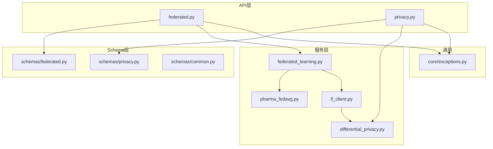
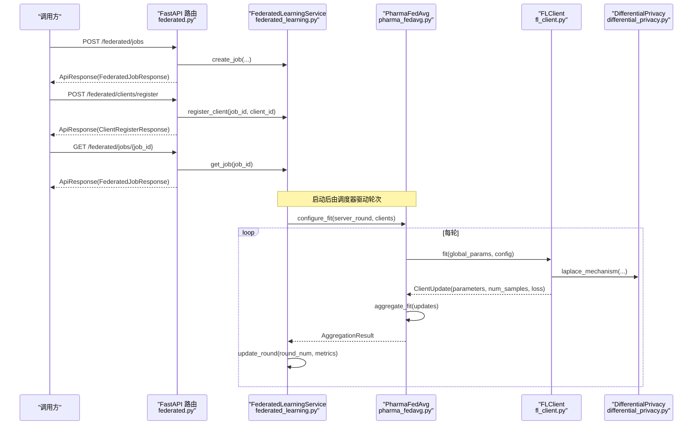
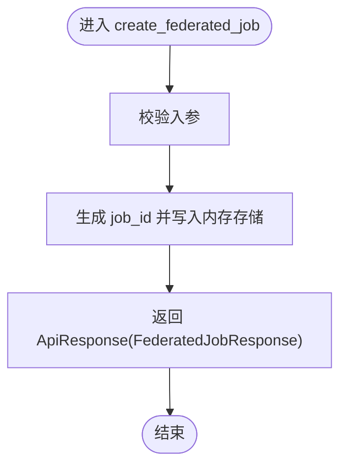
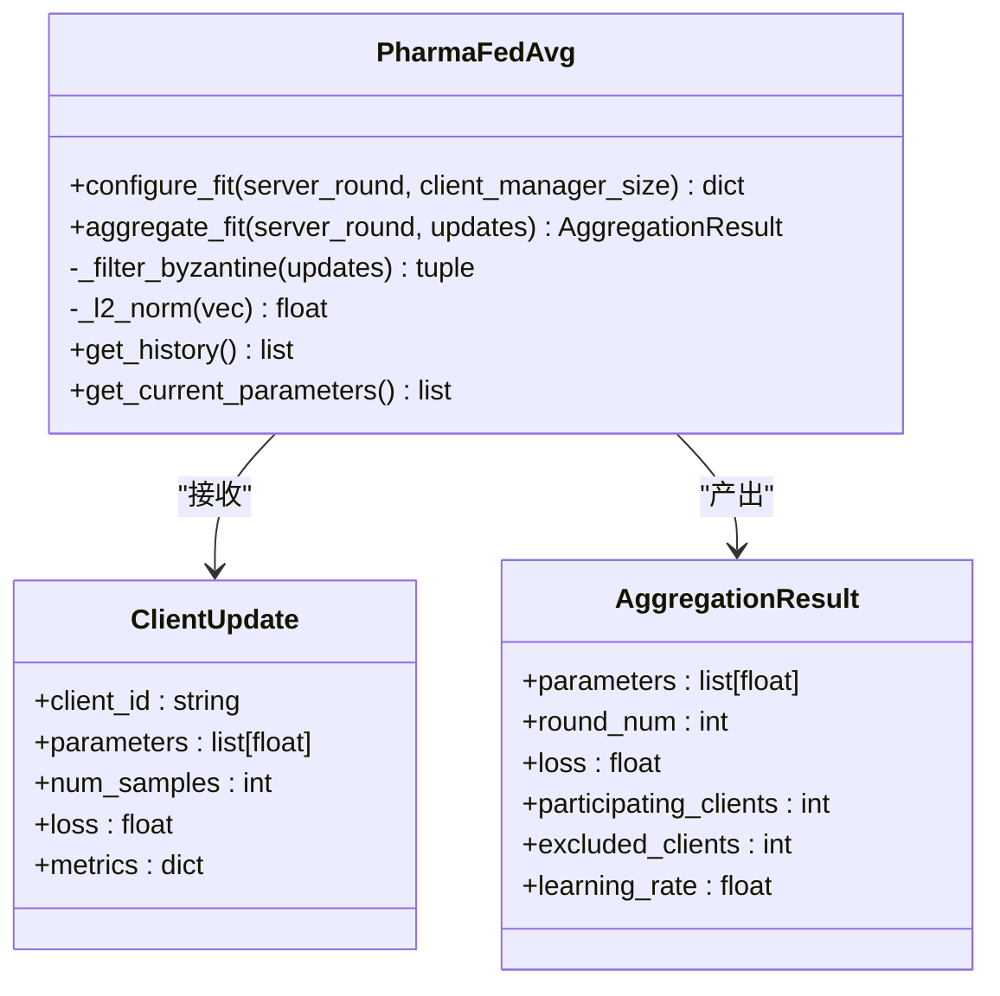
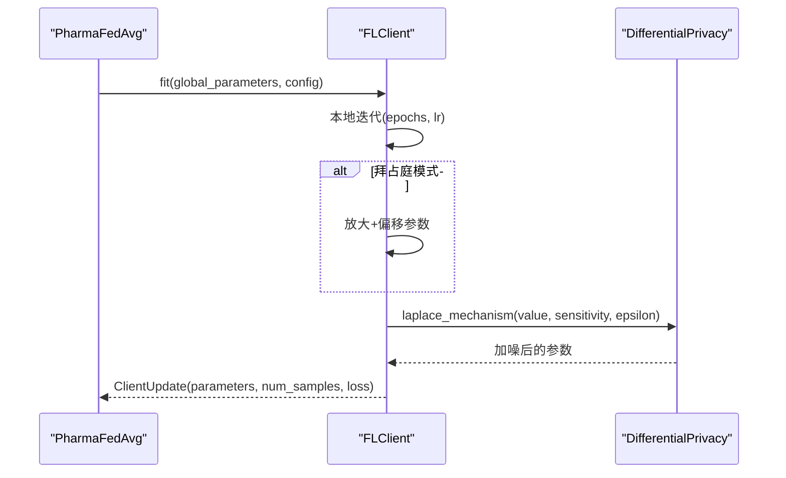
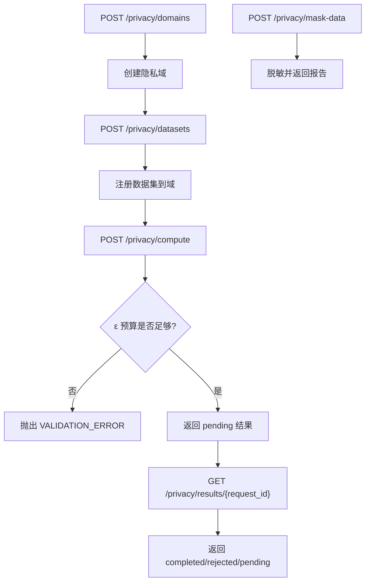
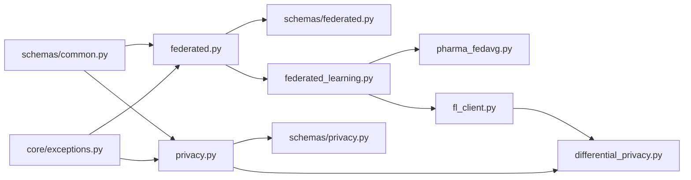

# 联邦学习API

<cite>
**本文引用的文件**   
- [backend/app/api/v1/federated.py](file://precision-drug-design/backend/app/api/v1/federated.py)
- [backend/app/schemas/federated.py](file://precision-drug-design/backend/app/schemas/federated.py)
- [backend/app/services/optimizer/federated_learning.py](file://precision-drug-design/backend/app/services/optimizer/federated_learning.py)
- [backend/app/services/optimizer/pharma_fedavg.py](file://precision-drug-design/backend/app/services/optimizer/pharma_fedavg.py)
- [backend/app/services/optimizer/fl_client.py](file://precision-drug-design/backend/app/services/optimizer/fl_client.py)
- [backend/app/services/privacy/differential_privacy.py](file://precision-drug-design/backend/app/services/privacy/differential_privacy.py)
- [backend/app/api/v1/privacy.py](file://precision-drug-design/backend/app/api/v1/privacy.py)
- [backend/app/schemas/privacy.py](file://precision-drug-design/backend/app/schemas/privacy.py)
- [tests/test_federated_learning.py](file://precision-drug-design/tests/test_federated_learning.py)
- [backend/app/core/exceptions.py](file://precision-drug-design/backend/app/core/exceptions.py)
- [backend/app/schemas/common.py](file://precision-drug-design/backend/app/schemas/common.py)
</cite>

## 目录
1. [简介](#简介)
2. [项目结构](#项目结构)
3. [核心组件](#核心组件)
4. [架构总览](#架构总览)
5. [详细组件分析](#详细组件分析)
6. [依赖关系分析](#依赖关系分析)
7. [性能与监控](#性能与监控)
8. [故障恢复与排障](#故障恢复与排障)
9. [安全与合规](#安全与合规)
10. [结论](#结论)
11. [附录：接口清单与示例](#附录接口清单与示例)

## 简介
本文件为联邦学习系统的API文档，覆盖分布式训练任务管理、模型聚合算法（PharmaFedAvg）、节点协调通信、隐私保护机制（差分隐私预算与数据脱敏）、以及多机构协作场景的集成要点。系统采用 FastAPI 暴露 REST API，服务层提供内存版实现（便于演示与测试），并预留与 Flower 等真实联邦框架对接的扩展点。

## 项目结构
联邦学习相关代码主要分布在以下模块：
- API 层：v1/federated.py、v1/privacy.py
- 数据模型与请求响应：schemas/federated.py、schemas/privacy.py、schemas/common.py
- 服务层：services/optimizer/federated_learning.py、pharma_fedavg.py、fl_client.py；services/privacy/differential_privacy.py
- 异常与统一响应：core/exceptions.py、schemas/common.py
- 单元测试：tests/test_federated_learning.py

图表来源
- [backend/app/api/v1/federated.py:1-133](file://precision-drug-design/backend/app/api/v1/federated.py#L1-L133)
- [backend/app/api/v1/privacy.py:1-177](file://precision-drug-design/backend/app/api/v1/privacy.py#L1-L177)
- [backend/app/schemas/federated.py:1-63](file://precision-drug-design/backend/app/schemas/federated.py#L1-L63)
- [backend/app/schemas/privacy.py:1-84](file://precision-drug-design/backend/app/schemas/privacy.py#L1-L84)
- [backend/app/schemas/common.py:1-158](file://precision-drug-design/backend/app/schemas/common.py#L1-L158)
- [backend/app/services/optimizer/federated_learning.py:1-199](file://precision-drug-design/backend/app/services/optimizer/federated_learning.py#L1-L199)
- [backend/app/services/optimizer/pharma_fedavg.py:1-246](file://precision-drug-design/backend/app/services/optimizer/pharma_fedavg.py#L1-L246)
- [backend/app/services/optimizer/fl_client.py:1-254](file://precision-drug-design/backend/app/services/optimizer/fl_client.py#L1-L254)
- [backend/app/services/privacy/differential_privacy.py:1-151](file://precision-drug-design/backend/app/services/privacy/differential_privacy.py#L1-L151)
- [backend/app/core/exceptions.py:1-179](file://precision-drug-design/backend/app/core/exceptions.py#L1-L179)

章节来源
- [backend/app/api/v1/federated.py:1-133](file://precision-drug-design/backend/app/api/v1/federated.py#L1-L133)
- [backend/app/api/v1/privacy.py:1-177](file://precision-drug-design/backend/app/api/v1/privacy.py#L1-L177)
- [backend/app/schemas/federated.py:1-63](file://precision-drug-design/backend/app/schemas/federated.py#L1-L63)
- [backend/app/schemas/privacy.py:1-84](file://precision-drug-design/backend/app/schemas/privacy.py#L1-L84)
- [backend/app/schemas/common.py:1-158](file://precision-drug-design/backend/app/schemas/common.py#L1-L158)
- [backend/app/services/optimizer/federated_learning.py:1-199](file://precision-drug-design/backend/app/services/optimizer/federated_learning.py#L1-L199)
- [backend/app/services/optimizer/pharma_fedavg.py:1-246](file://precision-drug-design/backend/app/services/optimizer/pharma_fedavg.py#L1-L246)
- [backend/app/services/optimizer/fl_client.py:1-254](file://precision-drug-design/backend/app/services/optimizer/fl_client.py#L1-L254)
- [backend/app/services/privacy/differential_privacy.py:1-151](file://precision-drug-design/backend/app/services/privacy/differential_privacy.py#L1-L151)
- [backend/app/core/exceptions.py:1-179](file://precision-drug-design/backend/app/core/exceptions.py#L1-L179)

## 核心组件
- 联邦学习任务管理（API + 服务）
  - 创建/查询/停止任务、客户端注册、轮次进度更新
- PharmaFedAvg 聚合策略
  - 按样本量加权、拜占庭剔除（MAD）、学习率衰减、异步聚合
- 联邦客户端模拟
  - 本地训练、评估、差分隐私加噪、拜占庭故障注入
- 隐私计算与数据脱敏
  - 隐私域、数据集注册、远程计算提交与结果查询、HIPAA Safe Harbor 脱敏
- 统一异常与响应信封
  - 全局异常处理、统一成功/失败响应格式

章节来源
- [backend/app/api/v1/federated.py:1-133](file://precision-drug-design/backend/app/api/v1/federated.py#L1-L133)
- [backend/app/services/optimizer/federated_learning.py:1-199](file://precision-drug-design/backend/app/services/optimizer/federated_learning.py#L1-L199)
- [backend/app/services/optimizer/pharma_fedavg.py:1-246](file://precision-drug-design/backend/app/services/optimizer/pharma_fedavg.py#L1-L246)
- [backend/app/services/optimizer/fl_client.py:1-254](file://precision-drug-design/backend/app/services/optimizer/fl_client.py#L1-L254)
- [backend/app/api/v1/privacy.py:1-177](file://precision-drug-design/backend/app/api/v1/privacy.py#L1-L177)
- [backend/app/services/privacy/differential_privacy.py:1-151](file://precision-drug-design/backend/app/services/privacy/differential_privacy.py#L1-L151)
- [backend/app/core/exceptions.py:1-179](file://precision-drug-design/backend/app/core/exceptions.py#L1-L179)
- [backend/app/schemas/common.py:1-158](file://precision-drug-design/backend/app/schemas/common.py#L1-L158)

## 架构总览
下图展示了从客户端到服务端的核心调用链：前端或外部系统通过 REST API 创建联邦任务、注册客户端、触发聚合与服务端状态流转；服务层维护任务生命周期与指标，聚合器执行参数合并，客户端完成本地训练与隐私保护。

图表来源
- [backend/app/api/v1/federated.py:1-133](file://precision-drug-design/backend/app/api/v1/federated.py#L1-L133)
- [backend/app/services/optimizer/federated_learning.py:1-199](file://precision-drug-design/backend/app/services/optimizer/federated_learning.py#L1-L199)
- [backend/app/services/optimizer/pharma_fedavg.py:1-246](file://precision-drug-design/backend/app/services/optimizer/pharma_fedavg.py#L1-L246)
- [backend/app/services/optimizer/fl_client.py:1-254](file://precision-drug-design/backend/app/services/optimizer/fl_client.py#L1-L254)
- [backend/app/services/privacy/differential_privacy.py:1-151](file://precision-drug-design/backend/app/services/privacy/differential_privacy.py#L1-L151)

## 详细组件分析

### 联邦学习任务管理（API + 服务）
- 能力概览
  - 创建任务：指定名称、模型架构、轮数、最少客户端数、配置项
  - 列表/详情：支持按状态过滤、获取任务当前轮次与连接客户端数
  - 停止任务：将任务置为完成态（用于演示）
  - 客户端注册：累计已注册客户端，达到阈值后自动推进任务状态
- 关键流程
  - 创建任务时生成唯一ID并初始化状态为“待处理”
  - 客户端注册成功后若满足最小客户端数，则任务状态转为“运行中”
  - 轮次更新记录指标并在最后一轮完成后标记“已完成”

图表来源
- [backend/app/api/v1/federated.py:35-61](file://precision-drug-design/backend/app/api/v1/federated.py#L35-L61)

章节来源
- [backend/app/api/v1/federated.py:1-133](file://precision-drug-design/backend/app/api/v1/federated.py#L1-L133)
- [backend/app/schemas/federated.py:1-63](file://precision-drug-design/backend/app/schemas/federated.py#L1-L63)
- [backend/app/services/optimizer/federated_learning.py:60-199](file://precision-drug-design/backend/app/services/optimizer/federated_learning.py#L60-L199)
- [tests/test_federated_learning.py:1-134](file://precision-drug-design/tests/test_federated_learning.py#L1-L134)

### 聚合算法：PharmaFedAvg（药物研发定制 FedAvg）
- 特性
  - 按客户端样本量加权聚合
  - 拜占庭剔除：基于参数范数的 MAD 检测异常更新
  - 学习率按轮次指数衰减
  - 异步聚合：满足最小参与数即可触发
- 关键方法
  - configure_fit：计算本轮学习率与下发配置
  - aggregate_fit：剔除异常、加权平均、更新全局参数并记录历史
  - _filter_byzantine：MAD 异常检测与剔除

图表来源
- [backend/app/services/optimizer/pharma_fedavg.py:62-246](file://precision-drug-design/backend/app/services/optimizer/pharma_fedavg.py#L62-L246)

章节来源
- [backend/app/services/optimizer/pharma_fedavg.py:1-246](file://precision-drug-design/backend/app/services/optimizer/pharma_fedavg.py#L1-L246)

### 联邦客户端与注册表（FLClient + ClientRegistry）
- 功能
  - 本地训练：模拟梯度下降，记录损失与指标
  - 差分隐私：在参数上报前进行裁剪与噪声注入
  - 拜占庭注入：用于测试服务端剔除逻辑
  - 客户端注册表：管理在线客户端、心跳与健康检查
- 关键流程
  - fit：同步全局参数 → 本地迭代 → 可选拜占庭扰动 → 差分隐私加噪 → 返回 LocalTrainingResult
  - evaluate：以给定参数计算评估损失与简化准确率
  - ClientRegistry：注册/注销/列出健康客户端、心跳更新

图表来源
- [backend/app/services/optimizer/fl_client.py:42-196](file://precision-drug-design/backend/app/services/optimizer/fl_client.py#L42-L196)
- [backend/app/services/privacy/differential_privacy.py:51-151](file://precision-drug-design/backend/app/services/privacy/differential_privacy.py#L51-L151)

章节来源
- [backend/app/services/optimizer/fl_client.py:1-254](file://precision-drug-design/backend/app/services/optimizer/fl_client.py#L1-L254)
- [backend/app/services/privacy/differential_privacy.py:1-151](file://precision-drug-design/backend/app/services/privacy/differential_privacy.py#L1-L151)

### 隐私计算与数据脱敏（隐私域/数据集/远程计算/HIPAA 脱敏）
- 隐私域与数据集
  - 创建隐私域：设置 ε 预算与元信息
  - 注册数据集：绑定到隐私域，支持 schema 与 mock 数据预览
- 远程计算
  - 提交计算：校验 ε 预算，返回 pending 结果
  - 查询结果：根据 request_id 获取状态与结果
- HIPAA Safe Harbor 脱敏
  - 直接标识符哈希、准标识符泛化、敏感字段抑制、k-匿名性验证

图表来源
- [backend/app/api/v1/privacy.py:47-177](file://precision-drug-design/backend/app/api/v1/privacy.py#L47-L177)
- [backend/app/schemas/privacy.py:14-84](file://precision-drug-design/backend/app/schemas/privacy.py#L14-L84)

章节来源
- [backend/app/api/v1/privacy.py:1-177](file://precision-drug-design/backend/app/api/v1/privacy.py#L1-L177)
- [backend/app/schemas/privacy.py:1-84](file://precision-drug-design/backend/app/schemas/privacy.py#L1-L84)

### 统一异常与响应信封
- 统一响应信封
  - 成功：ApiResponse{success, data, meta}
  - 错误：ErrorResponse{success=false, error{code,message,details}, meta}
- 全局异常处理器
  - AppException 及其子类映射到对应 HTTP 状态码
  - RequestValidationError 统一包装为 VALIDATION_ERROR
  - 未捕获异常兜底 INTERNAL_ERROR

章节来源
- [backend/app/schemas/common.py:63-158](file://precision-drug-design/backend/app/schemas/common.py#L63-L158)
- [backend/app/core/exceptions.py:19-179](file://precision-drug-design/backend/app/core/exceptions.py#L19-L179)

## 依赖关系分析
- 耦合与内聚
  - API 层仅负责参数校验与编排，业务逻辑下沉至服务层，保持高内聚低耦合
  - 聚合策略与客户端解耦，便于替换为真实框架（如 Flower）
- 外部依赖
  - 当前为内存实现，生产环境需替换为持久化存储与消息队列
  - 可无缝接入 Flower 服务端/客户端以支撑大规模集群

图表来源
- [backend/app/api/v1/federated.py:1-133](file://precision-drug-design/backend/app/api/v1/federated.py#L1-L133)
- [backend/app/api/v1/privacy.py:1-177](file://precision-drug-design/backend/app/api/v1/privacy.py#L1-L177)
- [backend/app/schemas/federated.py:1-63](file://precision-drug-design/backend/app/schemas/federated.py#L1-L63)
- [backend/app/schemas/privacy.py:1-84](file://precision-drug-design/backend/app/schemas/privacy.py#L1-L84)
- [backend/app/schemas/common.py:1-158](file://precision-drug-design/backend/app/schemas/common.py#L1-L158)
- [backend/app/services/optimizer/federated_learning.py:1-199](file://precision-drug-design/backend/app/services/optimizer/federated_learning.py#L1-L199)
- [backend/app/services/optimizer/pharma_fedavg.py:1-246](file://precision-drug-design/backend/app/services/optimizer/pharma_fedavg.py#L1-L246)
- [backend/app/services/optimizer/fl_client.py:1-254](file://precision-drug-design/backend/app/services/optimizer/fl_client.py#L1-L254)
- [backend/app/services/privacy/differential_privacy.py:1-151](file://precision-drug-design/backend/app/services/privacy/differential_privacy.py#L1-L151)
- [backend/app/core/exceptions.py:1-179](file://precision-drug-design/backend/app/core/exceptions.py#L1-L179)

## 性能与监控
- 聚合阶段
  - 加权聚合时间复杂度 O(P×D)，P 为有效客户端数，D 为参数维度
  - MAD 剔除复杂度 O(P log P)（排序主导）
- 客户端侧
  - 本地训练 epoch 数与学习率影响收敛速度与通信开销
  - 差分隐私噪声强度与 ε 预算权衡精度与隐私
- 建议指标
  - 每轮参与客户端数、剔除客户端数、加权损失、学习率、轮次耗时
  - 客户端心跳成功率、断线重连次数、任务状态转换时长

[本节为通用指导，不直接分析具体文件]

## 故障恢复与排障
- 常见错误与定位
  - 任务不存在：检查 job_id 是否正确传递
  - 客户端不足：确认 min_clients 与实际注册数量
  - 隐私预算不足：检查域预算与本次请求 ε 之和
- 恢复策略
  - 任务暂停/取消后重新创建
  - 客户端断线重连：通过注册表心跳检测与重试
  - 聚合失败回退：拜占庭剔除后仍不足时回退使用全部更新

章节来源
- [backend/app/api/v1/federated.py:77-102](file://precision-drug-design/backend/app/api/v1/federated.py#L77-L102)
- [backend/app/api/v1/privacy.py:94-132](file://precision-drug-design/backend/app/api/v1/privacy.py#L94-L132)
- [backend/app/services/optimizer/pharma_fedavg.py:136-191](file://precision-drug-design/backend/app/services/optimizer/pharma_fedavg.py#L136-L191)
- [backend/app/services/optimizer/fl_client.py:204-254](file://precision-drug-design/backend/app/services/optimizer/fl_client.py#L204-L254)

## 安全与合规
- 差分隐私
  - Laplace/Gaussian 机制与随机响应，预算追踪与审计
- 数据脱敏
  - HIPAA Safe Harbor：直接标识符哈希、准标识符泛化、敏感字段抑制、k-匿名性验证
- 访问控制与审计
  - 统一响应信封包含 request_id，便于链路追踪
  - 全局异常处理器输出结构化日志，便于审计与告警

章节来源
- [backend/app/services/privacy/differential_privacy.py:1-151](file://precision-drug-design/backend/app/services/privacy/differential_privacy.py#L1-L151)
- [backend/app/api/v1/privacy.py:148-177](file://precision-drug-design/backend/app/api/v1/privacy.py#L148-L177)
- [backend/app/core/exceptions.py:131-179](file://precision-drug-design/backend/app/core/exceptions.py#L131-L179)
- [backend/app/schemas/common.py:44-89](file://precision-drug-design/backend/app/schemas/common.py#L44-L89)

## 结论
本联邦学习 API 提供了端到端的任务管理、聚合策略与隐私保护能力，并通过统一异常与响应信封提升可观测性与一致性。当前内存实现便于快速验证与测试，后续可平滑迁移至 Flower 与持久化存储，以满足多机构协作的大规模生产需求。

[本节为总结，不直接分析具体文件]

## 附录：接口清单与示例

### 联邦学习任务管理
- 创建任务
  - 路径：POST /federated/jobs
  - 请求体：FederatedJobCreate
  - 响应：ApiResponse[FederatedJobResponse]
- 列出任务
  - 路径：GET /federated/jobs?status=...
  - 响应：ApiResponse[list[FederatedJobResponse]]
- 获取任务详情
  - 路径：GET /federated/jobs/{job_id}
  - 响应：ApiResponse[FederatedJobResponse]
- 停止任务
  - 路径：POST /federated/jobs/{job_id}/stop
  - 响应：ApiResponse[FederatedJobResponse]
- 客户端注册
  - 路径：POST /federated/clients/register
  - 请求体：ClientRegisterRequest
  - 响应：ApiResponse[ClientRegisterResponse]

章节来源
- [backend/app/api/v1/federated.py:35-133](file://precision-drug-design/backend/app/api/v1/federated.py#L35-L133)
- [backend/app/schemas/federated.py:13-55](file://precision-drug-design/backend/app/schemas/federated.py#L13-L55)

### 隐私计算
- 创建隐私域
  - 路径：POST /privacy/domains
  - 请求体：PrivacyDomainCreate
  - 响应：ApiResponse[PrivacyDomainResponse]
- 注册数据集
  - 路径：POST /privacy/datasets
  - 请求体：PrivacyDatasetRegister
  - 响应：ApiResponse[PrivacyDatasetResponse]
- 提交远程计算
  - 路径：POST /privacy/compute
  - 请求体：ComputeRequest
  - 响应：ApiResponse[ComputeResultResponse]
- 获取计算结果
  - 路径：GET /privacy/results/{request_id}
  - 响应：ApiResponse[ComputeResultResponse]
- 数据脱敏
  - 路径：POST /privacy/mask-data
  - 请求体：DataMaskingRequest
  - 响应：ApiResponse[DataMaskingResponse]

章节来源
- [backend/app/api/v1/privacy.py:47-177](file://precision-drug-design/backend/app/api/v1/privacy.py#L47-L177)
- [backend/app/schemas/privacy.py:14-84](file://precision-drug-design/backend/app/schemas/privacy.py#L14-L84)

### 多机构协作集成示例（概念流程）
- 步骤
  - 机构A 创建联邦任务并获取 job_id
  - 机构B/C 分别注册客户端并等待达到 min_clients
  - 服务器启动训练，各机构本地训练并提交参数
  - 服务器执行 PharmaFedAvg 聚合，记录指标并推进轮次
  - 任务完成后下载全局模型用于下游应用
- 注意事项
  - 确保每个机构的差分隐私预算充足
  - 对异常客户端启用拜占庭剔除
  - 使用 request_id 进行跨机构链路追踪

[本节为概念说明，不直接分析具体文件]