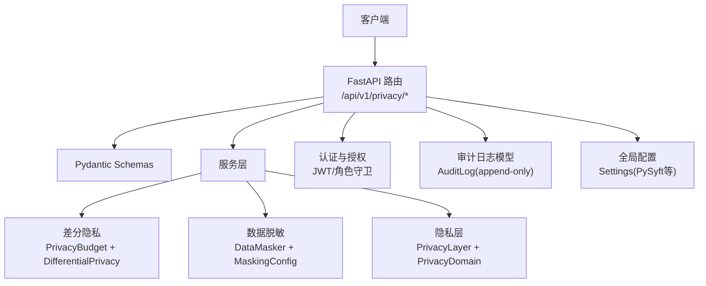
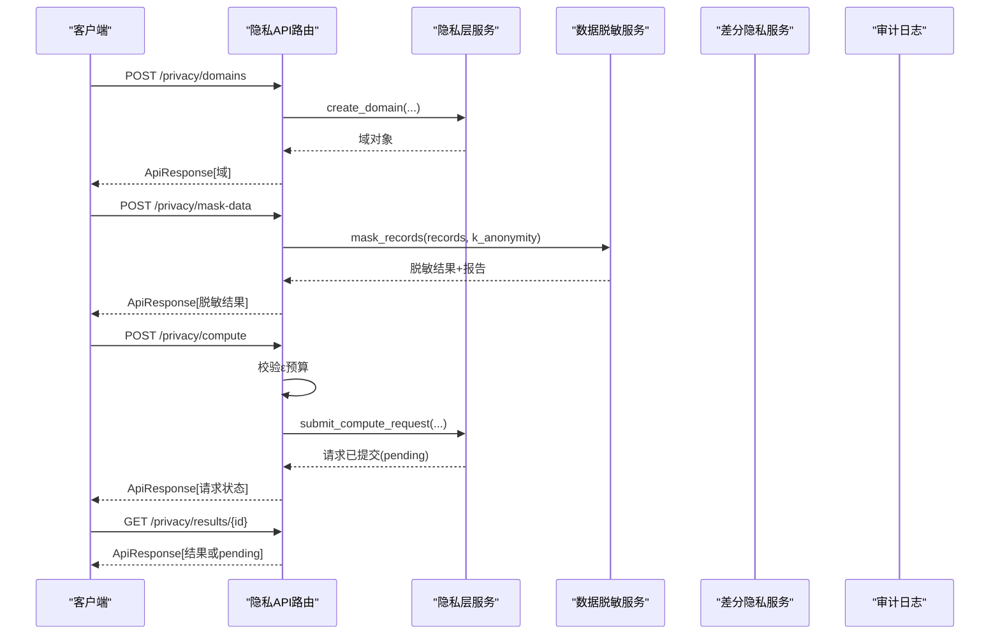
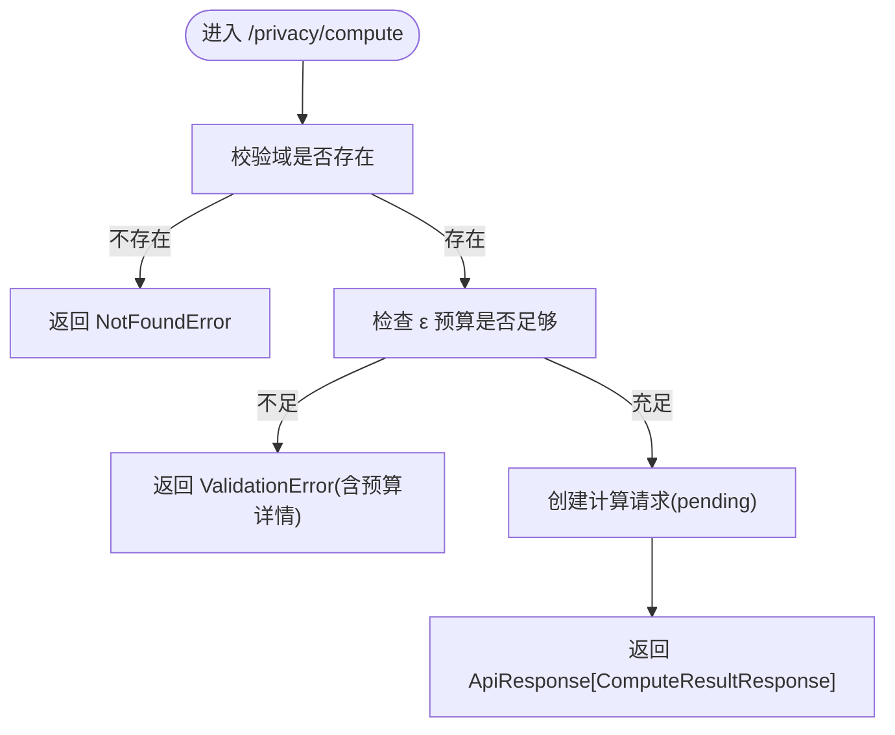
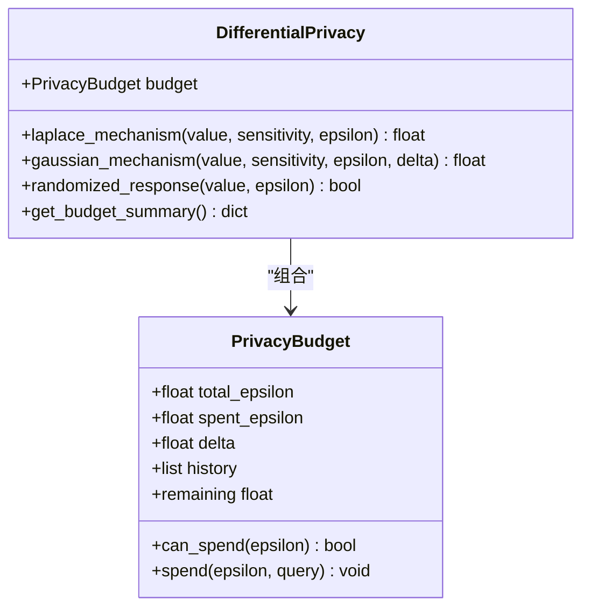
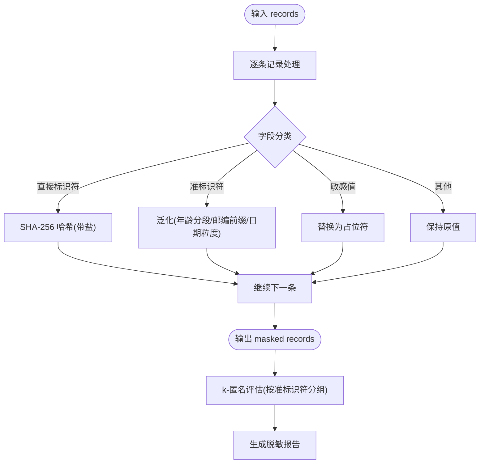
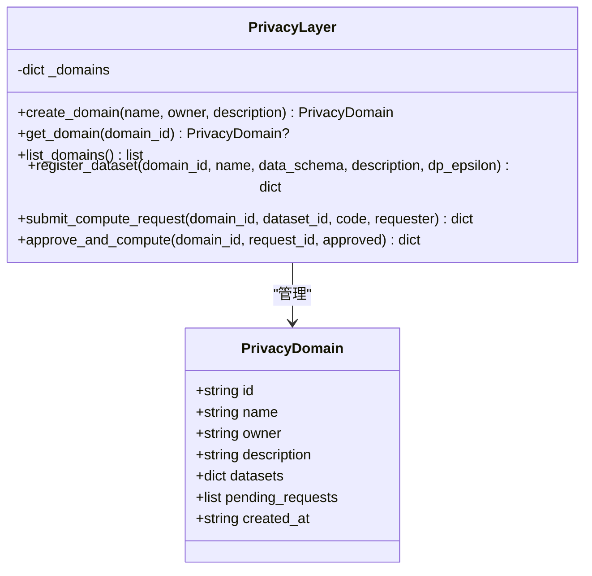
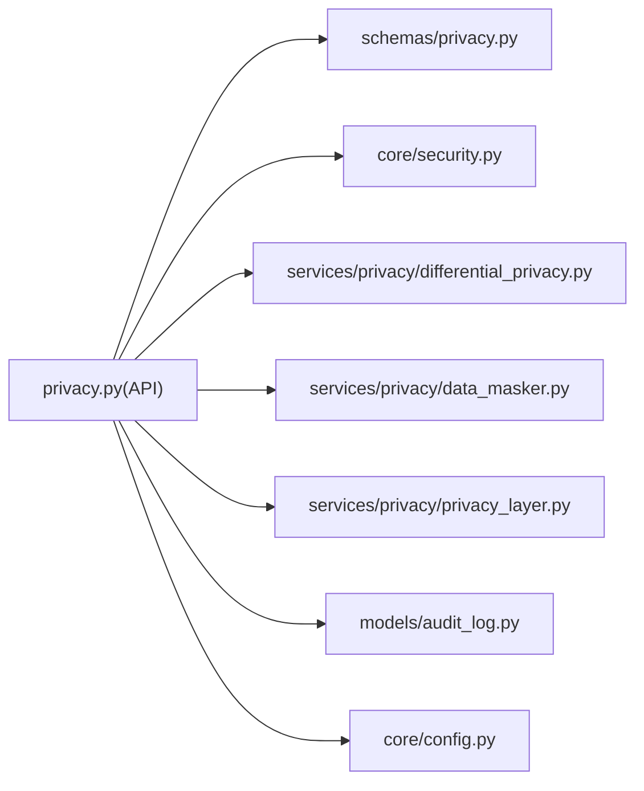

# 隐私保护计算API

<cite>
**本文引用的文件**   
- [privacy.py](file://backend/app/api/v1/privacy.py)
- [privacy.py](file://backend/app/schemas/privacy.py)
- [differential_privacy.py](file://backend/app/services/privacy/differential_privacy.py)
- [data_masker.py](file://backend/app/services/privacy/data_masker.py)
- [privacy_layer.py](file://backend/app/services/privacy/privacy_layer.py)
- [security.py](file://backend/app/core/security.py)
- [audit_log.py](file://backend/app/models/audit_log.py)
- [config.py](file://backend/app/core/config.py)
- [test_differential_privacy.py](file://tests/test_differential_privacy.py)
- [test_privacy_layer.py](file://tests/test_privacy_layer.py)
</cite>

## 目录
1. [简介](#简介)
2. [项目结构](#项目结构)
3. [核心组件](#核心组件)
4. [架构总览](#架构总览)
5. [详细组件分析](#详细组件分析)
6. [依赖关系分析](#依赖关系分析)
7. [性能考量](#性能考量)
8. [故障排查指南](#故障排查指南)
9. [结论](#结论)
10. [附录](#附录)

## 简介
本文件为“隐私保护计算模块”的API与实现文档，覆盖以下能力：
- 差分隐私（DP）机制与预算管控：Laplace、高斯、随机响应；ε-预算追踪与审计。
- 数据脱敏：直接标识符哈希、准标识符泛化、敏感值抑制；k-匿名性验证；HIPAA Safe Harbor 18项处理思路。
- 隐私层封装：基于内存实现的隐私域、数据集注册、计算请求提交与审批流程（对接PySyft域的扩展点）。
- 合规与审计：审计日志模型、请求ID透传、角色鉴权。
- 接口规范：隐私查询接口、噪声添加机制、敏感数据识别与替换、隐私预算管理接口说明。
- 风险与性能：隐私泄露风险评估要点、性能影响分析与最佳实践。

## 项目结构
隐私相关代码主要分布在后端服务的API路由、Schema定义、服务实现与测试中：
- API路由：提供HTTP端点，负责参数校验、权限检查、调用服务层并返回统一响应。
- Schema：使用Pydantic定义请求/响应结构，确保字段约束与类型安全。
- 服务层：
  - 差分隐私：预算管理与噪声注入。
  - 数据脱敏：标识符识别、泛化与抑制策略，k-匿名评估。
  - 隐私层：隐私域与计算请求生命周期管理（内存实现，预留PySyft集成点）。
- 安全与配置：JWT鉴权、全局配置项（含PySyft端口等）。
- 审计：不可变审计日志模型，用于记录关键操作。

图表来源
- [privacy.py:1-177](file://backend/app/api/v1/privacy.py#L1-L177)
- [privacy.py:1-84](file://backend/app/schemas/privacy.py#L1-L84)
- [differential_privacy.py:1-151](file://backend/app/services/privacy/differential_privacy.py#L1-L151)
- [data_masker.py:1-294](file://backend/app/services/privacy/data_masker.py#L1-L294)
- [privacy_layer.py:1-199](file://backend/app/services/privacy/privacy_layer.py#L1-L199)
- [security.py:1-211](file://backend/app/core/security.py#L1-L211)
- [audit_log.py:1-45](file://backend/app/models/audit_log.py#L1-L45)
- [config.py:1-144](file://backend/app/core/config.py#L1-L144)

章节来源
- [privacy.py:1-177](file://backend/app/api/v1/privacy.py#L1-L177)
- [privacy.py:1-84](file://backend/app/schemas/privacy.py#L1-L84)
- [differential_privacy.py:1-151](file://backend/app/services/privacy/differential_privacy.py#L1-L151)
- [data_masker.py:1-294](file://backend/app/services/privacy/data_masker.py#L1-L294)
- [privacy_layer.py:1-199](file://backend/app/services/privacy/privacy_layer.py#L1-L199)
- [security.py:1-211](file://backend/app/core/security.py#L1-L211)
- [audit_log.py:1-45](file://backend/app/models/audit_log.py#L1-L45)
- [config.py:1-144](file://backend/app/core/config.py#L1-L144)

## 核心组件
- 隐私计算API路由
  - 创建隐私域、注册数据集、提交远程计算、获取结果、数据脱敏。
  - 内置ε预算检查与错误提示。
- 差分隐私服务
  - PrivacyBudget：ε预算、δ参数、历史消费记录。
  - DifferentialPrivacy：Laplace、高斯、随机响应三种机制；预算扣减与汇总。
- 数据脱敏服务
  - MaskingConfig：盐值、年龄分段、邮编前缀、日期粒度、k-匿名阈值、占位符。
  - DataMasker：直接标识符哈希、准标识符泛化、敏感值抑制；批量处理与k-匿名评估报告。
- 隐私层服务
  - PrivacyDomain：域元数据、数据集集合、待审批请求队列。
  - PrivacyLayer：域CRUD、数据集注册、计算请求提交与审批执行（内存实现）。
- 安全与配置
  - JWT鉴权、角色守卫、当前用户提取。
  - Settings包含PySyft域名与端口等配置项。
- 审计日志
  - append-only审计表结构，支持按动作与时间索引。

章节来源
- [privacy.py:1-177](file://backend/app/api/v1/privacy.py#L1-L177)
- [privacy.py:1-84](file://backend/app/schemas/privacy.py#L1-L84)
- [differential_privacy.py:1-151](file://backend/app/services/privacy/differential_privacy.py#L1-L151)
- [data_masker.py:1-294](file://backend/app/services/privacy/data_masker.py#L1-L294)
- [privacy_layer.py:1-199](file://backend/app/services/privacy/privacy_layer.py#L1-L199)
- [security.py:1-211](file://backend/app/core/security.py#L1-L211)
- [audit_log.py:1-45](file://backend/app/models/audit_log.py#L1-L45)
- [config.py:1-144](file://backend/app/core/config.py#L1-L144)

## 架构总览
隐私计算API采用分层设计：
- 表现层：FastAPI路由，统一响应格式，携带request_id便于追踪。
- 业务层：隐私域/数据集/计算请求编排，ε预算校验，脱敏流水线。
- 算法层：差分隐私噪声注入、k-匿名评估。
- 支撑层：鉴权、配置、审计。

图表来源
- [privacy.py:47-177](file://backend/app/api/v1/privacy.py#L47-L177)
- [privacy_layer.py:54-199](file://backend/app/services/privacy/privacy_layer.py#L54-L199)
- [data_masker.py:156-172](file://backend/app/services/privacy/data_masker.py#L156-L172)
- [differential_privacy.py:51-151](file://backend/app/services/privacy/differential_privacy.py#L51-L151)

## 详细组件分析

### 隐私计算API路由
- 端点清单
  - POST /api/v1/privacy/domains：创建隐私域，设置ε预算。
  - POST /api/v1/privacy/datasets：在域内注册数据集（mock数据用于预览）。
  - POST /api/v1/privacy/compute：提交远程计算，携带本次消耗ε。
  - GET /api/v1/privacy/results/{request_id}：查询计算结果。
  - POST /api/v1/privacy/mask-data：数据脱敏（HIPAA Safe Harbor），支持k-匿名。
- 行为要点
  - 所有端点通过依赖注入获取当前用户与request_id。
  - compute端点在提交前进行ε预算检查，不足时抛出验证错误。
  - mask-data端点调用DataMasker，返回脱敏记录与统计报告。

图表来源
- [privacy.py:94-132](file://backend/app/api/v1/privacy.py#L94-L132)

章节来源
- [privacy.py:47-177](file://backend/app/api/v1/privacy.py#L47-L177)
- [privacy.py:14-84](file://backend/app/schemas/privacy.py#L14-L84)

### 差分隐私服务
- 数据结构
  - PrivacyBudget：total_epsilon、spent_epsilon、delta、history；提供can_spend/spend/remaining。
  - DifferentialPrivacy：封装预算与噪声机制。
- 机制
  - Laplace机制：scale = sensitivity / epsilon；对数值加噪并扣减预算。
  - 高斯机制：sigma = sqrt(2 * ln(1.25/delta)) * sensitivity / epsilon；适用于(ε, δ)-DP。
  - 随机响应：针对布尔值，以概率p = e^ε/(1+e^ε)保留原值，否则翻转。
- 预算与审计
  - 每次加噪均记录epsilon、query、剩余预算与时间戳。
  - get_budget_summary输出累计统计。

图表来源
- [differential_privacy.py:15-151](file://backend/app/services/privacy/differential_privacy.py#L15-L151)

章节来源
- [differential_privacy.py:1-151](file://backend/app/services/privacy/differential_privacy.py#L1-L151)
- [test_differential_privacy.py:1-126](file://tests/test_differential_privacy.py#L1-L126)

### 数据脱敏服务
- 配置
  - MaskingConfig：salt、age_buckets、zip_prefix_len、date_granularity、k_anonymity、redact_placeholder。
- 处理规则
  - 直接标识符：SHA-256哈希脱敏（带盐值）。
  - 准标识符：年龄分段、邮编前N位、日期截断到月/年。
  - 敏感值：替换为占位符。
  - k-匿名评估：按准标识符分组，统计最小组大小，判断是否满足k。
- HIPAA Safe Harbor
  - 覆盖常见18类标识符中的关键字段（姓名、身份证号、医保号、电话、邮箱、地址、IP、执照号、设备ID等）。
  - 准标识符与敏感值字段集合可配置扩展。

图表来源
- [data_masker.py:126-294](file://backend/app/services/privacy/data_masker.py#L126-L294)

章节来源
- [data_masker.py:1-294](file://backend/app/services/privacy/data_masker.py#L1-L294)

### 隐私层服务（内存实现）
- 概念
  - 隐私域：拥有者控制的数据空间，内含数据集与待审批计算请求。
  - 数据集：描述schema与dp_epsilon预算，不将真实数据带入域（仅元数据与引用）。
  - 计算请求：研究者提交代码，所有者审批后执行（当前为占位逻辑）。
- 能力
  - 创建/获取/列出域。
  - 注册数据集（含dp_epsilon）。
  - 提交计算请求（pending）。
  - 审批并执行（completed/rejected）。

图表来源
- [privacy_layer.py:20-199](file://backend/app/services/privacy/privacy_layer.py#L20-L199)

章节来源
- [privacy_layer.py:1-199](file://backend/app/services/privacy/privacy_layer.py#L1-L199)
- [test_privacy_layer.py:1-145](file://tests/test_privacy_layer.py#L1-L145)

### 安全与配置
- 鉴权
  - JWT access/refresh token生成与解析；从Authorization头提取当前用户与角色。
  - 角色守卫工厂require_roles用于限制敏感操作。
- 配置
  - Settings集中管理环境变量，包括PySyft域名与端口等。

章节来源
- [security.py:1-211](file://backend/app/core/security.py#L1-L211)
- [config.py:1-144](file://backend/app/core/config.py#L1-L144)

### 审计追踪
- 审计日志模型
  - append-only设计，主键自增BIGSERIAL，支持action与created_at复合索引。
  - 字段包含用户、动作、资源类型/ID、变更前后值、IP、UA、时间戳。
- 建议用法
  - 在隐私域创建、数据集注册、计算请求提交/审批、脱敏操作等处写入审计记录。

章节来源
- [audit_log.py:1-45](file://backend/app/models/audit_log.py#L1-L45)

## 依赖关系分析
- 路由依赖
  - privacy路由依赖安全依赖（当前用户、request_id）、异常类型、Schemas与服务层。
- 服务层耦合
  - 差分隐私与脱敏服务无外部依赖，内部纯函数式为主，易于测试与替换。
  - 隐私层为内存实现，后续可替换为PySyft Domain客户端。
- 配置与安全
  - 鉴权与配置贯穿各层，保证访问控制与环境一致性。

图表来源
- [privacy.py:1-177](file://backend/app/api/v1/privacy.py#L1-L177)
- [privacy.py:1-84](file://backend/app/schemas/privacy.py#L1-L84)
- [differential_privacy.py:1-151](file://backend/app/services/privacy/differential_privacy.py#L1-L151)
- [data_masker.py:1-294](file://backend/app/services/privacy/data_masker.py#L1-L294)
- [privacy_layer.py:1-199](file://backend/app/services/privacy/privacy_layer.py#L1-L199)
- [security.py:1-211](file://backend/app/core/security.py#L1-L211)
- [audit_log.py:1-45](file://backend/app/models/audit_log.py#L1-L45)
- [config.py:1-144](file://backend/app/core/config.py#L1-L144)

章节来源
- [privacy.py:1-177](file://backend/app/api/v1/privacy.py#L1-L177)
- [privacy.py:1-84](file://backend/app/schemas/privacy.py#L1-L84)
- [differential_privacy.py:1-151](file://backend/app/services/privacy/differential_privacy.py#L1-L151)
- [data_masker.py:1-294](file://backend/app/services/privacy/data_masker.py#L1-L294)
- [privacy_layer.py:1-199](file://backend/app/services/privacy/privacy_layer.py#L1-L199)
- [security.py:1-211](file://backend/app/core/security.py#L1-L211)
- [audit_log.py:1-45](file://backend/app/models/audit_log.py#L1-L45)
- [config.py:1-144](file://backend/app/core/config.py#L1-L144)

## 性能考量
- 差分隐私
  - Laplace/高斯噪声计算为O(1)，但频繁调用会累积预算消耗；建议批量化查询或合并统计以降低ε开销。
  - 随机响应适合布尔属性，注意在高ε下近似度提升但隐私保护减弱。
- 数据脱敏
  - 批量处理为O(N×F)，N为记录数，F为字段数；k-匿名评估需按准标识符分组，复杂度约O(N log N)。
  - 建议对大规模数据分片处理，结合缓存减少重复泛化计算。
- 隐私层
  - 内存存储适合演示与开发；生产环境应持久化域/数据集/请求状态，避免重启丢失。
- 鉴权与审计
  - JWT解码与角色校验为轻量操作；审计写入建议异步落库，避免阻塞主流程。

## 故障排查指南
- 预算不足
  - 现象：提交计算时报错，提示剩余预算与请求ε。
  - 排查：检查域budget_epsilon与used_epsilon；确认每次compute请求的epsilon设置是否合理。
  - 参考路径：[privacy.py:105-117](file://backend/app/api/v1/privacy.py#L105-L117)
- 隐私域/数据集不存在
  - 现象：注册或计算时返回NotFound。
  - 排查：确认domain_id/dataset_id是否正确；检查创建顺序。
  - 参考路径：[privacy.py:77-78](file://backend/app/api/v1/privacy.py#L77-L78), [privacy.py:101-103](file://backend/app/api/v1/privacy.py#L101-L103)
- k-匿名未满足
  - 现象：脱敏报告指出min_group_size < k。
  - 排查：调整k_anonymity阈值或增加样本量；优化泛化粒度（如放宽年龄分段）。
  - 参考路径：[data_masker.py:257-289](file://backend/app/services/privacy/data_masker.py#L257-L289)
- 鉴权失败
  - 现象：缺少Authorization或token类型错误。
  - 排查：确认Bearer token有效且类型为access；检查过期时间与签名密钥。
  - 参考路径：[security.py:155-174](file://backend/app/core/security.py#L155-L174)

章节来源
- [privacy.py:77-117](file://backend/app/api/v1/privacy.py#L77-L117)
- [data_masker.py:257-289](file://backend/app/services/privacy/data_masker.py#L257-L289)
- [security.py:155-174](file://backend/app/core/security.py#L155-L174)

## 结论
本模块提供了完整的隐私保护计算能力：差分隐私预算与噪声机制、HIPAA导向的数据脱敏与k-匿名评估、以及隐私域与计算请求的生命周期管理。配合JWT鉴权与审计日志，可满足医疗数据保护的合规需求。建议在后续迭代中：
- 将隐私层替换为真实PySyft域，实现数据不出域的安全计算。
- 引入更完善的审计写入与可视化报表。
- 优化大规模数据的脱敏与k-匿名评估性能。

## 附录

### API定义（隐私计算）
- 基础信息
  - 基路径：/api/v1/privacy
  - 鉴权：需要有效的JWT access token（Bearer）。
  - 统一响应：ApiResponse[data, meta]，meta包含request_id。
- 端点列表
  - POST /domains
    - 请求体：PrivacyDomainCreate
      - name: 字符串，长度1-200
      - description: 可选字符串
      - owner_id: UUID
      - budget_epsilon: 浮点数，>0，默认1.0
    - 响应：PrivacyDomainResponse
  - POST /datasets
    - 请求体：PrivacyDatasetRegister
      - domain_id: UUID
      - name: 字符串，长度1-200
      - schema: 字典，列名→类型
      - mock_data: 列表，用于预览
      - real_data_ref: 可选字符串，真实数据引用
    - 响应：PrivacyDatasetResponse
  - POST /compute
    - 请求体：ComputeRequest
      - domain_id: UUID
      - dataset_name: 字符串
      - code: 字符串（Syft.js/Python）
      - epsilon: 浮点数，>0，默认0.1
    - 响应：ComputeResultResponse
  - GET /results/{request_id}
    - 路径参数：request_id(UUID)
    - 响应：ComputeResultResponse
  - POST /mask-data
    - 请求体：DataMaskingRequest（来自efficacy schemas）
      - records: 列表，每条为字典
      - k_anonymity: 整数，默认5
    - 响应：DataMaskingResponse（来自efficacy schemas）
      - 包含：masked_records、统计指标、k-匿名满足情况、违规项等

章节来源
- [privacy.py:47-177](file://backend/app/api/v1/privacy.py#L47-L177)
- [privacy.py:14-84](file://backend/app/schemas/privacy.py#L14-L84)

### ε-差分隐私参数配置
- 预算分配
  - 域级budget_epsilon：控制该域可使用的总ε。
  - 请求级epsilon：单次计算消耗的ε，需在预算范围内。
- 机制选择
  - Laplace：适用于计数/求和等L1敏感度场景。
  - 高斯：适用于(ε, δ)-DP，常用于梯度聚合。
  - 随机响应：适用于布尔属性调查。
- 预算审计
  - 通过get_budget_summary查看已用、剩余与查询次数。

章节来源
- [differential_privacy.py:15-151](file://backend/app/services/privacy/differential_privacy.py#L15-L151)
- [privacy.py:105-117](file://backend/app/api/v1/privacy.py#L105-L117)

### k-匿名化策略
- 准标识符集合：age、birthdate/birth_date/date_of_birth、zip/postcode/postal_code、admission_date/discharge_date、race/ethnicity/gender/sex。
- 泛化规则：
  - 年龄：按age_buckets分段。
  - 邮编：保留前N位，其余替换为x。
  - 日期：按granularity截断至年或月。
  - 种族：归一化为白/黑/亚/西班牙裔/其他。
- 评估：
  - 按准标识符组合分组，统计最小组大小，判断是否≥k。
  - 若未满足，报告违规组示例与警告日志。

章节来源
- [data_masker.py:48-77](file://backend/app/services/privacy/data_masker.py#L48-L77)
- [data_masker.py:197-256](file://backend/app/services/privacy/data_masker.py#L197-L256)
- [data_masker.py:257-289](file://backend/app/services/privacy/data_masker.py#L257-L289)

### 数据扰动算法
- Laplace机制：scale = sensitivity / epsilon；噪声采样遵循对称分布。
- 高斯机制：sigma = sqrt(2 * ln(1.25/delta)) * sensitivity / epsilon；适用于(ε, δ)-DP。
- 随机响应：以概率p = e^ε/(1+e^ε)返回原值，否则取反。

章节来源
- [differential_privacy.py:63-140](file://backend/app/services/privacy/differential_privacy.py#L63-L140)

### 医疗数据保护合规性实现
- HIPAA Safe Harbor
  - 直接标识符：姓名、身份证号、社保号、MRN、医保号、电话、邮箱、地址、IP、执照号、设备ID等。
  - 准标识符：年龄、出生日期、邮编、入院/出院日期、种族/民族/性别。
  - 敏感值：诊断、ICD编码、疾病、用药剂量、实验室结果、基因结果、HIV状态、心理健康等。
- 处理策略
  - 直接标识符：SHA-256哈希脱敏（带盐）。
  - 准标识符：泛化处理。
  - 敏感值：抑制为占位符。
  - k-匿名：确保同质组大小≥k。

章节来源
- [data_masker.py:22-77](file://backend/app/services/privacy/data_masker.py#L22-L77)
- [data_masker.py:174-212](file://backend/app/services/privacy/data_masker.py#L174-L212)

### 隐私泄露风险评估
- 风险维度
  - 重识别风险：准标识符组合唯一性过高导致k-匿名不满足。
  - 预算耗尽：多次查询导致ε预算提前耗尽，影响可用性。
  - 噪声过大：ε过小导致结果失真，影响决策质量。
- 缓解措施
  - 动态调整k与泛化粒度。
  - 预算配额与审批流程。
  - 结果可信度评估与人工复核。

### 审计追踪功能
- 审计模型
  - 不可变记录，包含用户、动作、资源、变更前后值、IP、UA、时间戳。
- 建议审计点
  - 隐私域创建/更新、数据集注册、计算请求提交/审批、脱敏操作、预算超支事件。

章节来源
- [audit_log.py:15-45](file://backend/app/models/audit_log.py#L15-L45)

### 最佳实践指导
- 差分隐私
  - 合理设置sensitivity与epsilon；优先合并查询以减少预算消耗。
  - 对高频查询采用增量预算策略与监控告警。
- 数据脱敏
  - 定期审查准标识符集合与泛化规则，防止新重识别路径。
  - 对大数据集采用分片与并行处理。
- 隐私层
  - 生产环境使用持久化存储与消息队列协调审批流程。
  - 与PySyft域集成时，确保数据不出域、代码沙箱执行。
- 安全与合规
  - 严格角色权限控制，最小权限原则。
  - 全链路审计与可追溯性，满足HIPAA/GDPR要求。