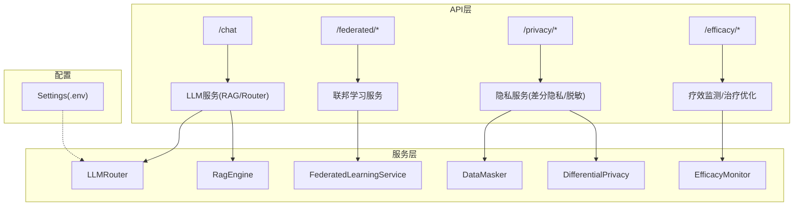
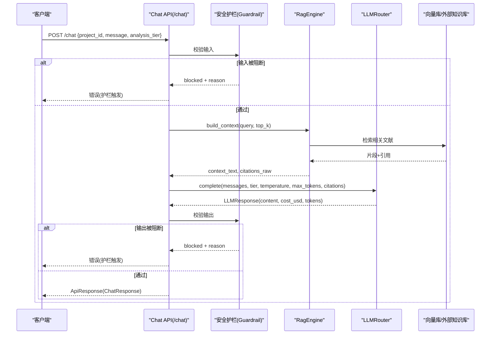
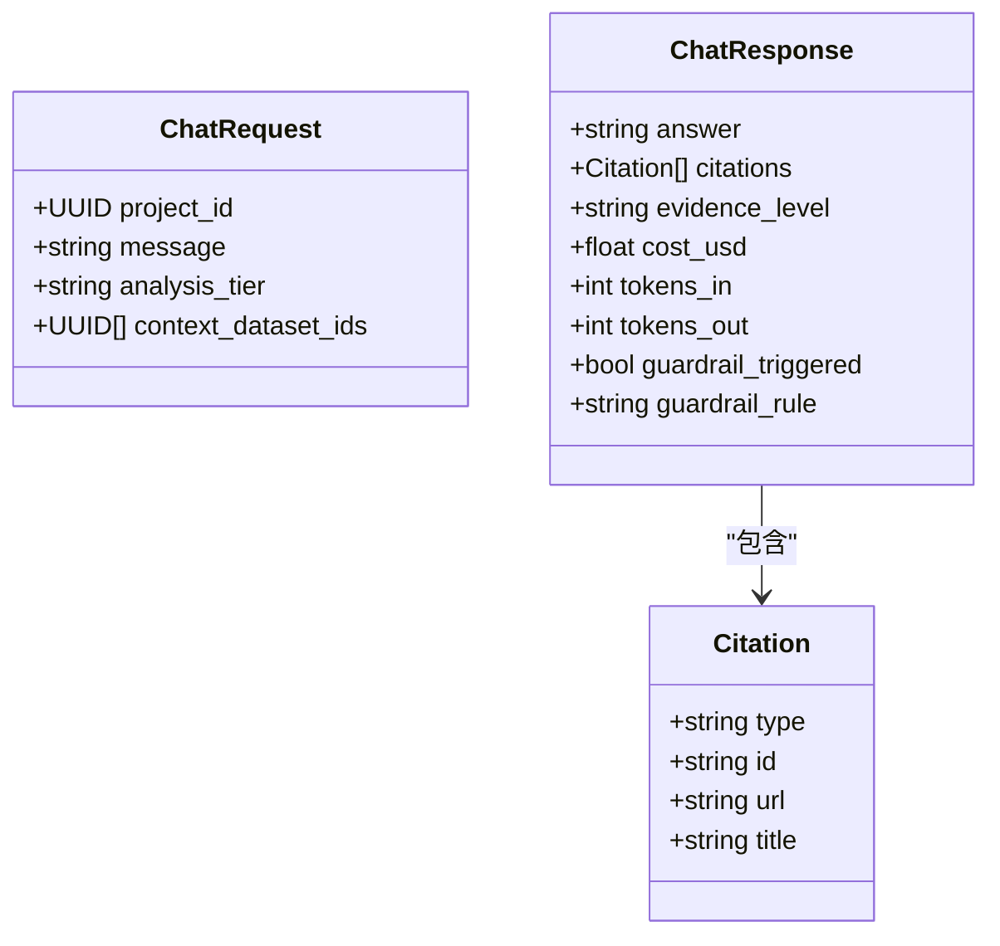
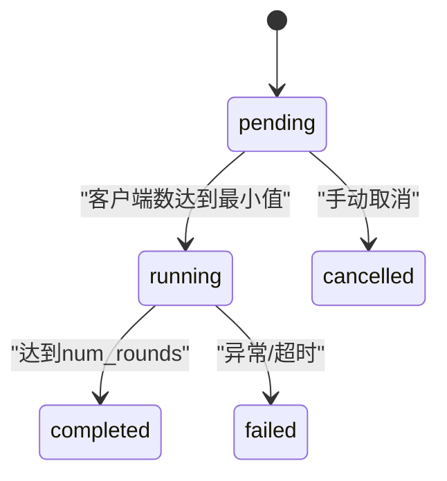
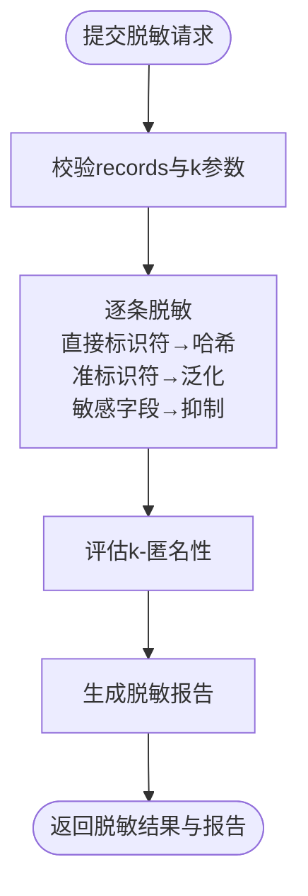
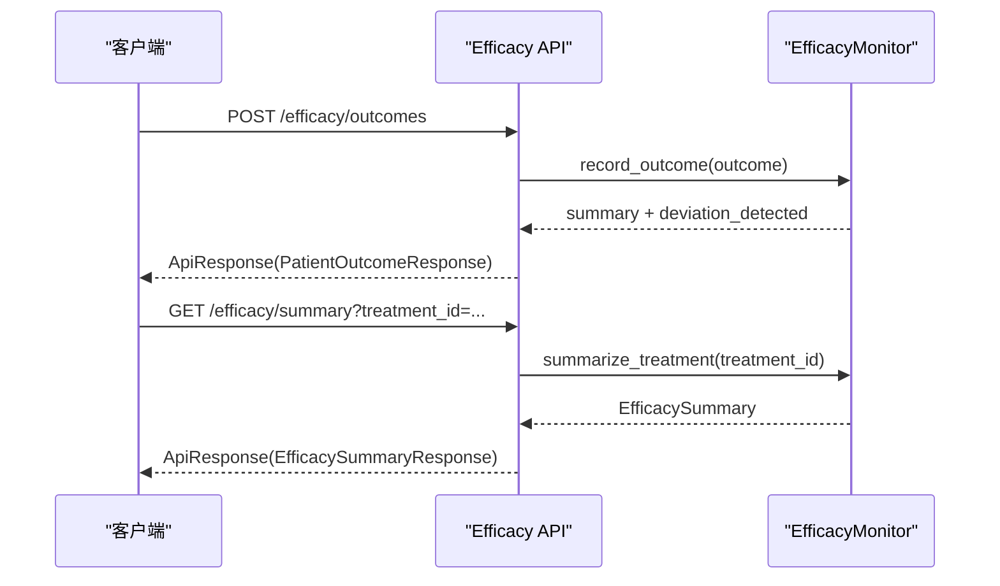
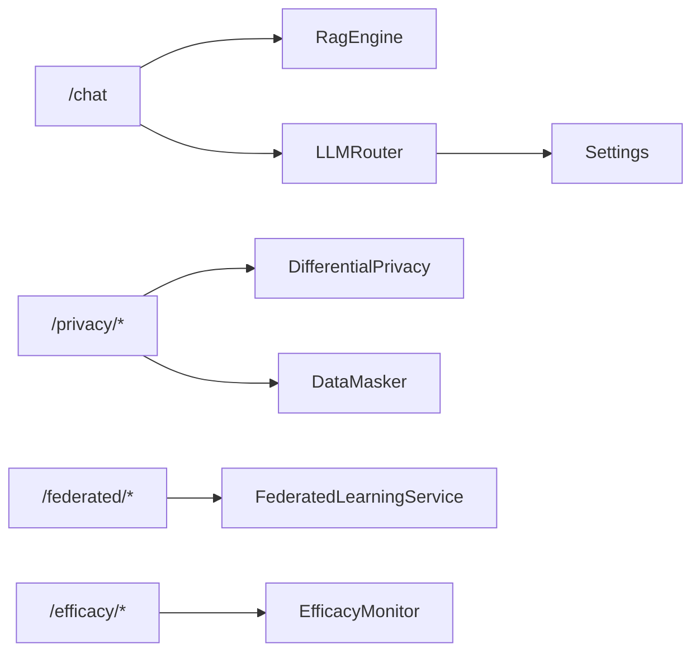

# 高级特性API

<cite>
**本文引用的文件**   
- [chat.py](file://backend/app/api/v1/chat.py)
- [federated.py](file://backend/app/api/v1/federated.py)
- [privacy.py](file://backend/app/api/v1/privacy.py)
- [efficacy.py](file://backend/app/api/v1/efficacy.py)
- [rag.py](file://backend/app/services/llm/rag.py)
- [router.py](file://backend/app/services/llm/router.py)
- [differential_privacy.py](file://backend/app/services/privacy/differential_privacy.py)
- [data_masker.py](file://backend/app/services/privacy/data_masker.py)
- [federated_learning.py](file://backend/app/services/optimizer/federated_learning.py)
- [efficacy_monitor.py](file://backend/app/services/optimizer/efficacy_monitor.py)
- [config.py](file://backend/app/core/config.py)
- [chat.py（schemas）](file://backend/app/schemas/chat.py)
- [federated.py（schemas）](file://backend/app/schemas/federated.py)
- [privacy.py（schemas）](file://backend/app/schemas/privacy.py)
- [efficacy.py（schemas）](file://backend/app/schemas/efficacy.py)
</cite>

## 目录
1. [简介](#简介)
2. [项目结构](#项目结构)
3. [核心组件](#核心组件)
4. [架构总览](#架构总览)
5. [详细组件分析](#详细组件分析)
6. [依赖关系分析](#依赖关系分析)
7. [性能考虑](#性能考虑)
8. [故障排查指南](#故障排查指南)
9. [结论](#结论)
10. [附录：接口清单与示例](#附录接口清单与示例)

## 简介
本文件面向“高级特性模块”的API文档，覆盖以下能力：
- AI智能问答：RAG检索增强、多模型路由、对话管理（含安全护栏与降级策略）
- 联邦学习：分布式训练任务编排、节点注册与管理、聚合指标追踪
- 隐私保护计算：差分隐私预算管理与噪声机制、数据脱敏（HIPAA Safe Harbor）、远程计算提交与结果查询
- 疗效监测：患者结局录入、不良事件上报、疗效汇总与Kaplan-Meier估计、治疗方案组合优化（Q-learning启发式）

文档同时说明复杂业务逻辑的接口设计、异步处理、状态管理、安全与性能考量、扩展机制，并提供高级用例与集成指导。

## 项目结构
后端采用FastAPI分层组织：
- API层：v1路由按领域划分（chat、federated、privacy、efficacy）
- 服务层：LLM（RAG、Router）、隐私（差分隐私、脱敏）、优化器（联邦学习、疗效监测）
- Schema层：Pydantic请求/响应模型定义
- 配置层：基于pydantic-settings的环境变量加载

图表来源
- [chat.py:1-177](file://backend/app/api/v1/chat.py#L1-L177)
- [federated.py:1-133](file://backend/app/api/v1/federated.py#L1-L133)
- [privacy.py:1-177](file://backend/app/api/v1/privacy.py#L1-L177)
- [efficacy.py:1-347](file://backend/app/api/v1/efficacy.py#L1-L347)
- [rag.py:1-238](file://backend/app/services/llm/rag.py#L1-L238)
- [router.py:1-198](file://backend/app/services/llm/router.py#L1-L198)
- [federated_learning.py:1-199](file://backend/app/services/optimizer/federated_learning.py#L1-L199)
- [efficacy_monitor.py:1-407](file://backend/app/services/optimizer/efficacy_monitor.py#L1-L407)
- [config.py:1-144](file://backend/app/core/config.py#L1-L144)

章节来源
- [chat.py:1-177](file://backend/app/api/v1/chat.py#L1-L177)
- [federated.py:1-133](file://backend/app/api/v1/federated.py#L1-L133)
- [privacy.py:1-177](file://backend/app/api/v1/privacy.py#L1-L177)
- [efficacy.py:1-347](file://backend/app/api/v1/efficacy.py#L1-L347)
- [config.py:1-144](file://backend/app/core/config.py#L1-L144)

## 核心组件
- AI智能问答
  - 端点：POST /chat、GET /chat/history
  - 流程：输入安全护栏 → RAG构建上下文 → LLM多模型路由生成 → 输出安全护栏 → 返回结果或降级摘要
  - 关键服务：RagEngine、LLMRouter、Guardrail（在端点内导入）
- 联邦学习
  - 端点：POST /federated/jobs、GET /federated/jobs、GET /federated/jobs/{job_id}、POST /federated/jobs/{job_id}/stop、POST /federated/clients/register
  - 状态机：pending → running → completed（内存实现，生产替换为数据库+Flower）
- 隐私保护计算
  - 端点：POST /privacy/domains、POST /privacy/datasets、POST /privacy/compute、GET /privacy/results/{id}、POST /privacy/mask-data
  - 能力：差分隐私预算检查与噪声机制；HIPAA Safe Harbor脱敏；远程计算提交与结果查询
- 疗效监测
  - 端点：POST /efficacy/outcomes、POST /efficacy/adverse-events、GET /efficacy/summary、GET /efficacy/global-summary、POST /efficacy/kaplan-meier、POST /efficacy/treatment-optimization/optimize、POST /efficacy/treatment-optimization/q-update、POST /efficacy/mask-data
  - 能力：RECIST响应统计、CTCAE AE分级、KM生存估计、Q-learning组合优化

章节来源
- [chat.py:1-177](file://backend/app/api/v1/chat.py#L1-L177)
- [federated.py:1-133](file://backend/app/api/v1/federated.py#L1-L133)
- [privacy.py:1-177](file://backend/app/api/v1/privacy.py#L1-L177)
- [efficacy.py:1-347](file://backend/app/api/v1/efficacy.py#L1-L347)
- [rag.py:1-238](file://backend/app/services/llm/rag.py#L1-L238)
- [router.py:1-198](file://backend/app/services/llm/router.py#L1-L198)
- [differential_privacy.py:1-151](file://backend/app/services/privacy/differential_privacy.py#L1-L151)
- [data_masker.py:1-294](file://backend/app/services/privacy/data_masker.py#L1-L294)
- [federated_learning.py:1-199](file://backend/app/services/optimizer/federated_learning.py#L1-L199)
- [efficacy_monitor.py:1-407](file://backend/app/services/optimizer/efficacy_monitor.py#L1-L407)

## 架构总览
AI问答链路时序如下：

图表来源
- [chat.py:30-157](file://backend/app/api/v1/chat.py#L30-L157)
- [rag.py:211-238](file://backend/app/services/llm/rag.py#L211-L238)
- [router.py:92-171](file://backend/app/services/llm/router.py#L92-L171)

## 详细组件分析

### AI智能问答（RAG + 多模型路由 + 对话管理）
- 接口要点
  - POST /chat：支持analysis_tier控制top_k与max_tokens；失败时自动降级返回RAG摘要；返回cost_usd、tokens_in/out、guardrail信息
  - GET /chat/history：当前为占位，后续持久化
- 关键数据结构
  - ChatRequest/ChatResponse/Citation/GuardrailTriggeredResponse
- 处理逻辑
  - 输入/输出双重护栏；RAG检索（Chroma优先，Jaccard降级）；LLMRouter选择quick/deep模型并记录成本
- 异常与降级
  - GuardrailBlockedError直接上抛；LLM调用异常捕获后返回RAG摘要并标记degraded

图表来源
- [chat.py（schemas）:13-81](file://backend/app/schemas/chat.py#L13-L81)

章节来源
- [chat.py:1-177](file://backend/app/api/v1/chat.py#L1-L177)
- [rag.py:35-238](file://backend/app/services/llm/rag.py#L35-L238)
- [router.py:55-198](file://backend/app/services/llm/router.py#L55-L198)
- [chat.py（schemas）:1-81](file://backend/app/schemas/chat.py#L1-L81)

### 联邦学习（分布式训练、模型聚合、节点管理）
- 接口要点
  - 创建/列表/详情/停止任务；客户端注册并自动推进状态至running
  - 当前使用内存存储，生产需替换为数据库与Flower服务端
- 状态流转
  - pending → running → completed（或failed/cancelled）
- 聚合与指标
  - 聚合损失数组与轮次进度由API维护；实际聚合逻辑在服务层预留

图表来源
- [federated.py:35-133](file://backend/app/api/v1/federated.py#L35-L133)
- [federated_learning.py:53-199](file://backend/app/services/optimizer/federated_learning.py#L53-L199)

章节来源
- [federated.py:1-133](file://backend/app/api/v1/federated.py#L1-L133)
- [federated_learning.py:1-199](file://backend/app/services/optimizer/federated_learning.py#L1-L199)
- [federated.py（schemas）:1-63](file://backend/app/schemas/federated.py#L1-L63)

### 隐私保护计算（差分隐私、数据脱敏、安全多方计算）
- 接口要点
  - 隐私域创建与数据集注册；远程计算提交（带ε预算检查）；结果查询
  - 数据脱敏：直接标识符哈希、准标识符泛化、敏感字段抑制、k-匿名验证
- 差分隐私
  - Laplace/高斯/随机响应机制；预算追踪与剩余量查询
- 脱敏报告
  - 统计脱敏字段数量、k-匿名满足情况与违规项

图表来源
- [privacy.py:148-177](file://backend/app/api/v1/privacy.py#L148-L177)
- [data_masker.py:126-294](file://backend/app/services/privacy/data_masker.py#L126-L294)

章节来源
- [privacy.py:1-177](file://backend/app/api/v1/privacy.py#L1-L177)
- [differential_privacy.py:1-151](file://backend/app/services/privacy/differential_privacy.py#L1-L151)
- [data_masker.py:1-294](file://backend/app/services/privacy/data_masker.py#L1-L294)
- [privacy.py（schemas）:1-84](file://backend/app/schemas/privacy.py#L1-L84)

### 疗效监测（结局、AE、KM估计、方案优化）
- 接口要点
  - 录入患者结局与不良事件；获取某方案/全局汇总；Kaplan-Meier估计
  - 治疗方案组合优化：候选靶点+协同矩阵→Pareto前沿与Top组合；Q值更新
- 业务规则
  - RECIST响应类别；CTCAE等级≥3判定严重AE；ORR/DCR/PFS/OS统计；异常检测阈值告警

图表来源
- [efficacy.py:62-163](file://backend/app/api/v1/efficacy.py#L62-L163)
- [efficacy_monitor.py:114-268](file://backend/app/services/optimizer/efficacy_monitor.py#L114-L268)

章节来源
- [efficacy.py:1-347](file://backend/app/api/v1/efficacy.py#L1-L347)
- [efficacy_monitor.py:1-407](file://backend/app/services/optimizer/efficacy_monitor.py#L1-L407)
- [efficacy.py（schemas）:1-170](file://backend/app/schemas/efficacy.py#L1-L170)

## 依赖关系分析
- 组件耦合
  - API层仅依赖Schema与服务层入口，保持低耦合
  - LLMRouter依赖配置（模型名、预算），RagEngine依赖Chroma（可降级）
  - 隐私与疗效服务均为纯函数式/内存态，便于测试与替换
- 外部依赖
  - litellm（可选，未安装抛出明确错误）
  - chromadb（可选，未安装降级为内存关键词检索）
  - 外部知识库URL由配置提供（PubMed/Chembl等）

图表来源
- [chat.py:1-177](file://backend/app/api/v1/chat.py#L1-L177)
- [privacy.py:1-177](file://backend/app/api/v1/privacy.py#L1-L177)
- [federated.py:1-133](file://backend/app/api/v1/federated.py#L1-L133)
- [efficacy.py:1-347](file://backend/app/api/v1/efficacy.py#L1-L347)
- [rag.py:1-238](file://backend/app/services/llm/rag.py#L1-L238)
- [router.py:1-198](file://backend/app/services/llm/router.py#L1-L198)
- [differential_privacy.py:1-151](file://backend/app/services/privacy/differential_privacy.py#L1-L151)
- [data_masker.py:1-294](file://backend/app/services/privacy/data_masker.py#L1-L294)
- [federated_learning.py:1-199](file://backend/app/services/optimizer/federated_learning.py#L1-L199)
- [efficacy_monitor.py:1-407](file://backend/app/services/optimizer/efficacy_monitor.py#L1-L407)
- [config.py:1-144](file://backend/app/core/config.py#L1-L144)

章节来源
- [config.py:1-144](file://backend/app/core/config.py#L1-L144)

## 性能考虑
- 异步与并发
  - FastAPI默认异步处理，长耗时推理建议结合后台任务队列（如Celery/RQ）以释放连接
- 缓存与索引
  - RAG检索命中Chroma时应建立合适的索引与分块策略；对高频查询可引入Redis缓存
- 资源与预算
  - LLMRouter内置预算检查与费用估算，建议在生产环境设置合理日预算与快速/深度分层限额
- I/O与降级
  - Chroma/litellm不可用时均有降级路径，避免单点故障导致整体不可用

[本节为通用指导，不直接分析具体文件]

## 故障排查指南
- 常见错误
  - 护栏触发：输入/输出被阻断，查看details中的rule与reason
  - LLM不可用：返回degraded=true的RAG摘要，检查OPENAI_API_KEY/ANTHROPIC_API_KEY与网络连通性
  - 隐私预算不足：差分隐私预算耗尽，需调整budget_epsilon或降低epsilon
  - 任务不存在：联邦/隐私计算ID无效，确认上游创建成功
- 定位方法
  - 关注meta.request_id用于全链路追踪
  - 查看日志中“降级”“预算不足”“未安装”等关键字
  - 核对环境变量与配置项是否生效

章节来源
- [chat.py:120-157](file://backend/app/api/v1/chat.py#L120-L157)
- [privacy.py:105-117](file://backend/app/api/v1/privacy.py#L105-L117)
- [federated.py:84-102](file://backend/app/api/v1/federated.py#L84-L102)
- [router.py:115-140](file://backend/app/services/llm/router.py#L115-L140)

## 结论
本高级特性模块以清晰的API分层与可扩展的服务实现，支撑AI智能问答、联邦学习、隐私保护与疗效监测四大场景。通过RAG与多模型路由提升回答质量与可控性；通过差分隐私与脱敏保障合规；通过联邦学习与疗效监测促进跨机构协作与临床价值闭环。建议在下一阶段完成持久化、任务队列与监控告警，进一步提升稳定性与可观测性。

[本节为总结，不直接分析具体文件]

## 附录：接口清单与示例

### AI智能问答
- POST /chat
  - 请求体：ChatRequest（project_id、message、analysis_tier、context_dataset_ids）
  - 响应：ApiResponse[ChatResponse]（answer、citations、cost_usd、tokens_in/out、guardrail信息）
  - 行为：输入/输出护栏、RAG检索、LLM路由、失败降级
- GET /chat/history
  - 查询参数：project_id
  - 响应：ApiResponse[list]（当前为空，后续持久化）

章节来源
- [chat.py:30-177](file://backend/app/api/v1/chat.py#L30-L177)
- [chat.py（schemas）:22-81](file://backend/app/schemas/chat.py#L22-L81)

### 联邦学习
- POST /federated/jobs
  - 请求体：FederatedJobCreate（name、model_arch、num_rounds、min_clients、config）
  - 响应：ApiResponse[FederatedJobResponse]
- GET /federated/jobs
  - 查询参数：status（可选）
  - 响应：ApiResponse[list[FederatedJobResponse]]
- GET /federated/jobs/{job_id}
  - 响应：ApiResponse[FederatedJobResponse]
- POST /federated/jobs/{job_id}/stop
  - 响应：ApiResponse[FederatedJobResponse]
- POST /federated/clients/register
  - 请求体：ClientRegisterRequest（job_id、client_name、client_url、data_size）
  - 响应：ApiResponse[ClientRegisterResponse]

章节来源
- [federated.py:35-133](file://backend/app/api/v1/federated.py#L35-L133)
- [federated.py（schemas）:13-63](file://backend/app/schemas/federated.py#L13-L63)

### 隐私保护计算
- POST /privacy/domains
  - 请求体：PrivacyDomainCreate（name、description、owner_id、budget_epsilon）
  - 响应：ApiResponse[PrivacyDomainResponse]
- POST /privacy/datasets
  - 请求体：PrivacyDatasetRegister（domain_id、name、schema、mock_data、real_data_ref）
  - 响应：ApiResponse[PrivacyDatasetResponse]
- POST /privacy/compute
  - 请求体：ComputeRequest（domain_id、dataset_name、code、epsilon）
  - 响应：ApiResponse[ComputeResultResponse]（202接受）
- GET /privacy/results/{request_id}
  - 响应：ApiResponse[ComputeResultResponse]
- POST /privacy/mask-data
  - 请求体：DataMaskingRequest（records、k_anonymity）
  - 响应：ApiResponse[DataMaskingResponse]

章节来源
- [privacy.py:47-177](file://backend/app/api/v1/privacy.py#L47-L177)
- [privacy.py（schemas）:14-84](file://backend/app/schemas/privacy.py#L14-L84)
- [efficacy.py（schemas）:152-170](file://backend/app/schemas/efficacy.py#L152-L170)

### 疗效监测
- POST /efficacy/outcomes
  - 请求体：PatientOutcomeRequest（patient_id、treatment_id、response、response_date、progression_free_days、overall_survival_days、tumor_shrinkage_pct、notes）
  - 响应：ApiResponse[PatientOutcomeResponse]
- POST /efficacy/adverse-events
  - 请求体：AdverseEventRequest（patient_id、event_name、grade、causality、onset_date、resolution_date、action_taken）
  - 响应：ApiResponse[AdverseEventResponse]
- GET /efficacy/summary
  - 查询参数：treatment_id
  - 响应：ApiResponse[EfficacySummaryResponse]
- GET /efficacy/global-summary
  - 响应：ApiResponse[GlobalEfficacySummaryResponse]
- POST /efficacy/kaplan-meier
  - 请求体：{treatment_id, metric="pfs|os"}
  - 响应：ApiResponse[KaplanMeierResponse]
- POST /efficacy/treatment-optimization/optimize
  - 请求体：TreatmentOptimizationRequest（candidates、combo_sizes、max_results、synergy_matrix）
  - 响应：ApiResponse[TreatmentOptimizationResponse]
- POST /efficacy/treatment-optimization/q-update
  - 请求体：QValueUpdateRequest（targets、reward、learning_rate）
  - 响应：ApiResponse[QValueUpdateResponse]
- POST /efficacy/mask-data
  - 请求体：DataMaskingRequest（records、k_anonymity）
  - 响应：ApiResponse[DataMaskingResponse]

章节来源
- [efficacy.py:62-347](file://backend/app/api/v1/efficacy.py#L62-L347)
- [efficacy.py（schemas）:12-170](file://backend/app/schemas/efficacy.py#L12-L170)

### 高级用例与集成指导
- 端到端问答
  - 步骤：构造ChatRequest（指定analysis_tier）→ 调用/ chat → 解析ChatResponse.answer与citations → 若guardrail_triggered则提示用户修改问题
  - 注意：当LLM不可用时，返回degraded=true，应提示用户改用RAG摘要
- 联邦学习协作
  - 步骤：创建任务→各机构注册客户端→等待connected_clients≥min_clients→任务进入running→轮次完成后completed
  - 注意：生产环境需接入Flower服务端与持久化存储
- 隐私合规计算
  - 步骤：创建隐私域→注册数据集→提交compute（确保epsilon不超过剩余预算）→轮询results/{id}获取结果
  - 注意：预算耗尽将拒绝请求；脱敏需满足k-匿名要求
- 疗效闭环
  - 步骤：录入结局与AE→查询summary/global-summary→必要时进行KM估计→基于Q-learning优化组合方案
  - 注意：严重AE与低疗效将触发异常检测，建议暂停入组复核

[本节为操作指引，不直接分析具体文件]