# API集成开发

<cite>
**本文引用的文件**   
- [frontend/api_client.py](file://frontend/api_client.py)
- [frontend/auth.py](file://frontend/auth.py)
- [backend/app/main.py](file://backend/app/main.py)
- [backend/app/api/v1/auth.py](file://backend/app/api/v1/auth.py)
- [backend/app/core/security.py](file://backend/app/core/security.py)
- [backend/app/utils/http_client.py](file://backend/app/utils/http_client.py)
- [backend/app/api/v1/data.py](file://backend/app/api/v1/data.py)
- [backend/app/api/v1/chat.py](file://backend/app/api/v1/chat.py)
</cite>

## 目录
1. [简介](#简介)
2. [项目结构](#项目结构)
3. [核心组件](#核心组件)
4. [架构总览](#架构总览)
5. [详细组件分析](#详细组件分析)
6. [依赖关系分析](#依赖关系分析)
7. [性能考虑](#性能考虑)
8. [故障排查指南](#故障排查指南)
9. [结论](#结论)
10. [附录](#附录)

## 简介
本指南面向AI药物设计系统的前端开发者，聚焦于前端与后端API的集成实践。内容涵盖：
- API客户端封装、请求头注入、响应信封解包
- 认证令牌管理（登录/注册/刷新）、会话状态同步
- 数据缓存策略（TTL时间桶）与连接池复用
- RESTful调用模式、文件上传下载、异步任务处理
- 错误处理最佳实践与调试建议
- 并发控制与重试机制（前后端侧）
- WebSocket实时通信说明与扩展建议

## 项目结构
前端采用Streamlit应用，通过统一的API客户端访问后端FastAPI服务；后端提供统一信封响应、CORS、中间件追踪等能力。

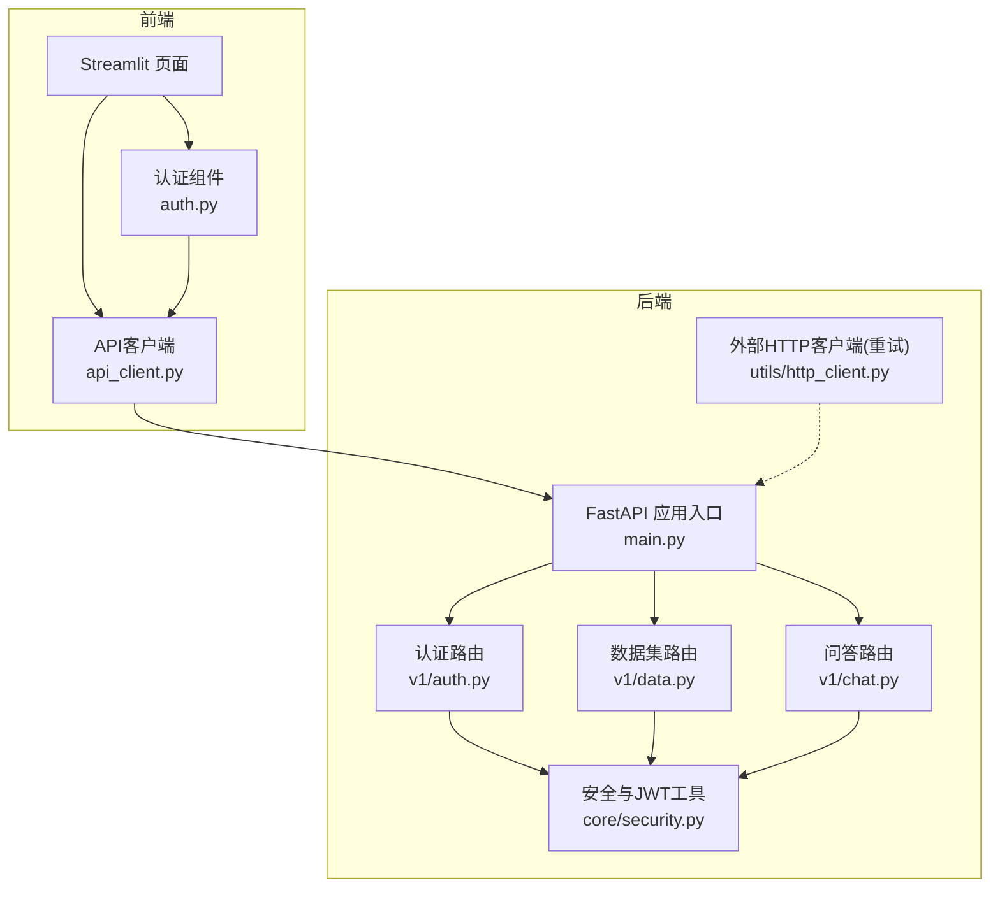

图表来源
- [frontend/api_client.py:1-251](file://frontend/api_client.py#L1-L251)
- [frontend/auth.py:1-137](file://frontend/auth.py#L1-L137)
- [backend/app/main.py:1-248](file://backend/app/main.py#L1-L248)
- [backend/app/api/v1/auth.py:1-147](file://backend/app/api/v1/auth.py#L1-L147)
- [backend/app/core/security.py:1-211](file://backend/app/core/security.py#L1-L211)
- [backend/app/utils/http_client.py:1-113](file://backend/app/utils/http_client.py#L1-L113)
- [backend/app/api/v1/data.py:1-369](file://backend/app/api/v1/data.py#L1-L369)
- [backend/app/api/v1/chat.py:1-177](file://backend/app/api/v1/chat.py#L1-L177)

章节来源
- [frontend/api_client.py:1-251](file://frontend/api_client.py#L1-L251)
- [backend/app/main.py:1-248](file://backend/app/main.py#L1-L248)

## 核心组件
- API客户端（前端）
  - 统一错误处理、自动注入Authorization头、响应信封解包
  - 共享httpx.Client连接池复用，提升并发性能
  - 带TTL的时间桶缓存机制，减少重复请求
  - 独立Client用于文件上传，避免影响主连接池
- 认证组件（前端）
  - 登录/注册表单，保存access_token、refresh_token到session_state
  - 用户菜单与登出清理
- 后端统一信封与中间件
  - EnvelopeMiddleware注入X-Request-ID、X-Response-Time-ms，并在meta中追加duration_ms
  - CORS配置暴露追踪头
- 认证与安全（后端）
  - JWT access/refresh token生成与校验
  - OAuth2 bearer提取器与角色守卫
- 外部HTTP客户端（后端）
  - 指数退避重试、超时、错误包装为上游异常

章节来源
- [frontend/api_client.py:1-251](file://frontend/api_client.py#L1-L251)
- [frontend/auth.py:1-137](file://frontend/auth.py#L1-L137)
- [backend/app/main.py:1-248](file://backend/app/main.py#L1-L248)
- [backend/app/core/security.py:1-211](file://backend/app/core/security.py#L1-L211)
- [backend/app/utils/http_client.py:1-113](file://backend/app/utils/http_client.py#L1-L113)

## 架构总览
下图展示从前端到后端的完整交互链路，包括认证、REST调用、文件上传与中间件增强。

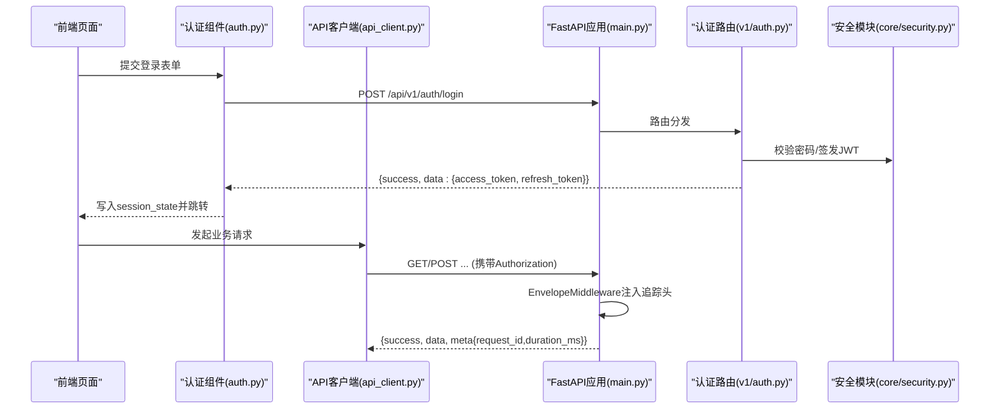

图表来源
- [frontend/auth.py:1-137](file://frontend/auth.py#L1-L137)
- [frontend/api_client.py:1-251](file://frontend/api_client.py#L1-L251)
- [backend/app/main.py:1-248](file://backend/app/main.py#L1-L248)
- [backend/app/api/v1/auth.py:1-147](file://backend/app/api/v1/auth.py#L1-L147)
- [backend/app/core/security.py:1-211](file://backend/app/core/security.py#L1-L211)

## 详细组件分析

### API客户端封装（前端）
- 设计要点
  - 使用共享httpx.Client并通过@st.cache_resource缓存，设置合理的超时与连接限制
  - 自动在请求头注入Authorization（Bearer），未显式传入token时从session_state读取
  - _unwrap统一解析后端信封格式，对非2xx或success=false抛出运行时异常
  - upload方法使用独立Client以支持multipart/form-data上传，避免污染连接池
  - cached_get基于TTL时间桶实现可失效缓存，key包含token与base_url隔离不同用户
- 关键流程
  - 初始化：确定base_url与token，获取共享Client
  - 构建请求头：Content-Type + Authorization
  - 发送请求：get/post/put/delete/upload
  - 解包响应：错误转异常，成功返回data字段
  - 缓存：按path+params+token+base_url+ttl_bucket作为键

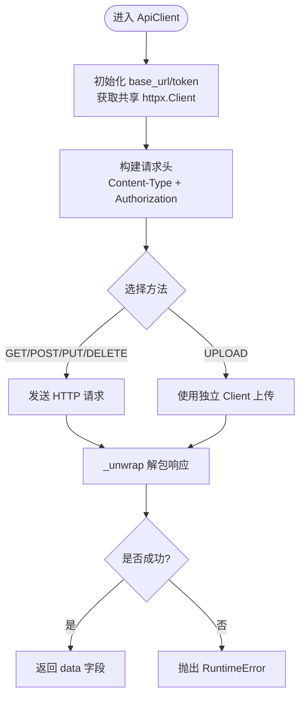

图表来源
- [frontend/api_client.py:1-251](file://frontend/api_client.py#L1-L251)

章节来源
- [frontend/api_client.py:1-251](file://frontend/api_client.py#L1-L251)

### 认证与令牌管理（前后端）
- 前端登录/注册
  - 登录：调用POST /api/v1/auth/login，成功后将access_token、refresh_token、user_email写入session_state
  - 注册：POST /api/v1/auth/register，成功后提示切换至登录
  - 登出：清除session_state中的相关字段
- 后端认证路由
  - login：校验用户与密码，签发access与refresh token，返回ApiResponse[data=TokenResponse]
  - refresh：用refresh token换取新的access与refresh token
  - me：返回当前用户信息（需鉴权）
- 安全模块
  - create_access_token/create_refresh_token：生成JWT，含sub、exp、type、jti等声明
  - decode_token：校验签名与过期，缺失必要声明抛错
  - get_current_user_id/get_current_user_role：从Authorization头提取并校验token

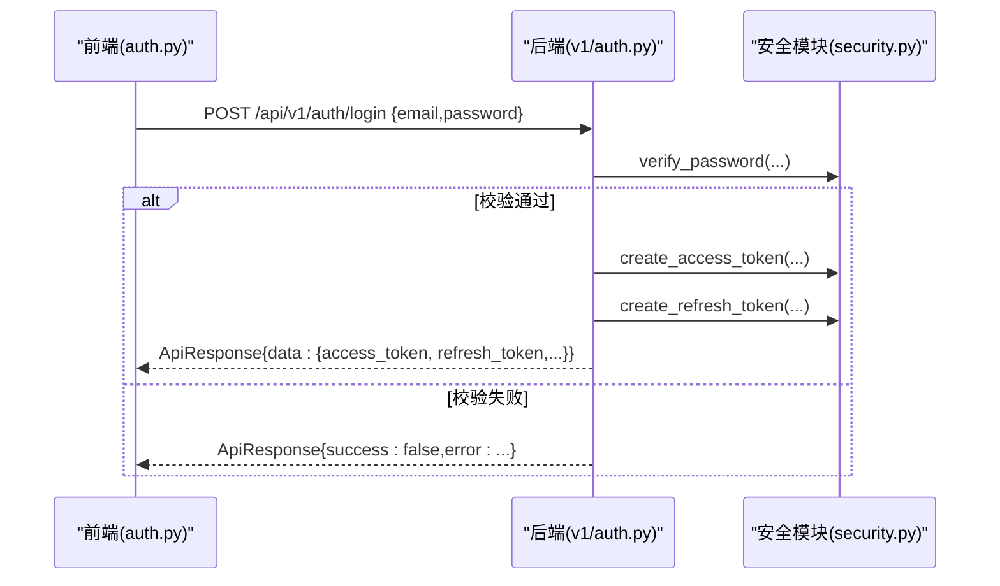

图表来源
- [frontend/auth.py:1-137](file://frontend/auth.py#L1-L137)
- [backend/app/api/v1/auth.py:1-147](file://backend/app/api/v1/auth.py#L1-L147)
- [backend/app/core/security.py:1-211](file://backend/app/core/security.py#L1-L211)

章节来源
- [frontend/auth.py:1-137](file://frontend/auth.py#L1-L137)
- [backend/app/api/v1/auth.py:1-147](file://backend/app/api/v1/auth.py#L1-L147)
- [backend/app/core/security.py:1-211](file://backend/app/core/security.py#L1-L211)

### 数据缓存策略（前端）
- 时间桶TTL机制
  - 计算ttl_bucket = int(time.time() // max(ttl, 1))
  - 将token、base_url、path、params序列化后作为缓存键的一部分
  - 当时间桶变化时，函数被重新执行，达到“自然过期”的效果
- 缓存清理
  - invalidate_cache支持清空全部缓存；前缀过滤在当前实现中仍会清空全部缓存

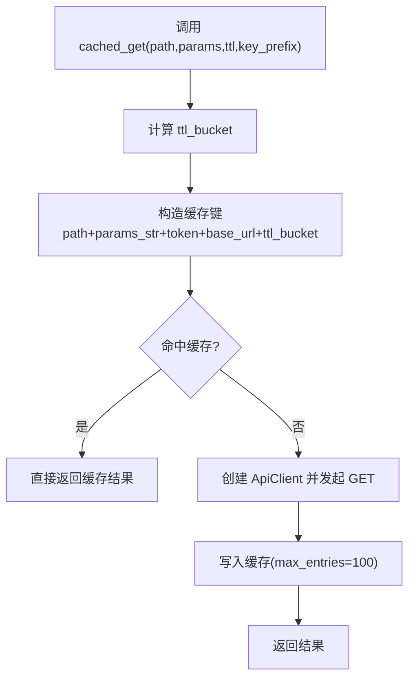

图表来源
- [frontend/api_client.py:186-236](file://frontend/api_client.py#L186-L236)

章节来源
- [frontend/api_client.py:186-236](file://frontend/api_client.py#L186-L236)

### 文件上传与下载（前后端）
- 前端上传
  - 使用ApiClient.upload(path,file,extra_data)，内部以独立httpx.Client发送multipart/form-data
  - 适用于数据集上传等场景
- 后端上传接口
  - POST /api/v1/datasets/upload
  - 接收file、project_id、name、data_type、metadata等表单字段
  - 校验扩展名与数据类型，计算文件大小与sha256，落盘并记录元数据
  - 返回ApiResponse[DatasetUploadResponse]

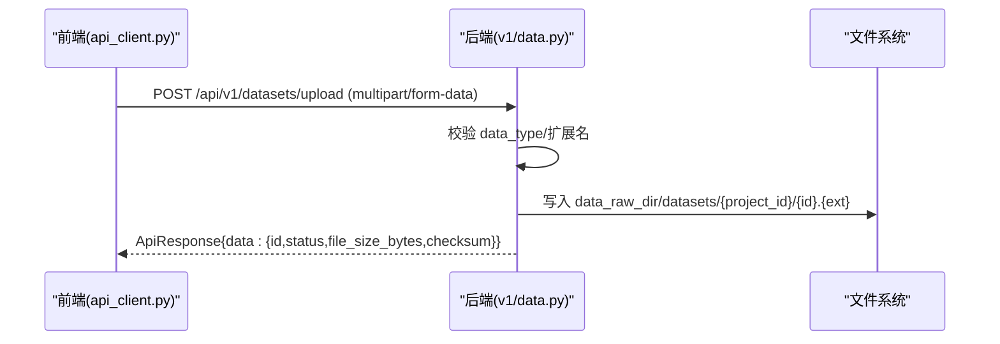

图表来源
- [frontend/api_client.py:136-162](file://frontend/api_client.py#L136-L162)
- [backend/app/api/v1/data.py:54-121](file://backend/app/api/v1/data.py#L54-L121)

章节来源
- [frontend/api_client.py:136-162](file://frontend/api_client.py#L136-L162)
- [backend/app/api/v1/data.py:54-121](file://backend/app/api/v1/data.py#L54-L121)

### 异步任务与进度查询（示例：数据处理）
- 触发处理
  - POST /api/v1/datasets/{dataset_id}/process
  - 根据data_type执行相应处理逻辑（如scRNA-seq预处理），更新status与metadata_
  - 返回202与task_id，便于前端轮询或后续扩展WebSocket推送
- 查询结果
  - GET /api/v1/datasets/{dataset_id}/umap、markers、quality等接口读取已缓存结果

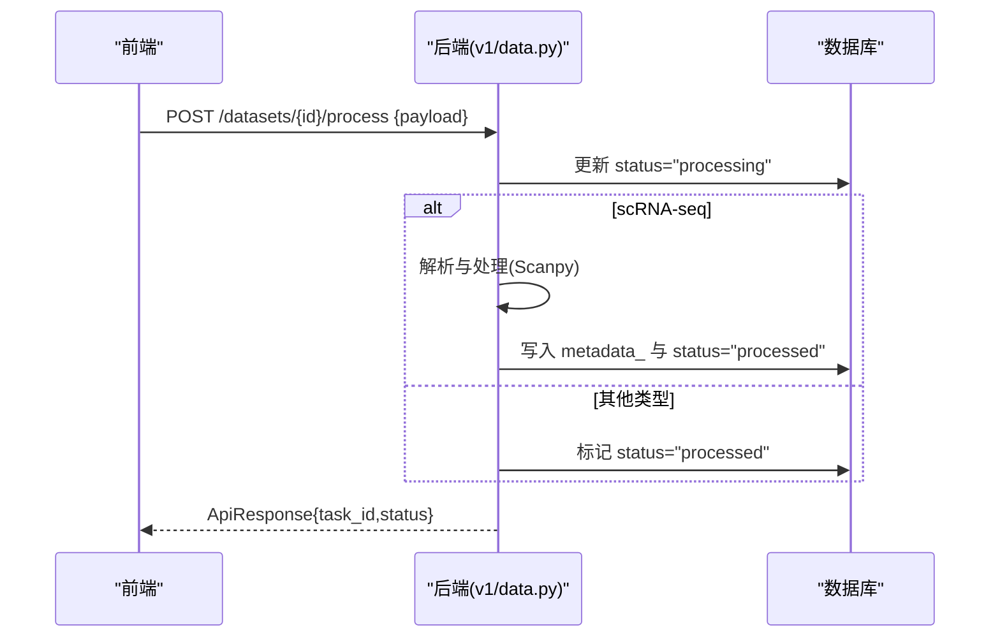

图表来源
- [backend/app/api/v1/data.py:191-254](file://backend/app/api/v1/data.py#L191-L254)

章节来源
- [backend/app/api/v1/data.py:191-254](file://backend/app/api/v1/data.py#L191-L254)

### 统一信封与中间件（后端）
- EnvelopeMiddleware职责
  - 解析或生成X-Request-ID并回写scope headers
  - 计算耗时并写入响应头X-Response-Time-ms
  - 对200且application/json且含meta的响应体注入duration_ms
  - 流式响应分片透传，不重写start消息
- CORS与文档
  - 允许跨域，暴露追踪头
  - 提供/docs与/redoc文档

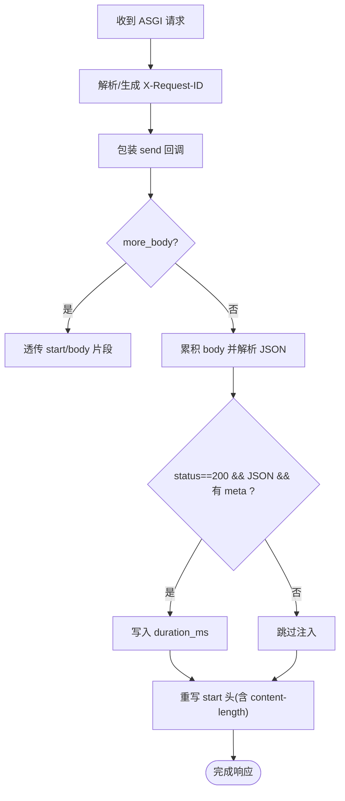

图表来源
- [backend/app/main.py:29-185](file://backend/app/main.py#L29-L185)

章节来源
- [backend/app/main.py:29-185](file://backend/app/main.py#L29-L185)

### 外部HTTP客户端重试（后端）
- HttpClient特性
  - 指数退避重试（仅对5xx与连接/超时异常）
  - 统一超时与默认头合并
  - 将异常包装为UpstreamError，附带url与最后错误信息
- 适用场景
  - 调用第三方知识库（MyGene/ChEMBL/PubMed）或LLM服务

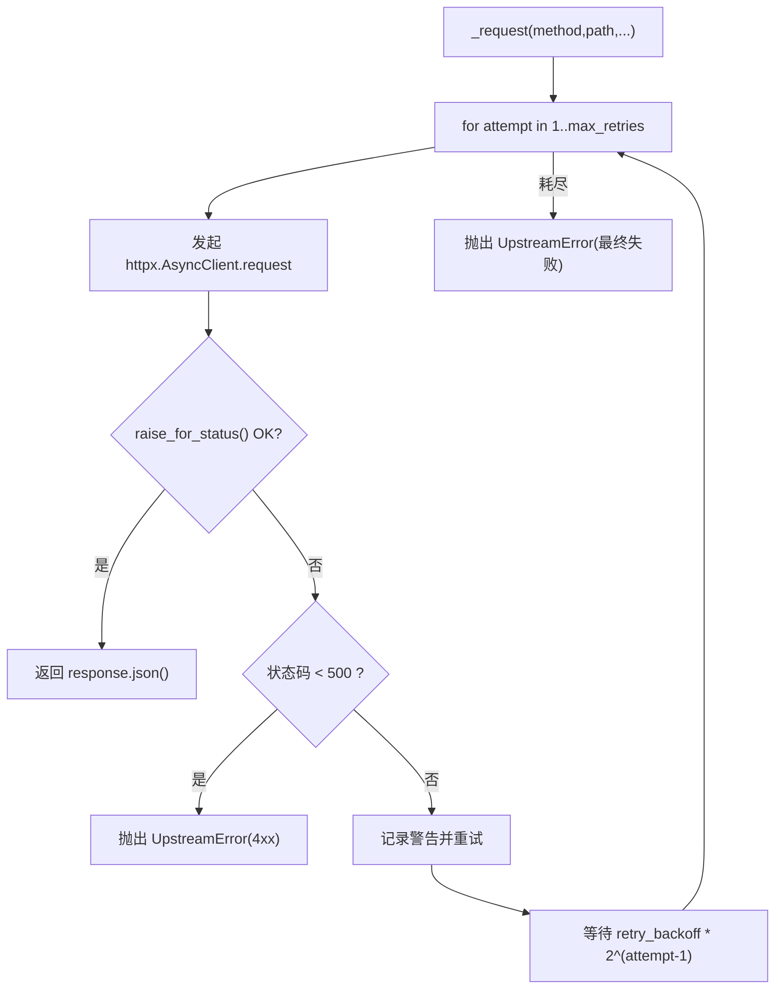

图表来源
- [backend/app/utils/http_client.py:60-112](file://backend/app/utils/http_client.py#L60-L112)

章节来源
- [backend/app/utils/http_client.py:60-112](file://backend/app/utils/http_client.py#L60-L112)

### 自然语言问答（示例：RAG+LLM）
- 流程
  - 输入安全护栏检查 → RAG检索上下文 → LLM生成回答 → 输出安全护栏检查 → 返回ApiResponse
  - LLM不可用时降级返回RAG摘要，meta.degraded=true
- 前端集成建议
  - 使用ApiClient.post调用/chat，捕获异常并友好提示
  - 若需要流式输出，可在后端扩展SSE/WebSocket，前端适配事件流

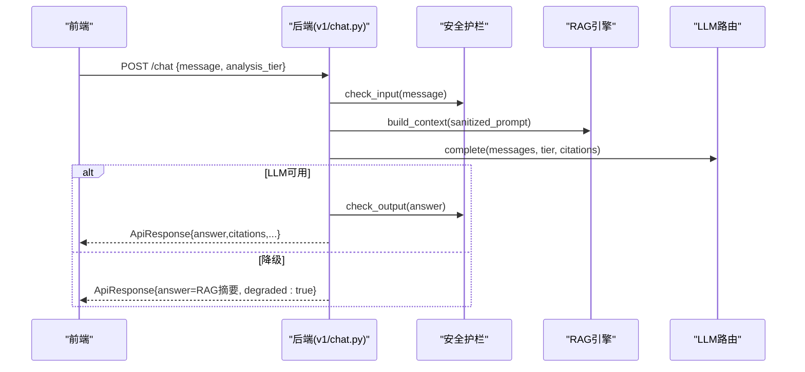

图表来源
- [backend/app/api/v1/chat.py:30-157](file://backend/app/api/v1/chat.py#L30-L157)

章节来源
- [backend/app/api/v1/chat.py:30-157](file://backend/app/api/v1/chat.py#L30-L157)

### WebSocket实时通信（扩展建议）
- 现状
  - 当前代码未实现WebSocket端点
- 建议方案
  - 在后端新增WebSocket路由，用于长任务进度推送（如数据处理、模型训练）
  - 前端可使用原生WebSocket或轻量库订阅事件，结合session_state中的用户标识进行鉴权
  - 与现有中间件保持一致的请求追踪（可将X-Request-ID传递到WS握手阶段）

[本节为概念性说明，不涉及具体源码文件]

## 依赖关系分析
- 前端依赖
  - api_client.py依赖httpx与streamlit
  - auth.py依赖api_client与httpx
- 后端依赖
  - main.py依赖fastapi、starlette中间件、loguru
  - v1/auth.py依赖security、deps、schemas
  - v1/data.py依赖models、schemas、settings
  - utils/http_client.py依赖httpx与自定义异常

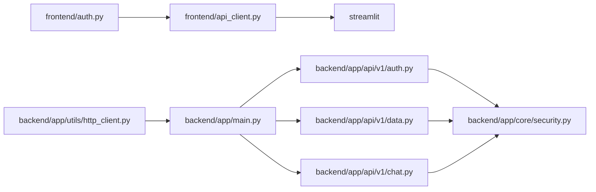

图表来源
- [frontend/api_client.py:1-251](file://frontend/api_client.py#L1-L251)
- [frontend/auth.py:1-137](file://frontend/auth.py#L1-L137)
- [backend/app/main.py:1-248](file://backend/app/main.py#L1-L248)
- [backend/app/api/v1/auth.py:1-147](file://backend/app/api/v1/auth.py#L1-L147)
- [backend/app/api/v1/data.py:1-369](file://backend/app/api/v1/data.py#L1-L369)
- [backend/app/api/v1/chat.py:1-177](file://backend/app/api/v1/chat.py#L1-L177)
- [backend/app/core/security.py:1-211](file://backend/app/core/security.py#L1-L211)
- [backend/app/utils/http_client.py:1-113](file://backend/app/utils/http_client.py#L1-L113)

章节来源
- [frontend/api_client.py:1-251](file://frontend/api_client.py#L1-L251)
- [backend/app/main.py:1-248](file://backend/app/main.py#L1-L248)

## 性能考虑
- 连接池复用
  - 前端共享httpx.Client，设置最大连接数与keepalive，降低握手开销
- 请求级缓存
  - 使用TTL时间桶与st.cache_data，减少重复网络请求
- 超时与重试
  - 前端合理设置connect/read超时
  - 后端对外部服务调用采用指数退避重试，避免雪崩
- 中间件优化
  - 仅在非流式JSON响应上注入meta，避免额外开销
- 并发控制
  - 前端页面内避免同时发起过多相同请求，利用缓存去重
  - 后端可通过限流中间件或队列控制热点接口并发

[本节为通用指导，不涉及具体源码文件]

## 故障排查指南
- 常见问题
  - 登录失败：检查邮箱/密码、后端是否启动、CORS配置是否正确
  - 401/403：确认Authorization头是否携带有效access token，角色权限是否足够
  - 上传失败：检查data_type与文件扩展名是否在白名单，文件大小与存储路径权限
  - 缓存未更新：确认TTL是否过短或invalidate_cache是否生效
- 调试建议
  - 查看响应头X-Request-ID与X-Response-Time-ms定位慢请求
  - 使用/docs或/redoc验证接口契约
  - 对于外部服务失败，关注UpstreamError详情与重试日志

章节来源
- [backend/app/main.py:215-227](file://backend/app/main.py#L215-L227)
- [backend/app/utils/http_client.py:81-112](file://backend/app/utils/http_client.py#L81-L112)
- [backend/app/api/v1/data.py:72-102](file://backend/app/api/v1/data.py#L72-L102)

## 结论
通过统一的API客户端封装、健壮的错误处理、可配置的缓存策略以及后端中间件的追踪增强，前端能够高效、稳定地集成AI药物设计系统的各项能力。建议在后续版本中补充WebSocket实时通信与更细粒度的缓存失效策略，进一步提升用户体验与系统可观测性。

## 附录
- RESTful调用示例（路径参考）
  - 登录：POST /api/v1/auth/login
  - 刷新令牌：POST /api/v1/auth/refresh
  - 获取当前用户：GET /api/v1/auth/me
  - 上传数据集：POST /api/v1/datasets/upload
  - 列表数据集：GET /api/v1/datasets
  - 触发处理：POST /api/v1/datasets/{dataset_id}/process
  - 查询UMAP：GET /api/v1/datasets/{dataset_id}/umap
  - 查询标志基因：GET /api/v1/datasets/{dataset_id}/markers
  - 质量报告：GET /api/v1/datasets/{dataset_id}/quality
  - 删除数据集：DELETE /api/v1/datasets/{dataset_id}
  - 自然语言问答：POST /api/v1/chat

章节来源
- [backend/app/api/v1/auth.py:41-147](file://backend/app/api/v1/auth.py#L41-L147)
- [backend/app/api/v1/data.py:54-369](file://backend/app/api/v1/data.py#L54-L369)
- [backend/app/api/v1/chat.py:30-177](file://backend/app/api/v1/chat.py#L30-L177)