# UI组件库

<cite>
**本文引用的文件**   
- [frontend/app.py](file://precision-drug-design/frontend/app.py)
- [frontend/api_client.py](file://precision-drug-design/frontend/api_client.py)
- [frontend/auth.py](file://precision-drug-design/frontend/auth.py)
- [frontend/pages/1_📁_项目管理.py](file://precision-drug-design/frontend/pages/1_📁_项目管理.py)
- [frontend/pages/2_🧬_数据集.py](file://precision-drug-design/frontend/pages/2_🧬_数据集.py)
- [frontend/pages/3_🎯_靶点发现.py](file://precision-drug-design/frontend/pages/3_🎯_靶点发现.py)
- [frontend/pages/4_⚙️_分子评估.py](file://precision-drug-design/frontend/pages/4_⚙️_分子评估.py)
- [frontend/pages/5_📊_报告查看.py](file://precision-drug-design/frontend/pages/5_📊_报告查看.py)
- [frontend/pages/7_🤖_AI问答.py](file://precision-drug-design/frontend/pages/7_🤖_AI问答.py)
- [frontend/pages/8_🌐_联邦学习.py](file://precision-drug-design/frontend/pages/8_🌐_联邦学习.py)
- [frontend/pages/10_📈_系统监控.py](file://precision-drug-design/frontend/pages/10_📈_系统监控.py)
- [frontend/requirements.txt](file://precision-drug-design/frontend/requirements.txt)
</cite>

## 目录
1. [简介](#简介)
2. [项目结构](#项目结构)
3. [核心组件](#核心组件)
4. [架构总览](#架构总览)
5. [详细组件分析](#详细组件分析)
6. [依赖关系分析](#依赖关系分析)
7. [性能与可维护性](#性能与可维护性)
8. [故障排查指南](#故障排查指南)
9. [结论](#结论)
10. [附录：组件使用示例与扩展指南](#附录组件使用示例与扩展指南)

## 简介
本文件为“AI药物设计系统”的UI组件库文档，聚焦于基于 Streamlit 的前端实现。内容涵盖：
- 自定义组件的设计模式与复用策略
- 样式定制与主题适配方法
- 数据表格、图表可视化、表单输入、文件上传、进度显示等核心UI组件的使用与组合
- 属性配置、事件处理、响应式布局、错误提示与状态管理
- 组件一致性规范与可维护性建议
- 典型页面中的组合模式与扩展开发指南

## 项目结构
前端采用 Streamlit 多页面应用组织方式，入口页负责全局侧边栏导航与首页渲染；各业务页面以独立文件存在，统一通过认证与API客户端进行交互。

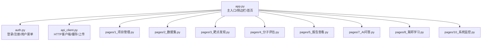

图示来源
- [frontend/app.py:35-64](file://precision-drug-design/frontend/app.py#L35-L64)
- [frontend/auth.py:10-137](file://precision-drug-design/frontend/auth.py#L10-L137)
- [frontend/api_client.py:24-167](file://precision-drug-design/frontend/api_client.py#L24-L167)

章节来源
- [frontend/app.py:1-157](file://precision-drug-design/frontend/app.py#L1-L157)
- [frontend/requirements.txt:1-3](file://precision-drug-design/frontend/requirements.txt#L1-L3)

## 核心组件
本节从“组件化”视角抽象出跨页面复用的UI能力，并给出在现有代码中的落地位置与用法要点。

- 认证与用户菜单
  - 功能：登录/注册表单、用户信息展示、登出清理会话
  - 关键位置：[登录/注册表单:10-114](file://precision-drug-design/frontend/auth.py#L10-L114)、[用户菜单:116-128](file://precision-drug-design/frontend/auth.py#L116-L128)
  - 复用策略：在各页面顶部调用统一渲染函数，保证一致体验

- API客户端与请求封装
  - 功能：连接池复用、统一错误解包、JWT注入、流式上传、请求级缓存
  - 关键位置：[ApiClient类:42-167](file://precision-drug-design/frontend/api_client.py#L42-L167)、[缓存GET:186-236](file://precision-drug-design/frontend/api_client.py#L186-L236)
  - 复用策略：页面内通过 get_client()/cached_get() 获取实例或数据，避免重复网络开销

- 侧边栏与页面导航
  - 功能：根据登录态动态渲染导航项、快捷入口
  - 关键位置：[侧边栏渲染](file://precision-drug-design/frontend/app.py:43-64)、[首页快速入口](file://precision-drug-design/frontend/app.py:136-146)
  - 复用策略：所有页面共享同一套导航逻辑，便于统一调整

- 数据表格（列表）
  - 功能：分页列表、展开详情、操作按钮、指标卡片
  - 关键位置：[项目管理列表:64-130](file://precision-drug-design/frontend/pages/1_📁_项目管理.py#L64-L130)、[报告列表:27-58](file://precision-drug-design/frontend/pages/5_📊_报告查看.py#L27-L58)
  - 复用策略：将“加载-空态-列表-操作”流程抽象为通用函数，参数化字段映射与动作回调

- 图表可视化
  - 功能：指标卡片、分布概览、JSON结构化数据展示
  - 关键位置：[靶点发现概览统计:108-113](file://precision-drug-design/frontend/pages/3_🎯_靶点发现.py#L108-L113)、[报告证据等级分布:79-86](file://precision-drug-design/frontend/pages/5_📊_报告查看.py#L79-L86)
  - 复用策略：以列+指标卡片的组合替代复杂图表，保持轻量与稳定

- 表单输入
  - 功能：文本输入、选择框、滑块、文本域、提交按钮
  - 关键位置：[创建项目表单:27-62](file://precision-drug-design/frontend/pages/1_📁_项目管理.py#L27-L62)、[分子评估表单:31-74](file://precision-drug-design/frontend/pages/4_⚙️_分子评估.py#L31-L74)
  - 复用策略：统一使用 st.form 包裹，集中校验与提交，减少状态分散

- 文件上传
  - 功能：多类型文件选择、附加元数据、上传进度与结果反馈
  - 关键位置：[数据集上传:27-68](file://precision-drug-design/frontend/pages/2_🧬_数据集.py#L27-L68)
  - 复用策略：封装 upload 流程，统一错误提示与成功反馈

- 进度显示
  - 功能：任务进度条、轮次指示、状态图标
  - 关键位置：[联邦学习任务进度:100-108](file://precision-drug-design/frontend/pages/8_🌐_联邦学习.py#L100-L108)
  - 复用策略：将“当前轮次/总轮次”计算为进度值，配合状态枚举渲染图标

- 聊天界面
  - 功能：消息历史、引用源折叠、证据等级标注、清空历史
  - 关键位置：[聊天渲染:40-111](file://precision-drug-design/frontend/pages/7_🤖_AI问答.py#L40-L111)
  - 复用策略：以 session_state 维护历史，统一消息结构与引用格式

章节来源
- [frontend/auth.py:10-137](file://precision-drug-design/frontend/auth.py#L10-L137)
- [frontend/api_client.py:42-167](file://precision-drug-design/frontend/api_client.py#L42-L167)
- [frontend/app.py:43-64](file://precision-drug-design/frontend/app.py#L43-L64)
- [frontend/pages/1_📁_项目管理.py:64-130](file://precision-drug-design/frontend/pages/1_📁_项目管理.py#L64-L130)
- [frontend/pages/5_📊_报告查看.py:27-58](file://precision-drug-design/frontend/pages/5_📊_报告查看.py#L27-L58)
- [frontend/pages/3_🎯_靶点发现.py:108-113](file://precision-drug-design/frontend/pages/3_🎯_靶点发现.py#L108-L113)
- [frontend/pages/4_⚙️_分子评估.py:31-74](file://precision-drug-design/frontend/pages/4_⚙️_分子评估.py#L31-L74)
- [frontend/pages/2_🧬_数据集.py:27-68](file://precision-drug-design/frontend/pages/2_🧬_数据集.py#L27-L68)
- [frontend/pages/8_🌐_联邦学习.py:100-108](file://precision-drug-design/frontend/pages/8_🌐_联邦学习.py#L100-L108)
- [frontend/pages/7_🤖_AI问答.py:40-111](file://precision-drug-design/frontend/pages/7_🤖_AI问答.py#L40-L111)

## 架构总览
整体架构由“页面层 + 认证层 + API客户端层”构成，页面层通过认证层完成鉴权，通过API客户端层访问后端REST服务，并使用Streamlit内置组件完成UI渲染。

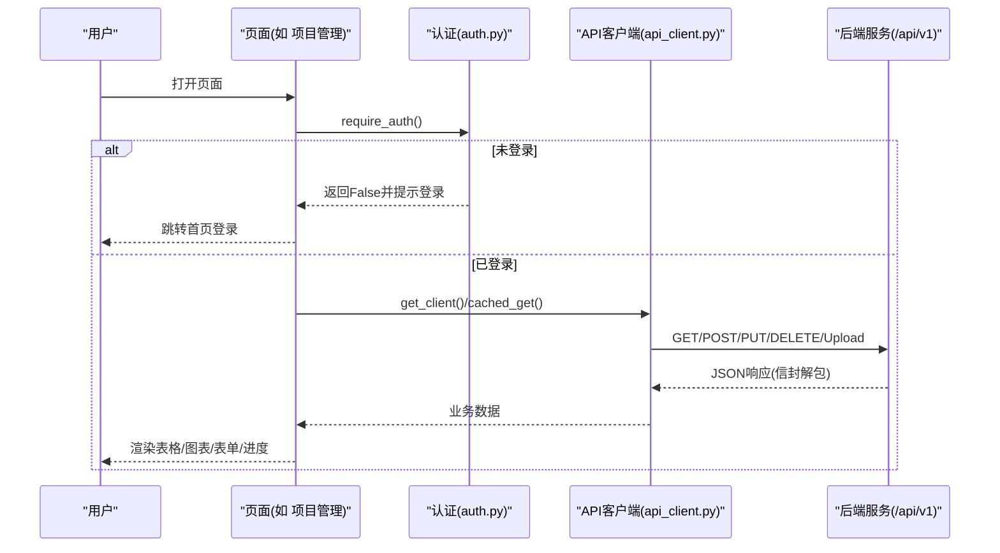

图示来源
- [frontend/pages/1_📁_项目管理.py:19-24](file://precision-drug-design/frontend/pages/1_📁_项目管理.py#L19-L24)
- [frontend/auth.py:170-180](file://precision-drug-design/frontend/auth.py#L170-L180)
- [frontend/api_client.py:96-167](file://precision-drug-design/frontend/api_client.py#L96-L167)

## 详细组件分析

### 认证与用户菜单组件
- 职责：提供登录/注册表单、用户信息展示、登出清理
- 关键行为：
  - 登录成功后写入 access_token/refresh_token/user_email 到 session_state
  - 用户菜单支持一键登出并刷新页面
- 错误处理：对HTTP错误进行友好提示，区分登录失败与连接异常

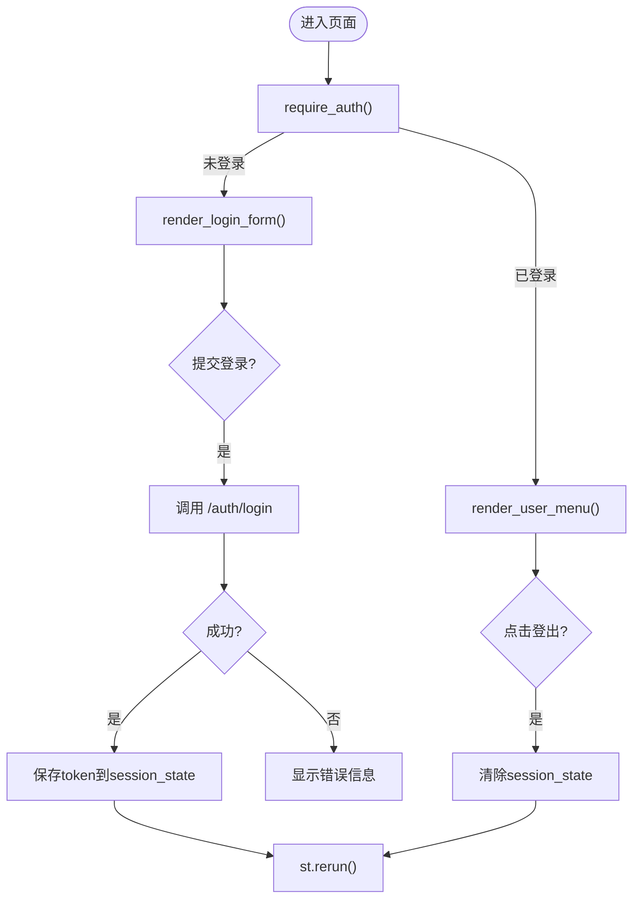

图示来源
- [frontend/auth.py:10-114](file://precision-drug-design/frontend/auth.py#L10-L114)
- [frontend/auth.py:116-128](file://precision-drug-design/frontend/auth.py#L116-L128)
- [frontend/api_client.py:170-180](file://precision-drug-design/frontend/api_client.py#L170-L180)

章节来源
- [frontend/auth.py:10-137](file://precision-drug-design/frontend/auth.py#L10-L137)

### API客户端组件
- 职责：封装HTTP请求、统一错误解包、JWT注入、连接池复用、上传、缓存
- 关键行为：
  - _get_http_client 使用 @st.cache_resource 复用连接池
  - ApiClient._unwrap 解析后端信封 {success, data, meta}
  - cached_get 使用 TTL 时间桶机制控制缓存失效
- 错误处理：对HTTP状态码与JSON错误体进行规范化处理

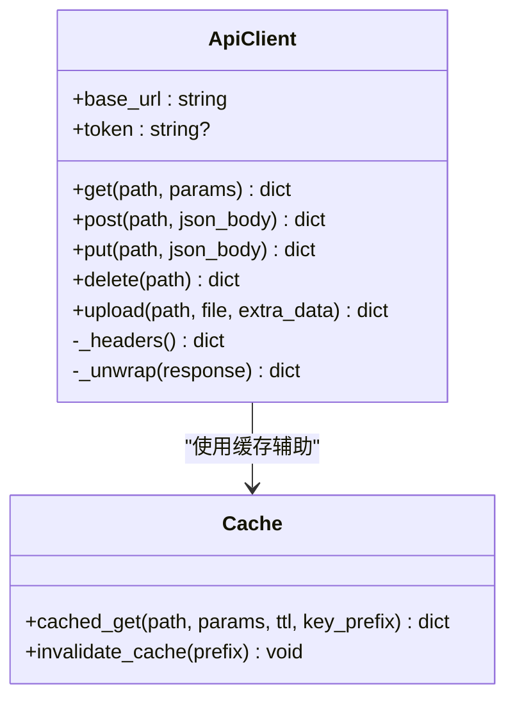

图示来源
- [frontend/api_client.py:24-40](file://precision-drug-design/frontend/api_client.py#L24-L40)
- [frontend/api_client.py:42-167](file://precision-drug-design/frontend/api_client.py#L42-L167)
- [frontend/api_client.py:186-236](file://precision-drug-design/frontend/api_client.py#L186-L236)

章节来源
- [frontend/api_client.py:24-167](file://precision-drug-design/frontend/api_client.py#L24-L167)
- [frontend/api_client.py:186-236](file://precision-drug-design/frontend/api_client.py#L186-L236)

### 数据表格组件（列表）
- 职责：分页加载、空态提示、列表展开、操作按钮、指标展示
- 关键行为：
  - 使用 cached_get 拉取列表数据，TTL=30s
  - 使用 st.expander 展示详情，避免首屏过重
  - 操作按钮触发后更新缓存并 rerun
- 错误处理：加载失败时显示错误提示并中止渲染

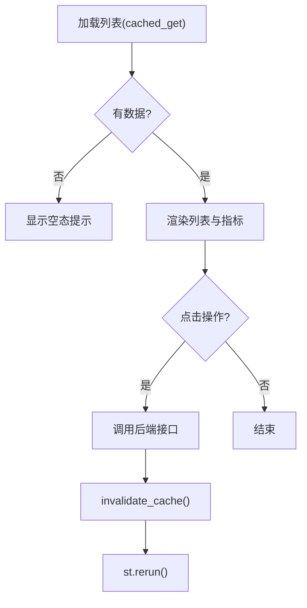

图示来源
- [frontend/pages/1_📁_项目管理.py:64-130](file://precision-drug-design/frontend/pages/1_📁_项目管理.py#L64-L130)
- [frontend/pages/5_📊_报告查看.py:27-58](file://precision-drug-design/frontend/pages/5_📊_报告查看.py#L27-L58)

章节来源
- [frontend/pages/1_📁_项目管理.py:64-130](file://precision-drug-design/frontend/pages/1_📁_项目管理.py#L64-L130)
- [frontend/pages/5_📊_报告查看.py:27-58](file://precision-drug-design/frontend/pages/5_📊_报告查看.py#L27-L58)

### 图表可视化组件（指标与分布）
- 职责：以指标卡片与分布概览呈现关键数据
- 关键行为：
  - 使用 st.columns 与 st.metric 组合展示
  - 对分类数据（如证据等级）进行计数与展示
- 错误处理：当数据缺失时显示占位符或提示信息

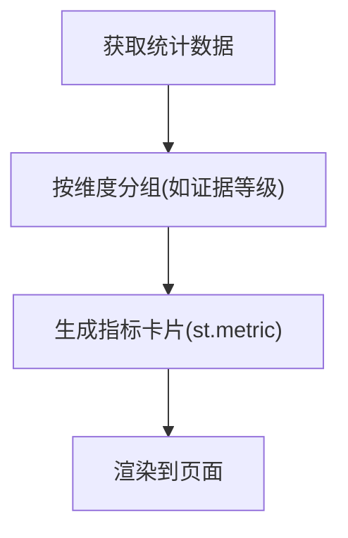

图示来源
- [frontend/pages/3_🎯_靶点发现.py:108-113](file://precision-drug-design/frontend/pages/3_🎯_靶点发现.py#L108-L113)
- [frontend/pages/5_📊_报告查看.py:79-86](file://precision-drug-design/frontend/pages/5_📊_报告查看.py#L79-L86)

章节来源
- [frontend/pages/3_🎯_靶点发现.py:108-113](file://precision-drug-design/frontend/pages/3_🎯_靶点发现.py#L108-L113)
- [frontend/pages/5_📊_报告查看.py:79-86](file://precision-drug-design/frontend/pages/5_📊_报告查看.py#L79-L86)

### 表单输入组件
- 职责：收集用户输入、执行校验、提交至后端
- 关键行为：
  - 使用 st.form 包裹，集中提交
  - 必填校验与格式校验在前端完成
  - 提交后显示成功/失败提示，必要时刷新页面
- 错误处理：对空输入、格式错误、网络异常分别提示

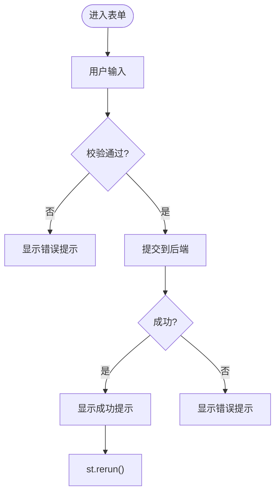

图示来源
- [frontend/pages/1_📁_项目管理.py:27-62](file://precision-drug-design/frontend/pages/1_📁_项目管理.py#L27-L62)
- [frontend/pages/4_⚙️_分子评估.py:31-74](file://precision-drug-design/frontend/pages/4_⚙️_分子评估.py#L31-L74)

章节来源
- [frontend/pages/1_📁_项目管理.py:27-62](file://precision-drug-design/frontend/pages/1_📁_项目管理.py#L27-L62)
- [frontend/pages/4_⚙️_分子评估.py:31-74](file://precision-drug-design/frontend/pages/4_⚙️_分子评估.py#L31-L74)

### 文件上传组件
- 职责：选择文件、附加元数据、上传至后端、反馈结果
- 关键行为：
  - 使用 st.file_uploader 限制文件类型
  - 通过 ApiClient.upload 发送 multipart/form-data
  - 上传完成后显示结果并允许继续操作
- 错误处理：对上传失败进行错误提示

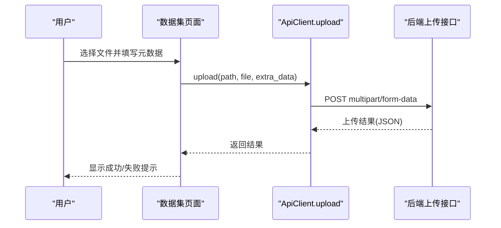

图示来源
- [frontend/pages/2_🧬_数据集.py:27-68](file://precision-drug-design/frontend/pages/2_🧬_数据集.py#L27-L68)
- [frontend/api_client.py:136-162](file://precision-drug-design/frontend/api_client.py#L136-L162)

章节来源
- [frontend/pages/2_🧬_数据集.py:27-68](file://precision-drug-design/frontend/pages/2_🧬_数据集.py#L27-L68)
- [frontend/api_client.py:136-162](file://precision-drug-design/frontend/api_client.py#L136-L162)

### 进度显示组件
- 职责：展示任务进度与状态
- 关键行为：
  - 使用 st.progress 显示当前轮次占比
  - 使用状态图标与文案描述当前状态
- 错误处理：当数据不可用时显示占位或提示

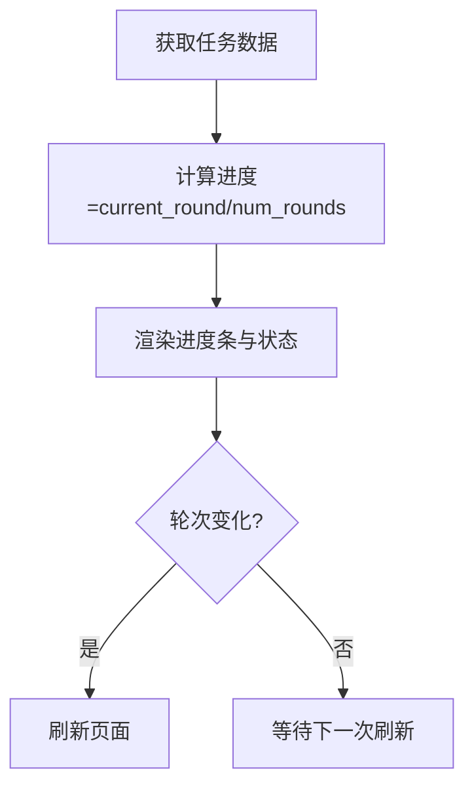

图示来源
- [frontend/pages/8_🌐_联邦学习.py:100-108](file://precision-drug-design/frontend/pages/8_🌐_联邦学习.py#L100-L108)

章节来源
- [frontend/pages/8_🌐_联邦学习.py:100-108](file://precision-drug-design/frontend/pages/8_🌐_联邦学习.py#L100-L108)

### 聊天界面组件
- 职责：展示对话历史、引用源、证据等级
- 关键行为：
  - 使用 st.chat_message 渲染用户与助手消息
  - 引用源使用 st.expander 折叠展示
  - 使用 session_state 维护历史
- 错误处理：对问答失败进行提示，并提供配置指引

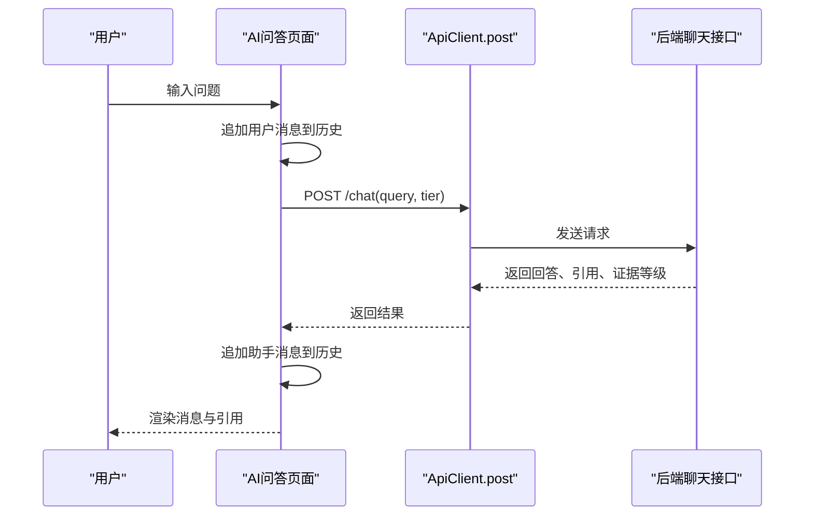

图示来源
- [frontend/pages/7_🤖_AI问答.py:40-111](file://precision-drug-design/frontend/pages/7_🤖_AI问答.py#L40-L111)

章节来源
- [frontend/pages/7_🤖_AI问答.py:40-111](file://precision-drug-design/frontend/pages/7_🤖_AI问答.py#L40-L111)

## 依赖关系分析
- 外部依赖
  - streamlit>=1.30.0：UI框架
  - httpx>=0.25.0：HTTP客户端
- 内部依赖
  - 页面依赖 auth 与 api_client
  - 页面之间通过 session_state 传递状态（如聊天历史、选中目标）

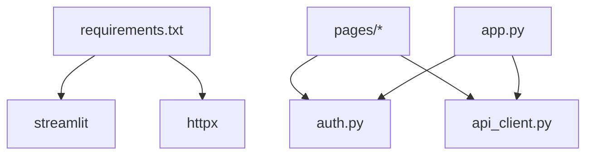

图示来源
- [frontend/requirements.txt:1-3](file://precision-drug-design/frontend/requirements.txt#L1-L3)
- [frontend/app.py:30-34](file://precision-drug-design/frontend/app.py#L30-L34)
- [frontend/pages/1_📁_项目管理.py:12-15](file://precision-drug-design/frontend/pages/1_📁_项目管理.py#L12-L15)

章节来源
- [frontend/requirements.txt:1-3](file://precision-drug-design/frontend/requirements.txt#L1-L3)
- [frontend/app.py:30-34](file://precision-drug-design/frontend/app.py#L30-L34)
- [frontend/pages/1_📁_项目管理.py:12-15](file://precision-drug-design/frontend/pages/1_📁_项目管理.py#L12-L15)

## 性能与可维护性
- 性能优化
  - 连接池复用：通过 @st.cache_resource 复用 httpx.Client，减少握手开销
  - 请求级缓存：cached_get 使用 TTL 时间桶控制缓存失效，降低重复请求
  - 首屏轻量化：使用 st.expander 延迟加载详情，提升首屏渲染速度
- 可维护性
  - 统一错误处理：ApiClient._unwrap 标准化错误信息，便于前端统一提示
  - 统一认证检查：require_auth 确保受保护页面的一致性鉴权流程
  - 组件化渲染：将登录/注册、用户菜单、列表、表单等抽取为函数，提高复用度

章节来源
- [frontend/api_client.py:24-40](file://precision-drug-design/frontend/api_client.py#L24-L40)
- [frontend/api_client.py:186-236](file://precision-drug-design/frontend/api_client.py#L186-L236)
- [frontend/pages/1_📁_项目管理.py:64-130](file://precision-drug-design/frontend/pages/1_📁_项目管理.py#L64-L130)
- [frontend/auth.py:170-180](file://precision-drug-design/frontend/auth.py#L170-L180)

## 故障排查指南
- 登录失败
  - 现象：提示“登录失败”或“连接失败”
  - 排查：确认后端地址是否正确、账号密码是否有效、网络连通性
  - 参考：[登录表单与错误处理:10-114](file://precision-drug-design/frontend/auth.py#L10-L114)
- 列表加载失败
  - 现象：页面显示“加载失败”
  - 排查：检查缓存键前缀与TTL设置、后端接口可用性、权限令牌
  - 参考：[项目管理列表加载:64-76](file://precision-drug-design/frontend/pages/1_📁_项目管理.py#L64-L76)
- 上传失败
  - 现象：提示“上传失败”
  - 排查：确认文件类型与大小、附加元数据完整性、后端上传接口
  - 参考：[数据集上传:27-68](file://precision-drug-design/frontend/pages/2_🧬_数据集.py#L27-L68)
- 问答失败
  - 现象：提示“问答失败”，并给出配置提示
  - 排查：确认LLM API Key配置、模型路由与护栏策略
  - 参考：[AI问答错误处理:108-111](file://precision-drug-design/frontend/pages/7_🤖_AI问答.py#L108-L111)

章节来源
- [frontend/auth.py:10-114](file://precision-drug-design/frontend/auth.py#L10-L114)
- [frontend/pages/1_📁_项目管理.py:64-76](file://precision-drug-design/frontend/pages/1_📁_项目管理.py#L64-L76)
- [frontend/pages/2_🧬_数据集.py:27-68](file://precision-drug-design/frontend/pages/2_🧬_数据集.py#L27-L68)
- [frontend/pages/7_🤖_AI问答.py:108-111](file://precision-drug-design/frontend/pages/7_🤖_AI问答.py#L108-L111)

## 结论
本UI组件库以Streamlit为基础，围绕认证、API客户端、表单、列表、进度、聊天等核心能力构建，强调复用性与一致性。通过统一的错误处理、连接池与缓存策略，兼顾性能与可维护性。建议在后续迭代中进一步抽象通用组件函数，完善主题与样式定制方案，并引入更丰富的可视化组件以满足复杂数据分析场景。

## 附录：组件使用示例与扩展指南
- 使用示例
  - 登录与导航：在任意受保护页面顶部调用 require_auth 与 render_user_menu
    - 参考：[项目管理页面入口:19-24](file://precision-drug-design/frontend/pages/1_📁_项目管理.py#L19-L24)
  - 列表加载与操作：使用 cached_get 获取数据，结合 st.expander 与 st.button 实现交互
    - 参考：[项目管理列表:64-130](file://precision-drug-design/frontend/pages/1_📁_项目管理.py#L64-L130)
  - 表单提交：使用 st.form 包裹输入控件，集中校验与提交
    - 参考：[创建项目表单:27-62](file://precision-drug-design/frontend/pages/1_📁_项目管理.py#L27-L62)
  - 文件上传：使用 st.file_uploader 与 ApiClient.upload 完成上传
    - 参考：[数据集上传:27-68](file://precision-drug-design/frontend/pages/2_🧬_数据集.py#L27-L68)
  - 进度显示：根据 current_round/num_rounds 计算进度并渲染
    - 参考：[联邦学习进度:100-108](file://precision-drug-design/frontend/pages/8_🌐_联邦学习.py#L100-L108)
  - 聊天界面：维护 chat_history，渲染消息与引用
    - 参考：[AI问答聊天:40-111](file://precision-drug-design/frontend/pages/7_🤖_AI问答.py#L40-L111)

- 组合模式
  - 列表+表单：在页面左侧放置创建表单，右侧展示列表与操作
    - 参考：[项目管理左右分栏:132-137](file://precision-drug-design/frontend/pages/1_📁_项目管理.py#L132-L137)
  - 指标+详情：先展示关键指标，再使用展开面板展示详细信息
    - 参考：[报告详情:60-106](file://precision-drug-design/frontend/pages/5_📊_报告查看.py#L60-L106)

- 扩展开发指南
  - 新增页面
    - 在 pages 目录下新建文件，遵循命名规范与 set_page_config
    - 在 app.py 侧边栏添加 page_link
    - 参考：[侧边栏导航](file://precision-drug-design/frontend/app.py:43-L64)
  - 新增组件
    - 将通用逻辑抽取为函数（如 render_xxx），在多个页面复用
    - 统一错误提示与状态管理，保持用户体验一致
  - 主题与样式
    - 使用 Streamlit 内置主题与布局（wide、columns、expander）
    - 如需深度定制，可在 Streamlit 配置文件中调整主题与布局选项
    - 参考：[requirements.txt:1-3](file://precision-drug-design/frontend/requirements.txt#L1-L3)

章节来源
- [frontend/pages/1_📁_项目管理.py:19-24](file://precision-drug-design/frontend/pages/1_📁_项目管理.py#L19-L24)
- [frontend/pages/1_📁_项目管理.py:64-130](file://precision-drug-design/frontend/pages/1_📁_项目管理.py#L64-L130)
- [frontend/pages/1_📁_项目管理.py:27-62](file://precision-drug-design/frontend/pages/1_📁_项目管理.py#L27-L62)
- [frontend/pages/2_🧬_数据集.py:27-68](file://precision-drug-design/frontend/pages/2_🧬_数据集.py#L27-L68)
- [frontend/pages/8_🌐_联邦学习.py:100-108](file://precision-drug-design/frontend/pages/8_🌐_联邦学习.py#L100-L108)
- [frontend/pages/7_🤖_AI问答.py:40-111](file://precision-drug-design/frontend/pages/7_🤖_AI问答.py#L40-L111)
- [frontend/pages/1_📁_项目管理.py:132-137](file://precision-drug-design/frontend/pages/1_📁_项目管理.py#L132-L137)
- [frontend/pages/5_📊_报告查看.py:60-106](file://precision-drug-design/frontend/pages/5_📊_报告查看.py#L60-L106)
- [frontend/app.py:43-64](file://precision-drug-design/frontend/app.py#L43-L64)
- [frontend/requirements.txt:1-3](file://precision-drug-design/frontend/requirements.txt#L1-L3)