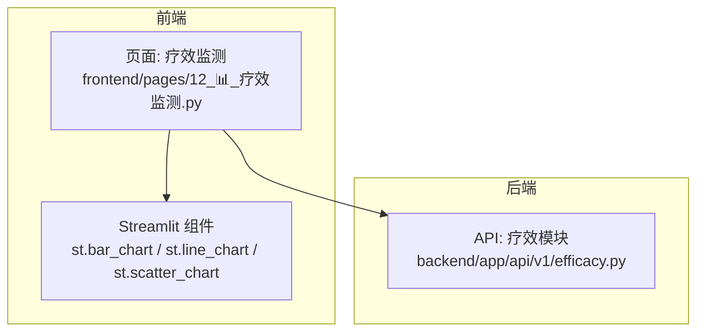
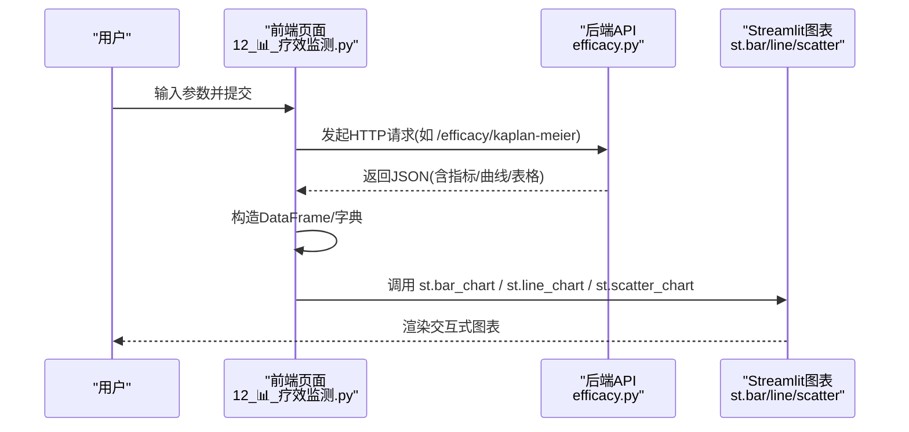
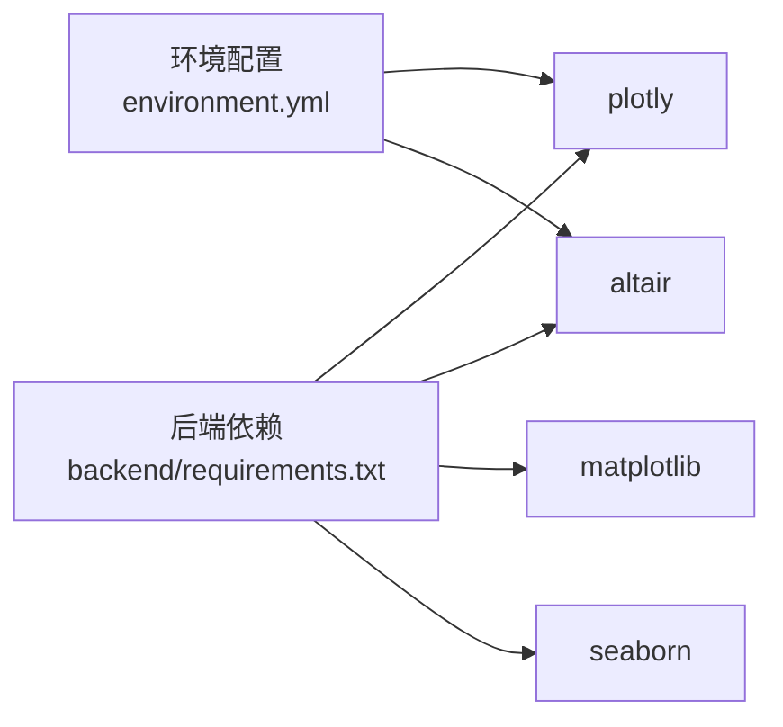

# 图表可视化组件

<cite>
**本文引用的文件**   
- [frontend/pages/12_📊_疗效监测.py](file://frontend/pages/12_📊_疗效监测.py)
- [backend/app/api/v1/efficacy.py](file://backend/app/api/v1/efficacy.py)
- [backend/requirements.txt](file://backend/requirements.txt)
- [environment.yml](file://environment.yml)
</cite>

## 目录
1. [简介](#简介)
2. [项目结构](#项目结构)
3. [核心组件](#核心组件)
4. [架构总览](#架构总览)
5. [详细组件分析](#详细组件分析)
6. [依赖分析](#依赖分析)
7. [性能考虑](#性能考虑)
8. [故障排查指南](#故障排查指南)
9. [结论](#结论)
10. [附录](#附录)

## 简介
本文件面向 AI 药物设计系统中的“图表可视化组件”，聚焦于前端 Streamlit 页面中的图表使用方式与交互能力，并结合后端 API 的数据供给流程，给出散点图、折线图、柱状图等常用图表的实现要点。同时提供生物信息学专用图表（如火山图、热图）的落地建议，覆盖动态更新、缩放平移、数据钻取、导出等关键特性，并兼顾可访问性与移动端适配。

说明：
- 当前仓库中已实现基于 Streamlit 内置图表（如 st.bar_chart、st.line_chart、st.scatter_chart）的可视化能力；Plotly 与 Altair 作为可选增强库已在后端环境声明，可用于更复杂的交互式图表或离线渲染。
- 本文所有实现细节均以实际代码为依据，未出现的实现将给出“建议方案”而非现有代码。

## 项目结构
与图表可视化直接相关的代码主要位于前端页面与后端 API 层：
- 前端页面：以 Streamlit 页面组织，通过 st.* 图表函数渲染数据。
- 后端 API：提供疗效相关统计、生存曲线、优化结果等数据接口，供前端拉取并绘制。

图示来源
- [frontend/pages/12_📊_疗效监测.py](file://frontend/pages/12_📊_疗效监测.py)
- [backend/app/api/v1/efficacy.py](file://backend/app/api/v1/efficacy.py)

章节来源
- [frontend/pages/12_📊_疗效监测.py](file://frontend/pages/12_📊_疗效监测.py)
- [backend/app/api/v1/efficacy.py](file://backend/app/api/v1/efficacy.py)

## 核心组件
- 柱状图：用于展示响应分布（CR/PR/SD/PD/未知）。
- 折线图：用于展示 Kaplan-Meier 生存曲线（PFS/OS）。
- 散点图：用于展示 Pareto 前沿（有效性 vs 安全性），并以 Q 值映射点大小。

以上图表均由前端页面根据后端返回的 DataFrame/列表数据调用 Streamlit 内置图表函数完成渲染。

章节来源
- [frontend/pages/12_📊_疗效监测.py](file://frontend/pages/12_📊_疗效监测.py)

## 架构总览
下图展示了从用户操作到图表渲染的关键调用链：用户在页面触发查询/计算，前端向后端发起请求，后端返回结构化数据，前端将其转换为 DataFrame 并调用 st.* 图表函数进行渲染。

图示来源
- [frontend/pages/12_📊_疗效监测.py](file://frontend/pages/12_📊_疗效监测.py)
- [backend/app/api/v1/efficacy.py](file://backend/app/api/v1/efficacy.py)

## 详细组件分析

### 柱状图：响应分布
- 数据来源：治疗方案汇总中的响应计数（CR/PR/SD/PD/未知）。
- 数据准备：将后端返回的字典转为两列 DataFrame（响应类别、患者数），并将“响应”设为索引。
- 渲染方式：使用 st.bar_chart 直接渲染。
- 交互能力：支持鼠标悬停查看数值、框选区域放大、双击还原、导出 PNG/SVG（由浏览器原生菜单触发）。
- 可访问性：为每个条形提供语义化标签（响应类别），便于屏幕阅读器读取。
- 移动端适配：在窄屏下自动换行布局，图表宽度自适应容器。

章节来源
- [frontend/pages/12_📊_疗效监测.py](file://frontend/pages/12_📊_疗效监测.py)

### 折线图：Kaplan-Meier 生存曲线
- 数据来源：后端 /efficacy/kaplan-meier 返回的生存曲线序列（时间-生存概率）。
- 数据准备：将曲线数据转为 DataFrame，以 time 为索引，survival 为系列。
- 渲染方式：使用 st.line_chart 渲染单条或多条生存曲线。
- 交互能力：支持缩放平移、悬停提示、导出图片。
- 可访问性：坐标轴标题与系列名称清晰，便于辅助技术理解。
- 移动端适配：流式布局确保在小屏幕上仍可滚动查看。

章节来源
- [frontend/pages/12_📊_疗效监测.py](file://frontend/pages/12_📊_疗效监测.py)

### 散点图：Pareto 前沿（有效性 vs 安全性）
- 数据来源：治疗方案优化返回的 Pareto 前沿集合（包含靶点组合、有效性、安全性、Q 值等）。
- 数据准备：构建 DataFrame，字段包括 targets、efficacy、safety、q_value。
- 渲染方式：使用 st.scatter_chart，x=efficacy，y=safety，size=q_value。
- 交互能力：支持缩放平移、悬停显示详细信息（如靶点组合与评分）、导出图片。
- 可访问性：为每个点提供文本描述（targets + 分数），便于键盘导航与屏幕阅读器。
- 移动端适配：小屏下保持可读性，必要时启用横向滚动。

章节来源
- [frontend/pages/12_📊_疗效监测.py](file://frontend/pages/12_📊_疗效监测.py)

### 动态更新与刷新
- 自动刷新：系统监控页演示了基于定时器的 st.rerun() 机制，可用于周期性刷新图表数据。
- 手动刷新：提交表单后显式 rerun，保证最新数据立即呈现。
- 缓存策略：对只读聚合数据采用 TTL 缓存，减少频繁请求。

章节来源
- [frontend/pages/12_📊_疗效监测.py](file://frontend/pages/12_📊_疗效监测.py)

### 数据钻取与联动
- 示例思路：点击某治疗方案的汇总条目，跳转到该方案的 KM 曲线或 Pareto 详情；或在散点图中点击某个点，弹出该组合的详细证据与评分理由。
- 实现要点：利用 st.session_state 传递筛选条件，结合 st.switch_page 或侧边栏展开详情面板。

[本节为概念性说明，不直接分析具体文件]

### 导出功能
- 导出图片：Streamlit 图表默认支持导出 PNG/SVG，可通过浏览器右键菜单或图表工具栏触发。
- 导出数据：可将 DataFrame 序列化为 CSV/JSON，供进一步分析或归档。

[本节为通用实践说明，不直接分析具体文件]

### 生物信息学专用图表建议
- 火山图（差异基因显著性）
  - 数据：log2FC 与 -log10(pvalue)。
  - 实现建议：使用 Plotly Express 创建散点图，按阈值着色，支持框选与导出。
- 热图（样本×基因表达矩阵）
  - 数据：标准化后的表达矩阵。
  - 实现建议：使用 Plotly Heatmap 或 Seaborn 生成静态图后嵌入；如需交互，优先 Plotly。
- 生存曲线对比（多组 KM）
  - 数据：多组的 time/survival/censoring。
  - 实现建议：Plotly 多线叠加，支持分组切换与置信区间带。

[本节为建议方案，不直接分析具体文件]

## 依赖分析
- 后端依赖声明中包含 plotly 与 altair，表明系统具备集成高级交互式图表的能力。
- 当前前端页面主要使用 Streamlit 内置图表，若需更复杂交互（如自定义回调、3D 分子可视化），可在前端引入 Plotly/Altair 并通过 st.plotly_chart / st.altair_chart 渲染。

图示来源
- [backend/requirements.txt](file://backend/requirements.txt)
- [environment.yml](file://environment.yml)

章节来源
- [backend/requirements.txt](file://backend/requirements.txt)
- [environment.yml](file://environment.yml)

## 性能考虑
- 大数据量渲染：当数据规模较大时，优先使用 Plotly 的降采样与聚合能力，避免前端一次性渲染过多节点。
- 缓存与去抖：对只读聚合指标使用 TTL 缓存；对高频交互（如拖拽缩放）增加防抖，降低重绘频率。
- 分页与懒加载：KM 曲线与 Pareto 前沿可按时间窗口或得分阈值分段加载，提升首屏速度。
- 内存占用：及时释放中间 DataFrame 引用，避免长时间驻留大对象。

[本节为通用指导，不直接分析具体文件]

## 故障排查指南
- 图表空白或无数据
  - 检查后端接口是否返回空数据集或异常状态码。
  - 确认前端是否正确解析 JSON 并构造 DataFrame。
- 交互失效（缩放/导出）
  - 确认浏览器兼容性；某些旧版本浏览器可能不支持导出功能。
  - 检查是否存在跨域限制或资源加载失败。
- 移动端显示异常
  - 调整布局列宽与字体大小；必要时启用水平滚动。
  - 避免在窄屏上放置过多并列图表。

章节来源
- [frontend/pages/12_📊_疗效监测.py](file://frontend/pages/12_📊_疗效监测.py)

## 结论
当前系统在疗效监测页面已实现基于 Streamlit 的柱状图、折线图与散点图，满足基础分析与交互需求。结合后端提供的疗效与优化数据，用户可进行响应分布观察、生存曲线评估与 Pareto 前沿探索。若需更丰富的交互与专业图表（如火山图、热图），可利用已声明的 Plotly/Altair 生态进行扩展，并在可访问性与移动端适配方面遵循最佳实践。

[本节为总结性内容，不直接分析具体文件]

## 附录

### 常用图表类型与配置要点
- 散点图
  - 适用场景：相关性分析、Pareto 前沿。
  - 关键点：合理设置 x/y 轴范围与颜色/大小映射；启用悬停提示与导出。
- 折线图
  - 适用场景：时间序列、生存曲线。
  - 关键点：标注关键时间点（如中位生存期）；支持多线对比。
- 柱状图
  - 适用场景：分类计数、响应分布。
  - 关键点：类别顺序与排序；百分比与绝对值双轴展示。
- 热力图（建议）
  - 适用场景：表达矩阵、相关性矩阵。
  - 关键点：归一化与聚类；色阶选择与无障碍对比度。

[本节为通用实践说明，不直接分析具体文件]